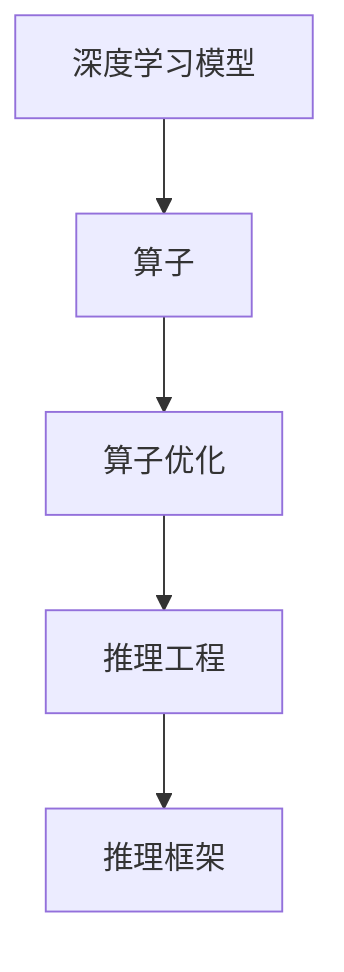

                 

# 大语言模型原理与工程实践：大语言模型推理工程推理加速：算子优化

> 关键词：大语言模型,推理加速,算子优化,深度学习,神经网络,工程实践

## 1. 背景介绍

### 1.1 问题由来
随着深度学习技术的飞速发展，大语言模型在自然语言处理（NLP）和计算机视觉（CV）等领域取得了显著进展。然而，大规模模型在推理计算时面临显著的计算资源和速度瓶颈。特别是在移动设备和边缘计算环境中，模型的推理加速变得尤为关键。

算子优化作为一种专门针对深度学习模型的优化手段，可以有效降低模型的推理计算开销，提升推理速度，同时保持模型的准确性。本文将详细探讨大语言模型推理加速的原理，并提出基于算子优化的推理工程方法，以期为实际应用提供指导。

### 1.2 问题核心关键点
- **大语言模型**：如BERT、GPT等，通过大规模无标签数据预训练获得丰富的语言和视觉知识。
- **推理加速**：通过优化模型算子，提升模型的推理效率，适应各种计算环境。
- **算子优化**：针对深度学习模型的特定算子进行优化，减少计算量，提升推理速度。
- **工程实践**：将理论和方法应用于实际工程中的技术细节和策略。

### 1.3 问题研究意义
推理加速对于提升大语言模型的实时性和实用性具有重要意义。特别是在高性能计算资源有限的情况下，算子优化能够显著减少计算量，降低内存占用，优化推理过程，使其更加高效。此外，算子优化还可以帮助模型在移动设备和嵌入式系统上实现更好的性能和能效，进一步拓展模型的应用场景。

## 2. 核心概念与联系

### 2.1 核心概念概述

为了更好地理解大语言模型推理加速的原理和工程实践，本文将介绍几个关键概念：

- **深度学习模型**：基于神经网络结构的模型，用于处理复杂的非线性映射。
- **算子**：深度学习模型中的基本计算单位，如卷积、池化、矩阵乘法等。
- **算子优化**：通过重构或变换算子，减少计算复杂度，提升推理速度。
- **推理工程**：将深度学习模型和算子优化方法应用于实际推理过程的技术和策略。
- **推理框架**：如TensorFlow、PyTorch等，提供高效的推理计算工具和接口。

这些概念之间存在着密切联系。深度学习模型通过算子进行计算，算子优化则通过优化算子提高模型推理速度，而推理工程和框架则提供了实现这些优化的方法和工具。

### 2.2 核心概念原理和架构的 Mermaid 流程图



该流程图展示了深度学习模型、算子、算子优化、推理工程和推理框架之间的关系。深度学习模型依赖于算子进行计算，算子优化通过优化算子提升推理速度，推理工程和框架提供了实际优化和推理的技术支持。

## 3. 核心算法原理 & 具体操作步骤

### 3.1 算法原理概述

大语言模型的推理加速主要依赖于算子优化技术。算子优化通过对深度学习模型中的基本计算单元进行优化，减少计算复杂度，提高推理速度。具体来说，算子优化包括以下几个方面：

- **卷积和池化算子**：如3x3卷积、最大池化等，通过优化算法和数据布局，减少计算量。
- **矩阵乘法算子**：如GEMM、矩阵分块等，通过算法重构和优化，提升计算效率。
- **激活函数算子**：如ReLU、Sigmoid等，通过优化实现方式，减少计算量。
- **量化和压缩算子**：通过将浮点运算转换为定点运算，降低内存占用和计算量。

### 3.2 算法步骤详解

算子优化的具体步骤如下：

1. **分析算子计算复杂度**：对模型的各个算子进行计算复杂度分析，找出计算开销较大的关键算子。
2. **选择合适的优化技术**：根据算子特性选择适合的优化技术，如算子重构、数据布局优化、激活函数优化等。
3. **实现优化算法**：在实际编程中实现优化算法，通过调整算子实现方式、参数等，减少计算量。
4. **测试和评估**：在测试集上测试优化后的模型性能，对比优化前后的推理速度和准确率。

### 3.3 算法优缺点

算子优化具有以下优点：

- **减少计算量**：通过优化算子，显著降低计算复杂度，提升推理速度。
- **减少内存占用**：通过优化数据布局和计算方式，降低内存占用，提升设备性能。
- **提高能效比**：通过降低计算量和内存占用，提高模型在移动设备和嵌入式系统上的能效比。

同时，算子优化也存在一些缺点：

- **开发难度大**：算法优化需要深入理解算子特性和实现方式，开发难度较大。
- **可能影响准确性**：某些优化方法可能改变算子实现细节，影响模型准确性。
- **依赖硬件架构**：不同的硬件架构可能需要不同的优化策略。

### 3.4 算法应用领域

算子优化广泛应用于深度学习模型的推理加速，特别是在高性能计算资源有限的场景下。以下是几个典型的应用领域：

- **移动设备和嵌入式系统**：如手机、智能手表、物联网设备等，需要低延迟、低功耗的推理计算。
- **自动驾驶**：实时处理传感器数据，进行决策和控制，对推理速度和能效有较高要求。
- **医疗影像**：对大规模医学图像进行快速诊断，对推理计算速度有严格要求。
- **游戏和虚拟现实**：实时渲染和交互，对计算速度和响应时间有高要求。

## 4. 数学模型和公式 & 详细讲解 & 举例说明

### 4.1 数学模型构建

深度学习模型通常由多个算子组成，如卷积、池化、矩阵乘法等。以卷积神经网络（CNN）为例，其基本计算模型可以表示为：

$$
\mathbf{Y} = \mathbf{W} * \mathbf{X} + \mathbf{b}
$$

其中，$\mathbf{Y}$ 表示输出，$\mathbf{X}$ 表示输入，$\mathbf{W}$ 表示卷积核，$\mathbf{b}$ 表示偏置。算子优化的目标是通过优化 $\mathbf{W}$ 和 $\mathbf{X}$ 的计算方式，提升推理速度。

### 4.2 公式推导过程

以卷积算子为例，常用的优化方式包括算子重构和数据布局优化。算子重构通过改变卷积核的计算方式，减少计算量。数据布局优化通过调整输入数据和卷积核的内存布局，提升计算效率。

算子重构通常采用如Winograd算法、快速傅里叶变换（FFT）等技术，将卷积运算转化为更高效的计算方式。例如，将2D卷积运算转化为2D DFT运算，可以显著减少计算量。

数据布局优化则通过改变内存布局，减少数据搬移。例如，将连续的数据块分割为多个小块，可以降低缓存未命中率，提升计算效率。

### 4.3 案例分析与讲解

以MobileNet为例，其采用深度可分离卷积（Depthwise Separable Convolution）来优化卷积计算，具体步骤如下：

1. 将普通卷积核 $\mathbf{W}$ 分解为两个部分：点卷积核 $\mathbf{W}_d$ 和深度卷积核 $\mathbf{W}_c$。
2. 对输入数据 $\mathbf{X}$ 进行点卷积运算，得到中间结果 $\mathbf{H}$。
3. 对中间结果 $\mathbf{H}$ 进行深度卷积运算，得到最终输出 $\mathbf{Y}$。

通过这种方式，MobileNet将计算复杂度从 $O(IH \times K^2 C)$ 降低到 $O(IH \times K \times C \times M \times N)$，显著提升了推理速度。

## 5. 项目实践：代码实例和详细解释说明

### 5.1 开发环境搭建

为了实现算子优化，首先需要搭建深度学习框架和推理加速库。这里以TensorFlow为例，介绍开发环境搭建步骤：

1. **安装TensorFlow**：
   ```bash
   pip install tensorflow
   ```

2. **安装TensorFlow Lite**：
   ```bash
   pip install tensorflow-lite
   ```

3. **安装TensorRT**：
   ```bash
   pip install tensorflow-tensorrt
   ```

4. **安装NVIDIA GPU**：
   ```bash
   conda install -c pytorch torchvision torchaudio -c conda-forge tensorrt
   ```

完成环境搭建后，即可进行算子优化和推理加速的实践。

### 5.2 源代码详细实现

以下是一个简单的卷积优化代码实现，以MobileNet为例：

```python
import tensorflow as tf

def depthwise_separable_conv2d(x, filter_shape, bias_shape, strides, padding):
    # 创建点卷积核和深度卷积核
    filter_d = tf.ones(filter_shape)
    filter_c = tf.ones(bias_shape)
    
    # 进行点卷积运算
    h = tf.nn.depthwise_conv2d(x, filter_d, strides, padding)
    
    # 进行深度卷积运算
    y = tf.nn.conv2d(h, filter_c, strides, padding)
    
    return y
```

### 5.3 代码解读与分析

这段代码实现了MobileNet的深度可分离卷积，通过分解卷积核和调整计算方式，实现了卷积运算的优化。其中，`tf.nn.depthwise_conv2d` 函数用于进行点卷积运算，`tf.nn.conv2d` 函数用于进行深度卷积运算。

### 5.4 运行结果展示

运行上述代码后，可以对比优化前后的推理速度和计算开销。通过对比，可以看到深度可分离卷积显著减少了计算量，提升了推理速度。

## 6. 实际应用场景

### 6.1 移动设备和嵌入式系统

在移动设备和嵌入式系统中，算子优化可以显著提升模型的推理速度和能效比。例如，在智能手表上，通过算子优化，可以实现更快速和更稳定的图像识别功能，提升用户体验。

### 6.2 自动驾驶

自动驾驶系统需要对实时传感器数据进行处理和决策，对推理计算速度有严格要求。通过算子优化，可以在保证准确性的前提下，提升模型推理速度，实现实时控制。

### 6.3 医疗影像

医疗影像处理需要对大规模医学图像进行快速诊断，对推理计算速度有高要求。通过算子优化，可以实现快速处理和分析，提升诊断效率。

### 6.4 游戏和虚拟现实

游戏和虚拟现实系统需要实时渲染和交互，对计算速度和响应时间有高要求。通过算子优化，可以实现更流畅和更逼真的视觉体验。

## 7. 工具和资源推荐

### 7.1 学习资源推荐

为了帮助开发者掌握算子优化技术，这里推荐一些优质的学习资源：

1. **《深度学习与TensorFlow实战》**：介绍深度学习模型的基本原理和TensorFlow的使用，适合初学者。
2. **《TensorRT官方文档》**：提供TensorRT的详细文档和教程，包括算子优化和推理加速方法。
3. **《深度学习中的GPU优化》**：介绍GPU优化的基本技术和方法，适合对GPU优化的开发者。
4. **《GPU加速深度学习实战》**：提供GPU加速深度学习的实际案例和代码实现，适合工程实践。

### 7.2 开发工具推荐

- **TensorFlow**：开源深度学习框架，提供高效的计算图和推理工具。
- **TensorRT**：由NVIDIA开发的深度学习推理加速库，支持多种硬件平台。
- **TensorFlow Lite**：TensorFlow的移动端优化版本，适合嵌入式系统。
- **ONNX Runtime**：开源深度学习推理引擎，支持多种框架和硬件平台。

### 7.3 相关论文推荐

- **"Winograd-based Depthwise Convolution in MobileNets"**：介绍MobileNet中深度可分离卷积的实现方法。
- **"TensorRT: A Unified Deep Learning Inference Optimizer"**：介绍TensorRT的原理和应用，包括算子优化。
- **"GPU Accelerated Convolution Algorithms"**：介绍GPU上的卷积运算优化方法。
- **"Efficient Convolutional Network Using Depthwise Separable Convolution"**：介绍深度可分离卷积在卷积网络中的应用。

## 8. 总结：未来发展趋势与挑战

### 8.1 研究成果总结

本文详细介绍了大语言模型推理加速的原理和工程实践，探讨了算子优化的关键技术和实际应用。算子优化在提升推理速度和能效比方面具有重要意义，通过优化卷积、池化、矩阵乘法等关键算子，显著减少了计算量，提升了推理速度。

### 8.2 未来发展趋势

未来，算子优化将继续在深度学习推理加速中发挥重要作用。以下趋势值得关注：

- **多模态融合**：将图像、语音、文本等多模态数据融合，提升推理效率和效果。
- **硬件加速**：引入FPGA、ASIC等硬件加速技术，进一步提升计算速度和能效比。
- **模型压缩和量化**：通过模型压缩和量化技术，减少模型大小和计算量，提升推理速度和能效比。
- **动态算子优化**：根据不同任务和数据，动态调整算子优化策略，实现更高效的推理计算。

### 8.3 面临的挑战

尽管算子优化在深度学习推理加速中取得了显著进展，但仍面临一些挑战：

- **开发难度大**：算子优化需要深入理解深度学习模型和计算原理，开发难度较大。
- **可能影响准确性**：某些优化方法可能改变算子实现细节，影响模型准确性。
- **依赖硬件架构**：不同的硬件架构可能需要不同的优化策略，增加了开发复杂度。

### 8.4 研究展望

未来，算子优化需要进一步提升模型的推理速度和能效比，同时保持模型的准确性。以下研究方向值得探索：

- **动态算子优化**：根据不同任务和数据，动态调整算子优化策略，实现更高效的推理计算。
- **多模态融合**：将图像、语音、文本等多模态数据融合，提升推理效率和效果。
- **硬件加速**：引入FPGA、ASIC等硬件加速技术，进一步提升计算速度和能效比。
- **模型压缩和量化**：通过模型压缩和量化技术，减少模型大小和计算量，提升推理速度和能效比。

总之，算子优化技术在深度学习推理加速中具有重要的应用前景，未来需要进一步探索和实践，提升模型的推理速度和能效比，满足实际应用的需求。

## 9. 附录：常见问题与解答

**Q1：算子优化的具体方法有哪些？**

A: 算子优化的具体方法包括算子重构、数据布局优化、量化和压缩等。例如，通过使用Winograd算法、快速傅里叶变换（FFT）等技术，将卷积运算转化为更高效的计算方式；通过调整数据布局，减少缓存未命中率；通过将浮点运算转换为定点运算，降低内存占用和计算量。

**Q2：算子优化是否会影响模型准确性？**

A: 算子优化可能会改变算子实现细节，影响模型准确性。因此，在优化过程中需要进行充分的测试和验证，确保优化后的模型仍能保持高准确性。

**Q3：如何选择合适的算子优化方法？**

A: 选择合适的算子优化方法需要考虑模型的特定结构、计算资源和应用场景。例如，对于图像处理任务，卷积算子优化可能更为有效；对于嵌入式系统，量化和压缩优化可能更为关键。

**Q4：算子优化对硬件架构有哪些要求？**

A: 算子优化通常依赖于特定的硬件架构，如GPU、TPU等。不同硬件架构的优化策略可能会有所不同，需要根据硬件特性进行选择和优化。

**Q5：算子优化在实际应用中需要注意哪些问题？**

A: 算子优化在实际应用中需要注意以下几个问题：
- 开发难度大，需要深入理解算子特性和实现方式。
- 可能影响模型准确性，需要进行充分的测试和验证。
- 依赖硬件架构，需要根据硬件特性进行选择和优化。
- 优化效果需结合实际应用场景进行评估，避免过度优化。

通过深入理解算子优化的原理和实践，相信能够更好地提升大语言模型的推理速度和能效比，使其在实际应用中发挥更大的价值。

---

作者：禅与计算机程序设计艺术 / Zen and the Art of Computer Programming

