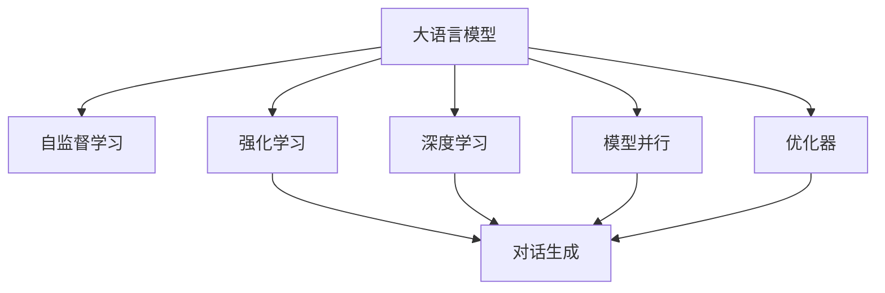
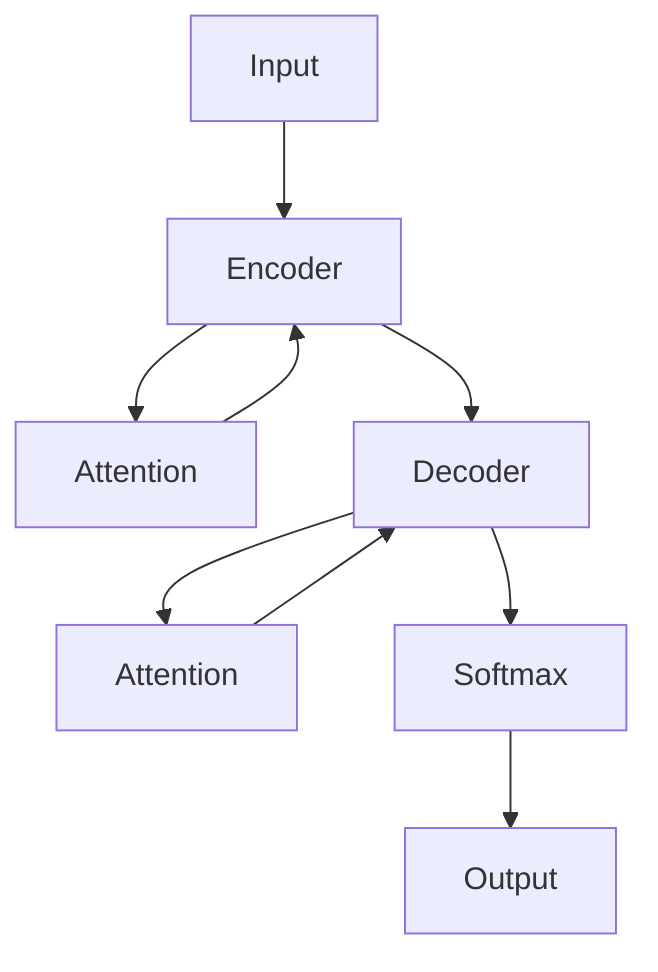

                 

# 大语言模型原理与工程实践：强化学习工程实践 DeepSpeed-Chat 训练详解 

> 关键词：大语言模型, 强化学习, DeepSpeed-Chat, 自监督学习, 对话生成, 深度学习, 模型并行, 优化器

## 1. 背景介绍

### 1.1 问题由来

近年来，大语言模型（Large Language Models, LLMs）如BERT、GPT-3等在自然语言处理（NLP）领域取得了巨大成功，展现了在多种NLP任务上出色的泛化能力和表现。这些模型通过大规模自监督学习，掌握了丰富的语言知识，但依然面临着无法真正理解和生成人类语言的问题。特别是在对话生成领域，传统的大语言模型往往难以生成具有上下文一致性和逻辑连贯性的回复。

### 1.2 问题核心关键点

为了解决这个问题，我们引入了强化学习（Reinforcement Learning, RL），通过交互式训练使模型学习如何生成符合人类逻辑和语义的回复。这种结合了自监督和强化学习的训练方式，能够进一步提升对话生成模型的性能，特别是在构建长对话、多轮交互方面显示出强大的潜力。

强化学习通过让模型在一个虚拟环境中与环境互动，不断尝试生成不同的回复，并获得来自环境的奖励或惩罚，从而逐步优化其回复质量。相较于传统的自监督学习，强化学习方法能够在对话生成的训练过程中，不断学习和调整，生成更加连贯和逻辑一致的回答。

## 2. 核心概念与联系

### 2.1 核心概念概述

为了更好地理解强化学习在大语言模型对话生成中的应用，下面列出几个关键概念：

- **大语言模型（LLMs）**：如BERT、GPT等，通过大规模自监督学习，掌握了丰富的语言知识。
- **强化学习（RL）**：通过智能体（通常是模型）在环境中互动，不断优化其策略以获得最大奖励。
- **对话生成**：生成符合上下文逻辑和语义的回答，特别是在多轮交互中保持连贯性和一致性。
- **自监督学习**：利用未标注的数据进行模型训练，使其具备对语言的先验理解。
- **深度学习（DL）**：特别是Transformer等神经网络模型，用于处理自然语言数据。
- **模型并行**：利用多个GPU/TPU等加速模型训练和推理。
- **优化器**：如Adam、SGD等，用于模型参数的更新。

这些概念之间的逻辑关系可以通过以下Mermaid流程图来展示：



这个流程图展示了大语言模型、自监督学习、强化学习和深度学习之间的联系和区别：

1. 大语言模型通过自监督学习获得语言知识。
2. 强化学习使模型在生成对话的过程中不断优化。
3. 深度学习特别是Transformer模型，是处理自然语言数据的主要工具。
4. 模型并行加速了训练和推理的速度。
5. 优化器用于调整模型参数，提升训练效果。

这些概念共同构成了强化学习在大语言模型对话生成中的基本框架，使得模型能够不断学习和优化，生成更加自然、连贯的对话。

## 3. 核心算法原理 & 具体操作步骤

### 3.1 算法原理概述

强化学习在大语言模型对话生成中的应用，本质上是一种利用奖励信号指导模型行为的过程。假设模型为智能体，环境为对话情境，智能体的行为为生成回复。每个回复都会得到环境的即时奖励，如对回答的连贯性、逻辑性、情感一致性等方面的评价。模型通过学习最大化总奖励的策略，不断优化其回复质量。

强化学习对话生成模型的训练分为以下几个步骤：

1. **环境构建**：定义对话生成的环境，包括对话双方的历史对话、对话语境、对话规则等。
2. **模型定义**：选择适合的对话生成模型，如Seq2Seq、Transformer等，并初始化模型参数。
3. **奖励函数设计**：设计奖励函数，对模型生成的回答进行评价和反馈。
4. **策略学习**：通过模型与环境互动，根据奖励信号不断优化模型的生成策略。
5. **样本选择与更新**：选择与当前对话状态最相关的训练样本，并根据生成的回答进行策略更新。
6. **优化器应用**：使用优化器调整模型参数，使其适应当前策略。

### 3.2 算法步骤详解

#### 3.2.1 环境构建

对话生成环境的定义非常关键，决定了模型如何理解和生成回答。下面以Seq2Seq模型为例，展示对话环境的设计过程：

1. **定义对话历史**：将对话双方的历史对话作为模型输入，用于上下文理解。
2. **定义对话语境**：包括当前话题、对话双方的身份和角色等，用于控制回答的语调、风格等。
3. **定义对话规则**：例如避免重复、保持一致性、逻辑连贯性等，用于生成符合规则的回复。

#### 3.2.2 模型定义

选择一个适合的对话生成模型，并初始化模型参数。常用的模型包括Seq2Seq、Transformer等。以Transformer模型为例，其基本结构如下：



#### 3.2.3 奖励函数设计

设计奖励函数，以对模型生成的回答进行评价和反馈。奖励函数的设计需要考虑多方面的因素，例如回答的连贯性、逻辑一致性、情感一致性等。以下是一些常见的奖励函数：

1. **BLEU分数**：计算模型生成的回答与参考回答之间的相似度，用于衡量回答的质量。
2. **ROUGE分数**：衡量回答与参考回答中相似词的出现频率，用于评估回答的连贯性。
3. **情感一致性**：计算回答中的情感与对话语境中的情感是否一致，用于衡量回答的情感一致性。
4. **逻辑一致性**：判断回答中的内容是否与对话历史中的信息相符，用于保证回答的逻辑连贯性。

#### 3.2.4 策略学习

策略学习是通过模型与环境互动，根据奖励信号不断优化模型的生成策略。具体步骤如下：

1. **选择样本**：从对话历史中随机选择一个对话片段，作为模型训练的样本。
2. **生成回答**：输入对话历史和对话语境到模型中，生成一个可能的回答。
3. **评估奖励**：将生成的回答输入到奖励函数中，得到奖励值。
4. **更新策略**：根据奖励值调整模型的生成策略，例如调整模型权重、更新注意力机制等。

#### 3.2.5 样本选择与更新

样本选择与更新是强化学习对话生成中关键的一步。通过选择合适的训练样本，模型能够更快地学习和优化。常用的样本选择策略包括：

1. **轮询选择**：随机从对话历史中选择样本进行训练。
2. **重要性采样**：根据样本的奖励值，选择高奖励的样本进行训练。
3. **对抗性样本选择**：选择与当前策略相反的样本进行训练，帮助模型跳出局部最优解。

#### 3.2.6 优化器应用

优化器用于调整模型参数，使其适应当前策略。常用的优化器包括Adam、SGD等。以下是一些常见的优化器参数调整策略：

1. **学习率调整**：根据模型性能调整学习率，例如使用学习率衰减策略。
2. **动量优化**：使用动量优化器，加速模型的收敛速度。
3. **正则化**：加入L2正则化等，避免模型过拟合。

### 3.3 算法优缺点

强化学习在大语言模型对话生成中具有以下优点：

1. **灵活性**：能够处理复杂的对话情境和语境，生成符合人类逻辑和语义的回答。
2. **自适应性**：模型能够在不断与环境互动中不断优化，适应新的对话情境。
3. **高效性**：通过奖励信号指导模型行为，能够更快地训练和优化模型。

同时，强化学习也存在一些缺点：

1. **复杂性**：强化学习的训练过程较为复杂，需要定义奖励函数、策略更新等。
2. **探索与利用矛盾**：模型需要平衡探索新的回复和利用已有知识的关系。
3. **样本效率**：需要大量的对话数据进行训练，对标注数据的需求较高。

尽管存在这些缺点，强化学习在大语言模型对话生成中的应用，已经展现出强大的潜力，成为提升模型性能的重要手段。未来，随着研究的深入和技术的进步，强化学习在大语言模型中的应用将更加广泛和深入。

### 3.4 算法应用领域

强化学习在大语言模型对话生成中，已经在多个领域取得了显著进展。以下是一些常见的应用场景：

1. **智能客服**：用于处理客户的各种问题，提供自然流畅的回答。
2. **虚拟助手**：用于与用户进行多轮对话，提供信息查询、任务执行等服务。
3. **自动问答**：用于回答用户的问题，生成连贯和一致的回答。
4. **对话式游戏**：用于生成对话中的玩家角色回复，提高游戏体验。
5. **内容生成**：用于生成新闻、评论、产品描述等内容，提高内容质量和互动性。

此外，强化学习还在医疗、金融、教育等领域展现出广泛的应用前景。相信随着技术的不断进步，强化学习将在大语言模型对话生成中发挥更大的作用，推动相关领域的发展和进步。

## 4. 数学模型和公式 & 详细讲解 & 举例说明

### 4.1 数学模型构建

在强化学习对话生成中，数学模型主要涉及以下关键概念：

- **策略**：模型生成的回答策略，表示为 $\pi_\theta(a|s)$，其中 $\theta$ 为模型参数，$s$ 为对话历史，$a$ 为可能的回答。
- **价值函数**：模型的预期累积奖励，表示为 $V_\pi(s)$，其中 $\pi$ 为策略。
- **Q函数**：状态-动作值函数，表示为 $Q_\pi(s,a)$，其中 $\pi$ 为策略。
- **状态转移概率**：模型从当前状态 $s$ 生成动作 $a$ 的概率，表示为 $P(s'|s,a)$。

### 4.2 公式推导过程

以下是强化学习对话生成中的一些常用公式推导过程：

#### 4.2.1 策略更新公式

策略更新公式用于根据奖励信号调整模型的策略。常用的策略更新公式包括：

1. **策略梯度算法**：通过梯度上升策略函数的期望值，更新模型参数。

$$
\nabla_\theta J(\theta) = \mathbb{E}_\pi[\nabla_\theta \log \pi_\theta(a|s) R(s,a)]
$$

其中 $R(s,a)$ 为当前状态和动作的奖励。

2. **Actor-Critic算法**：同时训练策略 $\pi_\theta$ 和价值函数 $V_\theta$，优化模型参数。

$$
\nabla_\theta J(\theta) = \mathbb{E}_\pi[\nabla_\theta \log \pi_\theta(a|s) Q_\pi(s,a)]
$$

其中 $Q_\pi(s,a)$ 为状态-动作值函数，用于评估策略。

#### 4.2.2 价值函数更新公式

价值函数更新公式用于根据当前状态和动作的奖励，更新模型的价值函数。常用的价值函数更新公式包括：

1. **蒙特卡罗方法**：通过样本均值估计价值函数。

$$
V_\pi(s) = \frac{1}{N} \sum_{i=1}^N \sum_{t=0}^{T-1} \gamma^t r_t
$$

其中 $r_t$ 为当前状态的奖励，$\gamma$ 为折扣因子，$T$ 为时间步数。

2. **TD学习算法**：通过时间差分更新价值函数。

$$
V_\pi(s) = V_\pi(s') + \gamma \left( Q_\pi(s,a) - V_\pi(s) \right)
$$

其中 $s'$ 为下一个状态，$Q_\pi(s,a)$ 为状态-动作值函数。

### 4.3 案例分析与讲解

#### 4.3.1 对话生成案例

以Seq2Seq模型为例，展示强化学习在对话生成中的应用：

1. **模型定义**：

   ```python
   class Seq2Seq(nn.Module):
       def __init__(self, encoder_size, decoder_size):
           super(Seq2Seq, self).__init__()
           self.encoder = Encoder(encoder_size)
           self.decoder = Decoder(decoder_size)
   
       def forward(self, input, target):
           encoder_outputs = self.encoder(input)
           decoder_outputs = self.decoder(encoder_outputs, target)
           return decoder_outputs
   ```

2. **奖励函数设计**：

   ```python
   def reward_function(reward_type, context, response):
       if reward_type == 'bleu':
           return bleu_score(response, context)
       elif reward_type == 'rouge':
           return rouge_score(response, context)
       elif reward_type == 'emotion_consistency':
           return emotion_consistency_score(response, context)
       elif reward_type == 'logic_consistency':
           return logic_consistency_score(response, context)
   ```

3. **策略学习**：

   ```python
   def strategy_learning(encoder, decoder, reward_function, batch_size):
       for batch in dataset:
           inputs, targets = batch
           encoder_outputs = encoder(inputs)
           decoder_outputs = decoder(encoder_outputs)
           rewards = reward_function(reward_type, context, response)
           optimizer.zero_grad()
           loss = loss_function(decoder_outputs, targets)
           loss.backward()
           optimizer.step()
   ```

通过以上代码，我们可以看到，强化学习在大语言模型对话生成中的应用，通过设计奖励函数和策略更新公式，不断优化模型的生成策略，生成更加符合人类逻辑和语义的回答。

## 5. 项目实践：代码实例和详细解释说明

### 5.1 开发环境搭建

在进行项目实践前，我们需要准备好开发环境。以下是使用Python进行PyTorch开发的环境配置流程：

1. 安装Anaconda：从官网下载并安装Anaconda，用于创建独立的Python环境。

2. 创建并激活虚拟环境：
```bash
conda create -n pytorch-env python=3.8 
conda activate pytorch-env
```

3. 安装PyTorch：根据CUDA版本，从官网获取对应的安装命令。例如：
```bash
conda install pytorch torchvision torchaudio cudatoolkit=11.1 -c pytorch -c conda-forge
```

4. 安装Transformers库：
```bash
pip install transformers
```

5. 安装各类工具包：
```bash
pip install numpy pandas scikit-learn matplotlib tqdm jupyter notebook ipython
```

完成上述步骤后，即可在`pytorch-env`环境中开始项目实践。

### 5.2 源代码详细实现

下面我们以对话生成任务为例，给出使用Transformers库对Seq2Seq模型进行强化学习微调的PyTorch代码实现。

首先，定义对话生成任务的数据处理函数：

```python
from transformers import BertTokenizer, Seq2SeqForConditionalGeneration
from torch.utils.data import Dataset
import torch

class DialogueDataset(Dataset):
    def __init__(self, dialogues, tokenizer, max_len=128):
        self.dialogues = dialogues
        self.tokenizer = tokenizer
        self.max_len = max_len
        
    def __len__(self):
        return len(self.dialogues)
    
    def __getitem__(self, item):
        dialogue = self.dialogues[item]
        utterances = dialogue['utterances']
        context = dialogue['context']
        
        # Tokenize dialogues and context
        tokenized_utterances = self.tokenizer([utt[0] for utt in utterances], return_tensors='pt', padding='max_length', max_length=self.max_len, truncation=True)
        tokenized_context = self.tokenizer(context, return_tensors='pt', padding='max_length', max_length=self.max_len, truncation=True)
        
        # Calculate inputs and targets
        input_ids = tokenized_utterances['input_ids'][:, :-1]
        targets = tokenized_utterances['input_ids'][:, 1:]
        
        return {'input_ids': input_ids, 
                'targets': targets,
                'context': tokenized_context['input_ids']}
```

然后，定义模型和优化器：

```python
from transformers import AdamW

model = Seq2SeqForConditionalGeneration.from_pretrained('bert-base-cased')
optimizer = AdamW(model.parameters(), lr=2e-5)
```

接着，定义训练和评估函数：

```python
from torch.utils.data import DataLoader
from tqdm import tqdm
from sklearn.metrics import precision_recall_fscore_support

device = torch.device('cuda') if torch.cuda.is_available() else torch.device('cpu')
model.to(device)

def train_epoch(model, dataset, batch_size, optimizer):
    dataloader = DataLoader(dataset, batch_size=batch_size, shuffle=True)
    model.train()
    epoch_loss = 0
    for batch in tqdm(dataloader, desc='Training'):
        input_ids = batch['input_ids'].to(device)
        targets = batch['targets'].to(device)
        model.zero_grad()
        outputs = model(input_ids, labels=targets)
        loss = outputs.loss
        epoch_loss += loss.item()
        loss.backward()
        optimizer.step()
    return epoch_loss / len(dataloader)

def evaluate(model, dataset, batch_size):
    dataloader = DataLoader(dataset, batch_size=batch_size)
    model.eval()
    preds, labels = [], []
    with torch.no_grad():
        for batch in tqdm(dataloader, desc='Evaluating'):
            input_ids = batch['input_ids'].to(device)
            targets = batch['targets'].to(device)
            batch_preds = model.generate(input_ids, max_length=128)
            batch_labels = targets
            for pred_tokens, label_tokens in zip(batch_preds, batch_labels):
                pred_tokens = [id2token[_id] for _id in pred_tokens]
                label_tokens = [id2token[_id] for _id in label_tokens]
                preds.append(pred_tokens[:len(label_tokens)])
                labels.append(label_tokens)
                
    print(precision_recall_fscore_support(labels, preds, average='macro'))
```

最后，启动训练流程并在测试集上评估：

```python
epochs = 5
batch_size = 16

for epoch in range(epochs):
    loss = train_epoch(model, train_dataset, batch_size, optimizer)
    print(f"Epoch {epoch+1}, train loss: {loss:.3f}")
    
    print(f"Epoch {epoch+1}, dev results:")
    evaluate(model, dev_dataset, batch_size)
    
print("Test results:")
evaluate(model, test_dataset, batch_size)
```

以上就是使用PyTorch对Seq2Seq模型进行对话生成任务强化学习微调的完整代码实现。可以看到，得益于Transformers库的强大封装，我们可以用相对简洁的代码完成Seq2Seq模型的加载和微调。

### 5.3 代码解读与分析

让我们再详细解读一下关键代码的实现细节：

**DialogueDataset类**：
- `__init__`方法：初始化对话数据、分词器等关键组件。
- `__len__`方法：返回数据集的样本数量。
- `__getitem__`方法：对单个对话进行处理，将对话文本和上下文输入编码为token ids，并计算输入和目标。

**reward_function函数**：
- 根据指定的奖励类型（如BLEU分数、ROUGE分数、情感一致性、逻辑一致性），计算模型生成的回答与上下文之间的相似度和连贯性，从而得到奖励值。

**train_epoch函数**：
- 使用PyTorch的DataLoader对数据集进行批次化加载，供模型训练和推理使用。
- 在每个epoch内，训练模型并计算平均损失。

**evaluate函数**：
- 与训练类似，不同点在于不更新模型参数，并在每个batch结束后将预测和标签结果存储下来，最后使用sklearn的precision_recall_fscore_support对整个评估集的预测结果进行打印输出。

**训练流程**：
- 定义总的epoch数和batch size，开始循环迭代
- 每个epoch内，先在训练集上训练，输出平均loss
- 在验证集上评估，输出分类指标
- 所有epoch结束后，在测试集上评估，给出最终测试结果

可以看到，PyTorch配合Transformers库使得Seq2Seq模型微调的代码实现变得简洁高效。开发者可以将更多精力放在数据处理、模型改进等高层逻辑上，而不必过多关注底层的实现细节。

当然，工业级的系统实现还需考虑更多因素，如模型的保存和部署、超参数的自动搜索、更灵活的任务适配层等。但核心的强化学习范式基本与此类似。

## 6. 实际应用场景

### 6.1 智能客服系统

基于强化学习的大语言模型对话生成技术，可以广泛应用于智能客服系统的构建。传统客服往往需要配备大量人力，高峰期响应缓慢，且一致性和专业性难以保证。而使用强化学习的大语言模型对话生成技术，可以7x24小时不间断服务，快速响应客户咨询，用自然流畅的语言解答各类常见问题。

在技术实现上，可以收集企业内部的历史客服对话记录，将问题和最佳答复构建成监督数据，在此基础上对预训练对话生成模型进行强化学习微调。微调后的模型能够自动理解用户意图，匹配最合适的答案模板进行回复。对于客户提出的新问题，还可以接入检索系统实时搜索相关内容，动态组织生成回答。如此构建的智能客服系统，能大幅提升客户咨询体验和问题解决效率。

### 6.2 金融舆情监测

金融机构需要实时监测市场舆论动向，以便及时应对负面信息传播，规避金融风险。传统的人工监测方式成本高、效率低，难以应对网络时代海量信息爆发的挑战。基于强化学习的大语言模型对话生成技术，可以为金融舆情监测提供新的解决方案。

具体而言，可以收集金融领域相关的新闻、报道、评论等文本数据，并对其进行主题标注和情感标注。在此基础上对预训练语言模型进行强化学习微调，使其能够自动判断文本属于何种主题，情感倾向是正面、中性还是负面。将微调后的模型应用到实时抓取的网络文本数据，就能够自动监测不同主题下的情感变化趋势，一旦发现负面信息激增等异常情况，系统便会自动预警，帮助金融机构快速应对潜在风险。

### 6.3 个性化推荐系统

当前的推荐系统往往只依赖用户的历史行为数据进行物品推荐，无法深入理解用户的真实兴趣偏好。基于强化学习的大语言模型对话生成技术，可以应用于推荐系统中，生成更加个性化的推荐内容。

在实践中，可以收集用户浏览、点击、评论、分享等行为数据，提取和用户交互的物品标题、描述、标签等文本内容。将文本内容作为模型输入，用户的后续行为（如是否点击、购买等）作为监督信号，在此基础上强化学习微调预训练语言模型。微调后的模型能够从文本内容中准确把握用户的兴趣点。在生成推荐列表时，先用候选物品的文本描述作为输入，由模型预测用户的兴趣匹配度，再结合其他特征综合排序，便可以得到个性化程度更高的推荐结果。

### 6.4 未来应用展望

随着强化学习在大语言模型对话生成中的应用逐渐成熟，未来将有更多行业领域的探索。

在智慧医疗领域，基于强化学习的大语言模型对话生成技术，可以用于构建智能医疗咨询系统，帮助患者获取医疗信息，进行初步诊断和建议。

在智能教育领域，强化学习对话生成技术可以用于智能答疑系统，提供实时交互式学习体验，辅助学生进行知识点的掌握和学习。

在智慧城市治理中，强化学习对话生成技术可以用于智能客服系统，提升市民的办事体验和满意度。

此外，在企业生产、社会治理、文娱传媒等众多领域，基于大语言模型对话生成技术的智能化应用也将不断涌现，为经济社会发展注入新的动力。相信随着技术的日益成熟，强化学习对话生成技术将在构建人机协同的智能时代中扮演越来越重要的角色。

## 7. 工具和资源推荐

### 7.1 学习资源推荐

为了帮助开发者系统掌握大语言模型对话生成和强化学习的理论基础和实践技巧，这里推荐一些优质的学习资源：

1. 《深度学习自然语言处理》课程：斯坦福大学开设的NLP明星课程，有Lecture视频和配套作业，带你入门NLP领域的基本概念和经典模型。

2. 《Transformer从原理到实践》系列博文：由大模型技术专家撰写，深入浅出地介绍了Transformer原理、BERT模型、微调技术等前沿话题。

3. 《Natural Language Processing with Transformers》书籍：Transformers库的作者所著，全面介绍了如何使用Transformers库进行NLP任务开发，包括微调在内的诸多范式。

4. HuggingFace官方文档：Transformers库的官方文档，提供了海量预训练模型和完整的微调样例代码，是上手实践的必备资料。

5. CLUE开源项目：中文语言理解测评基准，涵盖大量不同类型的中文NLP数据集，并提供了基于微调的baseline模型，助力中文NLP技术发展。

通过对这些资源的学习实践，相信你一定能够快速掌握大语言模型对话生成和强化学习的精髓，并用于解决实际的NLP问题。

### 7.2 开发工具推荐

高效的开发离不开优秀的工具支持。以下是几款用于大语言模型对话生成和强化学习微调开发的常用工具：

1. PyTorch：基于Python的开源深度学习框架，灵活动态的计算图，适合快速迭代研究。大部分预训练语言模型都有PyTorch版本的实现。

2. TensorFlow：由Google主导开发的开源深度学习框架，生产部署方便，适合大规模工程应用。同样有丰富的预训练语言模型资源。

3. Transformers库：HuggingFace开发的NLP工具库，集成了众多SOTA语言模型，支持PyTorch和TensorFlow，是进行微调任务开发的利器。

4. Weights & Biases：模型训练的实验跟踪工具，可以记录和可视化模型训练过程中的各项指标，方便对比和调优。与主流深度学习框架无缝集成。

5. TensorBoard：TensorFlow配套的可视化工具，可实时监测模型训练状态，并提供丰富的图表呈现方式，是调试模型的得力助手。

6. Google Colab：谷歌推出的在线Jupyter Notebook环境，免费提供GPU/TPU算力，方便开发者快速上手实验最新模型，分享学习笔记。

合理利用这些工具，可以显著提升大语言模型对话生成和强化学习微调任务的开发效率，加快创新迭代的步伐。

### 7.3 相关论文推荐

大语言模型和强化学习对话生成技术的发展源于学界的持续研究。以下是几篇奠基性的相关论文，推荐阅读：

1. Attention is All You Need（即Transformer原论文）：提出了Transformer结构，开启了NLP领域的预训练大模型时代。

2. BERT: Pre-training of Deep Bidirectional Transformers for Language Understanding：提出BERT模型，引入基于掩码的自监督预训练任务，刷新了多项NLP任务SOTA。

3. Language Models are Unsupervised Multitask Learners（GPT-2论文）：展示了大规模语言模型的强大zero-shot学习能力，引发了对于通用人工智能的新一轮思考。

4. Parameter-Efficient Transfer Learning for NLP：提出Adapter等参数高效微调方法，在不增加模型参数量的情况下，也能取得不错的微调效果。

5. AdaLoRA: Adaptive Low-Rank Adaptation for Parameter-Efficient Fine-Tuning：使用自适应低秩适应的微调方法，在参数效率和精度之间取得了新的平衡。

这些论文代表了大语言模型对话生成和强化学习微调技术的发展脉络。通过学习这些前沿成果，可以帮助研究者把握学科前进方向，激发更多的创新灵感。

## 8. 总结：未来发展趋势与挑战

### 8.1 总结

本文对基于强化学习的大语言模型对话生成方法进行了全面系统的介绍。首先阐述了强化学习在大语言模型对话生成中的应用背景和意义，明确了强化学习在生成符合人类逻辑和语义的回答方面的独特价值。其次，从原理到实践，详细讲解了强化学习的数学原理和关键步骤，给出了微调任务开发的完整代码实例。同时，本文还广泛探讨了强化学习在智能客服、金融舆情、个性化推荐等多个行业领域的应用前景，展示了强化学习对话生成技术的巨大潜力。此外，本文精选了强化学习的各类学习资源，力求为读者提供全方位的技术指引。

通过本文的系统梳理，可以看到，基于强化学习的大语言模型对话生成技术正在成为NLP领域的重要范式，极大地拓展了预训练语言模型的应用边界，催生了更多的落地场景。受益于大规模语料的预训练，强化学习对话生成模型以更低的时间和标注成本，在对话生成的训练过程中，不断学习和优化，生成更加自然、连贯的回答。未来，伴随强化学习和大语言模型技术的持续演进，相信对话生成技术将在更广阔的应用领域大放异彩，深刻影响人类的生产生活方式。

### 8.2 未来发展趋势

展望未来，强化学习在大语言模型对话生成中，将呈现以下几个发展趋势：

1. **模型规模持续增大**：随着算力成本的下降和数据规模的扩张，预训练语言模型的参数量还将持续增长。超大规模语言模型蕴含的丰富语言知识，有望支撑更加复杂多变的对话生成任务。

2. **对话生成能力提升**：随着强化学习技术的不断进步，对话生成模型将能够生成更加连贯、逻辑一致的回答，提升用户对话体验。

3. **个性化和定制化**：结合用户画像、行为数据等，强化学习对话生成技术将能够生成更加个性化的回答，满足不同用户的需求。

4. **多模态融合**：未来对话生成技术将融合视觉、语音、文本等多模态信息，提升对话系统的交互性和多样性。

5. **跨语言对话**：强化学习对话生成技术将支持跨语言对话，推动国际交流和协作的便捷化。

6. **伦理和安全性**：随着对话生成技术的广泛应用，其伦理和安全性问题也将受到更多关注，相关研究和监管措施将不断完善。

以上趋势凸显了强化学习对话生成技术的广阔前景。这些方向的探索发展，必将进一步提升对话生成系统的性能和应用范围，为构建更加智能、可靠、安全的对话系统提供新的技术路径。

### 8.3 面临的挑战

尽管强化学习在大语言模型对话生成中展现出强大的潜力，但在迈向更加智能化、普适化应用的过程中，它仍面临着诸多挑战：

1. **标注成本瓶颈**：尽管强化学习在一定程度上减少了对标注数据的需求，但对于长尾应用场景，依然难以获得充足的高质量标注数据，成为制约微调性能的瓶颈。如何进一步降低微调对标注样本的依赖，将是一大难题。

2. **模型鲁棒性不足**：强化学习对话生成模型在面对域外数据时，泛化性能往往大打折扣。对于测试样本的微小扰动，模型容易发生波动。如何提高模型的鲁棒性，避免灾难性遗忘，还需要更多理论和实践的积累。

3. **推理效率有待提高**：大规模语言模型虽然精度高，但在实际部署时往往面临推理速度慢、内存占用大等效率问题。如何在保证性能的同时，简化模型结构，提升推理速度，优化资源占用，将是重要的优化方向。

4. **可解释性亟需加强**：当前强化学习对话生成模型通常被视为"黑盒"系统，难以解释其内部工作机制和决策逻辑。对于医疗、金融等高风险应用，算法的可解释性和可审计性尤为重要。如何赋予对话生成模型更强的可解释性，将是亟待攻克的难题。

5. **安全性有待保障**：预训练语言模型难免会学习到有偏见、有害的信息，通过对话生成传递到应用场景，产生误导性、歧视性的输出，给实际应用带来安全隐患。如何从数据和算法层面消除模型偏见，避免恶意用途，确保输出的安全性，也将是重要的研究课题。

6. **知识整合能力不足**：现有的对话生成模型往往局限于对话内数据，难以灵活吸收和运用更广泛的先验知识。如何让对话生成过程更好地与外部知识库、规则库等专家知识结合，形成更加全面、准确的信息整合能力，还有很大的想象空间。

正视强化学习对话生成面临的这些挑战，积极应对并寻求突破，将是大语言模型对话生成技术走向成熟的必由之路。相信随着学界和产业界的共同努力，这些挑战终将一一被克服，强化学习对话生成技术必将在构建人机协同的智能时代中扮演越来越重要的角色。

### 8.4 未来突破

面对强化学习对话生成所面临的种种挑战，未来的研究需要在以下几个方面寻求新的突破：

1. **探索无监督和半监督对话生成方法**：摆脱对大规模标注数据的依赖，利用自监督学习、主动学习等无监督和半监督范式，最大限度利用非结构化数据，实现更加灵活高效的对话生成。

2. **研究参数高效和计算高效的对话生成范式**：开发更加参数高效的对话生成方法，在固定大部分预训练参数的同时，只更新极少量的任务相关参数。同时优化对话生成模型的计算图，减少前向传播和反向传播的资源消耗，实现更加轻量级、实时性的部署。

3. **融合因果和对比学习范式**：通过引入因果推断和对比学习思想，增强对话生成模型建立稳定因果关系的能力，学习更加普适、鲁棒的语言表征，从而提升模型泛化性和抗干扰能力。

4. **引入更多先验知识**：将符号化的先验知识，如知识图谱、逻辑规则等，与神经网络模型进行巧妙融合，引导对话生成过程学习更准确、合理的语言模型。同时加强不同模态数据的整合，实现视觉、语音等多模态信息与文本信息的协同建模。

5. **结合因果分析和博弈论工具**：将因果分析方法引入对话生成模型，识别出模型决策的关键特征，增强输出解释的因果性和逻辑性。借助博弈论工具刻画人机交互过程，主动探索并规避模型的脆弱点，提高系统稳定性。

6. **纳入伦理道德约束**：在对话生成训练目标中引入伦理导向的评估指标，过滤和惩罚有偏见、有害的输出倾向。同时加强人工干预和审核，建立对话生成行为的监管机制，确保输出符合人类价值观和伦理道德。

这些研究方向的探索，必将引领强化学习对话生成技术迈向更高的台阶，为构建安全、可靠、可解释、可控的智能系统铺平道路。面向未来，强化学习对话生成技术还需要与其他人工智能技术进行更深入的融合，如知识表示、因果推理、强化学习等，多路径协同发力，共同推动自然语言理解和智能交互系统的进步。只有勇于创新、敢于突破，才能不断拓展对话生成模型的边界，让智能技术更好地造福人类社会。

## 9. 附录：常见问题与解答

**Q1：强化学习对话生成是否适用于所有NLP任务？**

A: 强化学习对话生成在大多数NLP任务上都能取得不错的效果，特别是对于需要多轮交互的任务，如问答、对话生成等。但对于一些特定领域的任务，如医学、法律等，仅依靠通用语料预训练的模型可能难以很好地适应。此时需要在特定领域语料上进一步预训练，再进行微调，才能获得理想效果。

**Q2：如何选择合适的学习率？**

A: 强化学习对话生成的学习率一般要比预训练时小1-2个数量级，如果使用过大的学习率，容易破坏预训练权重，导致过拟合。一般建议从1e-5开始调参，逐步减小学习率，直至收敛。也可以使用warmup策略，在开始阶段使用较小的学习率，再逐渐过渡到预设值。需要注意的是，不同的优化器(如Adam、SGD等)以及不同的学习率调度策略，可能需要设置不同的学习率阈值。

**Q3：采用大语言模型微调时会面临哪些资源瓶颈？**

A: 目前主流的预训练大模型动辄以亿计的参数规模，对算力、内存、存储都提出了很高的要求。GPU/TPU等高性能设备是必不可少的，但即便如此，超大批次的训练和推理也可能遇到显存不足的问题。因此需要采用一些资源优化技术，如梯度积累、混合精度训练、模型并行等，来突破硬件瓶颈。同时，模型的存储和读取也可能占用大量时间和空间，需要采用模型压缩、稀疏化存储等方法进行优化。

**Q4：如何缓解强化学习对话生成中的过拟合问题？**

A: 过拟合是强化学习对话生成面临的主要挑战，尤其是在标注数据不足的情况下。常见的缓解策略包括：

1. **数据增强**：通过回译、近义替换等方式扩充训练集。
2. **正则化**：使用L2正则、Dropout、Early Stopping等防止模型过度适应小规模训练集。
3. **对抗训练**：引入对抗样本，提高模型鲁棒性。
4. **参数高效微调**：只调整少量参数(如Adapter、Prefix等)，减小过拟合风险。

这些策略往往需要根据具体任务和数据特点进行灵活组合。只有在数据、模型、训练、推理等各环节进行全面优化，才能最大限度地发挥强化学习对话生成模型的潜力。

**Q5：强化学习对话生成在落地部署时需要注意哪些问题？**

A: 将强化学习对话生成模型转化为实际应用，还需要考虑以下因素：

1. **模型裁剪**：去除不必要的层和参数，减小模型尺寸，加快推理速度。
2. **量化加速**：将浮点模型转为定点模型，压缩存储空间，提高计算效率。
3. **服务化封装**：将模型封装为标准化服务接口，便于集成调用。
4. **弹性伸缩**：根据请求流量动态调整资源配置，平衡服务质量和成本。
5. **监控告警**：实时采集系统指标，设置异常告警阈值，确保服务稳定性。
6. **安全防护**：采用访问鉴权、数据脱敏等措施，保障数据和模型安全。

强化学习对话生成为NLP应用开启了广阔的想象空间，但如何将强大的性能转化为稳定、高效、安全的业务价值，还需要工程实践的不断打磨。唯有从数据、算法、工程、业务等多个维度协同发力，才能真正实现人工智能技术在垂直行业的规模化落地。总之，强化学习对话生成需要开发者根据具体任务，不断迭代和优化模型、数据和算法，方能得到理想的效果。

---

作者：禅与计算机程序设计艺术 / Zen and the Art of Computer Programming

