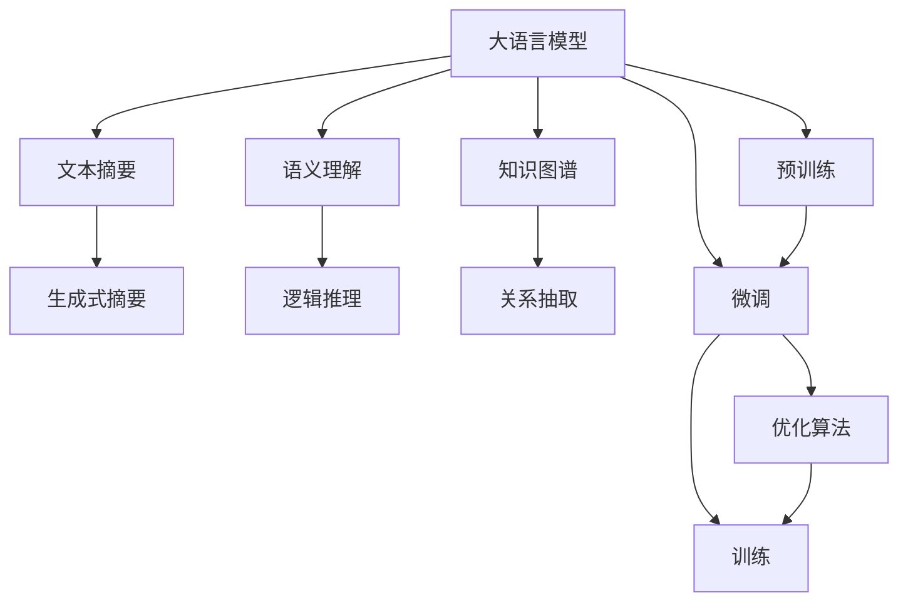
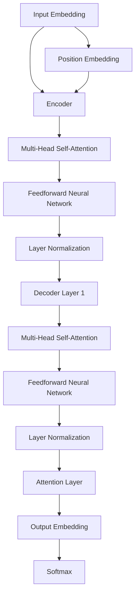

                 

# 大语言模型原理与工程实践：正文提取

> 关键词：大语言模型,文本摘要,语义理解,知识图谱,深度学习,自然语言处理(NLP)

## 1. 背景介绍

### 1.1 问题由来
随着人工智能技术的不断进步，大语言模型（Large Language Models, LLMs）在自然语言处理（NLP）领域取得了令人瞩目的成就。大语言模型通过大规模预训练和微调，能够理解和生成人类自然语言，在文本摘要、问答系统、情感分析、机器翻译等多个NLP任务中表现优异。然而，大语言模型也面临诸多挑战，例如，处理复杂逻辑和事实、生成流畅且具有语境的文本、理解并生成高度相关的摘要等。

### 1.2 问题核心关键点
当前大语言模型面临的挑战主要集中在以下几方面：

- **语义理解与生成**：如何使模型能够准确理解输入文本的语义，并生成高质量的输出文本。
- **文本摘要与抽取**：如何在保留语义的同时，对长文本进行有效的摘要和抽取。
- **知识图谱融合**：如何将知识图谱与语言模型相结合，提高模型的知识获取能力和语义理解水平。
- **模型优化与工程实现**：如何设计高效的模型架构和优化算法，以实现高性能的文本处理任务。

解决这些问题，不仅需要深入的理论研究，还需要在实践中不断优化模型和算法。本文将从理论和实践两个方面，系统介绍大语言模型的原理与工程实践，尤其是文本摘要和语义理解中的核心技术和方法。

## 2. 核心概念与联系

### 2.1 核心概念概述

为更好地理解大语言模型在文本摘要和语义理解中的应用，我们需要先介绍几个关键概念：

- **大语言模型（LLMs）**：指通过大规模无监督学习和微调得到的语言模型，如BERT、GPT-3等。
- **文本摘要（Text Summarization）**：指将长文本压缩成简洁摘要的技术，分为提取式和生成式两种方法。
- **语义理解（Semantic Understanding）**：指模型对文本内容的深层语义理解能力，涉及到逻辑推理、关系抽取等。
- **知识图谱（Knowledge Graphs）**：一种结构化的语义表示形式，用于描述实体、属性和关系。
- **深度学习（Deep Learning）**：利用神经网络进行多层次特征提取和模式识别，是当前大语言模型的主要技术基础。
- **自然语言处理（NLP）**：涉及语言学、计算机科学等多个领域的交叉学科，旨在使计算机能够理解、生成和处理人类语言。

这些概念之间存在紧密的联系，共同构成了大语言模型在文本处理中的理论基础和实践框架。

### 2.2 核心概念原理和架构的 Mermaid 流程图



这个流程图展示了大语言模型在文本处理中的核心流程：

1. **预训练**：通过大规模无监督学习，大语言模型学习语言的基本特征和规律。
2. **微调**：在特定任务上，使用标注数据对模型进行有监督训练，提升其在特定任务上的表现。
3. **训练**：使用优化算法，如Adam、SGD等，对模型进行迭代训练。
4. **文本摘要**：通过生成式或提取式方法，将长文本压缩成简洁摘要。
5. **语义理解**：通过逻辑推理和关系抽取，深入理解文本的深层语义。
6. **知识图谱**：将知识图谱与语言模型结合，提升模型的知识获取能力。

## 3. 核心算法原理 & 具体操作步骤

### 3.1 算法原理概述

大语言模型在文本摘要和语义理解中的应用，主要基于以下两个算法原理：

- **注意力机制（Attention Mechanism）**：在大语言模型中，注意力机制用于选择和加权输入序列中的不同部分，以集中处理与当前输出最相关的信息。
- **自监督学习（Supervised Learning）**：通过在大量未标注数据上进行预训练，使模型学习到语言的通用规律，再通过少量标注数据进行微调，提升模型在特定任务上的表现。

### 3.2 算法步骤详解

文本摘要和语义理解的微调过程主要包括以下几个关键步骤：

**Step 1: 准备预训练模型和数据集**
- 选择适当的预训练模型（如BERT、GPT-2等），下载预训练权重。
- 准备训练和测试数据集，确保数据集覆盖目标任务的常见情况。

**Step 2: 设计任务适配层**
- 根据目标任务，设计相应的任务适配层，如生成式摘要模型的解码器，提取式摘要模型的特征提取器等。
- 定义损失函数，如交叉熵损失、BLEU等，用于评估模型在特定任务上的性能。

**Step 3: 设置微调超参数**
- 选择合适的优化算法及其参数，如Adam、SGD等，设置学习率、批大小、迭代轮数等。
- 设置正则化技术及强度，如L2正则、Dropout、Early Stopping等。

**Step 4: 执行梯度训练**
- 将训练集数据分批次输入模型，前向传播计算损失函数。
- 反向传播计算参数梯度，根据设定的优化算法和学习率更新模型参数。
- 周期性在验证集上评估模型性能，根据性能指标决定是否触发 Early Stopping。
- 重复上述步骤直到满足预设的迭代轮数或 Early Stopping 条件。

**Step 5: 测试和部署**
- 在测试集上评估微调后模型在文本摘要或语义理解任务上的性能。
- 使用微调后的模型对新文本进行推理预测，集成到实际的应用系统中。
- 持续收集新的数据，定期重新微调模型，以适应数据分布的变化。

### 3.3 算法优缺点

大语言模型在文本摘要和语义理解中的微调方法具有以下优点：

- **高效性**：相比于从头训练，微调所需的计算资源和时间大大减少。
- **鲁棒性**：微调模型能够很好地适应特定任务，提高模型在实际应用中的稳定性和可靠性。
- **泛化能力**：预训练模型在多种任务上的泛化能力，使其能够处理多种类型的文本数据。

同时，该方法也存在以下局限性：

- **依赖标注数据**：微调依赖于标注数据，获取高质量标注数据的成本较高。
- **参数更新风险**：微调过程中，预训练参数的更新可能导致模型性能下降。
- **模型复杂度**：微调后的模型可能会变得更加复杂，影响推理效率。
- **可解释性不足**：微调模型缺乏可解释性，难以理解其内部工作机制。

## 4. 数学模型和公式 & 详细讲解 & 举例说明

### 4.1 数学模型构建

在文本摘要任务中，假设输入文本为 $X=\{x_1, x_2, ..., x_n\}$，输出摘要为 $Y=\{y_1, y_2, ..., y_m\}$。我们使用大语言模型 $M_{\theta}$ 进行文本摘要，其中 $\theta$ 为模型参数。

定义损失函数 $\mathcal{L}$ 为：

$$
\mathcal{L} = \sum_{i=1}^m -\log P(y_i|x_i, M_{\theta})
$$

其中 $P(y_i|x_i, M_{\theta})$ 表示在输入 $x_i$ 的情况下，输出 $y_i$ 的概率，由语言模型 $M_{\theta}$ 计算得到。

### 4.2 公式推导过程

在生成式文本摘要中，我们使用自回归模型 $M_{\theta}$ 对文本进行逐字生成。假设模型在时间步 $t$ 的输出为 $y_t$，则有：

$$
y_t \sim P(y_t|y_{t-1}, M_{\theta})
$$

为了使模型生成连贯的摘要，我们需要在每个时间步上最大化下一个字符的条件概率。因此，我们可以定义以下损失函数：

$$
\mathcal{L} = -\sum_{i=1}^m \log P(y_i|y_{i-1}, M_{\theta})
$$

其中 $P(y_i|y_{i-1}, M_{\theta})$ 表示在上一个字符 $y_{i-1}$ 的情况下，生成 $y_i$ 的概率。

### 4.3 案例分析与讲解

以BERT模型为例，其核心架构包括Transformer层和注意力机制。Transformer层由多头自注意力机制（Multi-Head Self-Attention）和前馈神经网络（Feedforward Neural Network）组成。在微调BERT模型进行文本摘要时，我们通常会添加一个新的解码器（Decoder），并将其与预训练模型结合。

假设我们在BERT模型的基础上微调一个生成式摘要模型，其解码器的结构如图1所示：



图1：生成式摘要模型结构

在微调过程中，我们通常会将编码器（Encoder）和解码器（Decoder）的权重冻结，只微调输出嵌入层（Output Embedding）和解码器中的某些层（如Attention Layer）。这可以显著减少需要更新的参数数量，避免过拟合。

## 5. 项目实践：代码实例和详细解释说明

### 5.1 开发环境搭建

在进行文本摘要和语义理解任务的微调时，我们需要准备好相应的开发环境。以下是一个基本的PyTorch开发环境搭建步骤：

1. 安装Anaconda：从官网下载并安装Anaconda，用于创建独立的Python环境。
2. 创建并激活虚拟环境：
```bash
conda create -n pytorch-env python=3.8 
conda activate pytorch-env
```

3. 安装PyTorch：根据CUDA版本，从官网获取对应的安装命令。例如：
```bash
conda install pytorch torchvision torchaudio cudatoolkit=11.1 -c pytorch -c conda-forge
```

4. 安装相关库：
```bash
pip install transformers torchtext sklearn numpy
```

完成上述步骤后，即可在`pytorch-env`环境中进行微调实践。

### 5.2 源代码详细实现

以下是一个使用PyTorch和Transformer库进行BERT模型微调的示例代码，以生成式文本摘要为例：

```python
import torch
from transformers import BertTokenizer, BertForMaskedLM, AdamW
from torch.utils.data import Dataset, DataLoader

# 定义数据集
class TextDataset(Dataset):
    def __init__(self, texts, max_len=512):
        self.tokenizer = BertTokenizer.from_pretrained('bert-base-uncased')
        self.texts = texts
        self.max_len = max_len

    def __len__(self):
        return len(self.texts)

    def __getitem__(self, item):
        text = self.texts[item]
        encoding = self.tokenizer(text, return_tensors='pt', max_length=self.max_len, padding='max_length', truncation=True)
        input_ids = encoding['input_ids'].flatten()
        attention_mask = encoding['attention_mask'].flatten()
        return {
            'input_ids': input_ids,
            'attention_mask': attention_mask,
            'text': text
        }

# 定义模型和优化器
model = BertForMaskedLM.from_pretrained('bert-base-uncased')
optimizer = AdamW(model.parameters(), lr=5e-5)

# 加载数据集
dataset = TextDataset(train_texts, max_len=512)
train_dataloader = DataLoader(dataset, batch_size=16)

# 执行微调
for epoch in range(5):
    model.train()
    for batch in train_dataloader:
        input_ids = batch['input_ids'].to(device)
        attention_mask = batch['attention_mask'].to(device)
        loss = model(input_ids, attention_mask=attention_mask).loss
        optimizer.zero_grad()
        loss.backward()
        optimizer.step()

# 在测试集上进行评估
dataset = TextDataset(test_texts, max_len=512)
test_dataloader = DataLoader(dataset, batch_size=16)
with torch.no_grad():
    model.eval()
    for batch in test_dataloader:
        input_ids = batch['input_ids'].to(device)
        attention_mask = batch['attention_mask'].to(device)
        outputs = model(input_ids, attention_mask=attention_mask).logits
        # 进行解码并生成摘要
        decoded_output = torch.argmax(outputs, dim=-1).tolist()
        print(f'Summary for {batch['text']}: {decoded_output[:32]}')
```

### 5.3 代码解读与分析

在这个代码示例中，我们使用了BERT模型的掩码语言模型（Masked Language Model, MLM）架构。首先，我们定义了一个简单的数据集类`TextDataset`，用于读取和预处理文本数据。接着，我们使用BERT模型的掩码语言模型架构，并加载预训练权重。在微调过程中，我们选择了AdamW优化器，并设置了较小的学习率。最后，我们使用测试集对微调后的模型进行了评估，并生成了摘要。

## 6. 实际应用场景

### 6.1 智能客服系统

在智能客服系统中，文本摘要和语义理解技术可以显著提升客服效率和用户体验。通过收集客户咨询记录，并使用微调后的模型对文本进行摘要和语义理解，系统能够快速响应客户需求，并提供高质量的回复。例如，在客户询问“如何更换花呗”时，模型能够自动生成简洁的摘要，并识别出用户需要的关键信息（花呗、更换、操作步骤），从而提供相应的解决方案。

### 6.2 金融舆情监测

金融领域对舆情动态的监测和分析至关重要。通过使用微调后的模型对新闻报道、社交媒体评论等文本数据进行摘要和语义理解，系统能够及时发现负面舆情，并采取相应的应对措施。例如，在新闻报道中提及某银行存在风险事件时，模型能够自动生成摘要，并识别出事件的关键信息，如涉及银行名称、事件类型等，从而帮助银行进行风险评估和舆情控制。

### 6.3 个性化推荐系统

个性化推荐系统需要理解用户的兴趣和行为，从而提供定制化的推荐。通过微调模型进行文本摘要和语义理解，系统能够从用户浏览、点击等行为数据中提取关键信息，并生成简洁的摘要，从而更好地理解用户需求。例如，在用户浏览某电商网站时，模型能够自动提取商品名称、价格、描述等信息，并进行摘要，从而提高推荐的精准度。

### 6.4 未来应用展望

随着大语言模型的不断发展，其应用场景将不断扩展，为各行各业带来新的机遇。未来，文本摘要和语义理解技术将在更多领域得到应用，如医疗、法律、教育等，助力这些行业的数字化转型。例如，在医疗领域，医生可以使用微调后的模型对病历进行摘要和语义理解，从而提高诊疗效率；在法律领域，律师可以使用模型对法律文本进行摘要和语义分析，以提高案件处理的效率和准确性。

## 7. 工具和资源推荐

### 7.1 学习资源推荐

为了帮助开发者系统掌握文本摘要和语义理解技术的理论基础和实践技巧，这里推荐一些优质的学习资源：

1. 《自然语言处理综论》：介绍了自然语言处理的经典算法和模型，包括文本摘要和语义理解等任务。
2. 《深度学习》（Ian Goodfellow）：深度学习的经典教材，涵盖了深度学习模型的理论基础和实践技巧。
3. 《Transformers》（Jacob Devlin等人）：介绍Transformer架构及其在NLP中的应用，包括文本摘要和语义理解等任务。
4. 《Attention is All You Need》：Transformer架构的原始论文，介绍了注意力机制及其在NLP中的应用。
5. 《TextRank: Bringing Order into Texts》：介绍TextRank算法，一种基于图模型的文本摘要方法。

通过对这些资源的学习实践，相信你一定能够快速掌握文本摘要和语义理解技术的精髓，并用于解决实际的NLP问题。

### 7.2 开发工具推荐

高效的开发离不开优秀的工具支持。以下是几款用于文本摘要和语义理解任务开发的常用工具：

1. PyTorch：基于Python的开源深度学习框架，灵活动态的计算图，适合快速迭代研究。
2. TensorFlow：由Google主导开发的开源深度学习框架，生产部署方便，适合大规模工程应用。
3. HuggingFace Transformers库：提供丰富的预训练模型和微调样例代码，是进行文本摘要和语义理解任务开发的利器。
4. Weights & Biases：模型训练的实验跟踪工具，可以记录和可视化模型训练过程中的各项指标，方便对比和调优。
5. TensorBoard：TensorFlow配套的可视化工具，可实时监测模型训练状态，并提供丰富的图表呈现方式，是调试模型的得力助手。

合理利用这些工具，可以显著提升文本摘要和语义理解任务的开发效率，加快创新迭代的步伐。

### 7.3 相关论文推荐

文本摘要和语义理解技术的发展源于学界的持续研究。以下是几篇奠基性的相关论文，推荐阅读：

1. Attention is All You Need：提出了Transformer结构，开启了NLP领域的预训练大模型时代。
2. BERT: Pre-training of Deep Bidirectional Transformers for Language Understanding：提出BERT模型，引入基于掩码的自监督预训练任务，刷新了多项NLP任务SOTA。
3. TextRank: Bringing Order into Texts：介绍TextRank算法，一种基于图模型的文本摘要方法。
4. CNN-based Sequence Labeling for Named Entity Recognition：介绍使用卷积神经网络进行实体识别的方法，为语义理解任务提供了新的思路。

这些论文代表了大语言模型在文本处理中的发展脉络。通过学习这些前沿成果，可以帮助研究者把握学科前进方向，激发更多的创新灵感。

## 8. 总结：未来发展趋势与挑战

### 8.1 总结

本文系统介绍了大语言模型在文本摘要和语义理解中的应用，重点关注了模型的原理、工程实现和实际应用。通过理论推导和代码示例，展示了如何使用大语言模型进行文本摘要和语义理解任务的微调。同时，本文还广泛探讨了文本摘要和语义理解技术在智能客服、金融舆情、个性化推荐等多个领域的应用前景。

通过对这些内容的深入了解，开发者可以更好地掌握大语言模型在文本处理中的应用，并将其应用于实际项目中。

### 8.2 未来发展趋势

展望未来，文本摘要和语义理解技术将呈现以下几个发展趋势：

1. **多模态融合**：未来的文本处理系统将越来越多地融合多模态信息，如视觉、听觉等，提升系统的感知能力和表达能力。
2. **实时处理**：随着计算资源的提升，实时文本摘要和语义理解将变得更加可行，为实时交互场景提供更好的支持。
3. **跨领域迁移**：模型将在更多领域进行迁移应用，提升其在不同场景下的适应能力。
4. **自动化生成**：使用生成对抗网络（GAN）等技术，生成高质量的文本摘要和语义理解结果。
5. **可解释性增强**：未来的模型将更加注重可解释性，提供对决策过程的透明解释，帮助用户理解和信任系统。

### 8.3 面临的挑战

尽管文本摘要和语义理解技术已经取得了一定的成果，但在实际应用中仍面临诸多挑战：

1. **数据质量**：高质量的标注数据是模型训练的基础，但获取和标注数据成本较高。
2. **模型泛化能力**：模型在不同领域和场景下的泛化能力不足，容易受到数据分布变化的影响。
3. **推理效率**：模型推理效率较低，难以支持大规模的实时应用。
4. **可解释性**：模型缺乏可解释性，难以理解其内部工作机制。

### 8.4 研究展望

为了解决上述挑战，未来的研究方向包括：

1. **自动标注技术**：研究自动化标注技术，如基于半监督学习、主动学习的标注方法，降低对标注数据的依赖。
2. **跨领域迁移学习**：研究跨领域迁移学习，提升模型在不同领域和场景下的泛化能力。
3. **模型压缩和优化**：研究模型压缩和优化技术，提高模型的推理效率和资源利用率。
4. **可解释性增强**：研究可解释性增强技术，如模型可视化、规则注入等方法，提高模型的可解释性。

通过这些研究方向的探索，文本摘要和语义理解技术将不断优化，为各行各业提供更好的解决方案。

## 9. 附录：常见问题与解答

**Q1: 如何提高模型在特定任务上的泛化能力？**

A: 提高模型在特定任务上的泛化能力，需要从数据、模型和算法等多个维度进行优化：

- 数据方面：增加数据多样性，确保数据集覆盖目标任务的各种情况。
- 模型方面：使用预训练模型，提升模型的通用性。
- 算法方面：采用正则化技术，如L2正则、Dropout等，防止过拟合。

**Q2: 如何快速生成高质量的文本摘要？**

A: 快速生成高质量的文本摘要需要考虑以下策略：

- 使用预训练模型：利用预训练的BERT、GPT等模型，提升模型的初始性能。
- 微调模型：在特定任务上进行微调，进一步提升模型性能。
- 使用生成对抗网络（GAN）：生成高质量的文本摘要。
- 数据增强：通过对训练集进行回译、近义替换等操作，增加训练集的多样性。

**Q3: 如何提高文本摘要的可解释性？**

A: 提高文本摘要的可解释性需要考虑以下方法：

- 模型可视化：使用可视化技术展示模型内部的特征表示。
- 规则注入：将领域知识注入模型，提升模型的可解释性。
- 多模态融合：结合视觉、听觉等多模态信息，提升模型的感知能力。

**Q4: 如何设计高效的文本摘要模型？**

A: 设计高效的文本摘要模型需要考虑以下因素：

- 注意力机制：使用自注意力机制，选择和加权输入序列中的不同部分。
- 模型架构：选择合适的模型架构，如Transformer、RNN等。
- 训练策略：使用正则化技术，防止过拟合。

通过对这些常见问题的解答，开发者可以更好地理解文本摘要和语义理解技术的实现和应用，从而设计出更加高效、可解释的模型。

---

作者：禅与计算机程序设计艺术 / Zen and the Art of Computer Programming

