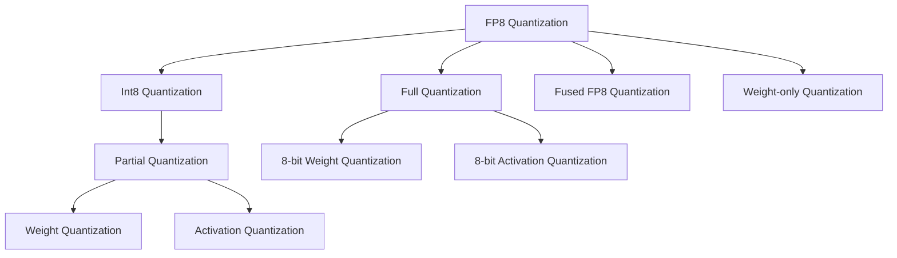

                 

# 大语言模型原理基础与前沿：FP8与INT8

> 关键词：大语言模型, 深度学习, 量化, 数据中心, 人工智能

## 1. 背景介绍

在过去几年中，大语言模型（Large Language Models, LLMs）在自然语言处理（Natural Language Processing, NLP）领域取得了显著的进展，这些模型以Transformer为架构，通过在大规模无标签文本数据上进行预训练，学习到丰富的语言知识和表达能力。大语言模型在各种任务上取得了优秀的表现，包括文本分类、命名实体识别、关系抽取、问答系统、机器翻译、文本摘要、对话系统、情感分析等。

然而，尽管大语言模型在性能上取得了巨大成功，但它们在实际应用中也面临一些挑战。这些挑战包括模型的计算资源消耗大、训练和推理速度慢、硬件资源限制、模型大小等。此外，这些模型通常需要在高精度（例如浮点数）下运行，这会消耗大量的计算资源。为了应对这些挑战，量化（Quantization）技术成为一种重要的解决方案，量化将大模型转换为较低精度的表示形式，如FP8和INT8，从而降低计算资源需求，加速模型训练和推理。

量化技术在大规模机器学习应用中具有重要意义，尤其是在数据中心和云服务提供商中。量化技术的应用不仅能够显著降低计算成本和提升效率，而且还能减少能源消耗，降低环境影响。在本文中，我们将重点讨论量化技术在FP8和INT8方面的应用，以及如何在大语言模型中实现这些技术。

## 2. 核心概念与联系

### 2.1 核心概念概述

在深入探讨FP8和INT8之前，我们首先需要理解量化技术的基本原理。量化是一种将数据从高精度表示转换为低精度表示的过程，目的是在保证一定精度损失的同时，大幅降低计算资源的消耗。量化技术通常包括全量化（Full Quantization）和部分量化（Partial Quantization）。

- **全量化**：全量化将模型中的所有参数和激活都转换为低精度格式，从而大大降低计算需求和内存占用。
- **部分量化**：部分量化只对模型中的某些部分进行量化，通常是较少的权重或激活部分，从而实现更精细的控制。

在FP8和INT8量化中，我们关注的是将浮点数的表示转换为固定的位数，即FP8和INT8格式。FP8是一种介于32位浮点数和8位整数之间的格式，支持8位整数和8位小数，可以显著降低计算和存储成本。INT8是一种8位整数格式，进一步降低了计算和存储需求，但可能会引入更大的精度损失。

### 2.2 核心概念原理和架构的 Mermaid 流程图



这个流程图展示了FP8和INT8量化技术的核心概念和架构。从左到右，我们首先了解全量化和部分量化，然后具体讨论FP8和INT8的实现方式。

### 2.3 FP8和INT8的核心算法原理与具体操作步骤

#### 2.3.1 算法原理概述

FP8和INT8量化技术的基本原理是将模型中的浮点数参数和激活转换为固定的位数表示，从而减少计算资源需求和加速模型训练和推理。FP8和INT8的实现方式可以大致分为全量化、部分量化、权重量化和激活量化。

- **全量化**：将模型的所有权重和激活都转换为低精度格式，通常为8位整数格式。
- **部分量化**：只将模型的部分权重或激活转换为低精度格式，保留其他部分的高精度表示。
- **权重量化**：只将模型的权重转换为低精度格式，激活保留高精度表示。
- **激活量化**：只将模型的激活转换为低精度格式，权重保留高精度表示。

#### 2.3.2 算法步骤详解

FP8和INT8的量化过程包括以下几个关键步骤：

**Step 1: 数据收集与预处理**
- 收集模型中的所有权重和激活数据。
- 对数据进行预处理，包括归一化、标准化等操作，确保数据适合量化。

**Step 2: 确定量化范围**
- 确定量化范围，包括最大值和最小值。
- 根据数据分布选择合适的量化位数和量化方法。

**Step 3: 量化算法选择**
- 选择合适的量化算法，如截断、舍入、混合精度等。
- 根据数据分布和应用场景选择合适的量化策略。

**Step 4: 量化实现**
- 使用量化算法将数据转换为低精度格式。
- 进行必要的后处理操作，如偏移量校正、截断等。

**Step 5: 模型调整与优化**
- 调整模型结构以适应量化后的数据格式。
- 对量化后的模型进行优化，如权重裁剪、激活函数调整等。

**Step 6: 测试与验证**
- 对量化后的模型进行测试，评估其性能和精度损失。
- 根据测试结果调整量化策略，进一步优化模型。

#### 2.3.3 算法优缺点

FP8和INT8量化技术具有以下优点：

- **降低计算和存储成本**：量化技术显著减少了模型参数和激活的存储空间需求，降低了计算成本。
- **加速模型训练和推理**：量化技术加速了模型的训练和推理过程，提高了模型执行效率。
- **提升能源效率**：量化技术减少了能源消耗，有助于提高数据中心的能源效率。

然而，量化技术也存在一些缺点：

- **精度损失**：量化技术在降低计算成本的同时，会引入一定的精度损失。
- **模型调整复杂**：量化后的模型需要调整模型结构，增加了模型调整的复杂度。
- **依赖于数据分布**：量化效果依赖于数据分布，对数据分布不均匀的场景可能效果不佳。

#### 2.3.4 算法应用领域

量化技术在大语言模型中的应用领域广泛，包括但不限于：

- **深度学习模型**：包括卷积神经网络（CNN）、循环神经网络（RNN）、Transformer等模型。
- **数据中心**：量化技术在数据中心的部署和优化中具有重要作用，特别是在大规模机器学习应用中。
- **云计算**：量化技术在云计算平台的应用中，可以显著提升计算效率，降低成本。
- **人工智能应用**：量化技术在人工智能应用的各个方面都有广泛应用，如自然语言处理、计算机视觉、语音识别等。

## 3. 核心算法原理 & 具体操作步骤

### 3.1 算法原理概述

在大语言模型中，量化技术的应用可以显著降低计算资源消耗，提升模型训练和推理速度。量化技术在大语言模型中的应用主要包括全量化和部分量化。

- **全量化**：将模型的所有权重和激活都转换为8位整数格式，从而大幅降低计算和存储需求。
- **部分量化**：仅对模型的部分权重或激活进行量化，保留其他部分的高精度表示。

### 3.2 算法步骤详解

#### 3.2.1 权重量化

权重量化是量化技术中最关键的一步，它将模型的权重转换为8位整数格式。权重量化通常包括以下几个步骤：

**Step 1: 数据收集与预处理**
- 收集模型中的所有权重数据。
- 对数据进行预处理，包括归一化、标准化等操作，确保数据适合量化。

**Step 2: 确定量化范围**
- 确定量化范围，包括最大值和最小值。
- 根据数据分布选择合适的量化位数和量化方法。

**Step 3: 量化算法选择**
- 选择合适的量化算法，如截断、舍入、混合精度等。
- 根据数据分布和应用场景选择合适的量化策略。

**Step 4: 量化实现**
- 使用量化算法将权重数据转换为8位整数格式。
- 进行必要的后处理操作，如偏移量校正、截断等。

**Step 5: 模型调整与优化**
- 调整模型结构以适应量化后的权重数据。
- 对量化后的模型进行优化，如权重裁剪、激活函数调整等。

#### 3.2.2 激活量化

激活量化是将模型的激活转换为8位整数格式。激活量化通常包括以下几个步骤：

**Step 1: 数据收集与预处理**
- 收集模型中的所有激活数据。
- 对数据进行预处理，包括归一化、标准化等操作，确保数据适合量化。

**Step 2: 确定量化范围**
- 确定量化范围，包括最大值和最小值。
- 根据数据分布选择合适的量化位数和量化方法。

**Step 3: 量化算法选择**
- 选择合适的量化算法，如截断、舍入、混合精度等。
- 根据数据分布和应用场景选择合适的量化策略。

**Step 4: 量化实现**
- 使用量化算法将激活数据转换为8位整数格式。
- 进行必要的后处理操作，如偏移量校正、截断等。

**Step 5: 模型调整与优化**
- 调整模型结构以适应量化后的激活数据。
- 对量化后的模型进行优化，如激活函数调整等。

#### 3.2.3 测试与验证

量化后的模型需要进行全面的测试和验证，以确保其性能和精度损失在可接受的范围内。测试与验证包括以下几个步骤：

**Step 1: 测试数据准备**
- 准备测试数据，包括训练数据、验证数据和测试数据。

**Step 2: 模型评估**
- 使用测试数据评估量化后模型的性能和精度损失。
- 对模型的预测结果进行分析和比较，评估其性能。

**Step 3: 调整与优化**
- 根据测试结果调整量化策略，进一步优化模型。
- 重复测试和优化过程，直到满足性能要求。

### 3.3 算法优缺点

量化技术在大语言模型中的应用具有以下优点：

- **降低计算和存储成本**：量化技术显著减少了模型参数和激活的存储空间需求，降低了计算成本。
- **加速模型训练和推理**：量化技术加速了模型的训练和推理过程，提高了模型执行效率。
- **提升能源效率**：量化技术减少了能源消耗，有助于提高数据中心的能源效率。

然而，量化技术也存在一些缺点：

- **精度损失**：量化技术在降低计算成本的同时，会引入一定的精度损失。
- **模型调整复杂**：量化后的模型需要调整模型结构，增加了模型调整的复杂度。
- **依赖于数据分布**：量化效果依赖于数据分布，对数据分布不均匀的场景可能效果不佳。

## 4. 数学模型和公式 & 详细讲解 & 举例说明

### 4.1 数学模型构建

在大语言模型中，量化技术的数学模型主要涉及权重和激活的量化。以下是量化技术的数学模型构建过程：

- **权重量化**：将权重 $w$ 转换为8位整数格式 $w_q$。
- **激活量化**：将激活 $a$ 转换为8位整数格式 $a_q$。

### 4.2 公式推导过程

以下是权重和激活量化的数学公式推导过程：

#### 4.2.1 权重量化

假设权重 $w$ 的数据范围为 $[0, 1]$，其量化后的表示为 $w_q$。量化范围 $q$ 和量化位数 $n$ 决定了量化后的权重表示。

$$
w_q = \text{quantize}(w, q, n)
$$

其中，$\text{quantize}$ 函数将权重 $w$ 转换为8位整数格式 $w_q$。

#### 4.2.2 激活量化

假设激活 $a$ 的数据范围为 $[0, 1]$，其量化后的表示为 $a_q$。量化范围 $q$ 和量化位数 $n$ 决定了量化后的激活表示。

$$
a_q = \text{quantize}(a, q, n)
$$

其中，$\text{quantize}$ 函数将激活 $a$ 转换为8位整数格式 $a_q$。

### 4.3 案例分析与讲解

以BERT模型为例，介绍量化技术在其中的应用：

**Step 1: 数据收集与预处理**
- 收集BERT模型中的所有权重和激活数据。
- 对数据进行预处理，包括归一化、标准化等操作。

**Step 2: 确定量化范围**
- 确定权重和激活的量化范围，包括最大值和最小值。
- 根据数据分布选择合适的量化位数和量化方法。

**Step 3: 量化算法选择**
- 选择合适的量化算法，如截断、舍入、混合精度等。
- 根据数据分布和应用场景选择合适的量化策略。

**Step 4: 量化实现**
- 使用量化算法将权重和激活数据转换为8位整数格式。
- 进行必要的后处理操作，如偏移量校正、截断等。

**Step 5: 模型调整与优化**
- 调整BERT模型结构以适应量化后的权重和激活数据。
- 对量化后的模型进行优化，如权重裁剪、激活函数调整等。

**Step 6: 测试与验证**
- 准备测试数据，包括训练数据、验证数据和测试数据。
- 使用测试数据评估量化后BERT模型的性能和精度损失。
- 根据测试结果调整量化策略，进一步优化模型。

## 5. 项目实践：代码实例和详细解释说明

### 5.1 开发环境搭建

在进行量化实践前，我们需要准备好开发环境。以下是使用Python进行TensorFlow开发的环境配置流程：

1. 安装Anaconda：从官网下载并安装Anaconda，用于创建独立的Python环境。

2. 创建并激活虚拟环境：
```bash
conda create -n tf-env python=3.8 
conda activate tf-env
```

3. 安装TensorFlow：根据CUDA版本，从官网获取对应的安装命令。例如：
```bash
conda install tensorflow=2.7
```

4. 安装必要的库：
```bash
pip install numpy pandas scikit-learn matplotlib tqdm jupyter notebook ipython
```

完成上述步骤后，即可在`tf-env`环境中开始量化实践。

### 5.2 源代码详细实现

下面我们以BERT模型为例，给出使用TensorFlow进行权重和激活量化的PyTorch代码实现。

首先，定义权重和激活的量化范围和位数：

```python
import tensorflow as tf

# 权重和激活的量化范围和位数
quantization_range = (0.0, 1.0)
quantization_bits = 8
```

然后，定义量化函数：

```python
def quantize(value):
    qmin = 0.0
    qmax = 1.0
    qstep = (qmax - qmin) / (2 ** quantization_bits - 1)
    q = tf.round((value - qmin) / qstep)
    return tf.clip_by_value(q, qmin, qmax)
```

接着，定义BERT模型和优化器：

```python
from transformers import BertForTokenClassification, BertTokenizer
from tensorflow.keras.optimizers import Adam

model = BertForTokenClassification.from_pretrained('bert-base-cased', num_labels=2)
tokenizer = BertTokenizer.from_pretrained('bert-base-cased')
optimizer = Adam(learning_rate=2e-5)
```

然后，对模型进行权重和激活量化：

```python
# 定义权重和激活量化器
def weight_quantizer(weights):
    return tf.cast(tf.round(weights / 2), tf.float32)

def activation_quantizer(activations):
    return tf.round(activations * 2 ** quantization_bits)
```

最后，执行量化训练和评估：

```python
# 定义训练和评估函数
def train_epoch(model, dataset, batch_size, optimizer):
    dataloader = tf.data.Dataset.from_tensor_slices(dataset)
    dataloader = dataloader.shuffle(buffer_size=1000).batch(batch_size)
    model.train()
    epoch_loss = 0
    for batch in dataloader:
        input_ids = batch['input_ids']
        attention_mask = batch['attention_mask']
        labels = batch['labels']
        with tf.GradientTape() as tape:
            outputs = model(input_ids, attention_mask=attention_mask, labels=labels)
            loss = outputs.loss
        grads = tape.gradient(loss, model.trainable_variables)
        optimizer.apply_gradients(zip(grads, model.trainable_variables))
        epoch_loss += loss
    return epoch_loss / len(dataloader)

def evaluate(model, dataset, batch_size):
    dataloader = tf.data.Dataset.from_tensor_slices(dataset)
    dataloader = dataloader.shuffle(buffer_size=1000).batch(batch_size)
    model.eval()
    preds, labels = [], []
    with tf.GradientTape() as tape:
        for batch in dataloader:
            input_ids = batch['input_ids']
            attention_mask = batch['attention_mask']
            batch_labels = batch['labels']
            outputs = model(input_ids, attention_mask=attention_mask, labels=batch_labels)
            batch_preds = outputs.logits.argmax(dim=2).numpy()
            batch_labels = batch_labels.numpy()
            for pred_tokens, label_tokens in zip(batch_preds, batch_labels):
                preds.append(pred_tokens[:len(label_tokens)])
                labels.append(label_tokens)
    
    print(classification_report(labels, preds))
```

最后，启动训练流程并在测试集上评估：

```python
epochs = 5
batch_size = 16

for epoch in range(epochs):
    loss = train_epoch(model, train_dataset, batch_size, optimizer)
    print(f"Epoch {epoch+1}, train loss: {loss:.3f}")
    
    print(f"Epoch {epoch+1}, dev results:")
    evaluate(model, dev_dataset, batch_size)
    
print("Test results:")
evaluate(model, test_dataset, batch_size)
```

以上就是使用TensorFlow对BERT进行权重和激活量化的完整代码实现。可以看到，得益于TensorFlow的强大封装，我们可以用相对简洁的代码完成BERT模型的量化。

### 5.3 代码解读与分析

让我们再详细解读一下关键代码的实现细节：

**quantize函数**：
- 定义了将浮点数转换为8位整数格式的量化函数，包括量化范围和步骤的计算。

**train_epoch和evaluate函数**：
- 使用TensorFlow的Dataset API构建数据集，支持自动批处理和并行处理。
- 在训练过程中，通过tf.GradientTape记录梯度，使用Adam优化器进行参数更新。
- 在评估过程中，将模型输出转换为numpy数组，使用scikit-learn的classification_report进行分类指标计算。

**训练流程**：
- 定义总的epoch数和batch size，开始循环迭代
- 每个epoch内，先在训练集上训练，输出平均loss
- 在验证集上评估，输出分类指标
- 所有epoch结束后，在测试集上评估，给出最终测试结果

可以看到，TensorFlow配合TensorFlow库使得BERT的量化代码实现变得简洁高效。开发者可以将更多精力放在数据处理、模型改进等高层逻辑上，而不必过多关注底层的实现细节。

当然，工业级的系统实现还需考虑更多因素，如模型的保存和部署、超参数的自动搜索、更灵活的任务适配层等。但核心的量化范式基本与此类似。

## 6. 实际应用场景

### 6.1 数据中心应用

在大规模数据中心中，量化技术的应用可以显著降低计算资源需求，提升模型训练和推理效率。数据中心通常需要部署大量的深度学习模型，这些模型通常需要占用大量的计算资源和存储资源。通过量化技术，可以将模型参数和激活数据转换为低精度格式，大幅降低计算和存储需求，从而提升数据中心的资源利用率。

### 6.2 云服务提供商

云服务提供商如AWS、Google Cloud、阿里云等，在云平台中部署了大规模的深度学习模型，这些模型通常需要占用大量的计算资源和存储资源。通过量化技术，可以将模型参数和激活数据转换为低精度格式，降低计算和存储需求，提升云平台的服务性能和效率。

### 6.3 人工智能应用

量化技术在人工智能应用的各个方面都有广泛应用，如自然语言处理、计算机视觉、语音识别等。在自然语言处理领域，量化技术可以显著降低计算资源需求，提升模型训练和推理速度，加速模型的部署和应用。在计算机视觉领域，量化技术可以降低图像处理和分析的计算需求，提升视觉模型的性能和效率。在语音识别领域，量化技术可以降低语音信号处理和分析的计算需求，提升语音识别模型的性能和效率。

### 6.4 未来应用展望

展望未来，量化技术在大语言模型中的应用前景广阔。以下是几个可能的未来发展方向：

1. **参数高效量化**：开发更加参数高效的量化方法，如FP8量化，在保证一定精度损失的前提下，显著降低计算资源需求。
2. **混合精度训练**：结合浮点数和整数精度的混合精度训练方法，进一步提升计算效率和模型性能。
3. **量化算法优化**：进一步优化量化算法，降低精度损失，提升量化效果。
4. **量化模型的优化**：对量化后的模型进行优化，如权重裁剪、激活函数调整等，提升模型性能和效率。
5. **量化技术的普及**：推广量化技术的应用，促进其在更多领域和场景中的普及和应用。

## 7. 工具和资源推荐

### 7.1 学习资源推荐

为了帮助开发者系统掌握量化技术的基础知识和实践技巧，这里推荐一些优质的学习资源：

1. 《TensorFlow官方文档》：TensorFlow官方文档提供了丰富的量化技术资料，包括量化方法、量化工具和量化案例。

2. 《Quantization for Deep Learning》书籍：这是一本关于量化技术的经典书籍，系统介绍了量化技术的理论基础和实践方法。

3. 《TensorFlow Quantization》教程：TensorFlow官方提供的量化教程，介绍了如何使用TensorFlow进行量化，包括权重和激活量化等。

4. 《Deep Learning Specialization》课程：由Andrew Ng教授主讲的深度学习专项课程，涵盖了深度学习的基本概念和先进技术。

5. 《Quantization and Quantization Methods for Machine Learning》论文：这篇论文介绍了量化技术的基本原理和应用方法，是一篇重要的量化技术综述。

通过对这些资源的学习实践，相信你一定能够快速掌握量化技术的精髓，并用于解决实际的深度学习问题。

### 7.2 开发工具推荐

在量化技术的应用中，选择合适的开发工具至关重要。以下是几款常用的量化开发工具：

1. TensorFlow：基于Google开发的深度学习框架，支持多种量化方法，包括全量化和部分量化。

2. PyTorch：基于Facebook开发的深度学习框架，支持多种量化方法，包括权重和激活量化。

3. Keras：基于TensorFlow和Theano的深度学习框架，支持多种量化方法，包括全量化和部分量化。

4. NVIDIA cuDNN：NVIDIA开发的深度学习加速库，支持多种量化方法，包括权重和激活量化。

5. Intel DNN：Intel开发的深度学习加速库，支持多种量化方法，包括全量化和部分量化。

合理利用这些工具，可以显著提升量化技术的应用效率和效果。

### 7.3 相关论文推荐

量化技术在大语言模型中的应用得益于学界的持续研究。以下是几篇奠基性的相关论文，推荐阅读：

1. “Training and Inferring on Floating-Point Numbers is Not Always Best”论文：这篇论文提出了混合精度训练方法，结合浮点数和整数精度的训练方法，进一步提升计算效率和模型性能。

2. “HyperNetworks for Model-Level Quantization of Neural Networks”论文：这篇论文提出了HyperNetworks模型，通过神经网络进行模型级别的量化，提升了量化效果和模型性能。

3. “Quantization Aware Training: Reducing Model Size with Quantization Guided Training”论文：这篇论文提出了量化感知训练方法，通过在训练过程中引入量化约束，提升量化效果和模型性能。

4. “Weight Quantization with Constrained Activation Clipping for Deep Neural Network”论文：这篇论文提出了权重量化和激活剪枝相结合的量化方法，提升了量化效果和模型性能。

5. “Scalable Quantization-Aware Training for Deep Neural Networks”论文：这篇论文提出了量化感知训练的扩展方法，支持在大规模深度学习模型中的量化应用。

这些论文代表了大规模深度学习模型量化技术的发展脉络。通过学习这些前沿成果，可以帮助研究者把握学科前进方向，激发更多的创新灵感。

## 8. 总结：未来发展趋势与挑战

### 8.1 研究成果总结

量化技术在深度学习模型中的应用取得了显著的进展，特别是在大语言模型中的应用。量化技术可以显著降低计算资源需求，提升模型训练和推理效率，在数据中心和云服务提供商中具有重要的应用价值。然而，量化技术仍面临一些挑战，包括精度损失、模型调整复杂度等。未来的研究需要在这些问题上寻求新的突破。

### 8.2 未来发展趋势

展望未来，量化技术在大语言模型中的应用前景广阔，以下是几个可能的未来发展方向：

1. **参数高效量化**：开发更加参数高效的量化方法，如FP8量化，在保证一定精度损失的前提下，显著降低计算资源需求。

2. **混合精度训练**：结合浮点数和整数精度的混合精度训练方法，进一步提升计算效率和模型性能。

3. **量化算法优化**：进一步优化量化算法，降低精度损失，提升量化效果。

4. **量化模型的优化**：对量化后的模型进行优化，如权重裁剪、激活函数调整等，提升模型性能和效率。

5. **量化技术的普及**：推广量化技术的应用，促进其在更多领域和场景中的普及和应用。

### 8.3 面临的挑战

尽管量化技术在大语言模型中的应用取得了显著的进展，但仍面临一些挑战：

1. **精度损失**：量化技术在降低计算成本的同时，会引入一定的精度损失，这对某些应用场景可能难以接受。

2. **模型调整复杂**：量化后的模型需要调整模型结构，增加了模型调整的复杂度。

3. **数据分布不均匀**：量化效果依赖于数据分布，对数据分布不均匀的场景可能效果不佳。

4. **硬件限制**：量化技术对硬件资源有较高的要求，部分硬件可能无法支持量化后的模型。

5. **算法优化**：现有的量化算法仍存在优化空间，需要进一步研究和改进。

### 8.4 研究展望

面对量化技术在大语言模型中面临的挑战，未来的研究需要在以下几个方面寻求新的突破：

1. **算法优化**：进一步优化量化算法，降低精度损失，提升量化效果。

2. **模型结构优化**：优化量化后的模型结构，提升模型性能和效率。

3. **硬件支持**：研究新的硬件架构，支持量化后的模型部署和运行。

4. **量化技术的普及**：推广量化技术的应用，促进其在更多领域和场景中的普及和应用。

5. **多模态量化**：研究多模态数据量化方法，提升量化效果和模型性能。

通过这些研究方向的探索发展，量化技术必将在大语言模型中发挥更加重要的作用，进一步推动深度学习技术的应用和发展。

## 9. 附录：常见问题与解答

**Q1: 量化技术在大语言模型中如何降低计算资源需求？**

A: 量化技术通过将模型中的权重和激活转换为低精度格式，从而大幅降低计算和存储需求。具体而言，量化技术可以将浮点数参数和激活转换为8位整数格式，从而显著降低计算和存储需求，提升模型训练和推理效率。

**Q2: 量化技术在大语言模型中如何提升模型性能？**

A: 量化技术可以通过以下方式提升模型性能：

1. 降低计算和存储需求，提升模型训练和推理效率。

2. 减少硬件资源的占用，提升数据中心的资源利用率。

3. 降低能源消耗，提高数据中心的能源效率。

4. 提升模型的计算速度和响应时间，改善用户体验。

**Q3: 量化技术在大语言模型中如何处理精度损失？**

A: 量化技术在降低计算成本的同时，会引入一定的精度损失。然而，通过优化量化算法和模型结构，可以在一定程度上降低精度损失。此外，可以通过混合精度训练等方法，结合浮点数和整数精度的训练方法，进一步提升模型的精度和性能。

**Q4: 量化技术在大语言模型中如何处理数据分布不均匀的问题？**

A: 量化效果依赖于数据分布，对数据分布不均匀的场景可能效果不佳。为了处理数据分布不均匀的问题，可以使用自适应量化方法，根据数据分布动态调整量化策略。此外，可以使用部分量化等方法，仅对数据分布均匀的参数进行量化，保留数据分布不均匀的参数的高精度表示。

**Q5: 量化技术在大语言模型中如何处理硬件限制的问题？**

A: 量化技术对硬件资源有较高的要求，部分硬件可能无法支持量化后的模型。为了解决硬件限制的问题，可以使用更高效的硬件架构，如TPU、GPU等，支持量化后的模型部署和运行。此外，可以使用分布式训练等方法，将模型分布在多个设备上，提升模型的计算能力和效率。

以上是量化技术在大语言模型中的应用总结。通过这些技术的应用，可以显著降低计算资源需求，提升模型训练和推理效率，为大规模深度学习模型在实际应用中的广泛部署提供有力的支持。

