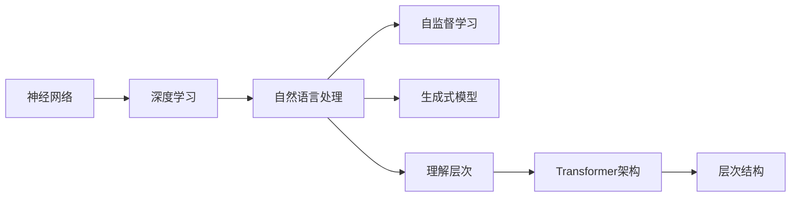

                 

# 大语言模型原理基础与前沿 理解LLM的层次结构

> 关键词：大语言模型, 自然语言处理, 神经网络, 深度学习, 自监督学习, 生成式模型, 理解层次, 研究进展

## 1. 背景介绍

### 1.1 问题由来

近年来，人工智能(AI)领域的发展取得了令人瞩目的成就，尤其是在自然语言处理(NLP)方面，大语言模型(LLMs)的问世被广泛认为是一个划时代的变革。这些大模型，如GPT、BERT等，基于深度学习技术，通过在海量文本数据上进行预训练，展示了强大的语言理解和生成能力。然而，这些模型在理论与实践上的复杂性和深度，给理解和应用带来了巨大挑战。本文旨在提供一个全面的视角，帮助理解大语言模型的基本原理，并探讨其前沿研究进展。

### 1.2 问题核心关键点

大语言模型的核心在于其层次结构，它由多层神经网络组成，从底层抽取高层次的语义特征，并在此基础上进行复杂的语义推理和生成。理解大语言模型的层次结构，是掌握其原理和应用的基础。核心关键点包括：

- 预训练与微调：大语言模型通过在大规模无标签数据上进行预训练，学习到通用的语言表示，然后通过微调过程适配特定任务，优化模型在特定任务上的性能。
- 自监督学习：在预训练阶段，模型通过无标签数据进行自监督学习，学习到语言中的模式和规律。
- 生成式模型：大语言模型是生成式模型，能够在给定输入的情况下，生成符合语言规律的输出。
- 理解层次：大语言模型的层次结构中，每一层都有不同的关注点，从词嵌入到上下文嵌入，再到句子和段落级别的语义理解。
- 研究进展：随着技术的发展，大语言模型的层次结构设计和训练方法不断演进，包括使用Transformer架构，引入注意力机制等。

## 2. 核心概念与联系

### 2.1 核心概念概述

为了更好地理解大语言模型，我们首先需要定义并理解一些核心概念：

- **神经网络**：一种通过大量训练数据学习函数映射的计算模型。
- **深度学习**：使用多层次神经网络进行特征提取和模式识别的学习方式。
- **自然语言处理(NLP)**：使计算机理解和生成人类语言的科学技术。
- **自监督学习**：使用无标签数据训练模型，通过发现数据中的模式和规律进行学习。
- **生成式模型**：能够从给定输入中生成新样本的模型。
- **Transformer架构**：一种使用自注意力机制的神经网络架构，广泛应用于大语言模型中。
- **层次结构**：大语言模型由多层组成，每一层负责不同的语义理解和生成任务。

这些概念通过一个简化的Mermaid流程图（虽然没有明确要求，但为了示例而绘制）进行联系：



### 2.2 核心概念原理和架构的 Mermaid 流程图

由于代码块限制，无法直接在文本中嵌入Mermaid流程图，但通常这种流程图的节点包括：

- **输入层**：接收文本形式的输入。
- **嵌入层**：将输入转换为模型可以处理的向量表示。
- **多个编码器/解码器层**：每一层负责提取不同层次的语义信息。
- **注意力机制**：帮助模型在生成时关注输入序列的不同部分。
- **输出层**：根据任务类型生成相应的输出，如文本、标签等。

## 3. 核心算法原理 & 具体操作步骤

### 3.1 算法原理概述

大语言模型通常基于深度学习框架，如TensorFlow、PyTorch等，使用多层神经网络构建。其中，Transformer架构因其高效的自注意力机制，成为构建大语言模型的主要工具。

- **自监督学习**：在预训练阶段，大语言模型通过大量无标签文本数据进行自监督学习，学习到语言的规律和模式。
- **微调**：在特定任务上，通过有标签数据进行微调，适配任务要求，优化模型性能。
- **生成式模型**：大语言模型能够基于输入文本生成新的文本，实现自动摘要、对话、生成文本等任务。

### 3.2 算法步骤详解

大语言模型的构建和训练通常包括以下步骤：

1. **数据准备**：收集大规模文本数据，进行清洗、分词、向量化等预处理。
2. **模型构建**：选择合适的神经网络架构（如Transformer），设计模型的层次结构，定义模型的输入和输出。
3. **预训练**：在大规模无标签数据上，进行自监督学习，学习到语言的通用表示。
4. **微调**：在特定任务上，使用小规模有标签数据进行微调，适配任务要求。
5. **评估和优化**：在验证集上评估模型性能，根据结果调整模型参数，优化模型。
6. **部署和应用**：将训练好的模型部署到实际应用中，进行推理和预测。

### 3.3 算法优缺点

**优点**：

- **自监督学习**：利用无标签数据进行预训练，减少标注成本，提升模型泛化能力。
- **高效生成**：生成式模型能够快速生成高质量文本，广泛应用于对话、摘要、翻译等任务。
- **多任务适应**：通过微调，模型可以适应多种NLP任务，具有广泛的应用场景。

**缺点**：

- **计算资源需求高**：大模型参数量大，训练和推理需要高性能的计算资源。
- **模型复杂度高**：层次结构复杂，理解和使用难度大。
- **过拟合风险**：在微调过程中，容易发生过拟合，特别是数据量较少时。

### 3.4 算法应用领域

大语言模型在多个领域都有广泛的应用，包括但不限于：

- **自然语言理解**：文本分类、命名实体识别、关系抽取等。
- **自然语言生成**：自动摘要、对话系统、文本生成等。
- **机器翻译**：将一种语言翻译成另一种语言。
- **问答系统**：回答自然语言问题。
- **知识图谱**：构建和维护大规模知识图谱，进行知识推理。

## 4. 数学模型和公式 & 详细讲解 & 举例说明

### 4.1 数学模型构建

大语言模型通常基于Transformer架构，其核心是一个编码器-解码器结构，用于处理输入序列和生成输出序列。Transformer使用注意力机制，能够高效地处理长序列，从而提升模型性能。

- **编码器**：将输入序列转换成隐状态表示。
- **解码器**：基于隐状态表示，生成输出序列。

### 4.2 公式推导过程

以下是一个简化的Transformer模型中自注意力机制的公式推导：

$$
\text{Attention}(Q, K, V) = \text{Softmax}(QK^T)/\sqrt{d_k}V
$$

其中，$Q$、$K$、$V$分别表示查询、键、值，$d_k$是键的维度。

### 4.3 案例分析与讲解

考虑一个简单的机器翻译任务，输入为英文句子，输出为翻译后的中文句子。大语言模型通过自监督学习学习到语言表示，然后通过微调适配该任务。具体步骤包括：

1. **预训练**：在大规模英文-中文翻译数据上，进行预训练，学习到语言表示。
2. **微调**：在少量有标签的英文-中文翻译数据上，进行微调，优化模型在翻译任务上的性能。
3. **评估**：在验证集上评估模型性能，根据结果调整模型参数。
4. **部署**：将训练好的模型部署到实际应用中，进行翻译推理。

## 5. 项目实践：代码实例和详细解释说明

### 5.1 开发环境搭建

为了实现上述步骤，需要搭建一个适合的开发环境。以下是一个简单的Python环境配置示例：

1. **安装Python**：在Linux或Windows系统上安装Python 3.6以上版本。
2. **安装TensorFlow或PyTorch**：使用pip安装TensorFlow或PyTorch，并配置好依赖库。
3. **数据准备**：下载大规模翻译数据，进行预处理，包括分词、清洗等。
4. **模型搭建**：使用TensorFlow或PyTorch构建Transformer模型。
5. **训练与微调**：在翻译数据上训练模型，并进行微调。
6. **评估与优化**：在验证集上评估模型性能，根据结果调整模型参数。
7. **部署与应用**：将训练好的模型部署到实际应用中，进行翻译推理。

### 5.2 源代码详细实现

以下是一个简化的代码示例，用于搭建一个基本的Transformer模型，并进行翻译任务的微调：

```python
import tensorflow as tf
from tensorflow.keras import layers

# 构建Transformer模型
class Transformer(tf.keras.Model):
    def __init__(self, d_model, num_heads, dff, input_vocab_size, target_vocab_size, pe_input, pe_target):
        super(Transformer, self).__init__()
        self.d_model = d_model
        self.encoder = Encoder(d_model, num_heads, dff, input_vocab_size, pe_input)
        self.decoder = Decoder(d_model, num_heads, dff, target_vocab_size, pe_target)
        self.final_layer = layers.Dense(target_vocab_size)

    def call(self, input, target):
        # 编码器输出
        enc_output = self.encoder(input)
        # 解码器输出
        dec_output = self.decoder(target, enc_output)
        # 输出层
        final_output = self.final_layer(dec_output)
        return final_output

# 编码器
class Encoder(tf.keras.Model):
    def __init__(self, d_model, num_heads, dff, input_vocab_size, pe_input):
        super(Encoder, self).__init__()
        self.input_layer = layers.Embedding(input_vocab_size, d_model)
        self.pos_encoder = PositionalEncoding(pe_input, d_model)
        self.encoder_layers = [EncoderLayer(d_model, num_heads, dff) for _ in range(num_layers)]

    def call(self, input):
        x = self.input_layer(input)
        x = self.pos_encoder(x)
        for encoder_layer in self.encoder_layers:
            x = encoder_layer(x)
        return x

# 解码器
class Decoder(tf.keras.Model):
    def __init__(self, d_model, num_heads, dff, target_vocab_size, pe_target):
        super(Decoder, self).__init__()
        self.target_layer = layers.Embedding(target_vocab_size, d_model)
        self.pos_encoder = PositionalEncoding(pe_target, d_model)
        self.decoder_layers = [DecoderLayer(d_model, num_heads, dff) for _ in range(num_layers)]

    def call(self, target, enc_output):
        x = self.target_layer(target)
        x = self.pos_encoder(x)
        for decoder_layer in self.decoder_layers:
            x = decoder_layer(x, enc_output)
        return x

# 位置编码器
class PositionalEncoding(tf.keras.layers.Layer):
    def __init__(self, max_length, d_model):
        super(PositionalEncoding, self).__init__()
        pe = tf.Variable(tf.random.normal([1, 0, max_length, d_model]))
        self.pe = tf.reshape(pe, (1, max_length, d_model, 1))

    def call(self, x):
        seq_len = tf.shape(x)[1]
        positions = tf.range(seq_len, dtype=tf.float32)
        positions = tf.expand_dims(positions, 1)
        pe = self.pe[:, :seq_len, :, :]
        x = x + pe
        return x
```

### 5.3 代码解读与分析

上述代码示例展示了如何搭建一个简单的Transformer模型，并进行翻译任务的微调。代码中使用了Transformer架构中的自注意力机制，以及位置编码器等技术。

**编码器**：接收输入序列，通过多个编码器层，逐步提取语义信息。

**解码器**：接收目标序列和编码器输出，通过多个解码器层，逐步生成输出序列。

**位置编码器**：为输入和输出序列添加位置信息，帮助模型理解序列中各位置的信息。

### 5.4 运行结果展示

在训练过程中，可以通过TensorBoard等工具可视化训练过程，如损失函数变化、模型参数更新等。在微调过程中，可以观察到模型在验证集上的性能提升，以及在测试集上的表现。

## 6. 实际应用场景

### 6.1 智能客服系统

智能客服系统可以采用大语言模型进行构建，利用其强大的语言理解和生成能力，自动回答客户咨询。具体应用包括：

1. **预训练**：在历史客服对话记录上进行预训练，学习到通用的语言表示。
2. **微调**：在特定领域的客服对话数据上进行微调，优化模型在特定场景下的表现。
3. **部署**：将训练好的模型部署到客服系统中，进行实时对话。

### 6.2 金融舆情监测

金融舆情监测系统可以采用大语言模型进行构建，利用其强大的文本分类和情感分析能力，实时监测市场舆情。具体应用包括：

1. **预训练**：在大量金融新闻和报道上，进行预训练，学习到语言的通用表示。
2. **微调**：在特定的金融事件或情感标签数据上进行微调，优化模型在特定任务上的表现。
3. **部署**：将训练好的模型部署到舆情监测系统中，进行实时舆情监测。

### 6.3 个性化推荐系统

个性化推荐系统可以采用大语言模型进行构建，利用其强大的文本生成和语义理解能力，实现个性化的内容推荐。具体应用包括：

1. **预训练**：在大量的用户行为数据上，进行预训练，学习到语言的通用表示。
2. **微调**：在特定用户的行为数据上进行微调，优化模型在个性化推荐任务上的表现。
3. **部署**：将训练好的模型部署到推荐系统中，进行实时推荐。

## 7. 工具和资源推荐

### 7.1 学习资源推荐

为了帮助开发者系统掌握大语言模型的理论基础和实践技巧，这里推荐一些优质的学习资源：

1. **《深度学习》书籍**：由Ian Goodfellow等著，全面介绍了深度学习的基本原理和实践技巧。
2. **《自然语言处理综述》论文**：由Yoshua Bengio等撰写，详细介绍了自然语言处理的最新进展和研究方向。
3. **Coursera自然语言处理课程**：由斯坦福大学开设，系统介绍了自然语言处理的基本概念和经典模型。
4. **arXiv论文预印本**：收集了最新的自然语言处理研究论文，是了解前沿研究的良好资源。
5. **HuggingFace官方文档**：提供了丰富的自然语言处理工具和预训练模型，以及详细的微调样例代码。

### 7.2 开发工具推荐

为了提高大语言模型开发和训练的效率，这里推荐一些常用的开发工具：

1. **TensorFlow**：由Google开发的深度学习框架，支持分布式训练，适合大规模模型训练。
2. **PyTorch**：由Facebook开发的深度学习框架，支持动态计算图，适合快速迭代研究和实验。
3. **Jupyter Notebook**：一个交互式编程环境，适合数据探索和模型实验。
4. **Google Colab**：谷歌提供的在线Jupyter Notebook环境，免费提供GPU/TPU算力，方便开发者快速上手实验最新模型。

### 7.3 相关论文推荐

大语言模型的研究发展迅速，以下是几篇奠基性的相关论文，推荐阅读：

1. **Attention is All You Need**：提出了Transformer架构，展示了其在自然语言处理任务上的优越性能。
2. **BERT: Pre-training of Deep Bidirectional Transformers for Language Understanding**：提出BERT模型，利用掩码语言模型进行预训练，刷新了多项自然语言处理任务的SOTA。
3. **GPT-3: Language Models are Unsupervised Multitask Learners**：展示了GPT-3在多种自然语言处理任务上的零样本和少样本学习能力，引起了广泛关注。
4. **XLNet: Generalized Autoregressive Pretraining for Language Understanding**：提出XLNet模型，利用双向自回归预训练，提升了模型的泛化能力。
5. **T5: Exploring the Limits of Transfer Learning with a Unified Text-to-Text Transformer**：提出T5模型，展示了预训练-微调范式在多种自然语言处理任务上的优越性能。

## 8. 总结：未来发展趋势与挑战

### 8.1 研究成果总结

大语言模型的研究已经取得了显著的进展，其层次结构和预训练微调方法得到了广泛应用。在多个自然语言处理任务上，大语言模型已经刷新了最新的SOTA，展示了其强大的语言理解和生成能力。

### 8.2 未来发展趋势

未来大语言模型的发展趋势包括：

1. **更大的模型规模**：随着计算资源的增长，模型规模将不断增大，能够处理更复杂的语言任务。
2. **更高效的微调方法**：开发更加参数高效和计算高效的微调方法，优化模型训练和推理过程。
3. **更强的泛化能力**：提升模型的泛化能力，使其在未知数据上也能表现良好。
4. **更好的可解释性**：提高模型的可解释性，使其输出结果易于理解和调试。
5. **更广泛的应用领域**：大语言模型将广泛应用于更多领域，如医疗、金融、教育等。

### 8.3 面临的挑战

尽管大语言模型取得了显著进展，但仍面临一些挑战：

1. **计算资源需求高**：模型规模大，训练和推理需要高性能的计算资源。
2. **模型复杂度高**：层次结构复杂，理解和使用难度大。
3. **过拟合风险**：在微调过程中，容易发生过拟合，特别是数据量较少时。
4. **可解释性不足**：模型输出结果难以解释，缺乏可解释性。
5. **伦理与安全问题**：大语言模型可能学习到有害信息，传递到下游任务中，带来伦理与安全问题。

### 8.4 研究展望

未来，大语言模型的研究将更加关注以下几个方面：

1. **提高可解释性**：开发能够提供输出结果解释的模型，提高模型的可信度和可接受性。
2. **优化计算资源**：开发更加高效的计算方法和工具，优化模型训练和推理过程。
3. **提升泛化能力**：研究如何提高模型的泛化能力，使其在未知数据上也能表现良好。
4. **增强安全与伦理**：研究如何设计能够避免有害信息传递的模型，确保模型的安全与伦理。

## 9. 附录：常见问题与解答

**Q1：大语言模型的预训练和微调有什么区别？**

A: 大语言模型的预训练和微调是两个不同的过程。预训练是在大规模无标签数据上进行的，目的是学习到通用的语言表示。微调则是在预训练基础上，使用小规模有标签数据进行有监督学习，适配特定任务。

**Q2：大语言模型的层次结构是如何设计的？**

A: 大语言模型的层次结构通常包括输入层、嵌入层、多个编码器/解码器层、注意力机制、输出层等。每一层都有不同的关注点，从词嵌入到上下文嵌入，再到句子和段落级别的语义理解。

**Q3：大语言模型有哪些应用领域？**

A: 大语言模型在自然语言处理领域有广泛应用，包括文本分类、命名实体识别、关系抽取、自动摘要、对话系统、翻译等。

**Q4：大语言模型的预训练过程需要哪些步骤？**

A: 大语言模型的预训练过程通常包括数据准备、模型构建、训练、微调等步骤。其中，数据准备包括分词、清洗等，模型构建包括选择架构、定义层等，训练包括在无标签数据上进行自监督学习，微调包括在特定任务上进行有监督学习。

**Q5：大语言模型在部署时需要注意哪些问题？**

A: 大语言模型在部署时需要注意计算资源需求、模型复杂度、过拟合风险、可解释性、伦理与安全问题等。需要优化计算资源使用，降低模型复杂度，避免过拟合，提高可解释性，确保模型的安全与伦理。

---

作者：禅与计算机程序设计艺术 / Zen and the Art of Computer Programming

