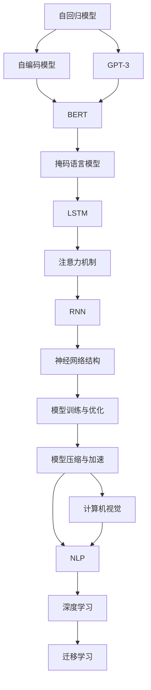

                 

# 大语言模型原理基础与前沿 语言建模的挑战

> 关键词：大语言模型, 自回归模型, 自编码模型, 掩码语言模型, 长短期记忆网络(LSTM), 注意力机制, 循环神经网络(RNN), 神经网络结构, 模型训练与优化, 计算机视觉, 自然语言处理(NLP), 深度学习, 迁移学习

## 1. 背景介绍

在深度学习蓬勃发展的今天，大语言模型（Large Language Models, LLMs）已经成为自然语言处理（NLP）领域的核心技术之一。这些模型基于大量的文本数据进行预训练，能够捕获语言的复杂模式和语义信息，从而在各种NLP任务上取得优异的性能。然而，语言建模并非易事，其背后涉及大量复杂的数学和计算问题。本文将全面介绍大语言模型原理，并通过一些前沿研究来揭示语言建模的挑战。

## 2. 核心概念与联系

### 2.1 核心概念概述

在大语言模型的构建和应用过程中，以下概念至关重要：

- **自回归模型**（Autoregressive Model）：一种模型结构，其中每个时间步的输出只依赖于之前的时间步输出。GPT系列的模型便采用了自回归结构。

- **自编码模型**（Autoencoder Model）：一种模型结构，通过编码器-解码器的架构，将输入映射到低维表示，再通过解码器还原到原输入。BERT便是典型的自编码模型。

- **掩码语言模型**（Masked Language Model, MLM）：一种预训练任务，其中随机掩盖部分输入序列，模型需要预测被掩盖的部分，从而学习语言的上下文信息。BERT即通过掩码语言模型进行预训练。

- **长短期记忆网络（LSTM）**：一种特殊的RNN，能够处理长期依赖关系，广泛应用于序列数据的建模。

- **注意力机制**（Attention Mechanism）：一种用于提取序列中关键信息的机制，可以关注输入序列的不同部分，提升模型的性能。

- **循环神经网络（RNN）**：一种能够处理序列数据的神经网络结构，能够捕捉序列内部的动态变化。

- **神经网络结构**（Neural Network Architecture）：包括全连接层、卷积层、池化层、循环层等，是模型训练的基础。

- **模型训练与优化**（Model Training and Optimization）：通过反向传播和梯度下降等算法，优化模型参数以最小化损失函数。

- **计算机视觉（Computer Vision）**：与语言模型不同，计算机视觉模型通常处理图像数据。

- **自然语言处理（NLP）**：专注于处理人类语言数据，包括文本分类、情感分析、机器翻译等任务。

- **深度学习（Deep Learning）**：使用多层神经网络进行复杂数据处理的机器学习方法。

- **迁移学习（Transfer Learning）**：利用预训练模型在特定任务上的性能，通过微调进行迁移学习。

- **模型压缩与加速**（Model Compression and Acceleration）：通过量化、剪枝等技术，提升模型的效率和可部署性。

这些概念之间通过深度学习模型构建的框架紧密联系，共同构成了一个完整的语言模型学习体系。

### 2.2 核心概念原理和架构的 Mermaid 流程图



## 3. 核心算法原理 & 具体操作步骤

### 3.1 算法原理概述

大语言模型的核心算法原理包括以下几个方面：

- **自回归语言模型**：使用自回归模型来生成文本，每个时间步的输出仅依赖于前面的时间步。
- **自编码语言模型**：通过编码器-解码器的结构，将输入序列映射到低维表示，然后解码回原序列。
- **掩码语言模型**：在预训练时，随机掩盖一部分输入序列，模型需要预测被掩盖的部分，从而学习上下文信息。

这些模型通过多层神经网络进行构建，通常包含自注意力机制和残差连接，用于捕捉序列中的依赖关系。在训练过程中，使用反向传播和梯度下降等算法优化模型参数，最小化预测误差。

### 3.2 算法步骤详解

大语言模型的训练通常分为两个阶段：预训练和微调。以下是详细的步骤：

**预训练阶段**：

1. **数据准备**：收集大量的文本数据，并进行预处理，如分词、归一化、去除停用词等。
2. **模型初始化**：使用随机权重初始化模型。
3. **掩码语言模型训练**：在训练集上使用掩码语言模型进行训练，掩盖部分输入，让模型预测被掩盖的部分。
4. **模型保存**：保存训练好的模型，供后续微调使用。

**微调阶段**：

1. **数据准备**：收集目标任务的标注数据集。
2. **模型加载**：加载预训练好的模型。
3. **任务适配层添加**：根据任务类型，在顶层添加适当的输出层和损失函数。
4. **微调训练**：在目标数据集上使用微调数据集进行训练，更新模型参数。
5. **模型评估**：在验证集和测试集上评估微调后的模型性能。

### 3.3 算法优缺点

大语言模型的优点包括：

- **强大的泛化能力**：通过大量数据预训练，能够捕捉语言的复杂模式和语义信息。
- **高效的迁移学习**：预训练模型可以作为良好的初始化，在特定任务上微调，能够显著提升性能。
- **可扩展性**：可以通过添加更多的层和参数，提升模型的性能。

然而，大语言模型也存在一些缺点：

- **资源消耗大**：大模型需要大量的计算资源进行训练，且模型压缩与加速仍然是一个挑战。
- **过拟合风险**：在数据量较小的情况下，容易发生过拟合。
- **解释性不足**：模型的决策过程往往是“黑箱”，难以解释。
- **偏差问题**：由于训练数据的不均衡，模型可能会学习到有偏见的语言模式。

### 3.4 算法应用领域

大语言模型广泛应用于以下几个领域：

- **文本生成**：如自然语言生成、对话生成等。
- **文本分类**：如情感分析、主题分类等。
- **机器翻译**：将一种语言翻译成另一种语言。
- **信息抽取**：如命名实体识别、关系抽取等。
- **问答系统**：如智能客服、智能助手等。
- **情感分析**：分析文本的情感倾向。
- **语音识别**：将语音转换为文本。

## 4. 数学模型和公式 & 详细讲解 & 举例说明

### 4.1 数学模型构建

以自回归语言模型为例，其数学模型可以表示为：

$$
p(x_1, x_2, ..., x_n|x_0, x_1, ..., x_{n-1}) = \prod_{i=1}^n p(x_i|x_0, x_1, ..., x_{i-1})
$$

其中 $x_0, x_1, ..., x_n$ 表示输入序列，$p(x_i|x_0, x_1, ..., x_{i-1})$ 表示在已知前面文本的情况下，生成第 $i$ 个单词的概率。

### 4.2 公式推导过程

自回归语言模型的训练可以通过最大化似然函数来实现：

$$
\mathcal{L}(\theta) = -\frac{1}{N} \sum_{i=1}^N \log p(x_i|x_0, x_1, ..., x_{i-1})
$$

其中 $\theta$ 表示模型参数，$N$ 表示训练样本数量。通过反向传播和梯度下降等算法，优化模型参数，使得 $\mathcal{L}(\theta)$ 最小化。

### 4.3 案例分析与讲解

以BERT为例，其预训练任务包括掩码语言模型和下一句预测。对于掩码语言模型，输入序列中的某些单词被随机掩盖，模型需要预测这些被掩盖的单词。例如：

$$
p(x_2|x_0, x_1, x_3) = \frac{e^{W_{2} x_0 h_1 + b_{2}}}{\sum_{i=1}^{n} e^{W_{i} x_0 h_1 + b_{i}}}
$$

其中 $x_0, x_1, x_3$ 表示输入序列，$W_{2}$ 和 $b_{2}$ 表示模型参数，$h_1$ 表示隐藏层的输出。

## 5. 项目实践：代码实例和详细解释说明

### 5.1 开发环境搭建

要构建大语言模型，我们需要使用深度学习框架和相应的库。以TensorFlow和Keras为例，以下是基本的开发环境搭建步骤：

1. **安装TensorFlow**：

   ```bash
   pip install tensorflow
   ```

2. **安装Keras**：

   ```bash
   pip install keras
   ```

3. **安装其他库**：

   ```bash
   pip install numpy pandas scikit-learn
   ```

完成以上步骤后，就可以开始构建和训练大语言模型了。

### 5.2 源代码详细实现

以下是一个使用Keras实现的自回归语言模型的代码示例：

```python
from keras.models import Sequential
from keras.layers import Embedding, LSTM, Dense

# 构建模型
model = Sequential()
model.add(Embedding(input_dim=vocab_size, output_dim=embedding_dim, input_length=max_length))
model.add(LSTM(units=hidden_size))
model.add(Dense(units=vocab_size, activation='softmax'))

# 编译模型
model.compile(loss='categorical_crossentropy', optimizer='adam', metrics=['accuracy'])

# 训练模型
model.fit(X_train, y_train, batch_size=batch_size, epochs=epochs, validation_data=(X_val, y_val))
```

### 5.3 代码解读与分析

- `Sequential`：创建序列模型。
- `Embedding`：嵌入层，将输入序列转换为向量表示。
- `LSTM`：长短期记忆网络层，用于捕捉序列中的依赖关系。
- `Dense`：全连接层，将LSTM层的输出转换为最终的输出概率分布。
- `categorical_crossentropy`：交叉熵损失函数，用于计算预测概率与真实标签之间的差异。
- `adam`：优化器，用于更新模型参数。
- `accuracy`：评估指标，用于衡量模型预测的准确率。

### 5.4 运行结果展示

在训练过程中，可以通过 `model.evaluate(X_test, y_test)` 来评估模型在测试集上的性能。

```python
test_loss, test_accuracy = model.evaluate(X_test, y_test)
print('Test loss:', test_loss)
print('Test accuracy:', test_accuracy)
```

## 6. 实际应用场景

### 6.1 文本生成

文本生成是自然语言处理中最具挑战性的任务之一。大语言模型通过学习大量的文本数据，能够生成高质量的自然语言文本，广泛应用于对话生成、机器翻译、文本摘要等场景。例如，GPT-3模型在文本生成任务上取得了领先的成绩。

### 6.2 文本分类

文本分类是自然语言处理中的基础任务，包括情感分析、主题分类、垃圾邮件过滤等。大语言模型通过微调，能够适应各种文本分类任务，并提供高精度的分类结果。

### 6.3 机器翻译

机器翻译是将一种语言转换为另一种语言的过程。大语言模型通过微调，能够实现高效的机器翻译，提升了翻译的准确性和流畅度。

### 6.4 信息抽取

信息抽取是从文本中提取结构化信息的过程，包括命名实体识别、关系抽取等。大语言模型通过微调，能够准确识别文本中的实体和关系，为知识图谱构建、信息检索等任务提供支撑。

## 7. 工具和资源推荐

### 7.1 学习资源推荐

1. **《深度学习》课程**：由吴恩达教授主讲，介绍了深度学习的基本概念和算法。
2. **《自然语言处理入门》课程**：由斯坦福大学开设，介绍了自然语言处理的基本技术和方法。
3. **Kaggle**：一个数据科学竞赛平台，提供了大量的NLP数据集和比赛项目，可以帮助你深入了解自然语言处理的应用。

### 7.2 开发工具推荐

1. **TensorFlow**：由Google开发，支持深度学习模型的构建和训练。
2. **PyTorch**：由Facebook开发，支持动态计算图，适合研究和实验。
3. **Keras**：一个高级深度学习库，易于使用，适合快速原型开发。

### 7.3 相关论文推荐

1. **Attention is All You Need**：提出了Transformer模型，开启了深度学习中的自注意力机制。
2. **BERT: Pre-training of Deep Bidirectional Transformers for Language Understanding**：提出了BERT模型，通过掩码语言模型进行预训练。
3. **GPT-3: Language Models are Unsupervised Multitask Learners**：介绍了GPT-3模型，展示了大语言模型的强大性能。
4. **Transformer-XL: Attentive Language Models Beyond a Fixed-Length Context**：提出了Transformer-XL模型，支持长序列的文本生成。
5. **StructBERT: A Structured Self-supervised Word Embedding**：提出StructBERT模型，通过结构化预训练任务提升模型性能。

## 8. 总结：未来发展趋势与挑战

### 8.1 研究成果总结

大语言模型在自然语言处理中取得了显著的进展，其基于深度学习的架构和强大的泛化能力，使得大模型在各种NLP任务上取得了领先的性能。然而，语言建模仍然面临一些挑战，需要进一步的研究和探索。

### 8.2 未来发展趋势

未来，大语言模型的发展趋势包括：

- **模型的规模和复杂度将进一步提升**：随着计算能力的提高，模型的参数量和复杂度将持续增加，从而提升模型的性能。
- **多模态学习的融合**：将计算机视觉、语音识别等技术与自然语言处理结合，提升模型对复杂场景的适应能力。
- **自适应学习的引入**：引入自适应学习算法，让模型能够根据输入数据的特征动态调整自身参数，提升模型的灵活性和泛化能力。
- **模型压缩与加速**：通过模型压缩、量化等技术，提升模型的效率和可部署性，实现更广泛的实际应用。
- **知识图谱的整合**：将知识图谱与模型结合，增强模型对知识点的理解和应用。

### 8.3 面临的挑战

大语言模型面临的挑战包括：

- **计算资源的需求**：大模型的训练和推理需要大量的计算资源，如何高效利用这些资源是一个重要的问题。
- **过拟合的风险**：在数据量较小的情况下，模型容易发生过拟合。
- **模型的可解释性**：大模型的决策过程往往是“黑箱”，难以解释。
- **偏见和伦理问题**：模型可能会学习到有偏见的语言模式，给实际应用带来风险。

### 8.4 研究展望

未来的研究需要在以下几个方向进行探索：

- **无监督学习的探索**：探索无监督学习和半监督学习的技术，降低对标注数据的依赖。
- **多模态学习的深入**：进一步研究多模态学习的融合技术，提升模型对复杂场景的适应能力。
- **自适应学习的改进**：研究自适应学习的算法，提升模型的灵活性和泛化能力。
- **模型压缩与加速的技术**：研究高效模型压缩与加速技术，提升模型的效率和可部署性。
- **知识图谱的整合**：研究如何将知识图谱与模型结合，增强模型的知识应用能力。

## 9. 附录：常见问题与解答

**Q1：大语言模型和传统的机器学习方法有什么区别？**

A: 大语言模型是基于深度学习的大规模预训练模型，能够学习复杂的语言模式和语义信息。传统的机器学习方法通常是基于手工设计的特征工程和算法，难以捕捉语言中的复杂模式。

**Q2：大语言模型的训练需要哪些步骤？**

A: 大语言模型的训练通常包括以下步骤：

1. 数据准备：收集大量的文本数据，并进行预处理。
2. 模型初始化：使用随机权重初始化模型。
3. 预训练：使用掩码语言模型进行预训练。
4. 微调：在特定任务上微调模型。
5. 模型评估：在测试集上评估模型性能。

**Q3：大语言模型的优缺点是什么？**

A: 大语言模型的优点包括：

- 强大的泛化能力：通过大量数据预训练，能够捕捉语言的复杂模式和语义信息。
- 高效的迁移学习：预训练模型可以作为良好的初始化，在特定任务上微调，能够显著提升性能。

大语言模型的缺点包括：

- 资源消耗大：大模型需要大量的计算资源进行训练，且模型压缩与加速仍然是一个挑战。
- 过拟合风险：在数据量较小的情况下，容易发生过拟合。
- 解释性不足：模型的决策过程往往是“黑箱”，难以解释。
- 偏差问题：由于训练数据的不均衡，模型可能会学习到有偏见的语言模式。

**Q4：大语言模型的训练过程中如何避免过拟合？**

A: 大语言模型训练过程中可以采用以下方法避免过拟合：

- 数据增强：通过数据增强技术，扩充训练集，增强模型的泛化能力。
- 正则化：使用L2正则、Dropout等正则化技术，限制模型的复杂度。
- 早期停止：在验证集上监控模型性能，一旦性能下降，立即停止训练。
- 模型压缩与加速：通过模型压缩、量化等技术，减小模型复杂度，提升模型泛化能力。

**Q5：大语言模型在实际应用中需要注意哪些问题？**

A: 大语言模型在实际应用中需要注意以下问题：

- 数据质量：保证训练数据的质量，避免模型学习到有偏见的语言模式。
- 计算资源：大模型的训练和推理需要大量的计算资源，需要合理配置资源。
- 模型的可解释性：大模型的决策过程往往是“黑箱”，需要提供模型解释，增强模型的透明度。
- 模型的伦理和安全性：需要确保模型不产生有害的输出，避免对社会产生负面影响。

---

作者：禅与计算机程序设计艺术 / Zen and the Art of Computer Programming

