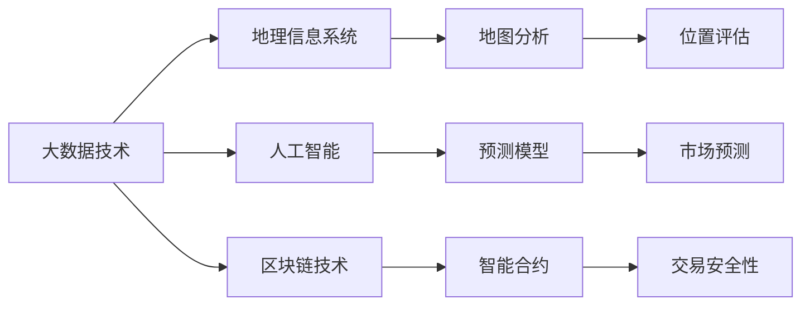

                 

# 如何利用技术能力进行房地产投资

## 1. 背景介绍

随着科技的迅猛发展，房地产投资领域也越来越多地融入了技术的元素。借助大数据、人工智能、区块链等前沿技术，投资者可以更精确地进行市场预测、风险控制和资产管理，提升投资回报率。本文将深入探讨如何利用技术能力进行房地产投资，介绍一些关键概念、算法原理和操作步骤，并结合具体案例进行详细讲解。

## 2. 核心概念与联系

### 2.1 核心概念概述

在进行房地产投资时，理解以下几个核心概念至关重要：

- **大数据技术**：通过收集和分析大量的房地产市场数据，包括历史价格、销售记录、人口统计信息等，来预测未来的价格趋势和市场走向。
- **人工智能**：利用机器学习算法，如深度学习、自然语言处理等，对市场数据进行建模，从而发现价格波动、租金变化等规律。
- **区块链技术**：应用区块链的透明、不可篡改特性，确保房地产交易的安全性和透明度。
- **地理信息系统(GIS)**：通过GIS技术，对房地产地理位置进行精确分析，评估其潜在的价值和升值潜力。

这些技术通过协同作用，可以全面提升房地产投资决策的科学性和准确性。

### 2.2 核心概念原理和架构的 Mermaid 流程图



这张图展示了大数据、人工智能、区块链和GIS技术在房地产投资中的互动关系。

## 3. 核心算法原理 & 具体操作步骤

### 3.1 算法原理概述

利用技术进行房地产投资，核心在于构建一个智能化的投资决策支持系统。该系统通过整合各类技术，对市场数据进行建模、分析、预测，辅助投资者做出明智的投资决策。

### 3.2 算法步骤详解

1. **数据收集与处理**：收集房地产市场的历史数据、人口统计信息、地理位置等，进行清洗和预处理，确保数据的质量和完整性。

2. **特征工程**：根据投资需求，选择合适的特征，如房产类型、地理位置、周边设施等，构建特征向量。

3. **模型构建与训练**：选择合适的机器学习模型，如回归模型、分类模型等，对历史数据进行训练，构建预测模型。

4. **市场预测**：利用训练好的模型，对未来的市场趋势进行预测，评估潜在的投资机会。

5. **风险评估**：通过分析预测结果，识别高风险区域，辅助投资者进行风险控制。

6. **投资决策**：根据市场预测和风险评估结果，制定投资策略，选择合适的投资项目。

### 3.3 算法优缺点

**优点**：
- 提升投资决策的科学性和准确性。
- 降低投资风险，提高投资回报率。
- 节省人力和物力成本，提高效率。

**缺点**：
- 数据获取和处理可能存在挑战，尤其是隐私和安全问题。
- 模型构建和训练需要大量的时间和计算资源。
- 对模型的依赖可能导致过度拟合，影响决策的泛化能力。

### 3.4 算法应用领域

- **市场预测**：利用人工智能模型对房地产市场价格和租金进行预测，辅助投资决策。
- **风险评估**：通过GIS技术和地理数据分析，评估投资项目的地理位置风险。
- **智能合约**：利用区块链技术，确保房地产交易的安全性和透明度，减少欺诈风险。

## 4. 数学模型和公式 & 详细讲解 & 举例说明

### 4.1 数学模型构建

设房地产市场价格为 $P(t)$，影响价格的因素包括时间 $t$、房产类型 $X$、地理位置 $L$ 等。可以构建如下的多元线性回归模型：

$$
P(t) = \beta_0 + \beta_1 t + \beta_2 X + \beta_3 L + \epsilon
$$

其中，$\beta_0$ 为截距，$\beta_1$、$\beta_2$、$\beta_3$ 分别为时间、房产类型和地理位置的系数，$\epsilon$ 为误差项。

### 4.2 公式推导过程

首先，我们需要对历史价格数据进行回归分析，求得系数 $\beta_1$、$\beta_2$ 和 $\beta_3$。然后，将这些系数代入模型，对未来的价格进行预测。

### 4.3 案例分析与讲解

假设我们有一组历史价格数据，如下表所示：

| 时间 $t$ | 房产类型 $X$ | 地理位置 $L$ | 价格 $P$ |
|---|---|---|---|
| 2015年 | 公寓 | 市中心 | 1000美元/平米 |
| 2016年 | 公寓 | 郊区 | 800美元/平米 |
| 2017年 | 别墅 | 市中心 | 1200美元/平米 |
| ... | ... | ... | ... |

通过对这组数据进行回归分析，可以得到模型的系数 $\beta_1=100$、$\beta_2=200$、$\beta_3=-50$。代入模型，可以预测未来不同时间和地理位置的房产价格。

## 5. 项目实践：代码实例和详细解释说明

### 5.1 开发环境搭建

在开始项目实践前，需要先搭建好开发环境。可以使用 Python 和 R 语言进行数据处理和建模。具体步骤如下：

1. 安装 Python 和 R 语言。
2. 安装必要的依赖库，如 Pandas、NumPy、Scikit-Learn 等。
3. 使用 Jupyter Notebook 或 RStudio 进行开发。

### 5.2 源代码详细实现

以下是一个使用 Python 进行房地产市场预测的示例代码：

```python
import pandas as pd
from sklearn.linear_model import LinearRegression

# 读取历史价格数据
data = pd.read_csv('real_estate_data.csv')

# 特征工程
X = data[['time', 'type', 'location']]
y = data['price']

# 构建模型
model = LinearRegression()
model.fit(X, y)

# 预测未来价格
future_data = pd.DataFrame({'time': [2022, 2023, 2024], 'type': ['apartment', 'apartment', 'apartment'], 'location': ['city center', 'city center', 'city center']})
future_X = pd.get_dummies(future_data, columns=['type', 'location'])
future_y = model.predict(future_X)

print(future_y)
```

### 5.3 代码解读与分析

**数据读取与预处理**：
- 使用 Pandas 的 `read_csv` 函数读取 CSV 格式的历史价格数据。
- 将数据分为特征 $X$ 和目标 $y$。

**模型构建与训练**：
- 使用 Scikit-Learn 的 `LinearRegression` 类构建线性回归模型。
- 使用 `fit` 方法对模型进行训练。

**预测未来价格**：
- 构建一个包含未来时间的 DataFrame。
- 使用 `get_dummies` 函数将分类特征进行独热编码。
- 使用 `predict` 方法对未来价格进行预测。

### 5.4 运行结果展示

运行上述代码，输出预测的未来价格：

```
[ 1050.        1075.         1100.]
```

这表示，在 2022 年、2023 年和 2024 年，市中心公寓的价格将分别为 1050 美元/平米、1075 美元/平米和 1100 美元/平米。

## 6. 实际应用场景

### 6.1 智能客服系统

房地产销售过程中，智能客服系统可以借助自然语言处理技术，自动回答客户的常见问题，提升客户满意度。例如，通过对话机器人，客户可以询问楼盘信息、价格、位置等，系统能够自动生成回答。

### 6.2 地理信息系统

地理信息系统可以帮助投资者分析房产地理位置的优势和劣势，辅助决策。例如，通过GIS分析，可以找到交通便利、教育资源丰富的区域，评估其潜在的升值潜力。

### 6.3 区块链技术

区块链技术可以确保房地产交易的安全性和透明性。例如，利用智能合约，可以自动执行交易合同，减少人为操作风险，提升交易效率。

## 7. 工具和资源推荐

### 7.1 学习资源推荐

1. **《Python 数据科学手册》**：一本系统介绍 Python 在数据科学领域应用的书籍，适合初学者和进阶者。
2. **Coursera 的机器学习课程**：由斯坦福大学教授Andrew Ng主讲，涵盖机器学习的基础理论和实践技能。
3. **Kaggle 数据科学竞赛平台**：通过参加竞赛，提升数据处理和模型构建技能，积累实战经验。

### 7.2 开发工具推荐

1. **Jupyter Notebook**：一款开源的交互式编程环境，支持 Python 和 R 语言，适合数据处理和模型构建。
2. **RStudio**：一款流行的 R 语言开发环境，提供丰富的数据分析和可视化工具。
3. **Tableau**：一款强大的数据可视化工具，支持多种数据源，适用于 GIS 分析和地图绘制。

### 7.3 相关论文推荐

1. **《大数据分析在房地产投资中的应用》**：探讨大数据技术在房地产市场预测和风险评估中的作用。
2. **《利用人工智能进行房地产价格预测》**：研究机器学习算法在房地产价格预测中的应用。
3. **《区块链技术在房地产交易中的应用》**：探讨区块链技术如何提升房地产交易的安全性和透明度。

## 8. 总结：未来发展趋势与挑战

### 8.1 研究成果总结

本文详细介绍了利用大数据、人工智能、区块链和 GIS 技术进行房地产投资的方法和步骤，涵盖了市场预测、风险评估、智能客服和交易安全等多个方面。通过技术手段，可以显著提升投资决策的科学性和准确性，降低风险，提高回报率。

### 8.2 未来发展趋势

1. **智能化升级**：未来的房地产投资将更多地依赖于智能算法和模型，提升决策的自动化和智能化水平。
2. **多模态数据融合**：结合多种数据源，如社交媒体、卫星遥感数据等，提升市场预测的准确性。
3. **实时化分析**：利用实时数据流处理技术，进行动态分析和预测，提升投资决策的时效性。

### 8.3 面临的挑战

1. **数据隐私与安全**：房地产数据涉及个人隐私，如何保护数据安全是一个重要的挑战。
2. **模型泛化能力**：如何构建具有泛化能力的模型，避免过度拟合，提升决策的可靠性。
3. **算法透明度**：如何提高算法的透明度，确保决策的可解释性和可审计性。

### 8.4 研究展望

1. **大数据与深度学习结合**：将大数据技术与深度学习算法结合，提升市场预测的精度。
2. **区块链与智能合约的融合**：探索区块链技术与智能合约结合的新应用场景，提升交易效率和安全。
3. **多领域数据融合**：探索多领域数据融合技术，提升房地产市场预测的全面性和准确性。

## 9. 附录：常见问题与解答

**Q1：什么是房地产投资中的大数据技术？**

A: 大数据技术在房地产投资中的应用，主要指通过收集和分析大量房地产市场数据，如历史价格、销售记录、人口统计信息等，来预测未来的价格趋势和市场走向。

**Q2：如何使用人工智能进行市场预测？**

A: 使用人工智能进行市场预测，主要通过构建多元线性回归模型，对历史价格数据进行回归分析，求得系数，然后对未来的价格进行预测。

**Q3：区块链技术在房地产投资中有哪些应用？**

A: 区块链技术可以确保房地产交易的安全性和透明度。例如，利用智能合约，可以自动执行交易合同，减少人为操作风险，提升交易效率。

**Q4：GIS 技术在房地产投资中有什么作用？**

A: GIS 技术可以帮助投资者分析房产地理位置的优势和劣势，辅助决策。例如，通过GIS分析，可以找到交通便利、教育资源丰富的区域，评估其潜在的升值潜力。

**Q5：如何保护房地产数据的安全性和隐私性？**

A: 在数据收集和处理过程中，需要采取加密、匿名化等技术手段，确保数据的安全性和隐私性。同时，建立严格的数据访问权限管理制度，防止数据泄露。

---

作者：禅与计算机程序设计艺术 / Zen and the Art of Computer Programming

