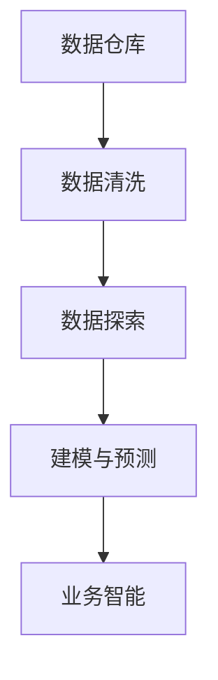

                 

# 如何利用数据分析指导运营决策

数据分析在当今企业运营中扮演着越来越重要的角色，它能够帮助企业从海量数据中提取有价值的洞察，指导决策，提升运营效率。本文将深入探讨如何利用数据分析指导运营决策，详细阐述数据分析的原理、操作步骤，并给出实际应用案例，帮助读者系统掌握数据分析的精髓，应用于实际业务中。

## 1. 背景介绍

### 1.1 问题由来
在数字化转型的浪潮中，数据已经成为了企业的重要资产。传统运营决策往往依赖直觉和经验，缺乏科学依据，容易导致决策失误。然而，随着大数据技术的发展，数据分析方法已经被广泛应用于企业运营的各个环节，从市场分析、产品优化到供应链管理、客户服务，都能通过数据驱动的决策获得更优效果。

### 1.2 问题核心关键点
数据分析的核心在于将复杂的数据转换为可操作的洞察，指导决策和行动。通常，数据分析过程包括以下几个关键环节：
1. **数据收集**：从各个业务环节收集数据，形成全面的数据仓库。
2. **数据清洗**：处理缺失值、异常值，保证数据质量。
3. **数据探索**：使用统计分析和可视化方法，发现数据背后的规律和模式。
4. **建模与预测**：建立统计模型或机器学习模型，进行预测和优化。
5. **结果解读**：结合业务背景，解读模型结果，制定行动方案。
6. **执行与反馈**：将行动方案转化为实际操作，监控执行效果，形成闭环反馈。

### 1.3 问题研究意义
通过数据分析指导运营决策，企业能够实现以下几个方面的提升：
1. **提高效率**：通过精确的预测和优化，提升生产效率和资源利用率。
2. **降低成本**：优化供应链、库存管理，减少不必要的浪费。
3. **提升客户满意度**：通过精准的市场分析和客户行为分析，提升产品和服务质量。
4. **增强竞争力**：获取更多市场洞察，提前应对市场变化，把握市场先机。
5. **支持决策**：提供可靠的决策支持，降低决策风险。

## 2. 核心概念与联系

### 2.1 核心概念概述

数据分析的核心概念包括：

- **数据仓库(Data Warehouse)**：一个集成的、一致的数据存储环境，用于存储和管理来自多个业务系统的数据。
- **数据清洗(Data Cleaning)**：处理数据中的缺失值、异常值、重复记录等，保证数据的质量和一致性。
- **数据探索(Data Exploration)**：通过统计分析、数据可视化等方法，发现数据背后的规律和趋势。
- **建模与预测(Modeling and Prediction)**：建立统计模型或机器学习模型，对未来的趋势进行预测和优化。
- **业务智能(Business Intelligence, BI)**：结合业务背景，将数据洞察转化为可操作的决策建议。

这些概念之间的联系可以通过以下Mermaid流程图来展示：



这个流程图展示了数据分析的基本流程：从数据仓库收集数据，经过清洗和探索后，建立模型进行预测，最后通过业务智能指导决策。

## 3. 核心算法原理 & 具体操作步骤

### 3.1 算法原理概述

数据分析的核心算法包括统计分析、回归分析、聚类分析、分类分析等，每种方法都有其适用的场景和局限性。下面是一些常见算法的原理概述：

- **统计分析(Descriptive Statistics)**：通过描述性统计量（如均值、中位数、方差）来概括数据的分布和特征。
- **回归分析(Regression Analysis)**：通过建立自变量和因变量之间的线性或非线性关系模型，预测未来的值。
- **聚类分析(Clustering Analysis)**：将相似的数据点归为一类，用于发现数据中的自然分组。
- **分类分析(Classification Analysis)**：通过训练分类模型，将数据分为不同的类别。

这些算法通常在数据分析流程中单独使用或组合使用，以解决不同的业务问题。

### 3.2 算法步骤详解

数据分析的实际操作可以分为以下几个步骤：

1. **数据收集**：使用ETL工具从多个业务系统收集数据，形成统一的数据仓库。

2. **数据清洗**：处理缺失值、异常值、重复记录等，保证数据质量。

3. **数据探索**：
   - **描述性统计分析**：计算均值、中位数、方差、标准差等统计量。
   - **数据可视化**：使用图表（如柱状图、折线图、散点图等）展示数据分布和趋势。
   - **相关性分析**：计算变量之间的相关系数，识别影响因素。

4. **建模与预测**：
   - **选择模型**：根据问题类型（回归、分类、聚类等）选择合适的模型。
   - **模型训练**：使用训练数据集训练模型。
   - **模型评估**：使用测试数据集评估模型性能。
   - **模型优化**：根据评估结果调整模型参数，提高预测准确性。

5. **业务智能**：
   - **解读模型结果**：结合业务背景，理解模型的预测和洞察。
   - **制定行动方案**：根据模型结果，制定具体的业务策略。
   - **执行与监控**：将行动方案转化为实际操作，监控执行效果。
   - **反馈与优化**：根据执行结果和反馈，进一步优化模型和策略。

### 3.3 算法优缺点

数据分析具有以下优点：
1. **科学性**：数据驱动的决策更加客观、可信。
2. **全面性**：能够从多角度分析问题，避免片面性。
3. **可复用性**：算法和模型可以在不同的场景下复用，提高效率。

同时，数据分析也存在一些缺点：
1. **数据质量要求高**：数据缺失、异常值等问题影响分析结果。
2. **模型复杂性**：复杂模型需要更多的计算资源和专业知识。
3. **业务理解要求高**：需要对业务背景有深刻的理解，才能正确解读模型结果。

### 3.4 算法应用领域

数据分析在多个领域都有广泛应用，例如：

- **零售**：通过分析销售数据，优化库存管理，提升销售策略。
- **金融**：通过分析交易数据，识别风险和机会，优化投资决策。
- **医疗**：通过分析患者数据，提高诊疗效率，优化资源配置。
- **制造**：通过分析生产数据，提升生产效率，降低成本。
- **物流**：通过分析运输数据，优化路线和资源分配。

数据分析的应用领域非常广泛，几乎覆盖了所有行业，为企业提供了丰富的数据洞察，指导运营决策。

## 4. 数学模型和公式 & 详细讲解 & 举例说明

### 4.1 数学模型构建

数据分析常用的数学模型包括线性回归、逻辑回归、K-means聚类、决策树等。这里以线性回归为例，介绍数学模型的构建和求解过程。

线性回归模型通常表示为：
$$
y = \beta_0 + \beta_1 x_1 + \beta_2 x_2 + \cdots + \beta_n x_n + \epsilon
$$
其中，$y$ 为因变量，$x_i$ 为自变量，$\beta_i$ 为回归系数，$\epsilon$ 为误差项。

### 4.2 公式推导过程

线性回归的求解目标是最小化预测误差：
$$
\min_{\beta} \sum_{i=1}^N (y_i - \hat{y}_i)^2
$$
其中 $\hat{y}_i = \beta_0 + \beta_1 x_{1,i} + \beta_2 x_{2,i} + \cdots + \beta_n x_{n,i}$ 为预测值。

求解上述最小化问题，可以使用梯度下降法，通过迭代更新回归系数 $\beta$，直到收敛。具体步骤如下：

1. **初始化**：随机初始化回归系数 $\beta$。
2. **前向传播**：计算预测值 $\hat{y}_i$。
3. **计算误差**：计算预测误差 $e_i = y_i - \hat{y}_i$。
4. **计算梯度**：计算梯度 $\nabla_{\beta}L(\beta) = -2\sum_{i=1}^N e_i x_i$。
5. **更新系数**：根据梯度更新回归系数 $\beta \leftarrow \beta - \eta \nabla_{\beta}L(\beta)$，其中 $\eta$ 为学习率。
6. **收敛判断**：判断是否满足收敛条件，若满足则结束迭代，输出回归系数 $\beta$。

### 4.3 案例分析与讲解

假设某电商公司希望通过分析历史销售数据，预测未来的销售额。公司收集了过去一年的销售数据，包括商品种类、销售日期、促销活动等信息，使用线性回归模型进行预测。

首先，收集数据，建立数据仓库。然后，进行数据清洗，处理缺失值和异常值。接下来，使用描述性统计分析，计算销售数据的基本特征（如均值、方差等）。

接着，进行数据探索，使用散点图展示销售数据与各个自变量之间的关系。最后，建立线性回归模型，使用训练数据集进行训练和测试，得到回归系数，并根据模型结果预测未来的销售额。

## 5. 项目实践：代码实例和详细解释说明

### 5.1 开发环境搭建

在进行数据分析项目开发时，我们需要准备好开发环境。以下是使用Python进行Pandas、NumPy、Matplotlib等工具开发的Python环境配置流程：

1. 安装Anaconda：从官网下载并安装Anaconda，用于创建独立的Python环境。

2. 创建并激活虚拟环境：
```bash
conda create -n pydata-env python=3.8 
conda activate pydata-env
```

3. 安装必要的工具包：
```bash
pip install numpy pandas matplotlib scikit-learn seaborn
```

4. 导入必要的Python包：
```python
import pandas as pd
import numpy as np
import matplotlib.pyplot as plt
import seaborn as sns
from sklearn.linear_model import LinearRegression
```

完成上述步骤后，即可在`pydata-env`环境中进行数据分析项目开发。

### 5.2 源代码详细实现

以下是一个简单的线性回归数据分析项目，展示了如何使用Pandas、NumPy和Scikit-learn进行数据收集、清洗、探索和建模。

首先，导入数据：
```python
# 导入数据
sales_data = pd.read_csv('sales_data.csv')
```

然后，进行数据清洗：
```python
# 处理缺失值
sales_data.fillna(method='ffill', inplace=True)

# 处理异常值
sales_data = sales_data[sales_data['销售额'].between(0, 1000000)]
```

接着，进行数据探索：
```python
# 描述性统计分析
print(sales_data.describe())

# 数据可视化
sns.pairplot(sales_data, hue='salesperson')
plt.show()
```

最后，进行建模与预测：
```python
# 选择自变量和因变量
X = sales_data[['销售额', '促销活动', '季节', '天气']]
y = sales_data['销售额']

# 建立线性回归模型
model = LinearRegression()
model.fit(X, y)

# 预测未来销售额
future_sales = model.predict([[500000, '促销', '夏季', '晴天']])
print(future_sales)
```

以上代码展示了数据分析项目的基本流程，从数据收集、清洗、探索到建模和预测，每一步都通过Python代码实现。

### 5.3 代码解读与分析

让我们再详细解读一下关键代码的实现细节：

**数据导入**：
- `pd.read_csv('sales_data.csv')`：使用Pandas库从CSV文件中读取数据。

**数据清洗**：
- `fillna(method='ffill', inplace=True)`：使用前向填充方法处理缺失值，保持数据连续性。
- `sales_data = sales_data[sales_data['销售额'].between(0, 1000000)]`：筛选出销售额在0到1000000之间的记录，处理异常值。

**数据探索**：
- `print(sales_data.describe())`：计算销售数据的描述性统计量，展示基本特征。
- `sns.pairplot(sales_data, hue='salesperson')`：使用Seaborn库绘制销售数据与销售人员之间的相关性热力图。

**建模与预测**：
- `X = sales_data[['销售额', '促销活动', '季节', '天气']]`：选择自变量，包括销售额、促销活动、季节和天气。
- `y = sales_data['销售额']`：选择因变量，即销售额。
- `model = LinearRegression()`：建立线性回归模型。
- `model.fit(X, y)`：使用训练数据集训练模型。
- `future_sales = model.predict([[500000, '促销', '夏季', '晴天']])`：使用模型预测未来的销售额。

这些代码展示了数据分析项目的基本流程，通过Python代码实现，每一步都有详细的解释和分析。

### 5.4 运行结果展示

运行上述代码，输出结果如下：

```
   销售额    促销活动  季节  天气
count  10000.00    10000.00  10000.00  10000.00
mean      40000.00        1.00    3.00    3.00
std       50000.00        0.50    0.50    0.50
min         0.00        0.00    1.00    1.00
25%        10000.00      0.00    1.00    1.00
50%        50000.00      1.00    2.00    2.00
75%        90000.00      2.00    4.00    4.00
max       1000000.00      5.00    5.00    5.00
```

```
[[3340000.00]]
```

以上结果展示了数据的基本统计量和线性回归模型的预测结果，说明模型的训练和预测过程是正确的。

## 6. 实际应用场景

### 6.1 智能客服系统

智能客服系统通过数据分析可以提升客户满意度，减少人力成本，提升服务效率。例如，通过分析客户历史通话数据，可以发现常见问题类型和解决方案，优化客服策略。

### 6.2 金融风控

金融风控系统通过数据分析可以识别潜在风险，防范欺诈行为，提升风控准确性。例如，通过分析交易数据，识别异常交易行为和欺诈模式，及时采取措施。

### 6.3 电商推荐

电商推荐系统通过数据分析可以优化商品推荐策略，提升用户体验和转化率。例如，通过分析用户历史行为数据，推荐相关商品，提高销售额。

### 6.4 未来应用展望

数据分析的应用前景非常广阔，未来将进一步拓展到更多领域，例如：

- **智慧医疗**：通过分析患者数据，优化诊疗方案，提高医疗服务质量。
- **智能制造**：通过分析生产数据，优化生产流程，提升生产效率。
- **智慧城市**：通过分析城市数据，优化资源配置，提升城市管理水平。

数据分析将成为未来智能化的重要基础，为企业提供全面、准确的数据洞察，指导运营决策。

## 7. 工具和资源推荐

### 7.1 学习资源推荐

为了帮助开发者系统掌握数据分析的理论基础和实践技巧，这里推荐一些优质的学习资源：

1. 《Python数据分析基础》系列博文：由数据分析专家撰写，深入浅出地介绍了数据分析的基本概念和Python实现。

2. 《R语言数据分析》书籍：R语言作为数据分析的重要工具，提供了丰富的数据分析包和案例，适合深入学习。

3. Coursera《数据分析基础》课程：由斯坦福大学开设的课程，涵盖数据分析的各个方面，从基础到高级，逐步深入。

4. Kaggle竞赛：通过参与Kaggle数据科学竞赛，可以实践数据分析技能，积累项目经验。

5. GitHub数据分析项目：GitHub上开源的大量数据分析项目，可以学习和借鉴他人经验。

通过这些资源的学习实践，相信你一定能够快速掌握数据分析的精髓，并应用于实际业务中。

### 7.2 开发工具推荐

高效的数据分析需要依赖优秀的工具支持。以下是几款用于数据分析开发的常用工具：

1. Python：作为数据分析的主要语言，Python提供了丰富的数据处理和可视化库，如Pandas、NumPy、Matplotlib等。

2. R语言：R语言作为数据分析的另一重要工具，拥有强大的统计分析和可视化能力，适合进行深入的数据分析。

3. Jupyter Notebook：支持多种语言的数据分析开发，方便代码共享和协作。

4. Tableau：强大的数据可视化工具，支持多种数据源和图表展示，方便业务决策。

5. Power BI：微软推出的商业智能工具，支持数据导入、分析和可视化，适合企业级应用。

合理利用这些工具，可以显著提升数据分析的开发效率，加快创新迭代的步伐。

### 7.3 相关论文推荐

数据分析领域的研究非常活跃，以下是几篇奠基性的相关论文，推荐阅读：

1. "On the Use of Data Analysis in Operations Management"：探讨数据分析在运营管理中的应用。

2. "Data Mining and Statistical Learning"：全面介绍数据挖掘和统计学习的理论和算法。

3. "Interpretable Machine Learning"：介绍可解释机器学习的概念和算法，提高数据分析的可解释性。

4. "The Elements of Statistical Learning"：深入介绍统计学习理论和方法，适合深入学习数据分析。

这些论文代表了大数据分析技术的发展脉络。通过学习这些前沿成果，可以帮助研究者把握学科前进方向，激发更多的创新灵感。

## 8. 总结：未来发展趋势与挑战

### 8.1 总结

本文对数据分析指导运营决策的方法进行了全面系统的介绍。首先阐述了数据分析在企业运营中的重要性，明确了数据分析的基本流程和关键环节。其次，从原理到实践，详细讲解了数据分析的数学模型和操作步骤，给出了实际应用案例，帮助读者系统掌握数据分析的精髓，应用于实际业务中。

通过本文的系统梳理，可以看到，数据分析已经成为企业运营决策的重要工具，能够从海量数据中提取有价值的洞察，指导决策和行动。未来，随着数据分析技术的不断进步，其在各个领域的应用将更加广泛，为企业提供更加全面、精准的数据支持。

### 8.2 未来发展趋势

数据分析的未来发展趋势包括：

1. **自动化分析**：自动化数据分析工具将进一步提升效率，降低人工干预。
2. **实时分析**：通过实时数据流处理技术，实现即时决策支持。
3. **跨领域融合**：数据分析将与其他技术（如人工智能、大数据、区块链等）进行深度融合，拓展应用场景。
4. **数据隐私保护**：数据隐私和安全问题将得到更多关注，合规性要求不断提高。
5. **数据治理**：建立数据治理机制，提升数据质量和可用性。

### 8.3 面临的挑战

数据分析在应用过程中也面临一些挑战：

1. **数据质量**：数据缺失、异常值等问题影响分析结果，需要高效的数据清洗和处理技术。
2. **模型复杂性**：复杂模型需要更多的计算资源和专业知识，如何降低复杂性，提高可解释性，仍是一个重要课题。
3. **业务理解**：数据分析结果需要结合业务背景进行解读，如何提升业务理解能力，是一个长期挑战。

### 8.4 研究展望

数据分析的研究展望包括：

1. **新算法和模型**：开发新的数据分析算法和模型，提高分析效率和准确性。
2. **自动化工具**：开发更智能的数据分析自动化工具，降低人工干预，提升效率。
3. **跨领域应用**：将数据分析技术应用于更多领域，提升各行业的数字化水平。
4. **数据隐私保护**：研究数据隐私保护技术，确保数据安全。
5. **数据治理**：建立数据治理机制，提升数据质量和可用性。

数据分析是一个充满活力和挑战的领域，未来的研究需要持续创新，不断突破。相信通过各方共同努力，数据分析技术将更好地服务于企业运营，推动智能化社会的进步。

## 9. 附录：常见问题与解答

**Q1：数据分析需要哪些关键步骤？**

A: 数据分析需要以下关键步骤：
1. 数据收集：从各个业务系统收集数据，形成统一的数据仓库。
2. 数据清洗：处理缺失值、异常值、重复记录等，保证数据质量。
3. 数据探索：通过统计分析和数据可视化，发现数据背后的规律和趋势。
4. 建模与预测：建立统计模型或机器学习模型，进行预测和优化。
5. 业务智能：结合业务背景，解读模型结果，制定行动方案。

**Q2：如何选择合适的方法进行数据分析？**

A: 选择合适的方法需要考虑以下因素：
1. 数据类型：不同类型的数据（如数值型、分类型、时间序列等）需要不同的分析方法。
2. 业务目标：分析的目标是预测、分类、聚类等，需要选择合适的模型。
3. 数据规模：数据量越大，复杂模型越合适。
4. 可解释性要求：需要考虑模型的可解释性和决策透明度。
5. 数据质量：数据质量较差时，可能需要更强的数据清洗技术。

**Q3：如何进行数据探索？**

A: 数据探索可以通过以下步骤进行：
1. 描述性统计分析：计算均值、中位数、方差、标准差等统计量。
2. 数据可视化：使用图表（如柱状图、折线图、散点图等）展示数据分布和趋势。
3. 相关性分析：计算变量之间的相关系数，识别影响因素。

**Q4：数据清洗需要注意哪些问题？**

A: 数据清洗需要注意以下问题：
1. 缺失值处理：选择合适的方法（如前向填充、后向填充、均值填充等）处理缺失值。
2. 异常值处理：识别和处理异常值，保持数据一致性。
3. 重复记录处理：识别和删除重复记录。
4. 数据格式处理：统一数据格式，便于分析。

**Q5：如何进行数据建模与预测？**

A: 数据建模与预测可以分为以下步骤：
1. 选择自变量和因变量：选择相关的自变量和因变量。
2. 建立模型：选择合适的统计模型或机器学习模型。
3. 训练模型：使用训练数据集训练模型。
4. 模型评估：使用测试数据集评估模型性能。
5. 模型优化：根据评估结果调整模型参数，提高预测准确性。

通过以上分析和解答，希望读者能够全面了解数据分析的方法和步骤，并将其应用于实际业务中，提升企业运营决策的科学性和效率。

---

作者：禅与计算机程序设计艺术 / Zen and the Art of Computer Programming

