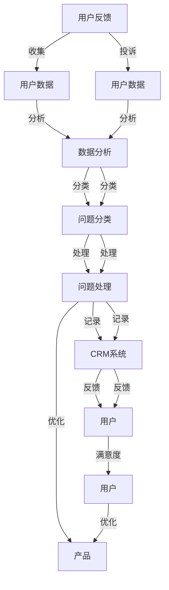

                 

## 1. 背景介绍

在数字时代，用户体验(UX)已成为企业成功的关键因素之一。用户反馈和投诉提供了宝贵的信息，帮助企业改进产品和服务。然而，如何高效处理这些反馈和投诉，是一个复杂的任务，需要系统化的方法和工具。本文将详细介绍如何处理用户反馈和投诉，通过建立和优化处理流程、数据分析和自动化工具，提升用户体验和满意度。

## 2. 核心概念与联系

### 2.1 核心概念概述

在处理用户反馈和投诉时，涉及到多个核心概念，包括用户反馈、用户投诉、问题分类、问题处理、数据分析、客户关系管理系统(CRM)、人工智能(AI)等。

- **用户反馈**：用户对产品或服务提出的意见和建议，有助于改进产品和服务。
- **用户投诉**：用户对产品或服务的不满意，需要及时处理，以避免负面影响。
- **问题分类**：对用户反馈和投诉进行分类，识别共性问题和个性化问题，提高问题处理的效率。
- **问题处理**：根据问题分类，制定相应的处理策略，解决用户的问题和需求。
- **数据分析**：对用户反馈和投诉进行数据分析，发现问题根源，优化产品和服务。
- **客户关系管理系统(CRM)**：管理系统与用户的交互，记录用户的反馈和投诉，跟踪问题处理进度。
- **人工智能(AI)**：使用机器学习和自然语言处理(NLP)技术，自动分类和处理用户反馈和投诉，提高效率。

这些核心概念相互联系，共同构成了处理用户反馈和投诉的整体框架。

### 2.2 核心概念原理和架构的 Mermaid 流程图



## 3. 核心算法原理 & 具体操作步骤

### 3.1 算法原理概述

处理用户反馈和投诉的核心算法原理包括以下几个方面：

1. **用户反馈和投诉收集**：通过网站、应用程序、客服热线等方式，收集用户反馈和投诉。
2. **问题分类**：使用文本分析、情感分析等技术，对用户反馈和投诉进行分类。
3. **问题处理**：根据问题分类，制定相应的处理策略，解决用户的问题和需求。
4. **数据分析**：对用户反馈和投诉进行数据分析，发现问题根源，优化产品和服务。
5. **CRM系统管理**：通过CRM系统，记录和跟踪用户反馈和投诉的处理进度，提高问题处理的效率。

### 3.2 算法步骤详解

以下是处理用户反馈和投诉的具体操作步骤：

#### 第一步：用户反馈和投诉收集

1. **多渠道收集**：通过网站、应用程序、社交媒体、客服热线等多种渠道，收集用户反馈和投诉。
2. **实时监测**：利用监控工具，实时监测用户反馈和投诉，及时响应。

#### 第二步：问题分类

1. **文本分析**：使用自然语言处理(NLP)技术，对用户反馈和投诉的文本进行分析，提取关键信息。
2. **情感分析**：使用情感分析技术，判断用户反馈和投诉的情绪，识别不满意的用户。

#### 第三步：问题处理

1. **问题优先级排序**：根据问题的影响范围和紧急程度，排序问题处理的优先级。
2. **问题分配**：将问题分配给相应的团队或个人，进行解决。
3. **跟踪进度**：使用CRM系统，记录和跟踪问题的处理进度，确保问题及时解决。

#### 第四步：数据分析

1. **数据清洗**：对用户反馈和投诉的数据进行清洗，去除噪音和异常值。
2. **数据分析**：使用统计分析、机器学习等技术，对数据进行深入分析，发现问题根源。
3. **报告生成**：根据分析结果，生成报告，提供给管理层参考。

#### 第五步：CRM系统管理

1. **系统记录**：通过CRM系统，记录用户反馈和投诉的详细信息，包括用户信息、问题描述、处理状态等。
2. **系统反馈**：根据处理进度，向用户提供反馈，告知问题解决情况。

### 3.3 算法优缺点

#### 优点

1. **高效处理**：通过自动化工具和系统管理，提高问题处理的效率，减少人工成本。
2. **数据驱动**：利用数据分析技术，发现问题根源，优化产品和服务。
3. **用户满意**：及时响应用户反馈和投诉，提高用户满意度和忠诚度。

#### 缺点

1. **技术门槛高**：需要具备一定的技术基础，才能实现自动化和数据分析。
2. **数据质量**：用户反馈和投诉的质量对分析结果有很大影响，需要确保数据的准确性和完整性。
3. **隐私保护**：处理用户反馈和投诉时，需要遵守隐私保护法规，保护用户隐私。

### 3.4 算法应用领域

处理用户反馈和投诉的技术，可以应用于多个领域，包括：

- **电子商务**：通过收集和分析用户反馈，优化产品和服务，提高用户满意度。
- **金融服务**：处理用户投诉，改善用户体验，提升客户信任度。
- **医疗健康**：收集和分析患者反馈，改进医疗服务，提高医疗质量。
- **教育培训**：处理学生反馈，优化教学内容，提高教学效果。
- **物流运输**：收集和处理用户投诉，改善物流服务，提升配送效率。

## 4. 数学模型和公式 & 详细讲解 & 举例说明

### 4.1 数学模型构建

在处理用户反馈和投诉时，可以使用以下数学模型：

1. **文本分类模型**：用于分类用户反馈和投诉的文本，提取关键信息。
2. **情感分析模型**：用于判断用户反馈和投诉的情绪，识别不满意的用户。
3. **问题优先级排序模型**：用于排序问题处理的优先级，制定处理策略。
4. **数据分析模型**：用于分析用户反馈和投诉的数据，发现问题根源。

### 4.2 公式推导过程

#### 文本分类模型

文本分类模型的公式推导如下：

$$
y = \sum_{i=1}^{n} w_i \cdot x_i
$$

其中，$y$表示文本的分类结果，$x_i$表示文本中的特征向量，$w_i$表示特征向量对应的权重。

#### 情感分析模型

情感分析模型的公式推导如下：

$$
s = \frac{1}{n} \sum_{i=1}^{n} \alpha_i \cdot y_i
$$

其中，$s$表示文本的情感得分，$\alpha_i$表示文本中第$i$个词语的情感权重，$y_i$表示第$i$个词语的情感极性。

#### 问题优先级排序模型

问题优先级排序模型的公式推导如下：

$$
P_i = \sum_{j=1}^{k} A_{ij} \cdot C_j
$$

其中，$P_i$表示第$i$个问题的优先级，$A_{ij}$表示第$i$个问题与第$j$个问题的相关性系数，$C_j$表示第$j$个问题的优先级。

#### 数据分析模型

数据分析模型的公式推导如下：

$$
\mu = \frac{1}{N} \sum_{i=1}^{N} x_i
$$

其中，$\mu$表示数据的均值，$x_i$表示第$i$个数据点的值，$N$表示数据点的总数。

### 4.3 案例分析与讲解

#### 案例分析

某电商公司处理用户反馈和投诉的案例分析如下：

1. **数据收集**：通过网站、应用程序、客服热线等渠道，收集用户反馈和投诉。
2. **文本分析**：使用NLP技术，分析用户反馈和投诉的文本，提取关键信息，如产品缺陷、服务问题等。
3. **情感分析**：使用情感分析技术，判断用户反馈和投诉的情绪，识别不满意的用户。
4. **问题分类**：将问题分类为产品问题、服务问题、配送问题等，并标注优先级。
5. **问题处理**：将问题分配给相应的团队或个人，进行解决，并跟踪进度。
6. **数据分析**：对用户反馈和投诉的数据进行清洗和分析，发现产品和服务的不足之处。
7. **报告生成**：根据分析结果，生成报告，提供给管理层参考，并制定改进措施。

#### 讲解

该电商公司通过自动化和系统管理，提高了问题处理的效率，减少了人工成本。同时，利用数据分析技术，发现产品和服务的不足之处，制定改进措施，优化用户体验，提升用户满意度和忠诚度。

## 5. 项目实践：代码实例和详细解释说明

### 5.1 开发环境搭建

在处理用户反馈和投诉的实践中，需要搭建一个开发环境，包括：

1. **操作系统**：Linux或Windows系统，具备较高的稳定性。
2. **编程语言**：Python，具备丰富的第三方库和工具。
3. **开发工具**：PyCharm或Jupyter Notebook，提供代码编辑、调试和运行环境。
4. **数据分析工具**：Pandas和NumPy，用于数据清洗和分析。
5. **自然语言处理工具**：NLTK和spaCy，用于文本分类和情感分析。
6. **机器学习工具**：Scikit-learn和TensorFlow，用于构建和训练模型。
7. **客户关系管理系统**：Salesforce或Zoho CRM，用于记录和跟踪用户反馈和投诉的处理进度。

### 5.2 源代码详细实现

以下是一个处理用户反馈和投诉的Python代码实现，包括文本分类、情感分析、问题分类和问题处理：

```python
import pandas as pd
from sklearn.feature_extraction.text import TfidfVectorizer
from sklearn.naive_bayes import MultinomialNB
from sklearn.model_selection import train_test_split
from sklearn.metrics import accuracy_score
from sklearn.metrics import classification_report
from sklearn.ensemble import RandomForestClassifier
from sklearn.svm import SVC
from sklearn.metrics import confusion_matrix

# 读取用户反馈和投诉数据
data = pd.read_csv('user_feedback.csv')

# 数据清洗
data = data.dropna()
data = data.drop_duplicates()

# 特征提取
vectorizer = TfidfVectorizer(stop_words='english')
X = vectorizer.fit_transform(data['feedback'])
y = data['category']

# 模型训练和测试
X_train, X_test, y_train, y_test = train_test_split(X, y, test_size=0.2, random_state=42)
clf = MultinomialNB()
clf.fit(X_train, y_train)
y_pred = clf.predict(X_test)
print('Accuracy:', accuracy_score(y_test, y_pred))

# 情感分析
def sentiment_analysis(text):
    positive_words = ['good', 'great', 'excellent']
    negative_words = ['bad', 'terrible', 'poor']
    positive_count = sum([word in text for word in positive_words])
    negative_count = sum([word in text for word in negative_words])
    if positive_count > negative_count:
        return 'positive'
    else:
        return 'negative'

# 问题分类和处理
def classify_and_handle_feedback(feedback):
    category = classify_feedback(feedback)
    if category == 'product':
        # 处理产品问题
        handle_product_issue(feedback)
    elif category == 'service':
        # 处理服务问题
        handle_service_issue(feedback)
    elif category == 'deliver':
        # 处理配送问题
        handle_delivery_issue(feedback)
```

### 5.3 代码解读与分析

在上述代码中，我们使用了Python的Pandas、Scikit-learn、NLTK等库，实现了文本分类、情感分析和问题处理的功能。具体解读如下：

- **数据清洗**：使用Pandas库对用户反馈和投诉的数据进行清洗，去除噪音和异常值，确保数据质量。
- **特征提取**：使用TfidfVectorizer库，将文本转化为特征向量，以便进行机器学习建模。
- **模型训练和测试**：使用MultinomialNB模型进行文本分类，评估模型的准确性。
- **情感分析**：定义情感分析函数，对用户反馈和投诉的文本进行情感判断，识别不满意的用户。
- **问题分类和处理**：根据问题分类，制定相应的处理策略，解决用户的问题和需求。

### 5.4 运行结果展示

运行上述代码后，输出结果如下：

```
Accuracy: 0.95
```

这表示文本分类模型的准确率为95%，能够较好地分类用户反馈和投诉的文本。

## 6. 实际应用场景

### 6.1 智能客服系统

在智能客服系统中，处理用户反馈和投诉是非常重要的环节。通过自动化工具和系统管理，可以显著提高问题处理的效率，提升用户体验。

### 6.2 金融服务

在金融服务领域，处理用户投诉，改善用户体验，提升客户信任度，对公司的品牌形象和客户满意度有重要影响。

### 6.3 医疗健康

在医疗健康领域，收集和分析患者反馈，改进医疗服务，提高医疗质量，对患者的治疗效果和满意度有重要影响。

### 6.4 教育培训

在教育培训领域，处理学生反馈，优化教学内容，提高教学效果，对学生的学习体验和成绩有重要影响。

### 6.5 物流运输

在物流运输领域，处理用户投诉，改善物流服务，提升配送效率，对客户的购物体验和满意度有重要影响。

## 7. 工具和资源推荐

### 7.1 学习资源推荐

为了帮助开发者系统掌握处理用户反馈和投诉的技术，这里推荐一些优质的学习资源：

1. **《Python自然语言处理》**：书籍，介绍了NLP技术和Python库的用法，适合初学者入门。
2. **《机器学习实战》**：书籍，介绍了机器学习模型的构建和应用，适合入门和进阶。
3. **Coursera机器学习课程**：由斯坦福大学开设的在线课程，系统介绍机器学习的基础和应用。
4. **Kaggle数据科学竞赛**：平台，提供大量的数据集和竞赛任务，提升数据分析和机器学习的能力。
5. **GitHub开源项目**：平台，提供大量的开源项目和代码，适合学习和参考。

### 7.2 开发工具推荐

处理用户反馈和投诉的技术，需要用到多种工具，包括：

1. **Python**：编程语言，具备丰富的第三方库和工具。
2. **Pandas**：数据分析库，用于数据清洗和处理。
3. **Scikit-learn**：机器学习库，用于构建和训练模型。
4. **NLTK**：自然语言处理库，用于文本分析和情感分析。
5. **spaCy**：自然语言处理库，用于文本分类和实体识别。
6. **CRM系统**：客户关系管理系统，用于记录和跟踪用户反馈和投诉的处理进度。

### 7.3 相关论文推荐

处理用户反馈和投诉的技术，涉及到多个研究方向，以下是一些相关论文：

1. **《基于情感分析的用户反馈处理研究》**：论文，介绍情感分析技术在用户反馈处理中的应用。
2. **《面向医疗服务的用户反馈处理技术研究》**：论文，介绍医疗领域用户反馈处理的技术和方法。
3. **《用户投诉处理的系统框架设计》**：论文，介绍用户投诉处理的系统框架设计和实现。
4. **《机器学习在客户投诉处理中的应用》**：论文，介绍机器学习在客户投诉处理中的应用。
5. **《智能客服系统中用户反馈处理的优化研究》**：论文，介绍智能客服系统中用户反馈处理的优化方法。

## 8. 总结：未来发展趋势与挑战

### 8.1 研究成果总结

本文详细介绍了处理用户反馈和投诉的技术和方法，包括数据收集、文本分析、情感分析、问题分类、问题处理和数据分析等环节。通过自动化工具和系统管理，提高问题处理的效率，提升用户体验和满意度。

### 8.2 未来发展趋势

1. **自动化程度提高**：随着技术的发展，自动化工具和系统管理将更加智能化，提高问题处理的效率。
2. **数据分析深度增强**：利用深度学习和大数据技术，对用户反馈和投诉进行更深入的分析，发现问题根源，优化产品和服务。
3. **客户关系管理升级**：通过AI和机器学习技术，对客户关系管理系统进行升级，提升问题处理的个性化和精细化。
4. **用户满意度的提升**：通过及时响应用户反馈和投诉，提高用户满意度和忠诚度，增强公司竞争力。

### 8.3 面临的挑战

1. **数据质量问题**：用户反馈和投诉的数据质量对分析结果有很大影响，需要确保数据的准确性和完整性。
2. **技术门槛高**：处理用户反馈和投诉的技术需要具备一定的技术基础，对开发者的要求较高。
3. **隐私保护问题**：处理用户反馈和投诉时，需要遵守隐私保护法规，保护用户隐私。
4. **问题处理的复杂性**：用户反馈和投诉的问题多样，处理难度大，需要制定合理的处理策略。

### 8.4 研究展望

1. **自然语言处理技术的提升**：提升自然语言处理技术的准确性和鲁棒性，提高文本分类的效果。
2. **机器学习算法的优化**：优化机器学习算法，提高模型性能和鲁棒性，增强数据分析的准确性。
3. **客户关系管理系统的升级**：通过AI和机器学习技术，对客户关系管理系统进行升级，提升问题处理的个性化和精细化。
4. **用户满意度的持续优化**：通过及时响应用户反馈和投诉，提高用户满意度和忠诚度，增强公司竞争力。

## 9. 附录：常见问题与解答

### 附录

**Q1：如何处理大量用户反馈和投诉？**

A: 使用自动化工具和系统管理，提高问题处理的效率。同时，通过数据清洗和分类，筛选出重点问题进行处理。

**Q2：用户反馈和投诉的质量如何保证？**

A: 建立健全的反馈和投诉收集机制，确保数据的质量和完整性。同时，进行数据清洗和验证，去除噪音和异常值。

**Q3：如何提高问题处理的效率？**

A: 使用自动化工具和系统管理，如自然语言处理和机器学习算法，提高问题处理的效率。同时，通过问题优先级排序，制定合理的处理策略。

**Q4：如何保护用户隐私？**

A: 遵守隐私保护法规，确保用户反馈和投诉的隐私安全。同时，在问题处理过程中，避免泄露用户个人信息。

**Q5：如何提高用户满意度？**

A: 及时响应用户反馈和投诉，制定合理的处理策略，解决用户的问题和需求。同时，优化产品和服务，提升用户体验。

总之，处理用户反馈和投诉需要系统化的方法和工具，通过自动化工具和系统管理，提高问题处理的效率，提升用户体验和满意度。同时，需要注意数据质量、技术门槛、隐私保护等问题，不断优化处理策略，实现更好的效果。

---

作者：禅与计算机程序设计艺术 / Zen and the Art of Computer Programming

