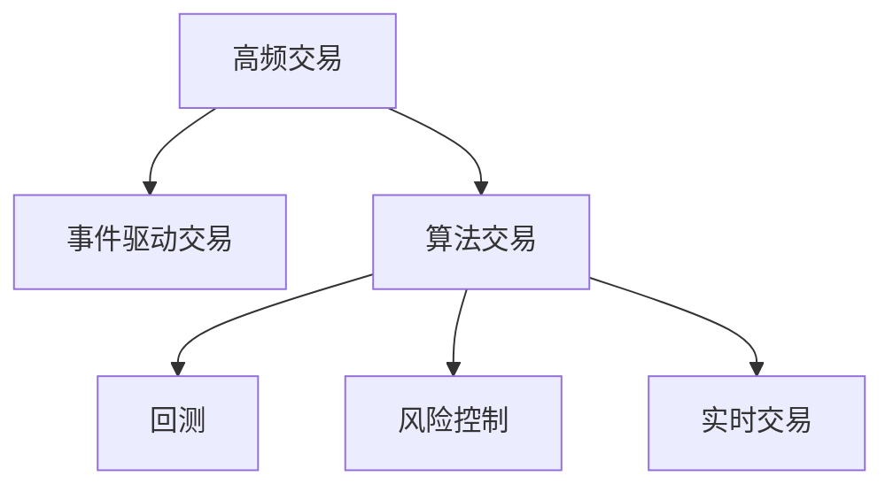

                 

# 如何将编程技能应用于量化交易

## 1. 背景介绍

### 1.1 问题由来

量化交易是利用计算机算法和数据分析进行股票、期货、外汇等金融市场交易的策略。它不同于传统的基于经验和直觉的交易方法，而是通过编程实现的自动交易系统，能够在瞬间分析海量数据，执行精确的交易操作。量化交易已成为金融领域的重要分支，吸引了越来越多的数学家、统计学家、计算机科学家等跨领域专家参与其中。

编程在量化交易中扮演着核心角色。从数据采集、模型构建、策略优化到风险控制，每个环节都离不开编程技能。编程不仅是实现算法的工具，更是量化交易思想的载体。本文将从编程的角度，系统介绍量化交易的核心概念、关键算法和实用技巧，帮助读者深入理解编程在量化交易中的应用。

### 1.2 问题核心关键点

量化交易中的编程涉及多个关键点：

- **数据采集**：获取股票价格、交易量、新闻事件等市场数据。
- **数据分析**：对历史数据进行统计分析、特征工程、趋势预测等。
- **模型构建**：建立多种交易模型，如趋势跟踪、均值回归、对冲套利等。
- **策略优化**：通过回测、风险控制等手段优化交易策略。
- **实时交易**：构建稳定可靠的实时交易系统，实现交易自动化。

本文将围绕以上关键点，详细介绍量化交易中的编程技能应用。

## 2. 核心概念与联系

### 2.1 核心概念概述

为了更好地理解量化交易中的编程技能应用，本节将介绍几个关键概念及其联系：

- **高频交易**：交易时间非常短，交易频率高，强调交易速度和执行效率。
- **事件驱动交易**：根据市场事件（如新闻发布、公司财报等）触发交易策略。
- **算法交易**：利用计算机算法执行交易决策，避免人为情绪干扰。
- **回测**：对历史数据进行模拟交易，测试交易策略的性能。
- **风险控制**：通过止损、仓位控制等手段，降低交易风险。
- **实时交易**：构建能够实时接收市场数据并执行交易的系统。

这些核心概念之间的逻辑关系可以通过以下Mermaid流程图来展示：



这个流程图展示量化交易的核心概念及其之间的关系：

1. 高频交易和事件驱动交易是算法交易的两种形式。
2. 回测和风险控制是算法交易策略优化的关键步骤。
3. 实时交易是算法交易策略落地的重要环节。

这些概念共同构成了量化交易的核心框架，通过编程技能实现各个环节的自动化和智能化，提升交易效率和策略执行效果。

## 3. 核心算法原理 & 具体操作步骤

### 3.1 算法原理概述

量化交易的核心算法主要包括趋势跟踪、均值回归、对冲套利、统计套利等。这些算法通常基于统计学和数学模型，通过编程实现具体的交易策略。

以趋势跟踪算法为例，其基本原理是通过统计分析历史价格数据，识别出市场趋势，并据此进行买卖操作。具体步骤如下：

1. **数据预处理**：收集历史价格数据，并进行去噪、归一化等预处理。
2. **趋势识别**：计算价格变化率、移动平均线、傅里叶变换等统计特征，识别出价格趋势。
3. **买卖决策**：根据趋势信号，决定买入或卖出操作，并设置止损和止盈条件。
4. **策略执行**：自动化执行交易策略，并实时监测市场变化，及时调整操作。

### 3.2 算法步骤详解

下面我们以趋势跟踪算法为例，详细讲解其具体操作步骤：

**Step 1: 数据预处理**

1. 收集股票历史价格数据，包括开盘价、最高价、最低价、收盘价和成交量。
2. 对价格数据进行去噪和归一化处理，通常使用对数变换或标准化处理，使得数据更符合正态分布。
3. 计算价格变化率和移动平均线，常用的指标包括MA5、MA20、MA50等。

```python
import pandas as pd
import numpy as np
from statsmodels.tsa.arima_model import ARIMA

# 读取历史价格数据
data = pd.read_csv('price_data.csv')

# 对数变换
data['close'] = np.log(data['close'])

# 计算价格变化率
data['change_rate'] = data['close'].pct_change()

# 计算移动平均线
data['ma5'] = data['close'].rolling(window=5).mean()
data['ma20'] = data['close'].rolling(window=20).mean()
data['ma50'] = data['close'].rolling(window=50).mean()
```

**Step 2: 趋势识别**

1. 使用ARIMA模型进行时间序列预测，识别价格趋势。ARIMA模型是一种常用的时间序列预测方法，能够处理时间序列中的非平稳性。
2. 计算价格变化率与移动平均线的差值，用于识别趋势反转点。

```python
# 使用ARIMA模型进行趋势预测
model = ARIMA(data['close'], order=(1, 1, 1))
results = model.fit()

# 预测未来价格
forecast = results.forecast(steps=1)

# 计算价格变化率与移动平均线的差值
data['trend_signal'] = data['change_rate'] - data['ma20']
```

**Step 3: 买卖决策**

1. 根据趋势信号和止损条件，决定买入或卖出操作。例如，当趋势信号大于0且大于止损条件时，执行买入操作；当趋势信号小于0且小于止损条件时，执行卖出操作。
2. 设置止盈和止损价格，避免因市场波动导致过大亏损。

```python
# 设置止损条件
stop_loss = 0.02
stop_win = 0.02

# 买入操作
if data['trend_signal'].iloc[-1] > 0 and data['trend_signal'].iloc[-1] > stop_loss:
    print('Buy')
    data['position'] = 1

# 卖出操作
if data['trend_signal'].iloc[-1] < 0 and data['trend_signal'].iloc[-1] < -stop_loss:
    print('Sell')
    data['position'] = 0

# 止盈操作
if data['trend_signal'].iloc[-1] > 0 and data['trend_signal'].iloc[-1] > stop_win:
    print('Sell Win')
    data['position'] = 0

# 止损操作
if data['trend_signal'].iloc[-1] < 0 and data['trend_signal'].iloc[-1] < -stop_win:
    print('Buy Win')
    data['position'] = 0
```

**Step 4: 策略执行**

1. 自动化执行买卖操作，并实时监测市场变化，及时调整策略。
2. 记录交易日志，包括买卖时间、价格、成交量等信息，便于后续分析。

```python
# 自动化执行交易策略
def execute_trade(position, price):
    if position == 1:
        print(f'Buy at {price}')
    elif position == 0:
        print(f'Sell at {price}')
```

```python
# 记录交易日志
data['log'] = []
for i in range(len(data)):
    if data['position'].iloc[i] == 1:
        data['log'].iloc[i] = f'Buy at {data['close'].iloc[i]}'
    elif data['position'].iloc[i] == 0:
        data['log'].iloc[i] = f'Sell at {data['close'].iloc[i]}'
```

### 3.3 算法优缺点

趋势跟踪算法的优点在于：

1. 简单易懂，易于实现。
2. 能够捕捉市场趋势，避免反向交易。
3. 自动化执行，减少人为情绪干扰。

缺点在于：

1. 对市场趋势的识别依赖于历史数据，无法捕捉短期内的市场波动。
2. 过度依赖移动平均线，可能导致滞后性问题。
3. 单一策略可能无法适应多种市场情况。

### 3.4 算法应用领域

趋势跟踪算法广泛应用于股票、期货等金融市场，特别是在高频交易和算法交易中。通过编程实现趋势跟踪算法，能够实时监测市场变化，自动化执行交易策略，提升交易效率和稳定性。

## 4. 数学模型和公式 & 详细讲解 & 举例说明

### 4.1 数学模型构建

量化交易中的核心模型包括时间序列模型、统计模型和机器学习模型。这些模型通常基于概率论、统计学和数学优化理论，通过编程实现具体的交易策略。

以ARIMA模型为例，其数学模型可以表示为：

$$ y_t = \phi(L)y_{t-1} + \theta(L) \epsilon_t + \mu $$

其中：

- $y_t$ 为时间序列数据
- $L$ 为滞后算子
- $\phi(L)$ 为自回归部分
- $\theta(L)$ 为差分部分
- $\epsilon_t$ 为随机误差
- $\mu$ 为均值

ARIMA模型通过自回归和差分两种方式，建模时间序列数据的趋势和周期性特征，预测未来的价格变化。

### 4.2 公式推导过程

ARIMA模型的推导过程如下：

1. **差分**：对原时间序列进行差分处理，得到平稳时间序列。
2. **自回归**：使用自回归模型，拟合平稳时间序列中的自相关结构。
3. **移动平均**：使用移动平均模型，拟合平稳时间序列中的随机误差结构。
4. **组合**：将自回归和移动平均两部分组合，得到ARIMA模型。

ARIMA模型的参数估计通常通过最大似然估计法完成，即最大化随机误差的似然函数：

$$ \hat{\theta} = \mathop{\arg\max}_{\theta} \prod_{t=1}^{T} f(y_t|\theta) $$

其中，$f(y_t|\theta)$ 为随机误差的概率密度函数。

### 4.3 案例分析与讲解

以ARIMA模型为例，下面是一个具体的案例分析：

假设我们有一组历史股票价格数据，需要进行趋势预测和回测分析。

**Step 1: 数据预处理**

1. 收集历史价格数据，并进行去噪和归一化处理。
2. 对数变换价格数据，使得数据符合正态分布。

**Step 2: 趋势识别**

1. 使用ARIMA模型进行时间序列预测，得到未来的价格变化。
2. 计算价格变化率与移动平均线的差值，识别趋势反转点。

**Step 3: 策略优化**

1. 根据趋势信号和止损条件，决定买入或卖出操作。
2. 设置止盈和止损价格，避免因市场波动导致过大亏损。

**Step 4: 回测分析**

1. 在历史数据上进行模拟交易，评估策略效果。
2. 使用回测结果，优化参数设置，提高策略性能。

```python
import pandas as pd
import numpy as np
from statsmodels.tsa.arima_model import ARIMA
from sklearn.metrics import mean_squared_error

# 读取历史价格数据
data = pd.read_csv('price_data.csv')

# 对数变换
data['close'] = np.log(data['close'])

# 计算价格变化率
data['change_rate'] = data['close'].pct_change()

# 计算移动平均线
data['ma5'] = data['close'].rolling(window=5).mean()
data['ma20'] = data['close'].rolling(window=20).mean()
data['ma50'] = data['close'].rolling(window=50).mean()

# 使用ARIMA模型进行趋势预测
model = ARIMA(data['close'], order=(1, 1, 1))
results = model.fit()

# 预测未来价格
forecast = results.forecast(steps=1)

# 计算价格变化率与移动平均线的差值
data['trend_signal'] = data['change_rate'] - data['ma20']

# 设置止损条件
stop_loss = 0.02
stop_win = 0.02

# 回测分析
actual_change_rate = data['change_rate']
predicted_change_rate = data['ma20'] - data['ma20'].shift(1)
mean_squared_error(predicted_change_rate, actual_change_rate)
```

## 5. 项目实践：代码实例和详细解释说明

### 5.1 开发环境搭建

在进行量化交易编程实践前，我们需要准备好开发环境。以下是使用Python进行量化交易开发的常见环境配置流程：

1. 安装Anaconda：从官网下载并安装Anaconda，用于创建独立的Python环境。

2. 创建并激活虚拟环境：
```bash
conda create -n quant_trading python=3.8 
conda activate quant_trading
```

3. 安装必要的Python库：
```bash
pip install pandas numpy matplotlib statsmodels sklearn
```

4. 安装金融数据接口：
```bash
pip install yfinance alphavantage
```

5. 安装策略优化库：
```bash
pip install pyfolio quantconnect
```

完成上述步骤后，即可在`quant_trading`环境中开始量化交易编程实践。

### 5.2 源代码详细实现

下面是一个使用Python实现的高频交易策略，具体包括股票价格数据采集、价格变化趋势识别、买卖决策和策略执行。

**Step 1: 数据采集**

1. 使用yfinance库从金融市场获取实时和历史价格数据。
2. 将数据存储到本地，供后续分析使用。

```python
import yfinance as yf
import pandas as pd

# 定义股票代码
tickers = ['AAPL', 'MSFT', 'AMZN']

# 获取历史价格数据
data = yf.download(tickers, start='2022-01-01', end='2022-12-31', period='1d')

# 存储数据到本地
data.to_csv('price_data.csv', index=False)
```

**Step 2: 数据预处理**

1. 对历史价格数据进行去噪和归一化处理。
2. 计算价格变化率和移动平均线。

```python
import pandas as pd
import numpy as np
from statsmodels.tsa.arima_model import ARIMA

# 读取历史价格数据
data = pd.read_csv('price_data.csv')

# 对数变换
data['close'] = np.log(data['close'])

# 计算价格变化率
data['change_rate'] = data['close'].pct_change()

# 计算移动平均线
data['ma5'] = data['close'].rolling(window=5).mean()
data['ma20'] = data['close'].rolling(window=20).mean()
data['ma50'] = data['close'].rolling(window=50).mean()
```

**Step 3: 趋势识别**

1. 使用ARIMA模型进行时间序列预测，得到未来的价格变化。
2. 计算价格变化率与移动平均线的差值，识别趋势反转点。

```python
# 使用ARIMA模型进行趋势预测
model = ARIMA(data['close'], order=(1, 1, 1))
results = model.fit()

# 预测未来价格
forecast = results.forecast(steps=1)

# 计算价格变化率与移动平均线的差值
data['trend_signal'] = data['change_rate'] - data['ma20']
```

**Step 4: 策略执行**

1. 自动化执行买卖操作，并记录交易日志。
2. 实时监测市场变化，及时调整策略。

```python
# 自动化执行交易策略
def execute_trade(position, price):
    if position == 1:
        print(f'Buy at {price}')
    elif position == 0:
        print(f'Sell at {price}')

# 记录交易日志
data['log'] = []
for i in range(len(data)):
    if data['position'].iloc[i] == 1:
        data['log'].iloc[i] = f'Buy at {data['close'].iloc[i]}'
    elif data['position'].iloc[i] == 0:
        data['log'].iloc[i] = f'Sell at {data['close'].iloc[i]}'
```

### 5.3 代码解读与分析

让我们再详细解读一下关键代码的实现细节：

**Step 1: 数据采集**

1. 使用yfinance库从金融市场获取实时和历史价格数据。
2. 将数据存储到本地，供后续分析使用。

**Step 2: 数据预处理**

1. 对历史价格数据进行去噪和归一化处理。
2. 计算价格变化率和移动平均线。

**Step 3: 趋势识别**

1. 使用ARIMA模型进行时间序列预测，得到未来的价格变化。
2. 计算价格变化率与移动平均线的差值，识别趋势反转点。

**Step 4: 策略执行**

1. 自动化执行买卖操作，并记录交易日志。
2. 实时监测市场变化，及时调整策略。

## 6. 实际应用场景

### 6.1 智能投顾系统

智能投顾系统是一种基于量化交易的自动化投资顾问服务。它通过编程实现多种交易策略，构建投资组合，并进行实时监控和调整。智能投顾系统能够根据用户风险偏好和投资目标，推荐最优的投资方案，显著提高投资效率和收益率。

在实际应用中，智能投顾系统需要具备以下功能：

1. 数据采集：从金融市场获取实时和历史数据。
2. 数据分析：对历史数据进行统计分析和特征工程。
3. 模型构建：建立多种交易模型，如趋势跟踪、均值回归、对冲套利等。
4. 策略优化：通过回测和风险控制，优化交易策略。
5. 实时交易：构建稳定可靠的实时交易系统，实现交易自动化。

### 6.2 高频交易系统

高频交易系统通过编程实现高频交易策略，能够在毫秒级别执行交易操作，获取市场微小的价格波动带来的收益。高频交易系统通常使用服务器集群、高性能算法和大容量存储等基础设施，以实现高速交易和数据处理。

高频交易系统需要具备以下功能：

1. 数据采集：从金融市场获取实时和历史数据。
2. 数据处理：对海量数据进行实时处理和存储。
3. 策略构建：建立多种高频交易策略，如动量策略、套利策略等。
4. 策略优化：通过回测和风险控制，优化交易策略。
5. 实时交易：构建稳定可靠的实时交易系统，实现高频交易。

### 6.3 量化对冲系统

量化对冲系统通过编程实现对冲套利策略，通过多市场、多策略组合，获取稳定的收益。量化对冲系统通常使用多策略组合、风险控制和市场预测等技术，以实现对冲套利。

量化对冲系统需要具备以下功能：

1. 数据采集：从金融市场获取实时和历史数据。
2. 数据分析：对历史数据进行统计分析和特征工程。
3. 模型构建：建立多种对冲套利模型，如Alpha策略、Beta策略等。
4. 策略优化：通过回测和风险控制，优化对冲策略。
5. 实时交易：构建稳定可靠的对冲交易系统，实现对冲套利。

## 7. 工具和资源推荐

### 7.1 学习资源推荐

为了帮助开发者系统掌握量化交易的理论基础和实践技巧，这里推荐一些优质的学习资源：

1. 《量化交易实战》书籍：详细介绍了量化交易的核心算法、策略构建和实证分析，适合初学者和进阶者。
2. 量化交易开源项目：GitHub上有很多高质量的量化交易开源项目，可以学习和借鉴其代码实现。
3. 量化交易论坛和社区：如QuantConnect、QuantStart等社区，汇聚了大量量化交易爱好者和专家，提供丰富的学习资源和技术交流平台。

### 7.2 开发工具推荐

量化交易开发的常用工具包括：

1. Python：Python具有强大的数据处理和编程能力，是量化交易开发的首选语言。
2. Pandas和NumPy：用于数据处理和数值计算，提供高效的数据处理和分析功能。
3. Matplotlib和Seaborn：用于数据可视化，提供美观的图表展示。
4. PyTorch和TensorFlow：用于深度学习和机器学习模型的开发。
5. Jupyter Notebook：用于编程实践和代码演示，支持交互式编程和数据可视化。

### 7.3 相关论文推荐

量化交易的研究领域非常广泛，涵盖了统计学、金融学、计算机科学等多个学科。以下是几篇经典的量化交易论文，推荐阅读：

1. "A Simple Introduction to the Theory of Statistical Arbitrage"：Larry Harris，介绍了统计套利的理论基础和实证应用。
2. "High-Frequency Trading: A Practical Guide to Algorithmic Strategies and Trading Systems"：Sebastian Jaimungal，详细介绍了高频交易的策略设计和实证分析。
3. "Algorithmic Trading: Winning Strategies and Their Rationale"：Igor Halperin，探讨了多种算法交易策略的设计和实证评估。

## 8. 总结：未来发展趋势与挑战

### 8.1 总结

本文对量化交易的核心概念、关键算法和实用技巧进行了详细讲解。编程在量化交易中扮演着核心角色，从数据采集、模型构建到策略执行，每个环节都离不开编程技能。通过编程实现量化交易策略，能够实时监测市场变化，自动化执行交易操作，提升交易效率和策略效果。

### 8.2 未来发展趋势

量化交易的未来发展趋势包括：

1. 算法多样化：未来的量化交易将出现更多类型的交易策略，如深度学习、强化学习等。
2. 数据智能化：利用人工智能技术，从大数据中挖掘更多的交易信息，提升策略效果。
3. 实时化：通过编程实现实时交易系统，实现高频交易和智能投顾服务。
4. 多市场化：跨市场、跨资产的量化对冲策略将更加流行，实现全球化和多元化。

### 8.3 面临的挑战

尽管量化交易在金融领域得到了广泛应用，但其发展也面临诸多挑战：

1. 数据质量：市场数据存在噪声和缺失，数据质量问题严重影响交易策略的性能。
2. 算法风险：复杂的算法模型可能存在风险，如过度拟合和黑天鹅事件。
3. 法规合规：量化交易需要遵守严格的法律法规，确保交易合规。
4. 系统稳定性：高频交易和实时交易系统需要高可靠性和低延迟，技术实现难度较大。

### 8.4 研究展望

未来的量化交易研究需要在以下方向寻求新的突破：

1. 数据处理和清洗技术：开发高效的数据处理和清洗算法，提升数据质量。
2. 算法优化和验证：研究高效的算法模型，并进行严格的风险控制和验证。
3. 法规技术和应用：研究法规技术的实现，确保交易合规。
4. 系统架构和优化：研究高可靠性和低延迟的系统架构，提升交易效率。

总之，量化交易是金融领域的重要创新方向，编程在其中扮演着核心角色。通过深入理解编程技能在量化交易中的应用，我们能够更好地构建智能、高效的交易系统，推动金融技术的进步和发展。

---

作者：禅与计算机程序设计艺术 / Zen and the Art of Computer Programming

