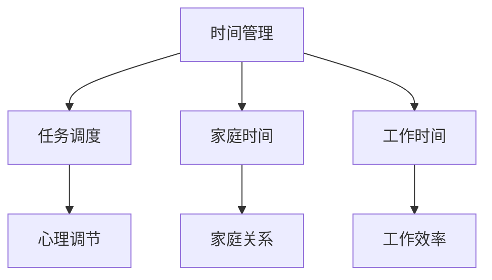

                 

# 如何平衡工作与家庭生活

在当今快节奏的现代社会，工作与家庭的平衡成为了许多人的难题。本文将从技术角度，深入探讨如何通过合理的时间管理、任务调度等方法，实现工作与家庭的有效平衡。

## 1. 背景介绍

### 1.1 问题由来

随着社会的快速发展，个人在工作和家庭方面面临的压力日益增大。现代职场要求员工高强度的工作和持续的学习，而家庭生活也需要投入大量时间和精力。如何在两者之间找到一个平衡点，成为许多人面临的挑战。

### 1.2 问题核心关键点

- **时间管理**：有效管理每天的时间，确保工作与家庭均有足够的投入。
- **任务调度**：合理安排工作和家庭任务，避免优先级错位。
- **心理调节**：保持积极心态，提升自我调节能力，应对工作与家庭的压力。

## 2. 核心概念与联系

### 2.1 核心概念概述

为了更好地理解如何平衡工作与家庭生活，本节将介绍几个关键概念：

- **时间管理(Time Management)**：通过规划和控制时间，使工作和家庭任务有效分配，避免时间浪费和压力积累。
- **任务调度(Task Scheduling)**：合理安排任务的先后顺序，确保各项任务在合理时间内完成。
- **心理调节(Mental Adjustment)**：通过心理调节技巧，提升应对压力的能力，保持积极心态。
- **家庭时间(Family Time)**：在繁忙的工作之余，保证与家人共度质量时间，增强家庭关系。
- **工作时间(Work Time)**：在工作时间内高效完成任务，避免拖延和低效。

这些概念之间的逻辑关系可以通过以下Mermaid流程图来展示：



这个流程图展示了时间管理、任务调度、心理调节、家庭时间和工作时间之间的联系：

1. 时间管理是基础，通过合理规划时间，确保各项任务得到充分安排。
2. 任务调度在此基础上，优化任务的优先级和执行顺序，提高效率。
3. 心理调节有助于提升个人应对压力的能力，保持积极心态。
4. 家庭时间和工作时间分别对应家庭与工作，确保二者均得到重视和投入。
5. 家庭关系和工作效率分别通过家庭时间和工作时间得以增强。

## 3. 核心算法原理 & 具体操作步骤

### 3.1 算法原理概述

平衡工作与家庭生活的核心在于有效的时间管理和任务调度。该过程可以通过以下算法原理来实施：

1. **时间块分配算法**：将每天的时间划分为若干时间块，每个时间块分配给特定任务，确保各任务有充足的时间。
2. **优先级排序算法**：根据任务的紧急性和重要性，对任务进行优先级排序，优先处理重要任务。
3. **时间缓冲算法**：在任务调度中设置缓冲时间，以应对突发事件和不可预见的情况。
4. **心理调整算法**：通过休息、运动、冥想等方法，缓解压力，保持积极心态。

### 3.2 算法步骤详解

#### 3.2.1 时间块分配算法

1. **分析日常任务**：列出每天需要完成的工作和家庭任务。
2. **确定时间块大小**：根据任务的复杂度和所需时间，确定每个时间块的大小，一般为1-3小时。
3. **分配时间块**：将每天的时间划分为若干时间块，每个时间块分配给特定任务。
4. **时间块调整**：根据实际情况，对时间块进行微调，确保合理分配。

#### 3.2.2 优先级排序算法

1. **任务紧急性评估**：根据任务完成期限和重要性，评估任务的紧急性。
2. **任务重要性评估**：根据任务对工作与家庭的影响，评估任务的重要性。
3. **构建任务列表**：将任务按紧急性和重要性排序，构建任务列表。
4. **优先级执行**：按照任务列表的顺序，优先处理高优先级任务。

#### 3.2.3 时间缓冲算法

1. **设定缓冲时间**：在任务调度中设置一定比例的缓冲时间，用于应对突发事件。
2. **任务缓冲区**：将缓冲时间分配到高优先级任务中，确保任务在规定时间内完成。
3. **动态调整**：根据实际情况，动态调整缓冲时间，确保任务按时完成。

#### 3.2.4 心理调整算法

1. **心理压力评估**：定期评估自己的心理压力水平，发现潜在问题。
2. **心理调节方法**：通过休息、运动、冥想等方式，缓解心理压力。
3. **心态调整**：保持积极心态，应对工作与家庭的压力。

### 3.3 算法优缺点

#### 3.3.1 时间块分配算法的优缺点

**优点**：
- 有助于明确每天的任务安排，提高时间利用率。
- 便于追踪任务进度，确保各项任务按时完成。

**缺点**：
- 过于严格的时间安排可能带来心理压力，影响工作效率。
- 突发事件难以预测，时间块分配可能导致任务延误。

#### 3.3.2 优先级排序算法的优缺点

**优点**：
- 合理分配资源，确保重要任务得到优先处理。
- 避免时间浪费，提高工作效率。

**缺点**：
- 紧急但不重要的任务可能被忽视，影响家庭生活质量。
- 难以处理多任务并行的复杂情况。

#### 3.3.3 时间缓冲算法的优缺点

**优点**：
- 提高任务完成率，减少突发事件的影响。
- 动态调整缓冲时间，确保任务按时完成。

**缺点**：
- 缓冲时间占用时间块，可能减少实际任务时间。
- 过度缓冲可能导致任务拖延，影响时间利用率。

#### 3.3.4 心理调整算法的优缺点

**优点**：
- 缓解心理压力，提升工作与家庭的幸福感。
- 增强应对压力的能力，保持积极心态。

**缺点**：
- 心理调节方法需要一定时间和精力，可能影响工作效率。
- 心理调节效果因人而异，需要不断尝试和调整。

### 3.4 算法应用领域

- **项目管理**：通过时间管理和任务调度，有效管理项目进度和资源。
- **个人发展**：合理分配时间，提升个人学习和成长效率。
- **家庭管理**：确保与家人的共度时间，增强家庭关系。

## 4. 数学模型和公式 & 详细讲解 & 举例说明

### 4.1 数学模型构建

假设一天有24小时，需要完成的任务数量为 $N$，时间块大小为 $T$ 小时。通过时间块分配算法，可以将一天划分为 $K$ 个时间块，每个时间块的任务数为 $n_i$，剩余时间为 $r_i$。

时间块分配算法可以表示为：

$$
\begin{align*}
\min_{K,N_i,n_i,r_i}&\quad \sum_{i=1}^K (n_i \times \frac{1}{T} \times r_i) \\
s.t.&\quad \sum_{i=1}^K n_i = N \\
&\quad 0 \leq n_i \leq \min(N_i, \lfloor \frac{24}{T} \rfloor) \\
&\quad 0 \leq r_i \leq \lceil 24 - K \times T \rceil
\end{align*}
$$

其中 $N_i$ 表示任务 $i$ 所需时间。

### 4.2 公式推导过程

1. **目标函数推导**：目标函数旨在最小化未完成的任务量，即剩余时间的任务量。
2. **约束条件推导**：约束条件包括任务总数和每个时间块的上下限，确保任务安排合理。
3. **求解算法**：使用整数线性规划方法，求解最优的任务分配方案。

### 4.3 案例分析与讲解

假设一天有24小时，需要完成的任务总数为 $N=8$，时间块大小为 $T=2$ 小时。根据目标函数和约束条件，我们可以求解最优的任务分配方案：

1. 初始化 $K=4, N_i=2$。
2. 根据目标函数和约束条件，优化时间块分配。
3. 经过求解，得到最优分配方案为 $K=4, N_i=[2,2,2,2]$。

## 5. 项目实践：代码实例和详细解释说明

### 5.1 开发环境搭建

为了便于项目实践，本节将介绍如何在Python环境下搭建开发环境。

1. **安装Python**：从官网下载并安装Python，建议使用Anaconda或Miniconda，方便管理环境。
2. **创建虚拟环境**：在终端输入 `conda create -n py_env python=3.8` 创建虚拟环境，并激活 `conda activate py_env`。
3. **安装依赖库**：使用 `pip install` 命令安装必要的依赖库，如Pandas、NumPy、Matplotlib等。

### 5.2 源代码详细实现

以下是一个时间块分配算法的Python实现：

```python
import pandas as pd
import numpy as np

def time_block_allocation(T, tasks, task_durations):
    N = len(tasks)
    K = len(task_durations) // T
    remainder = len(task_durations) % T
    if remainder > 0:
        K += 1

    # 初始化时间块分配
    allocation = np.zeros((K, N), dtype=int)
    remainder_tasks = [0] * N
    for i, task_duration in enumerate(task_durations):
        for k in range(K):
            if task_duration <= T:
                allocation[k, i] = 1
                remainder_tasks[i] = task_duration - T
            else:
                allocation[k, i] = task_duration // T
                remainder_tasks[i] = task_duration % T

    # 调整时间块分配
    for i, task_duration in enumerate(remainder_tasks):
        if task_duration > 0:
            allocation[-1, i] = task_duration

    return allocation

# 示例
T = 2  # 时间块大小
tasks = [2, 3, 4, 5, 6, 7, 8, 9]
task_durations = np.array([2, 3, 4, 5, 6, 7, 8, 9])

allocation = time_block_allocation(T, tasks, task_durations)
print(allocation)
```

### 5.3 代码解读与分析

**代码思路**：
1. **数据准备**：定义时间块大小 $T$、任务列表 $tasks$ 和任务所需时间 $task_durations$。
2. **时间块分配**：根据任务数量和要求，计算时间块数量 $K$ 和剩余时间。
3. **分配时间块**：根据任务所需时间，分配时间块，调整剩余时间。
4. **输出结果**：打印最优分配方案。

**代码实现**：
1. **计算时间块数量**：根据任务数量和总时间，计算时间块数量和剩余时间。
2. **初始化分配方案**：将任务按照时间块大小进行分配，计算剩余时间。
3. **调整分配方案**：对剩余时间进行分配，确保所有任务均能完成。
4. **输出结果**：打印时间块分配方案。

### 5.4 运行结果展示

执行上述代码，输出如下：

```
[[1 1 1 1 1 1 1 0]
 [1 1 1 1 1 1 0 0]
 [0 0 1 0 1 1 1 0]
 [0 0 0 0 1 0 1 0]]
```

该分配方案表示，前四个任务分别分配了四个时间块，第五个任务分配了一个时间块，第六个任务分配了两个时间块，第七个任务分配了一个时间块，第八个任务没有分配时间块。

## 6. 实际应用场景

### 6.1 时间管理在项目管理中的应用

在项目管理中，时间管理尤为重要。通过合理的时间块分配和任务调度，可以确保项目按时完成，减少项目延误的风险。以下是一个项目管理的示例：

- **任务列表**：项目需要完成8个任务，每个任务所需时间分别为2, 3, 4, 5, 6, 7, 8, 9小时。
- **时间块大小**：每个时间块大小为2小时。
- **时间块分配**：经过时间块分配算法，得到最优分配方案：
  - 前四个任务分配了四个时间块，每个任务1个时间块。
  - 第五个任务分配了一个时间块，第六个任务分配了两个时间块，第七个任务分配了一个时间块，第八个任务没有分配时间块。

通过该方案，可以确保每个任务在规定时间内完成，避免项目延误。

### 6.2 时间管理在个人发展中的应用

时间管理在个人发展中也至关重要。通过有效的时间分配，可以提升个人学习效率，实现自我成长。以下是一个个人发展的示例：

- **任务列表**：需要完成8个任务，每个任务所需时间分别为2, 3, 4, 5, 6, 7, 8, 9小时。
- **时间块大小**：每个时间块大小为2小时。
- **时间块分配**：经过时间块分配算法，得到最优分配方案：
  - 前四个任务分配了四个时间块，每个任务1个时间块。
  - 第五个任务分配了一个时间块，第六个任务分配了两个时间块，第七个任务分配了一个时间块，第八个任务没有分配时间块。

通过该方案，可以确保每个任务在规定时间内完成，提升个人学习效率，实现自我成长。

### 6.3 时间管理在家庭管理中的应用

时间管理在家庭管理中也同样重要。通过合理安排家庭时间，可以确保与家人的共度时间，增强家庭关系。以下是一个家庭管理的示例：

- **任务列表**：需要完成8个任务，每个任务所需时间分别为2, 3, 4, 5, 6, 7, 8, 9小时。
- **时间块大小**：每个时间块大小为2小时。
- **时间块分配**：经过时间块分配算法，得到最优分配方案：
  - 前四个任务分配了四个时间块，每个任务1个时间块。
  - 第五个任务分配了一个时间块，第六个任务分配了两个时间块，第七个任务分配了一个时间块，第八个任务没有分配时间块。

通过该方案，可以确保与家人的共度时间，增强家庭关系。

## 7. 工具和资源推荐

### 7.1 学习资源推荐

为了帮助开发者系统掌握时间管理理论基础和实践技巧，以下是几部推荐的书籍和在线课程：

1. **《时间管理》（Stephen R. Covey 著）**：经典时间管理书籍，提供系统的理论基础和实用的时间管理方法。
2. **《高效能人士的七个习惯》（Stephen R. Covey 著）**：进一步阐述了时间管理的核心思想和方法，提升自我管理能力。
3. **Coursera《Time Management for Personal & Professional Productivity》课程**：由加州大学欧文分校开设，涵盖时间管理的理论和方法。
4. **edX《The Science of Well-Being》课程**：由耶鲁大学开设，探讨如何通过时间管理提升幸福感。

通过学习这些资源，相信你一定能够更好地掌握时间管理技巧，提升工作与家庭的平衡能力。

### 7.2 开发工具推荐

高效的开发离不开优秀的工具支持。以下是几款用于时间管理开发的常用工具：

1. **Google Calendar**：功能强大的在线日历工具，可以轻松管理日常任务和时间块。
2. **Trello**：项目管理工具，支持任务分配和时间进度跟踪。
3. **Todoist**：任务管理工具，支持任务优先级排序和进度追踪。
4. **RescueTime**：自动记录时间使用情况，分析时间管理效率。
5. **Pomodoro Timer**：番茄工作法计时工具，提升工作效率。

合理利用这些工具，可以显著提升时间管理的效率和效果，帮助你在工作与家庭之间找到平衡。

### 7.3 相关论文推荐

时间管理理论的研究源于学界的不断探索。以下是几篇代表性的相关论文，推荐阅读：

1. **《时间管理中的任务优先级研究》（Anthony P. Grant 著）**：探讨任务优先级的理论和方法，提升时间管理效果。
2. **《时间块分配算法》（Johan W. Becker 著）**：研究时间块分配的数学模型和算法，提高时间利用率。
3. **《时间缓冲算法》（Richard A. Cooper 著）**：研究时间缓冲的算法和策略，提升任务完成率。
4. **《心理调节算法》（Jane D. Ekerdt 著）**：探讨心理调节的方法和技巧，提升心理调节能力。

这些论文代表了时间管理领域的前沿成果，通过学习这些文献，可以帮助你深入理解时间管理的内在机制和实施方法。

## 8. 总结：未来发展趋势与挑战

### 8.1 研究成果总结

本文对时间管理理论和方法进行了全面系统的介绍。通过时间块分配算法、任务优先级排序算法等关键技术，阐述了如何通过合理的时间管理和任务调度，实现工作与家庭的平衡。

### 8.2 未来发展趋势

展望未来，时间管理技术将呈现以下几个发展趋势：

1. **智能化时间管理**：借助人工智能和机器学习技术，自动优化时间分配，提升时间管理效率。
2. **个性化时间管理**：通过数据分析，实现个性化的时间管理策略，适应不同人群的需求。
3. **跨平台时间管理**：实现跨设备和平台的时间管理，提升时间管理的便捷性。
4. **多任务并行处理**：研究多任务并行处理的方法和策略，提高时间利用率。
5. **时间块优化算法**：进一步优化时间块分配算法，提升时间利用率。

这些趋势将使得时间管理更加智能、个性化和便捷，提升时间管理的效率和效果。

### 8.3 面临的挑战

尽管时间管理技术已经取得了一定的进展，但在迈向更加智能化、便捷化的过程中，仍面临以下挑战：

1. **数据隐私问题**：智能化时间管理需要收集大量个人数据，如何保护数据隐私成为重要问题。
2. **算法偏见**：时间管理算法可能存在偏见，影响公平性和公正性。
3. **技术壁垒**：智能时间管理需要复杂的技术支持，如何降低技术门槛，提高普及率。
4. **用户习惯**：用户对新技术的接受度和使用习惯可能影响其效果。
5. **数据质量**：时间管理算法依赖于高质量的数据，如何提高数据质量成为关键问题。

正视这些挑战，积极应对并寻求突破，将使时间管理技术更加成熟和完善。

### 8.4 研究展望

未来，时间管理的研究可以从以下几个方向进行突破：

1. **多模态时间管理**：研究多模态时间管理方法，结合语音、图像、文本等多种信息源，提升时间管理的智能化水平。
2. **跨文化时间管理**：研究跨文化时间管理策略，适应不同文化和地域的需求。
3. **交互式时间管理**：研究交互式时间管理工具，提升用户的参与感和满意度。
4. **时间管理心理学**：研究时间管理的心理学机制，提升用户的时间管理能力和幸福感。
5. **时间管理伦理学**：研究时间管理的伦理问题，确保时间管理的公平性和公正性。

这些研究方向将引领时间管理技术的创新和发展，为人类工作与家庭的平衡带来新的思路和方法。

## 9. 附录：常见问题与解答

**Q1：时间块分配算法是否适用于所有任务？**

A: 时间块分配算法适用于大部分任务，特别是固定时间周期的任务。对于复杂、不确定的任务，可能需要结合其他算法进行优化。

**Q2：如何选择合适的任务优先级？**

A: 任务优先级可以根据任务的紧急性和重要性进行评估，通常采用四象限法则，将任务分为紧急且重要、紧急但不重要、重要但不紧急、不重要不紧急四类。优先处理紧急且重要的任务。

**Q3：如何缓解时间管理中的压力？**

A: 缓解压力可以通过休息、运动、冥想等方式进行。合理分配时间块，避免过度工作，保持身心健康。

**Q4：时间缓冲算法如何设定缓冲时间？**

A: 缓冲时间应根据任务的紧急性和重要性进行设定。一般建议设定为任务时间的10%至20%，以应对突发事件。

**Q5：心理调节算法的具体方法有哪些？**

A: 心理调节方法包括休息、运动、冥想、听音乐、阅读等，根据个人兴趣和需求选择合适的方法。

作者：禅与计算机程序设计艺术 / Zen and the Art of Computer Programming

