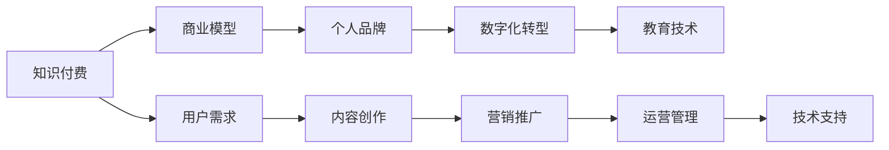

                 

# 如何打造个人知识付费商业帝国

> 关键词：知识付费,商业模型,个人品牌,数字化转型,教育技术

## 1. 背景介绍

### 1.1 问题由来
知识付费的概念早已存在，而近几年的互联网热潮让其进入了一个飞速发展的阶段。移动互联网的普及、智能手机的广泛应用，以及社交媒体的兴起，为知识付费提供了前所未有的机遇。人们通过付费订阅、购买课程、听书等形式，获取各类专业知识和技能。然而，现有的知识付费市场存在着信息过载、内容同质化、缺乏个性化等诸多问题，亟需出现一种更加高效、有价值的知识付费模式。

### 1.2 问题核心关键点
知识付费的商业帝国，不仅需要优质的内容，更需要一套高效、可行的商业模式，来实现内容价值的最大化。核心问题包括：

- 如何定位目标用户，细分市场？
- 如何构建具有差异化的内容体系？
- 如何吸引用户，提高留存率？
- 如何实现盈利，可持续运营？
- 如何利用技术，提高效率，优化用户体验？

### 1.3 问题研究意义
打造个人知识付费商业帝国，不仅能够带来巨大的经济收益，更能够通过高质量的内容，提升用户的知识水平和竞争力。对于个人而言，除了经济收益外，还有以下重要意义：

- 提升个人品牌：通过高质量的内容输出，树立专业形象，扩大个人影响力和认知度。
- 实现知识变现：将专业知识、经验、见解转化为具体产品，获取市场回报。
- 持续学习：在知识付费过程中，不断吸收新知识，保持自身的竞争力和行业前沿性。
- 构建社群：吸引志同道合的用户，建立自己的社群和粉丝群体，增强互动交流，实现共同成长。

## 2. 核心概念与联系

### 2.1 核心概念概述

知识付费商业帝国涉及多个关键概念，本节将对这些核心概念进行简要介绍：

- 知识付费（Knowledge-as-a-Service）：通过付费形式提供专业知识和技能服务，提高用户的知识水平和竞争力。
- 商业模型（Business Model）：涉及收入来源、成本构成、用户获取、运营管理等多个方面，旨在实现商业的可持续性。
- 个人品牌（Personal Branding）：个人在行业内的知名度、影响力及其专业形象的塑造。
- 数字化转型（Digital Transformation）：通过技术手段，提升企业的运营效率、市场响应速度和客户满意度。
- 教育技术（EdTech）：应用信息技术，提高教育质量和效率，推动教育现代化。

### 2.2 核心概念原理和架构的 Mermaid 流程图



通过这个流程图，可以看出知识付费、商业模型、个人品牌、数字化转型、教育技术等概念之间的紧密联系。其中，用户需求是核心驱动，内容创作是关键，营销推广和运营管理是手段，技术支持是保障。

## 3. 核心算法原理 & 具体操作步骤
### 3.1 算法原理概述

知识付费商业帝国的核心算法原理，主要涉及内容推荐、用户画像、个性化定价、流量运营等关键环节。

- **内容推荐算法**：通过机器学习和推荐算法，精准匹配用户需求和内容，提高内容曝光率。
- **用户画像模型**：通过数据分析和建模，构建用户的详细画像，为个性化推荐提供依据。
- **个性化定价策略**：根据用户画像和内容价值，动态调整定价，提升用户体验和满意度。
- **流量运营模型**：通过流量分析、行为预测，优化用户获取和留存策略，实现流量变现。

### 3.2 算法步骤详解

1. **用户画像构建**：
   - 收集用户数据：注册信息、浏览历史、购买行为等。
   - 数据清洗和预处理：去除噪声，补充缺失数据，确保数据质量。
   - 特征工程：提取用户行为、偏好、兴趣等关键特征。
   - 模型训练：使用机器学习算法（如聚类、分类、回归等），构建用户画像模型。

2. **内容推荐算法设计**：
   - 用户画像嵌入：将用户画像转化为向量，用于推荐模型计算。
   - 内容嵌入：将内容转化为向量，用于推荐模型计算。
   - 相似度计算：计算用户和内容之间的相似度。
   - 推荐排序：根据相似度得分，排序推荐内容列表。

3. **个性化定价策略设计**：
   - 内容价值评估：评估内容的知识深度、实用价值、影响力等。
   - 用户价值评估：评估用户的消费能力、购买意愿、忠诚度等。
   - 定价模型设计：根据内容价值和用户价值，设计个性化定价模型。
   - 动态定价调整：根据市场反馈和用户行为，实时调整定价策略。

4. **流量运营模型设计**：
   - 流量来源分析：分析用户来源、转化路径、流失原因等。
   - 行为预测建模：预测用户行为，如活跃度、购买意愿、流失风险等。
   - 运营策略优化：基于预测结果，优化用户获取和留存策略。
   - KPI监测和调整：实时监测关键指标，调整运营策略，确保流量变现。

### 3.3 算法优缺点

#### 优点：
1. **精准匹配**：通过算法推荐，能够更精准地匹配用户需求和内容，提高内容曝光率和用户满意度。
2. **高效运营**：利用技术手段，自动化运营和管理，提高运营效率，降低人力成本。
3. **个性化体验**：通过个性化定价和推荐，满足不同用户的需求，提升用户体验。
4. **持续优化**：基于用户反馈和行为数据，不断优化算法和模型，提高运营效果。

#### 缺点：
1. **数据依赖**：推荐和定价算法依赖于高质量的数据，数据不全或噪声会影响算法效果。
2. **技术门槛**：需要掌握机器学习、推荐系统、数据挖掘等技术，有一定的技术门槛。
3. **模型维护**：需要持续维护和更新模型，确保算法效果和性能。
4. **用户体验**：算法和推荐过于激进，可能导致用户反感，影响用户体验。

### 3.4 算法应用领域

知识付费商业帝国在多个领域有广泛应用：

- **教育培训**：提供在线课程、认证培训、专业讲座等，满足不同层次和领域的学习需求。
- **职业发展**：提供职业规划、技能提升、行业趋势等知识服务，助力职业成长。
- **生活技能**：提供健康管理、家庭理财、生活技巧等生活技能类课程，提升生活质量。
- **职业技能**：提供编程、设计、营销等职业技能类课程，提升职场竞争力。

## 4. 数学模型和公式 & 详细讲解 & 举例说明

### 4.1 数学模型构建

知识付费商业帝国涉及多个数学模型，本节将重点讲解其中的核心模型。

- **用户画像模型**：使用K-means、LDA等聚类算法，对用户行为数据进行建模，构建用户画像。
- **内容推荐模型**：使用协同过滤、矩阵分解等推荐算法，对用户和内容进行相似度计算，生成推荐列表。
- **个性化定价模型**：使用回归、决策树等算法，根据用户画像和内容价值，设计个性化定价策略。
- **流量运营模型**：使用时间序列分析、预测模型等，对用户行为进行预测，优化运营策略。

### 4.2 公式推导过程

#### 用户画像模型
设用户行为数据为 $D=\{(x_i,y_i)\}_{i=1}^N$，其中 $x_i$ 为行为特征向量，$y_i$ 为行为标签。使用K-means算法，将用户分为 $K$ 个簇，每个簇的中心点 $\mu_k$ 表示该簇的代表性行为特征。用户 $i$ 属于簇 $k$ 的概率为：
$$
P(k_i|y_i) = \frac{N_k}{\sum_{j=1}^K N_j}
$$
其中 $N_k$ 为属于簇 $k$ 的用户数。

#### 内容推荐模型
设内容库为 $C=\{c_j\}_{j=1}^M$，用户 $i$ 对内容 $c_j$ 的评分 $r_{ij}$ 为 $1$ 到 $5$ 的整数。使用协同过滤算法，计算用户 $i$ 和内容 $c_j$ 的相似度 $s_{ij}$：
$$
s_{ij} = \frac{\sum_{k=1}^K \mu_k^T \cdot x_i \cdot y_k^T \cdot r_{kj}}{\sqrt{\sum_{k=1}^K \mu_k^T \cdot x_i \cdot y_k^T} \cdot \sqrt{\sum_{k=1}^K y_k^T \cdot r_{kj}}}
$$
其中 $x_i$ 为第 $i$ 个用户的特征向量，$y_k$ 为第 $k$ 个簇的特征向量，$r_{kj}$ 为内容 $c_j$ 在第 $k$ 个簇中的评分。

#### 个性化定价模型
设内容价值为 $v_c$，用户价值为 $v_u$，使用线性回归模型，构建定价模型 $p_{iu} = \alpha + \beta v_c + \gamma v_u$，其中 $\alpha$、$\beta$、$\gamma$ 为回归系数，通过最小二乘法求解最优参数。

#### 流量运营模型
设流量数据为 $D_t=\{(x_t,y_t)\}_{t=1}^T$，其中 $x_t$ 为时间 $t$ 的流量特征，$y_t$ 为流量标签。使用ARIMA模型，对流量进行预测，模型为：
$$
y_{t+h} = \phi(y_t, \delta_t) + \epsilon_{t+h}
$$
其中 $\phi$ 为平滑函数，$\delta_t$ 为趋势项，$\epsilon_{t+h}$ 为随机误差项。

### 4.3 案例分析与讲解

#### 案例一：内容推荐系统
某在线教育平台使用协同过滤算法，为用户推荐课程。平台收集用户浏览、评分、购买等行为数据，使用矩阵分解算法对用户和课程进行相似度计算，生成推荐列表。同时，平台使用A/B测试，不断优化推荐算法，提升推荐效果。

#### 案例二：个性化定价模型
某健身应用使用回归模型，根据用户活跃度和课程难度，动态调整课程价格。平台分析用户行为数据，使用决策树算法构建用户画像，根据画像和课程价值，设计个性化定价模型，实现精准定价。

#### 案例三：流量运营模型
某在线课程平台使用时间序列分析，对用户行为进行预测，优化广告投放和营销策略。平台收集用户注册、登录、课程购买等数据，使用ARIMA模型对流量进行预测，调整运营策略，提升用户留存率和转化率。

## 5. 项目实践：代码实例和详细解释说明

### 5.1 开发环境搭建

**Step 1: 安装Python环境和相关库**
- 在本地或云服务器上安装Python 3.8及更高版本。
- 安装相关的机器学习库，如Scikit-learn、TensorFlow、PyTorch等。
- 安装相关的推荐系统库，如Surprise、Spark等。

**Step 2: 数据准备**
- 收集用户数据，如注册信息、浏览历史、购买记录等。
- 收集内容数据，如课程、文章、视频等。
- 进行数据清洗和预处理，去除噪声和缺失值，确保数据质量。

### 5.2 源代码详细实现

#### 用户画像模型实现
```python
from sklearn.cluster import KMeans
import pandas as pd

# 加载用户行为数据
data = pd.read_csv('user_data.csv')

# 数据清洗和预处理
# ...

# 使用K-means算法构建用户画像
kmeans = KMeans(n_clusters=5)
kmeans.fit(data[['feature1', 'feature2', 'feature3']])

# 获取用户画像
user_profile = kmeans.labels_
```

#### 内容推荐模型实现
```python
from surprise import Reader, Dataset, SVD
from surprise.model_selection import train_test_split

# 加载内容数据
data = Dataset.load_builtin('ml-100k.data')

# 数据清洗和预处理
# ...

# 使用协同过滤算法构建推荐模型
svd = SVD()
trainset, testset = train_test_split(data, test_size=0.2)
svd.fit(trainset)

# 推荐列表生成
recommender = svd
predictions = list(recommender.test(testset))
```

#### 个性化定价模型实现
```python
from sklearn.linear_model import LinearRegression
from sklearn.model_selection import train_test_split

# 加载数据
data = pd.read_csv('pricing_data.csv')

# 数据清洗和预处理
# ...

# 使用线性回归模型构建定价模型
X = data[['value1', 'value2']]
y = data['price']
X_train, X_test, y_train, y_test = train_test_split(X, y, test_size=0.2)
regressor = LinearRegression()
regressor.fit(X_train, y_train)

# 个性化定价计算
price = regressor.predict(X)
```

#### 流量运营模型实现
```python
from statsmodels.tsa.arima_model import ARIMA

# 加载流量数据
data = pd.read_csv('traffic_data.csv')

# 数据清洗和预处理
# ...

# 使用ARIMA模型预测流量
model = ARIMA(data['value'], order=(5,1,0))
model_fit = model.fit(disp=0)

# 预测流量
forecast = model_fit.forecast(steps=30)
```

### 5.3 代码解读与分析

#### 用户画像模型
- 首先加载用户行为数据，并进行清洗和预处理，去除噪声和缺失值。
- 使用K-means算法对用户行为特征进行聚类，构建用户画像。
- 获取每个用户的聚类标签，用于后续推荐和个性化定价。

#### 内容推荐模型
- 加载内容数据，并进行清洗和预处理。
- 使用Surprise库的协同过滤算法，构建推荐模型。
- 使用A/B测试等方法，不断优化推荐算法，提升推荐效果。

#### 个性化定价模型
- 加载定价数据，并进行清洗和预处理。
- 使用线性回归模型，构建个性化定价模型。
- 根据用户画像和内容价值，计算个性化定价，提升用户体验和满意度。

#### 流量运营模型
- 加载流量数据，并进行清洗和预处理。
- 使用ARIMA模型，对流量进行预测。
- 根据预测结果，优化广告投放和营销策略，提升用户留存率和转化率。

### 5.4 运行结果展示

- **用户画像模型**：生成用户画像后，通过可视化工具展示用户画像分布情况。
- **内容推荐模型**：生成推荐列表，展示推荐效果和用户反馈。
- **个性化定价模型**：生成个性化定价结果，展示用户满意度和收入变化。
- **流量运营模型**：生成流量预测结果，展示流量变化趋势和运营策略优化效果。

## 6. 实际应用场景

### 6.1 智能教育
智能教育平台通过个性化推荐和定价，满足不同层次和领域的学习需求。平台收集用户行为数据，构建用户画像，使用协同过滤算法生成个性化推荐列表，使用回归模型动态调整课程价格，提升用户满意度和转化率。

### 6.2 职业培训
在线职业培训平台通过知识付费模式，提供职业技能培训课程。平台分析用户行为数据，构建用户画像，使用推荐算法生成个性化课程推荐，使用定价模型实现精准定价，提升用户留存率和转化率。

### 6.3 健康管理
健康管理应用通过知识付费模式，提供健康管理课程和营养咨询服务。平台收集用户健康数据，构建用户画像，使用协同过滤算法生成个性化课程推荐，使用回归模型动态调整课程价格，提升用户满意度和粘性。

### 6.4 未来应用展望

- **全面覆盖**：未来知识付费平台将覆盖更多领域和行业，提供更加全面和丰富的内容和服务。
- **数据驱动**：知识付费平台将更加注重数据分析和用户画像，提供更加个性化的推荐和定价。
- **技术升级**：知识付费平台将引入更多前沿技术，如AI、大数据、区块链等，提升用户体验和平台运营效率。
- **全球化扩展**：知识付费平台将拓展国际市场，提供多语言服务，实现全球化运营。

## 7. 工具和资源推荐

### 7.1 学习资源推荐
- 《深度学习与人工智能》：一本全面介绍深度学习基础和应用的书。
- 《机器学习实战》：一本实践性较强的机器学习入门书籍。
- 《推荐系统实践》：一本详细介绍推荐系统原理和实现的书。
- 《K-means算法》：详细介绍K-means聚类算法的原理和应用。
- 《ARIMA时间序列分析》：详细介绍ARIMA模型的原理和应用。

### 7.2 开发工具推荐
- PyTorch：深度学习框架，支持多种机器学习模型和算法。
- TensorFlow：深度学习框架，支持大规模分布式计算和优化。
- Surprise：推荐系统库，支持多种推荐算法和模型。
- Scikit-learn：机器学习库，支持多种数据处理和模型训练。
- Jupyter Notebook：数据科学和机器学习常用的笔记本工具。

### 7.3 相关论文推荐
- 《基于协同过滤的推荐系统研究》：详细介绍协同过滤算法的原理和应用。
- 《个性化定价策略研究》：详细介绍个性化定价策略的原理和应用。
- 《ARIMA时间序列分析》：详细介绍ARIMA模型的原理和应用。
- 《知识付费平台用户画像构建研究》：详细介绍用户画像构建的原理和应用。
- 《知识付费平台流量运营策略研究》：详细介绍流量运营策略的原理和应用。

## 8. 总结：未来发展趋势与挑战

### 8.1 总结

本文对如何打造个人知识付费商业帝国进行了全面系统的介绍。首先阐述了知识付费商业帝国的研究背景和意义，明确了其商业模型、用户画像、内容推荐、个性化定价等关键问题。其次，从原理到实践，详细讲解了知识付费的核心算法原理和具体操作步骤，给出了完整的代码实例和详细解释。同时，本文还探讨了知识付费商业帝国在智能教育、职业培训、健康管理等实际应用场景中的具体实现，展示了其广阔的应用前景。最后，本文精选了知识付费商业帝国的发展趋势和面临的挑战，为未来研究指明了方向。

### 8.2 未来发展趋势

展望未来，知识付费商业帝国将呈现以下几个发展趋势：

1. **全面智能化**：通过引入更多前沿技术，如AI、大数据、区块链等，提升知识付费平台的智能化水平，提供更加个性化的服务和体验。
2. **数据驱动**：依托大数据和机器学习技术，知识付费平台将更加注重数据分析和用户画像，实现精准推荐和定价。
3. **全球化扩展**：通过多语言服务和国际市场拓展，实现全球化运营，提升平台的国际影响力和竞争力。
4. **生态系统构建**：通过引入合作伙伴和社区成员，构建知识付费生态系统，实现多方共赢。
5. **可持续运营**：通过持续优化和创新，实现知识付费平台的可持续运营，提升盈利能力和市场份额。

### 8.3 面临的挑战

尽管知识付费商业帝国具有广阔的前景，但在实现过程中仍面临诸多挑战：

1. **数据隐私**：知识付费平台需要收集和处理大量用户数据，如何保护用户隐私，避免数据滥用，是重要挑战。
2. **内容同质化**：知识付费市场竞争激烈，如何避免内容同质化，提升原创内容的质量和创新性，是核心问题。
3. **用户获取**：知识付费平台需要有效吸引和留存用户，如何通过精准营销和社区运营，提升用户粘性，是关键挑战。
4. **市场拓展**：知识付费平台需要拓展国际市场，提升品牌影响力和市场份额，如何克服文化和语言障碍，实现国际化运营，是重要课题。
5. **盈利模式**：知识付费平台需要构建可持续的盈利模式，如何实现多渠道盈利和长期收益，是关键问题。

### 8.4 研究展望

面向未来，知识付费商业帝国需要在数据隐私保护、内容创新、用户获取、市场拓展、盈利模式等方面进行深入研究，不断优化和创新，实现商业帝国的可持续发展。具体研究展望包括：

1. **数据隐私保护**：研究数据匿名化、差分隐私等技术，保护用户隐私，提升数据安全。
2. **内容创新**：研究知识图谱、AI生成等技术，提升内容原创性和创新性，实现差异化竞争。
3. **用户获取**：研究社交网络、推荐系统等技术，提升用户获取效率和留存率，构建社区和粉丝群体。
4. **市场拓展**：研究多语言服务、国际化运营等技术，拓展国际市场，提升品牌影响力和市场份额。
5. **盈利模式**：研究多元化盈利模式，如增值服务、会员制度、广告投放等，实现多渠道盈利和长期收益。

## 9. 附录：常见问题与解答

**Q1: 如何构建高效的用户画像模型？**

A: 构建高效的用户画像模型，关键在于数据收集和特征工程。首先，需要收集用户的详细信息，如注册信息、浏览历史、购买记录等。然后，进行数据清洗和预处理，去除噪声和缺失值，确保数据质量。接着，进行特征工程，提取用户行为、偏好、兴趣等关键特征。最后，使用机器学习算法（如聚类、分类、回归等），构建用户画像模型。常用的算法包括K-means聚类、LDA主题模型等。

**Q2: 推荐算法中协同过滤和基于内容的推荐有何区别？**

A: 协同过滤和基于内容的推荐是两种常用的推荐算法，它们的区别在于推荐依据不同。协同过滤算法基于用户行为数据，通过计算用户和物品之间的相似度进行推荐，强调用户之间的行为相似性。基于内容的推荐算法则侧重于物品本身的内容特征，通过计算物品特征与用户偏好的匹配度进行推荐，强调物品之间的相似性。通常情况下，协同过滤适用于数据量较大、用户行为较多的场景，而基于内容的推荐则适用于数据量较小、物品特征明显的场景。

**Q3: 如何优化个性化定价模型？**

A: 个性化定价模型需要结合用户画像和内容价值，进行动态调整。首先，需要构建用户画像，通过数据分析和建模，提取用户行为、偏好、兴趣等关键特征。其次，需要评估内容价值，根据内容深度、实用性、影响力等，计算内容的价值得分。最后，设计个性化定价模型，使用回归、决策树等算法，构建定价模型，实现精准定价。需要注意的是，定价模型需要根据市场反馈和用户行为，不断优化和调整，确保定价策略的有效性和合理性。

**Q4: 流量运营模型中的ARIMA模型是如何进行时间序列预测的？**

A: ARIMA模型是一种常用的时间序列预测模型，其核心思想是对时间序列进行分解，分别预测趋势、季节性、随机性等组成部分。首先，需要对原始时间序列进行差分，使其变为平稳序列。然后，使用自回归模型（AR）、移动平均模型（MA）、自回归移动平均模型（ARMA）等，对平稳序列进行拟合和预测。最后，将预测结果进行反差分，得到原始时间序列的预测值。需要注意的是，ARIMA模型中的参数需要通过多次试验和优化，确定最优的模型结构和参数设置。

**Q5: 知识付费平台如何提高用户粘性？**

A: 提高用户粘性是知识付费平台的重要目标，可以通过以下几种方式实现：
1. 社区运营：构建用户社区，提供互动交流平台，增强用户粘性。
2. 个性化推荐：通过数据分析和推荐算法，提供个性化课程和内容，满足用户需求。
3. 持续优化：根据用户反馈和行为数据，不断优化平台功能和内容，提升用户体验。
4. 增值服务：提供付费会员、专属内容、专属服务等功能，提升用户满意度和粘性。
5. 社交网络：引入社交网络功能，用户之间可以分享和评论，增强互动性。

作者：禅与计算机程序设计艺术 / Zen and the Art of Computer Programming

