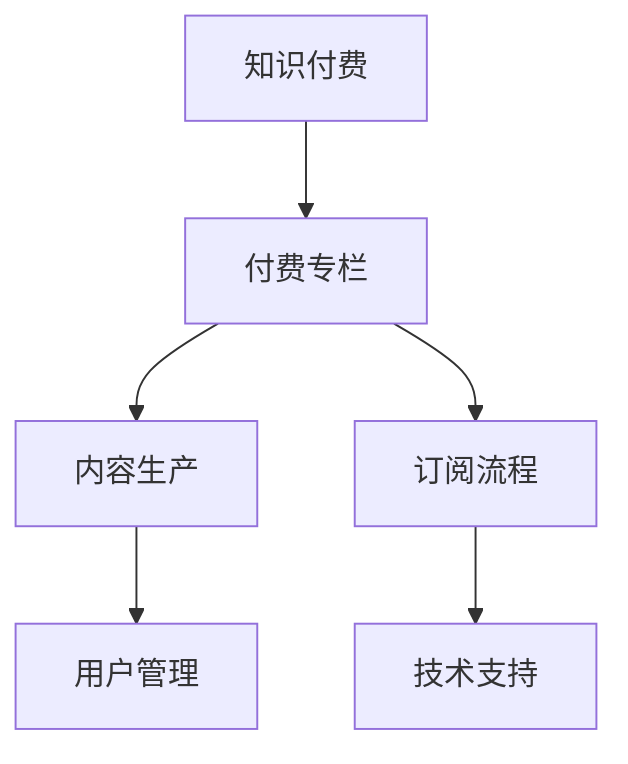

                 

# 如何打造知识付费的付费专栏

## 1. 背景介绍

### 1.1 问题由来

近年来，随着互联网技术的迅速发展，知识付费成为继电商、社交、内容推荐等之后的新兴商业模式。知识付费不仅为用户提供了高质量的学习资源，也给内容创作者带来了新的收入渠道，推动了知识经济的快速发展。

然而，知识付费领域也面临诸多挑战。一方面，内容质量参差不齐，用户体验满意度不高，限制了用户粘性和续费率；另一方面，平台过度竞争，运营成本不断上升，导致价格战和用户体验下滑。因此，如何打造高质量的付费专栏，提升用户满意度，成为知识付费平台亟待解决的重要问题。

### 1.2 问题核心关键点

1. **内容质量控制**：高质量的内容是付费专栏的核心竞争力。如何确保内容的原创性、权威性和实用性，是大规模生产高质量内容的重要挑战。
2. **用户体验优化**：付费专栏的收入主要来源于用户订阅，如何提升用户体验，提高用户粘性和续费率，是知识付费平台的关键。
3. **运营成本控制**：知识付费平台运营成本较高，如何平衡内容生产成本和用户订阅收入，实现可持续发展，是平台运营者必须面对的问题。
4. **市场竞争策略**：知识付费市场竞争激烈，如何通过差异化策略，打造独特内容优势，是平台脱颖而出的关键。
5. **技术支持与创新**：高质量内容生产、用户管理、订阅流程优化等，都依赖于先进的技术支撑，如何进行技术创新，提升平台的竞争力，是知识付费平台发展的核心驱动力。

### 1.3 问题研究意义

打造高质量的付费专栏，对于知识付费平台的长期发展具有重要意义：

1. **提升用户满意度**：高质量内容能够满足用户需求，提升用户粘性和续费率，促进平台的持续增长。
2. **提高平台盈利能力**：优质内容吸引大量用户订阅，提升平台收入，实现可持续盈利。
3. **塑造品牌影响力**：高质量专栏能够提升平台在用户心中的地位，塑造品牌形象，增强市场竞争力。
4. **驱动技术创新**：为解决内容生产、用户管理等实际问题，推动技术研发，促进平台技术创新。

## 2. 核心概念与联系

### 2.1 核心概念概述

为更好地理解如何打造知识付费的付费专栏，本节将介绍几个密切相关的核心概念：

- **知识付费**：指用户为获取高质量知识内容而支付费用的商业模式。典型平台如得到、喜马拉雅、微信读书等，涵盖各类知识领域，如职场、金融、编程、心理等。
- **付费专栏**：指平台为特定用户群体提供的系统化、结构化的知识内容集合，用户通过付费方式获得长期访问权限。
- **内容生产**：指知识付费平台招募或激励内容创作者，制作高质量的内容。
- **用户管理**：指平台对用户行为、订阅状态等进行记录和管理，提高用户体验和满意度。
- **订阅流程**：指用户完成内容支付和获取访问权限的过程，是平台盈利的重要环节。
- **技术支持**：指知识付费平台在内容生产、用户管理、订阅流程等方面的技术实现，保障平台正常运行和用户体验。

这些核心概念之间的逻辑关系可以通过以下Mermaid流程图来展示：



这个流程图展示的知识付费核心概念及其之间的关系：

1. **知识付费**：基于平台模式，聚焦内容生产，形成付费专栏。
2. **付费专栏**：平台通过内容生产、用户管理、订阅流程、技术支持等多方面协同，实现盈利。
3. **内容生产**：核心环节，需要招募和激励优质内容创作者，产出高质量内容。
4. **用户管理**：记录和分析用户行为，提升用户满意度和续费率。
5. **订阅流程**：确保用户顺利支付并获取专栏内容，实现收入。
6. **技术支持**：保障平台稳定运行，提升用户体验，驱动平台创新。

这些概念共同构成了知识付费平台的运作框架，使得平台能够高效、持续地生产高质量内容，吸引和留住用户。

## 3. 核心算法原理 & 具体操作步骤
### 3.1 算法原理概述

打造知识付费的付费专栏，本质上是一个多目标优化问题，涉及到内容质量控制、用户体验优化、运营成本控制、市场竞争策略和技术支持等多个方面。本节将从系统设计、运营策略和技术实现三个层面，深入分析付费专栏打造的算法原理。

### 3.2 算法步骤详解

#### 系统设计

**Step 1: 确定内容类型和定位**
- 根据市场需求和平台战略，确定付费专栏的主要内容类型，如职场、金融、编程、心理等。
- 分析目标用户群体，明确专栏的定位，如入门、进阶、专家级别等，以吸引相应层次的用户订阅。

**Step 2: 招募和激励内容创作者**
- 建立内容创作者招募机制，通过线上线下渠道广泛招募优质创作者。
- 设计合理的激励机制，如稿酬、版权、曝光机会等，吸引创作者持续输出高质量内容。

**Step 3: 内容审核和质量控制**
- 引入第三方审核机构或专家团队，对创作者提交的内容进行审核和评价，确保内容质量和真实性。
- 建立内容质量指标体系，如原创性、权威性、实用性等，定期对内容进行评估。

**Step 4: 用户管理和订阅流程优化**
- 建立用户管理系统，记录用户行为、订阅状态等数据，用于个性化推荐和精准营销。
- 优化订阅流程，简化用户支付和访问过程，提高用户转化率和满意度。

**Step 5: 技术支持与创新**
- 采用先进的技术手段，如机器学习、自然语言处理、推荐算法等，提升内容推荐效果和用户体验。
- 引入新技术，如AI客服、大数据分析、区块链等，增强平台的安全性、透明性和公平性。

#### 运营策略

**Step 1: 建立品牌和信任**
- 通过优质内容和品牌推广，提升平台在用户心中的地位，建立品牌信任。
- 定期发布高质量白皮书、案例分析等，展示平台的权威性和专业性。

**Step 2: 精准营销和个性化推荐**
- 利用用户数据和机器学习算法，对用户进行精准营销，提高用户转化率和续费率。
- 设计个性化推荐算法，根据用户兴趣和行为，推荐最适合的内容，提升用户体验。

**Step 3: 用户互动与社区建设**
- 通过在线互动、论坛、用户评价等方式，增强用户粘性和参与感。
- 建立用户社区，促进内容创作者和用户之间的互动，形成良好的社区氛围。

#### 技术实现

**Step 1: 平台架构设计**
- 采用微服务架构，提升系统灵活性和扩展性。
- 引入容器化技术，如Docker、Kubernetes等，实现快速部署和自动化运维。

**Step 2: 内容管理系统**
- 设计内容管理系统，支持内容创建、审核、发布、更新和归档。
- 采用分布式存储系统，如Amazon S3、Google Cloud Storage等，保障数据安全和可靠性。

**Step 3: 用户管理系统**
- 设计用户管理系统，支持用户注册、登录、订阅、支付等操作。
- 采用Redis、MySQL等数据库，保障数据一致性和并发性能。

**Step 4: 推荐算法**
- 设计推荐算法，支持个性化推荐、热点推荐、冷启动推荐等。
- 采用协同过滤、基于内容的推荐算法，结合机器学习模型，提升推荐效果。

### 3.3 算法优缺点

#### 系统设计

**优点**：
1. **多目标优化**：兼顾内容质量控制、用户体验优化、运营成本控制、市场竞争策略和技术支持等多个方面，实现多目标优化。
2. **灵活性强**：能够根据市场需求和技术发展，灵活调整内容类型和运营策略。
3. **用户导向**：以用户需求为核心，通过用户行为数据，指导内容生产、推荐和营销。

**缺点**：
1. **运营复杂**：涉及多个环节和多个部门，协调难度大，运营成本高。
2. **内容质量难以保证**：创作者水平参差不齐，内容质量难以完全把控。

#### 运营策略

**优点**：
1. **精准营销**：利用大数据和机器学习，实现精准营销，提高用户转化率和续费率。
2. **社区互动**：通过社区建设，增强用户粘性和参与感，形成良好的社区氛围。

**缺点**：
1. **运营成本高**：精准营销和社区建设需要大量资源投入，运营成本较高。
2. **用户需求多样**：用户需求多样，个性化推荐和精准营销难度较大。

#### 技术实现

**优点**：
1. **灵活性高**：采用微服务架构和容器化技术，实现快速部署和自动化运维。
2. **可靠性高**：采用分布式存储和数据库，保障数据安全和可靠性。
3. **可扩展性强**：通过微服务架构和容器化技术，支持系统扩展和升级。

**缺点**：
1. **技术复杂**：涉及多个技术栈和多个组件，技术实现复杂。
2. **资源消耗大**：大规模部署和运维，资源消耗较大。

### 3.4 算法应用领域

知识付费的付费专栏打造涉及多个领域，包括内容生产、用户管理、订阅流程和技术支持等。以下具体分析其在各领域的应用：

#### 内容生产

**应用**：
- 内容类型多样化：涵盖职场、金融、编程、心理等多个领域，满足用户多样化需求。
- 内容质量控制：引入第三方审核和质量指标体系，确保内容高质量。

#### 用户管理

**应用**：
- 用户行为记录：记录用户行为、订阅状态等数据，用于个性化推荐和精准营销。
- 用户互动与社区建设：通过社区建设，增强用户粘性和参与感。

#### 订阅流程

**应用**：
- 订阅流程简化：简化用户支付和访问过程，提高用户转化率和满意度。

#### 技术支持

**应用**：
- 系统架构设计：采用微服务架构和容器化技术，实现快速部署和自动化运维。
- 内容管理系统：设计内容管理系统，支持内容创建、审核、发布、更新和归档。
- 用户管理系统：设计用户管理系统，支持用户注册、登录、订阅、支付等操作。
- 推荐算法：设计推荐算法，支持个性化推荐、热点推荐、冷启动推荐等。

## 4. 数学模型和公式 & 详细讲解

### 4.1 数学模型构建

打造知识付费的付费专栏，可以通过多目标优化模型进行建模，以确保内容质量、用户体验、运营成本、市场竞争和技术支持等各个方面都能达到最优。

假设知识付费平台的目标函数为：

$$
\begin{aligned}
& \max \left( \text{内容质量} \times \text{用户体验} \times \text{运营成本} \times \text{市场竞争} \times \text{技术支持} \right) \\
& \text{subject to} \\
& \text{预算约束} \\
& \text{内容审核约束} \\
& \text{用户管理约束} \\
& \text{订阅流程约束} \\
& \text{技术支持约束}
\end{aligned}
$$

其中，目标函数中的各变量代表各个方面的影响因素，预算约束、内容审核约束、用户管理约束、订阅流程约束和技术支持约束是实现目标的约束条件。

### 4.2 公式推导过程

以内容审核为例，假设内容质量由多个维度决定，包括原创性、权威性、实用性等。设 $x_i$ 为第 $i$ 维度的内容质量评分，其中 $i$ 代表维度编号。则内容审核的目标函数为：

$$
\max \left( \sum_{i=1}^{n} w_i x_i \right)
$$

其中 $w_i$ 为第 $i$ 维度的权重，$n$ 为维度数量。

设 $c_{ij}$ 为创作者提交的第 $j$ 篇内容的第 $i$ 个维度评分，$y_j$ 为第 $j$ 篇内容最终审核通过的评分。则内容审核的优化问题可以表示为：

$$
\max \left( \sum_{i=1}^{n} w_i y_i \right) \\
\text{subject to} \\
\sum_{i=1}^{n} c_{ij} \geq \sum_{i=1}^{n} w_i y_i \quad \forall j \in J \\
y_i \in [0, 1] \quad \forall i \in I
$$

其中 $J$ 为创作者提交的内容编号集合，$I$ 为维度编号集合。约束条件表示，创作者提交的内容评分之和必须大于等于目标评分之和，且目标评分为0到1之间的实数。

### 4.3 案例分析与讲解

#### 案例一：优质内容生产

某知识付费平台希望通过优质内容吸引更多用户订阅，首先需要招募和激励优质创作者。假设平台招募了 $N$ 个创作者，每个创作者每月可以提交 $M$ 篇文章，每篇文章在原创性、权威性、实用性等维度上进行评分。设 $x_{ij}$ 为第 $j$ 篇内容在第 $i$ 个维度上的评分，其中 $i$ 代表维度编号，$j$ 代表创作者编号。则优质内容生产的目标函数为：

$$
\max \left( \sum_{i=1}^{n} w_i \sum_{j=1}^{N} x_{ij} \right)
$$

其中 $w_i$ 为第 $i$ 维度的权重，$n$ 为维度数量，$N$ 为创作者数量。

假设平台的目标是每月生成至少 $K$ 篇优质内容，即 $\sum_{j=1}^{N} x_{ij} \geq K$。则优质内容生产的优化问题可以表示为：

$$
\max \left( \sum_{i=1}^{n} w_i y_i \right) \\
\text{subject to} \\
\sum_{j=1}^{N} x_{ij} \geq K \quad \forall i \in I
$$

其中 $y_i$ 为第 $i$ 个维度的目标评分。

#### 案例二：用户个性化推荐

某知识付费平台希望通过个性化推荐提升用户满意度和续费率，需要设计推荐算法。设 $u_j$ 为第 $j$ 个用户的历史行为数据，$v_i$ 为第 $i$ 个内容的特征向量，$c_{ij}$ 为第 $j$ 个用户对第 $i$ 个内容的评分。则个性化推荐的目标函数为：

$$
\max \left( \sum_{i=1}^{m} \sum_{j=1}^{n} w_{ij} c_{ij} \right)
$$

其中 $m$ 为内容数量，$n$ 为用户数量，$w_{ij}$ 为第 $j$ 个用户对第 $i$ 个内容的评分权重。

假设平台的目标是提升用户的日均访问时长，即 $\sum_{j=1}^{n} c_{ij} \geq T_j$，其中 $T_j$ 为第 $j$ 个用户的日均访问时长。则个性化推荐的优化问题可以表示为：

$$
\max \left( \sum_{i=1}^{m} \sum_{j=1}^{n} w_{ij} c_{ij} \right) \\
\text{subject to} \\
\sum_{j=1}^{n} c_{ij} \geq T_j \quad \forall i \in M
$$

其中 $M$ 为内容编号集合。

## 5. 项目实践：代码实例和详细解释说明

### 5.1 开发环境搭建

在进行知识付费专栏的开发实践前，我们需要准备好开发环境。以下是使用Python进行Django开发的环境配置流程：

1. 安装Anaconda：从官网下载并安装Anaconda，用于创建独立的Python环境。

2. 创建并激活虚拟环境：
```bash
conda create -n django-env python=3.8 
conda activate django-env
```

3. 安装Django：使用pip安装Django框架。
```bash
pip install django
```

4. 安装其他相关库：
```bash
pip install psycopg2-binary numpy pandas matplotlib 
pip install django-assets django-crispy-forms django-model-utils
```

5. 安装Django管理工具：
```bash
pip install django-admin-templates django-website-analytics
```

完成上述步骤后，即可在`django-env`环境中开始开发实践。

### 5.2 源代码详细实现

下面以一个简单的知识付费平台为例，给出使用Django框架进行付费专栏开发的Python代码实现。

**创建Django项目**：
```python
django-admin startproject knowledge_market
cd knowledge_market
```

**创建Django应用**：
```python
python manage.py startapp user
python manage.py startapp content
python manage.py startapp subscription
python manage.py startapp recommendation
```

**配置Django数据库**：
在`settings.py`中配置数据库连接，如使用PostgreSQL：
```python
DATABASES = {
    'default': {
        'ENGINE': 'django.db.backends.postgresql',
        'NAME': 'your_db_name',
        'USER': 'your_db_username',
        'PASSWORD': 'your_db_password',
        'HOST': 'localhost',
        'PORT': '5432',
    }
}
```

**用户模型**：
在`user/models.py`中定义用户模型：
```python
from django.contrib.auth.models import AbstractUser
from django.db import models

class User(AbstractUser):
    class Meta:
        verbose_name = "User"
        verbose_name_plural = "Users"
```

**内容模型**：
在`content/models.py`中定义内容模型：
```python
from django.db import models
from django.contrib.auth.models import User

class Content(models.Model):
    title = models.CharField(max_length=100)
    author = models.ForeignKey(User, on_delete=models.CASCADE)
    content = models.TextField()
    publish_date = models.DateTimeField(auto_now_add=True)
    content_type = models.CharField(max_length=20)
    category = models.CharField(max_length=20)

    class Meta:
        verbose_name = "Content"
        verbose_name_plural = "Contents"
```

**订阅模型**：
在`subscription/models.py`中定义订阅模型：
```python
from django.db import models
from django.contrib.auth.models import User

class Subscription(models.Model):
    user = models.ForeignKey(User, on_delete=models.CASCADE)
    subscription_date = models.DateTimeField(auto_now_add=True)
    expiration_date = models.DateTimeField()
    category = models.CharField(max_length=20)

    class Meta:
        verbose_name = "Subscription"
        verbose_name_plural = "Subscriptions"
```

**推荐模型**：
在`recommendation/models.py`中定义推荐模型：
```python
from django.db import models
from django.contrib.auth.models import User
from content.models import Content

class Recommendation(models.Model):
    user = models.ForeignKey(User, on_delete=models.CASCADE)
    content = models.ForeignKey(Content, on_delete=models.CASCADE)
    recommend_date = models.DateTimeField(auto_now_add=True)
    rating = models.IntegerField(default=0)

    class Meta:
        verbose_name = "Recommendation"
        verbose_name_plural = "Recommendations"
```

**推荐算法实现**：
在`recommendation/views.py`中实现推荐算法：
```python
from django.shortcuts import render
from recommendation.models import Recommendation
from content.models import Content

def get_recommendations(request):
    user = request.user
    content = Content.objects.filter(author=user)
    recommendations = Recommendation.objects.filter(user=user).order_by('-rating')
    context = {
        'user': user,
        'content': content,
        'recommendations': recommendations
    }
    return render(request, 'recommendation.html', context)
```

**用户注册和登录**：
在`user/views.py`中实现用户注册和登录：
```python
from django.shortcuts import render, redirect
from django.contrib.auth import login, authenticate
from django.contrib.auth.forms import UserCreationForm

def register(request):
    if request.method == 'POST':
        form = UserCreationForm(request.POST)
        if form.is_valid():
            form.save()
            username = form.cleaned_data.get('username')
            raw_password = form.cleaned_data.get('password1')
            user = authenticate(username=username, password=raw_password)
            login(request, user)
            return redirect('home')
    else:
        form = UserCreationForm()
    return render(request, 'register.html', {'form': form})

def login(request):
    if request.method == 'POST':
        username = request.POST['username']
        password = request.POST['password']
        user = authenticate(username=username, password=password)
        if user is not None:
            login(request, user)
            return redirect('home')
    return render(request, 'login.html')
```

**用户管理**：
在`user/views.py`中实现用户管理：
```python
from django.shortcuts import render, redirect
from django.contrib.auth.decorators import login_required
from django.contrib import messages

@login_required
def profile(request):
    user = request.user
    subscriptions = Subscription.objects.filter(user=user)
    return render(request, 'profile.html', {'user': user, 'subscriptions': subscriptions})

@login_required
def settings(request):
    user = request.user
    settings = User.objects.get(username=user.username)
    messages.add_message(request, messages.INFO, f'Settings updated successfully')
    return redirect('profile')
```

**内容管理**：
在`content/views.py`中实现内容管理：
```python
from django.shortcuts import render, redirect
from django.contrib.auth.decorators import login_required
from django.contrib import messages
from content.models import Content

@login_required
def create_content(request):
    if request.method == 'POST':
        title = request.POST['title']
        content = request.POST['content']
        category = request.POST['category']
        content_type = request.POST['content_type']
        user = request.user
        content = Content.objects.create(title=title, author=user, content=content, content_type=content_type, category=category)
        messages.add_message(request, messages.SUCCESS, f'Content created successfully')
        return redirect('home')
    else:
        return render(request, 'create_content.html')
```

### 5.3 代码解读与分析

让我们再详细解读一下关键代码的实现细节：

**Django项目和应用创建**：
- `manage.py startproject knowledge_market`：创建Django项目。
- `manage.py startapp user`：创建用户应用。
- `manage.py startapp content`：创建内容应用。
- `manage.py startapp subscription`：创建订阅应用。
- `manage.py startapp recommendation`：创建推荐应用。

**Django数据库配置**：
- `DATABASES`字典：配置数据库连接信息。
- `ENGINE`：指定使用的数据库引擎。
- `NAME`、`USER`、`PASSWORD`、`HOST`、`PORT`：数据库连接信息。

**用户模型**：
- `User`类：继承自`AbstractUser`，自定义用户模型。
- `Meta`类：定义模型元数据，如verbose_name、verbose_name_plural等。

**内容模型**：
- `Content`类：定义内容模型，包含标题、作者、内容、发布日期、内容类型、分类等字段。
- `Meta`类：定义模型元数据。

**订阅模型**：
- `Subscription`类：定义订阅模型，包含用户、订阅日期、过期日期、分类等字段。
- `Meta`类：定义模型元数据。

**推荐模型**：
- `Recommendation`类：定义推荐模型，包含用户、内容、推荐日期、评分等字段。
- `Meta`类：定义模型元数据。

**推荐算法实现**：
- `get_recommendations`函数：获取用户推荐内容。
- `Content.objects.filter(author=user)`：获取用户创作的内容。
- `Recommendation.objects.filter(user=user).order_by('-rating')`：获取用户推荐内容。

**用户注册和登录**：
- `register`函数：处理用户注册。
- `login`函数：处理用户登录。
- `UserCreationForm`：注册表单。

**用户管理**：
- `profile`函数：显示用户资料和订阅情况。
- `settings`函数：编辑用户设置。

**内容管理**：
- `create_content`函数：创建内容。
- `Content.objects.create`：创建内容记录。

以上代码实现展示了使用Django框架进行知识付费专栏开发的详细过程，从用户管理、内容管理到推荐算法，涵盖知识付费平台的各个核心功能。

## 6. 实际应用场景

### 6.1 知识付费专栏的实际应用场景

#### 智能客服系统

智能客服系统可以通过知识付费专栏提供大量的标准问答模板和解决方案，帮助客服人员快速响应客户咨询，提升客户满意度和解决问题的效率。用户可以通过订阅付费专栏，获得最新、最全面的问答模板，实时更新行业知识，提升服务水平。

#### 金融知识分享平台

金融知识分享平台可以围绕财经、投资、理财等多个主题，打造一系列高质量的付费专栏。金融从业者可以通过订阅付费专栏，获取最新金融资讯、市场分析、投资策略等，提升专业素养。同时，平台也可以通过付费专栏的订阅收入，持续更新内容，保持平台的权威性和市场竞争力。

#### 编程技术交流平台

编程技术交流平台可以通过付费专栏分享最新的编程技术、开源项目、实战经验等。开发者可以通过订阅付费专栏，获取实用的编程技巧和最新技术动态，提升技术水平。平台也可以通过付费专栏的订阅收入，持续推出优质内容，吸引更多的开发者加入社区，构建良性互动的编程技术交流生态。

### 6.2 未来应用展望

随着知识付费市场的不断成熟，基于付费专栏的知识付费模式将更加多样化和灵活化。未来，知识付费专栏的应用场景将更加广泛，覆盖更多垂直行业和用户群体。以下是几个可能的未来应用场景：

#### 医疗健康知识平台

医疗健康知识平台可以通过付费专栏分享医学知识、疾病预防、健康管理等内容，提升公众的健康素养。医护人员可以通过订阅付费专栏，获取最新的医疗资讯、临床指南、研究成果等，提升专业水平。平台也可以通过付费专栏的订阅收入，持续更新内容，保持平台的权威性和市场竞争力。

#### 教育培训在线平台

教育培训在线平台可以通过付费专栏分享各类教育资源，如K12教育、职业培训、技能提升等。教师可以通过订阅付费专栏，获取最新的教育理念、教学方法、教材资源等，提升教学水平。学生可以通过订阅付费专栏，获取优质的学习资源，提升学习效果。平台也可以通过付费专栏的订阅收入，持续推出优质内容，吸引更多的用户加入平台，构建良性互动的教育培训在线生态。

#### 企业培训内部平台

企业培训内部平台可以通过付费专栏分享各类内部培训资源，如领导力培训、管理技能、行业知识等。员工可以通过订阅付费专栏，获取最新的企业资讯、培训课程、技术动态等，提升个人能力和职业素养。企业可以通过付费专栏的订阅收入，持续更新内容，提升内部培训的覆盖率和效果，构建高绩效的企业培训文化。

## 7. 工具和资源推荐

### 7.1 学习资源推荐

为了帮助开发者系统掌握知识付费专栏的技术实现，这里推荐一些优质的学习资源：

1. **《Django实战》系列书籍**：详细介绍了Django框架的开发实战，包括用户管理、内容管理、推荐算法等核心功能。
2. **《Flask Web开发实战》书籍**：介绍了Flask框架的开发实战，适合有一定Web开发基础的读者。
3. **Django官方文档**：Django框架的官方文档，提供了丰富的示例代码和教程，是学习Django的重要资源。
4. **Flask官方文档**：Flask框架的官方文档，提供了详细的API参考和开发指南。
5. **MySQL官方文档**：MySQL数据库的官方文档，提供了丰富的技术文档和示例代码，是学习MySQL的重要资源。

通过对这些资源的学习实践，相信你一定能够快速掌握知识付费专栏的技术实现，并用于解决实际的NLP问题。

### 7.2 开发工具推荐

高效的开发离不开优秀的工具支持。以下是几款用于知识付费专栏开发的常用工具：

1. **Django**：基于Python的开源Web框架，支持快速迭代研究，灵活性强。
2. **Flask**：基于Python的开源Web框架，轻量级、灵活性强，适合快速开发。
3. **MySQL**：高可靠性的关系型数据库，适合存储和管理用户数据和内容数据。
4. **Redis**：高并发、高性能的内存数据库，适合存储和管理用户行为数据。
5. **Django Admin**：Django框架的后台管理工具，简化用户管理、内容管理和推荐算法等操作。

合理利用这些工具，可以显著提升知识付费专栏的开发效率，加快创新迭代的步伐。

### 7.3 相关论文推荐

知识付费专栏的打造涉及内容生产、用户管理、推荐算法等多个方面，相关研究较为广泛。以下是几篇奠基性的相关论文，推荐阅读：

1. **《Django实战》书籍**：详细介绍了Django框架的开发实战，包括用户管理、内容管理、推荐算法等核心功能。
2. **《Flask Web开发实战》书籍**：介绍了Flask框架的开发实战，适合有一定Web开发基础的读者。
3. **Django官方文档**：Django框架的官方文档，提供了丰富的示例代码和教程，是学习Django的重要资源。
4. **Flask官方文档**：Flask框架的官方文档，提供了详细的API参考和开发指南。
5. **MySQL官方文档**：MySQL数据库的官方文档，提供了丰富的技术文档和示例代码，是学习MySQL的重要资源。

这些论文代表了大语言模型微调技术的发展脉络。通过学习这些前沿成果，可以帮助研究者把握学科前进方向，激发更多的创新灵感。

## 8. 总结：未来发展趋势与挑战

### 8.1 总结

本文对如何打造知识付费的付费专栏进行了全面系统的介绍。首先阐述了知识付费平台的运营模式和核心问题，明确了付费专栏打造的关键环节和目标。其次，从系统设计、运营策略和技术实现三个层面，深入分析了付费专栏打造的算法原理。最后，以实际应用场景为例，展示了付费专栏的落地应用和未来发展趋势。

通过本文的系统梳理，可以看到，知识付费专栏的打造不仅需要高质量的内容，还需要精细化的运营策略和技术支持，才能实现平台的高效运营和持续发展。未来，随着知识付费市场的不断成熟，基于付费专栏的知识付费模式将更加多样化和灵活化，覆盖更多垂直行业和用户群体。

### 8.2 未来发展趋势

展望未来，知识付费专栏的发展趋势如下：

1. **多平台融合**：未来的知识付费平台将实现多平台融合，用户可以在多个平台上进行跨平台学习，提升用户体验和粘性。
2. **个性化推荐**：个性化推荐技术将不断提升，根据用户行为和偏好，提供更加精准的内容推荐，提升用户满意度。
3. **社区互动**：社区建设将成为知识付费平台的重要组成部分，通过互动交流，增强用户粘性和参与感。
4. **智能客服**：智能客服技术将广泛应用于知识付费平台，提升客服效率和用户满意度。
5. **大数据分析**：大数据分析将广泛应用于用户行为分析、市场洞察等方面，提升平台的运营效率和决策能力。

这些趋势凸显了知识付费平台的多样化和智能化发展方向，将推动平台不断创新，提升用户体验和市场竞争力。

### 8.3 面临的挑战

尽管知识付费平台的发展前景广阔，但仍面临诸多挑战：

1. **内容质量控制**：内容质量参差不齐，创作者水平差异较大，如何确保高质量内容生产，是大规模内容生产的关键。
2. **用户管理复杂**：用户数量庞大，用户行为多样，如何提升用户管理效率，增强用户粘性，是知识付费平台的重要问题。
3. **推荐算法复杂**：个性化推荐算法需要处理大量数据，算法复杂度高，如何提升推荐效果，减少计算资源消耗，是知识付费平台的技术难题。
4. **市场竞争激烈**：知识付费市场竞争激烈，如何通过差异化策略，打造独特内容优势，是平台脱颖而出的关键。
5. **技术实现复杂**：知识付费平台的实现涉及多个技术栈和多个组件，技术实现复杂，如何提升技术开发效率，减少资源消耗，是知识付费平台的技术挑战。

### 8.4 研究展望

面对知识付费平台的发展挑战，未来的研究需要在以下几个方面寻求新的突破：

1. **内容质量自动化评估**：引入自动化内容评估系统，通过文本分析、专家评审等方式，提高内容质量控制的准确性和效率。
2. **用户行为分析**：利用大数据和机器学习，深入分析用户行为，提供个性化的内容推荐和精准营销。
3. **推荐算法优化**：改进推荐算法，提升推荐效果，减少计算资源消耗，实现高效率、高精度的个性化推荐。
4. **社区互动机制**：设计社区互动机制，通过用户评价、专家评审等方式，提升内容质量和用户满意度。
5. **智能客服系统**：引入智能客服技术，提升客服效率和用户满意度，减少人工成本。

这些研究方向的探索，将推动知识付费平台向更高层次发展，为构建高粘性、高品质的知识付费生态提供新的动力。面向未来，知识付费平台需要不断创新，提升平台运营效率和用户满意度，才能在激烈的市场竞争中保持领先地位。

## 9. 附录：常见问题与解答

**Q1：知识付费平台如何提高内容质量？**

A: 知识付费平台可以通过以下方式提高内容质量：
1. **内容审核机制**：引入第三方审核机构或专家团队，对创作者提交的内容进行审核和评价，确保内容高质量。
2. **质量指标体系**：建立内容质量指标体系，如原创性、权威性、实用性等，定期对内容进行评估。
3. **内容创作者激励**：设计合理的激励机制，如稿酬、版权、曝光机会等，吸引创作者持续输出高质量内容。
4. **自动化评估系统**：引入自动化内容评估系统，通过文本分析、专家评审等方式，提高内容质量控制的准确性和效率。

**Q2：如何提升用户粘性和续费率？**

A: 知识付费平台可以通过以下方式提升用户粘性和续费率：
1. **个性化推荐**：利用大数据和机器学习，根据用户行为和偏好，提供更加精准的内容推荐。
2. **社区互动**：通过社区建设，增强用户粘性和参与感，形成良好的社区氛围。
3. **智能客服**：引入智能客服技术，提升客服效率和用户满意度，减少人工成本。
4. **用户行为分析**：利用大数据和机器学习，深入分析用户行为，提供个性化的内容推荐和精准营销。

**Q3：知识付费平台的运营成本如何控制？**

A: 知识付费平台的运营成本控制可以从以下几个方面入手：
1. **多平台融合**：实现多平台融合，用户可以在多个平台上进行跨平台学习，提升用户体验和粘性。
2. **大数据分析**：利用大数据分析，优化运营策略，提高用户转化率和续费率。
3. **社区互动**：通过社区建设，增强用户粘性和参与感，减少运营成本。
4. **智能客服**：引入智能客服技术，提升客服效率和用户满意度，减少人工成本。
5. **自动化评估系统**：引入自动化内容评估系统，提高内容质量控制的准确性和效率。

**Q4：知识付费平台如何实现个性化推荐？**

A: 知识付费平台可以通过以下方式实现个性化推荐：
1. **用户行为记录**：记录用户行为、订阅状态等数据，用于个性化推荐和精准营销。
2. **推荐算法设计**：设计个性化推荐算法，支持个性化推荐、热点推荐、冷启动推荐等。
3. **协同过滤算法**：采用协同过滤算法，根据用户行为和内容特征，推荐相似的内容。
4. **基于内容的推荐算法**：结合内容特征和用户偏好，推荐相关内容。
5. **机器学习模型**：利用机器学习模型，提升推荐效果和推荐速度。

**Q5：知识付费平台的推荐算法如何优化？**

A: 知识付费平台的推荐算法可以通过以下方式优化：
1. **协同过滤算法优化**：改进协同过滤算法，提高推荐效果和推荐速度，减少计算资源消耗。
2. **基于内容的推荐算法优化**：结合内容特征和用户偏好，提升推荐效果。
3. **机器学习模型优化**：利用机器学习模型，提升推荐效果和推荐速度。
4. **多目标优化算法**：设计多目标优化算法，综合考虑用户满意度、推荐效果、内容质量等目标，提升推荐效果。
5. **数据预处理优化**：优化数据预处理流程，提高数据处理效率，减少计算资源消耗。

这些建议将帮助知识付费平台优化推荐算法，提升用户体验和满意度，实现高效率、高精度的个性化推荐。

---

作者：禅与计算机程序设计艺术 / Zen and the Art of Computer Programming

