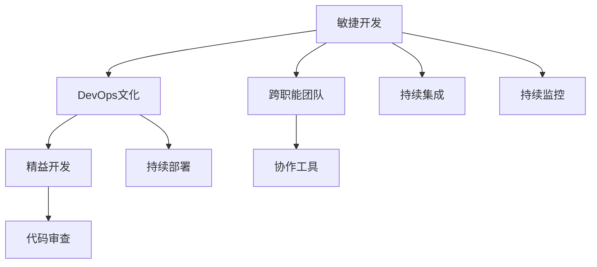

                 

## 1. 背景介绍

在当今快速发展的科技行业中，技术团队的高效合作对于项目的成功至关重要。随着项目复杂度的不断提升，团队成员之间的沟通与协作变得越来越重要。一个高效的团队不仅可以提高工作效率，还能促进技术创新。然而，现实中许多团队依然存在沟通不畅、协作效率低下、信息不对称等问题。因此，了解如何构建一个高效协作的团队，与团队成员有效合作，成为了每一位技术管理者需要面对的挑战。

本文将深入探讨如何构建高效团队，与团队成员有效合作的方法。通过介绍核心概念、架构、算法原理、项目实践和未来展望，帮助技术管理者提升团队合作效率，促进技术团队的发展。

## 2. 核心概念与联系

### 2.1 核心概念概述

在本节中，我们将介绍几个核心概念及其相互联系，以帮助理解如何与团队成员有效合作。

- **敏捷开发**：一种迭代、增量的软件开发方法，强调团队成员之间的紧密协作、及时反馈和持续改进。
- **DevOps文化**：结合开发与运维的实践，强调持续集成、自动化测试、快速交付和持续监控，以提高团队协作效率和系统稳定性。
- **精益开发**：强调以最小的资源和最高的效率，实现最大的价值，减少浪费，提高团队协作效率。
- **跨职能团队**：由不同职能背景的成员组成的团队，有助于提高团队的多样性和创新能力。
- **代码审查**：团队成员对代码的集体审查，以确保代码质量、维护团队知识共享和协作。
- **协作工具**：如JIRA、Slack、GitLab等，帮助团队成员高效沟通、任务管理和代码协作。

### 2.2 核心概念原理和架构的 Mermaid 流程图



这个流程图展示了各个核心概念之间的关系，及其对团队协作的影响：

1. **敏捷开发**：作为方法论基础，敏捷开发强调团队成员的紧密协作和快速反馈。
2. **DevOps文化**：结合开发与运维，强调自动化和持续交付，促进团队协作效率和系统稳定性。
3. **精益开发**：减少浪费，提高效率，促进团队协作。
4. **跨职能团队**：增加团队多样性和创新能力，促进知识共享和协作。
5. **代码审查**：确保代码质量，维护团队知识共享和协作。
6. **协作工具**：帮助团队成员高效沟通、任务管理和代码协作。
7. **持续集成、持续部署、持续监控**：DevOps文化的三大支柱，保障系统稳定性和团队协作效率。

这些概念相互支撑，共同构建了一个高效、协作的团队合作框架。

## 3. 核心算法原理 & 具体操作步骤

### 3.1 算法原理概述

在技术团队合作中，算法原理主要涉及如何通过数据、模型和决策支持团队合作，提升协作效率和质量。以下是我们将详细探讨的核心算法原理。

- **决策算法**：帮助团队成员快速、准确地做出决策，如风险评估、决策树等。
- **数据共享算法**：促进团队成员共享数据，以提高协作效率和决策质量，如数据联邦、数据同步等。
- **模型共享算法**：促进团队成员共享模型，以提升协作效率和决策质量，如模型联邦、模型共享等。
- **协作算法**：支持团队成员之间的有效沟通和协作，如社交网络分析、协作图等。

### 3.2 算法步骤详解

接下来，我们将详细讲解这些核心算法的操作步骤。

#### 3.2.1 决策算法

**步骤1：收集决策数据**
收集与决策相关的数据，如市场调研、用户反馈、技术指标等。

**步骤2：构建决策模型**
使用机器学习或统计方法，构建决策模型。例如，使用决策树、支持向量机等算法进行决策。

**步骤3：模型训练与验证**
使用历史数据训练模型，并进行交叉验证，确保模型的准确性和泛化能力。

**步骤4：决策执行与反馈**
在实际场景中执行决策，并根据反馈不断优化模型和决策过程。

#### 3.2.2 数据共享算法

**步骤1：数据采集**
从各个团队成员或外部数据源采集数据，确保数据的多样性和完整性。

**步骤2：数据预处理**
对采集到的数据进行清洗、去重、归一化等预处理操作。

**步骤3：数据同步**
使用分布式存储和同步技术，如Hadoop、Spark等，确保团队成员能够实时访问数据。

**步骤4：数据共享与使用**
将处理后的数据共享给团队成员，并支持他们基于数据的协作和决策。

#### 3.2.3 模型共享算法

**步骤1：模型构建**
使用深度学习、机器学习等技术，构建模型。例如，使用TensorFlow、PyTorch等框架进行模型训练。

**步骤2：模型发布与部署**
将训练好的模型发布到模型仓库，并支持团队成员进行部署和使用。

**步骤3：模型更新与维护**
根据团队反馈和新数据，不断更新和维护模型，以提高决策质量。

#### 3.2.4 协作算法

**步骤1：建立社交网络**
使用社交网络分析技术，建立团队成员之间的连接，促进知识共享和协作。

**步骤2：优化协作流程**
通过优化协作流程，如任务分配、进度跟踪、代码审查等，提升协作效率。

**步骤3：应用协作工具**
使用协作工具，如JIRA、Slack、GitLab等，支持团队成员高效沟通和协作。

### 3.3 算法优缺点

#### 3.3.1 决策算法的优缺点

**优点**：
- 能够快速、准确地做出决策，提高团队协作效率。
- 支持量化决策，减少主观偏见。

**缺点**：
- 模型可能存在过拟合或欠拟合问题，影响决策质量。
- 需要大量数据和计算资源，可能增加团队负担。

#### 3.3.2 数据共享算法的优缺点

**优点**：
- 促进团队成员之间的数据共享，提高协作效率。
- 支持基于数据的决策，提高决策质量。

**缺点**：
- 数据共享可能存在隐私和安全问题，需要谨慎处理。
- 数据分布式存储和同步可能增加系统复杂性。

#### 3.3.3 模型共享算法的优缺点

**优点**：
- 促进团队成员之间的模型共享，提高协作效率。
- 支持基于模型的决策，提高决策质量。

**缺点**：
- 模型更新和维护可能增加团队负担，需要定期优化和维护。
- 模型共享可能存在版本管理问题，需要有效管理。

#### 3.3.4 协作算法的优缺点

**优点**：
- 促进团队成员之间的有效沟通和协作，提高协作效率。
- 支持知识共享和创新，提升团队整体能力。

**缺点**：
- 协作流程可能存在复杂性，需要精心设计和优化。
- 协作工具可能存在使用门槛，需要团队成员共同学习。

### 3.4 算法应用领域

这些算法和操作步骤在多个领域都得到了广泛应用，如金融、医疗、制造业、零售等。

- **金融领域**：使用决策算法进行风险评估、投资组合优化等；使用数据共享算法进行数据整合和分析；使用模型共享算法进行信用评分、欺诈检测等。
- **医疗领域**：使用决策算法进行疾病诊断、治疗方案选择等；使用数据共享算法进行病例共享和分析；使用模型共享算法进行医学影像分析、基因分析等。
- **制造业**：使用决策算法进行生产调度、供应链管理等；使用数据共享算法进行设备监控和数据整合；使用模型共享算法进行预测性维护、质量控制等。
- **零售领域**：使用决策算法进行市场分析、客户推荐等；使用数据共享算法进行客户数据整合和分析；使用模型共享算法进行价格优化、库存管理等。

## 4. 数学模型和公式 & 详细讲解 & 举例说明

### 4.1 数学模型构建

在本节中，我们将构建数学模型来详细讲解如何与团队成员有效合作。

假设我们有一个由$n$个团队成员组成的团队，每个成员$i$具有决策权重$w_i$，其决策向量为$\mathbf{v}_i$。团队的总决策向量为$\mathbf{V}$，则有：

$$
\mathbf{V} = \sum_{i=1}^{n} w_i \mathbf{v}_i
$$

其中，$w_i$表示成员$i$的决策权重，通常为0和1之间的值，表示其在决策中的贡献程度。

### 4.2 公式推导过程

根据上述数学模型，我们可以推导出团队决策的计算公式。假设团队需要做出一个二元决策，例如“接受”或“拒绝”某个项目，则团队决策的计算公式为：

$$
D = \sum_{i=1}^{n} w_i \cdot \text{ReLU}(\langle \mathbf{v}_i, \mathbf{X} \rangle)
$$

其中，$\mathbf{X}$为决策特征向量，$\langle \mathbf{v}_i, \mathbf{X} \rangle$为向量点积，$\text{ReLU}$为激活函数，表示决策向量$\mathbf{v}_i$与特征向量$\mathbf{X}$的点积结果通过激活函数进行决策。

### 4.3 案例分析与讲解

假设我们有一个由三个成员组成的团队，每个成员的决策权重分别为$w_1=0.5$，$w_2=0.3$，$w_3=0.2$。成员1的决策向量为$\mathbf{v}_1=[1, 0]$，成员2的决策向量为$\mathbf{v}_2=[0, 1]$，成员3的决策向量为$\mathbf{v}_3=[0.5, 0.5]$。假设特征向量$\mathbf{X}=[1, 0]$，则团队的总决策向量$\mathbf{V}$和团队决策$D$分别为：

$$
\mathbf{V} = 0.5 \cdot [1, 0] + 0.3 \cdot [0, 1] + 0.2 \cdot [0.5, 0.5] = [0.45, 0.65]
$$

$$
D = 0.45 \cdot 1 + 0.65 \cdot 0 = 0.45
$$

因此，团队最终决策为“接受”该项目。

## 5. 项目实践：代码实例和详细解释说明

### 5.1 开发环境搭建

在项目实践之前，我们需要搭建好开发环境。以下是Python开发环境搭建的步骤：

1. 安装Python：从官网下载并安装Python，推荐使用3.x版本。
2. 安装虚拟环境：使用virtualenv或conda等工具创建虚拟环境，以隔离项目依赖。
3. 安装开发工具：安装必要的开发工具，如Jupyter Notebook、PyCharm等。
4. 安装依赖包：安装项目所需的依赖包，如numpy、pandas、scikit-learn等。

### 5.2 源代码详细实现

下面是一个使用决策算法进行团队决策的Python代码示例。

```python
import numpy as np

class TeamDecision:
    def __init__(self, weights, vectors):
        self.weights = weights
        self.vectors = vectors
        self.total_weight = np.sum(weights)
    
    def decision(self, X):
        V = np.dot(self.vectors, X)
        W = np.array([self.weights[i] / self.total_weight for i in range(len(self.vectors))])
        D = np.dot(W, V)
        return D >= 0.5  # 二元决策，阈值为0.5

# 创建团队决策模型
weights = [0.5, 0.3, 0.2]
vectors = [[1, 0], [0, 1], [0.5, 0.5]]
team_decision = TeamDecision(weights, vectors)

# 进行决策
X = [1, 0]  # 决策特征向量
decision = team_decision.decision(X)
print(decision)
```

### 5.3 代码解读与分析

在上述代码中，我们首先定义了一个`TeamDecision`类，用于计算团队决策。该类包含两个参数：`weights`表示每个成员的决策权重，`vectors`表示每个成员的决策向量。在`decision`方法中，我们首先计算团队的总决策向量`V`，然后计算每个成员的权重`W`，最后计算团队决策`D`，并根据阈值进行决策。

在本例中，我们创建了一个由三个成员组成的团队，并使用`TeamDecision`类计算了“接受”项目的决策。决策结果为True，表示团队最终决定“接受”该项目。

### 5.4 运行结果展示

运行上述代码，输出结果为True，表示团队最终决定“接受”该项目。

## 6. 实际应用场景

### 6.1 金融领域

在金融领域，团队决策算法可以用于风险评估和投资组合优化。例如，使用决策树算法进行信用评分，使用数据共享算法进行客户数据整合和分析，使用模型共享算法进行欺诈检测。

### 6.2 医疗领域

在医疗领域，团队决策算法可以用于疾病诊断和治疗方案选择。使用数据共享算法进行病例共享和分析，使用模型共享算法进行医学影像分析、基因分析等。

### 6.3 制造业

在制造业，团队决策算法可以用于生产调度和供应链管理。使用数据共享算法进行设备监控和数据整合，使用模型共享算法进行预测性维护、质量控制等。

### 6.4 零售领域

在零售领域，团队决策算法可以用于市场分析和客户推荐。使用数据共享算法进行客户数据整合和分析，使用模型共享算法进行价格优化、库存管理等。

## 7. 工具和资源推荐

### 7.1 学习资源推荐

1. 《敏捷软件开发：原则、模式与实践》：一本经典的敏捷开发指南，详细介绍了敏捷开发的原则和实践。
2. 《DevOps实践指南》：一本关于DevOps文化的指南，详细介绍了DevOps的核心概念和实践。
3. 《精益开发》：一本介绍精益开发方法的书籍，强调以最小的资源和最高的效率，实现最大的价值。
4. 《跨职能团队协作》：一本介绍如何构建跨职能团队的书籍，详细介绍了跨职能团队的设计和管理。
5. 《代码审查最佳实践》：一本关于代码审查的指南，详细介绍了如何通过代码审查提高代码质量和团队协作效率。

### 7.2 开发工具推荐

1. JIRA：一款任务管理和跟踪工具，帮助团队高效进行任务管理和进度跟踪。
2. Slack：一款团队沟通工具，支持实时消息、文件共享和视频会议等功能。
3. GitLab：一款代码协作和版本控制工具，支持代码托管、版本控制、持续集成和持续部署等功能。
4. TensorFlow：一款深度学习框架，支持高效的模型构建和训练。
5. PyTorch：一款深度学习框架，支持动态计算图和高效的模型构建和训练。

### 7.3 相关论文推荐

1. 《敏捷开发的实践与挑战》：介绍敏捷开发方法及其应用挑战的论文。
2. 《DevOps文化的实践与挑战》：介绍DevOps文化的实践和挑战的论文。
3. 《精益开发的实践与挑战》：介绍精益开发方法的实践和挑战的论文。
4. 《跨职能团队的协作与挑战》：介绍跨职能团队的协作和挑战的论文。
5. 《代码审查的实践与挑战》：介绍代码审查的实践和挑战的论文。

## 8. 总结：未来发展趋势与挑战

### 8.1 研究成果总结

本文详细介绍了如何构建高效团队，与团队成员有效合作的方法。通过介绍核心概念、算法原理、操作步骤和实际应用场景，帮助技术管理者提升团队协作效率，促进技术团队的发展。

### 8.2 未来发展趋势

未来的技术团队合作将更加注重团队协作和沟通，以下趋势将推动技术团队合作的发展：

1. **敏捷开发的普及**：敏捷开发方法将更加普及，团队将更加注重迭代、增量和持续改进。
2. **DevOps文化的普及**：DevOps文化将更加普及，团队将更加注重自动化、持续集成和持续交付。
3. **精益开发的普及**：精益开发方法将更加普及，团队将更加注重减少浪费和提高效率。
4. **跨职能团队的普及**：跨职能团队将更加普及，团队将更加注重多样性和创新能力。
5. **代码审查的普及**：代码审查将更加普及，团队将更加注重代码质量和团队协作。

### 8.3 面临的挑战

虽然技术团队合作正在不断发展和进步，但仍然面临一些挑战：

1. **团队协作效率低下**：缺乏有效的沟通和协作机制，导致团队协作效率低下。
2. **团队成员间信息不对称**：缺乏统一的数据和知识共享机制，导致团队成员间信息不对称。
3. **决策质量难以保证**：缺乏有效的决策算法和模型，导致决策质量难以保证。
4. **团队成员间冲突**：缺乏有效的冲突解决机制，导致团队成员间冲突。
5. **团队成员间信任度低**：缺乏有效的信任机制，导致团队成员间信任度低。

### 8.4 研究展望

未来的研究需要在以下几个方面进行探索：

1. **团队协作机制的优化**：进一步优化团队协作机制，提升协作效率和质量。
2. **数据和知识共享机制的优化**：进一步优化数据和知识共享机制，提升协作效率和决策质量。
3. **决策算法的优化**：进一步优化决策算法和模型，提高决策质量和团队协作效率。
4. **冲突解决机制的优化**：进一步优化冲突解决机制，减少团队成员间冲突。
5. **信任机制的优化**：进一步优化信任机制，提高团队成员间信任度。

## 9. 附录：常见问题与解答

### 常见问题

**Q1：如何选择合适的团队成员？**

A: 选择团队成员时，应根据项目需求和团队特点，考虑成员的技术水平、沟通能力、协作能力和文化契合度等因素。

**Q2：如何管理团队成员的期望？**

A: 管理团队成员的期望时，应明确项目目标和任务分配，及时反馈项目进展，并关注团队成员的反馈和需求。

**Q3：如何处理团队冲突？**

A: 处理团队冲突时，应及时识别冲突来源，进行沟通和调解，寻求双方都能接受的解决方案。

**Q4：如何提升团队协作效率？**

A: 提升团队协作效率时，应优化团队协作机制，使用协作工具，明确任务分配和进度跟踪，建立有效的沟通和反馈机制。

**Q5：如何提高团队成员的积极性？**

A: 提高团队成员的积极性时，应关注成员的职业发展和个人需求，提供培训和激励机制，营造积极向上的团队氛围。

通过上述问题与解答，我们能够更好地理解和应对团队合作中的常见挑战，提升团队协作效率和团队整体能力。

---

作者：禅与计算机程序设计艺术 / Zen and the Art of Computer Programming

