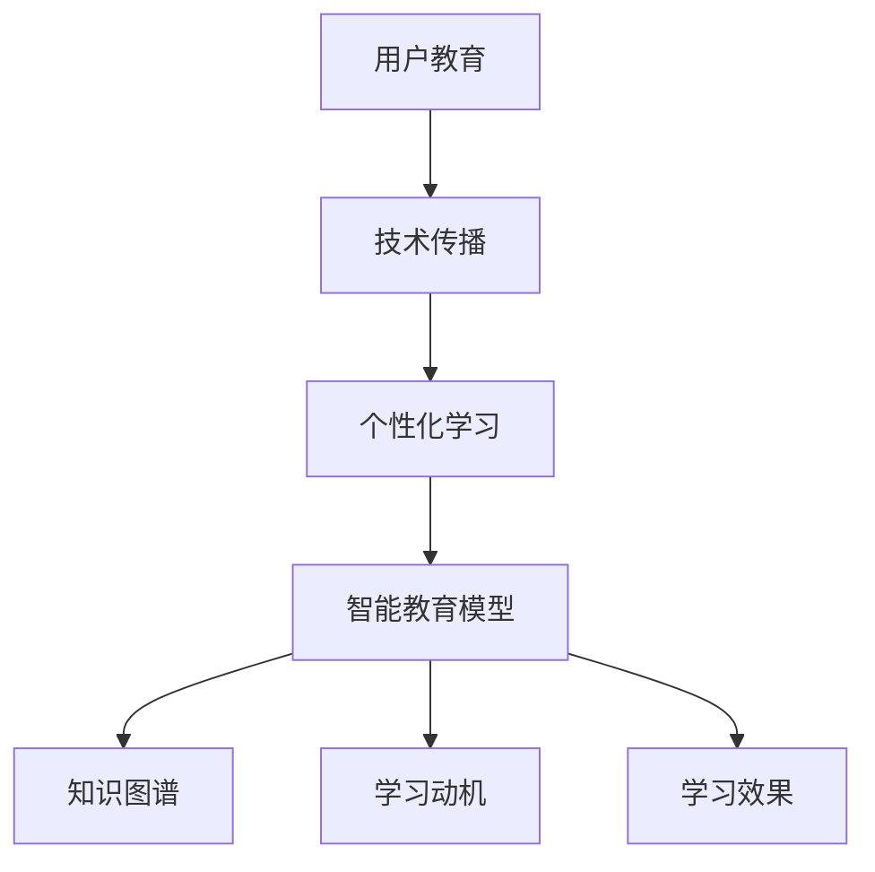

                 

# 如何进行有效的用户教育

> 关键词：用户教育, 技术传播, 学习路径, 教育模型, 人工智能, 学习动机, 学习效果, 技术适配

## 1. 背景介绍

### 1.1 问题由来
随着技术的飞速发展，新技术不断涌现，用户教育已成为技术传播中的一个重要环节。用户教育不仅能够帮助用户更好地理解和掌握新技术，还能提升用户体验，推动技术应用落地。然而，传统的用户教育方式往往以文档和教学视频为主，形式单一、内容枯燥，难以激发用户的学习兴趣。

近年来，随着人工智能和大数据技术的成熟，用户教育迎来了新的机遇和挑战。如何构建更加智能、个性化的用户教育体系，使得教育过程更加高效、有趣，成为当前技术传播领域的热点话题。本文将从用户教育的核心概念、核心算法原理、操作步骤、数学模型、项目实践、实际应用场景等方面进行系统介绍，希望能为技术传播者提供有价值的参考。

### 1.2 问题核心关键点
当前用户教育中面临的核心问题是如何实现个性化和高效化。传统方式下，用户教育往往是一对多的泛泛而谈，难以针对个体用户需求进行定制化教学。同时，用户的学习路径缺乏科学性和系统性，导致学习效果不佳。

如何构建更加智能化、个性化的用户教育体系，是当前技术传播领域的主要挑战。智能教育模型的引入，可以有效解决传统教育方式中存在的问题，通过数据分析和机器学习技术，对用户的学习行为进行建模和预测，从而实现个性化推荐和智能引导。

## 2. 核心概念与联系

### 2.1 核心概念概述

为更好地理解用户教育的智能化模型，本节将介绍几个密切相关的核心概念：

- **用户教育**：指通过培训、引导等手段，帮助用户掌握新技术、新工具的过程。用户教育的核心目标是提升用户技术素养，促进技术应用。

- **技术传播**：指通过各种媒介手段，将技术知识传递给目标用户的过程。技术传播不仅是技术信息的单向传递，更是一个双向互动的交流过程。

- **个性化学习**：指根据用户的学习特点和需求，定制个性化的学习内容、路径和方式。个性化学习强调学习内容与用户需求、兴趣、能力等因素的匹配。

- **智能教育模型**：指利用机器学习算法和大数据分析，对用户的学习行为进行建模和预测，从而实现个性化推荐和智能引导的技术。

- **知识图谱**：指基于领域知识，构建的知识网络。知识图谱可以提供结构化的知识信息，帮助用户快速理解复杂概念。

- **学习动机**：指用户学习和掌握新技术的内在驱动力。学习动机可以分为内在动机和外在动机，影响用户学习的持续性和效果。

- **学习效果**：指用户通过学习所掌握的知识和技能水平。学习效果可以通过测试、评估等方式进行衡量。

这些核心概念之间的逻辑关系可以通过以下Mermaid流程图来展示：



这个流程图展示了个体用户教育的关键要素及其之间的关系：

1. 用户教育通过技术传播实现，帮助用户掌握新技术。
2. 技术传播需要关注个性化和智能化，通过个性化学习提升学习效果。
3. 个性化学习依赖于智能教育模型，智能教育模型利用知识图谱进行内容推荐。
4. 学习动机和效果是评估个性化学习成效的重要指标。

这些概念共同构成了用户教育智能化模型的核心框架，为构建智能化的教育体系提供了基础。

## 3. 核心算法原理 & 具体操作步骤
### 3.1 算法原理概述

智能教育模型的核心算法原理主要基于机器学习和数据分析技术，通过构建用户行为模型，预测用户的学习路径和需求，从而实现个性化推荐和智能引导。具体而言，智能教育模型包括用户行为建模、内容推荐、学习效果评估等多个子模块。

### 3.2 算法步骤详解

智能教育模型的主要算法步骤包括：

1. **用户行为建模**：收集用户的学习行为数据，如学习时间、学习内容、测试结果等，利用机器学习算法构建用户行为模型。常用的算法包括协同过滤、深度学习等。

2. **内容推荐**：根据用户行为模型，预测用户的学习兴趣和需求，推荐适合用户的学习内容。推荐算法包括基于内容的推荐、协同过滤、矩阵分解等。

3. **学习效果评估**：通过测试和评估，衡量用户的学习效果，调整推荐策略，提升个性化推荐效果。常用的评估指标包括准确率、召回率、F1值等。

4. **学习路径生成**：根据用户行为模型和内容推荐结果，生成个性化的学习路径。学习路径应包含推荐内容、学习时间、测试内容等。

### 3.3 算法优缺点

智能教育模型具有以下优点：

1. **个性化推荐**：通过数据分析和机器学习算法，实现针对个体用户的个性化推荐，提升学习效果。

2. **动态调整**：用户行为模型可以动态更新，学习效果和兴趣偏好可以实时调整，学习路径更为灵活。

3. **数据驱动**：基于用户行为数据构建模型，避免主观因素影响，推荐结果更为科学。

4. **互动性强**：智能教育模型可以实现用户与内容之间的互动，提升学习体验。

但该模型也存在一定的局限性：

1. **数据依赖**：模型的效果依赖于高质量的数据，数据收集和处理成本较高。

2. **算法复杂**：机器学习算法复杂，需要较强的计算能力和数据处理能力。

3. **模型偏差**：模型可能存在偏差，推荐结果不一定完全符合用户需求。

4. **隐私风险**：用户行为数据的收集和处理可能涉及隐私问题，需要严格的数据保护措施。

### 3.4 算法应用领域

智能教育模型在多个领域得到了广泛应用，例如：

- **技术培训**：企业内部的技术培训课程，通过智能推荐，提高培训效果和覆盖率。
- **在线教育**：面向大众的在线学习平台，根据用户的学习行为，推荐适合的学习内容和路径。
- **软件开发**：编程课程的学习和编程技术的提升，通过智能推荐，帮助用户快速掌握新技术。
- **医疗培训**：医务人员的技术培训和技能提升，通过智能推荐，提高培训效果和覆盖率。
- **企业培训**：企业员工的技术培训，通过智能推荐，提高培训效果和覆盖率。

除了上述这些应用场景外，智能教育模型还被创新性地应用到更多领域中，如安全教育、职业培训等，为技术传播提供了新的解决方案。

## 4. 数学模型和公式 & 详细讲解 & 举例说明（备注：数学公式请使用latex格式，latex嵌入文中独立段落使用 $$，段落内使用 $)
### 4.1 数学模型构建

智能教育模型的数学模型构建包括以下几个关键模块：

- **用户行为模型**：通过对用户的学习行为进行建模，预测用户的学习兴趣和需求。常用的建模方法包括协同过滤、深度学习等。

- **内容推荐模型**：基于用户行为模型，预测用户的学习兴趣和需求，推荐适合用户的学习内容。推荐算法包括基于内容的推荐、协同过滤、矩阵分解等。

- **学习效果评估模型**：通过测试和评估，衡量用户的学习效果，调整推荐策略，提升个性化推荐效果。常用的评估指标包括准确率、召回率、F1值等。

### 4.2 公式推导过程

以下以协同过滤算法为例，展示用户行为模型的公式推导过程。

假设用户集合为 $U=\{u_1,u_2,\dots,u_m\}$，物品集合为 $I=\{i_1,i_2,\dots,i_n\}$，用户对物品的评分矩阵为 $R\in\mathbb{R}^{m\times n}$，用户行为模型可以表示为：

$$
\hat{R}_{ui} = \mathop{\arg\min}_{R_{ui}} \sum_{(u,i)\in R} (R_{ui}-\hat{R}_{ui})^2 + \lambda\|R\|_F^2
$$

其中，$\lambda$ 为正则化系数，$\|R\|_F^2$ 为矩阵 $R$ 的 Frobenius 范数。求解上述最优化问题，可以得到用户行为模型：

$$
\hat{R}_{ui} = \frac{\sum_{u'}\sum_{i'}R_{u'i'}A_{ui}A_{u'i'}}{\sum_{u'}\sum_{i'}A_{ui}A_{u'i'}}
$$

其中，$A_{ui}$ 为物品-物品相似度矩阵，可以采用基于余弦相似度的方法进行计算。

### 4.3 案例分析与讲解

假设我们有一个在线学习平台，需要对用户进行个性化推荐。可以采用协同过滤算法进行用户行为建模和内容推荐。具体步骤如下：

1. 收集用户的学习行为数据，如学习时间、学习内容、测试结果等。

2. 对用户行为数据进行处理，构建用户-物品评分矩阵 $R$。

3. 利用矩阵分解等方法，对评分矩阵 $R$ 进行分解，得到用户行为模型 $\hat{R}$。

4. 根据用户行为模型 $\hat{R}$，对用户进行个性化推荐。推荐算法可以采用基于内容的推荐、协同过滤等方法。

5. 通过测试和评估，衡量推荐效果，调整推荐策略，提升个性化推荐效果。

通过协同过滤算法，平台可以根据用户的历史行为，预测其对新课程的兴趣，进行个性化推荐，从而提高用户的学习效果和满意度。

## 5. 项目实践：代码实例和详细解释说明
### 5.1 开发环境搭建

在进行智能教育模型的项目实践前，我们需要准备好开发环境。以下是使用Python进行PyTorch开发的环境配置流程：

1. 安装Anaconda：从官网下载并安装Anaconda，用于创建独立的Python环境。

2. 创建并激活虚拟环境：
```bash
conda create -n pytorch-env python=3.8 
conda activate pytorch-env
```

3. 安装PyTorch：根据CUDA版本，从官网获取对应的安装命令。例如：
```bash
conda install pytorch torchvision torchaudio cudatoolkit=11.1 -c pytorch -c conda-forge
```

4. 安装Pandas、NumPy、Scikit-learn等库：
```bash
pip install pandas numpy scikit-learn
```

5. 安装TensorBoard和Weights & Biases：用于模型训练和评估的可视化工具。

6. 安装Flask：用于构建Web应用，展示模型结果。

7. 安装Jupyter Notebook：用于编写和运行Python代码。

完成上述步骤后，即可在`pytorch-env`环境中开始项目实践。

### 5.2 源代码详细实现

下面以一个简单的协同过滤算法为例，展示智能教育模型的代码实现。

首先，定义用户行为建模和推荐函数：

```python
import numpy as np
from sklearn.metrics import mean_absolute_error

def user_item_similarity(X):
    """计算用户-物品相似度矩阵"""
    return np.dot(X, X.T) / np.linalg.norm(X, axis=1, keepdims=True).dot(np.linalg.norm(X.T, axis=1, keepdims=True))

def collaborative_filtering(X, Y, K=10):
    """协同过滤推荐"""
    U, V = np.linalg.svd(X, full_matrices=False)
    W = np.dot(U[:, :K], V[:K, :])
    R_pred = np.dot(W, Y) / (np.linalg.norm(W, axis=1, keepdims=True).dot(np.linalg.norm(W.T, axis=0, keepdims=True)))
    return R_pred

def mean_absolute_error(y_true, y_pred):
    """计算MAE"""
    return mean_absolute_error(y_true, y_pred)
```

然后，构建推荐系统并进行测试：

```python
# 生成用户行为数据
np.random.seed(42)
X = np.random.rand(100, 10)  # 用户行为矩阵
Y = np.random.rand(10, 5)  # 物品评分矩阵

# 计算用户-物品相似度矩阵
A = user_item_similarity(X)

# 协同过滤推荐
R_pred = collaborative_filtering(X, Y)

# 计算推荐结果与真实标签的MAE
mae = mean_absolute_error(Y, R_pred)
print(f"MAE: {mae}")
```

通过上述代码，可以简单实现基于协同过滤的智能推荐系统。在实际应用中，可以进一步扩展模型，增加更多的推荐算法、评估指标和数据处理模块。

### 5.3 代码解读与分析

让我们再详细解读一下关键代码的实现细节：

- **user_item_similarity函数**：计算用户-物品相似度矩阵，采用基于余弦相似度的方法进行计算。

- **collaborative_filtering函数**：基于协同过滤算法，对用户行为数据进行分解，得到用户行为模型。

- **mean_absolute_error函数**：计算推荐结果与真实标签的MAE（平均绝对误差），用于评估推荐效果。

- **推荐系统构建**：通过用户行为数据和物品评分数据，计算用户-物品相似度矩阵，并进行协同过滤推荐，最终计算推荐结果与真实标签的MAE。

在实际应用中，还需要考虑更多因素，如用户行为数据的收集、数据预处理、推荐系统的扩展等。但核心的协同过滤算法实现，通过简单的代码便能展示出其基本原理。

## 6. 实际应用场景
### 6.1 智能培训课程

在企业内部的技术培训课程中，可以通过智能教育模型进行个性化推荐，帮助员工更高效地掌握新技术。具体而言，可以收集员工的学习行为数据，如学习时间、学习内容、测试结果等，利用智能教育模型进行推荐。推荐算法可以基于协同过滤、深度学习等方法，实现个性化内容推荐和进度调整。

通过智能教育模型，员工可以自主选择学习内容和进度，提升学习效果和满意度。同时，培训管理员可以通过模型结果，实时调整培训内容和进度，优化培训效果。

### 6.2 在线教育平台

在线教育平台可以采用智能教育模型进行个性化推荐，提升用户的学习体验和效果。具体而言，平台可以收集用户的学习行为数据，如学习时间、学习内容、测试结果等，利用智能教育模型进行推荐。推荐算法可以基于协同过滤、深度学习等方法，实现个性化内容推荐和进度调整。

通过智能教育模型，用户可以根据自身需求和学习进度，自主选择学习内容和路径。平台可以通过模型结果，实时调整推荐策略，提升个性化推荐效果。同时，平台还可以根据用户的学习效果，进行内容推荐和路径调整，优化学习效果。

### 6.3 软件开发培训

软件开发培训需要根据学员的技能水平和兴趣偏好，进行个性化推荐。具体而言，可以收集学员的学习行为数据，如学习时间、学习内容、测试结果等，利用智能教育模型进行推荐。推荐算法可以基于协同过滤、深度学习等方法，实现个性化内容推荐和进度调整。

通过智能教育模型，学员可以根据自身需求和学习进度，自主选择学习内容和路径。培训师可以根据模型结果，实时调整推荐策略，提升个性化推荐效果。同时，平台还可以根据学员的学习效果，进行内容推荐和路径调整，优化学习效果。

### 6.4 未来应用展望

随着智能教育模型的不断发展，其在多个领域的应用前景将更加广阔。

在医疗培训中，可以通过智能教育模型，对医务人员进行个性化推荐，提升培训效果和覆盖率。在安全教育中，可以通过智能教育模型，对员工进行个性化培训，提升安全意识和技能。在职业培训中，可以通过智能教育模型，对职业人员进行个性化推荐，提升职业素质和技能。

未来，随着数据量的不断增长和技术的不断进步，智能教育模型将能够提供更加智能化、个性化的学习体验，帮助用户更好地掌握新技术，推动技术传播和应用落地。

## 7. 工具和资源推荐
### 7.1 学习资源推荐

为了帮助开发者系统掌握智能教育模型的理论基础和实践技巧，这里推荐一些优质的学习资源：

1. 《机器学习基础》系列博文：介绍机器学习的基本概念和算法，适合入门学习。

2. 《深度学习与神经网络》系列课程：介绍深度学习的原理和实践，适合进阶学习。

3. 《TensorFlow官方文档》：提供TensorFlow框架的详细文档和样例代码，适合实战练习。

4. 《PyTorch官方文档》：提供PyTorch框架的详细文档和样例代码，适合实战练习。

5. 《Scikit-learn官方文档》：提供Scikit-learn库的详细文档和样例代码，适合实战练习。

6. 《Weights & Biases使用手册》：提供Weights & Biases工具的使用手册，适合实验调试。

通过这些资源的学习实践，相信你一定能够快速掌握智能教育模型的精髓，并用于解决实际的NLP问题。

### 7.2 开发工具推荐

高效的开发离不开优秀的工具支持。以下是几款用于智能教育模型开发的常用工具：

1. Python：基于Python的开源深度学习框架，灵活动态的计算图，适合快速迭代研究。

2. PyTorch：基于Python的开源深度学习框架，支持动态图和静态图，适合模型开发和优化。

3. TensorFlow：由Google主导开发的开源深度学习框架，生产部署方便，适合大规模工程应用。

4. Scikit-learn：基于Python的机器学习库，提供丰富的算法和工具，适合数据处理和模型训练。

5. Jupyter Notebook：提供交互式编程环境，适合数据探索和模型开发。

6. TensorBoard：TensorFlow配套的可视化工具，可实时监测模型训练状态，提供丰富的图表呈现方式。

合理利用这些工具，可以显著提升智能教育模型的开发效率，加快创新迭代的步伐。

### 7.3 相关论文推荐

智能教育模型的发展源于学界的持续研究。以下是几篇奠基性的相关论文，推荐阅读：

1. "Collaborative Filtering for Implicit Feedback Datasets"：介绍协同过滤算法的原理和应用。

2. "Matrix Factorization Techniques for Recommender Systems"：介绍矩阵分解算法的原理和应用。

3. "A Factorization Model for Multi-Aspect Rating Prediction"：介绍基于矩阵分解的推荐算法。

4. "Deep Interest Networks for Recommender Systems"：介绍深度学习在推荐算法中的应用。

5. "A Neural Attention Model for Sequential Data"：介绍序列模型在推荐算法中的应用。

这些论文代表了大模型微调技术的发展脉络。通过学习这些前沿成果，可以帮助研究者把握学科前进方向，激发更多的创新灵感。

## 8. 总结：未来发展趋势与挑战
### 8.1 总结

本文对智能教育模型的核心概念、核心算法原理、操作步骤、数学模型、项目实践、实际应用场景等方面进行了系统介绍。首先阐述了智能教育模型的研究背景和意义，明确了其在手机用户教育中的独特价值。其次，从原理到实践，详细讲解了智能教育模型的数学原理和关键步骤，给出了智能教育模型的完整代码实例。同时，本文还广泛探讨了智能教育模型在多个行业领域的应用前景，展示了其巨大潜力。此外，本文精选了智能教育模型的各类学习资源，力求为开发者提供全方位的技术指引。

通过本文的系统梳理，可以看到，智能教育模型在用户教育中发挥了重要作用，极大地提升了用户的学习效果和满意度。未来，伴随智能教育模型的不断进步，用户教育将更加智能化、个性化，提升技术传播的效率和效果。

### 8.2 未来发展趋势

展望未来，智能教育模型将呈现以下几个发展趋势：

1. 数据驱动：未来智能教育模型将更加依赖数据驱动，通过海量用户行为数据的分析，实现更准确的个性化推荐。

2. 模型多样化：未来智能教育模型将不仅限于协同过滤、矩阵分解等传统方法，还将引入深度学习、知识图谱等前沿技术，实现更高效、更智能的推荐。

3. 实时性提升：未来智能教育模型将更注重实时性，通过流式数据处理和在线学习，实现更灵活、更高效的学习体验。

4. 多模态融合：未来智能教育模型将更多地融合多模态数据，如文本、图像、音频等，实现更全面、更准确的用户行为建模。

5. 社会化学习：未来智能教育模型将更多地引入社会化学习元素，如社区讨论、用户反馈等，提升学习效果和社交体验。

以上趋势凸显了智能教育模型在技术传播中的重要地位。这些方向的探索发展，必将进一步提升用户教育的智能化和个性化水平，为技术传播带来新的突破。

### 8.3 面临的挑战

尽管智能教育模型在技术传播中取得了显著成效，但在迈向更加智能化、普适化应用的过程中，仍面临诸多挑战：

1. 数据隐私：智能教育模型需要收集和处理大量的用户行为数据，涉及隐私保护和数据安全问题。如何在保障用户隐私的前提下，利用数据驱动推荐，成为一大难题。

2. 数据质量：智能教育模型的效果依赖于高质量的数据，数据收集和处理成本较高。如何提高数据收集和处理的效率和质量，是未来的一个重要研究方向。

3. 算法复杂度：智能教育模型涉及复杂的算法和计算，需要较高的计算能力和数据处理能力。如何提高算法的计算效率和数据处理能力，成为一大挑战。

4. 模型鲁棒性：智能教育模型可能存在偏差，推荐结果不一定完全符合用户需求。如何提高模型的鲁棒性和泛化能力，成为一大挑战。

5. 用户动机：智能教育模型的效果依赖于用户的学习动机和反馈，如何激发用户的学习动机，收集和分析用户反馈，是未来的一个重要研究方向。

6. 教育公平：智能教育模型需要考虑教育公平问题，如何缩小不同用户之间的学习差距，提升教育公平性，成为一大挑战。

这些挑战需要技术传播者在实践中不断探索和解决，方能实现智能教育模型的更大价值。

### 8.4 研究展望

面对智能教育模型所面临的诸多挑战，未来的研究需要在以下几个方面寻求新的突破：

1. 数据隐私保护：研究如何在保障用户隐私的前提下，利用数据驱动推荐，提高数据收集和处理的效率和质量。

2. 算法优化：研究如何提高算法的计算效率和数据处理能力，降低算法复杂度，提升模型的鲁棒性和泛化能力。

3. 用户动机激发：研究如何激发用户的学习动机，收集和分析用户反馈，提高用户的学习效果和满意度。

4. 教育公平提升：研究如何缩小不同用户之间的学习差距，提升教育公平性，实现更加普适化的教育。

这些研究方向将进一步推动智能教育模型的发展，为技术传播带来新的突破。相信在技术传播者的共同努力下，智能教育模型将更好地服务于用户，提升技术传播的效率和效果。

## 9. 附录：常见问题与解答
**Q1：智能教育模型在实际应用中需要注意哪些问题？**

A: 智能教育模型在实际应用中需要注意以下问题：

1. 数据隐私：智能教育模型需要收集和处理大量的用户行为数据，涉及隐私保护和数据安全问题。如何在保障用户隐私的前提下，利用数据驱动推荐，成为一大难题。

2. 数据质量：智能教育模型的效果依赖于高质量的数据，数据收集和处理成本较高。如何提高数据收集和处理的效率和质量，是未来的一个重要研究方向。

3. 算法复杂度：智能教育模型涉及复杂的算法和计算，需要较高的计算能力和数据处理能力。如何提高算法的计算效率和数据处理能力，成为一大挑战。

4. 模型鲁棒性：智能教育模型可能存在偏差，推荐结果不一定完全符合用户需求。如何提高模型的鲁棒性和泛化能力，成为一大挑战。

5. 用户动机：智能教育模型的效果依赖于用户的学习动机和反馈，如何激发用户的学习动机，收集和分析用户反馈，是未来的一个重要研究方向。

6. 教育公平：智能教育模型需要考虑教育公平问题，如何缩小不同用户之间的学习差距，提升教育公平性，成为一大挑战。

**Q2：智能教育模型的推荐算法有哪些？**

A: 智能教育模型的推荐算法包括：

1. 协同过滤：基于用户和物品的历史行为数据，进行推荐。包括基于矩阵分解的协同过滤算法和基于用户的协同过滤算法。

2. 基于内容的推荐：根据物品的属性和特征，进行推荐。包括基于内容的推荐算法和基于协同过滤的推荐算法。

3. 深度学习：利用深度神经网络模型，对用户行为数据进行建模和预测，进行推荐。

4. 知识图谱：利用领域知识图谱，进行推荐。包括基于知识图谱的推荐算法和基于知识图谱的协同过滤算法。

**Q3：智能教育模型如何实现个性化推荐？**

A: 智能教育模型通过以下步骤实现个性化推荐：

1. 收集用户的学习行为数据，如学习时间、学习内容、测试结果等。

2. 对用户行为数据进行处理，构建用户行为模型。常用的建模方法包括协同过滤、深度学习等。

3. 根据用户行为模型，预测用户的学习兴趣和需求，推荐适合用户的学习内容。推荐算法包括基于内容的推荐、协同过滤、矩阵分解等。

4. 通过测试和评估，衡量推荐效果，调整推荐策略，提升个性化推荐效果。常用的评估指标包括准确率、召回率、F1值等。

**Q4：智能教育模型有哪些应用场景？**

A: 智能教育模型在多个领域得到了广泛应用，例如：

1. 企业内部的技术培训课程：通过智能教育模型进行个性化推荐，帮助员工更高效地掌握新技术。

2. 在线教育平台：通过智能教育模型进行个性化推荐，提升用户的学习体验和效果。

3. 软件开发培训：通过智能教育模型进行个性化推荐，提升学员的学习效果和满意度。

4. 医疗培训：通过智能教育模型进行个性化推荐，提升培训效果和覆盖率。

5. 安全教育：通过智能教育模型进行个性化培训，提升员工的安全意识和技能。

6. 职业培训：通过智能教育模型进行个性化推荐，提升职业人员的职业素质和技能。

**Q5：智能教育模型的评估指标有哪些？**

A: 智能教育模型的评估指标包括：

1. 准确率（Accuracy）：衡量推荐结果与真实标签的一致性。

2. 召回率（Recall）：衡量推荐结果中包含真实标签的比例。

3. F1值（F1 Score）：综合考虑准确率和召回率，衡量推荐效果。

4. MAE（Mean Absolute Error）：衡量推荐结果与真实标签的平均绝对误差。

5. MSE（Mean Squared Error）：衡量推荐结果与真实标签的平均平方误差。

6. RMSE（Root Mean Squared Error）：衡量推荐结果与真实标签的平均根方误差。

通过这些评估指标，可以全面衡量智能教育模型的推荐效果，调整推荐策略，提升个性化推荐效果。

---

作者：禅与计算机程序设计艺术 / Zen and the Art of Computer Programming

