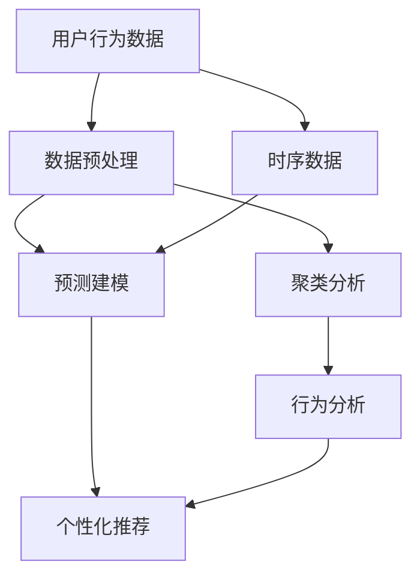

                 

# 如何进行有效的用户行为分析

> 关键词：用户行为分析, 机器学习, 数据处理, 时间序列分析, 预测建模, 个性化推荐, 应用场景

## 1. 背景介绍

### 1.1 问题由来
在现代社会，数据驱动的决策制定已成为一个重要的趋势。企业越来越依赖于用户行为数据来指导产品开发、市场策略、客户服务等各个环节的决策。用户行为数据不仅是衡量用户满意度的指标，更是发现业务机会、预测用户需求、优化用户体验的关键。然而，传统的数据分析方法往往局限于历史数据的统计分析，难以捕捉用户行为的动态变化和潜在趋势。

为了应对这些挑战，数据科学家和工程师们逐渐引入机器学习算法，用于分析大规模用户行为数据，挖掘其中的深层次模式和规律，并预测未来的行为趋势。尤其是最近十年，随着大数据技术的发展，机器学习在用户行为分析领域取得了突破性进展，广泛应用于电商、社交媒体、金融、医疗等诸多领域。

### 1.2 问题核心关键点
用户行为分析的目标是理解用户的行为特征，揭示行为背后的动机，预测用户未来的行为。其核心关键点包括：

1. **数据收集**：获取用户行为数据，包括点击流、搜索记录、交易记录、互动行为等。
2. **数据处理**：对原始数据进行清洗、去重、归一化、特征工程等处理。
3. **建模与分析**：选择合适的机器学习模型，对处理后的数据进行建模和分析，挖掘用户行为规律。
4. **结果应用**：将分析结果应用于实际业务决策，如个性化推荐、用户画像构建、行为预测等。

### 1.3 问题研究意义
用户行为分析的研究意义在于：

1. **优化用户体验**：通过分析用户行为，企业可以更好地理解用户需求和痛点，提供个性化的服务和产品，提升用户体验。
2. **提高运营效率**：通过对用户行为数据的分析，企业可以优化运营流程，降低运营成本，提高转化率和留存率。
3. **预测市场趋势**：通过行为数据的建模和预测，企业可以洞察市场趋势，制定更有效的市场策略。
4. **驱动业务创新**：用户行为分析可以发现新的业务机会，推动业务创新和产品迭代。

## 2. 核心概念与联系

### 2.1 核心概念概述

为了更好地理解用户行为分析的核心概念和原理，本节将详细介绍几个关键概念：

- **用户行为数据**：记录用户在不同场景下的各种行为，如点击、浏览、购买、搜索等。
- **数据预处理**：清洗、去重、归一化、特征工程等处理步骤，是数据建模和分析的基础。
- **时序数据**：按照时间顺序记录的行为数据，常常呈现周期性或趋势性特征。
- **预测建模**：使用机器学习算法对历史数据进行建模，预测用户未来的行为。
- **个性化推荐**：根据用户行为数据，为不同用户推荐其可能感兴趣的商品、内容等。
- **聚类分析**：将用户分为不同类别，发现用户行为的共性和差异。

这些核心概念之间的逻辑关系可以通过以下Mermaid流程图来展示：



这个流程图展示了一系列用户行为分析的主要流程：

1. 首先，从数据源收集用户行为数据，并进行预处理。
2. 对于时间序列数据，进行时序建模，发现用户行为的时间规律。
3. 利用聚类分析，对用户进行分类，发现用户行为共性。
4. 结合预测建模，对用户未来的行为进行预测。
5. 最终，根据预测结果和用户行为特征，进行个性化推荐。

## 3. 核心算法原理 & 具体操作步骤
### 3.1 算法原理概述

用户行为分析的核心算法原理涉及数据处理、特征提取、模型训练和预测等环节。其主要目标是构建一个能够从历史行为数据中学习用户行为特征的模型，并使用该模型进行未来行为的预测。

用户行为分析的算法原理包括以下几个方面：

- **数据处理**：数据清洗、去重、归一化、特征工程等预处理步骤，使原始数据适合建模。
- **特征提取**：从处理后的数据中提取对预测有帮助的特征，如用户点击次数、停留时间、购买频率等。
- **模型训练**：使用机器学习算法对提取的特征进行训练，构建预测模型。
- **结果应用**：将训练好的模型应用于新数据的预测，并进行后处理和解释。

### 3.2 算法步骤详解

用户行为分析的具体操作步骤可以概括为以下几个步骤：

1. **数据收集**：
   - 定义数据收集的指标，如点击次数、浏览时间、购买金额等。
   - 使用API、日志、数据库等工具收集用户行为数据。

2. **数据预处理**：
   - 清洗数据，去除重复、缺失、异常值。
   - 进行归一化处理，将数据转换为标准化形式。
   - 提取有用的特征，如时间戳、用户ID、设备类型等。

3. **建模**：
   - 选择合适的机器学习算法，如随机森林、神经网络、支持向量机等。
   - 使用历史数据训练模型，优化模型参数。
   - 进行交叉验证，评估模型的性能。

4. **结果应用**：
   - 将训练好的模型应用于新数据的预测。
   - 对预测结果进行后处理，如去噪、平滑处理等。
   - 对预测结果进行解释和可视化，辅助业务决策。

### 3.3 算法优缺点

用户行为分析的算法具有以下优点：

- **精确度较高**：能够从大规模数据中提取复杂的模式和规律，预测精度较高。
- **可扩展性强**：能够处理不同类型的数据，如时间序列、文本、图像等。
- **自适应性强**：能够根据新数据不断更新模型，适应数据分布的变化。

同时，该算法也存在以下缺点：

- **数据依赖性强**：模型的性能高度依赖于数据质量，数据缺失或噪声会对结果产生严重影响。
- **计算复杂度高**：构建复杂的模型可能需要大量的计算资源和时间。
- **结果可解释性差**：黑箱模型难以解释其内部决策过程，不利于业务理解。

### 3.4 算法应用领域

用户行为分析在多个领域得到了广泛应用，包括但不限于：

- **电商推荐**：基于用户点击、购买、浏览等行为数据，推荐个性化的商品。
- **社交网络分析**：分析用户互动行为，发现潜在的社交关系和社区。
- **金融风控**：分析用户交易行为，识别潜在的欺诈和风险。
- **内容推荐**：分析用户内容消费行为，推荐用户可能感兴趣的内容。
- **健康监测**：分析用户健康行为，提供个性化的健康建议。

这些应用领域展示了用户行为分析的强大应用潜力，其广泛应用于各类在线业务和实际场景中。

## 4. 数学模型和公式 & 详细讲解  
### 4.1 数学模型构建

用户行为分析中的数学模型构建通常包括以下几个步骤：

1. **数据表示**：将用户行为数据表示为向量形式，如时间戳、特征向量等。
2. **特征选择**：根据特征与预测目标的相关性，选择对模型预测有帮助的特征。
3. **模型训练**：使用机器学习算法对数据进行建模，优化模型参数。
4. **结果评估**：评估模型在新数据上的性能，进行模型的验证和优化。

### 4.2 公式推导过程

以时间序列预测为例，假设用户的行为数据 $X_t$ 是一个时间序列，其中 $t$ 表示时间，$X_t$ 包含多个特征。使用线性回归模型进行预测，假设 $y_t$ 表示第 $t$ 天的预测值，则有：

$$
y_t = \beta_0 + \beta_1 X_{t-1} + \beta_2 X_{t-2} + \cdots + \beta_k X_{t-k} + \epsilon_t
$$

其中，$\beta_0$ 为截距，$\beta_i$ 为第 $i$ 个特征的系数，$\epsilon_t$ 为误差项。通过最小二乘法等方法，可以估计 $\beta_0, \beta_1, \ldots, \beta_k$ 的值，从而构建时间序列预测模型。

### 4.3 案例分析与讲解

假设我们要预测用户在电商平台上某商品的未来购买量。可以收集用户在过去一年内的点击次数、浏览时间、购买次数等行为数据，并使用时间序列模型进行预测。具体步骤如下：

1. **数据收集**：从电商平台数据库中获取用户行为数据，包括点击次数、浏览时间、购买次数等。
2. **数据预处理**：清洗数据，去除重复、缺失值，并进行归一化处理。
3. **特征工程**：提取时间戳、用户ID、设备类型等特征。
4. **建模**：使用ARIMA等时间序列模型，对历史数据进行建模，估计模型的参数。
5. **结果应用**：将模型应用于未来一个月的预测，并对结果进行解释和可视化，辅助业务决策。

## 5. 项目实践：代码实例和详细解释说明
### 5.1 开发环境搭建

进行用户行为分析的项目开发，需要准备好Python开发环境，以及常用的机器学习库和数据处理库。具体步骤如下：

1. **安装Python**：下载并安装Python，建议使用Anaconda或Miniconda，以便管理依赖包。
2. **安装依赖包**：安装numpy、pandas、scikit-learn、matplotlib等常用库。
3. **配置环境**：设置Python环境变量，确保所有依赖包能够正确导入。

### 5.2 源代码详细实现

以下是一个基于用户行为数据的预测模型实现的示例代码，使用Python和scikit-learn库：

```python
import numpy as np
import pandas as pd
from sklearn.model_selection import train_test_split
from sklearn.linear_model import ARIMA
from sklearn.metrics import mean_squared_error

# 1. 数据收集
# 从电商平台数据库中获取用户行为数据，包括点击次数、浏览时间、购买次数等
data = pd.read_csv('user_behavior_data.csv')

# 2. 数据预处理
# 清洗数据，去除重复、缺失值，并进行归一化处理
data = data.dropna()
data = data.drop_duplicates()

# 3. 特征工程
# 提取时间戳、用户ID、设备类型等特征
data['timestamp'] = pd.to_datetime(data['timestamp'], format='%Y-%m-%d %H:%M:%S')
data['day_of_week'] = data['timestamp'].dt.dayofweek
data['hour_of_day'] = data['timestamp'].dt.hour

# 4. 建模
# 使用ARIMA模型对数据进行建模，预测未来的购买次数
train_data = data[:500]
test_data = data[500:]

X_train = train_data[['day_of_week', 'hour_of_day']].values
y_train = train_data['purchase_count'].values
X_test = test_data[['day_of_week', 'hour_of_day']].values
y_test = test_data['purchase_count'].values

model = ARIMA((1, 1, 1), data=X_train, exog=y_train)
model.fit()

# 5. 结果应用
# 对未来的购买次数进行预测，并对结果进行解释和可视化
y_pred = model.forecast(steps=30)[0]
rmse = np.sqrt(mean_squared_error(y_test, y_pred))
print('RMSE:', rmse)
```

### 5.3 代码解读与分析

上述代码实现了基于时间序列的购买次数预测模型。具体解释如下：

1. **数据收集**：从电商平台的CSV文件中读取用户行为数据。
2. **数据预处理**：清洗数据，去除重复、缺失值，并进行归一化处理。
3. **特征工程**：提取时间戳、星期几、小时数等特征，用于建模。
4. **建模**：使用ARIMA模型对历史数据进行建模，估计模型的参数。
5. **结果应用**：对未来的购买次数进行预测，并计算预测误差。

通过上述代码，我们实现了用户行为数据的建模和预测，展示了机器学习在用户行为分析中的应用。

### 5.4 运行结果展示

运行上述代码后，将输出预测的RMSE值，即均方根误差，用于评估模型的预测性能。

## 6. 实际应用场景
### 6.1 电商推荐系统

用户行为分析在电商推荐系统中得到了广泛应用。电商推荐系统通过分析用户的点击、浏览、购买行为，构建用户画像，发现用户偏好，进行个性化推荐。具体实现步骤如下：

1. **数据收集**：从电商平台的用户行为数据中收集点击次数、浏览时间、购买记录等。
2. **数据预处理**：清洗数据，去除重复、缺失值，并进行归一化处理。
3. **建模**：使用协同过滤、基于内容的推荐、时间序列等算法，对用户行为数据进行建模。
4. **结果应用**：根据用户画像和行为预测，进行个性化推荐，提升用户满意度和转化率。

### 6.2 社交网络分析

社交网络分析通过分析用户的行为数据，识别潜在的社交关系和社区。具体实现步骤如下：

1. **数据收集**：从社交媒体平台收集用户的互动行为数据，如点赞、评论、分享等。
2. **数据预处理**：清洗数据，去除重复、异常值，并进行归一化处理。
3. **建模**：使用图网络、深度学习等算法，对用户互动数据进行建模，识别社交关系。
4. **结果应用**：发现潜在的社交关系和社区，提供社交推荐，增强用户粘性。

### 6.3 金融风控系统

金融风控系统通过分析用户的交易行为，识别潜在的欺诈和风险。具体实现步骤如下：

1. **数据收集**：从金融交易平台收集用户的交易记录，包括交易金额、时间戳、设备类型等。
2. **数据预处理**：清洗数据，去除重复、异常值，并进行归一化处理。
3. **建模**：使用分类算法、异常检测算法等，对用户交易数据进行建模，识别潜在的欺诈和风险。
4. **结果应用**：根据模型结果，进行交易风险评估，制定相应的风控策略。

### 6.4 未来应用展望

未来，用户行为分析技术将进一步发展，涵盖更多应用场景，带来新的机遇和挑战：

1. **多模态数据融合**：将时间序列数据、文本数据、图像数据等多种类型的数据进行融合，提供更加全面的用户行为分析。
2. **实时预测**：实现对用户行为的实时预测，提供更及时、准确的业务决策支持。
3. **自适应模型**：构建自适应模型，根据用户行为变化动态调整模型参数，适应数据分布的变化。
4. **跨平台数据整合**：整合不同平台的用户行为数据，提供跨平台的用户行为分析，增强用户体验。
5. **隐私保护**：在用户行为分析过程中，注重隐私保护和数据安全，遵守相关法律法规。

## 7. 工具和资源推荐
### 7.1 学习资源推荐

为了帮助开发者系统掌握用户行为分析的理论基础和实践技巧，这里推荐一些优质的学习资源：

1. 《Python数据科学手册》：适合入门学习数据处理、特征工程、机器学习等。
2. 《机器学习实战》：通过大量案例，详细讲解机器学习算法和实践技巧。
3. 《时间序列分析》：介绍时间序列数据的特点和处理技术。
4. 《用户行为分析实战》：结合实际案例，讲解用户行为分析的完整流程。
5. Kaggle比赛：通过参加Kaggle数据竞赛，实践用户行为分析技术。

通过对这些资源的学习实践，相信你一定能够快速掌握用户行为分析的精髓，并用于解决实际的业务问题。

### 7.2 开发工具推荐

高效的开发离不开优秀的工具支持。以下是几款用于用户行为分析开发的常用工具：

1. Jupyter Notebook：免费的交互式编程环境，支持多种编程语言，方便调试和分享代码。
2. Scikit-learn：Python中的机器学习库，提供了丰富的机器学习算法和工具。
3. TensorFlow：Google开发的深度学习框架，支持分布式计算，适合大规模数据处理。
4. PyTorch：Facebook开发的深度学习框架，易于使用，适合快速原型开发。
5. Matplotlib：Python中的可视化库，支持绘制各种图表，便于数据分析和可视化。

合理利用这些工具，可以显著提升用户行为分析任务的开发效率，加快创新迭代的步伐。

### 7.3 相关论文推荐

用户行为分析技术的发展源于学界的持续研究。以下是几篇奠基性的相关论文，推荐阅读：

1. "The Elements of Statistical Learning"：机器学习经典教材，讲解了多种机器学习算法及其应用。
2. "Introduction to Statistical Learning"：介绍统计学习的基本概念和应用。
3. "Predictive Modeling and Statistical Learning"：讲解了多种预测模型及其应用。
4. "Deep Learning for Time Series Prediction"：介绍深度学习在时间序列预测中的应用。
5. "Machine Learning in User Behavior Analysis"：介绍机器学习在用户行为分析中的应用。

这些论文代表了大规模用户行为数据分析的前沿进展，通过学习这些成果，可以帮助研究者把握学科前进方向，激发更多的创新灵感。

## 8. 总结：未来发展趋势与挑战
### 8.1 总结

本文对用户行为分析的方法和流程进行了全面系统的介绍。首先阐述了用户行为分析的背景和意义，明确了其在优化用户体验、提高运营效率、预测市场趋势等方面的重要性。其次，从原理到实践，详细讲解了数据预处理、建模分析等关键步骤，给出了用户行为分析项目开发的完整代码实例。同时，本文还探讨了用户行为分析在电商推荐、社交网络分析、金融风控等多个领域的应用，展示了其强大的应用潜力。最后，本文推荐了相关的学习资源、开发工具和研究论文，力求为读者提供全方位的技术指引。

通过本文的系统梳理，可以看到，用户行为分析方法通过机器学习算法，从大规模数据中提取复杂的模式和规律，提供了对用户行为的深度理解和预测，为业务决策提供了科学依据。用户行为分析技术将在未来不断拓展应用领域，提升数据驱动决策的质量和效率。

### 8.2 未来发展趋势

展望未来，用户行为分析技术将呈现以下几个发展趋势：

1. **智能化分析**：结合自然语言处理、计算机视觉等技术，实现对用户多模态数据的深度分析。
2. **实时化预测**：实现对用户行为的实时预测，提供及时、准确的业务决策支持。
3. **自适应性**：构建自适应模型，根据用户行为变化动态调整模型参数，适应数据分布的变化。
4. **跨平台整合**：整合不同平台的用户行为数据，提供跨平台的用户行为分析，增强用户体验。
5. **隐私保护**：在用户行为分析过程中，注重隐私保护和数据安全，遵守相关法律法规。

以上趋势凸显了用户行为分析技术的广阔前景。这些方向的探索发展，必将进一步提升用户行为分析系统的性能和应用范围，为数据驱动决策带来新的突破。

### 8.3 面临的挑战

尽管用户行为分析技术已经取得了显著进展，但在迈向更加智能化、普适化应用的过程中，仍面临诸多挑战：

1. **数据质量问题**：用户行为数据的质量直接影响分析结果的准确性。数据缺失、噪声等问题仍需进一步解决。
2. **计算资源限制**：用户行为分析往往涉及大规模数据处理和复杂模型训练，对计算资源有较高要求。如何在资源有限的情况下进行高效分析，是一个重要课题。
3. **结果可解释性**：用户行为分析模型通常是黑箱模型，难以解释其内部决策过程。如何提高模型的可解释性，增强业务理解和信任，是一个关键挑战。
4. **隐私和伦理问题**：在用户行为分析过程中，如何保护用户隐私，避免数据滥用，是一个重要伦理问题。

### 8.4 研究展望

面对用户行为分析技术所面临的挑战，未来的研究需要在以下几个方面寻求新的突破：

1. **数据质量提升**：采用数据清洗、数据增强等技术，提高数据质量，提升分析结果的准确性。
2. **高效计算方法**：研究高效的计算方法，如分布式计算、模型压缩等，优化计算资源使用，提高分析效率。
3. **模型可解释性**：开发可解释性强的模型，如因果图模型、可解释性神经网络等，增强模型的可解释性和业务理解。
4. **隐私保护技术**：研究隐私保护技术，如差分隐私、联邦学习等，保护用户隐私，避免数据滥用。

这些研究方向的探索，将进一步推动用户行为分析技术的进步，为数据驱动决策提供更科学、高效、安全的支持。面向未来，用户行为分析技术将与更多AI技术融合，形成更强大的分析能力，推动业务决策智能化水平的提升。

## 9. 附录：常见问题与解答

**Q1：用户行为分析中常用的机器学习算法有哪些？**

A: 用户行为分析中常用的机器学习算法包括：

1. 线性回归：用于预测连续值，如用户购买次数、点击次数等。
2. 决策树：用于分类和预测，如用户是否购买、点击等。
3. 随机森林：基于决策树的集成算法，用于提高预测准确性和鲁棒性。
4. 支持向量机：用于分类和回归，能够处理高维数据。
5. 神经网络：用于复杂模式和规律的建模，能够处理非线性关系。
6. 协同过滤：用于推荐系统，发现用户之间的相似性，进行个性化推荐。

**Q2：如何进行用户行为数据的特征工程？**

A: 用户行为数据的特征工程主要包括：

1. 时间特征提取：如时间戳、星期几、小时数等。
2. 统计特征提取：如平均值、中位数、最大值、最小值等。
3. 频次特征提取：如点击次数、购买次数、互动次数等。
4. 用户特征提取：如用户ID、设备类型、地理位置等。
5. 文本特征提取：如关键词、主题等。

**Q3：如何选择合适的时间序列模型？**

A: 选择合适的时间序列模型需要考虑数据的特点和预测目标。常见的时间序列模型包括：

1. ARIMA：适用于平稳时间序列的预测。
2. SARIMA：适用于季节性时间序列的预测。
3. Prophet：适用于具有趋势和季节性特征的时间序列预测。
4. LSTM：适用于复杂时间序列数据的预测，能够处理非线性关系。

**Q4：如何进行用户行为的实时预测？**

A: 用户行为的实时预测需要实时数据流处理技术支持。具体实现步骤如下：

1. 使用Kafka、Flume等工具收集实时数据。
2. 使用Spark Streaming、Flink等实时流处理框架进行数据处理。
3. 使用ARIMA、LSTM等时间序列模型进行实时预测。
4. 将预测结果实时推送到业务系统中，辅助业务决策。

**Q5：如何在用户行为分析中保护用户隐私？**

A: 在用户行为分析中保护用户隐私需要采取以下措施：

1. 数据匿名化：对用户数据进行匿名化处理，去除个人身份信息。
2. 差分隐私：在数据收集和处理过程中，引入差分隐私技术，保护用户隐私。
3. 联邦学习：将用户数据分布式存储在多个节点上，在不共享数据的情况下进行模型训练。
4. 访问控制：对用户行为数据的访问进行严格控制，确保数据安全。

通过这些措施，可以在保护用户隐私的前提下，进行高效的用户行为分析。

