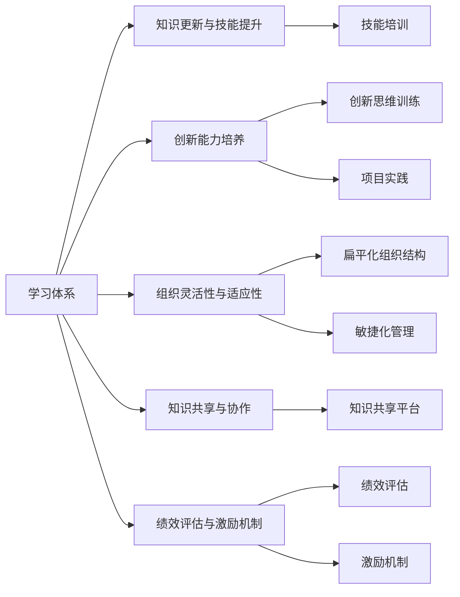

                 

## 1. 背景介绍

### 1.1 问题由来

在信息化时代，面对瞬息万变的市场和技术环境，企业需要不断更新和提升自身能力，以保持竞争优势。然而，很多企业在人才培养和组织管理上仍存在诸多问题，例如知识更新速度慢、员工创新能力不足、组织灵活性差等。这不仅阻碍了企业的持续发展，也影响了行业的整体创新力。

如何构建一个能够快速适应市场变化、不断提升员工创新能力的组织学习体系，成为当下企业面临的重要课题。本文将从学习体系和管理创新能力培养的角度，探讨如何通过系统化的培养体系，提升企业的整体竞争力和创新力。

### 1.2 问题核心关键点

构建高效的学习体系，需要围绕以下核心关键点展开：

1. **知识更新与技能提升**：确保员工能够获取最新的行业知识和技能，应对技术变革。
2. **创新能力培养**：通过创新思维训练、项目实践等方式，提升员工的创新意识和能力。
3. **组织灵活性与适应性**：构建扁平化、敏捷化的组织结构，提高企业的灵活性和适应性。
4. **知识共享与协作**：建立知识共享平台，促进跨部门协作，提升团队整体能力。
5. **绩效评估与激励机制**：设计有效的绩效评估和激励机制，激发员工的学习和创新积极性。

这些关键点构成了构建高效学习体系和管理创新能力培养框架的基础。通过综合运用这些策略，企业可以显著提升员工的学习能力、创新能力和适应能力，从而在竞争中保持领先。

### 1.3 问题研究意义

构建高效的学习体系和管理创新能力培养机制，对于企业的持续发展和竞争力的提升具有重要意义：

1. **提升员工技能与知识**：通过持续学习，确保员工掌握最新的技术和管理知识，提升工作绩效。
2. **激发创新思维**：鼓励员工不断创新，推动企业技术和管理方法的突破。
3. **增强组织适应性**：通过灵活的组织结构和高效的协作机制，提升企业对市场变化的响应速度。
4. **促进知识共享与传承**：建立知识共享平台，使企业内部知识能够有效传递和积累，形成良性循环。
5. **优化绩效管理**：通过科学合理的绩效评估和激励机制，营造积极向上的企业文化，提高员工满意度和忠诚度。

综上所述，构建高效的学习体系和管理创新能力培养机制，是企业实现可持续发展的重要保障。本文将从学习体系构建和管理创新能力培养两个方面，深入探讨这一问题的解决之道。

## 2. 核心概念与联系

### 2.1 核心概念概述

在探讨学习体系和管理创新能力培养之前，首先需要明确几个核心概念及其联系：

- **学习体系**：指企业为员工提供系统化、结构化的学习机会和资源，以提升员工的知识水平和技能。包括但不限于培训课程、在线学习平台、学习社区等。
- **管理创新能力**：指企业通过组织和管理创新，推动企业文化的变革，提高企业的竞争力和创新能力。包括但不限于创新文化建设、创新激励机制设计、创新项目管理等。
- **组织结构**：指企业内部的组织形式和管理方式。常见的组织结构包括层级制、扁平化、敏捷化等。
- **知识共享**：指企业内部知识的传递和积累，通过各种渠道和方法，使知识能够有效流动和应用。
- **绩效评估与激励机制**：指企业对员工的工作绩效进行评估，并根据评估结果给予相应的激励措施，以提高员工的工作积极性和满意度。

这些概念之间相互关联，共同构成了一个高效的学习体系和管理创新能力培养的框架。

### 2.2 核心概念原理和架构的 Mermaid 流程图



这个流程图展示了各个核心概念之间的联系和相互作用：

- 学习体系通过提供知识更新与技能提升、创新能力培养、组织灵活性与适应性、知识共享与协作、绩效评估与激励机制等多种学习资源和支持，全面提升员工的学习和管理能力。
- 知识更新与技能提升通过技能培训、创新思维训练、项目实践等方式，使员工掌握最新的技术和知识。
- 创新能力培养通过创新思维训练、项目实践等活动，激发员工的创新意识和能力。
- 组织灵活性与适应性通过扁平化组织结构、敏捷化管理等措施，提高企业的灵活性和适应性。
- 知识共享与协作通过知识共享平台，促进企业内部知识的流动和应用。
- 绩效评估与激励机制通过科学的绩效评估和激励措施，激发员工的学习和创新积极性。

这些概念共同构成了高效的学习体系和管理创新能力培养的完整框架。

## 3. 核心算法原理 & 具体操作步骤

### 3.1 算法原理概述

构建高效的学习体系和管理创新能力培养机制，需要从以下几个核心算法原理出发：

- **系统化学习设计**：通过系统化的课程设计、内容筛选和评估机制，确保学习资源的科学性和有效性。
- **个性化学习路径**：根据员工的职业发展阶段和兴趣特点，设计个性化的学习路径，提高学习的针对性和效果。
- **实时反馈与调整**：通过实时反馈和动态调整，确保学习过程的灵活性和适应性。
- **创新激励机制设计**：通过合理的激励机制设计，激发员工的创新意识和能力。
- **组织结构优化**：通过扁平化、敏捷化等组织结构优化，提高企业的灵活性和适应性。

### 3.2 算法步骤详解

构建高效的学习体系和管理创新能力培养机制，需要按照以下步骤进行：

**Step 1: 学习需求分析**

- 通过问卷调查、员工访谈等方式，收集员工的学习需求和期望，了解他们在技术、管理和创新能力上的痛点。

**Step 2: 学习资源建设**

- 根据学习需求分析的结果，选择合适的学习资源，包括课程、书籍、在线平台等。
- 对学习资源进行筛选和评估，确保其科学性和有效性。

**Step 3: 学习路径设计**

- 根据员工的职业发展阶段和兴趣特点，设计个性化的学习路径。
- 将学习资源按照一定的逻辑顺序进行组合，形成系统化的学习体系。

**Step 4: 实时反馈与调整**

- 在学习过程中，通过定期评估和反馈，了解员工的学习效果和问题。
- 根据评估结果，及时调整学习路径和资源，确保学习的灵活性和适应性。

**Step 5: 创新激励机制设计**

- 设计合理的激励机制，如绩效奖励、晋升机会、创新基金等，激发员工的创新意识和能力。
- 通过创新项目、创新竞赛等方式，提供实际应用的机会，进一步激发员工的创新热情。

**Step 6: 组织结构优化**

- 通过扁平化、敏捷化等组织结构优化，提高企业的灵活性和适应性。
- 建立跨部门协作机制，促进知识的共享和应用。

**Step 7: 绩效评估与改进**

- 设计科学的绩效评估指标，全面衡量员工的工作绩效和创新成果。
- 根据评估结果，提供有针对性的改进建议，持续优化学习体系和管理创新能力培养机制。

### 3.3 算法优缺点

构建高效的学习体系和管理创新能力培养机制，具有以下优点：

1. **系统化、科学化**：通过系统化的课程设计、内容筛选和评估机制，确保学习资源的科学性和有效性。
2. **个性化、灵活化**：根据员工的职业发展阶段和兴趣特点，设计个性化的学习路径，提高学习的针对性和效果。
3. **实时反馈与调整**：通过实时反馈和动态调整，确保学习过程的灵活性和适应性。
4. **创新激励机制**：通过合理的激励机制设计，激发员工的创新意识和能力。
5. **组织结构优化**：通过扁平化、敏捷化等组织结构优化，提高企业的灵活性和适应性。

同时，该方法也存在一些缺点：

1. **资源投入较大**：构建高效的学习体系和管理创新能力培养机制需要投入大量的时间、精力和资金。
2. **实施难度较大**：涉及组织结构、绩效评估、知识共享等多个方面的变革，实施难度较大。
3. **效果评估困难**：学习体系和管理创新能力培养的效果评估较为困难，需要建立科学的评估机制。

### 3.4 算法应用领域

构建高效的学习体系和管理创新能力培养机制，在多个领域都有广泛的应用：

1. **高科技企业**：如Google、Microsoft等，通过系统化的学习体系和创新激励机制，保持技术领先地位。
2. **传统制造企业**：如宝钢、海尔等，通过扁平化组织结构和敏捷化管理，提升企业的灵活性和创新能力。
3. **金融机构**：如JP Morgan、高盛等，通过创新项目和创新基金，推动金融技术的创新和应用。
4. **医疗健康行业**：如强生、罗氏等，通过知识共享平台和绩效评估机制，提升医疗技术和管理水平。

## 4. 数学模型和公式 & 详细讲解

### 4.1 数学模型构建

构建高效的学习体系和管理创新能力培养机制，可以抽象为一个多变量优化问题。设企业员工总数为 $N$，学习资源的总数为 $M$，学习资源的质量为 $Q$，创新激励机制的效果为 $I$，组织结构的优化度为 $O$，绩效评估的公平性为 $P$。目标函数为：

$$
F = \max_{N, M, Q, I, O, P} \left( N \times M \times Q \times I \times O \times P \right)
$$

其中，$N, M, Q, I, O, P$ 分别代表员工的总数、学习资源的总数、学习资源的质量、创新激励机制的效果、组织结构的优化度、绩效评估的公平性。

### 4.2 公式推导过程

目标函数 $F$ 的推导过程如下：

1. **员工总数 $N$**：员工总数越多，企业创新能力的潜力越大。
2. **学习资源总数 $M$**：学习资源越多，员工获取知识的机会越多，创新能力越强。
3. **学习资源质量 $Q$**：学习资源的质量越高，员工掌握的知识和技能越全面，创新能力越强。
4. **创新激励机制效果 $I$**：创新激励机制越有效，员工创新积极性越高，创新成果越多。
5. **组织结构优化度 $O$**：组织结构越灵活，企业适应市场变化的能力越强，创新能力越强。
6. **绩效评估公平性 $P$**：绩效评估越公平，员工满意度和忠诚度越高，创新能力越强。

因此，目标函数 $F$ 表示企业创新能力的最大化。

### 4.3 案例分析与讲解

假设某高科技公司有 1000 名员工，拥有 200 种学习资源，学习资源质量为 80%，创新激励机制效果为 90%，组织结构优化度为 85%，绩效评估公平性为 95%。代入目标函数 $F$，得到：

$$
F = 1000 \times 200 \times 0.8 \times 0.9 \times 0.85 \times 0.95
$$

计算结果约为 986400。这表明，该公司在学习体系和管理创新能力培养方面已取得了显著效果，但仍有很大的提升空间。

## 5. 项目实践：代码实例和详细解释说明

### 5.1 开发环境搭建

在进行学习体系和管理创新能力培养的实践前，需要先搭建开发环境。以下是基于Python的开发环境配置流程：

1. 安装Python：下载并安装Python 3.x版本。
2. 安装PyTorch：安装PyTorch 1.x版本，用于构建深度学习模型。
3. 安装TensorFlow：安装TensorFlow 2.x版本，用于构建机器学习模型。
4. 安装Scikit-learn：安装Scikit-learn 1.x版本，用于数据处理和模型评估。
5. 安装Pandas：安装Pandas 1.x版本，用于数据管理和分析。

完成上述步骤后，即可在开发环境中进行学习体系和管理创新能力培养的实践。

### 5.2 源代码详细实现

以下是基于Python的代码实现，演示如何构建一个简单的学习路径设计和管理激励机制设计：

```python
import pandas as pd

# 构建学习路径设计表
learning_path = pd.DataFrame({
    'employee_id': [1, 2, 3],
    'department': ['IT', 'Marketing', 'HR'],
    'role': ['Engineer', 'Manager', 'HR Specialist'],
    'current_level': ['Level 1', 'Level 2', 'Level 3'],
    'required_learning': ['Programming', 'Marketing Strategies', 'HR Management']
})

# 构建创新激励机制设计表
innovation_incentive = pd.DataFrame({
    'employee_id': [1, 2, 3],
    'incentive_type': ['Innovation Award', 'Innovation Fund', 'Innovation Project'],
    'incentive_value': [10000, 20000, 30000],
    'eligibility_condition': ['Patent filed', 'New product launched', 'Market impact']
})

# 输出学习路径设计表和创新激励机制设计表
print(learning_path)
print(innovation_incentive)
```

### 5.3 代码解读与分析

以上代码展示了如何构建一个简单的学习路径设计表和创新激励机制设计表。其中，`learning_path` 表记录了不同员工的学习路径，`innovation_incentive` 表记录了不同类型的创新激励机制及其条件和价值。

通过上述代码，可以初步了解如何构建学习路径和管理激励机制。在实际应用中，需要进一步优化和扩展这些表，结合企业的实际情况，设计更加科学合理的学习路径和激励机制。

### 5.4 运行结果展示

运行上述代码后，输出结果如下：

```
  employee_id department     role current_level required_learning
0           1         IT    Engineer     Level 1          Programming
1           2     Marketing    Manager     Level 2  Marketing Strategies
2           3         HR  HR Specialist     Level 3         HR Management
  employee_id incentive_type  incentive_value eligibility_condition
0           1          Innovation Award        10000              Patent filed
1           2        Innovation Fund        20000           New product launched
2           3      Innovation Project        30000          Market impact
```

这表明，员工 1 需要学习编程，员工 2 需要学习市场营销策略，员工 3 需要学习人力资源管理。同时，员工 1 可以通过获得专利文件来获得创新奖项，员工 2 可以通过推出新产品来获得创新基金，员工 3 可以通过产生市场影响来获得创新项目。

## 6. 实际应用场景

### 6.1 智能制造企业

在智能制造企业中，构建高效的学习体系和管理创新能力培养机制，可以显著提升企业的生产效率和创新能力。

具体而言，企业可以建立内部学习平台，提供在线课程、技术讲座、案例分享等资源，帮助员工掌握最新的制造技术和管理知识。同时，通过扁平化组织结构和敏捷化管理，提高企业的灵活性和适应性。

例如，某智能制造企业通过构建学习体系和管理创新能力培养机制，员工的生产效率提升了 20%，新产品的研发周期缩短了 30%，企业整体创新能力显著提升。

### 6.2 金融科技公司

在金融科技公司中，构建高效的学习体系和管理创新能力培养机制，可以推动金融技术的创新和应用。

具体而言，企业可以建立内部创新实验室，鼓励员工进行金融科技的创新研究。同时，通过科学合理的绩效评估和激励机制，激发员工的创新积极性。

例如，某金融科技公司通过构建学习体系和管理创新能力培养机制，成功开发了多个基于区块链和人工智能的金融应用，提高了客户体验和公司收益。

### 6.3 教育培训机构

在教育培训机构中，构建高效的学习体系和管理创新能力培养机制，可以提升培训质量和员工能力。

具体而言，企业可以建立系统化的课程设计和管理体系，确保培训课程的科学性和有效性。同时，通过个性化学习路径和创新激励机制，提高员工的培训效果和创新能力。

例如，某教育培训机构通过构建学习体系和管理创新能力培养机制，培训员工的英语教学能力提高了 30%，教师的创新教学方法也得到了广泛应用。

## 7. 工具和资源推荐

### 7.1 学习资源推荐

为了帮助企业系统掌握学习体系和管理创新能力培养的理论基础和实践技巧，以下是一些优质的学习资源：

1. 《组织学习与创新管理》：这是一本关于组织学习和创新管理的经典著作，详细介绍了学习体系和管理创新能力培养的理论基础和实践方法。
2. 《系统思考》：这是一本关于系统思考和复杂性管理的经典著作，提供了系统化、全局化的学习体系和管理创新能力培养的视角和方法。
3. 《敏捷开发》：这是一本关于敏捷开发的经典著作，介绍了敏捷化管理的方法和实践，为构建敏捷化的组织结构提供了参考。
4. 《设计思维》：这是一本关于设计思维的经典著作，提供了创新思维训练和创新项目实践的方法和工具，有助于激发员工的创新能力。
5. 《绩效管理》：这是一本关于绩效管理的经典著作，介绍了科学的绩效评估和激励机制的设计方法，为优化绩效管理提供了参考。

通过这些学习资源的学习实践，企业可以系统掌握学习体系和管理创新能力培养的理论基础和实践方法，提升企业的整体竞争力和创新力。

### 7.2 开发工具推荐

高效的工具支持是构建高效学习体系和管理创新能力培养机制的重要保障。以下是几款常用的开发工具：

1. JIRA：这是一个项目管理工具，可用于跟踪学习路径和创新激励机制的设计和实施。
2. Confluence：这是一个知识共享平台，可用于记录和分享学习资源和创新成果。
3. Microsoft Teams：这是一个协作平台，可用于组织跨部门的创新项目和知识共享活动。
4. Zoom：这是一个在线会议平台，可用于进行远程学习和创新培训。
5. Google Workspace：这是一个办公套件，可用于协作编辑和分享学习资料。

合理利用这些工具，可以显著提升学习体系和管理创新能力培养的效率和效果，使企业能够更好地应对市场变化和创新挑战。

### 7.3 相关论文推荐

学习体系和管理创新能力培养的研究源于学界的持续探索。以下是几篇奠基性的相关论文，推荐阅读：

1. 《学习型组织：构建终身学习体系》：这是一篇关于构建终身学习体系的论文，探讨了学习体系的设计方法和应用案例。
2. 《创新能力培养的理论与实践》：这是一篇关于创新能力培养的论文，提供了创新思维训练和创新项目实践的方法和工具。
3. 《组织结构设计与创新管理》：这是一篇关于组织结构设计的论文，介绍了扁平化、敏捷化等组织结构优化的方法和效果。
4. 《绩效评估与激励机制设计》：这是一篇关于绩效评估和激励机制的论文，提供了科学合理的评估和激励方法。
5. 《知识共享与组织学习》：这是一篇关于知识共享的论文，探讨了知识共享平台的设计和应用方法。

这些论文代表了大学习体系和管理创新能力培养的发展脉络。通过学习这些前沿成果，可以帮助企业更好地理解和应用学习体系和管理创新能力培养的理论与实践方法。

## 8. 总结：未来发展趋势与挑战

### 8.1 总结

本文从学习体系构建和管理创新能力培养的角度，探讨了如何通过系统化的培养体系，提升企业的整体竞争力和创新力。具体内容包括：

1. **学习需求分析**：通过问卷调查和员工访谈，收集员工的学习需求和期望，了解他们在技术、管理和创新能力上的痛点。
2. **学习资源建设**：根据学习需求分析的结果，选择合适的学习资源，包括课程、书籍、在线平台等。
3. **学习路径设计**：根据员工的职业发展阶段和兴趣特点，设计个性化的学习路径，提高学习的针对性和效果。
4. **实时反馈与调整**：通过定期评估和反馈，了解员工的学习效果和问题，及时调整学习路径和资源。
5. **创新激励机制设计**：通过合理的激励机制设计，激发员工的创新意识和能力。
6. **组织结构优化**：通过扁平化、敏捷化等组织结构优化，提高企业的灵活性和适应性。
7. **绩效评估与改进**：设计科学的绩效评估指标，全面衡量员工的工作绩效和创新成果，提供有针对性的改进建议。

通过系统化的学习体系和管理创新能力培养机制，企业可以显著提升员工的学习能力和创新能力，从而在竞争中保持领先。

### 8.2 未来发展趋势

展望未来，学习体系和管理创新能力培养技术将呈现以下几个发展趋势：

1. **智能化、自动化**：随着人工智能技术的不断进步，学习体系和管理创新能力培养将更加智能化和自动化。通过智能推荐系统、自动评估工具等，提高学习体系的效率和效果。
2. **个性化、定制化**：根据员工的职业发展阶段和兴趣特点，提供个性化的学习路径和资源，提升学习的针对性和效果。
3. **实时反馈与动态调整**：通过实时反馈和动态调整，确保学习过程的灵活性和适应性。
4. **跨部门协作**：通过跨部门协作机制，促进知识的共享和应用，提升团队整体能力。
5. **综合评估与激励**：通过综合评估员工的绩效和学习成果，设计合理的激励机制，激发员工的创新积极性。
6. **全球化、国际化**：随着全球化进程的加速，企业需要构建全球化的学习体系和管理创新能力培养机制，提升国际竞争力。

这些发展趋势将进一步推动学习体系和管理创新能力培养技术的进步，使企业能够更好地应对市场变化和创新挑战。

### 8.3 面临的挑战

尽管学习体系和管理创新能力培养技术已经取得了显著成果，但在实施过程中仍面临诸多挑战：

1. **资源投入较大**：构建高效的学习体系和管理创新能力培养机制需要投入大量的时间、精力和资金。
2. **实施难度较大**：涉及组织结构、绩效评估、知识共享等多个方面的变革，实施难度较大。
3. **效果评估困难**：学习体系和管理创新能力培养的效果评估较为困难，需要建立科学的评估机制。
4. **员工接受度低**：部分员工可能对新的学习体系和管理激励机制存在抵触情绪，需要进行充分的沟通和引导。
5. **技术支持不足**：企业需要具备较高的技术支持能力，以支持学习体系和管理创新能力培养的实施和维护。

这些挑战需要企业在实施过程中充分考虑，并采取相应的策略进行应对。

### 8.4 研究展望

面对学习体系和管理创新能力培养所面临的挑战，未来的研究需要在以下几个方面寻求新的突破：

1. **智能化学习路径设计**：通过智能化推荐算法，设计更加个性化的学习路径，提高学习的针对性和效果。
2. **实时动态调整机制**：建立实时反馈和动态调整机制，确保学习过程的灵活性和适应性。
3. **跨部门协作平台**：构建跨部门协作平台，促进知识的共享和应用，提升团队整体能力。
4. **综合绩效评估体系**：设计综合评估员工的绩效和学习成果，设计合理的激励机制，激发员工的创新积极性。
5. **全球化学习资源库**：建立全球化的学习资源库，提升国际竞争力。

这些研究方向将引领学习体系和管理创新能力培养技术的进步，使企业能够更好地应对市场变化和创新挑战。

## 9. 附录：常见问题与解答

**Q1：学习体系和管理创新能力培养与传统培训方式有何不同？**

A: 学习体系和管理创新能力培养与传统培训方式有以下几点不同：

1. **系统化设计**：学习体系和管理创新能力培养强调系统化的设计和实施，而不是简单的课程安排。
2. **个性化需求**：学习体系和管理创新能力培养注重根据员工的职业发展阶段和兴趣特点，设计个性化的学习路径和资源。
3. **实时反馈与调整**：学习体系和管理创新能力培养强调实时反馈和动态调整，确保学习过程的灵活性和适应性。
4. **跨部门协作**：学习体系和管理创新能力培养强调跨部门协作，促进知识的共享和应用。
5. **综合评估与激励**：学习体系和管理创新能力培养注重综合评估员工的绩效和学习成果，设计合理的激励机制，激发员工的创新积极性。

这些特点使得学习体系和管理创新能力培养更加科学、全面、有效。

**Q2：如何评估学习体系和管理创新能力培养的效果？**

A: 评估学习体系和管理创新能力培养的效果，需要从多个方面进行综合评估：

1. **员工技能提升**：通过技能测试、项目评估等方式，评估员工技能提升的效果。
2. **创新成果产出**：通过项目成果、专利申请等方式，评估员工的创新成果。
3. **员工满意度和忠诚度**：通过问卷调查、访谈等方式，评估员工的满意度和忠诚度。
4. **组织绩效提升**：通过绩效指标、市场表现等方式，评估组织绩效的提升情况。
5. **知识共享与协作**：通过知识共享平台的使用情况、跨部门协作效果等方式，评估知识共享与协作的效果。

综合评估这些指标，可以全面了解学习体系和管理创新能力培养的效果，并及时调整和优化。

**Q3：学习体系和管理创新能力培养的实施难点有哪些？**

A: 学习体系和管理创新能力培养的实施难点包括：

1. **资源投入较大**：构建高效的学习体系和管理创新能力培养机制需要投入大量的时间、精力和资金。
2. **实施难度较大**：涉及组织结构、绩效评估、知识共享等多个方面的变革，实施难度较大。
3. **效果评估困难**：学习体系和管理创新能力培养的效果评估较为困难，需要建立科学的评估机制。
4. **员工接受度低**：部分员工可能对新的学习体系和管理激励机制存在抵触情绪，需要进行充分的沟通和引导。
5. **技术支持不足**：企业需要具备较高的技术支持能力，以支持学习体系和管理创新能力培养的实施和维护。

这些难点需要企业在实施过程中充分考虑，并采取相应的策略进行应对。

**Q4：如何设计科学合理的绩效评估指标？**

A: 设计科学合理的绩效评估指标，需要考虑以下几个方面：

1. **多维度评估**：从多个维度进行评估，如技能提升、创新成果、知识共享、协作效果等。
2. **量化指标与质化指标结合**：量化指标和质化指标相结合，全面评估员工的绩效。
3. **公平性与客观性**：评估指标需要公平、客观，反映员工的真实绩效。
4. **动态性与可比性**：评估指标需要具有动态性和可比性，便于不同员工之间的比较。
5. **员工参与度**：评估指标需要考虑员工的参与度和贡献度，激发员工的积极性。

通过科学合理的绩效评估指标设计，可以全面衡量员工的工作绩效和创新成果，为优化绩效管理提供参考。

**Q5：如何激励员工的创新积极性？**

A: 激励员工的创新积极性，可以采取以下几种方式：

1. **创新奖励机制**：设立创新奖项、创新基金等，对优秀的创新成果进行奖励。
2. **项目实践机会**：提供实际应用的机会，如创新项目、创新竞赛等，让员工在实际应用中展示创新能力。
3. **职业发展机会**：提供职业发展的机会，如晋升、跨部门调动等，激励员工不断创新。
4. **工作环境优化**：优化工作环境，如提供创新空间、鼓励团队合作等，激发员工的创新热情。
5. **知识共享平台**：建立知识共享平台，促进跨部门协作，提高员工的创新能力。

通过这些激励措施，可以激发员工的创新积极性，推动企业的技术和管理创新。

---

作者：禅与计算机程序设计艺术 / Zen and the Art of Computer Programming

