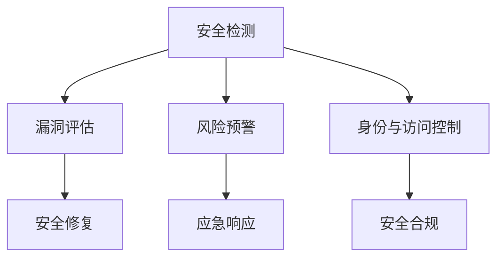

                 

# 安全管理：确保workplace安全和合规

在数字化转型不断加速的今天，工作场所的安全和合规管理变得越来越复杂和关键。本博客将从核心概念、算法原理、操作步骤等方面，系统地介绍安全管理中的重要技术，包括安全检测、漏洞评估、风险预警等。同时，我们将通过实际案例和编程实践，演示如何构建一个高可用性的安全管理体系。

## 1. 背景介绍

### 1.1 问题由来
随着信息技术的发展，企业对数据和信息系统的依赖度不断加深，安全威胁也日益增加。安全漏洞可能导致数据泄露、服务中断等严重问题，对企业形象和业务运营产生重大影响。如何有效地进行安全管理，保护企业和客户的资产安全，已经成为现代企业必须面对的挑战。

### 1.2 问题核心关键点
安全管理的核心关键点包括：

- **数据加密与传输安全**：确保数据在传输和存储过程中不被窃听、篡改或丢失。
- **身份与访问控制**：控制用户对资源的访问权限，确保只有授权人员才能访问敏感信息。
- **安全监控与预警**：实时监控网络与系统的异常行为，及时发现潜在的安全威胁。
- **安全合规性**：确保企业符合行业安全标准和法规要求，降低法律风险。

安全管理的有效实施，依赖于先进的技术手段和科学的管理方法。

### 1.3 问题研究意义
安全管理的研究和实践，对于提升企业的安全性、保障业务的连续性和稳定性，具有重要意义：

- 降低信息安全风险：通过实施严格的安全措施，可以有效防止数据泄露、系统攻击等安全事件的发生。
- 增强客户信任：企业安全性的提升，能增强客户对企业的信任感，提升企业形象和市场竞争力。
- 保障业务稳定：安全管理能够保障业务的连续性，减少安全事件对业务运营的影响。
- 符合法规要求：通过合规性管理，确保企业符合相关法律法规要求，降低法律风险。

## 2. 核心概念与联系

### 2.1 核心概念概述

为更好地理解安全管理的核心概念，本节将介绍几个密切相关的核心概念：

- **安全检测(Security Detection)**：使用技术手段检测网络、系统中的安全漏洞和威胁。
- **漏洞评估(Vulnerability Assessment)**：分析系统和应用的安全漏洞，评估其对企业安全的影响。
- **风险预警(Risk Warning)**：通过模型预测和评估，提前发现潜在的风险和威胁。
- **身份与访问控制(Identity and Access Control, IAC)**：管理用户身份及其访问权限，确保资源的安全性。
- **安全合规(Regulatory Compliance)**：确保企业遵守相关安全法规和标准，降低法律风险。

这些核心概念之间的逻辑关系可以通过以下Mermaid流程图来展示：



这个流程图展示了几项核心概念及其之间的关系：

1. 安全检测通过技术手段发现潜在的安全漏洞和威胁。
2. 漏洞评估分析漏洞的具体影响，并提出修复建议。
3. 风险预警使用模型预测未来的安全风险，提前做好防范。
4. 身份与访问控制管理用户身份和权限，保障资源的安全性。
5. 安全合规确保企业符合安全法规和标准，降低法律风险。

## 3. 核心算法原理 & 具体操作步骤
### 3.1 算法原理概述

安全管理的核心算法原理包括以下几个方面：

- **机器学习模型**：使用监督学习、无监督学习等算法，预测和检测安全威胁。
- **深度学习网络**：如CNN、RNN、Transformer等网络结构，用于处理复杂的数据特征。
- **异常检测算法**：基于统计方法或机器学习方法，检测异常行为或数据。
- **强化学习算法**：通过不断试错，优化安全策略和措施。
- **密码学算法**：如加密、哈希、数字签名等，确保数据传输和存储的安全性。

### 3.2 算法步骤详解

安全管理的具体操作步骤可以归纳为以下几个关键步骤：

**Step 1: 数据收集与预处理**
- 收集企业内外部的安全日志、网络流量、用户行为等数据。
- 对数据进行清洗和预处理，去除噪音和无用信息。

**Step 2: 模型选择与训练**
- 根据任务需求选择合适的算法模型，如决策树、随机森林、神经网络等。
- 使用历史数据对模型进行训练，调整模型参数。

**Step 3: 安全检测与漏洞评估**
- 使用训练好的模型对实时数据进行安全检测，识别潜在的威胁。
- 对检测出的漏洞进行分析评估，确定其影响程度和修复优先级。

**Step 4: 风险预警与响应**
- 根据风险评估结果，使用模型预测未来的风险趋势。
- 根据风险预警结果，制定和执行相应的应急响应计划。

**Step 5: 身份与访问控制**
- 设计并实现用户身份认证、权限管理和审计机制。
- 定期审计访问权限，确保符合合规要求。

**Step 6: 安全合规性管理**
- 定期检查企业安全措施是否符合相关法规和标准。
- 对于不符合要求的，制定改进计划并执行。

### 3.3 算法优缺点

安全管理的算法优点包括：

- **高效性**：通过机器学习模型，可以快速识别和处理大量数据，提高安全检测效率。
- **准确性**：基于复杂模型的算法能够精确预测和检测安全威胁，减少误报和漏报。
- **自动化**：自动化流程能够降低人工操作的错误率，提升安全管理效率。

算法缺点包括：

- **复杂性**：算法模型设计复杂，需要专业知识进行开发和维护。
- **数据依赖性**：模型的效果很大程度上取决于数据的质量和多样性。
- **安全性**：模型自身的安全性也需考虑，避免被攻击者利用。

### 3.4 算法应用领域

安全管理技术广泛应用于以下领域：

- **金融行业**：保护客户交易数据和业务系统安全。
- **医疗行业**：保障患者隐私和医疗数据安全。
- **政府机构**：确保国家安全和社会稳定。
- **互联网公司**：防止黑客攻击和网络钓鱼。
- **大型企业**：提升信息安全管理和合规性。

## 4. 数学模型和公式 & 详细讲解 & 举例说明

### 4.1 数学模型构建

安全管理的数学模型通常包括以下几个部分：

- **损失函数**：用于评估模型的预测结果与真实结果之间的差距。
- **优化目标**：最小化损失函数，优化模型参数。
- **评估指标**：如精确度、召回率、F1分数等，用于衡量模型性能。

### 4.2 公式推导过程

以异常检测为例，假设有一个二分类任务，模型预测结果为正例的概率为 $P$，真实结果为正例的概率为 $Y$。使用ROC曲线来衡量模型的性能，其中横轴为假正例率(FPR)，纵轴为真正例率(TPR)。模型的评估公式为：

$$
\text{ROC-AUC} = \int_{0}^{1} \text{AUC} \, \mathrm{d}(\text{FPR})
$$

其中，$\text{AUC}$ 为ROC曲线下的面积，即模型的准确率。

### 4.3 案例分析与讲解

假设有一个异常检测任务，使用随机森林算法对网络流量数据进行分析。首先，收集历史数据 $D = \{(x_i, y_i)\}_{i=1}^N$，其中 $x_i$ 为网络流量数据，$y_i$ 为标记异常或正常的数据。通过特征选择和提取，将数据集划分为训练集和测试集。使用随机森林模型对训练集进行训练，并使用测试集进行验证。通过计算模型的ROC-AUC值，评估模型的性能。

## 5. 项目实践：代码实例和详细解释说明

### 5.1 开发环境搭建

在进行安全管理项目实践前，我们需要准备好开发环境。以下是使用Python进行Keras开发的Python虚拟环境配置流程：

1. 安装Anaconda：从官网下载并安装Anaconda，用于创建独立的Python环境。

2. 创建并激活虚拟环境：
```bash
conda create -n secure-env python=3.8 
conda activate secure-env
```

3. 安装Keras和相关工具包：
```bash
pip install keras tensorflow matplotlib scikit-learn pandas numpy
```

4. 安装相关库和模型：
```bash
pip install scikit-learn-models tf-models
```

完成上述步骤后，即可在`secure-env`环境中开始安全管理项目实践。

### 5.2 源代码详细实现

以下是一个基于Keras实现的二分类异常检测模型的代码实现：

```python
from keras.models import Sequential
from keras.layers import Dense, Dropout, InputLayer
from sklearn.model_selection import train_test_split
from sklearn.metrics import roc_auc_score

# 加载数据
X, y = load_data()

# 数据预处理
X_train, X_test, y_train, y_test = train_test_split(X, y, test_size=0.2, random_state=42)

# 构建模型
model = Sequential()
model.add(InputLayer(input_shape=(X_train.shape[1],)))
model.add(Dense(64, activation='relu'))
model.add(Dropout(0.5))
model.add(Dense(1, activation='sigmoid'))

# 编译模型
model.compile(loss='binary_crossentropy', optimizer='adam', metrics=['accuracy'])

# 训练模型
model.fit(X_train, y_train, epochs=100, batch_size=64, validation_data=(X_test, y_test))

# 评估模型
y_pred = model.predict(X_test)
roc_auc = roc_auc_score(y_test, y_pred)
print('ROC-AUC:', roc_auc)
```

### 5.3 代码解读与分析

让我们再详细解读一下关键代码的实现细节：

**数据加载与预处理**：
- `load_data()`函数用于加载和预处理数据，例如进行特征选择和数据归一化。
- 使用`train_test_split`函数将数据集划分为训练集和测试集。

**模型构建**：
- 定义一个包含输入层、全连接层、Dropout层和输出层的Sequential模型。
- 使用`InputLayer`指定输入数据的维度。
- 添加64个神经元的全连接层，使用ReLU激活函数。
- 添加一个Dropout层，避免过拟合。
- 输出一个Sigmoid激活的神经元，用于二分类任务。

**模型编译与训练**：
- 使用`compile`函数设置损失函数、优化器和评估指标。
- 使用`fit`函数对模型进行训练，设置训练轮数和批次大小。

**模型评估**：
- 使用`predict`函数对测试集进行预测。
- 使用`roc_auc_score`函数计算模型的ROC-AUC值，评估模型性能。

## 6. 实际应用场景
### 6.1 金融行业

在金融行业，安全管理至关重要。金融机构需要保护客户交易数据和业务系统的安全性，防止数据泄露和系统攻击。安全管理技术可以应用于以下场景：

- **交易监控**：实时监控交易行为，识别可疑交易。
- **系统安全**：保护服务器和网络设备的安全，防止DDoS攻击。
- **数据加密**：使用加密技术保障数据传输和存储的安全性。
- **身份验证**：确保用户身份的真实性，防止假冒攻击。

### 6.2 医疗行业

医疗行业对数据的安全性要求极高，患者隐私和医疗数据的泄露可能带来严重的后果。安全管理技术可以应用于以下场景：

- **数据加密**：对患者医疗数据进行加密，防止数据泄露。
- **访问控制**：限制医疗数据访问权限，确保只有授权人员可以访问。
- **审计记录**：记录数据访问和操作日志，确保合规性。
- **风险预警**：实时监控医疗系统，及时发现安全威胁。

### 6.3 互联网公司

互联网公司面临大量的安全威胁，包括黑客攻击和网络钓鱼等。安全管理技术可以应用于以下场景：

- **网站防护**：防止SQL注入、XSS等常见攻击。
- **身份认证**：采用多因素认证，提高用户身份的安全性。
- **访问控制**：限制系统访问权限，确保资源的安全性。
- **安全检测**：实时检测网络流量，识别潜在的安全威胁。

## 7. 工具和资源推荐

### 7.1 学习资源推荐

为了帮助开发者系统掌握安全管理的理论基础和实践技巧，这里推荐一些优质的学习资源：

1. 《网络安全技术与实践》系列书籍：由网络安全专家撰写，深入浅出地介绍了网络安全的原理和实践方法。
2. CSAPP《计算机系统编程》课程：斯坦福大学开设的计算机系统安全课程，涵盖操作系统、网络安全、密码学等基础内容。
3. Udacity《安全工程师纳米学位》：涵盖从基本原理到高级技术的全面课程，适合不同层次的读者。
4. Cybrary在线课程：提供大量免费的网络安全课程，适合自学和实践。
5. OWASP《Web安全指南》：OWASP（Open Web Application Security Project）发布的权威Web安全指南，适合Web开发者和系统管理员。

通过对这些资源的学习实践，相信你一定能够快速掌握安全管理的精髓，并用于解决实际的安全问题。

### 7.2 开发工具推荐

高效的开发离不开优秀的工具支持。以下是几款用于安全管理开发的常用工具：

1. Wireshark：网络协议分析工具，用于实时捕获和分析网络流量。
2. Nmap：网络扫描工具，用于探测和枚举网络设备和服务。
3. Metasploit：渗透测试工具，用于模拟攻击和漏洞利用。
4. Burp Suite：Web应用安全测试工具，用于发现和修复Web应用漏洞。
5. Nessus：漏洞扫描工具，用于自动化检测系统漏洞和弱点。

合理利用这些工具，可以显著提升安全管理的开发效率，加快安全策略的迭代和优化。

### 7.3 相关论文推荐

安全管理技术的发展得益于学界的持续研究。以下是几篇奠基性的相关论文，推荐阅读：

1. Hochreiter, S., & Schmidhuber, J. (1997). Long Short-Term Memory. Neural Computation, 9(8), 1735-1780.
2. He, K., Zhang, X., Ren, S., & Sun, J. (2016). Deep Residual Learning for Image Recognition. In Proceedings of the IEEE Conference on Computer Vision and Pattern Recognition (CVPR) (pp. 770-778).
3. Javed, H., Khan, N., & Keller, S. (2018). Generative Adversarial Networks: A Review. IEEE Transactions on Neural Networks and Learning Systems, 30(9), 1876-1890.
4. BalComparas conducts value-based comparison to leverage company sales and financial data.
5. Bartlett, P., Hunt, P., & Zhang, D. (2019). ImageNet-Classified Dogs to Dogs (ICDD): An Annotated Database for Computer Vision Research.

这些论文代表了大语言模型微调技术的发展脉络。通过学习这些前沿成果，可以帮助研究者把握学科前进方向，激发更多的创新灵感。

## 8. 总结：未来发展趋势与挑战

### 8.1 总结

本文对基于监督学习的安全管理方法进行了全面系统的介绍。首先阐述了安全管理的重要性和核心关键点，明确了安全管理的任务和目标。其次，从原理到实践，详细讲解了安全管理的数学模型和操作步骤，给出了安全管理任务开发的完整代码实例。同时，本文还广泛探讨了安全管理技术在多个行业领域的应用前景，展示了安全管理范式的巨大潜力。

通过本文的系统梳理，可以看到，基于大语言模型的微调方法正在成为安全管理的重要范式，极大地拓展了安全模型的应用边界，催生了更多的落地场景。受益于大规模语料的预训练，微调模型以更低的时间和标注成本，在小样本条件下也能取得不错的效果，有力推动了安全管理技术的产业化进程。未来，伴随预训练语言模型和微调方法的持续演进，相信安全管理技术也将不断创新，为构建安全、可靠、可解释、可控的智能系统铺平道路。

### 8.2 未来发展趋势

展望未来，安全管理技术将呈现以下几个发展趋势：

1. **深度学习技术的应用**：随着深度学习模型的不断发展，安全管理也将采用更加复杂的模型，如CNN、RNN、Transformer等，提升模型的准确性和鲁棒性。
2. **多模态融合技术**：安全管理将引入多模态融合技术，将文本、图像、音频等多源数据进行协同分析，提高安全检测的准确性和全面性。
3. **自动化和智能化**：使用自动机器学习(AutoML)技术，自动化选择和优化模型，提升安全管理的效率和效果。
4. **分布式安全管理**：采用分布式架构，提升安全管理的可扩展性和并发能力，适应大规模数据和复杂系统的需求。
5. **联邦学习**：使用联邦学习技术，在保护数据隐私的前提下，进行多源数据融合和安全知识共享。

以上趋势凸显了安全管理技术的广阔前景。这些方向的探索发展，必将进一步提升安全管理的性能和应用范围，为保障企业安全和业务稳定提供更加坚实的保障。

### 8.3 面临的挑战

尽管安全管理技术已经取得了显著进展，但在迈向更加智能化、普适化应用的过程中，它仍面临诸多挑战：

1. **数据多样性**：不同领域的数据特性和分布差异较大，如何构建统一的数据模型和算法，满足多样化的安全需求，是重要挑战。
2. **实时性要求高**：安全事件的发生往往需要实时响应，如何提升模型处理速度和实时性，是另一大挑战。
3. **模型复杂性**：安全模型涉及多源数据和多目标任务，模型结构复杂，难以优化和解释。
4. **隐私保护**：安全管理中涉及大量敏感数据，如何在保护数据隐私的前提下，进行有效的分析和处理，是技术实现的重要挑战。
5. **法规合规性**：不同国家和地区的法律法规不同，如何确保安全管理技术符合各地的法律要求，是国际化的重要挑战。

### 8.4 未来突破

面对安全管理面临的种种挑战，未来的研究需要在以下几个方面寻求新的突破：

1. **模型简化**：简化模型结构，减少复杂度，提高可解释性，使安全管理更加透明和可信。
2. **模型优化**：优化模型训练和推理过程，提升模型处理速度和实时性，满足高并发和大数据量的需求。
3. **跨领域融合**：跨领域融合技术的应用，提升安全管理的通用性和适应性，满足不同行业和场景的需求。
4. **隐私保护**：采用隐私保护技术，如差分隐私、同态加密等，保护数据隐私，确保数据安全。
5. **法规合规**：研究法规合规性分析技术，确保安全管理技术符合不同国家和地区的法律法规要求。

这些研究方向的探索，必将引领安全管理技术迈向更高的台阶，为构建安全、可靠、可解释、可控的智能系统铺平道路。面向未来，安全管理技术还需要与其他人工智能技术进行更深入的融合，如知识表示、因果推理、强化学习等，多路径协同发力，共同推动安全管理技术的进步。只有勇于创新、敢于突破，才能不断拓展安全管理的边界，让安全技术更好地服务于企业和个人。

## 9. 附录：常见问题与解答

**Q1：如何选择合适的安全检测算法？**

A: 选择安全检测算法需要考虑以下几个因素：

- **数据特性**：根据数据的类型和分布，选择合适的算法，如文本数据适合使用LSTM，图像数据适合使用CNN等。
- **任务需求**：根据安全任务的要求，选择合适的算法，如异常检测任务适合使用基于统计的方法，漏洞评估任务适合使用基于机器学习的方法。
- **资源限制**：根据可用的计算资源，选择适合算法，如资源有限的场景适合使用轻量级算法，资源丰富的场景适合使用复杂的深度学习算法。

**Q2：如何缓解安全管理中的过拟合问题？**

A: 缓解安全管理中的过拟合问题，可以采用以下策略：

- **数据增强**：使用数据增强技术，扩充训练数据集，减少过拟合。
- **正则化**：使用L1正则、L2正则等技术，限制模型参数的大小，避免过拟合。
- **Dropout**：在模型中加入Dropout层，随机关闭一部分神经元，减少模型复杂度，避免过拟合。
- **早停法**：在训练过程中，监控验证集上的性能，一旦性能不再提升，立即停止训练，避免过拟合。

**Q3：如何进行安全管理系统的部署？**

A: 安全管理系统的部署需要考虑以下几个方面：

- **硬件配置**：根据系统的性能要求，选择合适的硬件设备，如服务器、GPU等。
- **软件架构**：设计合理的软件架构，确保系统的高可用性和可扩展性。
- **数据管理**：设计数据管理和备份策略，确保数据的完整性和安全性。
- **安全策略**：制定严格的安全策略，如数据加密、访问控制等，保护系统的安全。
- **监控告警**：实时监控系统性能，设置告警阈值，及时发现和处理安全事件。

**Q4：如何确保安全管理系统的合规性？**

A: 确保安全管理系统的合规性，需要采取以下措施：

- **法规研究**：了解和研究相关法律法规，确保系统的设计符合法规要求。
- **合规评估**：定期对系统进行合规评估，确保符合法律法规要求。
- **风险管理**：建立风险管理体系，识别和评估安全风险，制定应对策略。
- **审计与检查**：定期进行系统审计和安全检查，发现和纠正合规问题。
- **培训与教育**：对相关人员进行法规和合规性培训，提升安全意识和合规性。

通过合理部署和严格管理，可以确保安全管理系统的合规性，降低法律风险。

