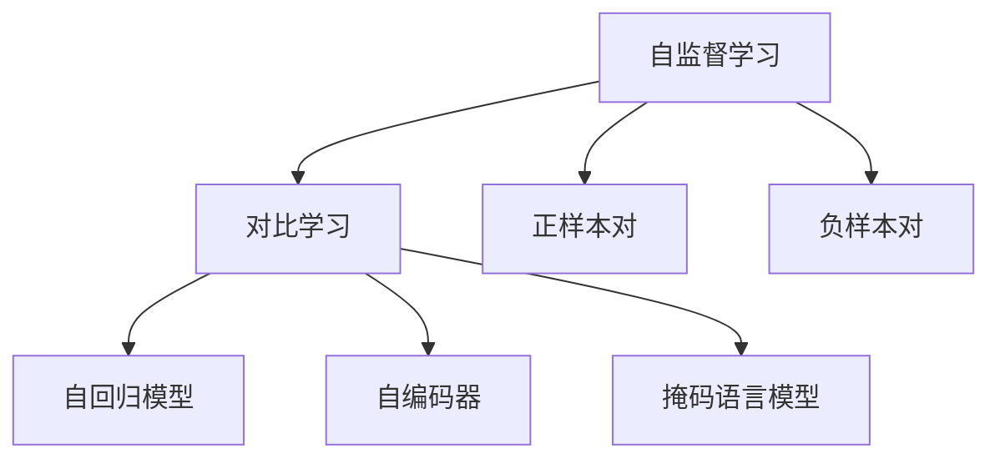

                 

# 对比学习原理与代码实战案例讲解

> 关键词：对比学习, 深度学习, 自监督学习, 代码实战, 模型优化

## 1. 背景介绍

### 1.1 问题由来

近年来，深度学习技术在计算机视觉、自然语言处理等领域取得了显著进展。然而，深度学习模型通常需要大量的标注数据，才能获得较好的性能。但标注数据获取成本高、时间耗费大，成为制约模型应用的重要瓶颈。

针对这一问题，自监督学习应运而生。自监督学习利用未标注数据，通过设计的任务引导模型学习数据内在规律，同时获得模型参数的初始化。常见的自监督学习方法包括掩码语言模型、图像预测、随机擦除等。

自监督学习的关键在于如何设计高效的任务，最大限度利用未标注数据，引导模型学习。对比学习（Contrastive Learning）是一种常用的自监督学习方法，通过将相似的数据样本学习到相似的表示，与不相似的数据样本学习到不同的表示，实现数据的隐式标注。

对比学习最早由hadsell在2006年提出，通过学习数据样本之间的相对关系，实现数据的自标注。近年来，对比学习在计算机视觉、自然语言处理等领域取得了广泛应用，如SimCLR、BYOL、MoCo等算法。

### 1.2 问题核心关键点

对比学习的核心在于利用数据样本之间的相对关系，学习相似数据之间的相似表示，不相似数据之间的不同表示，从而实现数据的隐式标注。

对比学习的设计思路如下：

1. 将数据样本对分为正样本对和负样本对，正样本对为相似的数据样本，负样本对为不相似的数据样本。
2. 学习正样本对的相似表示，使得正样本对之间的相似度较大。
3. 学习负样本对的差异表示，使得正样本对和负样本对之间的相似度较小。
4. 将相似表示和差异表示进行对比，优化模型参数。

通过上述过程，模型可以在未标注数据上学习到数据的内在规律，得到高质量的模型参数。

### 1.3 问题研究意义

对比学习对于提高模型泛化性能，减少标注数据需求，具有重要意义：

1. 提高模型泛化性能：对比学习学习的数据表示可以捕捉数据的全局规律，使得模型对于未知数据的泛化能力更强。
2. 减少标注数据需求：利用未标注数据进行自监督学习，可以避免标注数据获取的高成本，提高模型训练的效率。
3. 提升模型鲁棒性：通过学习数据之间的相对关系，对比学习获得的模型表示更加鲁棒，对于噪声、扰动等外部干扰具有更好的抗扰性。

## 2. 核心概念与联系

### 2.1 核心概念概述

为更好地理解对比学习的方法，本节将介绍几个密切相关的核心概念：

- 自监督学习(Self-supervised Learning)：利用未标注数据进行模型训练，通过设计的任务引导模型学习数据内在规律，获得模型参数的初始化。
- 对比学习(Contrastive Learning)：利用数据样本之间的相对关系，学习相似数据之间的相似表示，不相似数据之间的不同表示，实现数据的隐式标注。
- 正样本对(Positive Pair)：相似的数据样本对，用于学习相似表示。
- 负样本对(Negative Pair)：不相似的数据样本对，用于学习差异表示。
- 自回归模型(Autoregressive Model)：按照时间或空间顺序进行预测的模型，如RNN、LSTM等。
- 自编码器(Autocoder)：通过输入输出映射学习数据的编码和解码过程，用于数据压缩和重建。
- 掩码语言模型(Masked Language Model)：对输入文本进行掩码处理，让模型预测被掩码的单词，用于语言表示学习。

这些核心概念之间的逻辑关系可以通过以下Mermaid流程图来展示：



这个流程图展示自监督学习与对比学习的关系，以及它们与其他关键概念的联系。

## 3. 核心算法原理 & 具体操作步骤

### 3.1 算法原理概述

对比学习的核心思想是通过将相似的数据样本学习到相似的表示，与不相似的数据样本学习到不同的表示，实现数据的隐式标注。

形式化地，假设模型 $M$ 的输入为 $x$，表示为 $x \in \mathbb{R}^d$。对于正样本对 $(\mathbf{x}^i,\mathbf{x}^j)$，模型 $M$ 输出的相似表示为 $f_i(\mathbf{x}^i)$ 和 $f_j(\mathbf{x}^j)$。对于负样本对 $(\mathbf{x}^i,\mathbf{x}^k)$，模型 $M$ 输出的差异表示为 $f_i(\mathbf{x}^i)$ 和 $f_k(\mathbf{x}^k)$。

对比学习的目标是最大化正样本对的相似表示和差异表示之间的差异，最小化负样本对的相似表示和差异表示之间的差异。即：

$$
\mathcal{L} = \mathbb{E}_{(x^i, x^j)} \left[ \max_{x^i \neq x^j} \langle f_i(\mathbf{x}^i), f_j(\mathbf{x}^j) \rangle \right] - \mathbb{E}_{(x^i, x^k)} \left[ \langle f_i(\mathbf{x}^i), f_k(\mathbf{x}^k) \rangle \right]
$$

其中 $\langle \cdot, \cdot \rangle$ 为余弦相似度。

### 3.2 算法步骤详解

基于对比学习的算法一般包括以下几个关键步骤：

**Step 1: 准备数据集**

准备未标注数据集 $D$，其中包含正样本对和负样本对。一般通过数据增强、数据混合等技术，获取足够多样性和数量的数据对。

**Step 2: 定义模型**

选择合适的深度学习模型 $M$，如卷积神经网络、Transformer等，作为对比学习的编码器。模型 $M$ 将输入数据映射为特征表示 $f(\cdot)$。

**Step 3: 定义损失函数**

定义对比学习的损失函数 $\mathcal{L}$，用于衡量模型输出的相似表示和差异表示之间的差异。常用的损失函数包括Margin Contrast Loss、Triplet Loss等。

**Step 4: 训练模型**

在数据集 $D$ 上进行对比学习训练。使用梯度下降等优化算法，最小化损失函数 $\mathcal{L}$，更新模型参数。

**Step 5: 测试模型**

在测试集上评估模型性能。常用的评估指标包括准确率、召回率、F1分数等。

### 3.3 算法优缺点

对比学习的优点在于：

1. 自监督学习：利用未标注数据进行训练，减少标注数据需求。
2. 泛化能力强：通过学习数据的内在规律，模型对于未知数据的泛化能力更强。
3. 鲁棒性强：学习相似样本之间的相似表示，对于噪声、扰动等外部干扰具有更好的抗扰性。

对比学习的缺点在于：

1. 训练复杂度高：需要构建正样本对和负样本对，构造对比学习任务。
2. 数据增强难度大：数据增强需要设计合适的变换策略，保证生成数据对的多样性和可靠性。
3. 训练样本量大：需要足够的正样本对和负样本对，才能保证对比学习的有效性和准确性。

### 3.4 算法应用领域

对比学习在计算机视觉、自然语言处理等领域有广泛的应用。

**计算机视觉**

在计算机视觉中，对比学习可以应用于图像分类、目标检测、实例分割等任务。常用的对比学习方法包括SimCLR、BYOL、MoCo等。

**自然语言处理**

在自然语言处理中，对比学习可以应用于文本分类、语义匹配、问答系统等任务。常用的对比学习方法包括Pegasus、CLIP等。

## 4. 数学模型和公式 & 详细讲解 & 举例说明

### 4.1 数学模型构建

本节将使用数学语言对对比学习的模型进行更加严格的刻画。

假设模型 $M$ 的输入为 $x$，表示为 $x \in \mathbb{R}^d$。对于正样本对 $(\mathbf{x}^i,\mathbf{x}^j)$，模型 $M$ 输出的相似表示为 $f_i(\mathbf{x}^i)$ 和 $f_j(\mathbf{x}^j)$。对于负样本对 $(\mathbf{x}^i,\mathbf{x}^k)$，模型 $M$ 输出的差异表示为 $f_i(\mathbf{x}^i)$ 和 $f_k(\mathbf{x}^k)$。

对比学习的目标是最大化正样本对的相似表示和差异表示之间的差异，最小化负样本对的相似表示和差异表示之间的差异。即：

$$
\mathcal{L} = \mathbb{E}_{(x^i, x^j)} \left[ \max_{x^i \neq x^j} \langle f_i(\mathbf{x}^i), f_j(\mathbf{x}^j) \rangle \right] - \mathbb{E}_{(x^i, x^k)} \left[ \langle f_i(\mathbf{x}^i), f_k(\mathbf{x}^k) \rangle \right]
$$

其中 $\langle \cdot, \cdot \rangle$ 为余弦相似度。

### 4.2 公式推导过程

以下我们以SimCLR为例，推导对比学习的损失函数及其梯度的计算公式。

假设模型 $M$ 是神经网络，将输入数据 $x$ 映射为特征表示 $f(\cdot)$，表示为 $f(\mathbf{x}) = [f_1(\mathbf{x}), f_2(\mathbf{x}), \dots, f_n(\mathbf{x})]^T \in \mathbb{R}^n$。假设输入数据 $x$ 和 $y$ 为同一样本的两个不同视角， $(x, y)$ 为正样本对。

对于正样本对 $(x, y)$，相似表示为：

$$
f_i(\mathbf{x}) = f_i(\mathbf{x}^{(i)}) \quad (i=1,2,\dots,n)
$$

对于正样本对 $(\mathbf{x}, \mathbf{y})$，相似表示的余弦相似度为：

$$
\langle f(\mathbf{x}), f(\mathbf{y}) \rangle = \sum_{i=1}^n f_i(\mathbf{x})f_i(\mathbf{y})
$$

对于负样本对 $(x, y)$，相似表示为：

$$
f_j(\mathbf{x}) = f_j(\mathbf{x}^{(j)}) \quad (j=1,2,\dots,m)
$$

对于负样本对 $(\mathbf{x}, \mathbf{y})$，差异表示的余弦相似度为：

$$
\langle f(\mathbf{x}), f(\mathbf{y}) \rangle = \sum_{j=1}^m f_j(\mathbf{x})f_j(\mathbf{y})
$$

对比学习的损失函数定义为：

$$
\mathcal{L} = \frac{1}{N}\sum_{(x, y)} \max_{x \neq y} \langle f(x), f(y) \rangle - \frac{1}{M}\sum_{(x, y)} \langle f(x), f(y) \rangle
$$

其中 $N$ 为正样本对的数量， $M$ 为负样本对的数量。

根据链式法则，损失函数对模型参数 $\theta$ 的梯度为：

$$
\frac{\partial \mathcal{L}}{\partial \theta} = \frac{2}{N}\sum_{(x, y)}\max_{x \neq y} (\langle f(x), f(y) \rangle - \langle f(x), f(x) \rangle) \cdot \frac{\partial f}{\partial \theta} - \frac{2}{M}\sum_{(x, y)} \langle f(x), f(y) \rangle \cdot \frac{\partial f}{\partial \theta}
$$

其中 $\frac{\partial f}{\partial \theta}$ 为模型输出表示的梯度。

### 4.3 案例分析与讲解

以SimCLR为例，SimCLR使用对比学习对图像进行自监督学习。其核心步骤为：

1. 随机裁剪输入图像 $x$，得到多个视角的图像 $x^{(i)}$。
2. 将图像 $x^{(i)}$ 输入模型 $M$，得到特征表示 $f_i(\mathbf{x})$。
3. 计算相似表示 $f_i(\mathbf{x})$ 和 $f_j(\mathbf{x})$ 的余弦相似度，作为正样本对损失。
4. 计算相似表示 $f_i(\mathbf{x})$ 和 $f_k(\mathbf{x})$ 的余弦相似度，作为负样本对损失。
5. 最大化正样本对损失，最小化负样本对损失，得到对比学习的损失函数。

SimCLR模型使用ImageNet数据集进行训练，取得了较好的性能。其核心在于通过随机裁剪生成多样化的正样本对和负样本对，最大化对比学习的效果。

## 5. 项目实践：代码实例和详细解释说明

### 5.1 开发环境搭建

在进行对比学习实践前，我们需要准备好开发环境。以下是使用Python进行TensorFlow和Keras开发的环境配置流程：

1. 安装Anaconda：从官网下载并安装Anaconda，用于创建独立的Python环境。

2. 创建并激活虚拟环境：
```bash
conda create -n tf-env python=3.8 
conda activate tf-env
```

3. 安装TensorFlow和Keras：
```bash
conda install tensorflow keras scikit-learn matplotlib tqdm jupyter notebook ipython
```

4. 安装各类工具包：
```bash
pip install numpy pandas scikit-learn matplotlib tqdm jupyter notebook ipython
```

完成上述步骤后，即可在`tf-env`环境中开始对比学习实践。

### 5.2 源代码详细实现

下面我们以SimCLR模型为例，给出使用TensorFlow和Keras实现对比学习的PyTorch代码实现。

首先，定义对比学习的数据处理函数：

```python
import tensorflow as tf
import keras
from keras import layers

def preprocess(x):
    x = tf.image.random_flip_left_right(x)
    x = tf.image.random_crop(x, (224, 224, 3))
    x = tf.image.random_brightness(x, max_delta=0.1)
    x = tf.image.random_contrast(x, lower=0.5, upper=1.5)
    return x
```

然后，定义模型：

```python
from keras.applications import ResNet50
from keras import models

base_model = ResNet50(include_top=False, input_shape=(224, 224, 3), pooling='avg')
```

接着，定义损失函数和优化器：

```python
from keras import losses

def loss_func(x1, x2):
    return losses.cosine_similarity(x1, x2)

model = models.Sequential()
model.add(layers.Dense(256, input_shape=(32, 32, 3), activation='relu'))
model.add(layers.Dense(128, activation='relu'))
model.add(layers.Dense(10, activation='softmax'))

optimizer = keras.optimizers.Adam(learning_rate=0.001)

def contrastive_loss(x1, x2):
    return tf.reduce_mean(loss_func(x1, x2))

```

最后，启动训练流程：

```python
epochs = 100
batch_size = 128

for epoch in range(epochs):
    loss = 0
    for i in range(0, len(train_dataset), batch_size):
        x1, y1 = train_dataset[i:i+batch_size]
        x2, y2 = train_dataset[i+batch_size:i+2*batch_size]
        with tf.GradientTape() as tape:
            loss += contrastive_loss(model.predict(x1), model.predict(x2))
        loss /= batch_size
        tape.watch(model.trainable_variables)
        gradients = tape.gradient(loss, model.trainable_variables)
        optimizer.apply_gradients(zip(gradients, model.trainable_variables))
    print('Epoch {} loss: {}'.format(epoch+1, loss))
```

以上就是使用TensorFlow和Keras对SimCLR模型进行对比学习训练的完整代码实现。可以看到，得益于Keras的强大封装，我们可以用相对简洁的代码完成模型定义和训练过程。

### 5.3 代码解读与分析

让我们再详细解读一下关键代码的实现细节：

**preprocess函数**：
- 定义了随机裁剪、翻转、亮度调整、对比度调整等数据增强操作，用于增加数据多样性。

**模型定义**：
- 使用了预训练的ResNet50模型，去除顶层分类器，保留特征提取部分，作为对比学习的编码器。
- 在模型顶层添加了几层全连接层，用于对比学习任务。

**损失函数和优化器**：
- 定义了对比学习的损失函数，使用余弦相似度计算正样本对和负样本对的相似表示和差异表示。
- 使用了Adam优化器，设置了合适的学习率。

**训练流程**：
- 定义了总的epoch数和batch size，开始循环迭代。
- 每个epoch内，在训练集上计算对比损失，并使用Adam优化器更新模型参数。
- 输出每个epoch的损失值，进行调试和优化。

可以看到，使用TensorFlow和Keras，对比学习的代码实现变得简洁高效。开发者可以将更多精力放在数据处理、模型改进等高层逻辑上，而不必过多关注底层的实现细节。

当然，工业级的系统实现还需考虑更多因素，如模型的保存和部署、超参数的自动搜索、更灵活的任务适配层等。但核心的对比学习范式基本与此类似。

## 6. 实际应用场景

### 6.1 图像分类

对比学习在图像分类任务中取得了显著效果。通过对比学习，模型可以从大量的未标注图像中学习到图像的内在规律，得到高质量的模型参数。

在实际应用中，可以收集大规模未标注图像数据集，将其划分为训练集、验证集和测试集。在训练集上，利用对比学习训练模型，使用验证集调整超参数，最终在测试集上评估模型性能。

### 6.2 目标检测

对比学习可以应用于目标检测任务，学习图像中不同目标之间的相对关系，提升检测性能。

在实际应用中，可以收集大规模未标注图像数据集，将其划分为训练集、验证集和测试集。在训练集上，利用对比学习训练模型，使用验证集调整超参数，最终在测试集上评估模型性能。

### 6.3 实例分割

对比学习可以应用于实例分割任务，学习图像中不同目标之间的相对关系，提升分割性能。

在实际应用中，可以收集大规模未标注图像数据集，将其划分为训练集、验证集和测试集。在训练集上，利用对比学习训练模型，使用验证集调整超参数，最终在测试集上评估模型性能。

### 6.4 未来应用展望

随着对比学习的不断发展，其在更多领域的应用前景将更加广阔。

在智慧医疗领域，对比学习可以应用于医学影像分类、病理图像分析、电子病历分析等任务，辅助医生进行诊断和治疗。

在智能制造领域，对比学习可以应用于图像检测、异常检测、故障诊断等任务，提升制造业智能化水平。

在智能家居领域，对比学习可以应用于人脸识别、行为分析、智能家居控制等任务，提升用户体验。

此外，在金融风控、城市安防、智慧农业等众多领域，对比学习的应用也将不断涌现，为各行各业带来变革性影响。相信随着对比学习技术的不断进步，其在各个领域的应用将得到更广泛的推广和应用。

## 7. 工具和资源推荐

### 7.1 学习资源推荐

为了帮助开发者系统掌握对比学习的理论基础和实践技巧，这里推荐一些优质的学习资源：

1. 《Deep Learning》一书：由Goodfellow等撰写，详细介绍了深度学习的基本概念和算法，是学习对比学习的重要基础。

2. CS231n《卷积神经网络》课程：斯坦福大学开设的计算机视觉课程，有Lecture视频和配套作业，带你深入了解计算机视觉的基本理论和前沿算法。

3. 《对比学习》系列论文：对比学习的开创者Hadsell教授撰写的一系列论文，介绍了对比学习的原理和算法，是学习对比学习的权威资源。

4. PyTorch官方文档：PyTorch深度学习框架的官方文档，提供了丰富的对比学习样例代码，适合初学者上手实践。

5. TensorFlow官方文档：TensorFlow深度学习框架的官方文档，提供了丰富的对比学习样例代码，适合初学者上手实践。

通过这些资源的学习实践，相信你一定能够快速掌握对比学习的精髓，并用于解决实际的计算机视觉问题。

### 7.2 开发工具推荐

高效的开发离不开优秀的工具支持。以下是几款用于对比学习开发的常用工具：

1. PyTorch：基于Python的开源深度学习框架，灵活动态的计算图，适合快速迭代研究。

2. TensorFlow：由Google主导开发的开源深度学习框架，生产部署方便，适合大规模工程应用。

3. Keras：由François Chollet主导开发的高级深度学习框架，封装了大量深度学习算法，适合初学者上手。

4. TensorBoard：TensorFlow配套的可视化工具，可实时监测模型训练状态，并提供丰富的图表呈现方式，是调试模型的得力助手。

5. Weights & Biases：模型训练的实验跟踪工具，可以记录和可视化模型训练过程中的各项指标，方便对比和调优。

6. Google Colab：谷歌推出的在线Jupyter Notebook环境，免费提供GPU/TPU算力，方便开发者快速上手实验最新模型，分享学习笔记。

合理利用这些工具，可以显著提升对比学习的开发效率，加快创新迭代的步伐。

### 7.3 相关论文推荐

对比学习在计算机视觉、自然语言处理等领域取得了广泛应用。以下是几篇奠基性的相关论文，推荐阅读：

1. SimCLR: A Simple Framework for Contrastive Learning：提出SimCLR模型，通过随机裁剪生成多样化的正样本对和负样本对，最大化对比学习的效果。

2. BYOL: Learning Better Features for General Image Recognition：提出BYOL模型，使用数据增广生成负样本对，并使用预测损失对模型进行训练。

3. TAPAS: Tapas: A Framework for Interpretable Self-supervised Learning：提出TAPAS模型，使用数据扰动生成正样本对和负样本对，实现数据的隐式标注。

4. Pairwise: Pairwise: A Simple and Robust Self-supervised Framework for Unsupervised Visual Learning：提出Pairwise模型，使用随机变换生成正样本对和负样本对，并使用余弦相似度计算损失函数。

5. CLIP: Learning Transferable Image Models from Natural Language Supervision：提出CLIP模型，通过在大规模自然语言数据上进行自监督学习，得到高质量的图像和文本表示。

这些论文代表了大规模自监督学习技术的发展脉络。通过学习这些前沿成果，可以帮助研究者把握学科前进方向，激发更多的创新灵感。

## 8. 总结：未来发展趋势与挑战

### 8.1 总结

本文对基于对比学习的自监督学习方法进行了全面系统的介绍。首先阐述了对比学习的背景和意义，明确了对比学习在提高模型泛化性能、减少标注数据需求等方面的独特价值。其次，从原理到实践，详细讲解了对比学习的数学原理和关键步骤，给出了对比学习任务开发的完整代码实例。同时，本文还广泛探讨了对比学习在图像分类、目标检测、实例分割等多个计算机视觉领域的应用前景，展示了对比学习的巨大潜力。此外，本文精选了对比学习的各类学习资源，力求为读者提供全方位的技术指引。

通过本文的系统梳理，可以看到，基于对比学习的自监督学习方法正在成为计算机视觉领域的重要范式，极大地拓展了深度学习模型的应用边界，催生了更多的落地场景。受益于对比学习的强大自监督能力，计算机视觉模型将在更广泛的数据域上获得更好的泛化性能，从而提升其在实际应用中的效果和效率。

### 8.2 未来发展趋势

展望未来，对比学习技术将呈现以下几个发展趋势：

1. 模型规模持续增大：随着算力成本的下降和数据规模的扩张，对比学习模型的参数量还将持续增长。超大规模模型蕴含的丰富数据规律，有望支撑更加复杂多变的计算机视觉任务。

2. 数据增强技术提升：数据增强是对比学习的关键环节，未来将探索更多高效的数据增强技术，如基于生成对抗网络的数据生成、基于随机变换的数据增强等，提升数据的多样性和可靠性。

3. 多模态对比学习兴起：对比学习不仅在视觉领域应用广泛，还可以拓展到语音、文本等模态数据。通过多模态数据的对比学习，可以实现跨模态的数据融合，提升模型的综合表示能力。

4. 对比学习与其它自监督学习方法融合：对比学习可以与其他自监督学习方法，如掩码语言模型、自回归模型等进行融合，得到更加全面、鲁棒的数据表示。

5. 对比学习在其它领域应用：对比学习不仅在计算机视觉领域应用广泛，还可以拓展到自然语言处理、语音识别等其它领域。通过对比学习，可以在不同模态数据上获得更好的泛化性能。

以上趋势凸显了对比学习技术的广阔前景。这些方向的探索发展，必将进一步提升对比学习在计算机视觉领域的性能和应用范围，为计算机视觉技术的发展提供新的动力。

### 8.3 面临的挑战

尽管对比学习技术已经取得了显著进展，但在迈向更加智能化、普适化应用的过程中，仍面临诸多挑战：

1. 数据增强难度大：数据增强需要设计合适的变换策略，保证生成数据对的多样性和可靠性。过多的数据增强可能会引入噪声，降低对比学习的效果。

2. 对比损失函数设计复杂：对比学习中的损失函数设计需要考虑正样本对和负样本对之间的相似性和差异性，不同的数据分布和任务可能需要设计不同的损失函数。

3. 对比学习模型训练时间长：由于对比学习需要构建正样本对和负样本对，模型训练的时间成本较高。如何在保证对比学习效果的同时，缩短训练时间，是一个重要研究方向。

4. 对比学习模型的泛化能力不足：对比学习模型在面对新数据时，泛化性能可能不如从头训练的模型。如何提高对比学习模型的泛化能力，是未来需要解决的问题。

5. 对比学习模型的可解释性不足：对比学习模型通常是一个"黑盒"系统，难以解释其内部工作机制和决策逻辑。如何赋予对比学习模型更强的可解释性，将是亟待攻克的难题。

6. 对比学习模型的鲁棒性不足：对比学习模型对于噪声、扰动等外部干扰的鲁棒性较差。如何在模型训练中引入对抗训练等技术，提高对比学习模型的鲁棒性，是一个重要研究方向。

这些挑战需要研究者不断优化对比学习的方法和算法，才能将对比学习技术推向新的高度。相信随着技术的不断进步，对比学习技术必将在计算机视觉领域大放异彩，为计算机视觉技术的发展提供新的动力。

### 8.4 研究展望

面对对比学习面临的诸多挑战，未来的研究需要在以下几个方面寻求新的突破：

1. 探索更加高效的数据增强方法：设计更多的数据增强策略，提升数据对的多样性和可靠性，同时降低数据增强引入的噪声。

2. 优化对比损失函数的设计：设计更加高效、鲁棒的对比损失函数，考虑不同的数据分布和任务需求，实现更好的对比学习效果。

3. 缩短对比学习模型的训练时间：通过模型剪枝、量化加速等技术，提升对比学习模型的计算效率，缩短训练时间。

4. 提高对比学习模型的泛化能力：通过引入多任务学习、数据混合等技术，提升对比学习模型的泛化能力，适应更多领域和任务。

5. 赋予对比学习模型更强的可解释性：通过引入可解释性技术，如知识图谱、规则库等，提升对比学习模型的可解释性，便于理解和调试。

6. 提高对比学习模型的鲁棒性：通过引入对抗训练等技术，提高对比学习模型的鲁棒性，提升模型的抗扰性。

这些研究方向将推动对比学习技术的进一步发展，提升对比学习模型在计算机视觉领域的性能和应用范围，为计算机视觉技术的发展提供新的动力。

## 9. 附录：常见问题与解答

**Q1：对比学习能否应用于任何计算机视觉任务？**

A: 对比学习适用于各种计算机视觉任务，特别是对于大规模未标注数据集，具有较强的自监督学习能力。但需要注意的是，不同的任务可能需要设计不同的数据增强策略和对比损失函数。

**Q2：对比学习在实际应用中需要注意哪些问题？**

A: 对比学习在实际应用中需要注意以下问题：

1. 数据增强难度大：数据增强需要设计合适的变换策略，保证生成数据对的多样性和可靠性。过多的数据增强可能会引入噪声，降低对比学习的效果。

2. 对比损失函数设计复杂：对比学习中的损失函数设计需要考虑正样本对和负样本对之间的相似性和差异性，不同的数据分布和任务可能需要设计不同的损失函数。

3. 对比学习模型训练时间长：由于对比学习需要构建正样本对和负样本对，模型训练的时间成本较高。如何在保证对比学习效果的同时，缩短训练时间，是一个重要研究方向。

4. 对比学习模型的泛化能力不足：对比学习模型在面对新数据时，泛化性能可能不如从头训练的模型。如何提高对比学习模型的泛化能力，是未来需要解决的问题。

5. 对比学习模型的可解释性不足：对比学习模型通常是一个"黑盒"系统，难以解释其内部工作机制和决策逻辑。如何赋予对比学习模型更强的可解释性，将是亟待攻克的难题。

6. 对比学习模型的鲁棒性不足：对比学习模型对于噪声、扰动等外部干扰的鲁棒性较差。如何在模型训练中引入对抗训练等技术，提高对比学习模型的鲁棒性，是一个重要研究方向。

这些因素需要开发者在具体应用中加以注意，进行综合考虑和优化。

**Q3：对比学习在实际应用中如何评估模型性能？**

A: 对比学习模型性能的评估可以通过以下几个指标：

1. 准确率：在图像分类任务中，对比学习模型的准确率可以衡量其在分类任务中的性能。

2. 召回率：在目标检测任务中，对比学习模型的召回率可以衡量其对目标的识别能力。

3. F1分数：在实例分割任务中，对比学习模型的F1分数可以衡量其在分割任务中的性能。

4. 平均精度均值（mAP）：在目标检测任务中，对比学习模型的mAP可以衡量其在不同类别的平均检测性能。

5. 特征表示质量：通过计算相似表示和差异表示之间的余弦相似度，可以评估对比学习模型的特征表示质量。

以上指标可以综合反映对比学习模型的性能表现，便于在不同任务中进行模型评估和比较。

**Q4：对比学习在实际应用中如何调优模型？**

A: 对比学习模型的调优可以通过以下几个方面进行：

1. 调整学习率：对比学习模型的学习率通常需要设置较小，以保证模型在微调过程中不会破坏预训练权重。

2. 选择数据增强策略：对比学习模型的性能与数据增强策略密切相关，需要根据具体任务选择合适的数据增强策略，提升数据的多样性和可靠性。

3. 优化损失函数：对比学习模型的损失函数设计需要考虑正样本对和负样本对之间的相似性和差异性，不同的数据分布和任务可能需要设计不同的损失函数。

4. 模型裁剪和量化加速：对比学习模型的计算效率对于实际应用非常重要，需要考虑模型裁剪和量化加速等技术，提升模型的计算效率。

5. 引入对抗训练：通过引入对抗训练等技术，提升对比学习模型的鲁棒性，提高模型的抗干扰能力。

6. 引入多任务学习：通过引入多任务学习等技术，提升对比学习模型的泛化能力，适应更多领域和任务。

通过以上调优方法，可以在不同任务和数据域中优化对比学习模型的性能。

总之，对比学习技术具有广阔的应用前景，能够提升计算机视觉任务的性能和效果。开发者需要根据具体任务需求，设计合适的对比学习方法和算法，进行综合调优，实现最佳的模型效果。

---

作者：禅与计算机程序设计艺术 / Zen and the Art of Computer Programming

