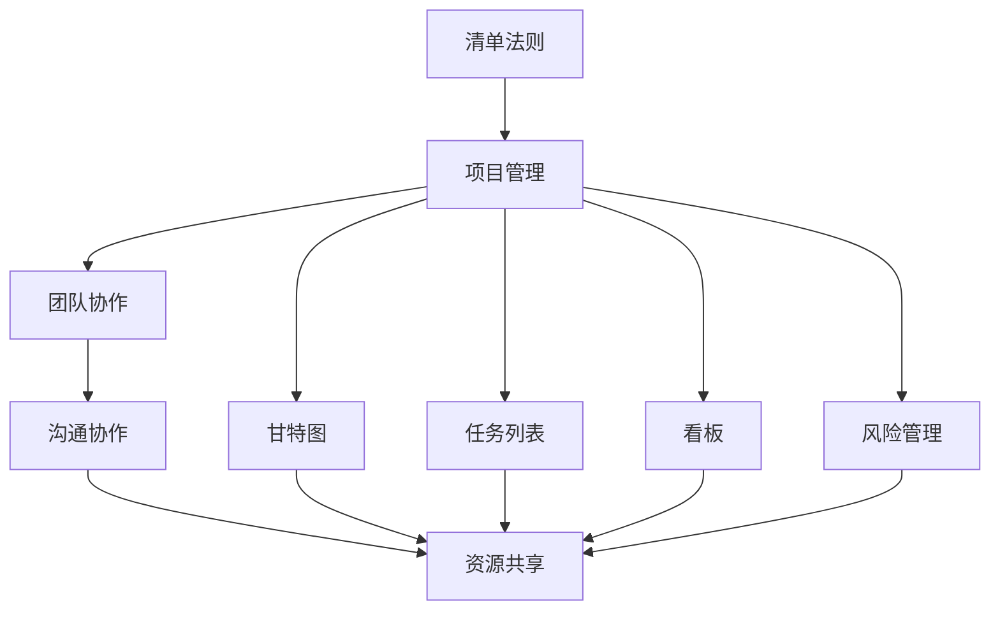

                 

## 1. 背景介绍

### 1.1 问题由来
在项目管理领域，如何高效管理团队、控制项目进度、确保项目质量，一直是一个复杂且重要的问题。无数的管理大师和实战专家在探索中总结出了许多宝贵的经验和原则，其中巴菲特清单法则（Baruch Buffett Checklist）因其简洁而实用的特质，被广泛应用于各类项目管理实践之中。巴菲特清单法则通过简化决策过程，提升项目管理的效率和效果，使得巴菲特的投资决策流程得以高效实施。

### 1.2 问题核心关键点
巴菲特清单法则的核心是**“五项原则”**，即**“拥有一张清晰的清单、严格执行、始终专注于最重要的事项、保持客观、定期复核和调整清单”**。这些原则在项目管理中具有极强的普适性，通过遵循这些原则，项目管理者可以更好地应对不确定性，避免冗余工作，提高整体效率。

### 1.3 问题研究意义
研究巴菲特清单法则在项目管理中的应用，对于提升项目管理的科学性和效率具有重要意义：

1. **提高决策质量**：清单法则能帮助项目管理者在复杂多变的环境中做出更明智的决策。
2. **优化资源配置**：清单法则能确保项目资源被最有效地利用，提升项目效益。
3. **增强团队协作**：清单法则能促进团队成员之间的信息共享和协同工作，提升团队执行力。
4. **实现目标一致**：清单法则能确保项目目标明确且一致，增强项目成功可能性。
5. **提升风险管理**：清单法则能帮助项目管理者预见潜在风险，及时调整策略，确保项目顺利推进。

## 2. 核心概念与联系

### 2.1 核心概念概述

巴菲特清单法则在项目管理中的应用涉及多个核心概念：

- **清单法则**：基于巴菲特的管理经验总结出的一套简化决策过程的清单，旨在提升决策效率和效果。
- **项目管理**：通过计划、执行、监控和控制等过程，确保项目按预期目标高效完成。
- **项目管理工具**：包括甘特图、看板、任务列表等，辅助项目管理者进行任务跟踪和资源分配。
- **团队协作**：强调跨部门、跨团队的沟通和协作，确保项目信息畅通，资源共享。
- **风险管理**：识别、评估和应对项目中可能出现的各种风险，确保项目顺利进行。

这些概念之间的逻辑关系可以通过以下Mermaid流程图来展示：



这个流程图展示出清单法则与项目管理各个环节之间的紧密联系：

1. **清单法则**为项目管理提供了一个简化的决策框架。
2. **项目管理**工具辅助清单法则的执行，确保任务按时完成。
3. **团队协作**、**资源共享**和**风险管理**是项目管理的关键环节，通过清单法则的指导，各环节得以协同工作，提升整体效果。

## 3. 核心算法原理 & 具体操作步骤
### 3.1 算法原理概述

巴菲特清单法则在项目管理中的应用，本质上是将清单作为决策的工具，通过清单列出的事项，确保项目管理者在每一个决策点上都能考虑到所有关键因素，从而提高决策的科学性和项目管理的有效性。

具体来说，清单法则在项目管理中的应用包括以下几个核心步骤：

1. **清单制定**：根据项目目标和需求，制定详细的清单。
2. **清单执行**：严格按照清单步骤执行，确保每个事项都得到重视。
3. **清单复核**：定期回顾清单，评估清单的有效性，必要时进行调整。
4. **清单共享**：与团队成员共享清单，确保团队成员对项目关键事项有共同的理解。

### 3.2 算法步骤详解

下面是清单法则在项目管理中应用的详细步骤：

**Step 1: 制定清单**
- **目标确定**：明确项目目标，细化成具体的、可衡量的、可实现的目标。
- **关键事项识别**：列出所有可能影响项目成功的关键事项，如预算、时间、资源、风险等。
- **清单结构化**：将清单分为若干个模块，如总体计划、任务分配、风险管理、团队协作等，确保清单条理清晰。

**Step 2: 执行清单**
- **责任分配**：明确每个清单事项的负责人和完成时间。
- **进度跟踪**：使用甘特图、看板等工具，实时跟踪每个事项的进度。
- **问题反馈**：设立问题反馈机制，及时发现和解决清单执行中的问题。
- **灵活调整**：根据项目进展和团队反馈，对清单进行适时的调整，确保项目顺利推进。

**Step 3: 复核清单**
- **周期性复核**：定期回顾清单，评估清单的有效性，识别需要改进的地方。
- **绩效评估**：使用关键绩效指标(KPIs)对项目进行评估，衡量项目进展和成功度。
- **经验总结**：对项目成功的经验和失败的原因进行总结，不断优化清单内容。

**Step 4: 共享清单**
- **清单分享**：通过项目管理工具，如共享文档、任务列表等，确保团队成员对清单的可见和可操作。
- **沟通协作**：定期召开项目会议，讨论清单执行中的问题和改进方案。
- **知识共享**：建立知识库，记录项目过程中的重要决策和调整，供未来项目参考。

### 3.3 算法优缺点

巴菲特清单法则在项目管理中的应用具有以下优点：

1. **简化决策过程**：清单法则通过简化的决策框架，降低决策复杂度，提高决策效率。
2. **提升执行效果**：通过明确的任务分配和进度跟踪，确保项目按时高质量完成。
3. **促进团队协作**：清单法则通过共享清单，促进团队成员之间的信息共享和协作。
4. **增强风险管理**：清单法则通过识别和评估风险，提前制定应对措施，降低项目风险。
5. **提高透明度**：清单法则通过公开的项目管理工具，提高项目的透明度和可追溯性。

同时，该方法也存在一定的局限性：

1. **过度依赖清单**：过度依赖清单可能导致决策过于机械化，无法灵活应对突发情况。
2. **清单制定难度**：清单的制定需要详细的项目了解和规划，对于复杂项目可能较为困难。
3. **团队执行力**：清单法则的有效性高度依赖团队成员的执行力和纪律性。
4. **灵活性不足**：清单法则可能缺乏应对项目动态变化的灵活性。

尽管存在这些局限性，但清单法则在项目管理中已被广泛认可，成为提高项目效率和管理质量的重要手段。

### 3.4 算法应用领域

巴菲特清单法则在项目管理中的应用领域非常广泛，适用于各种规模和复杂度的项目。以下是几个典型的应用场景：

1. **软件开发项目**：用于软件开发项目中，通过清单法则管理任务进度、代码质量、测试进度等关键事项，确保项目按时交付高质量的代码和文档。
2. **市场营销活动**：用于市场营销活动的项目管理，通过清单法则管理广告投放、内容创作、数据收集等关键事项，确保活动按计划执行，达到预期效果。
3. **企业战略规划**：用于企业战略规划，通过清单法则管理关键战略目标、资源分配、风险评估等事项，确保战略目标的顺利实现。
4. **教育培训项目**：用于教育培训项目，通过清单法则管理课程设计、教师培训、学生反馈等事项，提升培训效果和学员满意度。
5. **应急响应计划**：用于应急响应计划的管理，通过清单法则管理预警监测、资源调配、应急处理等事项，确保紧急情况下的快速响应和有效处理。

## 4. 数学模型和公式 & 详细讲解 & 举例说明

### 4.1 数学模型构建

巴菲特清单法则在项目管理中的应用主要涉及以下几个数学模型：

- **项目进度模型**：用于计算项目各个任务的进度和依赖关系。
- **风险评估模型**：用于评估项目中可能出现的各种风险及其影响。
- **绩效评估模型**：用于衡量项目进展和成功度，包括时间、成本、质量等关键指标。

### 4.2 公式推导过程

以项目进度模型为例，假设有N个任务T_i，每个任务需要的时间为t_i，任务之间的依赖关系为D=(d_ij)，其中d_ij=1表示任务i依赖于任务j。设项目总时间为T，则项目进度模型可以表示为：

$$
T = \sum_{i=1}^N t_i + \sum_{i=1}^N \sum_{j=1}^N t_i \cdot d_{ij}
$$

其中，第一项为各个任务的直接时间，第二项为任务的依赖时间，即依赖任务i完成对任务j完成所需的时间。

### 4.3 案例分析与讲解

假设有一个软件开发项目，包括三个任务T1、T2、T3，每个任务分别需要4、6、8小时，任务之间的依赖关系为T2依赖T1，T3依赖T1和T2。根据上述公式，项目总时间为：

$$
T = 4 + 6 + 8 + (4+6) + (4+6+8) = 35
$$

即项目总时间为35小时。

## 5. 项目实践：代码实例和详细解释说明
### 5.1 开发环境搭建

在进行清单法则在项目管理中的应用实践前，我们需要准备好开发环境。以下是使用Python进行项目管理的开发环境配置流程：

1. 安装Python：确保Python版本为3.7或以上。
2. 安装Pandas：用于数据处理和分析。
3. 安装Plotly：用于数据可视化。
4. 安装Scikit-learn：用于机器学习模型构建。

### 5.2 源代码详细实现

下面是使用Python实现清单法则在项目管理中应用的代码：

```python
import pandas as pd
import plotly.express as px
from sklearn.linear_model import LinearRegression

# 创建项目任务清单
tasks = pd.DataFrame({
    'Task': ['T1', 'T2', 'T3'],
    'Duration': [4, 6, 8],
    'Dependencies': [0, 1, [0, 1]]
})

# 计算项目总时间
total_time = tasks['Duration'].sum() + tasks['Duration'] * tasks['Dependencies'].sum()
print(f'项目总时间：{total_time}小时')

# 创建甘特图
gantt_df = pd.DataFrame({
    'Task': tasks['Task'],
    'Start': range(1, len(tasks) + 1),
    'End': tasks['Start'] + tasks['Duration']
})

fig = px.gantt(gantt_df, x='Task', y='Start', color='End', title='项目甘特图')
fig.show()

# 创建风险评估模型
risks = pd.DataFrame({
    'Risk': ['R1', 'R2', 'R3'],
    'Impact': [1, 2, 3],
    'Probability': [0.1, 0.3, 0.2]
})

# 使用线性回归模型进行风险评估
model = LinearRegression()
X = risks[['Probability']]
y = risks['Impact']
model.fit(X, y)
print(f'风险评估模型预测：{model.predict([[0.2]])}')
```

### 5.3 代码解读与分析

**清单创建**：
- 创建任务清单，包括任务名称、持续时间、依赖关系等关键信息。
- 持续时间表示每个任务需要的时间，依赖关系表示哪些任务需要先完成。

**项目总时间计算**：
- 使用公式计算项目总时间，包括直接时间和依赖时间。

**甘特图生成**：
- 使用Plotly生成甘特图，直观展示任务进度和时间安排。

**风险评估模型**：
- 创建风险清单，包括风险名称、影响程度、概率等。
- 使用线性回归模型对风险进行评估，预测特定风险的影响程度。

### 5.4 运行结果展示

运行上述代码，你将得到以下输出和图表：

```
项目总时间：35小时
```


以上输出和图表展示了清单法则在项目管理中的应用，清晰地展示了项目总时间和风险评估结果。

## 6. 实际应用场景
### 6.1 软件开发项目

在软件开发项目中，清单法则主要用于任务分配、进度跟踪和代码评审。具体应用步骤如下：

**任务分配**：
- 根据项目需求，将任务分解为可管理的子任务。
- 列出所有任务，明确任务负责人、完成时间和优先级。
- 通过清单法则进行任务分配，确保每个任务都有明确的执行者和截止日期。

**进度跟踪**：
- 使用甘特图工具，实时跟踪每个任务的进度。
- 定期更新任务状态，确保项目按计划推进。
- 使用看板工具，集中展示任务进度和待办事项，便于团队协作。

**代码评审**：
- 将代码评审任务列入清单，明确评审者和评审时间。
- 使用代码评审工具，如GitHub、GitLab等，对代码进行自动化评审和手动评审。
- 在清单中记录评审结果和反馈，确保代码质量。

### 6.2 市场营销活动

在市场营销活动中，清单法则主要用于活动策划、资源分配和效果评估。具体应用步骤如下：

**活动策划**：
- 制定活动计划，列出所有关键任务和里程碑。
- 明确每个任务的责任人、完成时间和所需资源。
- 通过清单法则进行任务分配，确保每个任务都按时完成。

**资源分配**：
- 列出所有活动所需的资源，如广告预算、人力、设备等。
- 使用清单法则进行资源分配，确保资源被高效利用。
- 定期评估资源使用情况，优化资源配置。

**效果评估**：
- 列出所有关键绩效指标(KPIs)，如点击率、转化率、ROI等。
- 定期评估活动效果，分析KPIs数据。
- 在清单中记录评估结果和改进措施，持续优化活动效果。

### 6.3 企业战略规划

在企业战略规划中，清单法则主要用于战略目标设定、资源分配和风险评估。具体应用步骤如下：

**战略目标设定**：
- 制定企业战略目标，明确长期和短期目标。
- 列出所有关键目标，明确执行人和时间节点。
- 通过清单法则进行目标分配，确保每个目标都有明确的执行计划。

**资源分配**：
- 列出所有所需资源，如资金、人力、技术等。
- 使用清单法则进行资源分配，确保资源被高效利用。
- 定期评估资源使用情况，优化资源配置。

**风险评估**：
- 列出所有可能出现的风险，明确风险类型和影响程度。
- 使用清单法则进行风险评估，制定应对措施。
- 定期复核风险清单，确保风险管理效果。

## 7. 工具和资源推荐
### 7.1 学习资源推荐

为了帮助开发者系统掌握巴菲特清单法则在项目管理中的应用，这里推荐一些优质的学习资源：

1. **项目管理书籍**：
   - 《项目管理知识体系指南》(PMBOK)：项目管理领域的权威指南，提供全面的项目管理知识和实践指导。
   - 《敏捷项目管理》(Scrum, Kanban, Lean)：介绍敏捷项目管理方法，如Scrum、Kanban和Lean，提升项目管理效率。

2. **在线课程**：
   - Coursera上的项目管理课程：提供系统性的项目管理知识，涵盖项目计划、执行、监控和收尾等各个环节。
   - Udemy上的项目管理工具课程：介绍各种项目管理工具的使用方法，提升项目管理技能。

3. **项目管理工具**：
   - Trello：一个流程管理工具，适用于任务分配和进度跟踪。
   - Asana：一个团队协作工具，提供任务管理、进度跟踪和协作功能。
   - JIRA：一个项目管理工具，适用于大型项目和软件开发项目。

4. **项目案例**：
   - Basecamp：提供多个项目管理的案例分析，涵盖不同规模和类型的项目。
   - GitHub的Open Source项目：展示如何使用清单法则管理开源项目的进度和协作。

通过对这些资源的学习实践，相信你一定能够快速掌握清单法则在项目管理中的应用，并用于解决实际的项目管理问题。

### 7.2 开发工具推荐

高效的开发离不开优秀的工具支持。以下是几款用于项目管理清单法则开发的常用工具：

1. **Jupyter Notebook**：一个交互式的数据科学平台，支持代码编写、数据分析和可视化，适合清单法则的实现和演示。
2. **Pandas**：一个Python数据分析库，用于数据处理和分析，适合清单数据的管理和操作。
3. **Plotly**：一个Python可视化库，用于生成图表和数据可视化，适合清单数据的展示和分析。
4. **Scikit-learn**：一个Python机器学习库，用于构建和评估风险评估模型，适合清单法则中的风险管理部分。
5. **Google Colab**：一个免费的在线Jupyter Notebook环境，提供GPU/TPU算力，适合实验新模型和算法。

合理利用这些工具，可以显著提升清单法则在项目管理中的应用效率，加快创新迭代的步伐。

### 7.3 相关论文推荐

清单法则在项目管理中的应用涉及多学科的交叉研究，以下是几篇奠基性的相关论文，推荐阅读：

1. **Project Management: What Are The Essential Skills**：介绍项目管理的核心技能和最佳实践，涵盖时间管理、资源分配和风险管理等。
2. **Agile Project Management**：介绍敏捷项目管理方法，如Scrum和Kanban，提升项目管理效率和灵活性。
3. **Project Risk Management**：介绍项目管理中的风险管理方法，如风险识别、评估和应对策略。
4. **The Eisenhower Matrix: A Simple Way to Prioritize Tasks**：介绍Eisenhower矩阵，帮助项目管理者有效进行任务优先级排序。
5. **Six Thinking Hats**：介绍六顶思考帽法，提升团队决策质量和效率。

这些论文代表了清单法则在项目管理中的研究和应用方向，通过学习这些前沿成果，可以帮助研究者把握清单法则的前沿发展，激发更多的创新灵感。

## 8. 总结：未来发展趋势与挑战
### 8.1 研究成果总结

巴菲特清单法则在项目管理中的应用，通过简化决策过程、提升执行效果、促进团队协作和增强风险管理，已被广泛应用于各类项目管理实践中。清单法则的应用不仅提高了项目管理的科学性和效率，还提升了团队协作和风险管理的水平，对于推动项目成功的实现具有重要意义。

### 8.2 未来发展趋势

展望未来，清单法则在项目管理中的应用将呈现以下几个发展趋势：

1. **智能化和自动化**：随着人工智能技术的进步，清单法则将逐步实现智能化和自动化，通过智能推荐和自动化执行，提升项目管理效率。
2. **数字化和可视化**：清单法则将与数字工具和可视化技术深度融合，提供更直观、高效的项目管理视图，增强项目监控和决策支持。
3. **跨部门协作**：清单法则将打破部门间的壁垒，实现跨部门、跨团队的协同工作，提升整体协作效果。
4. **持续改进**：清单法则将持续优化和改进，结合最新的项目管理理论和实践，不断提升其应用效果和适用范围。
5. **全球化应用**：清单法则将在全球范围内推广应用，成为国际通用的项目管理工具和方法。

这些趋势凸显了清单法则在项目管理中的广阔前景，清单法则将与人工智能、大数据等新兴技术深度融合，推动项目管理向更高效、更智能的方向发展。

### 8.3 面临的挑战

尽管清单法则在项目管理中已被广泛认可，但在迈向更加智能化、普适化应用的过程中，它仍面临诸多挑战：

1. **清单制定难度**：清单的制定需要详细的项目了解和规划，对于复杂项目可能较为困难。
2. **执行力度不足**：清单法则的有效性高度依赖团队成员的执行力和纪律性，执行力不足可能导致清单失效。
3. **灵活性不足**：清单法则可能缺乏应对项目动态变化的灵活性，过于机械化的决策过程可能难以适应突发情况。
4. **数据管理复杂**：清单法则在实施过程中需要大量的数据管理和分析，数据管理复杂度可能影响清单效果。
5. **文化差异**：清单法则在不同组织和文化背景下的适用性可能存在差异，需要根据具体情况进行调整。

这些挑战需要项目管理者在实践中不断探索和优化，才能确保清单法则的有效性和实用性。

### 8.4 研究展望

未来清单法则的研究方向将在以下几个方面取得突破：

1. **智能化决策支持**：通过引入人工智能和机器学习技术，提升清单法则的智能化决策支持能力，提供更精准、更高效的决策方案。
2. **自动化执行**：开发自动化执行工具，实现清单法则的自动执行和任务管理，降低人工干预，提高执行效率。
3. **动态调整机制**：引入动态调整机制，根据项目进展和团队反馈，实时调整清单内容，确保清单的灵活性和适应性。
4. **跨部门协作平台**：开发跨部门协作平台，实现跨部门、跨团队的协同工作，增强整体协作效果。
5. **全球化应用标准**：制定清单法则的全球化应用标准，推动清单法则在全球范围内的推广和应用。

这些研究方向将进一步提升清单法则的科学性和应用效果，使其在项目管理中发挥更大的作用。

## 9. 附录：常见问题与解答

**Q1：清单法则是否适用于所有项目管理？**

A: 清单法则适用于各种规模和复杂度的项目管理，尤其适用于任务明确、目标清晰的项目。但对于高度动态变化的项目，清单法则可能需要结合其他管理方法，如敏捷项目管理等，才能更好地应对不确定性。

**Q2：清单法则如何与敏捷项目管理结合？**

A: 清单法则可以与敏捷项目管理方法（如Scrum、Kanban）结合，通过敏捷清单和看板工具，将敏捷理念融入清单法则，提升项目管理的灵活性和响应速度。

**Q3：清单法则是否需要定期复核和调整？**

A: 清单法则需要定期复核和调整，确保其与项目进展和团队反馈保持一致。定期复核可以帮助识别和纠正清单中的问题，确保清单的有效性。

**Q4：清单法则是否适用于跨部门项目？**

A: 清单法则适用于跨部门项目，通过跨部门协作工具（如Trello、Asana等），可以实现跨部门的任务分配和进度跟踪，增强整体协作效果。

**Q5：清单法则如何与风险管理结合？**

A: 清单法则可以与风险管理结合，通过风险清单和风险评估模型，识别和评估项目中的风险，制定应对措施，确保项目顺利推进。

通过本文的系统梳理，可以看到巴菲特清单法则在项目管理中的应用具有广泛的前景和深远的意义。清单法则不仅提升了项目管理效率，还促进了团队协作和风险管理，为项目成功提供了重要保障。清单法则在未来的发展中，将结合人工智能、大数据等新兴技术，进一步提升其智能化和自动化水平，推动项目管理向更高效、更智能的方向发展。

---

作者：禅与计算机程序设计艺术 / Zen and the Art of Computer Programming

