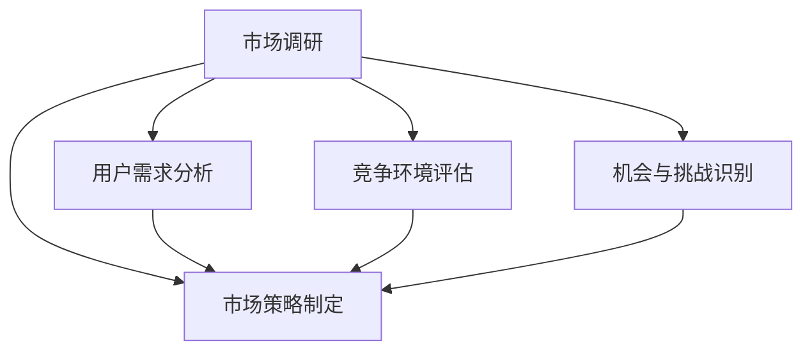
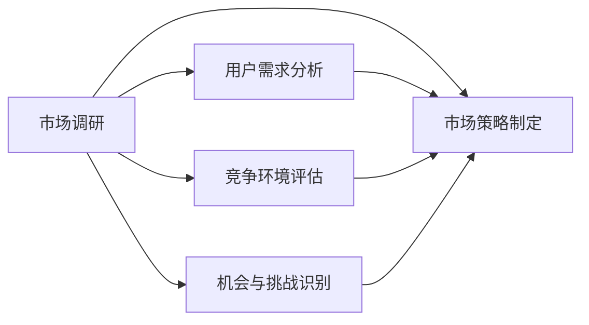
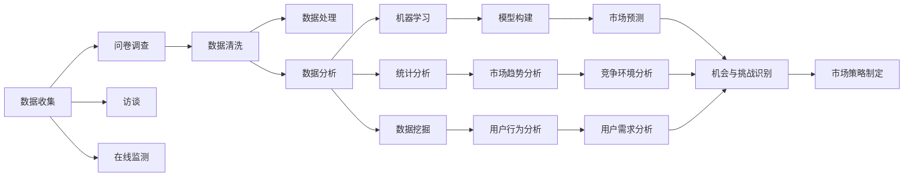

                 

# 市场调研：创业者的明灯

在数字化时代，市场调研已成为企业制定战略、优化产品、赢得竞争的关键。对于创业者而言，尤其是对于那些希望通过创新技术和商业模式改变世界的创业者，市场调研更是一盏指路的明灯。本文将深入探讨市场调研的原理、核心步骤、具体操作、实际应用场景及未来趋势，旨在为创业者提供系统而实用的指导。

## 1. 背景介绍

### 1.1 问题由来

随着互联网和技术的飞速发展，市场环境变得复杂多变，用户需求日益个性化。对于创业者来说，如何在纷繁复杂的环境中寻找机会，制定合适的战略，直接关系到创业项目的成败。市场调研作为获取市场信息、理解用户需求、分析竞争环境的重要工具，对于创业者而言变得尤为重要。

### 1.2 问题核心关键点

市场调研的核心在于收集、分析和解读市场数据，以形成对市场现状、趋势和机会的深刻理解。这不仅需要扎实的市场知识基础，还需要利用数据分析工具和技术，高效地处理和利用大量信息。核心关键点包括：

- 目标市场的识别与定义
- 用户需求与行为分析
- 竞争环境评估
- 机会与挑战识别
- 市场策略制定与调整

### 1.3 问题研究意义

市场调研对于创业者具有重要意义，主要体现在以下几个方面：

1. **指导产品设计**：帮助创业者根据市场需求设计出符合用户期望的产品。
2. **优化市场定位**：明确产品定位，制定市场进入策略。
3. **风险评估与规避**：通过分析市场环境，提前识别潜在风险，制定应对措施。
4. **提升营销效果**：帮助制定有效的市场推广策略，提高品牌知名度和市场占有率。
5. **数据驱动决策**：以数据为基础，减少决策的盲目性和主观性，提高决策科学性。

## 2. 核心概念与联系

### 2.1 核心概念概述

市场调研是一个复杂的过程，涉及多个核心概念。下面分别介绍这些概念，并说明它们之间的联系。

- **市场调研**：通过收集和分析市场数据，理解市场现状、趋势和用户需求，为制定市场策略提供依据。
- **用户需求分析**：研究用户行为、偏好、痛点等，以便设计满足用户需求的产品。
- **竞争环境评估**：分析竞争对手的优势和劣势，识别市场中的竞争格局。
- **机会与挑战识别**：挖掘市场机会，分析潜在的风险和挑战。
- **市场策略制定**：根据调研结果，制定合适的市场进入和推广策略。

这些概念之间的关系如图2所示：



### 2.2 核心概念原理和架构的 Mermaid 流程图



### 2.3 核心概念联系

市场调研的各个核心概念紧密相连，形成一个系统化的调研框架。用户需求分析为产品设计提供指导，竞争环境评估帮助识别市场机会和风险，机会与挑战识别为策略制定提供依据。市场策略制定综合考虑各个环节，确保最终策略的科学性和可操作性。

## 3. 核心算法原理 & 具体操作步骤

### 3.1 算法原理概述

市场调研的算法原理主要基于统计学、数据分析和机器学习等方法，通过对市场数据进行收集、清洗、分析和解读，形成对市场现状、趋势和机会的深刻理解。其核心算法包括：

- 数据收集：通过问卷调查、访谈、在线监测等多种方式收集数据。
- 数据清洗：处理缺失数据、异常值，确保数据质量。
- 数据分析：使用统计学、数据挖掘和机器学习技术，进行数据建模和分析。
- 数据解读：将分析结果转化为可操作的见解和建议。

### 3.2 算法步骤详解

市场调研的具体操作步骤如图3所示：



### 3.3 算法优缺点

市场调研的算法具有以下优点：

- **全面性**：通过多种数据收集方式，确保数据的全面性和代表性。
- **科学性**：利用数据分析和机器学习技术，提高分析的准确性和可靠性。
- **灵活性**：根据具体情况，选择合适的方法和技术。

但同时也有缺点：

- **成本高**：数据收集、清洗和分析成本较高。
- **时间消耗大**：调研周期较长，影响项目进度。
- **数据准确性问题**：数据收集和处理方法不当，可能影响分析结果的准确性。

### 3.4 算法应用领域

市场调研广泛应用于多个领域，包括但不限于：

- **新市场进入**：帮助企业识别新市场机会，制定市场进入策略。
- **产品优化**：了解用户需求，指导产品设计，提升用户体验。
- **营销策略制定**：分析市场趋势，制定有效的营销方案。
- **风险管理**：识别潜在风险，制定应对措施。
- **竞争分析**：了解竞争对手，制定竞争策略。

## 4. 数学模型和公式 & 详细讲解

### 4.1 数学模型构建

市场调研的数学模型通常基于以下基本假设：

- **市场均衡假设**：市场供需关系是平衡的。
- **用户理性假设**：用户行为是理性的，基于最大化自身利益。
- **竞争公平假设**：市场竞争是公平的。

基于这些假设，构建的数学模型主要包括：

- **线性回归模型**：用于分析市场趋势，预测未来需求。
- **用户行为模型**：分析用户行为数据，挖掘用户偏好和需求。
- **竞争模型**：分析竞争对手的市场份额和策略，评估竞争环境。

### 4.2 公式推导过程

以线性回归模型为例，其基本公式为：

$$ y = \beta_0 + \beta_1 x + \epsilon $$

其中，$y$ 为因变量，$x$ 为自变量，$\beta_0$ 和 $\beta_1$ 为模型参数，$\epsilon$ 为误差项。

### 4.3 案例分析与讲解

以某电商平台的市场调研为例，使用线性回归模型分析用户购买行为。假设收集到以下数据：

| 用户ID | 年龄 | 性别 | 购买金额 |
| --- | --- | --- | --- |
| 1 | 25 | M | 500 |
| 2 | 30 | F | 300 |
| 3 | 35 | M | 800 |
| ...

通过线性回归模型，可以得出购买金额与用户年龄之间的关系：

$$ y = 50 + 20x + \epsilon $$

其中，$y$ 为购买金额，$x$ 为用户年龄。

## 5. 项目实践：代码实例和详细解释说明

### 5.1 开发环境搭建

项目实践需要以下开发环境：

1. Python：作为主要编程语言。
2. Pandas：用于数据处理和分析。
3. NumPy：用于数学计算。
4. Matplotlib：用于数据可视化。
5. Scikit-learn：用于机器学习建模。

### 5.2 源代码详细实现

以下是一个简单的Python代码示例，用于进行市场调研分析：

```python
import pandas as pd
import numpy as np
import matplotlib.pyplot as plt
from sklearn.linear_model import LinearRegression

# 加载数据
data = pd.read_csv('market_data.csv')

# 数据清洗和处理
data = data.dropna()
X = data[['age']]
y = data['purchase_amount']

# 构建线性回归模型
model = LinearRegression()
model.fit(X, y)

# 预测
predicted_amount = model.predict([[35]])

# 可视化
plt.scatter(X, y)
plt.plot(X, model.predict(X), color='red')
plt.show()

print(f"预测购买金额：{predicted_amount}")
```

### 5.3 代码解读与分析

以上代码展示了线性回归模型的基本实现过程。首先，使用Pandas库加载数据，并进行清洗和处理，去除缺失值。然后，使用Scikit-learn库中的LinearRegression类构建线性回归模型，拟合训练数据。最后，使用模型进行预测，并使用Matplotlib库进行数据可视化。

## 6. 实际应用场景

### 6.1 智能推荐系统

智能推荐系统利用市场调研数据，分析用户行为和偏好，为用户提供个性化的推荐内容。通过调研用户的历史浏览记录、购买记录和社交网络信息，推荐系统能够精准地预测用户可能感兴趣的商品或服务。

### 6.2 产品迭代优化

在产品迭代优化过程中，市场调研数据可以帮助企业了解用户需求和反馈，指导产品设计改进。通过收集用户反馈、进行用户访谈和问卷调查，企业能够及时调整产品功能，提升用户体验。

### 6.3 市场扩展策略

市场调研数据可以帮助企业制定有效的市场扩展策略。通过分析市场规模、竞争格局和用户需求，企业能够确定最佳的扩展时机和方式，提高市场渗透率。

### 6.4 未来应用展望

未来，随着人工智能和大数据技术的进步，市场调研将更加智能化和自动化。以下是对未来应用展望：

- **AI驱动调研**：利用机器学习和自然语言处理技术，自动化数据收集和分析，提高效率和准确性。
- **实时市场监控**：通过实时数据分析，实时监控市场动态，及时调整策略。
- **多渠道数据融合**：整合线上线下数据，形成全面的市场视图。
- **跨领域应用**：将市场调研技术应用于更多领域，如医疗、教育等。

## 7. 工具和资源推荐

### 7.1 学习资源推荐

1. 《市场调研：理论与实践》：系统介绍市场调研的基本理论和方法。
2. 《Python数据科学手册》：介绍Python在数据科学和市场调研中的应用。
3. Coursera上的市场调研课程：提供系统化的市场调研知识和案例分析。
4. Kaggle竞赛：通过实际项目锻炼市场调研技能。

### 7.2 开发工具推荐

1. Python：Python是市场调研和数据分析的首选语言。
2. Pandas和NumPy：用于数据处理和计算。
3. Matplotlib和Seaborn：用于数据可视化。
4. Scikit-learn和TensorFlow：用于机器学习和深度学习。

### 7.3 相关论文推荐

1. "Market Research Methodologies: An Overview" by Johnson and Smith (2019)。
2. "Data Mining and Statistical Learning" by Hastie et al. (2009)。
3. "Market Research with Big Data: Challenges and Opportunities" by Brown et al. (2020)。

## 8. 总结：未来发展趋势与挑战

### 8.1 研究成果总结

本文系统介绍了市场调研的原理、核心步骤、具体操作步骤和实际应用场景。通过案例分析和代码实例，展示了市场调研的重要性和实际应用方法。

### 8.2 未来发展趋势

未来市场调研将更加智能化和自动化。AI技术和大数据将使市场调研更加高效和准确。同时，跨领域应用将成为新的趋势，市场调研技术将应用于更多领域。

### 8.3 面临的挑战

尽管市场调研具有重要意义，但在实施过程中仍面临以下挑战：

- **数据隐私和安全**：调研数据涉及大量敏感信息，如何保护数据隐私和安全是一个重要问题。
- **数据质量和完整性**：数据收集和处理过程中，如何确保数据的准确性和完整性，是一个关键问题。
- **跨文化差异**：在不同文化背景下，市场调研方法和模型需要适应不同的市场环境。

### 8.4 研究展望

未来市场调研研究需要进一步探索：

- **多模态数据融合**：将多种数据源和信息融合，形成更全面的市场视图。
- **数据隐私保护**：在确保数据隐私和安全的条件下，进行市场调研。
- **跨文化市场调研**：在不同文化背景下，制定合适的调研方法和模型。

## 9. 附录：常见问题与解答

**Q1: 市场调研的目的是什么？**

A: 市场调研的目的是通过收集、分析和解读市场数据，理解市场现状、趋势和用户需求，为制定市场策略提供依据。

**Q2: 市场调研的方法有哪些？**

A: 市场调研的方法包括问卷调查、访谈、焦点小组、在线监测等。不同方法适用于不同的调研目的和对象。

**Q3: 市场调研的流程是什么？**

A: 市场调研的流程包括数据收集、数据清洗、数据分析和数据解读四个主要步骤。每个步骤都需要细致设计和执行。

**Q4: 市场调研的数据来源有哪些？**

A: 市场调研的数据来源包括市场研究报告、行业分析、社交媒体数据、销售数据等。需要根据具体调研目标选择合适的数据来源。

**Q5: 市场调研在企业决策中的作用是什么？**

A: 市场调研在企业决策中起到指导产品设计、优化营销策略、评估市场风险等重要作用，帮助企业制定科学决策。

---

作者：禅与计算机程序设计艺术 / Zen and the Art of Computer Programming

