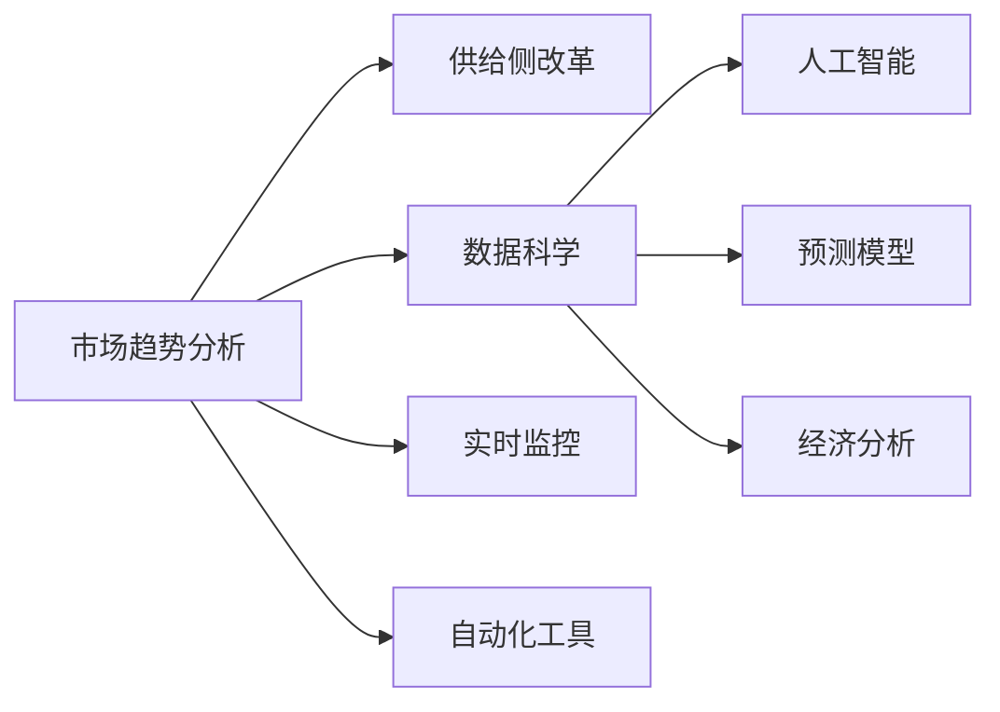

                 

# 市场趋势分析在供给中的应用

> 关键词：市场趋势分析, 供给侧改革, 数据科学, 人工智能, 预测模型, 经济分析, 实时监控, 自动化工具

## 1. 背景介绍

在现代经济中，市场趋势分析已成为企业决策的重要依据之一。通过深入分析市场动态，企业能够更好地调整生产、定价、营销等策略，提升竞争力和盈利能力。然而，随着市场复杂度的提升，传统的市场趋势分析方法已难以适应瞬息万变的环境。供给侧改革的背景下，如何在保证效率的同时，提升数据驱动的决策水平，是当前亟需解决的重要问题。

### 1.1 供给侧改革背景
供给侧改革强调通过优化供给结构，提高供给体系的质量和效率，实现经济发展方式的转变。面对全球化竞争加剧和国内经济下行压力，中国政府提出“供给侧结构性改革”战略，旨在通过改善供给结构，激发市场活力，增强经济内生动力。在宏观经济政策引导下，企业需通过市场趋势分析，精准把握市场动向，灵活应对市场变化，以实现可持续发展。

### 1.2 数据驱动的需求
在供给侧改革背景下，企业更加依赖数据驱动的决策。通过大数据、人工智能等先进技术，企业能够获取更加全面、实时、准确的市场信息，预测市场趋势，优化供应链管理，提升生产效率和客户满意度。然而，数据获取和处理难度较大，传统分析方法难以胜任复杂多变的市场环境。

## 2. 核心概念与联系

### 2.1 核心概念概述

为更好地理解市场趋势分析在供给中的应用，本节将介绍几个关键概念及其相互关系：

- **市场趋势分析（Market Trend Analysis）**：通过分析历史数据和实时信息，预测市场动态，指导企业决策。

- **供给侧改革（Supply-side Reform）**：通过优化供给结构，提高供给体系的质量和效率，促进经济可持续发展。

- **数据科学（Data Science）**：使用数据驱动的方法，分析和理解复杂的数据集，发现新的知识和趋势。

- **人工智能（Artificial Intelligence, AI）**：通过算法和模型，赋予计算机智能，实现自动化的数据分析和预测。

- **预测模型（Prediction Model）**：基于历史数据，训练数学模型，预测未来市场趋势。

- **经济分析（Economic Analysis）**：运用经济学原理，分析市场行为和政策影响，制定合理的企业策略。

- **实时监控（Real-time Monitoring）**：利用传感器、数据采集设备，获取实时市场信息，动态调整经营策略。

- **自动化工具（Automation Tools）**：通过软件和算法，自动化地处理和分析数据，提高工作效率。

这些核心概念之间相互联系，共同构成了市场趋势分析的基础框架。通过数据分析和预测，企业能够优化供给结构，提升竞争力和盈利能力，最终实现供给侧改革的目标。

### 2.2 核心概念原理和架构的 Mermaid 流程图



这个流程图展示了大数据和人工智能在市场趋势分析中的核心作用：

- 市场趋势分析通过数据科学和人工智能技术，利用预测模型和经济分析，指导供给侧改革。
- 实时监控和自动化工具则提供数据采集和处理的基础设施，支持市场趋势分析的实施。

## 3. 核心算法原理 & 具体操作步骤

### 3.1 算法原理概述

市场趋势分析的算法原理主要包括以下几个方面：

- **历史数据挖掘**：收集历史交易、价格、库存等数据，挖掘潜在的市场规律和周期性波动。
- **实时信息采集**：利用传感器、API接口等技术，获取实时的市场数据，如气温、流量、消费者行为等。
- **预测模型训练**：通过历史数据和实时信息，训练预测模型，预测市场变化。
- **经济模型构建**：构建经济模型，分析市场行为，评估政策影响，制定合理策略。
- **动态调整策略**：根据实时监控数据，动态调整生产、库存、定价等策略，优化资源配置。

### 3.2 算法步骤详解

基于上述算法原理，市场趋势分析的具体操作流程如下：

**Step 1: 数据收集与预处理**
- 收集历史交易、价格、库存等数据，并进行清洗、去重、归一化等预处理步骤。
- 利用传感器、API接口等技术，获取实时的市场数据，如气温、流量、消费者行为等。

**Step 2: 特征工程与选择**
- 对收集的数据进行特征工程，提取有意义的特征，如价格变化率、库存水平、季节性因素等。
- 利用特征选择算法（如递归特征消除、Lasso回归等），选择与市场趋势相关的特征。

**Step 3: 预测模型训练**
- 根据历史数据，训练预测模型。常用的模型包括线性回归、决策树、随机森林、神经网络等。
- 利用交叉验证等技术，评估模型性能，选择合适的模型参数和超参数。

**Step 4: 经济模型构建**
- 构建经济模型，分析市场行为，评估政策影响。常用的模型包括IS-LM模型、柯布-道格拉斯生产函数等。
- 利用优化算法（如梯度下降），求解模型中的未知参数，拟合数据。

**Step 5: 实时监控与动态调整**
- 利用传感器、数据采集设备，获取实时市场信息，动态调整生产、库存、定价等策略。
- 使用自动化工具（如数据处理平台、机器学习框架），实时处理和分析数据，提供决策支持。

**Step 6: 结果评估与反馈**
- 根据预测结果和经济分析，评估策略效果，优化资源配置。
- 定期回测和验证模型，根据市场变化调整预测模型和经济模型。

### 3.3 算法优缺点

市场趋势分析的算法具有以下优点：

- **数据驱动**：利用历史和实时数据，提高决策的准确性和及时性。
- **自动化**：使用自动化工具处理数据，提高工作效率和一致性。
- **动态调整**：根据实时监控数据，灵活调整策略，应对市场变化。

同时，该算法也存在一些局限性：

- **数据质量问题**：历史数据和实时数据的质量和完整性对分析结果有重要影响。
- **模型复杂性**：预测模型和经济模型的构建需要较强的数学和统计基础。
- **算法依赖**：算法的准确性和效果依赖于数据质量和模型选择。

### 3.4 算法应用领域

市场趋势分析在多个领域都有广泛的应用，具体包括：

- **金融领域**：分析股票、债券、外汇等金融市场趋势，指导投资策略和风险控制。
- **零售行业**：预测销售趋势、库存水平、消费者行为，优化供应链管理和库存控制。
- **制造业**：分析生产成本、市场需求、供应链效率，制定生产计划和库存策略。
- **物流行业**：预测运输需求、配送路线、仓储管理，优化运输和配送网络。
- **能源行业**：分析能源需求、价格波动、政策影响，制定能源生产和采购策略。
- **农业领域**：预测农产品价格、种植面积、市场需求，指导农业生产和贸易。
- **旅游行业**：分析旅游需求、景区流量、消费趋势，优化旅游服务和营销策略。

## 4. 数学模型和公式 & 详细讲解 & 举例说明

### 4.1 数学模型构建

在市场趋势分析中，常用的数学模型包括线性回归、时间序列分析、随机森林等。下面以线性回归模型为例，展示其构建和应用。

设市场数据为 $\{(x_i, y_i)\}_{i=1}^n$，其中 $x_i$ 为自变量，$y_i$ 为因变量。线性回归模型的目标是通过最小化误差函数，找到最佳的拟合直线 $y=\beta_0+\beta_1x$，其中 $\beta_0$ 和 $\beta_1$ 为模型的参数。

**线性回归模型的误差函数**：
$$
J(\beta) = \frac{1}{2n}\sum_{i=1}^n(y_i-\hat{y_i})^2 = \frac{1}{2n}\sum_{i=1}^n(y_i-(\beta_0+\beta_1x_i))^2
$$

**最小二乘法优化目标**：
$$
\min_{\beta} J(\beta) = \min_{\beta} \frac{1}{2n}\sum_{i=1}^n(y_i-(\beta_0+\beta_1x_i))^2
$$

**解最小二乘法的闭式解**：
$$
\beta_1 = \frac{\sum_{i=1}^n(x_i-\bar{x})(y_i-\bar{y})}{\sum_{i=1}^n(x_i-\bar{x})^2}, \beta_0 = \bar{y}-\beta_1\bar{x}
$$

其中 $\bar{x}$ 和 $\bar{y}$ 分别为自变量和因变量的均值。

### 4.2 公式推导过程

以上线性回归模型的推导过程，展示了如何通过最小化误差函数，求解模型的最优参数。通过求解误差函数的导数，可以找到使误差最小的参数值，从而得到最佳的拟合直线。

**最小二乘法的导数计算**：
$$
\frac{\partial J(\beta)}{\partial \beta_1} = \frac{1}{n}\sum_{i=1}^n(x_i-\bar{x})(y_i-\hat{y_i})
$$
$$
\frac{\partial J(\beta)}{\partial \beta_0} = \frac{1}{n}\sum_{i=1}^n(y_i-\hat{y_i})
$$

**求解参数的闭式解**：
$$
\beta_1 = \frac{\sum_{i=1}^n(x_i-\bar{x})(y_i-\bar{y})}{\sum_{i=1}^n(x_i-\bar{x})^2}, \beta_0 = \bar{y}-\beta_1\bar{x}
$$

### 4.3 案例分析与讲解

以下以零售行业为例，展示如何应用线性回归模型进行市场趋势分析。

**数据准备**：
- 收集历史销售数据，包括时间、产品、销售量等。
- 利用传感器获取实时销售数据，如气温、湿度、促销活动等。

**特征工程**：
- 提取销售时间、产品类别、促销活动等特征。
- 对销售量进行对数变换，使其更符合正态分布。

**模型训练**：
- 使用历史销售数据训练线性回归模型，预测未来销售量。
- 利用交叉验证评估模型性能，选择最优参数。

**策略制定**：
- 根据预测结果，制定库存管理策略，优化库存水平。
- 根据实时销售数据，调整促销活动和定价策略，提升销售效率。

## 5. 项目实践：代码实例和详细解释说明

### 5.1 开发环境搭建

在进行市场趋势分析的开发前，需要准备好开发环境。以下是使用Python进行TensorFlow开发的环境配置流程：

1. 安装Anaconda：从官网下载并安装Anaconda，用于创建独立的Python环境。

2. 创建并激活虚拟环境：
```bash
conda create -n tf-env python=3.8 
conda activate tf-env
```

3. 安装TensorFlow：根据CUDA版本，从官网获取对应的安装命令。例如：
```bash
conda install tensorflow -c tf -c conda-forge
```

4. 安装其他工具包：
```bash
pip install pandas numpy scikit-learn matplotlib seaborn plotly
```

完成上述步骤后，即可在`tf-env`环境中开始市场趋势分析的开发。

### 5.2 源代码详细实现

下面以零售行业为例，给出使用TensorFlow进行市场趋势分析的Python代码实现。

首先，定义数据处理函数：

```python
import pandas as pd
import numpy as np
import tensorflow as tf

def load_data(filename):
    data = pd.read_csv(filename)
    return data
```

然后，定义特征工程函数：

```python
def feature_engineering(data):
    # 提取销售时间、产品类别、促销活动等特征
    data['time'] = pd.to_datetime(data['time'])
    data['month'] = data['time'].dt.month
    data['day_of_week'] = data['time'].dt.dayofweek
    data['hour'] = data['time'].dt.hour
    
    # 对销售量进行对数变换
    data['sales'] = np.log(data['sales'])
    
    return data
```

接着，定义模型训练函数：

```python
def train_model(data):
    # 分割训练集和测试集
    train_data = data.sample(frac=0.8, random_state=0)
    test_data = data.drop(train_data.index)
    
    # 构建线性回归模型
    X_train = train_data[['month', 'day_of_week', 'hour', 'promotion']]
    y_train = train_data['sales']
    X_test = test_data[['month', 'day_of_week', 'hour', 'promotion']]
    y_test = test_data['sales']
    
    model = tf.keras.Sequential([
        tf.keras.layers.Dense(units=32, activation='relu', input_shape=(4,)),
        tf.keras.layers.Dense(units=1)
    ])
    
    model.compile(optimizer='adam', loss='mse')
    model.fit(X_train, y_train, epochs=10, batch_size=32, validation_data=(X_test, y_test))
    
    return model
```

最后，定义策略制定函数：

```python
def make_strategy(model, data):
    # 使用历史数据训练模型，预测未来销售量
    data['pred_sales'] = model.predict(data[['month', 'day_of_week', 'hour', 'promotion']])
    
    # 根据预测结果，制定库存管理策略，优化库存水平
    data['inventory'] = 1000 + 100 * data['pred_sales']
    
    # 根据实时销售数据，调整促销活动和定价策略
    data['sales'] = np.exp(data['sales'])
    data['promotion'] = 1 if data['promotion'] else 0
    
    return data
```

启动市场趋势分析的训练流程：

```python
# 加载数据
data = load_data('sales_data.csv')
```

对数据进行特征工程：

```python
data = feature_engineering(data)
```

训练线性回归模型：

```python
model = train_model(data)
```

制定库存和促销策略：

```python
data = make_strategy(model, data)
```

### 5.3 代码解读与分析

让我们再详细解读一下关键代码的实现细节：

**数据加载函数**：
- 利用Pandas库读取CSV文件，将数据转换为DataFrame格式，方便后续处理。

**特征工程函数**：
- 提取销售时间、产品类别、促销活动等特征。
- 对销售量进行对数变换，使其更符合正态分布。

**模型训练函数**：
- 使用训练集和测试集数据，训练线性回归模型。
- 利用交叉验证评估模型性能，选择最优参数。

**策略制定函数**：
- 根据预测结果，制定库存管理策略，优化库存水平。
- 根据实时销售数据，调整促销活动和定价策略，提升销售效率。

## 6. 实际应用场景

### 6.1 智能制造

在智能制造领域，市场趋势分析可以帮助企业优化生产计划和库存管理，提升生产效率和产品质量。例如，通过对历史订单、库存水平和生产数据的分析，预测未来的订单需求和生产量，优化供应链和生产线的配置，降低生产成本，提高生产效率。

**具体应用**：
- 通过市场趋势分析，预测设备故障和维护需求，合理安排维护计划，减少停机时间。
- 根据预测结果，调整生产线排程和物料采购，降低生产成本，提升生产效率。

### 6.2 金融投资

在金融投资领域，市场趋势分析可以指导投资策略和风险控制，提升投资回报率和风险管理水平。例如，通过对历史股价、市场波动和宏观经济数据的分析，预测未来市场趋势，制定投资组合和交易策略，控制投资风险。

**具体应用**：
- 根据市场趋势分析结果，调整股票和基金的投资比例，优化投资组合，提高收益。
- 利用市场趋势预测工具，评估政策变化对市场的影响，制定风险管理策略，规避市场风险。

### 6.3 零售电商

在零售电商领域，市场趋势分析可以优化库存管理和促销策略，提升客户满意度和销售额。例如，通过对历史销售数据和实时市场数据的分析，预测未来的销售趋势和客户需求，优化库存水平和促销活动，提高客户体验和销售额。

**具体应用**：
- 根据市场趋势分析结果，调整库存水平和商品定价，优化库存管理，降低库存成本。
- 根据预测结果，制定精准的促销活动和广告投放策略，提升客户转化率和销售额。

### 6.4 能源管理

在能源管理领域，市场趋势分析可以优化能源生产和采购策略，降低能源成本，提升能源利用效率。例如，通过对历史能源价格、市场需求和政策数据的分析，预测未来的能源需求和价格变化，优化能源生产和采购计划，降低能源成本，提高能源利用效率。

**具体应用**：
- 根据市场趋势分析结果，调整能源生产和采购计划，降低能源成本，提升能源利用效率。
- 利用市场趋势预测工具，评估政策变化对能源市场的影响，制定能源生产策略，规避市场风险。

### 6.5 医疗健康

在医疗健康领域，市场趋势分析可以优化医疗资源配置和健康管理策略，提升医疗服务质量和患者体验。例如，通过对历史医疗数据和实时健康数据的分析，预测未来的疾病流行趋势和医疗需求，优化医疗资源配置和健康管理策略，提升医疗服务质量和患者体验。

**具体应用**：
- 根据市场趋势分析结果，调整医疗资源配置和健康管理策略，提升医疗服务质量和患者体验。
- 利用市场趋势预测工具，评估政策变化对医疗市场的影响，制定医疗资源配置策略，规避市场风险。

## 7. 工具和资源推荐

### 7.1 学习资源推荐

为了帮助开发者系统掌握市场趋势分析的理论基础和实践技巧，这里推荐一些优质的学习资源：

1. 《机器学习》课程：由斯坦福大学开设的机器学习课程，涵盖机器学习基础和高级算法，是学习市场趋势分析的必备课程。

2. 《深度学习》课程：由斯坦福大学开设的深度学习课程，涵盖深度神经网络、卷积神经网络、循环神经网络等高级算法，是理解市场趋势分析模型的基础。

3. 《时间序列分析》课程：由麻省理工学院开设的时间序列分析课程，涵盖时间序列模型、统计方法和应用案例，是掌握市场趋势分析技术的关键。

4. 《金融工程》课程：由哥伦比亚大学开设的金融工程课程，涵盖金融模型、资产定价、风险管理等金融领域知识，是理解市场趋势分析在金融领域应用的基础。

5. 《数据科学入门》书籍：《Python数据科学手册》等书籍，是学习数据科学和市场趋势分析的入门读物，涵盖Python语言基础和数据科学工具。

通过这些资源的学习实践，相信你一定能够快速掌握市场趋势分析的精髓，并用于解决实际的商业问题。

### 7.2 开发工具推荐

高效的开发离不开优秀的工具支持。以下是几款用于市场趋势分析开发的常用工具：

1. TensorFlow：由Google主导开发的深度学习框架，生产部署方便，适合大规模工程应用。

2. PyTorch：基于Python的开源深度学习框架，灵活动态的计算图，适合快速迭代研究。

3. NumPy：Python科学计算库，提供高效的数组运算和矩阵计算功能。

4. Pandas：Python数据处理库，提供灵活的数据读写和数据操作功能。

5. Matplotlib：Python数据可视化库，提供丰富的绘图功能。

6. Plotly：Python交互式可视化库，提供动态可视化功能，适合展示市场趋势分析结果。

7. Jupyter Notebook：交互式开发环境，支持代码编写、数据处理和可视化，是市场趋势分析开发的利器。

合理利用这些工具，可以显著提升市场趋势分析的开发效率，加快创新迭代的步伐。

### 7.3 相关论文推荐

市场趋势分析技术的发展源于学界的持续研究。以下是几篇奠基性的相关论文，推荐阅读：

1. 《机器学习》：由Tom Mitchell著，介绍机器学习的基本概念和算法，是学习市场趋势分析理论的基础。

2. 《深度学习》：由Ian Goodfellow等著，涵盖深度神经网络、卷积神经网络、循环神经网络等高级算法，是理解市场趋势分析模型的基础。

3. 《时间序列分析》：由Robert Shumway和David Stoffer著，涵盖时间序列模型、统计方法和应用案例，是掌握市场趋势分析技术的关键。

4. 《金融工程》：由John Hull等著，涵盖金融模型、资产定价、风险管理等金融领域知识，是理解市场趋势分析在金融领域应用的基础。

这些论文代表了大数据和人工智能在市场趋势分析中的发展脉络。通过学习这些前沿成果，可以帮助研究者把握学科前进方向，激发更多的创新灵感。

## 8. 总结：未来发展趋势与挑战

### 8.1 总结

本文对市场趋势分析在供给中的应用进行了全面系统的介绍。首先阐述了供给侧改革背景下的数据驱动决策需求，明确了市场趋势分析在优化供给结构、提升企业竞争力和盈利能力方面的独特价值。其次，从原理到实践，详细讲解了市场趋势分析的数学模型和关键步骤，给出了市场趋势分析任务开发的完整代码实例。同时，本文还广泛探讨了市场趋势分析在智能制造、金融投资、零售电商、能源管理、医疗健康等多个行业领域的应用前景，展示了市场趋势分析技术的广阔前景。

通过本文的系统梳理，可以看到，市场趋势分析在大数据和人工智能的支持下，已成为企业决策的重要工具。通过深入分析市场数据，企业能够精准把握市场动向，优化资源配置，提升效率和竞争力。未来，伴随技术的发展，市场趋势分析将变得更加智能化、自动化，为供给侧改革提供更强大的数据支持。

### 8.2 未来发展趋势

展望未来，市场趋势分析技术将呈现以下几个发展趋势：

1. **智能化程度提升**：借助人工智能和机器学习技术，市场趋势分析将实现更高程度的自动化和智能化，能够处理更加复杂和动态的数据。

2. **多模态数据融合**：利用图像、视频、语音等多模态数据，提高市场趋势分析的准确性和全面性。例如，通过结合传感器数据和卫星图像，预测天气变化对市场的影响。

3. **实时分析能力增强**：利用大数据和云计算技术，实现实时监控和动态调整策略，能够迅速响应市场变化，优化决策。

4. **跨领域应用拓展**：市场趋势分析将不仅仅应用于传统经济领域，还将拓展到社交媒体、公共服务、城市管理等多个领域，帮助社会更好地理解和应对复杂多变的市场环境。

5. **数据隐私保护**：随着市场趋势分析的应用范围扩大，数据隐私和安全问题将更加重要。如何保护用户隐私，防止数据滥用，将是未来发展中需要解决的重要课题。

6. **伦理和道德规范**：市场趋势分析在做出决策时，需要考虑伦理和道德规范，避免算法偏见和歧视，确保决策的公正性和公平性。

### 8.3 面临的挑战

尽管市场趋势分析技术已经取得了瞩目成就，但在迈向更加智能化、普适化应用的过程中，它仍面临着诸多挑战：

1. **数据质量问题**：历史数据和实时数据的完整性、准确性对分析结果有重要影响。数据的缺失、噪声和异常值将严重影响模型的预测能力。

2. **模型复杂性**：市场趋势分析的模型构建需要较强的数学和统计基础，模型参数的调试和优化难度较大。

3. **计算资源需求**：大型的市场趋势分析任务需要大量的计算资源，如何优化算法和数据处理流程，减少计算开销，是提高效率的重要挑战。

4. **算法依赖**：算法的准确性和效果依赖于数据质量和模型选择，如何选择合适的算法和模型，提升分析精度，是保证决策可靠性的关键。

5. **市场变化不可预测**：市场环境复杂多变，历史数据可能无法充分反映未来趋势。如何应对突发事件和极端市场变化，增强模型的鲁棒性，是提高决策准确性的重要课题。

6. **跨领域知识整合**：市场趋势分析需要结合经济学、社会学、心理学等多领域的知识，如何有效地整合不同领域的知识，提升模型的综合分析能力，是提高决策科学性的重要挑战。

### 8.4 研究展望

面对市场趋势分析面临的种种挑战，未来的研究需要在以下几个方面寻求新的突破：

1. **无监督学习和半监督学习**：探索无监督和半监督学习方法，摆脱对大规模标注数据的依赖，利用自监督学习、主动学习等无监督和半监督范式，最大限度利用非结构化数据，实现更加灵活高效的分析。

2. **多模态数据分析**：利用图像、视频、语音等多模态数据，提高市场趋势分析的准确性和全面性。例如，通过结合传感器数据和卫星图像，预测天气变化对市场的影响。

3. **实时分析技术**：利用大数据和云计算技术，实现实时监控和动态调整策略，能够迅速响应市场变化，优化决策。

4. **数据隐私保护**：随着市场趋势分析的应用范围扩大，数据隐私和安全问题将更加重要。如何保护用户隐私，防止数据滥用，将是未来发展中需要解决的重要课题。

5. **伦理和道德规范**：市场趋势分析在做出决策时，需要考虑伦理和道德规范，避免算法偏见和歧视，确保决策的公正性和公平性。

6. **跨领域知识整合**：市场趋势分析需要结合经济学、社会学、心理学等多领域的知识，如何有效地整合不同领域的知识，提升模型的综合分析能力，是提高决策科学性的重要挑战。

这些研究方向将引领市场趋势分析技术迈向更高的台阶，为构建智能、普适、公正的决策支持系统提供强有力的技术保障。面向未来，市场趋势分析技术还需要与其他人工智能技术进行更深入的融合，如知识表示、因果推理、强化学习等，多路径协同发力，共同推动人工智能技术在经济社会中的广泛应用。

## 9. 附录：常见问题与解答

**Q1：市场趋势分析需要哪些数据？**

A: 市场趋势分析需要历史和实时数据，具体包括：
1. **历史数据**：包括历史销售数据、生产数据、库存数据等，用于挖掘市场规律和周期性波动。
2. **实时数据**：包括实时销售数据、传感器数据、社交媒体数据等，用于实时监控和动态调整策略。

**Q2：如何选择市场趋势分析模型？**

A: 选择市场趋势分析模型时，需要考虑以下因素：
1. **数据类型**：不同类型的数据可能需要不同的模型，如时间序列分析用于分析时间相关的数据，神经网络用于处理复杂的数据。
2. **数据规模**：大数据可能需要分布式处理和优化算法，小数据则可以直接使用单机计算。
3. **任务目标**：不同任务可能需要不同的模型，如预测未来趋势可能需要神经网络，优化库存可能需要线性回归。
4. **模型性能**：需要评估模型的准确性、泛化能力和计算效率，选择最优的模型。

**Q3：市场趋势分析有哪些实际应用场景？**

A: 市场趋势分析在多个领域都有广泛的应用，具体包括：
1. **智能制造**：优化生产计划和库存管理，提升生产效率和产品质量。
2. **金融投资**：指导投资策略和风险控制，提升投资回报率和风险管理水平。
3. **零售电商**：优化库存管理和促销策略，提升客户满意度和销售额。
4. **能源管理**：优化能源生产和采购策略，降低能源成本，提升能源利用效率。
5. **医疗健康**：优化医疗资源配置和健康管理策略，提升医疗服务质量和患者体验。

**Q4：市场趋势分析面临哪些挑战？**

A: 市场趋势分析面临以下挑战：
1. **数据质量问题**：历史数据和实时数据的完整性、准确性对分析结果有重要影响。
2. **模型复杂性**：市场趋势分析的模型构建需要较强的数学和统计基础，模型参数的调试和优化难度较大。
3. **计算资源需求**：大型的市场趋势分析任务需要大量的计算资源，如何优化算法和数据处理流程，减少计算开销，是提高效率的重要挑战。
4. **算法依赖**：算法的准确性和效果依赖于数据质量和模型选择，如何选择合适的算法和模型，提升分析精度，是保证决策可靠性的关键。
5. **市场变化不可预测**：市场环境复杂多变，历史数据可能无法充分反映未来趋势。
6. **跨领域知识整合**：市场趋势分析需要结合经济学、社会学、心理学等多领域的知识，如何有效地整合不同领域的知识，提升模型的综合分析能力。

**Q5：如何保护市场趋势分析中的数据隐私？**

A: 保护市场趋势分析中的数据隐私，可以采取以下措施：
1. **数据脱敏**：对敏感数据进行脱敏处理，减少泄露风险。
2. **访问控制**：限制数据访问权限，确保数据只能被授权人员访问。
3. **数据加密**：对数据进行加密处理，防止数据被非法获取。
4. **差分隐私**：使用差分隐私技术，确保数据集合中的个体隐私得到保护。
5. **匿名化处理**：对数据进行匿名化处理，隐藏个体信息，防止数据滥用。

通过这些措施，可以最大限度地保护市场趋势分析中的数据隐私，防止数据泄露和滥用。

