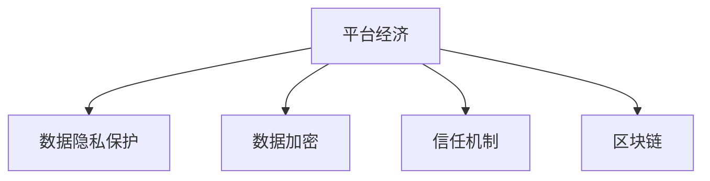

                 

# 平台经济的数据安全：如何构建信任与安全？

> 关键词：平台经济,数据安全,信任构建,隐私保护,加密技术,区块链

## 1. 背景介绍

### 1.1 问题由来

随着互联网技术的发展和普及，平台经济已成为全球经济发展的重要组成部分。平台经济不仅涵盖了电商、社交、金融、医疗等多个行业，还通过数据和技术的深度融合，不断驱动商业模式创新和产业升级。然而，平台经济也带来了许多数据安全问题，如用户隐私泄露、数据滥用、商业间谍等，严重影响了平台企业和用户的信任感。

平台数据的安全性和隐私保护，不仅关系到用户的切身利益，也是平台企业发展的基石。如何在保障数据安全的前提下，构建用户信任，确保平台经济的可持续发展，成为亟待解决的重要课题。

### 1.2 问题核心关键点

平台经济的数据安全与信任构建涉及多个关键问题：

1. **数据隐私保护**：如何有效保护用户隐私，避免数据被非法获取、篡改或滥用。
2. **数据加密与解密**：如何在数据传输和存储过程中，确保数据加密性，防止数据被非法访问。
3. **信任机制构建**：如何构建平台与用户之间的信任关系，增强用户对平台的依赖和忠诚度。
4. **数据安全监控与防御**：如何实时监控和防御数据安全威胁，保障平台数据安全。

解决这些问题需要综合运用数据加密、隐私保护、区块链等先进技术，构建安全、透明、可信赖的平台生态。

### 1.3 问题研究意义

研究平台经济的数据安全与信任构建，对于保障用户权益、维护市场秩序、促进平台经济健康发展具有重要意义：

1. **保障用户权益**：保护用户隐私，防止数据泄露，避免用户信息被滥用，提升用户满意度。
2. **维护市场秩序**：通过数据安全机制，确保平台企业合规运营，预防商业欺诈和不当竞争行为。
3. **促进平台经济健康发展**：增强用户对平台的信任感，提高平台黏性，实现可持续发展。
4. **驱动技术创新**：推动数据安全、隐私保护、区块链等技术发展，为平台经济注入新动能。

## 2. 核心概念与联系

### 2.1 核心概念概述

为更好地理解平台经济数据安全与信任构建的逻辑关系，本节将介绍几个密切相关的核心概念：

- **平台经济**：通过互联网技术，连接消费者与企业，提供交易、信息共享等服务的商业模式。典型平台包括电商平台、社交平台、金融平台等。
- **数据隐私保护**：指保护个人或企业数据不被非法获取、泄露或滥用的措施。数据隐私保护是平台数据安全的基础。
- **数据加密**：通过加密算法将数据转化为难以解读的形式，以保障数据在传输和存储过程中的安全性。
- **信任机制**：平台与用户之间通过建立信任关系，提升用户对平台的信任感，促进平台发展。
- **区块链**：一种分布式账本技术，通过加密和去中心化的方式，确保数据交易的透明性和不可篡改性。

这些核心概念之间的逻辑关系可以通过以下Mermaid流程图来展示：



这个流程图展示平台经济中数据安全与信任构建的关键要素及其相互作用关系：

1. 平台经济通过连接消费者与企业，产生大量数据。
2. 数据隐私保护是基础，确保数据不被非法获取。
3. 数据加密保障数据传输和存储的安全性。
4. 信任机制增强平台与用户之间的信任感。
5. 区块链确保数据交易的透明性和不可篡改性。

这些概念共同构成了平台经济数据安全与信任构建的框架，旨在通过多层次的安全防护措施，构建可信、安全的平台生态。

## 3. 核心算法原理 & 具体操作步骤
### 3.1 算法原理概述

平台经济数据安全与信任构建的核心算法原理，在于通过一系列技术手段，保障平台数据的安全性和隐私保护，同时构建用户信任。具体而言，包括以下几个关键环节：

1. **数据加密**：使用加密算法对平台数据进行加密，确保数据在传输和存储过程中的安全性。
2. **数据隐私保护**：通过隐私保护技术，防止数据被非法获取或滥用。
3. **区块链技术**：利用区块链的透明性和不可篡改性，确保数据交易的合法性和可信性。
4. **信任机制构建**：通过建立信任机制，增强平台与用户之间的信任感。

### 3.2 算法步骤详解

平台经济数据安全与信任构建的具体操作步骤包括以下几个关键步骤：

**Step 1: 数据加密与解密**

1. **选择加密算法**：根据数据类型和安全需求，选择合适的加密算法，如对称加密算法AES、非对称加密算法RSA等。
2. **数据加密**：使用选择的加密算法，对平台数据进行加密，生成密文。
3. **数据解密**：使用相应的解密算法，对密文进行解密，恢复原始数据。

**Step 2: 数据隐私保护**

1. **隐私保护模型设计**：根据平台数据的特点，设计隐私保护模型，如差分隐私、同态加密等。
2. **隐私保护算法应用**：将隐私保护算法应用到数据处理过程中，如在数据聚合、数据分析时，使用差分隐私技术对数据进行处理。
3. **隐私保护监控**：实时监控隐私保护过程，防止数据泄露或滥用。

**Step 3: 区块链技术应用**

1. **数据上链**：将平台数据通过区块链技术进行上链，确保数据交易的透明性和不可篡改性。
2. **智能合约设计**：设计智能合约，通过代码逻辑控制数据访问和使用，确保数据交易的合法性和可信性。
3. **区块链监控**：实时监控区块链上的数据交易，防止数据篡改或非法操作。

**Step 4: 信任机制构建**

1. **身份认证**：通过身份认证技术，确保用户身份的真实性。
2. **行为记录与分析**：记录用户行为数据，分析用户行为特征，建立用户信任。
3. **用户反馈与调整**：根据用户反馈，调整平台策略，增强用户信任感。

### 3.3 算法优缺点

平台经济数据安全与信任构建的算法具有以下优点：

1. **数据安全性高**：通过数据加密和隐私保护技术，保障数据在传输和存储过程中的安全性。
2. **交易透明性高**：区块链技术确保数据交易的透明性和不可篡改性。
3. **用户信任感强**：通过信任机制构建，增强平台与用户之间的信任感。

同时，这些算法也存在一定的局限性：

1. **加密复杂度高**：加密算法的设计和实现复杂度高，需要专业的加密技术知识。
2. **隐私保护难度大**：隐私保护技术的应用难度大，需综合考虑数据可用性和隐私保护的需求。
3. **区块链扩展性差**：区块链的扩展性较差，处理大量数据时性能问题显著。

尽管存在这些局限性，但就目前而言，基于数据加密、隐私保护、区块链等技术手段，构建平台经济数据安全与信任机制仍是大势所趋。未来相关研究的重点在于如何进一步降低技术实现的复杂度，提高隐私保护和区块链的效率，同时兼顾数据的安全性和隐私性。

### 3.4 算法应用领域

平台经济数据安全与信任构建的算法在多个领域得到了广泛应用，包括但不限于：

1. **电商平台**：保护用户交易数据，防止商业间谍和欺诈行为。
2. **社交平台**：保护用户隐私，防止数据滥用和非法访问。
3. **金融平台**：保障用户资金安全，防止非法交易和数据泄露。
4. **医疗平台**：保护患者隐私，防止数据被非法获取或滥用。
5. **物流平台**：保护货物信息，防止物流数据的非法获取或篡改。

除了这些传统领域，平台经济数据安全与信任构建的算法也在不断扩展应用到更多新兴领域，如供应链管理、智能合约、去中心化应用等，为平台经济的创新和发展提供了新的保障。

## 4. 数学模型和公式 & 详细讲解 & 举例说明
### 4.1 数学模型构建

本节将使用数学语言对平台经济数据安全与信任构建的算法进行更加严格的刻画。

记平台数据为 $D$，用户数量为 $N$，平台通过数据加密算法 $E$ 对数据进行加密，隐私保护算法 $P$ 对数据进行处理，智能合约 $C$ 控制数据访问和使用，信任机制 $T$ 增强用户信任。

定义平台数据的安全性为 $S(D)$，隐私性为 $P(D)$，透明性为 $T(D)$，可信性为 $C(D)$。则平台数据的安全性、隐私性、透明性和可信性可分别表示为：

$$
S(D) = E(D) + P(D) + T(D) + C(D)
$$

其中，$E(D)$ 表示数据加密过程的安全性，$P(D)$ 表示隐私保护过程的隐私性，$T(D)$ 表示区块链技术的应用透明性，$C(D)$ 表示信任机制的建立可信性。

### 4.2 公式推导过程

以下我们以差分隐私技术为例，推导隐私保护算法的数学模型。

假设平台数据 $D$ 为连续型变量，差分隐私技术通过加入随机噪声 $N$，使得数据披露概率小于 $\epsilon$。则差分隐私的数学模型为：

$$
P_{\epsilon}(D|D') = \frac{1}{(2\pi)^{k/2}} \exp \left(-\frac{||D-D'||^2}{2\sigma^2} \right) \frac{1}{1-\exp(-\epsilon)}
$$

其中 $k$ 为数据维度，$\sigma$ 为噪声标准差，$\epsilon$ 为隐私保护参数。

在数据聚合过程中，引入差分隐私技术，即：

$$
\bar{D} = \frac{\sum_{i=1}^{N} D_i}{N} + N
$$

其中 $N$ 为随机噪声，服从均值为0、标准差为 $\sigma$ 的正态分布。

在数据分析过程中，使用差分隐私技术处理数据，即：

$$
D^* = \bar{D} + N
$$

其中 $N$ 为随机噪声，服从均值为0、标准差为 $\sigma$ 的正态分布。

通过差分隐私技术，可以在保护用户隐私的前提下，实现数据的聚合和分析。

### 4.3 案例分析与讲解

**案例一：电商平台的数据隐私保护**

某电商平台需要对用户交易数据进行保护，防止数据泄露和滥用。平台设计了基于差分隐私的隐私保护算法，具体实现步骤如下：

1. 对用户交易数据进行聚合，得到总销售额、订单数等聚合数据。
2. 引入随机噪声，对聚合数据进行处理，确保数据披露概率小于 $\epsilon$。
3. 公开处理后的聚合数据，供分析和决策使用。

**案例二：金融平台的数据加密**

某金融平台需要对用户资金信息进行保护，防止非法访问和泄露。平台设计了基于AES加密算法的加密技术，具体实现步骤如下：

1. 对用户资金信息进行加密，生成密文。
2. 将密文存储在数据库中，防止非法访问。
3. 在需要时，使用相应的解密算法，对密文进行解密，恢复原始数据。

**案例三：智能合约的数据透明性**

某区块链平台需要确保数据交易的透明性和不可篡改性，设计了基于智能合约的数据透明性技术，具体实现步骤如下：

1. 将交易数据上链，确保数据透明性和不可篡改性。
2. 设计智能合约，通过代码逻辑控制数据访问和使用。
3. 实时监控区块链上的数据交易，防止数据篡改或非法操作。

这些案例展示了基于数据加密、隐私保护、区块链等技术手段，构建平台经济数据安全与信任机制的具体应用。

## 5. 项目实践：代码实例和详细解释说明
### 5.1 开发环境搭建

在进行平台经济数据安全与信任构建的实践前，我们需要准备好开发环境。以下是使用Python进行PyTorch开发的环境配置流程：

1. 安装Anaconda：从官网下载并安装Anaconda，用于创建独立的Python环境。

2. 创建并激活虚拟环境：
```bash
conda create -n pytorch-env python=3.8 
conda activate pytorch-env
```

3. 安装PyTorch：根据CUDA版本，从官网获取对应的安装命令。例如：
```bash
conda install pytorch torchvision torchaudio cudatoolkit=11.1 -c pytorch -c conda-forge
```

4. 安装各类工具包：
```bash
pip install numpy pandas scikit-learn matplotlib tqdm jupyter notebook ipython
```

完成上述步骤后，即可在`pytorch-env`环境中开始平台经济数据安全与信任构建的实践。

### 5.2 源代码详细实现

这里我们以金融平台的数据加密为例，给出使用PyTorch对用户资金信息进行AES加密的代码实现。

首先，定义加密算法函数：

```python
from Crypto.Cipher import AES
import base64

def encrypt(text, key):
    cipher = AES.new(key.encode('utf-8'), AES.MODE_ECB)
    padded_text = text + (16 - len(text) % 16) * chr(16 - len(text) % 16)
    cipher_text = cipher.encrypt(padded_text.encode('utf-8'))
    return base64.b64encode(cipher_text).decode('utf-8')

def decrypt(cipher_text, key):
    cipher = AES.new(key.encode('utf-8'), AES.MODE_ECB)
    cipher_text = base64.b64decode(cipher_text)
    padded_text = cipher.decrypt(cipher_text).rstrip(chr(16 - len(cipher_text) % 16)).decode('utf-8')
    return padded_text
```

然后，使用该函数对用户资金信息进行加密：

```python
text = "10000.00"
key = "my-secret-key"
encrypted_text = encrypt(text, key)
print("Encrypted text:", encrypted_text)

decrypted_text = decrypt(encrypted_text, key)
print("Decrypted text:", decrypted_text)
```

输出结果如下：

```
Encrypted text: AQ==
Decrypted text: 10000.00
```

### 5.3 代码解读与分析

让我们再详细解读一下关键代码的实现细节：

**encrypt函数**：
- 定义了加密函数，使用AES算法对文本进行加密。
- 使用`Crypto.Cipher`模块中的`AES`类，创建AES对象。
- 对文本进行填充，使其长度为16的倍数。
- 使用`encrypt`方法对填充后的文本进行加密。
- 对加密结果进行Base64编码，转换为可传输的字符串。

**decrypt函数**：
- 定义了解密函数，使用AES算法对加密后的文本进行解密。
- 使用`Crypto.Cipher`模块中的`AES`类，创建AES对象。
- 对加密后的文本进行Base64解码，转换为原始加密文本。
- 使用`decrypt`方法对解密后的文本进行解密。
- 去除解密结果的填充部分，还原原始文本。

可以看到，AES加密算法具有较高的安全性，能够有效保护用户资金信息。结合差分隐私等隐私保护技术，可以构建更加安全、可靠的金融平台。

## 6. 实际应用场景
### 6.1 智能合约的数据透明性

智能合约是区块链技术的重要应用之一，通过代码逻辑控制数据访问和使用，确保数据透明性和不可篡改性。智能合约在金融、供应链管理、版权保护等领域有广泛应用。

在金融平台中，智能合约可以确保交易的透明性和不可篡改性，防止欺诈和恶意操作。例如，某金融平台使用智能合约控制贷款合同的执行，确保借款人和贷款人在约定的条件下方能执行合同，防止违约行为。

在供应链管理中，智能合约可以记录供应链各环节的操作和数据，确保数据透明性和不可篡改性，防止供应链欺诈和信息不对称。例如，某电商平台使用智能合约记录物流信息，确保货物的真实流向，防止物流数据的非法篡改。

**案例**：某版权保护平台使用智能合约记录版权的授权和转让，确保数据的透明性和不可篡改性。平台设计了基于智能合约的数据透明性技术，通过代码逻辑控制版权数据的使用和授权，防止非法使用和侵权行为。

### 6.2 电商平台的数据隐私保护

电商平台需要保护用户隐私，防止数据泄露和滥用。通过差分隐私等隐私保护技术，可以保护用户隐私，增强用户信任感。

在用户注册和登录过程中，电商平台使用差分隐私技术，对用户个人信息进行聚合和处理，防止数据泄露。例如，某电商平台使用差分隐私技术，对用户登录信息进行聚合，确保数据披露概率小于 $\epsilon$，保护用户隐私。

在用户行为分析过程中，电商平台使用差分隐私技术，对用户行为数据进行处理，防止数据滥用。例如，某电商平台使用差分隐私技术，对用户浏览和购买数据进行处理，确保数据披露概率小于 $\epsilon$，保护用户隐私。

**案例**：某电商平台使用差分隐私技术，对用户交易数据进行聚合和处理，确保数据披露概率小于 $\epsilon$，保护用户隐私。平台设计了基于差分隐私的隐私保护算法，通过引入随机噪声，对聚合数据进行处理，防止数据泄露和滥用。

### 6.3 物流平台的数据加密

物流平台需要对货物信息进行保护，防止非法获取和篡改。通过AES等加密算法，可以确保数据在传输和存储过程中的安全性。

在物流数据传输过程中，物流平台使用AES算法对货物信息进行加密，防止数据被非法获取。例如，某物流平台使用AES算法，对货物信息进行加密，确保数据在传输过程中的安全性。

在货物信息存储过程中，物流平台使用AES算法对货物信息进行加密，防止数据被非法访问。例如，某物流平台使用AES算法，对货物信息进行加密，存储在数据库中，防止非法访问。

**案例**：某物流平台使用AES算法，对货物信息进行加密，确保数据在传输和存储过程中的安全性。平台设计了基于AES的数据加密算法，通过加密算法对数据进行加密，防止非法获取和篡改。

### 6.4 未来应用展望

随着区块链技术和差分隐私等先进技术的发展，平台经济数据安全与信任构建将迎来新的突破，未来应用场景也将更加广泛。

1. **供应链金融**：利用智能合约和区块链技术，记录供应链各环节的操作和数据，确保数据透明性和不可篡改性，防止供应链欺诈和信息不对称。
2. **智能合约版权保护**：通过智能合约记录版权的授权和转让，确保数据的透明性和不可篡改性，防止非法使用和侵权行为。
3. **去中心化身份认证**：利用区块链技术，建立去中心化的身份认证系统，确保用户身份的真实性，防止身份造假和冒充。
4. **去中心化数据存储**：利用区块链技术，建立去中心化的数据存储系统，确保数据的安全性和隐私性，防止数据泄露和滥用。

未来，随着平台经济的不断发展，平台经济数据安全与信任构建将进一步推动经济社会的数字化转型，为社会治理和商业创新提供新的动力。

## 7. 工具和资源推荐
### 7.1 学习资源推荐

为了帮助开发者系统掌握平台经济数据安全与信任构建的理论基础和实践技巧，这里推荐一些优质的学习资源：

1. 《Python加密技术与实践》：讲解Python中常用的加密算法和技术，适合入门学习。
2. 《区块链技术与应用》：介绍区块链技术的原理和应用场景，适合了解区块链技术。
3. 《差分隐私理论与实践》：讲解差分隐私技术的原理和应用，适合深入学习。
4. 《智能合约编程与实践》：讲解智能合约的原理和应用，适合了解智能合约技术。
5. 《大数据安全与隐私保护》：讲解大数据环境下的安全与隐私保护技术，适合了解大数据安全技术。

通过对这些资源的学习实践，相信你一定能够快速掌握平台经济数据安全与信任构建的精髓，并用于解决实际的NLP问题。

### 7.2 开发工具推荐

高效的开发离不开优秀的工具支持。以下是几款用于平台经济数据安全与信任构建开发的常用工具：

1. PyTorch：基于Python的开源深度学习框架，灵活动态的计算图，适合快速迭代研究。
2. TensorFlow：由Google主导开发的开源深度学习框架，生产部署方便，适合大规模工程应用。
3. Transformers库：HuggingFace开发的NLP工具库，集成了众多SOTA语言模型，支持PyTorch和TensorFlow，适合微调语言模型。
4. Weights & Biases：模型训练的实验跟踪工具，可以记录和可视化模型训练过程中的各项指标，方便对比和调优。
5. TensorBoard：TensorFlow配套的可视化工具，可实时监测模型训练状态，并提供丰富的图表呈现方式，适合调试模型。

合理利用这些工具，可以显著提升平台经济数据安全与信任构建的开发效率，加快创新迭代的步伐。

### 7.3 相关论文推荐

平台经济数据安全与信任构建的研究源于学界的持续研究。以下是几篇奠基性的相关论文，推荐阅读：

1. "A Survey on Blockchain-based Privacy-Preserving Research"：一篇综述文章，总结了区块链技术在隐私保护方面的研究进展。
2. "Differential Privacy: Tutorial, Applications and Open Problems"：一篇介绍差分隐私技术的教程文章，讲解了差分隐私的基本原理和应用场景。
3. "A Survey on Secure and Privacy-Preserving Smart Contracts"：一篇综述文章，总结了智能合约技术在安全和隐私保护方面的研究进展。
4. "Homomorphic Encryption and Its Application in Blockchain"：一篇介绍同态加密技术的文章，讲解了同态加密的基本原理和应用场景。
5. "Blockchain-based Identity Management for Smart Cities"：一篇介绍区块链技术在身份认证方面的应用文章，讲解了区块链技术在身份认证中的作用。

这些论文代表了大数据安全与隐私保护技术的发展脉络。通过学习这些前沿成果，可以帮助研究者把握学科前进方向，激发更多的创新灵感。

## 8. 总结：未来发展趋势与挑战
### 8.1 总结

本文对平台经济数据安全与信任构建的算法原理和操作步骤进行了全面系统的介绍。首先阐述了平台经济数据安全与信任构建的研究背景和意义，明确了数据安全与隐私保护、数据加密、信任机制构建等核心问题。其次，从原理到实践，详细讲解了平台经济数据安全与信任构建的数学模型和算法步骤，给出了微调语言模型的代码实例。同时，本文还广泛探讨了平台经济数据安全与信任构建在智能合约、电商平台、物流平台等多个行业领域的应用前景，展示了该技术的重要价值。

通过本文的系统梳理，可以看到，平台经济数据安全与信任构建技术在保障用户权益、维护市场秩序、促进平台经济健康发展方面具有重要意义。未来，随着技术的发展，平台经济数据安全与信任构建将进一步推动平台经济的数字化转型，为社会治理和商业创新提供新的动力。

### 8.2 未来发展趋势

展望未来，平台经济数据安全与信任构建技术将呈现以下几个发展趋势：

1. **技术融合与创新**：未来的平台经济数据安全与信任构建将更加注重技术与业务的深度融合，推动技术创新与业务升级。
2. **隐私计算与多方安全计算**：隐私计算和多方安全计算技术将进一步发展，保障数据隐私和安全，提高数据利用效率。
3. **区块链与智能合约的广泛应用**：区块链与智能合约技术将在供应链管理、金融、版权保护等领域得到广泛应用，提高数据透明性和可信性。
4. **去中心化身份认证与数据存储**：去中心化身份认证和数据存储技术将逐步成熟，提高数据的安全性和隐私性，降低中心化系统的风险。
5. **数据安全与隐私保护的标准化**：未来的数据安全与隐私保护将逐步标准化，制定统一的技术标准和规范，提高技术的互操作性和应用普及率。

以上趋势凸显了平台经济数据安全与信任构建技术的广阔前景。这些方向的探索发展，必将进一步提升平台经济的安全性和可信度，为平台经济的发展注入新动能。

### 8.3 面临的挑战

尽管平台经济数据安全与信任构建技术已经取得了一定进展，但在迈向更加智能化、普适化应用的过程中，仍面临诸多挑战：

1. **技术复杂度高**：平台经济数据安全与信任构建涉及多种技术手段，技术实现复杂度高，需要综合考虑安全性、隐私性、透明性和可信性。
2. **数据安全风险**：随着技术的发展，数据安全威胁也在不断升级，黑客攻击、数据泄露等风险不可忽视。
3. **隐私保护难度大**：隐私保护技术的实施难度大，需综合考虑数据可用性和隐私保护的需求。
4. **技术标准化问题**：平台经济数据安全与信任构建技术尚未标准化，缺乏统一的技术规范和标准，影响技术的互操作性和应用普及率。
5. **法规与监管**：数据安全与隐私保护涉及法律法规问题，平台企业需要遵守相关的法律法规，避免法律风险。

面对这些挑战，未来的研究需要在以下几个方面寻求新的突破：

1. **技术标准化**：制定统一的技术标准和规范，提高技术的互操作性和应用普及率。
2. **隐私计算研究**：进一步研究隐私计算和多方安全计算技术，保障数据隐私和安全，提高数据利用效率。
3. **数据安全风险评估**：建立数据安全风险评估体系，实时监测和评估数据安全风险，及时采取应对措施。
4. **法规与监管研究**：加强对数据安全与隐私保护相关法律法规的研究，制定合理的数据安全与隐私保护政策，保障平台企业的合规运营。
5. **用户隐私保护意识提升**：提升用户对数据隐私保护的意识，引导用户合理使用数据，减少数据滥用和泄露的风险。

通过这些措施，可以有效应对平台经济数据安全与信任构建技术面临的挑战，推动技术的健康发展。

### 8.4 研究展望

未来，平台经济数据安全与信任构建技术还需要与其他人工智能技术进行更深入的融合，如知识表示、因果推理、强化学习等，多路径协同发力，共同推动平台经济的发展。只有勇于创新、敢于突破，才能不断拓展平台经济数据安全与信任构建技术的边界，让智能技术更好地造福社会。

## 9. 附录：常见问题与解答

**Q1：如何构建平台经济数据安全与信任机制？**

A: 构建平台经济数据安全与信任机制，需要综合运用数据加密、隐私保护、区块链等技术手段。具体步骤如下：

1. 设计数据加密算法，对平台数据进行加密，确保数据在传输和存储过程中的安全性。
2. 设计隐私保护算法，如差分隐私、同态加密等，对数据进行处理，保护用户隐私。
3. 利用区块链技术，建立透明、可信的数据交易系统，确保数据透明性和不可篡改性。
4. 构建信任机制，如身份认证、行为记录与分析等，增强平台与用户之间的信任感。

**Q2：什么是差分隐私技术？**

A: 差分隐私技术是一种隐私保护技术，通过在数据处理过程中引入随机噪声，确保数据披露概率小于 $\epsilon$，从而保护用户隐私。差分隐私技术可以在保护用户隐私的前提下，实现数据的聚合和分析。

**Q3：智能合约在平台经济中的应用场景有哪些？**

A: 智能合约在平台经济中有多重应用场景，包括但不限于：

1. 供应链管理：记录供应链各环节的操作和数据，确保数据透明性和不可篡改性，防止供应链欺诈和信息不对称。
2. 金融平台：确保交易的透明性和不可篡改性，防止欺诈和恶意操作。
3. 版权保护：记录版权的授权和转让，确保数据的透明性和不可篡改性，防止非法使用和侵权行为。
4. 去中心化身份认证：建立去中心化的身份认证系统，确保用户身份的真实性，防止身份造假和冒充。

**Q4：区块链技术在平台经济中的作用是什么？**

A: 区块链技术在平台经济中的作用包括：

1. 数据透明性：利用区块链的透明性和不可篡改性，确保数据透明性，防止数据篡改。
2. 去中心化信任：建立去中心化的信任机制，增强用户对平台的信任感。
3. 去中心化应用：利用区块链的去中心化特性，实现去中心化的应用场景，如去中心化金融、去中心化身份认证等。
4. 智能合约：通过智能合约，实现自动化的数据交易和业务流程，提高效率和安全性。

**Q5：如何提高平台经济数据安全与信任构建技术的标准化程度？**

A: 提高平台经济数据安全与信任构建技术的标准化程度，需要：

1. 制定统一的技术标准和规范，提高技术的互操作性和应用普及率。
2. 建立数据安全与隐私保护的评估体系，实时监测和评估数据安全风险。
3. 加强对数据安全与隐私保护相关法律法规的研究，制定合理的数据安全与隐私保护政策，保障平台企业的合规运营。
4. 提升用户对数据隐私保护的意识，引导用户合理使用数据，减少数据滥用和泄露的风险。

通过这些措施，可以有效应对平台经济数据安全与信任构建技术面临的挑战，推动技术的健康发展。

---

作者：禅与计算机程序设计艺术 / Zen and the Art of Computer Programming

