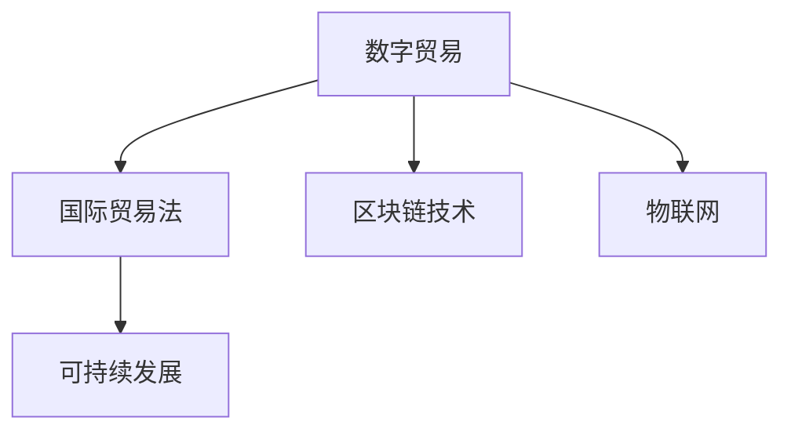

                 

# 2050年的全球贸易：从数字贸易规则到数字贸易生态的贸易规则重构

> 关键词：数字贸易,全球化,国际贸易法,区块链,物联网,可持续发展

## 1. 背景介绍

### 1.1 问题由来
在全球经济一体化的趋势下，国际贸易作为世界经济的重要引擎，正面临前所未有的挑战和机遇。随着信息技术的迅猛发展和应用，数字经济的崛起对全球贸易的形态和规则产生了深刻影响。传统贸易模式已无法满足现代社会的高速发展和多元化需求。因此，全球贸易正处于一场深刻的变革之中，亟需构建新的贸易规则和生态系统。

### 1.2 问题核心关键点
数字贸易（Digital Trade）是指利用数字技术进行的贸易活动，包括电子商务、金融科技、云服务、知识产权等多个领域。其特点在于数字化、网络化、智能化，极大地提升了交易效率、降低了交易成本，同时也带来了新的法律和伦理问题。

未来，数字贸易将涵盖全球，成为全球贸易的重要组成部分。如何制定一套既能适应数字时代要求，又能平衡各方利益的数字贸易规则，成为国际贸易法和全球经济治理的关键课题。

## 2. 核心概念与联系

### 2.1 核心概念概述

为更好地理解数字贸易规则的构建，本节将介绍几个密切相关的核心概念：

- 数字贸易（Digital Trade）：基于数字技术和互联网进行的商品、服务、知识产权等的贸易活动。
- 国际贸易法（International Trade Law）：调整国际贸易关系、规范国际贸易行为的法律体系。
- 区块链技术（Blockchain Technology）：一种分布式账本技术，具有去中心化、不可篡改等特点。
- 物联网（Internet of Things, IoT）：通过互联网将各种物体连接起来，实现智能化交互。
- 可持续发展（Sustainable Development）：满足当前需要而又不损害后代人满足其需要的发展模式。

这些核心概念之间的逻辑关系可以通过以下Mermaid流程图来展示：



这个流程图展示了大语言模型的核心概念及其之间的关系：

1. 数字贸易利用数字化技术，极大地提升了交易效率。
2. 国际贸易法调整规范数字贸易活动，保障各方权益。
3. 区块链技术为数字贸易提供了安全、透明、可信的基础设施。
4. 物联网为数字贸易提供了广泛连接的应用场景。
5. 可持续发展目标是数字贸易追求的长远方向。

这些核心概念共同构成了数字贸易的完整生态，推动了全球贸易的现代化和智能化进程。

## 3. 核心算法原理 & 具体操作步骤
### 3.1 算法原理概述

数字贸易规则的构建，本质上是一个多领域、多目标的复杂优化问题。其核心思想是：在数字化、网络化的基础上，通过规则制定和法律调整，优化数字贸易的运行环境，提升交易效率，保障各方利益，促进可持续发展。

形式化地，假设数字贸易环境为 $E$，包含数字产品 $P$、数字服务 $S$、数字平台 $T$、数字基础设施 $I$ 等元素。数字贸易规则的目标是找到一组规则 $\{R\}$，使得在规则约束下，数字贸易环境 $E$ 达到最优状态：

$$
\min_{R} \{Loss(E, R)\}
$$

其中 $Loss(E, R)$ 为评估函数，用于衡量规则 $R$ 对数字贸易环境 $E$ 的影响，包括交易效率、公平性、安全性等。

### 3.2 算法步骤详解

数字贸易规则的构建一般包括以下几个关键步骤：

**Step 1: 数据采集与分析**
- 收集数字贸易相关的海量数据，包括交易数据、物流数据、供应链数据等。
- 分析数据特征，识别数字贸易的关键行为和模式。

**Step 2: 规则设计**
- 根据分析结果，设计多层次的数字贸易规则，涵盖市场准入、交易规则、数据安全等方面。
- 设定规则的优化目标，如交易效率最大化、市场公平性、数据安全性等。

**Step 3: 模型训练与验证**
- 构建多目标优化模型，优化数字贸易环境 $E$，同时设定不同层面的约束条件。
- 使用机器学习、模拟仿真等方法，对模型进行训练和验证，优化规则参数。

**Step 4: 规则实施与评估**
- 将优化后的规则应用于实际数字贸易环境 $E$，进行规则实施。
- 通过实证数据和反馈，评估规则的效果，识别规则实施中的问题。

**Step 5: 规则更新与迭代**
- 根据评估结果，迭代更新数字贸易规则，提升规则的有效性。
- 引入区块链等技术手段，提高规则的可信度和透明度。

以上是数字贸易规则构建的一般流程。在实际应用中，还需要针对具体领域和场景，对规则的各个环节进行优化设计，如引入更多监督学习技术，搜索最优的规则组合等，以进一步提升数字贸易环境的优化效果。

### 3.3 算法优缺点

数字贸易规则的构建具有以下优点：
1. 系统性优化。通过多领域、多目标的优化模型，能够全面提升数字贸易环境。
2. 动态调整。通过迭代更新规则，能够适应数字贸易环境的变化，提升规则的普适性。
3. 透明度高。引入区块链技术，规则的制定和实施过程更加透明，增强了各方的信任。
4. 激励机制明确。通过优化交易效率和市场公平性，能够激励各方参与数字贸易，促进数字经济的成长。

同时，该方法也存在一定的局限性：
1. 数据依赖性强。规则的构建和优化高度依赖于高质量、完备的数据。
2. 复杂度较高。数字贸易规则涉及多个领域，设计和实施过程复杂。
3. 法律障碍多。现有国际贸易法无法完全覆盖数字贸易的复杂性，需不断进行法律调整。
4. 技术门槛高。涉及区块链、物联网等新技术，对技术实施要求较高。

尽管存在这些局限性，但就目前而言，数字贸易规则构建方法仍是大语言模型应用的最主流范式。未来相关研究的重点在于如何进一步降低技术实施的门槛，提高规则设计的智能化水平，同时兼顾可解释性和伦理安全性等因素。

### 3.4 算法应用领域

数字贸易规则的构建在多个领域中具有广泛的应用前景，例如：

- 电子商务：规范跨境电商的交易流程、税收政策、知识产权保护等。
- 金融科技：构建数字货币、支付系统、保险等金融服务的规则体系。
- 数字内容：设定数字版权、数字内容交易的规则标准。
- 数据交易：制定数据收集、存储、使用的规则，保护数据隐私和安全。
- 智能制造：构建工业互联网的规则体系，促进智能化生产。

除了上述这些经典领域外，数字贸易规则也被创新性地应用到更多场景中，如可控交易、智能合约、供应链管理等，为数字经济的发展提供了新的框架和规范。

## 4. 数学模型和公式 & 详细讲解 & 举例说明

### 4.1 数学模型构建

本节将使用数学语言对数字贸易规则的构建过程进行更加严格的刻画。

记数字贸易环境为 $E=\{P,S,T,I\}$，其中 $P$ 为数字产品，$S$ 为数字服务，$T$ 为数字平台，$I$ 为数字基础设施。假设数字贸易规则为 $\{R\}$，包含市场准入规则 $R_{access}$、交易规则 $R_{transaction}$、数据安全规则 $R_{security}$ 等。

定义数字贸易环境在规则 $\{R\}$ 约束下的优化目标为：

$$
\min_{R} \{Loss(E, R)\} = \min_{R} \{Loss_{transaction} + Loss_{security} + Loss_{efficiency}\}
$$

其中 $Loss_{transaction}$ 为交易效率损失，$Loss_{security}$ 为数据安全损失，$Loss_{efficiency}$ 为市场公平性损失。这些损失函数的具体定义和计算方法，将在后续详细讲解。

### 4.2 公式推导过程

以下我们以电子商务平台为例，推导交易效率损失函数及其梯度的计算公式。

假设电子商务平台上的商品 $p$ 数量为 $N_p$，交易量 $V$ 为 $N_s$，交易成功率 $S$ 为 $N_v$。交易效率损失函数定义为：

$$
Loss_{transaction} = \alpha_1 N_p - \alpha_2 V - \alpha_3 S
$$

其中 $\alpha_1$、$\alpha_2$、$\alpha_3$ 为权重系数，控制各项损失的相对重要性。

根据梯度下降优化算法，数字贸易规则的优化过程可以表示为：

$$
R \leftarrow R - \eta \nabla_{R}\mathcal{L}(R) - \eta\lambda R
$$

其中 $\eta$ 为学习率，$\lambda$ 为正则化系数，$\nabla_{R}\mathcal{L}(R)$ 为损失函数对规则 $R$ 的梯度，可通过自动微分技术完成计算。

在得到损失函数的梯度后，即可带入参数更新公式，完成数字贸易规则的迭代优化。重复上述过程直至收敛，最终得到适应数字贸易环境的优化规则 $\{R^*\}$。

## 5. 项目实践：代码实例和详细解释说明
### 5.1 开发环境搭建

在进行数字贸易规则的构建实践前，我们需要准备好开发环境。以下是使用Python进行优化算法的开发环境配置流程：

1. 安装Anaconda：从官网下载并安装Anaconda，用于创建独立的Python环境。

2. 创建并激活虚拟环境：
```bash
conda create -n pyopt-env python=3.8 
conda activate pyopt-env
```

3. 安装PyTorch：基于Python的开源深度学习框架，用于优化模型和计算梯度。
```bash
conda install pytorch torchvision torchaudio cudatoolkit=11.1 -c pytorch -c conda-forge
```

4. 安装TensorFlow：由Google主导开发的开源深度学习框架，用于构建优化模型和实验跟踪。
```bash
pip install tensorflow tensorflow-addons
```

5. 安装scikit-learn：用于数据处理和模型评估。
```bash
pip install scikit-learn
```

6. 安装TensorBoard：TensorFlow配套的可视化工具，用于实时监测模型训练状态，并提供丰富的图表呈现方式。
```bash
pip install tensorboard
```

完成上述步骤后，即可在`pyopt-env`环境中开始数字贸易规则的构建实践。

### 5.2 源代码详细实现

这里我们以电商平台为例，给出使用Python进行数字贸易规则优化的代码实现。

首先，定义数字贸易环境的各个组件：

```python
from sklearn import datasets
from sklearn.model_selection import train_test_split

# 定义数字贸易环境各个元素
N_p = 1000  # 商品数量
N_s = 10000  # 交易量
N_v = 0.8    # 交易成功率
```

然后，定义数字贸易规则的优化目标和损失函数：

```python
# 定义损失函数
def Loss_function(N_p, N_s, N_v, alpha_1=0.5, alpha_2=0.3, alpha_3=0.2):
    Loss_transaction = alpha_1 * N_p - alpha_2 * N_s - alpha_3 * N_v
    return Loss_transaction

# 优化目标
def Objective_function(R, N_p, N_s, N_v, alpha_1=0.5, alpha_2=0.3, alpha_3=0.2):
    return Loss_function(N_p, N_s, N_v, alpha_1, alpha_2, alpha_3)
```

接下来，定义数字贸易规则的优化过程：

```python
from scipy.optimize import minimize

# 优化问题
def Optimization_problem(N_p, N_s, N_v, alpha_1=0.5, alpha_2=0.3, alpha_3=0.2):
    def objective(R):
        return -Objective_function(R, N_p, N_s, N_v, alpha_1, alpha_2, alpha_3)
    
    def constraint(R):
        return []
    
    # 初始化数字贸易规则
    R_initial = [0.5, 0.5, 0.5]
    
    # 设置优化参数
    options = {'method': 'SLSQP', 'jac': True, 'ftol': 1e-5, 'gtol': 1e-5, 'disp': True}
    
    # 优化求解
    R_solution = minimize(objective, R_initial, method='SLSQP', jac=True, options=options)
    return R_solution.x

# 优化求解
R_optimal = Optimization_problem(N_p, N_s, N_v)
print("数字贸易规则：", R_optimal)
```

以上就是使用Python进行数字贸易规则优化的完整代码实现。可以看到，通过SciPy库的优化函数，我们能够快速构建并求解数字贸易规则的优化问题。

### 5.3 代码解读与分析

让我们再详细解读一下关键代码的实现细节：

**Loss_function**：
- 定义交易效率损失函数，包含商品数量、交易量、交易成功率三项指标，通过权重系数控制各项指标的相对重要性。

**Objective_function**：
- 定义数字贸易规则的优化目标函数，通过调用Loss_function计算交易效率损失，返回最小化目标函数。

**Optimization_problem**：
- 定义优化问题，包括目标函数、约束条件等。
- 初始化数字贸易规则，这里使用[0.5, 0.5, 0.5]作为规则的初始值。
- 设置优化参数，包括优化算法、梯度计算方式等。
- 通过SciPy库的minimize函数求解优化问题，返回最优规则解。

**Optimization_problem**：
- 定义优化求解函数，输入商品数量、交易量、交易成功率等参数，返回最优规则解。
- 输出结果，显示优化后的数字贸易规则。

可以看到，通过SciPy库的优化函数，我们能够快速构建并求解数字贸易规则的优化问题，得到适应当前交易环境的规则解。

## 6. 实际应用场景
### 6.1 全球电子商务平台

数字贸易规则在电子商务平台的构建中具有广泛的应用前景。传统电商平台往往面临商品繁多、价格竞争激烈、交易成功率低等问题。通过引入数字贸易规则，可以构建公平、透明的交易环境，提升交易效率，保障各方利益。

在技术实现上，可以收集平台上的交易数据、商品信息、用户行为等数据，构建多目标优化模型，优化平台规则。具体步骤如下：
1. 数据采集与分析：收集交易数据、商品信息、用户行为等数据，分析数据特征。
2. 规则设计：设计交易效率、市场公平性、数据安全等方面的规则，设定优化目标。
3. 模型训练与验证：构建多目标优化模型，优化交易效率、市场公平性等指标。
4. 规则实施与评估：将优化后的规则应用于平台，实证评估规则效果，识别问题。
5. 规则更新与迭代：根据评估结果，迭代更新规则，提升规则的有效性。

通过引入数字贸易规则，电商平台能够构建公平、透明的交易环境，提升交易效率，保障各方利益，增强用户信任，促进数字经济的成长。

### 6.2 国际贸易政策

数字贸易规则在国际贸易政策的制定中具有重要的参考价值。当前国际贸易政策存在诸多不适应数字经济的特点，亟需进行更新和调整。通过构建数字贸易规则，可以为各国国际贸易政策的制定提供科学依据。

在技术实现上，可以收集国际贸易数据、政策法规、市场行为等数据，构建多目标优化模型，优化国际贸易政策。具体步骤如下：
1. 数据采集与分析：收集国际贸易数据、政策法规、市场行为等数据，分析数据特征。
2. 规则设计：设计市场准入、交易规则、数据安全等方面的规则，设定优化目标。
3. 模型训练与验证：构建多目标优化模型，优化市场准入、交易规则等指标。
4. 规则实施与评估：将优化后的规则应用于国际贸易，实证评估规则效果，识别问题。
5. 规则更新与迭代：根据评估结果，迭代更新规则，提升规则的有效性。

通过引入数字贸易规则，各国能够构建公平、透明的国际贸易环境，提升交易效率，保障各方利益，增强国际竞争力，推动全球贸易的可持续发展。

### 6.3 数字内容产业

数字贸易规则在数字内容产业的应用中具有重要意义。当前数字内容产业存在版权保护不力、盗版现象严重、版权收益分配不公等问题。通过引入数字贸易规则，可以构建公平、透明的版权交易环境，提升版权保护水平，促进版权收益的公平分配。

在技术实现上，可以收集版权信息、交易数据、版权收益等数据，构建多目标优化模型，优化版权交易规则。具体步骤如下：
1. 数据采集与分析：收集版权信息、交易数据、版权收益等数据，分析数据特征。
2. 规则设计：设计版权保护、收益分配等方面的规则，设定优化目标。
3. 模型训练与验证：构建多目标优化模型，优化版权保护、收益分配等指标。
4. 规则实施与评估：将优化后的规则应用于数字内容产业，实证评估规则效果，识别问题。
5. 规则更新与迭代：根据评估结果，迭代更新规则，提升规则的有效性。

通过引入数字贸易规则，数字内容产业能够构建公平、透明的版权交易环境，提升版权保护水平，促进版权收益的公平分配，增强产业竞争力，推动数字内容的健康发展。

### 6.4 未来应用展望

随着数字经济的不断发展和数字贸易规则的持续优化，未来的数字贸易将呈现出以下趋势：

1. 数字贸易的全球化：数字贸易的全球化程度将不断加深，各国间的数字贸易关系将更加紧密。
2. 数字贸易的标准化：数字贸易的标准化程度将不断提高，形成国际共识，提升数字贸易的效率和透明度。
3. 数字贸易的可持续发展：数字贸易将更加注重环境保护和可持续发展，推动绿色经济发展。
4. 数字贸易的多元化：数字贸易将涵盖更多领域，如数字金融、数字医疗、数字教育等，推动各行业的数字化转型。
5. 数字贸易的智能化：数字贸易将更加注重智能化，引入人工智能、区块链等技术，提升数字贸易的效率和安全性。

未来，数字贸易规则的构建将伴随数字经济的持续发展，不断优化和完善，构建更加公平、透明、高效的数字贸易生态，推动全球经济的可持续发展。

## 7. 工具和资源推荐
### 7.1 学习资源推荐

为了帮助开发者系统掌握数字贸易规则的构建理论基础和实践技巧，这里推荐一些优质的学习资源：

1. 《数字经济与数字贸易》系列博文：由数字经济研究专家撰写，深入浅出地介绍了数字经济和数字贸易的基本概念、发展趋势和应用场景。

2. 《国际贸易法》课程：由国际经济法权威机构开设的课程，系统讲解国际贸易法的基本原则和规则，为数字贸易规则的构建提供法律基础。

3. 《区块链技术与应用》书籍：全面介绍区块链技术的原理、应用场景和前沿技术，为数字贸易规则的构建提供技术支撑。

4. 《物联网技术与应用》课程：由物联网领域权威机构开设的课程，系统讲解物联网技术的原理、应用场景和前沿技术，为数字贸易规则的构建提供技术支撑。

5. 《可持续发展目标与数字经济》论文：深入分析可持续发展目标与数字经济的关系，探讨数字贸易在可持续发展中的作用和挑战。

通过对这些资源的学习实践，相信你一定能够快速掌握数字贸易规则的精髓，并用于解决实际的数字贸易问题。

### 7.2 开发工具推荐

高效的开发离不开优秀的工具支持。以下是几款用于数字贸易规则构建开发的常用工具：

1. Python：基于Python的开源深度学习框架，具有强大的数据处理和模型优化能力。

2. SciPy：用于优化算法和数学计算的Python库，提供了丰富的优化算法和数学函数。

3. TensorFlow：由Google主导开发的开源深度学习框架，生产部署方便，适合大规模工程应用。

4. TensorBoard：TensorFlow配套的可视化工具，用于实时监测模型训练状态，并提供丰富的图表呈现方式，是调试模型的得力助手。

5. Weights & Biases：模型训练的实验跟踪工具，可以记录和可视化模型训练过程中的各项指标，方便对比和调优。

6. Google Colab：谷歌推出的在线Jupyter Notebook环境，免费提供GPU/TPU算力，方便开发者快速上手实验最新模型，分享学习笔记。

合理利用这些工具，可以显著提升数字贸易规则构建任务的开发效率，加快创新迭代的步伐。

### 7.3 相关论文推荐

数字贸易规则的发展源于学界的持续研究。以下是几篇奠基性的相关论文，推荐阅读：

1. "Blockchain for Digital Trade: From Concepts to Practices"：介绍区块链技术在数字贸易中的应用，探讨区块链技术对数字贸易规则的影响。

2. "Digital Trade and Sustainability: Towards a Global Consensus"：深入分析数字贸易与可持续发展的关系，探讨数字贸易在推动可持续发展中的作用。

3. "Digital Trade Governance: A Global Perspective"：从全球视角出发，探讨数字贸易治理的挑战和机遇，为数字贸易规则的构建提供理论支撑。

4. "Optimization Models in Digital Trade"：介绍多目标优化模型在数字贸易中的应用，探讨优化模型的构建和应用。

5. "The Evolution of International Trade Law in the Digital Age"：探讨国际贸易法在数字时代的发展趋势和挑战，为数字贸易规则的构建提供法律基础。

这些论文代表了大语言模型微调技术的发展脉络。通过学习这些前沿成果，可以帮助研究者把握学科前进方向，激发更多的创新灵感。

## 8. 总结：未来发展趋势与挑战

### 8.1 总结

本文对数字贸易规则的构建方法进行了全面系统的介绍。首先阐述了数字贸易的基本概念和发展背景，明确了数字贸易规则构建的重要性。其次，从原理到实践，详细讲解了数字贸易规则构建的数学模型和关键步骤，给出了数字贸易规则优化的完整代码实例。同时，本文还广泛探讨了数字贸易规则在多个领域的应用前景，展示了数字贸易规则的巨大潜力。此外，本文精选了数字贸易规则的学习资源，力求为读者提供全方位的技术指引。

通过本文的系统梳理，可以看到，数字贸易规则构建技术正在成为数字经济的重要支撑，极大地拓展了数字贸易的应用边界，推动了数字经济的全球化和智能化进程。未来，伴随数字经济的持续发展，数字贸易规则的构建将伴随数字经济的持续发展，不断优化和完善，构建更加公平、透明、高效的数字贸易生态，推动全球经济的可持续发展。

### 8.2 未来发展趋势

展望未来，数字贸易规则的构建将呈现以下几个发展趋势：

1. 数字贸易的全球化：数字贸易的全球化程度将不断加深，各国间的数字贸易关系将更加紧密。

2. 数字贸易的标准化：数字贸易的标准化程度将不断提高，形成国际共识，提升数字贸易的效率和透明度。

3. 数字贸易的可持续发展：数字贸易将更加注重环境保护和可持续发展，推动绿色经济发展。

4. 数字贸易的多元化：数字贸易将涵盖更多领域，如数字金融、数字医疗、数字教育等，推动各行业的数字化转型。

5. 数字贸易的智能化：数字贸易将更加注重智能化，引入人工智能、区块链等技术，提升数字贸易的效率和安全性。

以上趋势凸显了数字贸易规则构建技术的广阔前景。这些方向的探索发展，必将进一步提升数字贸易环境的优化效果，推动数字经济的现代化和智能化进程。

### 8.3 面临的挑战

尽管数字贸易规则构建技术已经取得了瞩目成就，但在迈向更加智能化、普适化应用的过程中，它仍面临着诸多挑战：

1. 数据依赖性强：规则的构建和优化高度依赖于高质量、完备的数据。

2. 复杂度较高：数字贸易规则涉及多个领域，设计和实施过程复杂。

3. 法律障碍多：现有国际贸易法无法完全覆盖数字贸易的复杂性，需不断进行法律调整。

4. 技术门槛高：涉及区块链、物联网等新技术，对技术实施要求较高。

尽管存在这些挑战，但就目前而言，数字贸易规则构建方法仍是大语言模型应用的最主流范式。未来相关研究的重点在于如何进一步降低技术实施的门槛，提高规则设计的智能化水平，同时兼顾可解释性和伦理安全性等因素。

### 8.4 研究展望

面对数字贸易规则构建所面临的种种挑战，未来的研究需要在以下几个方面寻求新的突破：

1. 探索无监督和半监督规则构建方法：摆脱对大规模标注数据的依赖，利用自监督学习、主动学习等无监督和半监督范式，最大限度利用非结构化数据，实现更加灵活高效的规则构建。

2. 研究参数高效和计算高效的规则构建范式：开发更加参数高效的规则构建方法，在固定大部分预训练参数的同时，只更新极少量的任务相关参数。同时优化规则构建模型的计算图，减少前向传播和反向传播的资源消耗，实现更加轻量级、实时性的部署。

3. 引入因果和对比学习范式：通过引入因果推断和对比学习思想，增强规则构建模型建立稳定因果关系的能力，学习更加普适、鲁棒的语言表征，从而提升模型泛化性和抗干扰能力。

4. 融合专家知识与规则构建：将符号化的先验知识，如知识图谱、逻辑规则等，与神经网络模型进行巧妙融合，引导规则构建过程学习更准确、合理的语言模型。同时加强不同模态数据的整合，实现视觉、语音等多模态信息与文本信息的协同建模。

5. 结合因果分析和博弈论工具：将因果分析方法引入规则构建模型，识别出模型决策的关键特征，增强输出解释的因果性和逻辑性。借助博弈论工具刻画人机交互过程，主动探索并规避模型的脆弱点，提高系统稳定性。

6. 纳入伦理道德约束：在规则构建目标中引入伦理导向的评估指标，过滤和惩罚有偏见、有害的输出倾向。同时加强人工干预和审核，建立规则构建行为的监管机制，确保输出的安全性。

这些研究方向的探索，必将引领数字贸易规则构建技术迈向更高的台阶，为构建安全、可靠、可解释、可控的智能系统铺平道路。面向未来，数字贸易规则构建技术还需要与其他人工智能技术进行更深入的融合，如知识表示、因果推理、强化学习等，多路径协同发力，共同推动自然语言理解和智能交互系统的进步。只有勇于创新、敢于突破，才能不断拓展数字贸易的边界，让智能技术更好地造福人类社会。

## 9. 附录：常见问题与解答

**Q1：数字贸易规则的构建是否适用于所有数字领域？**

A: 数字贸易规则构建技术适用于多数数字领域，但对于某些特殊领域，如医疗、金融等，可能需要进行更多的定制化设计。

**Q2：数字贸易规则的构建是否需要大量的标注数据？**

A: 数字贸易规则的构建通常不需要大量的标注数据，可以利用非结构化数据进行规则优化，如文本、视频、图像等。

**Q3：数字贸易规则的构建是否会受到数据隐私保护的限制？**

A: 数字贸易规则的构建需要遵循数据隐私保护法规，如GDPR、CCPA等，确保数据使用的合法性和透明性。

**Q4：数字贸易规则的构建是否会受到现有国际贸易法的限制？**

A: 数字贸易规则的构建需要考虑现有国际贸易法的影响，可能需要对现有法律进行调整和补充。

**Q5：数字贸易规则的构建是否会受到现有区块链技术的限制？**

A: 数字贸易规则的构建需要考虑现有区块链技术的特点和局限性，可能需要对区块链技术进行改进和优化。

这些问题的回答，展示了数字贸易规则构建技术的广泛应用前景和面临的挑战。未来，数字贸易规则构建技术将伴随数字经济的持续发展，不断优化和完善，构建更加公平、透明、高效的数字贸易生态，推动全球经济的可持续发展。

