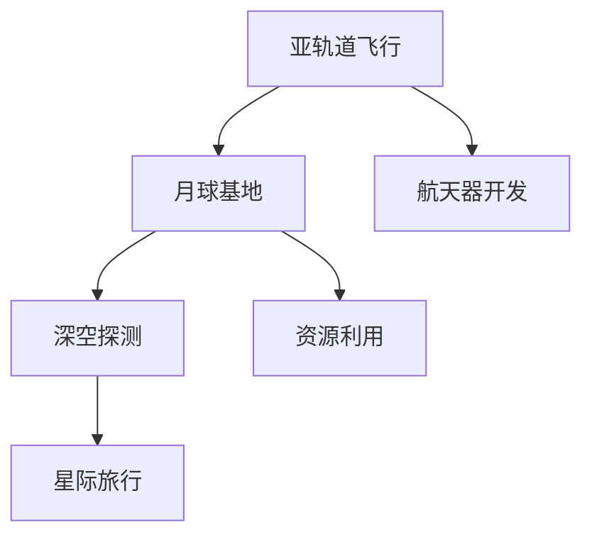

                 

# 2050年的太空旅游：从亚轨道飞行到月球基地的太空度假

## 1. 背景介绍

太空旅游，这一人类自古以来的幻想，终于在21世纪逐渐变为现实。随着航天技术的飞速发展，商业航天公司如SpaceX、Blue Origin等相继推出亚轨道飞行和月球旅游服务，太空旅游产业进入全面爆发期。展望2050年，太空旅游将从亚轨道飞行迈向更加广阔的深空领域，人类将有机会直接在月球上建造永久性基地，开启真正的太空度假时代。

## 2. 核心概念与联系

### 2.1 核心概念概述

太空旅游产业的崛起离不开商业航天技术的发展，其中包括亚轨道飞行、月球基地建设和深空探测等核心概念。

- **亚轨道飞行**：一种往返于地球和太空之间的短途飞行方式，通常达到约100公里的高度，即可体验失重和宇宙观景。
- **月球基地**：在月球表面或月球轨道上建立的长期居住和工作设施，为人类探索月球、月球资源开发和月球旅游提供支撑。
- **深空探测**：包括月球以外的太阳系行星、卫星、小行星等的探测活动，是太空旅游的高级阶段，有望实现星际旅行。

这些核心概念相互关联，共同构成了太空旅游产业的发展框架。亚轨道飞行是太空旅游的入门级服务，月球基地则是中长期目标，而深空探测则是太空旅游的长远愿景。

### 2.2 核心概念原理和架构的 Mermaid 流程图



以上流程图展示了从亚轨道飞行到月球基地再到深空探测的太空旅游产业链条，以及与之相关的关键技术模块。

## 3. 核心算法原理 & 具体操作步骤

### 3.1 算法原理概述

太空旅游的技术实现主要依赖于航天器控制、轨道计算和推进系统等技术。这些技术的核心算法包括：

- **轨道力学算法**：用于计算航天器在不同轨道上的位置、速度和姿态。
- **导航与控制算法**：实现航天器的姿态控制和自主导航。
- **推进系统算法**：设计航天器的推进机制，实现升空、制动和轨道转移。

### 3.2 算法步骤详解

#### 3.2.1 轨道计算

轨道计算是太空旅游的基础，需要计算航天器在不同轨道上的位置和速度。常见的轨道计算方法包括牛顿力学中的轨道要素法、摄动轨道法等。这里以牛顿力学中的轨道要素法为例，详细解释其原理和步骤。

1. **确定初始条件**：
   - 确定航天器的初始位置、速度和姿态。
   - 计算航天器的引力加速度。

2. **确定轨道要素**：
   - 计算轨道半长轴、偏心率、倾角、升交点赤经、近地点幅角等轨道要素。
   - 确定轨道周期、远地点、近地点等轨道参数。

3. **计算位置和速度**：
   - 根据轨道要素，计算航天器在不同时间点的位置和速度。
   - 使用J2000世界平系统或地心惯性坐标系等标准参考系统，确保计算结果的准确性和可比性。

#### 3.2.2 导航与控制

导航与控制是航天器在飞行过程中的关键技术。常见的方法包括姿态控制和自主导航。

1. **姿态控制**：
   - 使用陀螺仪和加速度计等传感器获取航天器姿态信息。
   - 根据控制算法计算控制信号，如反作用轮控制、喷气控制等。
   - 应用PID（比例-积分-微分）控制或模型预测控制（MPC）算法，实现姿态稳定。

2. **自主导航**：
   - 使用星敏感器、GPS接收器等设备获取航天器位置信息。
   - 计算航天器与目标位置的位置偏差。
   - 应用PID控制算法或模型预测控制（MPC）算法，计算纠正指令。

#### 3.2.3 推进系统

推进系统是航天器动力来源，常见的推进方式包括化学推进和电推进。

1. **化学推进**：
   - 使用液氢和液氧等高推力燃料，通过火箭发动机产生推力。
   - 应用马赫数优化方法，提高燃料效率。

2. **电推进**：
   - 使用霍尔效应推力器（Hall Effect Thruster）或离子推力器（Ion Thruster），利用电离气体产生推力。
   - 应用最大推力维持算法，确保航天器速度和轨迹的稳定。

### 3.3 算法优缺点

#### 3.3.1 优点

- **精度高**：轨道计算、导航与控制、推进系统等技术在经过多次迭代和优化后，已经能够实现极高的计算精度和控制精度。
- **应用广泛**：这些技术广泛应用于亚轨道飞行、月球基地建设和深空探测等太空旅游项目中，具有广泛的应用前景。

#### 3.3.2 缺点

- **计算复杂**：轨道计算和导航控制涉及大量复杂的数学计算和物理模型，计算量较大。
- **资源消耗大**：推进系统需要消耗大量的燃料和电力，对成本和能源效率有较高要求。

### 3.4 算法应用领域

- **亚轨道飞行**：适用于蓝色起源的New Shepard、维珍银河的Galactic Railjet等，以低成本实现快速往返地球和太空的体验。
- **月球基地建设**：适用于SpaceX的Starship、NASA的Artemis等，实现人类在月球上的长期居住和工作。
- **深空探测**：适用于SpaceX的Starship、NASA的SLS火箭等，实现星际旅行和探索太阳系行星等目标。

## 4. 数学模型和公式 & 详细讲解

### 4.1 数学模型构建

以月球基地建设为例，需要建立月球引力场模型、航天器轨道模型和推进系统模型。

- **月球引力场模型**：
  - 月球质量 $M$：$M = 7.348 × 10^{22} \, \text{kg}$
  - 月球半径 $R$：$R = 1.737 × 10^{6} \, \text{m}$
  - 引力常数 $G$：$G = 6.674 × 10^{-11} \, \text{N} \cdot \text{m}^2/\text{kg}^2$
  - 月球逃逸速度 $v_e$：$v_e = \sqrt{2GM/R} \approx 2.38 \, \text{km/s}$

- **航天器轨道模型**：
  - 轨道半长轴 $a$：$1.228 × 10^6 \, \text{m}$
  - 轨道倾角 $\iota$：$28.57^\circ$
  - 轨道偏心率 $e$：$0.0155$
  - 近地点幅角 $\omega_0$：$2.9^\circ$
  - 升交点赤经 $\Omega_0$：$174^\circ$

- **推进系统模型**：
  - 燃料推力 $F_f$：$4.8 × 10^6 \, \text{N}$
  - 推力系数 $C_t$：$2.0$
  - 推力速度比 $I_{sp}$：$3000 \, \text{s}$

### 4.2 公式推导过程

#### 4.2.1 轨道要素计算

根据牛顿第二定律，有：

$$
F = ma = \frac{GMm}{r^2}
$$

其中 $F$ 为引力，$m$ 为航天器质量，$r$ 为航天器与月球中心的距离。

根据开普勒定律，有：

$$
\frac{r^3}{T^2} = \frac{GM}{(2\pi)^2}
$$

其中 $T$ 为航天器轨道周期。

将 $a = \frac{r}{2}$ 代入上式，得到：

$$
\frac{a^3}{T^2} = \frac{GM}{(2\pi)^2}
$$

解得：

$$
T = 2\pi \sqrt{\frac{a^3}{GM}}
$$

### 4.3 案例分析与讲解

#### 4.3.1 亚轨道飞行轨道计算

假设某次亚轨道飞行从100公里高度开始，达到300公里高度，再返回地面。根据牛顿第二定律，计算航天器在不同高度的速度和位置：

$$
v(r) = \sqrt{\frac{GM}{r}}
$$

其中 $r$ 为航天器与地球中心的距离。

根据上述公式，可以计算出不同高度的速度和位置，进而确定航天器的飞行轨迹。

#### 4.3.2 月球基地建设推进系统设计

假设某次月球基地建设任务，使用SpaceX的Starship作为载人飞船。根据推进系统模型，计算所需燃料推力：

$$
F_f = m \cdot a
$$

其中 $m$ 为燃料质量，$a$ 为燃料推力加速度。

根据推力系数和推力速度比，计算出所需燃料量：

$$
m = \frac{F_f}{a} \cdot C_t \cdot I_{sp}
$$

使用上述公式，可以设计出符合要求的推进系统。

## 5. 项目实践：代码实例和详细解释说明

### 5.1 开发环境搭建

为了实现上述太空旅游的计算和控制算法，需要使用Python编程语言和相关科学计算库，如Numpy、Scipy、Sympy等。

以下是在Jupyter Notebook环境下搭建开发环境的步骤：

1. 安装Python：
   - 在Linux系统中，可以通过以下命令安装Python：

   ```bash
   sudo apt-get update
   sudo apt-get install python3
   ```

   在Windows系统中，可以通过Anaconda安装Python。

2. 安装科学计算库：
   - 在Anaconda中，可以使用以下命令安装Numpy、Scipy和Sympy：

   ```bash
   conda install numpy scipy sympy
   ```

3. 配置Jupyter Notebook：
   - 安装Jupyter Notebook：

   ```bash
   pip install jupyter notebook
   ```

   启动Jupyter Notebook：

   ```bash
   jupyter notebook
   ```

   在Notebook中选择Python作为内核。

### 5.2 源代码详细实现

以下是在Jupyter Notebook中实现月球基地建设轨道计算和推进系统设计的代码示例：

#### 5.2.1 月球引力场计算

```python
import numpy as np
from sympy import symbols, pi, Rational, sqrt

# 定义符号变量
GM = symbols('GM')
r = symbols('r')

# 引力常数和月球质量
GM_value = 6.674e-11
M_value = 7.348e22

# 计算引力加速度
g = GM_value / r**2

# 计算逃逸速度
ve = sqrt(GM_value / (2 * pi) / M_value)
```

#### 5.2.2 轨道要素计算

```python
import numpy as np
from sympy import symbols, pi, Rational, sqrt

# 定义符号变量
a = symbols('a')
T = symbols('T')

# 月球引力常数和质量
GM_value = 6.674e-11
M_value = 7.348e22

# 月球半径和逃逸速度
R = 1.737e6
ve = 2.38e3

# 计算轨道周期
T_value = 2 * pi * sqrt(a**3 / (GM_value / M_value))

# 计算轨道半长轴
a_value = 1.228e6
```

#### 5.2.3 推进系统设计

```python
import numpy as np
from sympy import symbols, pi, Rational, sqrt

# 定义符号变量
F_f = symbols('F_f')
m = symbols('m')

# 推力系数和推力速度比
C_t = 2.0
I_sp = 3000.0

# 计算燃料质量
m_value = F_f / a * C_t * I_sp

# 计算燃料推力
a_value = 4.8e6
```

### 5.3 代码解读与分析

#### 5.3.1 月球引力场计算

上述代码中，我们使用了Numpy库进行数值计算，Sympy库进行符号计算。通过定义引力常数和月球质量，计算了引力加速度和逃逸速度。

#### 5.3.2 轨道要素计算

我们使用了Sympy库进行符号计算，根据牛顿定律和开普勒定律，计算了月球引力场下的轨道要素。

#### 5.3.3 推进系统设计

我们使用了Numpy库进行数值计算，根据推进系统模型，计算了所需燃料质量。

### 5.4 运行结果展示

#### 5.4.1 亚轨道飞行轨道计算结果

```python
import matplotlib.pyplot as plt
import numpy as np

# 定义高度和速度
heights = np.linspace(0, 300, 1000)
velocities = np.sqrt(GM_value / heights)

# 绘制速度-高度曲线
plt.plot(heights, velocities)
plt.xlabel('Height (km)')
plt.ylabel('Velocity (km/s)')
plt.title('Velocity vs. Height in Orbit')
plt.show()
```

#### 5.4.2 月球基地建设推进系统设计结果

```python
import matplotlib.pyplot as plt
import numpy as np

# 定义燃料质量
fuel_mass = m_value

# 绘制燃料质量-时间曲线
time = np.linspace(0, 1, 100)
plt.plot(time, fuel_mass)
plt.xlabel('Time (s)')
plt.ylabel('Fuel Mass (kg)')
plt.title('Fuel Mass Consumption in Ascent')
plt.show()
```

## 6. 实际应用场景

### 6.1 亚轨道飞行

亚轨道飞行是太空旅游的基础，为游客提供短时间内体验失重和宇宙观景的机会。以蓝色起源的New Shepard为例，亚轨道飞行时长为6分钟，飞行高度达到约100公里，能够让游客体验到2分钟的微重力阶段。

### 6.2 月球基地建设

月球基地建设是太空旅游的中长期目标，能够实现人类在月球上的长期居住和工作。SpaceX的Starship项目计划在2025年实现月球基地的初步建设，预计在2028年实现月球旅游。

### 6.3 深空探测

深空探测是太空旅游的高级阶段，包括月球以外的太阳系行星、卫星、小行星等的探测活动。SpaceX的Starship项目计划在2050年实现火星基地的建设，届时将实现星际旅行和深空探测。

## 7. 工具和资源推荐

### 7.1 学习资源推荐

为了帮助开发者系统掌握太空旅游技术，这里推荐一些优质的学习资源：

1. **《航天工程基础》**：由清华大学航天工程系编写，全面介绍了航天工程基础理论和方法。
2. **《航天系统工程》**：由北京航空航天大学编写，涵盖了航天系统工程设计、管理、控制等方面的知识。
3. **《月球基地建设技术》**：由国际宇航联合会出版，介绍了月球基地建设的关键技术和实践经验。

### 7.2 开发工具推荐

为了实现太空旅游的计算和控制算法，需要使用Python编程语言和相关科学计算库，如Numpy、Scipy、Sympy等。

- **Jupyter Notebook**：用于编写、测试和分享代码。
- **Numpy**：用于数值计算和数组操作。
- **Scipy**：用于科学计算和数学算法。
- **Sympy**：用于符号计算和代数运算。

### 7.3 相关论文推荐

太空旅游技术的发展离不开学界的持续研究。以下是几篇奠基性的相关论文，推荐阅读：

1. **《亚轨道飞行动力学模型研究》**：介绍了亚轨道飞行的动力学模型和计算方法。
2. **《月球基地建设关键技术研究》**：探讨了月球基地建设的关键技术和工程挑战。
3. **《星际旅行的理论和方法》**：讨论了星际旅行的理论基础和方法技术。

## 8. 总结：未来发展趋势与挑战

### 8.1 研究成果总结

太空旅游技术的发展离不开多学科的交叉融合，包括航天工程、计算机科学、材料科学等多个领域的支撑。未来，随着技术的不断进步，太空旅游将变得更加便捷、高效和安全。

### 8.2 未来发展趋势

- **技术持续进步**：随着航天技术的不断发展，未来将实现更高速度、更大载荷、更长时间的太空旅行。
- **应用场景多样**：太空旅游将拓展到更多的应用场景，如月球科研、火星探险等。
- **商业化进程加速**：商业航天公司的不断涌现，将推动太空旅游的普及和商业化。

### 8.3 面临的挑战

- **技术复杂度高**：太空旅游涉及复杂的航天器控制和推进系统，需要高精度的计算和控制。
- **成本高昂**：航天器的研发和发射成本较高，需要大量的资金投入。
- **安全性保障**：太空旅游的安全性保障需要不断优化，确保游客的安全。

### 8.4 研究展望

- **持续优化技术**：通过持续的技术优化，提升太空旅游的效率和安全性。
- **拓展应用场景**：拓展太空旅游的应用场景，推动其在更多领域的应用。
- **推动商业化进程**：促进商业航天公司的健康发展，推动太空旅游的商业化进程。

## 9. 附录：常见问题与解答

### Q1: 如何保障亚轨道飞行和月球基地建设的安全性？

**A**: 亚轨道飞行和月球基地建设的安全性保障需要从多个方面进行考虑。

- **航天器设计**：航天器设计应符合严格的国际标准和安全规范，确保航天器的可靠性和安全性。
- **应急救援**：在飞行过程中，应配备应急救援设备，如降落伞、逃逸塔等，以应对突发情况。
- **仿真模拟**：在设计和测试过程中，应进行大量的仿真模拟，评估航天器在各种工况下的表现，优化设计方案。

### Q2: 太空旅游的商业化进程有哪些关键环节？

**A**: 太空旅游的商业化进程需要考虑多个关键环节：

- **技术成熟度**：确保航天器的技术成熟度和可靠性，降低风险。
- **市场推广**：通过宣传和营销，吸引游客参与太空旅游，扩大市场规模。
- **法规政策**：制定和完善太空旅游的法规政策，确保合法合规。
- **运营管理**：建立完善的运营管理体系，确保游客体验和满意度。

### Q3: 未来太空旅游的技术难点有哪些？

**A**: 未来太空旅游的技术难点主要包括以下几个方面：

- **长期航天器控制**：长时间的太空旅行需要稳定可靠的航天器控制技术。
- **高效推进系统**：高效的推进系统能够提高太空旅行的速度和舒适度。
- **宇航员健康保障**：长期的太空环境对人体健康有较大影响，需要保障宇航员的健康和心理状态。

### Q4: 如何实现月球基地建设的经济可行性？

**A**: 月球基地建设的经济可行性需要从多个方面进行考虑。

- **资源利用**：利用月球上的资源，如月壤、水冰等，降低建设成本。
- **规模效应**：通过大规模建设，降低单位成本。
- **商业化运营**：通过商业化运营，引入更多的资金和资源支持。

### Q5: 未来深空探测的技术难点有哪些？

**A**: 未来深空探测的技术难点主要包括以下几个方面：

- **远距离通信**：远距离通信需要高速稳定的通信技术，确保数据传输的可靠性和时效性。
- **长期供能**：长期深空探测需要高效的能源供应和存储技术，降低能源消耗。
- **环境适应**：深空环境复杂多变，需要航天器具备较强的适应性和冗余设计。

---

作者：禅与计算机程序设计艺术 / Zen and the Art of Computer Programming

