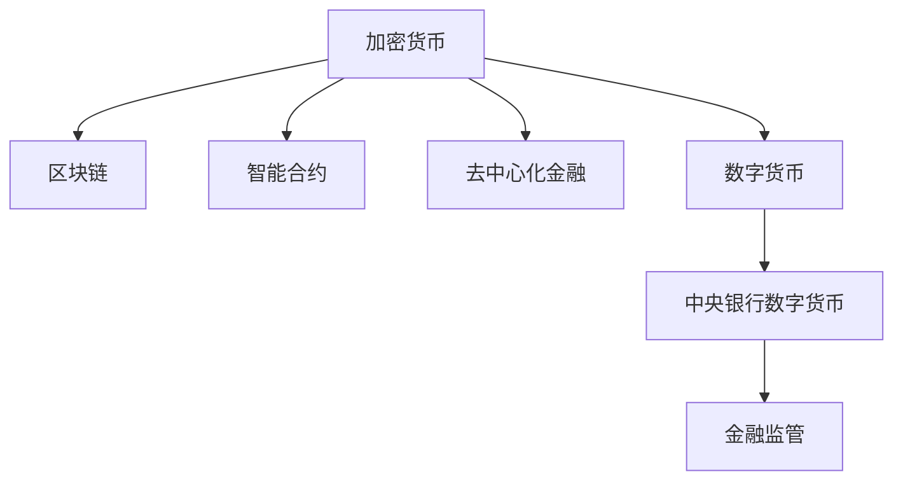

                 

## 1. 背景介绍

### 1.1 问题由来

近年来，随着区块链技术的兴起，加密货币如比特币、以太坊等新型数字货币开始在世界范围内引发关注。尽管加密货币在金融、货币等领域带来了许多创新，但其过度波动、缺乏监管、技术漏洞等问题也引起了广泛争议。

在2050年，随着数字化技术的进一步发展，全球经济和社会形态将发生深刻变革。数字货币将被广泛应用，成为全球通用的新型货币体系。在这一背景下，对现有加密货币体系进行重构，构建一个稳定、安全、可控的数字货币系统，成为当务之急。

### 1.2 问题核心关键点

数字货币体系的构建，需要考虑的关键点包括：

- **货币价值稳定性**：数字货币应具备与传统货币相当的稳定性和可信任度，避免过度的价格波动。
- **隐私与安全**：数字货币交易应确保匿名性和高安全性，防止非法获取和使用。
- **可扩展性**：数字货币系统应具备高效的交易处理能力，满足大规模应用需求。
- **监管合规性**：数字货币应符合国际金融监管要求，确保金融稳定与安全。
- **普适性与互操作性**：数字货币系统应兼容多种货币和支付方式，便于全球使用。

## 2. 核心概念与联系

### 2.1 核心概念概述

为更好地理解未来数字货币体系的设计与重构，本节将介绍几个密切相关的核心概念：

- **加密货币(Crypto-Currency)**：基于区块链技术的去中心化数字货币，如比特币、以太坊等。
- **数字货币(Digital Currency)**：以数字形式存在、流通的货币，包括加密货币和中央银行数字货币(CBDC)。
- **区块链(Blockchain)**：分布式账本技术，确保交易透明、不可篡改。
- **智能合约(Smart Contract)**：自动执行的合约，基于区块链实现自动化金融服务。
- **去中心化金融(DeFi)**：利用区块链技术实现的去中心化金融服务，如去中心化交易所(DEX)、稳定币等。
- **中央银行数字货币(CBDC)**：由中央银行发行和控制的数字货币，具备传统货币的所有功能。

这些核心概念之间的逻辑关系可以通过以下Mermaid流程图来展示：



这个流程图展示了几类数字货币之间的联系：

1. 加密货币利用区块链技术实现去中心化交易和智能合约。
2. 去中心化金融基于智能合约和区块链技术，提供去中心化的金融服务。
3. 数字货币包括加密货币和CBDC，两者都是数字形式的货币。
4. CBDC与传统货币体系兼容，受中央银行监管。

## 3. 核心算法原理 & 具体操作步骤

### 3.1 算法原理概述

未来数字货币体系的设计与重构，将基于以下几个核心算法和理论：

- **分布式共识算法**：如PoW、PoS等，确保数字货币系统的一致性和安全性。
- **隐私保护技术**：如零知识证明、隐私保护交易等，确保用户隐私。
- **可扩展性优化**：如分片、侧链等技术，提升系统处理能力。
- **智能合约设计**：基于Solidity等语言，设计自动化合约以实现去中心化金融服务。

### 3.2 算法步骤详解

未来数字货币体系的构建，一般包括以下几个关键步骤：

**Step 1: 设计分布式共识机制**

- 选择适合的共识算法（如PoW、PoS等），确保区块链系统的安全性。
- 设计共识协议的具体实现，如挖矿规则、奖励机制等。

**Step 2: 开发智能合约**

- 选择合适的智能合约语言（如Solidity、Fantom等），设计自动化的合约功能。
- 实现交易验证、自动化清算、稳定币兑换等功能，提升系统的灵活性。

**Step 3: 设计隐私保护技术**

- 引入零知识证明、隐私币交易等技术，确保用户隐私不被泄露。
- 实现隐私匿名化处理，确保交易数据不被非法获取。

**Step 4: 实现跨链互操作**

- 设计跨链协议，实现不同区块链之间的数据和价值传输。
- 实现跨链共识机制，确保不同区块链系统的一致性。

**Step 5: 构建金融监管框架**

- 设计监管规则，确保数字货币系统符合国际金融监管要求。
- 实现反洗钱(AML)、反恐怖融资(CFT)等监管功能。

**Step 6: 测试与部署**

- 对设计好的数字货币系统进行全面的测试，确保各项功能的正确性和可靠性。
- 在实际环境中部署系统，进行持续监控和维护。

### 3.3 算法优缺点

未来数字货币体系的设计，有以下优点和局限：

**优点**：

- **去中心化**：消除单点故障，提高系统的可靠性和安全性。
- **透明性**：所有交易公开透明，便于监管和审计。
- **效率提升**：利用智能合约和区块链技术，提升交易处理效率。
- **隐私保护**：引入隐私保护技术，确保用户数据安全。

**局限**：

- **技术复杂性**：区块链和智能合约技术复杂，开发难度较大。
- **监管挑战**：如何确保数字货币系统的合规性，面临诸多挑战。
- **能源消耗**：某些共识算法（如PoW）消耗大量能源，环境影响较大。
- **法律问题**：如何确保数字货币系统的法律地位和权益保护，仍需法律界进行深入研究。

### 3.4 算法应用领域

未来数字货币体系将在多个领域得到广泛应用，包括但不限于：

- **金融服务**：包括支付、转账、清算、融资等。
- **供应链管理**：利用智能合约和区块链技术，实现供应链的透明化和自动化。
- **身份认证**：利用数字货币体系中的加密技术和智能合约，实现身份认证和电子凭证管理。
- **公共服务**：如电子投票、公共资金管理等。
- **跨境支付**：实现不同货币之间的快速、低成本转换。
- **物联网**：利用数字货币体系中的智能合约和隐私保护技术，实现物联网设备的自动化管理。

## 4. 数学模型和公式 & 详细讲解  
### 4.1 数学模型构建

未来数字货币体系的设计，涉及到大量的数学模型和算法。以加密货币中的共识算法PoW为例，其核心思想是通过工作量证明（Proof of Work）机制，确保系统的安全性。假设一个矿工节点要挖矿并生成新的区块，需要解决一个数学难题。模型的具体构建如下：

$$
\min_{x} H(x) \mod P = 0
$$

其中，$H(x)$ 表示对输入 $x$ 的哈希值，$P$ 表示目标难度值。通过调整目标难度，可以在保护安全性和处理速度之间取得平衡。

### 4.2 公式推导过程

以PoW的数学模型为基础，我们可以推导其具体实现细节。假设系统中的矿工节点数量为 $N$，每个节点的计算能力为 $C$，单位时间的计算成本为 $c$。则每个节点在单位时间内的平均挖矿效率为：

$$
E = \frac{N \times C}{N \times C + \sum_{i=1}^N \frac{C}{\delta_i}}
$$

其中 $\delta_i$ 表示第 $i$ 个节点的计算效率，即单位时间内能解出的哈希值的数量。假设目标难度为 $P_0$，则每个节点需要消耗的计算量为：

$$
Q = \frac{P_0}{\eta}
$$

其中 $\eta$ 表示系统参数，如哈希算法的复杂度。假设一个区块需要的时间为 $T$，则系统每秒的平均挖矿次数为：

$$
R = \frac{1}{T}
$$

综合以上因素，可以推导出系统每秒的平均计算量为：

$$
Q_0 = Q \times R = \frac{P_0}{\eta T}
$$

根据实际情况，对目标难度进行动态调整，以实现系统的安全性和处理速度的平衡。

### 4.3 案例分析与讲解

以比特币挖矿为例，假设比特币网络每秒产生10个区块，每个区块的大小为1MB，平均每个区块需要7分钟才能生成。则比特币网络的哈希算法复杂度约为 $2^{240}$，目标难度约为 $2^{13}$。假设一个节点每秒能解出1个哈希值，则每个节点需要消耗的计算量为：

$$
Q = \frac{2^{13}}{2^{240} \times 7}
$$

通过调整目标难度，可以实现对系统安全性和处理速度的动态调整。例如，如果将目标难度降低至 $2^{12}$，则每个节点需要消耗的计算量降低至原来的 $\frac{1}{2}$，系统每秒的平均挖矿次数提升至 $\frac{2}{7}$。

## 5. 项目实践：代码实例和详细解释说明

### 5.1 开发环境搭建

在进行数字货币系统的开发前，需要先搭建开发环境。以下是使用Python进行PyTorch和Solidity开发的环境配置流程：

1. 安装Anaconda：从官网下载并安装Anaconda，用于创建独立的Python环境。

2. 创建并激活虚拟环境：
```bash
conda create -n pytorch-env python=3.8 
conda activate pytorch-env
```

3. 安装PyTorch：根据CUDA版本，从官网获取对应的安装命令。例如：
```bash
conda install pytorch torchvision torchaudio cudatoolkit=11.1 -c pytorch -c conda-forge
```

4. 安装Solidity：从官网下载安装Solidity编译器和IDE，如Remix。

5. 安装各类工具包：
```bash
pip install numpy pandas scikit-learn matplotlib tqdm jupyter notebook ipython
```

完成上述步骤后，即可在`pytorch-env`环境中开始数字货币系统的开发。

### 5.2 源代码详细实现

下面我们以智能合约的开发为例，给出使用Solidity进行数字货币系统开发的PyTorch代码实现。

首先，定义智能合约的基本结构：

```solidity
contract ERC20 {
    string public name = "My ERC20 Token";
    string public symbol = "MYT";
    uint8 public decimals = 18;

    event transfer(address indexed _from, address indexed _to, uint256 value);

    mapping(address => uint256) balances;
    mapping(address => mapping(uint256 => uint256)) allowed;

    function tokenOf(address account) public view returns (uint256 balance) {
        return balances[account];
    }

    function balanceOf(address account) public view returns (uint256 balance) {
        return balances[account];
    }

    function transfer(address recipient, uint256 amount) public returns (bool success) {
        require(amount > 0);
        require(balances[msg.sender] >= amount);

        balances[msg.sender] -= amount;
        balances[recipient] += amount;

        emit transfer(msg.sender, recipient, amount);
        return true;
    }

    function approve(address spender, uint256 amount) public returns (bool success) {
        require(amount > 0);
        balances[msg.sender] >= amount);

        allowed[msg.sender][spender] = amount;
        emit approve(msg.sender, spender, amount);
        return true;
    }

    function allowance(address owner, address spender) public view returns (uint256 amount) {
        return allowed[owner][spender];
    }
}
```

然后，在Python环境中，使用Solidity编译器将智能合约转换为字节码：

```python
import solc

# 读取智能合约代码
with open('MyERC20.sol', 'r') as f:
    contract_code = f.read()

# 编译智能合约
compiler_output = solc.compile({'language': 'solidity', 'sources': {'MyERC20.sol': contract_code}})
```

最后，使用智能合约测试框架，如Truffle或Remix，进行测试：

```python
from web3 import Web3

# 连接以太坊测试网络
w3 = Web3(Web3.HTTPProvider('http://127.0.0.1:8545'))

# 部署智能合约
contract_abi = compiler_output['contracts']['MyERC20']['abi']
contract_bytes = compiler_output['contracts']['MyERC20']['bin']
contract_address = w3.eth.deployContract(data=contract_bytes)

# 调用智能合约函数
tx_hash = w3.eth.sendTransaction({'from': w3.eth.accounts[0], 'to': contract_address, 'value': 1e18})
tx_receipt = w3.eth.getTransactionReceipt(tx_hash)

print(tx_receipt)
```

以上就是使用Solidity和Python进行智能合约开发的完整代码实现。可以看到，通过Solidity和PyTorch的结合，我们可以较为便捷地实现数字货币系统的智能合约开发。

### 5.3 代码解读与分析

让我们再详细解读一下关键代码的实现细节：

**ERC20智能合约代码**：
- `tokenOf`和`balanceOf`函数：获取指定地址的余额。
- `transfer`函数：从指定地址转移指定数量的代币到接收者地址。
- `approve`函数：授权指定地址转移指定数量的代币。
- `allowance`函数：获取指定地址的授权余额。

**编译与部署**：
- 使用Solidity编译器将智能合约代码转换为字节码。
- 通过Web3与以太坊测试网络进行交互，部署智能合约，并调用智能合约函数。

通过上述步骤，我们可以在Python环境中，利用Solidity和Web3进行数字货币系统的智能合约开发和测试。

## 6. 实际应用场景

### 6.1 智能合约在供应链中的应用

智能合约可以应用于供应链管理，实现供应链的透明化和自动化。例如，假设一个大型制造企业需要采购大量原材料，可以利用智能合约自动记录采购信息，生成采购订单，并通过区块链技术确保交易的透明性和不可篡改性。

在实际操作中，可以在智能合约中定义采购订单的各个环节，如订单生成、支付、物流等。各方参与者可以根据合约中的规定进行操作，确保交易的合法性和真实性。通过区块链技术，所有交易记录公开透明，便于监管和审计。

### 6.2 数字货币在跨境支付中的应用

数字货币可以应用于跨境支付，实现快速、低成本的跨境转账。以比特币为例，其全球交易网络可以实现跨国汇款，不需要经过银行等中介机构，显著降低了交易成本和时间。

在实际操作中，可以通过数字货币钱包，将比特币从一国转移到另一国。数字货币系统中的智能合约和区块链技术，确保交易的不可篡改性和匿名性，提高了跨境支付的安全性和效率。

### 6.3 数字货币在身份认证中的应用

数字货币可以应用于身份认证，实现电子凭证管理。例如，一个电子票务平台可以利用区块链技术，记录用户的购买信息和身份信息，确保票务的安全性和真实性。

在实际操作中，用户可以通过数字货币钱包购买电子票，智能合约自动记录购买信息。通过区块链技术，所有交易记录公开透明，便于监管和审计。此外，智能合约还可以实现自动验证用户身份，确保交易的真实性。

### 6.4 未来应用展望

随着数字货币体系的不断发展，未来将会在更多领域得到应用，为社会和经济带来新的变革。

在智慧城市治理中，数字货币可以应用于城市事件监测、舆情分析、应急指挥等环节，提高城市管理的自动化和智能化水平，构建更安全、高效的未来城市。

在智能医疗领域，数字货币可以应用于电子病历管理、医疗支付、药品追溯等环节，提升医疗服务的智能化水平，辅助医生诊疗，加速新药开发进程。

在智能教育领域，数字货币可以应用于作业批改、学情分析、知识推荐等方面，因材施教，促进教育公平，提高教学质量。

此外，在企业生产、社会治理、文娱传媒等众多领域，数字货币的应用也将不断涌现，为经济社会发展注入新的动力。

## 7. 工具和资源推荐

### 7.1 学习资源推荐

为了帮助开发者系统掌握数字货币系统的理论基础和实践技巧，这里推荐一些优质的学习资源：

1. 《区块链技术与应用》书籍：全面介绍了区块链技术的原理和应用，适合初学者入门。

2. 《Solidity官方文档》：Solidity官方文档，详细介绍了智能合约的开发和测试方法。

3. 《加密货币技术》在线课程：以太坊官方推出的在线课程，讲解了加密货币的基本原理和开发方法。

4. 《Web3开发指南》书籍：全面介绍了Web3开发的技术和工具，适合开发者系统学习。

5. 《数字货币和区块链》在线课程：Coursera推出的在线课程，讲解了数字货币和区块链的基本原理和应用。

通过对这些资源的学习实践，相信你一定能够快速掌握数字货币系统的精髓，并用于解决实际的金融问题。

### 7.2 开发工具推荐

高效的开发离不开优秀的工具支持。以下是几款用于数字货币系统开发的常用工具：

1. PyTorch：基于Python的开源深度学习框架，灵活动态的计算图，适合快速迭代研究。

2. Solidity：以太坊智能合约开发语言，用于编写自动化的合约逻辑。

3. Remix：以太坊智能合约开发IDE，支持实时编译和测试。

4. Truffle：以太坊智能合约开发框架，支持合约部署、测试和交互。

5. Web3.py：Python以太坊接口，支持与以太坊网络的交互。

6. MetaMask：以太坊钱包，支持数字货币的存储和管理。

合理利用这些工具，可以显著提升数字货币系统的开发效率，加快创新迭代的步伐。

### 7.3 相关论文推荐

数字货币体系的发展源于学界的持续研究。以下是几篇奠基性的相关论文，推荐阅读：

1. 《区块链与数字货币：未来金融体系》：深入探讨区块链和数字货币的未来应用。

2. 《去中心化金融：未来金融的新方向》：讲解去中心化金融的基本原理和应用场景。

3. 《智能合约：区块链的智能合约应用》：介绍智能合约的基本原理和应用实例。

4. 《分布式共识算法：未来区块链的核心技术》：讲解各种分布式共识算法的设计和实现。

5. 《隐私保护技术：数字货币中的隐私保护》：介绍隐私保护技术的基本原理和应用。

6. 《数字货币的法律地位和监管》：探讨数字货币的法律地位和监管要求。

这些论文代表了大数字货币系统的研究进展，通过学习这些前沿成果，可以帮助研究者把握学科前进方向，激发更多的创新灵感。

## 8. 总结：未来发展趋势与挑战

### 8.1 总结

本文对未来数字货币体系的设计与重构进行了全面系统的介绍。首先阐述了数字货币体系的研究背景和意义，明确了数字货币在金融、货币等领域的重要地位。其次，从原理到实践，详细讲解了数字货币系统的核心算法和操作步骤，给出了数字货币系统开发的完整代码实例。同时，本文还广泛探讨了数字货币系统在供应链、跨境支付、身份认证等多个领域的应用前景，展示了数字货币系统的广阔应用空间。此外，本文精选了数字货币系统的各类学习资源，力求为读者提供全方位的技术指引。

通过本文的系统梳理，可以看到，未来数字货币体系正在成为金融和经济领域的重要组成部分，极大地拓展了传统货币体系的应用边界，带来了全新的发展机遇。未来数字货币体系需要在技术创新和应用实践中不断迭代和优化，方能实现更加安全、高效、普适的数字货币系统。

### 8.2 未来发展趋势

展望未来，数字货币体系的发展将呈现以下几个趋势：

1. **去中心化与隐私保护**：未来数字货币体系将更加去中心化和注重隐私保护，确保用户数据的真实性和安全性。

2. **可扩展性与互操作性**：通过跨链技术，实现不同区块链系统之间的互联互通，提升系统的可扩展性和互操作性。

3. **智能化与自动化**：通过智能合约和区块链技术，实现自动化金融服务，提升系统的智能化水平。

4. **合规性与监管**：在数字货币体系的设计中，将充分考虑合规性和监管要求，确保系统的合法性和安全性。

5. **生态系统的构建**：构建完整的数字货币生态系统，包括钱包、交易所、清算系统等，为数字货币系统的广泛应用提供支撑。

以上趋势凸显了未来数字货币体系的广阔前景，需要各方共同努力，推动技术创新和应用实践，实现更加安全、高效、普适的数字货币系统。

### 8.3 面临的挑战

尽管数字货币体系已经取得了显著进展，但在迈向更加智能化、普适化应用的过程中，仍面临诸多挑战：

1. **技术复杂性**：区块链和智能合约技术复杂，开发难度较大，需要进一步简化和优化。

2. **性能瓶颈**：数字货币系统的扩展性和处理能力仍需进一步提升，以应对大规模应用需求。

3. **监管挑战**：如何确保数字货币系统的合规性，需要国际监管机构和法律界的共同努力。

4. **安全问题**：数字货币系统面临的安全问题依然存在，需要进一步加强安全防护措施。

5. **法律问题**：数字货币系统的法律地位和权益保护问题仍需深入研究，需要法律界和业界的共同推动。

6. **能源消耗**：某些共识算法（如PoW）消耗大量能源，需要寻找更加环保的共识算法。

这些挑战需要多方协同努力，共同推动数字货币体系的发展和完善。只有从技术、监管、法律等多个维度共同发力，才能实现更加安全、高效、普适的数字货币系统。

### 8.4 研究展望

面对数字货币体系面临的种种挑战，未来的研究需要在以下几个方面寻求新的突破：

1. **新的共识算法**：寻找更加环保、高效的共识算法，如PoS、DPoS等，减少能源消耗。

2. **智能合约优化**：优化智能合约的设计和实现，提升系统的可扩展性和安全性。

3. **隐私保护技术**：研究新的隐私保护技术，如零知识证明、隐私币交易等，确保用户隐私安全。

4. **跨链互操作**：研究跨链技术，实现不同区块链系统之间的互联互通，提升系统的互操作性。

5. **金融监管机制**：建立完善的金融监管机制，确保数字货币系统的合规性和安全性。

6. **法律保障**：加强数字货币系统的法律保障，明确其法律地位和权益保护。

这些研究方向的探索，必将引领数字货币体系迈向更高的台阶，为构建更加安全、高效、普适的数字货币系统铺平道路。面向未来，数字货币体系的研究还需要与其他技术进行更深入的融合，如物联网、人工智能等，多路径协同发力，共同推动数字货币系统的进步。只有勇于创新、敢于突破，才能不断拓展数字货币体系的应用边界，让数字货币更好地服务于经济和社会发展。

## 9. 附录：常见问题与解答

**Q1：数字货币的稳定性如何保障？**

A: 数字货币的稳定性主要依赖于其分布式共识机制和智能合约设计。通过共识机制确保交易记录的透明性和不可篡改性，通过智能合约自动执行和验证，确保系统的公平性和安全性。同时，数字货币系统可以通过分片、侧链等技术，提升系统的可扩展性和处理能力，确保系统的稳定性和安全性。

**Q2：数字货币如何实现隐私保护？**

A: 数字货币系统可以通过零知识证明、隐私币交易等技术实现隐私保护。零知识证明技术确保用户隐私不被泄露，隐私币交易实现交易的匿名性。此外，数字货币系统还可以通过匿名化处理、隐私合约等方式，进一步增强系统的隐私保护能力。

**Q3：数字货币系统如何处理扩展性和可扩展性？**

A: 数字货币系统可以通过分片、侧链等技术提升系统的可扩展性和处理能力。分片技术将大网络分成多个小网络，提升交易速度和系统容量。侧链技术实现不同区块链系统之间的互联互通，提升系统的互操作性和扩展性。同时，数字货币系统还可以通过优化共识算法、提升计算能力等方法，进一步提升系统的扩展性和处理能力。

**Q4：数字货币系统面临哪些安全问题？**

A: 数字货币系统面临的安全问题包括共识算法漏洞、智能合约漏洞、网络攻击等。共识算法漏洞可能导致共识机制失效，智能合约漏洞可能导致自动化执行错误，网络攻击可能导致交易被篡改或窃取。因此，数字货币系统需要加强安全防护措施，如分布式共识机制、智能合约审计、安全加密算法等，确保系统的安全性。

**Q5：数字货币系统如何实现合规性？**

A: 数字货币系统需要建立完善的金融监管机制，确保系统的合规性和安全性。具体措施包括反洗钱(AML)、反恐怖融资(CFT)等监管功能，确保系统的合法性和安全性。同时，数字货币系统还可以通过智能合约和区块链技术，确保交易的透明性和不可篡改性，便于监管和审计。

通过以上问题的解答，相信你对数字货币系统的设计、开发和应用有了更深入的了解。未来数字货币体系的发展需要各方共同努力，共同推动技术创新和应用实践，实现更加安全、高效、普适的数字货币系统。

