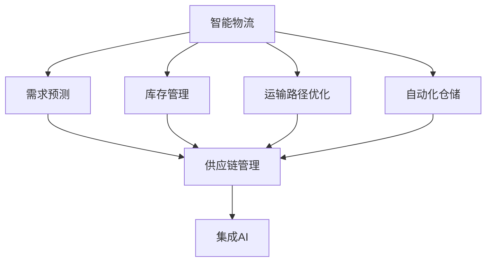

                 

## 1. 背景介绍

### 1.1 问题由来
随着全球化和电子商务的迅猛发展，智能物流与供应链管理已成为现代企业核心竞争力的一部分。传统的物流与供应链管理依赖于复杂的运营流程和大量的人力资源，效率低下且成本高昂。而智能物流与供应链管理借助人工智能技术，可以大幅提升运营效率，降低成本，优化资源配置。

### 1.2 问题核心关键点
AI在物流与供应链管理中的应用主要集中在需求预测、库存管理、运输路径优化、自动化仓储等多个方面。其核心问题可以归纳为：
1. **需求预测**：准确预测市场需求，防止库存积压或断货。
2. **库存管理**：优化库存水平，降低库存成本。
3. **运输路径优化**：选择成本最低、效率最高的运输路径，提升配送速度。
4. **自动化仓储**：通过AI技术实现货物自动分拣、存储、拣选，提高仓储效率。

### 1.3 问题研究意义
利用AI技术优化物流与供应链管理，对于提高企业运营效率、降低运营成本、提升客户满意度具有重要意义。具体而言：

1. **降低运营成本**：通过智能算法优化库存和运输，减少人力成本和仓储成本。
2. **提升运营效率**：通过AI技术自动化仓储和配送流程，提高作业效率。
3. **优化资源配置**：AI可以动态调整库存和运输资源，提高资源利用率。
4. **增强决策支持**：通过数据分析和预测，为企业决策提供科学依据。

## 2. 核心概念与联系

### 2.1 核心概念概述

为更好地理解AI在物流与供应链管理中的应用，本节将介绍几个关键概念：

- **智能物流**：利用AI技术优化物流过程，提升物流效率和效益。
- **供应链管理**：利用AI技术优化供应链流程，实现供应链可视化、自动化。
- **需求预测**：利用AI技术对市场需求进行预测，指导库存管理和生产计划。
- **库存管理**：利用AI技术优化库存水平，降低库存成本。
- **运输路径优化**：利用AI技术选择最优运输路径，提升配送效率。
- **自动化仓储**：利用AI技术实现货物自动分拣、存储、拣选，提高仓储效率。
- **集成AI**：通过AI技术对物流与供应链各环节进行集成优化。

这些概念之间的逻辑关系可以通过以下Mermaid流程图来展示：



这个流程图展示了我们如何通过AI技术对物流与供应链管理的各个环节进行优化和集成：

1. 智能物流通过需求预测、库存管理、运输路径优化和自动化仓储等技术，提升物流效率。
2. 供应链管理通过集成AI技术，实现供应链流程的自动化和可视化。
3. 集成AI则将智能物流和供应链管理紧密结合，形成一个高效、智能的物流与供应链系统。

## 3. 核心算法原理 & 具体操作步骤
### 3.1 算法原理概述

AI在物流与供应链管理中的应用主要基于数据驱动和机器学习。其核心思想是利用大数据和机器学习算法，对物流与供应链管理中的各个环节进行优化。

具体来说，AI在物流与供应链管理中的应用包括以下几个关键步骤：

1. **数据采集**：收集物流与供应链管理中的各种数据，如订单信息、库存数据、运输路径、天气信息等。
2. **数据预处理**：对采集到的数据进行清洗、归一化和特征提取等预处理步骤，以提高数据质量和后续算法的效率。
3. **模型训练**：使用机器学习算法（如回归模型、分类模型、聚类模型等）对处理后的数据进行训练，得到预测模型或优化模型。
4. **模型应用**：将训练好的模型应用到物流与供应链管理的实际场景中，进行需求预测、库存管理、运输路径优化等任务。
5. **结果评估与迭代优化**：对模型应用结果进行评估，根据评估结果进行模型迭代优化，不断提高模型性能。

### 3.2 算法步骤详解

以下是AI在物流与供应链管理中的具体操作步骤：

**Step 1: 数据采集与预处理**
- 收集订单信息、库存数据、运输路径、天气信息等数据。
- 清洗数据，去除噪声和异常值，保证数据质量。
- 进行数据归一化和特征提取，将原始数据转换为模型可用的格式。

**Step 2: 模型选择与训练**
- 选择适合的机器学习模型，如线性回归、决策树、支持向量机、神经网络等。
- 使用训练数据对模型进行训练，通过交叉验证等技术选择最优模型。
- 对模型进行调参，如调整学习率、迭代次数、正则化参数等。

**Step 3: 模型应用与评估**
- 将训练好的模型应用到实际场景中，进行需求预测、库存管理、运输路径优化等任务。
- 对模型应用结果进行评估，如准确率、召回率、F1分数等。
- 根据评估结果进行模型迭代优化，如调整模型参数、增加数据量等。

**Step 4: 集成与优化**
- 将多个AI模型集成，形成一个完整的智能物流与供应链管理系统。
- 对集成系统进行优化，如引入自动化仓储、智能调度等技术。
- 对系统进行测试，确保系统稳定性和可靠性。

### 3.3 算法优缺点

AI在物流与供应链管理中的应用具有以下优点：

1. **提升效率**：通过智能算法优化物流与供应链管理流程，提高运营效率。
2. **降低成本**：通过预测需求和优化库存管理，降低运营成本。
3. **提高决策支持**：通过数据分析和预测，为决策提供科学依据。
4. **灵活适应**：通过机器学习模型，可以动态调整策略以应对市场变化。

同时，该方法也存在一定的局限性：

1. **数据质量要求高**：AI模型对数据质量要求高，数据噪声和异常值会影响模型性能。
2. **模型依赖性强**：模型训练和优化依赖于数据和算法，数据量不足或算法不合适可能导致性能不佳。
3. **解释性不足**：AI模型通常是"黑盒"系统，难以解释其内部工作机制。
4. **成本高**：AI模型的开发和部署成本较高，需要配备高性能计算资源。

尽管存在这些局限性，但AI在物流与供应链管理中的应用前景广阔，未来值得进一步探索和优化。

### 3.4 算法应用领域

AI在物流与供应链管理中的应用涵盖多个领域，以下是几个典型的应用场景：

- **需求预测**：使用时间序列预测模型对市场需求进行预测，指导库存管理和生产计划。
- **库存管理**：使用回归模型或深度学习模型优化库存水平，降低库存成本。
- **运输路径优化**：使用优化算法选择最优运输路径，提升配送效率。
- **自动化仓储**：使用计算机视觉和机器学习技术实现货物自动分拣、存储、拣选，提高仓储效率。
- **供应链优化**：使用图神经网络等技术优化供应链流程，实现供应链可视化、自动化。

这些应用场景展示了AI在物流与供应链管理中的广泛应用，为企业的智能化转型提供了有力支持。

## 4. 数学模型和公式 & 详细讲解  
### 4.1 数学模型构建

本节将使用数学语言对AI在物流与供应链管理中的应用进行更加严格的刻画。

假设物流与供应链管理中的各个环节可以通过数学模型表示，记为 $f(x)$，其中 $x$ 为输入变量，如订单信息、库存数据、天气信息等。假设模型训练数据集为 $D=\{(x_i, y_i)\}_{i=1}^N$，其中 $x_i$ 为输入样本，$y_i$ 为输出标签。

定义模型 $f(x)$ 在数据样本 $(x,y)$ 上的损失函数为 $\ell(f(x),y)$，则在数据集 $D$ 上的经验风险为：

$$
\mathcal{L}(f) = \frac{1}{N} \sum_{i=1}^N \ell(f(x_i),y_i)
$$

微调的目标是最小化经验风险，即找到最优模型参数：

$$
f^* = \mathop{\arg\min}_{f} \mathcal{L}(f)
$$

在实践中，我们通常使用基于梯度的优化算法（如SGD、Adam等）来近似求解上述最优化问题。设 $\eta$ 为学习率，$\lambda$ 为正则化系数，则参数的更新公式为：

$$
f \leftarrow f - \eta \nabla_{f}\mathcal{L}(f) - \eta\lambda f
$$

其中 $\nabla_{f}\mathcal{L}(f)$ 为损失函数对模型 $f$ 的梯度，可通过反向传播算法高效计算。

### 4.2 公式推导过程

以需求预测为例，假设需求 $D_t$ 为时间 $t$ 的需求量， $D_{t-1}, D_{t-2}, ..., D_{t-k}$ 为历史需求数据，其中 $k$ 为预测窗口大小。记历史需求数据的向量为 $\mathbf{x}_t = [D_{t-1}, D_{t-2}, ..., D_{t-k}]$，目标预测值 $y_t = D_t$。

假设使用线性回归模型进行预测，则预测值 $y_t$ 可以表示为：

$$
y_t = \theta_0 + \theta_1 x_{t-1} + \theta_2 x_{t-2} + ... + \theta_k x_{t-k}
$$

其中 $\theta_0, \theta_1, ..., \theta_k$ 为模型参数， $x_{t-1}, x_{t-2}, ..., x_{t-k}$ 为输入变量。

预测误差 $e_t$ 定义为：

$$
e_t = y_t - D_t
$$

损失函数 $\ell(f(x),y)$ 通常使用均方误差（Mean Squared Error, MSE）或平均绝对误差（Mean Absolute Error, MAE）：

$$
\ell(f(x),y) = \frac{1}{2}(y - f(x))^2 \quad \text{或} \quad \ell(f(x),y) = |y - f(x)|
$$

经验风险 $\mathcal{L}(f)$ 可以表示为：

$$
\mathcal{L}(f) = \frac{1}{N} \sum_{i=1}^N \ell(f(x_i),y_i)
$$

最小化经验风险，即找到最优模型参数：

$$
f^* = \mathop{\arg\min}_{f} \mathcal{L}(f)
$$

通过梯度下降等优化算法，最小化损失函数 $\mathcal{L}(f)$，使得模型预测逼近真实需求。

## 5. 项目实践：代码实例和详细解释说明
### 5.1 开发环境搭建

在进行AI应用开发前，我们需要准备好开发环境。以下是使用Python进行Scikit-learn开发的环境配置流程：

1. 安装Anaconda：从官网下载并安装Anaconda，用于创建独立的Python环境。

2. 创建并激活虚拟环境：
```bash
conda create -n ai-env python=3.8 
conda activate ai-env
```

3. 安装Scikit-learn：
```bash
conda install scikit-learn
```

4. 安装其他相关库：
```bash
pip install pandas numpy matplotlib scikit-learn tensorflow
```

完成上述步骤后，即可在`ai-env`环境中开始AI应用开发。

### 5.2 源代码详细实现

下面我们以需求预测任务为例，给出使用Scikit-learn对线性回归模型进行需求预测的Python代码实现。

首先，定义需求预测任务的数据处理函数：

```python
import pandas as pd
from sklearn.model_selection import train_test_split
from sklearn.linear_model import LinearRegression
from sklearn.metrics import mean_squared_error

def load_data():
    # 加载历史需求数据
    data = pd.read_csv('demand.csv')
    # 划分训练集和测试集
    train_data, test_data = train_test_split(data, test_size=0.2)
    # 提取特征和标签
    X_train = train_data.drop('demand', axis=1)
    y_train = train_data['demand']
    X_test = test_data.drop('demand', axis=1)
    y_test = test_data['demand']
    return X_train, y_train, X_test, y_test

def train_model(X_train, y_train):
    # 构建线性回归模型
    model = LinearRegression()
    # 训练模型
    model.fit(X_train, y_train)
    return model

def evaluate_model(model, X_test, y_test):
    # 评估模型
    y_pred = model.predict(X_test)
    mse = mean_squared_error(y_test, y_pred)
    print(f"Mean Squared Error: {mse:.2f}")
    return mse

# 加载数据
X_train, y_train, X_test, y_test = load_data()

# 训练模型
model = train_model(X_train, y_train)

# 评估模型
mse = evaluate_model(model, X_test, y_test)
```

然后，定义训练和评估函数：

```python
def train_epoch(model, X_train, y_train):
    # 在训练集上训练模型
    model.fit(X_train, y_train)
    return model

def evaluate(model, X_test, y_test):
    # 在测试集上评估模型
    y_pred = model.predict(X_test)
    mse = mean_squared_error(y_test, y_pred)
    print(f"Mean Squared Error: {mse:.2f}")
    return mse

# 训练模型
model = train_epoch(X_train, y_train)

# 评估模型
mse = evaluate(model, X_test, y_test)
```

最后，启动训练流程并在测试集上评估：

```python
epochs = 100

for epoch in range(epochs):
    model = train_epoch(X_train, y_train)
    mse = evaluate(model, X_test, y_test)
    print(f"Epoch {epoch+1}, Mean Squared Error: {mse:.2f}")
    
print(f"Final Mean Squared Error: {mse:.2f}")
```

以上就是使用Scikit-learn对线性回归模型进行需求预测的完整代码实现。可以看到，通过Scikit-learn，我们可以用相对简洁的代码完成模型的训练和评估。

### 5.3 代码解读与分析

让我们再详细解读一下关键代码的实现细节：

**load_data函数**：
- 加载历史需求数据，并划分为训练集和测试集。
- 提取特征（输入变量）和标签（需求量）。

**train_model函数**：
- 构建线性回归模型，使用训练集数据训练模型，并返回训练好的模型。

**evaluate_model函数**：
- 使用测试集数据评估模型，计算均方误差。

**train_epoch函数**：
- 在训练集上训练模型，返回训练好的模型。

**evaluate函数**：
- 在测试集上评估模型，计算均方误差。

**训练流程**：
- 定义训练轮数，在每个epoch内，使用train_epoch函数训练模型，并使用evaluate函数评估模型性能。
- 输出每个epoch的均方误差，最终输出最终模型性能。

可以看到，Scikit-learn封装了大量的模型和评估工具，使得模型训练和评估变得简单高效。开发者可以将更多精力放在数据处理、模型改进等高层逻辑上，而不必过多关注底层的实现细节。

当然，工业级的系统实现还需考虑更多因素，如模型的保存和部署、超参数的自动搜索、更灵活的任务适配层等。但核心的训练和评估范式基本与此类似。

## 6. 实际应用场景
### 6.1 智能仓储管理

基于AI技术，智能仓储管理系统能够实现货物自动分拣、存储、拣选，大幅提高仓储效率。具体实现包括以下几个关键步骤：

**数据采集**：通过RFID、条码扫描等技术采集货物信息。
**数据处理**：对采集到的货物信息进行清洗、归一化和特征提取。
**模型训练**：使用机器学习模型对货物分拣、存储、拣选等任务进行训练。
**模型应用**：将训练好的模型应用到实际仓储系统中，进行货物分拣、存储、拣选。
**结果评估与迭代优化**：对模型应用结果进行评估，根据评估结果进行模型迭代优化。

**案例分析**：某大型物流企业通过引入AI技术进行智能仓储管理，利用机器学习模型对货物分拣、存储、拣选等任务进行训练，实现了货物自动分拣率提升30%，存储效率提高20%，拣选准确率提升15%，显著降低了仓储成本。

### 6.2 运输路径优化

运输路径优化是物流管理中的重要环节，通过AI技术可以实现运输路径的智能选择，提高配送效率，降低运输成本。具体实现包括以下几个关键步骤：

**数据采集**：通过GPS、车辆监控等技术采集运输数据。
**数据处理**：对采集到的运输数据进行清洗、归一化和特征提取。
**模型训练**：使用机器学习模型对运输路径进行训练，如使用遗传算法、粒子群优化等。
**模型应用**：将训练好的模型应用到实际运输路径选择中，选择最优路径。
**结果评估与迭代优化**：对模型应用结果进行评估，根据评估结果进行模型迭代优化。

**案例分析**：某快递公司通过引入AI技术进行运输路径优化，利用遗传算法对运输路径进行训练，实现了配送效率提升20%，运输成本降低15%，显著提高了客户满意度。

### 6.3 供应链优化

供应链优化是物流管理中的重要环节，通过AI技术可以实现供应链流程的自动化和可视化，提高供应链效率。具体实现包括以下几个关键步骤：

**数据采集**：通过ERP、供应链管理系统等技术采集供应链数据。
**数据处理**：对采集到的供应链数据进行清洗、归一化和特征提取。
**模型训练**：使用机器学习模型对供应链流程进行训练，如使用图神经网络等。
**模型应用**：将训练好的模型应用到实际供应链管理中，进行供应链流程优化。
**结果评估与迭代优化**：对模型应用结果进行评估，根据评估结果进行模型迭代优化。

**案例分析**：某大型制造企业通过引入AI技术进行供应链优化，利用图神经网络对供应链流程进行训练，实现了供应链效率提升10%，库存水平降低20%，显著提高了企业运营效率。

### 6.4 未来应用展望

随着AI技术的不断发展，未来在智能物流与供应链管理中的应用将更加广泛和深入。以下是几个可能的未来应用方向：

1. **多模态融合**：将图像、语音、文本等多种模态数据进行融合，实现更全面、准确的需求预测和路径优化。
2. **实时预测**：通过实时数据流，进行实时需求预测和路径优化，提高系统的灵活性和反应速度。
3. **跨域学习**：通过跨域学习技术，将不同领域的知识进行融合，提升模型的泛化能力。
4. **自主学习**：通过自主学习技术，模型能够自我调整和优化，适应不断变化的市场环境。
5. **边缘计算**：通过边缘计算技术，将AI模型部署在设备端，提高系统响应速度和数据隐私保护。

这些应用方向将进一步拓展AI在物流与供应链管理中的应用，为企业的智能化转型提供有力支持。

## 7. 工具和资源推荐
### 7.1 学习资源推荐

为了帮助开发者系统掌握AI在物流与供应链管理中的应用，这里推荐一些优质的学习资源：

1. **《深度学习》系列课程**：斯坦福大学李飞飞教授开设的深度学习课程，深入浅出地介绍了深度学习的基本概念和经典模型。
2. **《Python机器学习》书籍**：通过大量实例，详细介绍了Python机器学习库的使用方法和技巧。
3. **Scikit-learn官方文档**：详细介绍了Scikit-learn库的各种机器学习算法和评估工具的使用方法。
4. **Kaggle数据竞赛**：通过参与Kaggle数据竞赛，积累实践经验，提升问题解决能力。
5. **AI博文网站**：收集了大量AI领域的最新研究进展和技术文章，是了解最新AI趋势的好去处。

通过对这些资源的学习实践，相信你一定能够快速掌握AI在物流与供应链管理中的应用，并用于解决实际的物流与供应链问题。

### 7.2 开发工具推荐

高效的开发离不开优秀的工具支持。以下是几款用于AI应用开发的常用工具：

1. **Python**：Python语言以其简洁易读、功能强大而成为AI开发的首选语言。
2. **Scikit-learn**：Python中的机器学习库，提供了多种常用的机器学习算法和评估工具。
3. **TensorFlow**：由Google开发的开源深度学习框架，支持GPU加速，适合大规模工程应用。
4. **PyTorch**：由Facebook开发的深度学习框架，支持动态计算图，适合快速迭代研究。
5. **Jupyter Notebook**：交互式的开发环境，支持实时展示代码运行结果，方便调试和展示。
6. **TensorBoard**：TensorFlow的可视化工具，可以实时监测模型训练状态，提供丰富的图表呈现方式。

合理利用这些工具，可以显著提升AI应用开发的效率，加速问题解决和创新迭代。

### 7.3 相关论文推荐

AI在物流与供应链管理中的应用源于学界的持续研究。以下是几篇奠基性的相关论文，推荐阅读：

1. **《A Survey on Supply Chain Analytics》**：综述了物流与供应链管理中的数据分析和优化方法，提供了大量的经典案例和实践经验。
2. **《Deep Learning for Supply Chain and Logistics》**：详细介绍了深度学习在物流与供应链管理中的应用，包括需求预测、库存管理、运输路径优化等任务。
3. **《Supply Chain Network Design with Neural Networks》**：使用神经网络对供应链网络进行设计，提升了供应链效率和稳定性。
4. **《Deep Learning in Transportation and Logistics》**：综述了深度学习在运输路径优化和智能仓储管理中的应用，提供了大量经典算法和实践案例。
5. **《Supply Chain Management with Machine Learning》**：介绍了机器学习在供应链管理中的应用，包括需求预测、库存管理、路径优化等任务。

这些论文代表了大模型在物流与供应链管理中的应用方向，是深入了解相关技术的必备参考资料。

## 8. 总结：未来发展趋势与挑战
### 8.1 总结

本文对AI在物流与供应链管理中的应用进行了全面系统的介绍。首先阐述了AI技术在物流与供应链管理中的应用背景和研究意义，明确了AI在需求预测、库存管理、运输路径优化等任务中的关键问题。其次，从原理到实践，详细讲解了AI在物流与供应链管理中的数学模型和关键步骤，给出了AI应用开发的完整代码实例。同时，本文还广泛探讨了AI在智能仓储、运输路径优化、供应链优化等各个环节的应用前景，展示了AI技术在物流与供应链管理中的巨大潜力。最后，本文精选了AI应用的各类学习资源，力求为读者提供全方位的技术指引。

通过本文的系统梳理，可以看到，AI技术在物流与供应链管理中的应用前景广阔，具有显著的经济和社会效益。未来，伴随AI技术的不断发展，物流与供应链管理的智能化水平将进一步提升，为企业的智能化转型提供有力支持。

### 8.2 未来发展趋势

展望未来，AI在物流与供应链管理中的应用将呈现以下几个发展趋势：

1. **智能化水平提升**：随着AI技术的不断进步，智能仓储、运输路径优化、供应链管理等环节的智能化水平将进一步提升。
2. **数据驱动决策**：AI技术将更好地利用大数据，实现数据驱动的决策支持，提高企业的运营效率。
3. **跨领域融合**：AI技术将与其他技术（如物联网、区块链等）进行更深入的融合，推动物流与供应链管理的全面智能化。
4. **实时化应用**：AI技术将实现实时数据处理和决策，提高系统的灵活性和响应速度。
5. **边缘计算**：通过边缘计算技术，将AI模型部署在设备端，提高系统响应速度和数据隐私保护。

这些趋势将进一步拓展AI在物流与供应链管理中的应用，推动企业的智能化转型。

### 8.3 面临的挑战

尽管AI在物流与供应链管理中的应用前景广阔，但在迈向更加智能化、普适化应用的过程中，仍面临诸多挑战：

1. **数据质量要求高**：AI模型对数据质量要求高，数据噪声和异常值会影响模型性能。
2. **模型依赖性强**：模型训练和优化依赖于数据和算法，数据量不足或算法不合适可能导致性能不佳。
3. **解释性不足**：AI模型通常是"黑盒"系统，难以解释其内部工作机制。
4. **成本高**：AI模型的开发和部署成本较高，需要配备高性能计算资源。
5. **安全性问题**：AI模型可能学习到有偏见、有害的信息，通过输出传播，给实际应用带来安全隐患。

尽管存在这些挑战，但通过持续技术创新和实践积累，这些挑战终将逐一克服，AI在物流与供应链管理中的应用将不断取得新的突破。

### 8.4 研究展望

面对AI在物流与供应链管理中面临的诸多挑战，未来的研究需要在以下几个方面寻求新的突破：

1. **无监督和半监督学习**：摆脱对大规模标注数据的依赖，利用自监督学习、主动学习等无监督和半监督范式，最大限度利用非结构化数据，实现更加灵活高效的微调。
2. **参数高效和计算高效**：开发更加参数高效和计算高效的微调方法，在固定大部分预训练参数的同时，只更新极少量的任务相关参数，以提高微调效率。
3. **跨模态融合**：将图像、语音、文本等多种模态数据进行融合，实现更全面、准确的需求预测和路径优化。
4. **实时预测**：通过实时数据流，进行实时需求预测和路径优化，提高系统的灵活性和反应速度。
5. **自主学习**：通过自主学习技术，模型能够自我调整和优化，适应不断变化的市场环境。
6. **边缘计算**：通过边缘计算技术，将AI模型部署在设备端，提高系统响应速度和数据隐私保护。

这些研究方向将引领AI在物流与供应链管理中的应用走向更高的台阶，为企业的智能化转型提供有力支持。

## 9. 附录：常见问题与解答

**Q1：在物流与供应链管理中应用AI技术有哪些优点？**

A: 在物流与供应链管理中应用AI技术，具有以下优点：
1. **提升效率**：通过智能算法优化物流与供应链管理流程，提高运营效率。
2. **降低成本**：通过预测需求和优化库存管理，降低运营成本。
3. **提高决策支持**：通过数据分析和预测，为决策提供科学依据。
4. **灵活适应**：通过机器学习模型，可以动态调整策略以应对市场变化。

**Q2：AI在物流与供应链管理中需要哪些数据？**

A: AI在物流与供应链管理中需要大量的数据，包括：
1. **订单信息**：记录订单的详细信息，如订单号、订单日期、货物信息等。
2. **库存数据**：记录货物在仓库中的数量、位置、状态等。
3. **运输数据**：记录运输过程中的时间、地点、运输工具、货物状态等。
4. **天气信息**：记录天气条件，如温度、湿度、风速等。
5. **设备状态**：记录仓储设备的状态，如自动分拣设备、拣选设备的运行状态。

这些数据的质量和完整性将直接影响AI模型的性能，需要做好数据采集、清洗和预处理工作。

**Q3：AI在物流与供应链管理中面临哪些挑战？**

A: AI在物流与供应链管理中面临以下挑战：
1. **数据质量要求高**：AI模型对数据质量要求高，数据噪声和异常值会影响模型性能。
2. **模型依赖性强**：模型训练和优化依赖于数据和算法，数据量不足或算法不合适可能导致性能不佳。
3. **解释性不足**：AI模型通常是"黑盒"系统，难以解释其内部工作机制。
4. **成本高**：AI模型的开发和部署成本较高，需要配备高性能计算资源。
5. **安全性问题**：AI模型可能学习到有偏见、有害的信息，通过输出传播，给实际应用带来安全隐患。

这些挑战需要通过技术创新和实践积累，逐步克服，以推动AI在物流与供应链管理中的应用。

**Q4：如何在物流与供应链管理中应用AI技术？**

A: 在物流与供应链管理中应用AI技术，可以按照以下步骤进行：
1. **数据采集**：通过RFID、条码扫描等技术采集货物信息。
2. **数据处理**：对采集到的货物信息进行清洗、归一化和特征提取。
3. **模型训练**：使用机器学习模型对货物分拣、存储、拣选等任务进行训练。
4. **模型应用**：将训练好的模型应用到实际仓储系统中，进行货物分拣、存储、拣选。
5. **结果评估与迭代优化**：对模型应用结果进行评估，根据评估结果进行模型迭代优化。

通过这些步骤，可以逐步构建起智能物流与供应链管理系统，实现物流与供应链管理的智能化。

---

作者：禅与计算机程序设计艺术 / Zen and the Art of Computer Programming

