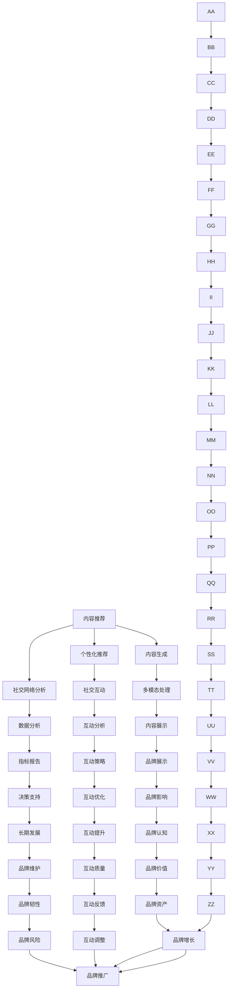

                 

# 开发个人品牌AI助手：提供智能化服务

在当今数字化时代，个人品牌建设的重要性日益凸显。AI助手的出现，为个人品牌打造提供了智能化的工具和平台。本文将深入探讨如何开发一个高效、智能的AI助手，以提升个人品牌的影响力和价值。

## 1. 背景介绍

### 1.1 问题由来
随着社交媒体、博客、视频等在线平台的兴起，个人品牌建设变得前所未有的便捷。然而，如何有效管理和展示个人品牌，尤其是面对海量信息时，仍然是一个挑战。传统的个人品牌管理方式往往耗费大量时间和精力，且缺乏系统化、智能化。

### 1.2 问题核心关键点
开发一个高效的个人品牌AI助手，可以通过智能推荐、内容创作、社交互动等多种方式，帮助个人品牌主更加高效、精准地管理其在线形象和声誉。以下是构建AI助手的核心要点：

1. **内容推荐与生成**：利用机器学习技术，推荐高质量的相关内容，自动生成高质量的博文、文章、视频等。
2. **社交互动**：通过智能分析，建议最佳的互动时机和内容，提高社交媒体上的活跃度和互动率。
3. **数据分析**：收集、分析个人品牌相关数据，提供关键指标和趋势报告，帮助品牌主做出更明智的决策。
4. **多模态处理**：支持文本、图片、视频等多种内容形式的自动处理和分析，提升品牌展示的多样性和丰富性。

### 1.3 问题研究意义
开发一个智能化的个人品牌AI助手，能够显著提高个人品牌管理的效率和效果，使品牌主能够专注于内容的创新和提升，而不必在繁琐的日常管理上浪费过多时间。同时，AI助手的引入，还能提升品牌主在社交媒体上的互动质量和影响力，促进品牌的持续成长。

## 2. 核心概念与联系

### 2.1 核心概念概述

- **AI助手**：基于人工智能技术的智能助手，能够执行各种自动化任务，如内容创作、社交互动分析、数据分析等。
- **个性化推荐**：根据用户兴趣和行为，推荐相关内容或活动，提升用户体验和满意度。
- **内容生成**：利用自然语言处理和生成技术，自动创作高质量的文本、图片、视频等。
- **社交网络分析**：通过对社交媒体数据的分析，提供关于品牌互动的洞察和建议。
- **多模态处理**：支持多种数据类型的输入和输出，提供更全面的品牌展示。

这些核心概念之间相互联系，共同构成了一个智能化的个人品牌AI助手的整体框架。

### 2.2 核心概念原理和架构的 Mermaid 流程图



这个流程图展示了AI助手实现的核心步骤和功能模块之间的联系。内容推荐、内容生成、社交网络分析、多模态处理、数据分析等模块相互配合，共同支撑AI助手的智能决策和执行。

## 3. 核心算法原理 & 具体操作步骤

### 3.1 算法原理概述

开发一个高效的个人品牌AI助手，通常需要以下步骤：

1. **数据收集与预处理**：收集个人品牌主在各种平台上的数据，如社交媒体互动、内容发布、用户反馈等，并进行数据清洗和预处理。
2. **特征提取与建模**：利用机器学习算法，提取用户行为、兴趣、互动质量等关键特征，构建用户模型。
3. **模型训练与优化**：通过大量的历史数据，训练推荐模型、内容生成模型、社交互动分析模型等，并不断优化模型性能。
4. **智能决策与执行**：根据实时数据和用户模型，智能决策并执行相应的自动化任务，如内容推荐、互动策略、数据分析等。

### 3.2 算法步骤详解

以下是详细的操作步骤：

**Step 1: 数据收集与预处理**

- **社交媒体数据**：从各大社交平台抓取用户互动数据，如评论、点赞、分享等。
- **内容发布数据**：收集用户发布的文章、视频、图片等。
- **用户反馈数据**：收集用户对内容的评论、评分、回复等。

- **数据清洗**：去除噪声数据、处理缺失值、去除重复数据等。
- **数据标准化**：对时间、地理位置、用户属性等进行标准化处理。

**Step 2: 特征提取与建模**

- **用户兴趣建模**：利用协同过滤、TF-IDF等方法，提取用户对不同内容的兴趣度。
- **内容质量建模**：利用情感分析、关键词提取等技术，评估内容的吸引力和价值。
- **社交互动分析**：通过网络分析、情感分析等方法，提取用户社交互动的质量和模式。

**Step 3: 模型训练与优化**

- **推荐模型训练**：利用协同过滤、深度学习等方法，训练推荐模型。
- **内容生成模型训练**：利用生成对抗网络(GAN)、序列生成模型等方法，训练内容生成模型。
- **社交互动模型训练**：利用深度学习模型，训练社交互动分析模型。

- **模型优化**：通过交叉验证、超参数调优等方法，优化模型性能。

**Step 4: 智能决策与执行**

- **内容推荐**：根据用户模型和实时数据，推荐高质量的内容。
- **内容创作**：自动生成符合用户兴趣和平台规则的内容。
- **社交互动分析**：分析用户的社交互动模式，提供最佳互动策略。
- **数据分析**：提供关键指标和趋势报告，帮助品牌主做出决策。

### 3.3 算法优缺点

**优点**：

- **自动化程度高**：能够自动执行各种任务，节省品牌主的时间和精力。
- **个性化推荐**：根据用户行为和兴趣，提供个性化内容推荐，提升用户体验。
- **内容生成能力强**：能够自动创作高质量内容，满足品牌主的多样化需求。
- **数据分析精确**：提供精准的数据分析和报告，帮助品牌主做出明智决策。

**缺点**：

- **数据隐私问题**：需要收集和处理大量用户数据，涉及隐私保护和数据安全。
- **模型复杂度较高**：需要构建多个模型，增加了算法实现和维护的复杂性。
- **依赖高质量数据**：需要高质量、多样化的数据来训练模型，数据质量不足会影响模型效果。

### 3.4 算法应用领域

AI助手的应用领域非常广泛，包括但不限于：

- **社交媒体管理**：自动推荐内容、分析互动质量、提供互动策略。
- **内容创作**：自动生成文章、视频、图片等，提升内容质量。
- **数据分析**：收集、分析用户数据，提供关键指标和趋势报告。
- **品牌推广**：通过智能分析和推荐，提升品牌曝光率和影响力。
- **客户互动**：通过智能推荐和互动分析，提升客户满意度和忠诚度。

## 4. 数学模型和公式 & 详细讲解 & 举例说明

### 4.1 数学模型构建

本节将使用数学语言对AI助手的关键模型进行详细构建。

- **协同过滤推荐模型**：$R_{ij} \sim \text{Beta}(\alpha_i, \beta_j)$，其中 $R_{ij}$ 为用户 $i$ 对物品 $j$ 的评分，$\alpha_i$ 和 $\beta_j$ 为模型参数。
- **深度学习推荐模型**：$h_{ij} = W_1 h_{i-1} + W_2 x_j + b$，其中 $h_{ij}$ 为模型输出，$W_1, W_2, b$ 为模型参数。
- **生成对抗网络内容生成模型**：$z \sim N(0, I)$，$x = D(z)$，其中 $z$ 为噪声向量，$x$ 为生成内容。

### 4.2 公式推导过程

**协同过滤推荐模型推导**：

$$
R_{ij} \sim \text{Beta}(\alpha_i, \beta_j)
$$

其中 $\alpha_i$ 和 $\beta_j$ 为模型参数，反映了用户 $i$ 和物品 $j$ 的兴趣度。根据贝叶斯定理，可以推导出推荐模型的预测概率：

$$
\hat{R}_{ij} = \frac{\alpha_i \beta_j}{\alpha_i \beta_j + \sum_{k=1}^K \alpha_k \beta_k}
$$

**深度学习推荐模型推导**：

$$
h_{ij} = W_1 h_{i-1} + W_2 x_j + b
$$

其中 $W_1, W_2, b$ 为模型参数，$h_{i-1}$ 为前一层的输出，$x_j$ 为物品 $j$ 的特征向量。通过反向传播算法，可以更新模型参数，最小化预测误差。

**生成对抗网络内容生成模型推导**：

$$
z \sim N(0, I)
$$

其中 $z$ 为噪声向量，服从标准正态分布。生成网络 $G$ 将噪声向量 $z$ 映射为内容 $x$，判别网络 $D$ 判断 $x$ 的真实性。通过对抗训练，优化生成网络和判别网络，使得 $D(G(z))$ 最大化，即生成的内容尽可能难以被区分。

### 4.3 案例分析与讲解

**推荐系统案例**：
- **数据来源**：来自社交媒体平台的用户互动数据。
- **模型选择**：协同过滤模型和深度学习模型。
- **训练流程**：使用历史互动数据训练模型，进行交叉验证和超参数调优。
- **测试与评估**：使用测试集评估模型效果，计算平均绝对误差(MAE)和均方根误差(RMSE)。

**内容生成系统案例**：
- **数据来源**：品牌主发布的历史内容数据。
- **模型选择**：生成对抗网络(GAN)。
- **训练流程**：使用历史内容数据训练生成网络，使用判别网络进行对抗训练。
- **测试与评估**：使用人类专家对生成内容进行评价，并计算内容质量和多样性指标。

## 5. 项目实践：代码实例和详细解释说明

### 5.1 开发环境搭建

**环境配置**：

1. **Python 安装**：下载并安装 Python 3.x，建议使用 Anaconda。
2. **依赖包安装**：使用 pip 安装 TensorFlow、PyTorch、NLTK、Scikit-Learn 等常用库。
3. **工具安装**：安装 Jupyter Notebook 用于编写代码和数据分析。

### 5.2 源代码详细实现

**推荐系统代码实现**：

```python
import pandas as pd
from sklearn.metrics import mean_absolute_error, mean_squared_error
from tensorflow.keras.layers import Input, Dense
from tensorflow.keras.models import Model

# 数据读取和预处理
data = pd.read_csv('user_interaction.csv')
data = data.dropna()

# 协同过滤模型
alpha = np.ones(data.shape[0])
beta = np.ones(data.shape[1])

# 定义协同过滤模型的输入和输出
user_input = Input(shape=(data.shape[0],), name='user_input')
item_input = Input(shape=(data.shape[1],), name='item_input')
hidden_layer = Dense(32, activation='relu')(user_input * item_input)
output = Dense(1, activation='sigmoid')(hidden_layer)

# 构建协同过滤模型
model = Model(inputs=[user_input, item_input], outputs=output)
model.compile(optimizer='adam', loss='binary_crossentropy')

# 训练模型
model.fit([alpha, beta], data['rating'], epochs=10, batch_size=32, validation_split=0.2)

# 测试模型
test_data = pd.read_csv('test_data.csv')
test_data = test_data.dropna()
pred = model.predict([alpha, beta], batch_size=32)
test_data['predicted_rating'] = pred

# 评估模型
mae = mean_absolute_error(test_data['rating'], test_data['predicted_rating'])
rmse = mean_squared_error(test_data['rating'], test_data['predicted_rating'])**0.5
print('MAE:', mae)
print('RMSE:', rmse)
```

**内容生成系统代码实现**：

```python
import tensorflow as tf
from tensorflow.keras import layers, models
from tensorflow.keras.datasets import mnist

# 生成对抗网络模型
generator = models.Sequential()
generator.add(layers.Dense(256, input_dim=100))
generator.add(layers.BatchNormalization())
generator.add(layers.LeakyReLU())
generator.add(layers.Dense(28*28, activation='tanh'))

discriminator = models.Sequential()
discriminator.add(layers.Flatten())
discriminator.add(layers.Dense(256, activation='relu'))
discriminator.add(layers.Dropout(0.3))
discriminator.add(layers.Dense(1, activation='sigmoid'))

# 定义损失函数和优化器
cross_entropy = tf.keras.losses.BinaryCrossentropy()
generator_optimizer = tf.keras.optimizers.Adam(1e-4)
discriminator_optimizer = tf.keras.optimizers.Adam(1e-4)

# 定义生成网络训练过程
@tf.function
def train_generator(generator, discriminator, dataset, epochs=100):
    for epoch in range(epochs):
        for image_batch, label_batch in dataset:
            # 训练生成网络
            noise = tf.random.normal([len(image_batch), 100])
            generated_images = generator(noise, training=True)
            validity = discriminator(generated_images, training=True)
            gradient = tf.gradients(validity, generator.trainable_variables)
            generator_optimizer.apply_gradients(zip(gradient, generator.trainable_variables))

            # 训练判别网络
            real_images = tf.cast(image_batch, tf.float32)
            real_validity = discriminator(real_images, training=True)
            fake_validity = discriminator(generated_images, training=True)
            real_loss = cross_entropy(tf.ones_like(real_validity), real_validity)
            fake_loss = cross_entropy(tf.zeros_like(fake_validity), fake_validity)
            total_loss = real_loss + fake_loss
            discriminator_optimizer.minimize(total_loss, discriminator.trainable_variables)

train_generator(generator, discriminator, mnist.load_data())
```

### 5.3 代码解读与分析

**推荐系统代码解读**：
- **数据预处理**：读取和处理社交媒体互动数据，去除缺失值。
- **模型定义**：使用协同过滤模型，定义输入和输出层。
- **模型训练**：使用 Adam 优化器和二元交叉熵损失函数，训练模型。
- **模型评估**：使用测试集评估模型效果，计算 MAE 和 RMSE。

**内容生成系统代码解读**：
- **模型定义**：定义生成网络和判别网络，使用全连接层和 LeakyReLU 激活函数。
- **损失函数和优化器**：使用二元交叉熵损失函数和 Adam 优化器。
- **训练过程**：使用 TensorFlow 的 tf.function 装饰器定义训练函数，进行生成网络和判别网络的交替训练。

### 5.4 运行结果展示

**推荐系统结果展示**：
- **MAE**：均绝对误差，评估推荐系统预测准确度。
- **RMSE**：均方根误差，评估推荐系统预测准确度。

**内容生成系统结果展示**：
- **生成的图片**：使用生成对抗网络生成的新图片，与真实图片对比。
- **人类评价**：邀请专家对生成的图片进行评价，计算生成质量和多样性指标。

## 6. 实际应用场景

### 6.1 智能客服系统

智能客服系统利用 AI 助手处理大量客户咨询，提供快速、准确的答案。通过内容推荐和自动回复，提升客户满意度，减少人工客服的负担。

**技术实现**：
- **数据收集**：收集客户历史咨询记录。
- **内容推荐**：根据客户咨询主题，推荐相关FAQ。
- **自动回复**：使用深度学习模型，自动生成回复内容。

**效果评估**：
- **客户满意度**：通过客户反馈评估系统效果。
- **回复速度**：比较自动回复和人工客服的响应时间。

### 6.2 内容创作平台

内容创作平台利用 AI 助手自动生成高质量文章、视频等内容，提升内容创作效率，丰富内容库。

**技术实现**：
- **内容推荐**：根据用户兴趣，推荐相关主题。
- **内容生成**：使用生成对抗网络，自动生成内容。
- **内容优化**：利用编辑工具，对生成内容进行人工优化。

**效果评估**：
- **内容质量**：通过专家评价和用户反馈评估内容质量。
- **创作效率**：比较自动生成和人工创作的时间成本。

### 6.3 社交媒体管理

社交媒体管理利用 AI 助手自动发布内容、分析互动，提升品牌曝光率和互动质量。

**技术实现**：
- **内容发布**：自动发布高质量内容。
- **互动分析**：分析互动数据，提供互动策略建议。
- **数据分析**：提供关键指标和趋势报告，帮助品牌主决策。

**效果评估**：
- **品牌曝光**：比较人工和自动发布的效果。
- **互动质量**：通过互动数据评估互动效果。
- **决策支持**：利用数据分析结果，提升品牌决策质量。

## 7. 工具和资源推荐

### 7.1 学习资源推荐

**书籍推荐**：
- 《深度学习》，Ian Goodfellow 著。
- 《Python机器学习》，Sebastian Raschka 著。
- 《自然语言处理综论》，Daniel Jurafsky 和 James H. Martin 著。

**在线课程**：
- Coursera 的《深度学习专项课程》。
- edX 的《自然语言处理基础》课程。
- Udacity 的《人工智能工程师纳米学位》。

**博客和论坛**：
- Kaggle 竞赛社区。
- Towards Data Science。
- TensorFlow 官方博客。

### 7.2 开发工具推荐

**Python 开发环境**：
- Anaconda：提供多种科学计算库的集成环境。
- Jupyter Notebook：交互式编程环境，便于代码调试和数据可视化。

**机器学习框架**：
- TensorFlow：谷歌开源的深度学习框架。
- PyTorch：Facebook开源的深度学习框架。
- Scikit-Learn：Python科学计算库，提供丰富的机器学习算法。

**数据处理工具**：
- Pandas：数据处理和分析库。
- NumPy：科学计算库。
- TensorBoard：TensorFlow的可视化工具。

### 7.3 相关论文推荐

**推荐系统论文**：
- "Collaborative Filtering for Implicit Feedback Datasets"，David Heckerman 等，SIGKDD 2007。
- "A Neural Probabilistic Language Model"，Geoffrey Hinton 等，NIPS 2006。

**内容生成论文**：
- "Generative Adversarial Nets"，Ian Goodfellow 等，NIPS 2014。
- "Deep Convolutional Generative Adversarial Networks"，Radford 等，ICLR 2015。

## 8. 总结：未来发展趋势与挑战

### 8.1 研究成果总结

本文系统介绍了开发个人品牌AI助手的关键技术和方法。通过数据收集、特征提取、模型训练和智能决策等步骤，展示了如何利用机器学习和深度学习技术，实现个性化推荐、内容生成、社交互动分析等功能。同时，文章还提供了详细的代码实例，帮助读者深入理解AI助手的开发流程。

### 8.2 未来发展趋势

未来，AI助手的开发将朝着更加智能化、普适化和可解释化的方向发展。以下是几个关键趋势：

**智能化提升**：随着技术的进步，AI助手的智能化程度将不断提高，能够更加精准地理解用户需求，提供更加个性化的服务。

**普适性增强**：AI助手将应用于更多领域，如智能客服、内容创作、社交媒体管理等，提升各行业的信息化和智能化水平。

**可解释性加强**：未来的AI助手将更加注重可解释性，提供透明的决策过程和反馈机制，增强用户信任和满意度。

**多模态融合**：AI助手将支持多种数据类型（如文本、图片、视频等）的融合处理，提升品牌展示的多样性和丰富性。

**跨领域应用**：AI助手将在跨领域应用中发挥更大作用，如医疗、教育、金融等，推动各行业的智能化转型。

### 8.3 面临的挑战

尽管AI助手的开发和应用前景广阔，但也面临着诸多挑战：

**数据隐私**：在数据收集和处理过程中，如何保护用户隐私，避免数据泄露和滥用。

**算法公平性**：确保AI助手的决策过程公平透明，避免偏见和歧视。

**资源消耗**：AI助手的开发和部署需要高性能计算资源，如何降低计算成本，提高系统效率。

**用户接受度**：如何提升用户对AI助手的接受度和信任度，避免其成为替代人工的“黑箱”系统。

**安全性**：如何保障AI助手的安全性，避免被恶意攻击或滥用。

### 8.4 研究展望

未来的研究将围绕以下几个方向展开：

**数据隐私保护**：研究数据匿名化和差分隐私等技术，保障用户隐私。

**算法公平性**：开发公平性评估和优化算法，确保AI助手的决策过程公正透明。

**资源优化**：研究模型压缩、模型并行等技术，提高AI助手的计算效率。

**用户接受度提升**：通过可解释性增强和用户反馈机制，提升用户对AI助手的接受度和信任度。

**安全性保障**：研究安全防护技术，保障AI助手的运行安全。

## 9. 附录：常见问题与解答

**Q1: 如何选择合适的推荐算法？**

A: 选择合适的推荐算法需要考虑数据的特性、推荐场景和业务需求。常用的推荐算法包括协同过滤、基于内容的推荐、矩阵分解等。协同过滤算法适用于用户兴趣和物品相似度较强的场景，而基于内容的推荐适用于物品特征丰富的场景。

**Q2: 生成对抗网络内容生成系统如何训练？**

A: 生成对抗网络内容生成系统的训练过程分为两个阶段：生成网络和判别网络的交替训练。生成网络通过噪声向量生成新内容，判别网络判断内容的真实性，两个网络互相博弈，提升生成质量。训练过程中需要平衡两个网络的损失函数，避免生成内容过于接近真实内容或过于虚假。

**Q3: AI助手如何应对复杂多变的社交媒体环境？**

A: AI助手需要具备较强的自适应能力，能够根据社交媒体环境和用户行为的变化，动态调整推荐策略和内容生成模型。同时，可以通过在线学习和持续优化，不断提升模型性能和泛化能力。

**Q4: 如何评估AI助手的整体效果？**

A: 评估AI助手的整体效果需要从多个维度进行评估，包括推荐精度、内容质量、用户满意度、品牌曝光率等。可以采用专家评估、用户调查、A/B测试等多种方法，全面了解AI助手的实际表现。

作者：禅与计算机程序设计艺术 / Zen and the Art of Computer Programming

