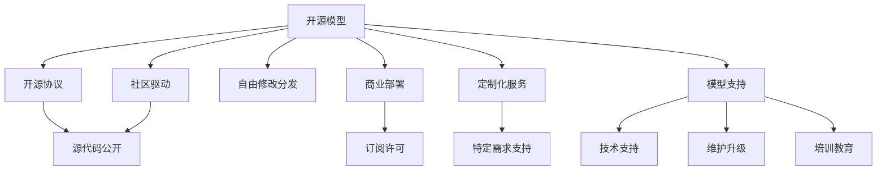

                 

# 开源模型vs闭源模型:市场格局分析

> 关键词：开源模型,闭源模型,市场竞争,技术优势,商业策略,开源社区,闭源生态

## 1. 背景介绍

在人工智能(AI)和机器学习(ML)领域，模型选择一直是关键决策之一。目前，市场上有开源模型与闭源模型两种主要选择，它们各自有着不同的特点和应用场景。本文旨在分析这两种模型在市场上的格局，探讨其优势与劣势，并展望未来发展趋势。

### 1.1 问题由来

随着AI和ML技术的快速发展，模型选择的重要性日益凸显。开源模型由于其免费、透明和灵活性，吸引了大量开发者和用户。而闭源模型则凭借其商业化部署、专业化服务和企业级支持，在企业市场中占据重要地位。两大阵营各有所长，形成了分庭抗礼的市场格局。

### 1.2 问题核心关键点
开源模型与闭源模型的核心差异在于其使用、修改、分发和支持的机制。

- **开源模型**：基于GPL、Apache等开源协议，模型源代码免费公开，用户可以自由修改、分发和集成。典型代表如TensorFlow、PyTorch、Scikit-Learn等。
- **闭源模型**：模型的源代码和算法由特定公司拥有，用户通常通过API或SDK等方式使用。闭源模型通常提供企业级支持、优化服务和定制化服务。典型代表如TensorFlow Enterprise、Google Cloud AI、IBM Watson等。

这些差异导致了用户在模型选择上需要综合考虑成本、性能、易用性和服务支持等因素。

## 2. 核心概念与联系

### 2.1 核心概念概述

为更好地理解开源模型与闭源模型的区别和联系，本节将介绍几个关键概念：

- **开源模型**：即开放源代码模型，其源代码可免费获取，用户可以自由修改、分发和集成。开源模型强调透明度、社区驱动和协作开发。
- **闭源模型**：指由特定公司或机构拥有源代码和算法所有权，用户只能通过API或SDK等方式使用。闭源模型注重商业化部署、企业级支持和优化服务。
- **商业部署**：指将模型部署到商业环境中，通常需要支付许可费用或订阅费。
- **定制化服务**：根据企业需求定制开发和优化模型，提供特定于企业的解决方案。
- **模型支持**：包括技术支持、维护升级、培训教育等服务。
- **社区驱动**：开源模型通常由庞大的开发者社区推动，贡献者来自全球，不断迭代和改进。

这些概念之间的逻辑关系可以通过以下Mermaid流程图来展示：



这个流程图展示了开源模型与闭源模型在源代码、社区驱动、商业部署、定制化服务、模型支持和社区贡献等方面的关系。

## 3. 核心算法原理 & 具体操作步骤

### 3.1 算法原理概述

开源模型与闭源模型在算法原理上并无本质区别，主要区别在于其实现方式、许可协议和服务支持。

开源模型通常使用基于Python等开源语言开发的算法库，支持自由修改和扩展。例如，TensorFlow和PyTorch使用了高性能的C++和GPU加速库，实现了高效的神经网络计算。开源模型支持研究人员和开发者自由探索新算法和架构。

闭源模型则通过商业化开发和优化，提供了更完善的API和SDK，简化了模型的部署和使用。例如，Google Cloud AI使用TensorFlow作为底层引擎，提供端到端的解决方案和优化服务。闭源模型往往采用特定算法和架构，专注于性能和稳定性。

### 3.2 算法步骤详解

开源模型和闭源模型的操作步骤大同小异，主要包括以下几个关键步骤：

**Step 1: 选择模型**

- **开源模型**：在GitHub等开源平台上寻找适合的模型，评估其性能、易用性和社区活跃度。
- **闭源模型**：通过厂商提供的网站和文档，选择最适合的模型，评估其功能和定制化选项。

**Step 2: 准备数据集**

- **开源模型**：下载并处理数据集，进行数据增强和预处理，确保数据格式和质量。
- **闭源模型**：使用厂商提供的数据准备工具和API，进行数据格式转换和预处理。

**Step 3: 模型训练与优化**

- **开源模型**：使用Jupyter Notebook等工具进行模型训练，使用GPU或TPU加速计算。在训练过程中，不断调整超参数，优化模型性能。
- **闭源模型**：通过API调用模型训练服务，自动进行超参数优化和模型迭代。模型训练和优化过程由厂商支持。

**Step 4: 部署与应用**

- **开源模型**：将训练好的模型打包为库或服务，部署到服务器或云平台。开发应用程序接口(API)，供外部系统调用。
- **闭源模型**：使用厂商提供的部署工具和文档，将模型部署到企业环境。厂商提供集成工具和技术支持，确保模型稳定运行。

### 3.3 算法优缺点

**开源模型的优点**：

- **免费透明**：源代码公开，社区驱动，可以自由修改和优化。
- **灵活性高**：用户可以根据需求自由定制模型。
- **开放协作**：庞大的开发者社区支持，便于技术交流和合作。

**开源模型的缺点**：

- **质量参差不齐**：开源模型由于缺乏严格的审核和测试，质量可能不稳定。
- **技术支持有限**：社区支持依赖于志愿者，不一定能够及时响应问题。
- **学习曲线陡峭**：用户需要一定的技术背景才能上手。

**闭源模型的优点**：

- **性能稳定**：经过严格的测试和优化，性能可靠。
- **技术支持**：厂商提供专业支持，包括技术指导、维护升级等。
- **定制化服务**：针对企业需求，提供定制化解决方案。

**闭源模型的缺点**：

- **成本较高**：需支付许可费用或订阅费，且技术支持费用较高。
- **灵活性低**：用户不能自由修改和扩展模型。
- **透明度低**：算法和源代码不公开，难以进行独立验证和优化。

### 3.4 算法应用领域

开源模型与闭源模型在应用领域上各有侧重。

**开源模型**：适用于学术研究、开源项目、开发者社区等。特别适用于探索性研究和技术实验，如TensorFlow、PyTorch、Scikit-Learn等。

**闭源模型**：适用于企业级应用、商业部署、定制化服务。特别适用于需要高性能、高稳定性和专业支持的场景，如Google Cloud AI、IBM Watson等。

## 4. 数学模型和公式 & 详细讲解 & 举例说明

### 4.1 数学模型构建

本节以线性回归为例，展示开源模型和闭源模型的数学模型构建方法。

设已知数据集 $(x_i, y_i)$，其中 $x_i \in \mathbb{R}^n$，$y_i \in \mathbb{R}$。线性回归的目标是找到一个线性函数 $y = wx + b$，最小化预测值与实际值之间的平方误差：

$$
\min_{w, b} \sum_{i=1}^N (y_i - (wx_i + b))^2
$$

对于开源模型，可以使用梯度下降等优化算法求解该最小二乘问题，得到模型参数 $w$ 和 $b$。

对于闭源模型，可以使用最小二乘法求解，并通过API调用模型训练服务，自动优化模型参数。

### 4.2 公式推导过程

线性回归的推导过程如下：

假设已有一组数据集 $(x_i, y_i)$，其中 $x_i \in \mathbb{R}^n$，$y_i \in \mathbb{R}$。定义误差函数为：

$$
\epsilon = y_i - wx_i - b
$$

最小二乘问题的目标是找到使误差函数最小化的 $w$ 和 $b$。根据误差函数的平方和：

$$
SSE = \sum_{i=1}^N \epsilon_i^2 = \sum_{i=1}^N (y_i - wx_i - b)^2
$$

利用最小二乘法，通过求偏导数解方程组：

$$
\begin{cases}
\frac{\partial SSE}{\partial w} = -2 \sum_{i=1}^N x_i(y_i - wx_i - b) = 0 \\
\frac{\partial SSE}{\partial b} = -2 \sum_{i=1}^N (y_i - wx_i - b) = 0
\end{cases}
$$

解得：

$$
\begin{cases}
w = \frac{\sum_{i=1}^N x_i y_i}{\sum_{i=1}^N x_i^2} \\
b = \bar{y} - w\bar{x}
\end{cases}
$$

其中 $\bar{x} = \frac{1}{N} \sum_{i=1}^N x_i$，$\bar{y} = \frac{1}{N} \sum_{i=1}^N y_i$。

### 4.3 案例分析与讲解

**案例1：图像分类**

开源模型可以使用PyTorch或TensorFlow等框架，搭建卷积神经网络(CNN)模型，通过自定义损失函数和优化器进行训练。用户可以自由修改网络结构，优化超参数。

闭源模型如TensorFlow Enterprise，提供了预训练的Inception和ResNet等模型，通过API调用模型训练服务，自动进行模型优化和调整。模型训练和优化由厂商负责，用户只需要提供数据集和配置即可。

**案例2：自然语言处理(NLP)**

开源模型如SpaCy，提供了基于Python的NLP库，支持分词、词性标注、命名实体识别等任务。用户可以自由定制模型和提取算法，适用于学术研究和开源项目。

闭源模型如IBM Watson，通过API提供自然语言处理服务，包括语言翻译、文本摘要、情感分析等。支持定制化部署和企业级支持，适用于商业和工业应用。

## 5. 项目实践：代码实例和详细解释说明

### 5.1 开发环境搭建

在进行模型选择和部署时，需要准备相应的开发环境。以下是使用Python进行TensorFlow和PyTorch开发的常用环境配置：

1. 安装Anaconda：从官网下载并安装Anaconda，用于创建独立的Python环境。

2. 创建并激活虚拟环境：
```bash
conda create -n tf-env python=3.8 
conda activate tf-env
```

3. 安装TensorFlow：根据CUDA版本，从官网获取对应的安装命令。例如：
```bash
conda install tensorflow
```

4. 安装PyTorch：使用pip安装：
```bash
pip install torch
```

5. 安装各类工具包：
```bash
pip install numpy pandas scikit-learn matplotlib tqdm jupyter notebook ipython
```

完成上述步骤后，即可在`tf-env`环境中开始模型选择和部署。

### 5.2 源代码详细实现

这里以TensorFlow和TensorFlow Enterprise为例，展示开源模型和闭源模型的代码实现。

**开源模型（TensorFlow）**

```python
import tensorflow as tf
from tensorflow import keras

# 准备数据集
(x_train, y_train), (x_test, y_test) = keras.datasets.mnist.load_data()

# 数据预处理
x_train = x_train / 255.0
x_test = x_test / 255.0

# 搭建模型
model = keras.Sequential([
    keras.layers.Flatten(input_shape=(28, 28)),
    keras.layers.Dense(128, activation='relu'),
    keras.layers.Dense(10, activation='softmax')
])

# 编译模型
model.compile(optimizer='adam',
              loss=tf.keras.losses.SparseCategoricalCrossentropy(from_logits=True),
              metrics=['accuracy'])

# 训练模型
model.fit(x_train, y_train, epochs=5, validation_data=(x_test, y_test))

# 评估模型
model.evaluate(x_test, y_test)
```

**闭源模型（TensorFlow Enterprise）**

```python
from google.cloud import aiplatform

# 初始化AI平台客户端
client = aiplatform.Client()

# 定义模型路径
model_path = 'projects/<project-id>/locations/<location>/models/<model-id>'

# 定义数据路径
data_path = 'gs://<bucket-name>/<data-path>'

# 定义评估指标
eval_metrics = {
    'metric': 'accuracy',
    'threshold': 0.5
}

# 调用AI平台API进行模型训练和评估
response = client.projects().locations().models().evaluate(
    model_name=model_path,
    data=aiplatform.types.PredictDataset(data_path),
    evaluation_body=aiplatform.types.Evaluation(
        metrics=eval_metrics
    )
)

# 输出评估结果
print('Evaluation result:', response)
```

### 5.3 代码解读与分析

让我们再详细解读一下关键代码的实现细节：

**开源模型（TensorFlow）**

```python
import tensorflow as tf
from tensorflow import keras

# 准备数据集
(x_train, y_train), (x_test, y_test) = keras.datasets.mnist.load_data()

# 数据预处理
x_train = x_train / 255.0
x_test = x_test / 255.0

# 搭建模型
model = keras.Sequential([
    keras.layers.Flatten(input_shape=(28, 28)),
    keras.layers.Dense(128, activation='relu'),
    keras.layers.Dense(10, activation='softmax')
])

# 编译模型
model.compile(optimizer='adam',
              loss=tf.keras.losses.SparseCategoricalCrossentropy(from_logits=True),
              metrics=['accuracy'])

# 训练模型
model.fit(x_train, y_train, epochs=5, validation_data=(x_test, y_test))

# 评估模型
model.evaluate(x_test, y_test)
```

**闭源模型（TensorFlow Enterprise）**

```python
from google.cloud import aiplatform

# 初始化AI平台客户端
client = aiplatform.Client()

# 定义模型路径
model_path = 'projects/<project-id>/locations/<location>/models/<model-id>'

# 定义数据路径
data_path = 'gs://<bucket-name>/<data-path>'

# 定义评估指标
eval_metrics = {
    'metric': 'accuracy',
    'threshold': 0.5
}

# 调用AI平台API进行模型训练和评估
response = client.projects().locations().models().evaluate(
    model_name=model_path,
    data=aiplatform.types.PredictDataset(data_path),
    evaluation_body=aiplatform.types.Evaluation(
        metrics=eval_metrics
    )
)

# 输出评估结果
print('Evaluation result:', response)
```

可以看到，开源模型和闭源模型在代码实现上有明显的区别。开源模型依赖于Python等开源语言和框架，用户可以自由修改和扩展。闭源模型通过API调用模型训练服务，简化了模型的部署和使用。

## 6. 实际应用场景

### 6.1 智能客服系统

基于开源模型的智能客服系统可以免费部署，支持自定义模型和优化。适用于小型企业和创业团队。用户可以根据实际需求定制模型，快速上线客服系统。

闭源模型的智能客服系统通常提供企业级支持和优化服务，适合大型企业和高价值用户。闭源模型能够提供高性能、高稳定性和个性化服务。

### 6.2 金融风控系统

基于开源模型的金融风控系统可以自由修改和优化，支持自定义风险评估模型。适用于中小型金融机构和创业公司。

闭源模型的金融风控系统提供全面的风控服务和支持，适合大型银行和金融机构。闭源模型能够提供全面的风控策略和专业支持。

### 6.3 医疗影像诊断

基于开源模型的医疗影像诊断系统可以自由修改和优化，支持自定义诊断模型。适用于中小型医疗机构和创业公司。

闭源模型的医疗影像诊断系统提供全面的诊断服务和支持，适合大型医院和医疗机构。闭源模型能够提供高精度的诊断和治疗方案。

### 6.4 未来应用展望

未来，开源模型和闭源模型将继续相互融合，共同推动AI和ML技术的普及和应用。

开源模型将更加注重社区驱动和协作开发，提供更灵活和易用的解决方案。闭源模型将注重企业级支持和优化服务，提供高性能和高稳定性的解决方案。

随着AI技术的不断发展，开源模型和闭源模型将进一步融合，形成更强大、更灵活的AI生态系统，为各行各业提供更全面、更高效的技术支持。

## 7. 工具和资源推荐

### 7.1 学习资源推荐

为帮助开发者掌握开源模型和闭源模型的使用方法，推荐以下学习资源：

1. TensorFlow官方文档：提供详细的TensorFlow教程和API文档，适合初学者入门。
2. PyTorch官方文档：提供PyTorch的教程和API文档，适合深度学习开发者。
3. IBM Watson官方文档：提供IBM Watson的API和文档，适合企业用户使用。
4. Google Cloud AI官方文档：提供Google Cloud AI的API和文档，适合Google Cloud用户。
5. GitHub开源项目：提供大量开源模型的代码实现和优化案例，适合开发者学习和研究。

通过这些资源的学习，开发者可以快速掌握开源模型和闭源模型的使用方法，进行模型选择和部署。

### 7.2 开发工具推荐

以下是几款常用的开源模型和闭源模型的开发工具：

1. Jupyter Notebook：Python的交互式开发环境，支持代码编写、数据可视化等。
2. Anaconda：Python环境管理工具，方便安装和管理Python依赖。
3. Google Colab：免费的Jupyter Notebook环境，支持GPU和TPU加速。
4. PyCharm：Python开发工具，提供代码编辑、调试和自动化测试等功能。
5. VS Code：轻量级代码编辑器，支持多种语言和插件。

这些工具能够显著提升开发效率，帮助开发者快速搭建和测试模型。

### 7.3 相关论文推荐

以下是几篇关于开源模型和闭源模型的经典论文，推荐阅读：

1. "TensorFlow: A System for Large-Scale Machine Learning"（TensorFlow论文）：介绍TensorFlow框架的设计和实现，阐述其在大规模机器学习中的应用。
2. "The Unreasonable Effectiveness of Transfer Learning in Natural Language Processing"（NLP迁移学习论文）：探讨迁移学习在NLP任务中的应用，展示预训练模型的优越性能。
3. "Serving AI at Scale with TensorFlow Enterprise"（TensorFlow Enterprise论文）：介绍TensorFlow Enterprise的架构和功能，展示其在企业中的应用。
4. "Scikit-Learn: Machine Learning in Python"（Scikit-Learn论文）：介绍Scikit-Learn库的设计和实现，展示其在机器学习中的应用。
5. "Watson Natural Language Understanding"（IBM Watson NLU论文）：介绍IBM Watson NLU的功能和应用，展示其在自然语言理解中的应用。

这些论文代表了大模型和微调技术的发展脉络，可以帮助研究者把握学科前进方向，激发更多的创新灵感。

## 8. 总结：未来发展趋势与挑战

### 8.1 总结

本文对开源模型和闭源模型的市场格局进行了全面分析。通过详细讲解两种模型的特点、优势和应用场景，帮助开发者在选择和使用模型时做出明智决策。开源模型和闭源模型各有优缺点，用户需要根据实际需求选择合适的模型，从而充分发挥其优势。

通过本文的系统梳理，可以看到，开源模型和闭源模型在市场竞争中各具优势，形成互补。未来，两大模型将继续相互融合，共同推动AI和ML技术的普及和应用。

### 8.2 未来发展趋势

展望未来，开源模型和闭源模型将在以下几个方面继续发展：

1. **开源模型**：
   - **社区驱动**：开源模型将继续依赖社区驱动，不断迭代和改进。社区贡献者来自全球，贡献丰富的算法和优化方案。
   - **定制化支持**：开源模型将提供更多定制化服务，支持用户自由修改和扩展模型。
   - **跨平台支持**：开源模型将支持更多平台和语言，便于开发者跨平台部署和开发。

2. **闭源模型**：
   - **企业级支持**：闭源模型将继续提供全面的企业级支持，包括技术支持、定制化服务和优化。
   - **多模态融合**：闭源模型将支持更多模态数据的融合，提供多模态信息协同建模。
   - **自动化部署**：闭源模型将提供自动化部署工具和平台，简化用户使用流程。

### 8.3 面临的挑战

尽管开源模型和闭源模型各有优势，但在推广和应用过程中仍面临诸多挑战：

1. **开源模型**：
   - **质量控制**：开源模型由于缺乏严格的审核和测试，质量可能不稳定，导致性能波动。
   - **用户门槛**：开源模型需要用户具备一定的技术背景，对初学者不够友好。
   - **社区协作**：开源模型依赖社区驱动，社区活跃度可能受限于社区规模和活跃度。

2. **闭源模型**：
   - **成本高昂**：闭源模型需支付许可费用或订阅费，成本较高。
   - **透明度低**：闭源模型的算法和源代码不公开，难以进行独立验证和优化。
   - **定制化需求**：闭源模型需要根据用户需求进行定制化开发，开发周期较长。

### 8.4 研究展望

未来，开源模型和闭源模型需要在以下几个方面寻求新的突破：

1. **开源模型**：
   - **质量提升**：通过社区协作和严格审核，提升开源模型的质量和稳定性。
   - **工具支持**：提供更多的开发工具和API，简化用户使用流程。
   - **生态构建**：构建更丰富的生态系统，提供更多跨平台支持和定制化服务。

2. **闭源模型**：
   - **降低成本**：提供更灵活的许可方式，降低用户成本。
   - **透明度提升**：适度开放算法和源代码，提供更多的开源版本和开发支持。
   - **多模态融合**：支持更多模态数据的融合，提供多模态信息协同建模。

总之，开源模型和闭源模型各有优势，需要根据实际需求选择合适的模型。未来，两大模型将继续相互融合，共同推动AI和ML技术的普及和应用，为各行业提供更全面、更高效的技术支持。

## 9. 附录：常见问题与解答

**Q1：如何选择开源模型和闭源模型？**

A: 用户应根据实际需求选择适当的模型。

- **开源模型**：适用于学术研究、开源项目、开发者社区等，注重灵活性和社区驱动。
- **闭源模型**：适用于企业级应用、商业部署、定制化服务，注重性能和专业支持。

**Q2：开源模型和闭源模型的性能差异有多大？**

A: 开源模型和闭源模型在性能上没有本质的差异，但闭源模型经过商业化优化，通常性能更稳定、更高效。

**Q3：开源模型和闭源模型的开发难度如何？**

A: 开源模型需要用户具备一定的技术背景，但社区提供了丰富的开发工具和文档，开发难度较低。闭源模型使用API调用模型训练服务，开发难度较低，但需要一定的技术支持。

**Q4：开源模型和闭源模型的部署难度如何？**

A: 开源模型部署难度较大，需要用户自行搭建环境、配置网络和部署服务。闭源模型通过API调用模型训练服务，部署难度较低，厂商提供全面的支持和文档。

**Q5：开源模型和闭源模型在应用场景上有什么差异？**

A: 开源模型适用于学术研究、开源项目、开发者社区等，注重灵活性和社区驱动。闭源模型适用于企业级应用、商业部署、定制化服务，注重性能和专业支持。

**Q6：开源模型和闭源模型在未来如何融合？**

A: 开源模型和闭源模型将继续相互融合，共同推动AI和ML技术的普及和应用。开源模型将提供更多社区驱动和定制化支持，闭源模型将提供全面的企业级支持和优化。

通过本文的系统梳理，可以看到，开源模型和闭源模型在市场竞争中各具优势，形成互补。未来，两大模型将继续相互融合，共同推动AI和ML技术的普及和应用，为各行业提供更全面、更高效的技术支持。

---

作者：禅与计算机程序设计艺术 / Zen and the Art of Computer Programming

