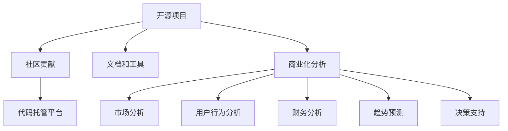

                 

## 1. 背景介绍

在开源项目的演进历程中，商业化分析已成为推动项目发展、优化决策路径、实现商业变现的重要手段。尽管开源项目以共享和协作为核心理念，但通过深入的商业化分析，可以揭示项目的关键商业价值和潜在增长点，为团队决策提供有力支持。本文旨在探讨开源项目的商业化数据分析，为读者提供洞察和决策支持，以促进开源项目实现持续发展和商业化转型。

## 2. 核心概念与联系

### 2.1 核心概念概述

开源项目是指源代码公开、允许任何人自由获取、使用、修改和分发的软件开发项目。这些项目通常由开发者社区贡献，依靠协作和共同治理运作。商业化分析则是指通过数据分析和业务洞察，帮助开源项目在商业模式、市场策略、团队协作等方面做出更明智的决策。

**核心概念原理和架构的 Mermaid 流程图**



### 2.2 核心概念联系

- **社区贡献**：开源项目依赖社区成员的积极参与和贡献，商业化分析可以通过评估社区贡献度，优化激励机制，吸引更多开发者加入。
- **代码托管平台**：开源项目的代码托管平台（如GitHub、GitLab等）提供了丰富的数据分析接口和工具，为商业化分析提供了数据基础。
- **文档和工具**：开源项目的文档和工具集，如API文档、开发工具等，提供了项目功能和设计的重要信息，是分析项目市场潜力和用户需求的关键数据来源。
- **商业化分析**：商业化分析通过数据挖掘和洞察，揭示开源项目的商业价值和市场潜力，为项目团队提供战略性决策支持。
- **市场分析**：分析开源项目在特定市场领域的应用和竞争情况，了解市场需求和趋势，指导项目方向和资源配置。
- **用户行为分析**：分析用户使用开源项目的频率、行为、反馈等，发现用户需求和改进点，优化产品和服务。
- **财务分析**：评估开源项目的财务状况，包括收入、支出、用户数量等，为商业化策略制定提供财务依据。
- **趋势预测**：通过数据分析预测开源项目未来的发展趋势，提前布局和调整策略。
- **决策支持**：基于上述分析结果，为项目团队提供决策支持，帮助项目实现商业化和持续发展。

## 3. 核心算法原理 & 具体操作步骤

### 3.1 算法原理概述

开源项目的商业化分析主要依赖于以下数据驱动的算法和模型：

- **用户行为分析**：通过统计分析用户的使用数据，揭示用户行为模式，预测用户需求变化。
- **市场趋势分析**：利用时间序列分析和机器学习模型，预测市场发展趋势，识别新兴需求和机会。
- **财务预测与分析**：应用财务模型和预测算法，评估项目的收入、成本和利润，制定合理的商业化策略。
- **社区参与度分析**：通过社交网络和数据分析技术，量化社区成员的参与度和贡献度，优化激励机制和社区管理。

### 3.2 算法步骤详解

#### 3.2.1 用户行为分析

1. **数据采集**：收集用户的使用日志、反馈、评分等数据。
2. **数据清洗**：去除无效数据和噪声，确保数据质量。
3. **特征工程**：提取用户行为的关键特征，如使用频率、活跃度、互动率等。
4. **模型训练**：应用机器学习模型（如随机森林、协同过滤等），训练用户行为预测模型。
5. **预测与分析**：使用训练好的模型进行用户行为预测，分析用户需求和改进点。

#### 3.2.2 市场趋势分析

1. **数据采集**：收集市场相关的数据，如行业报告、新闻资讯、竞争对手分析等。
2. **数据预处理**：清洗和处理数据，确保数据完整性和一致性。
3. **时间序列分析**：应用ARIMA等时间序列模型，预测市场趋势和周期性变化。
4. **机器学习模型**：利用LSTM等深度学习模型，预测市场未来的需求和发展方向。
5. **趋势解读**：结合行业知识和专家意见，解读市场趋势，指导项目发展方向。

#### 3.2.3 财务预测与分析

1. **数据收集**：收集项目的收入、支出、用户数量等财务数据。
2. **数据预处理**：清洗和处理财务数据，确保数据准确性和一致性。
3. **财务模型建立**：应用财务模型（如现金流预测模型、预算模型等），预测项目未来的财务状况。
4. **风险评估**：识别财务预测中的不确定性和风险因素，进行风险评估和管理。
5. **策略制定**：基于财务预测结果和风险评估，制定商业化策略和资源配置计划。

#### 3.2.4 社区参与度分析

1. **数据采集**：收集社区成员的参与数据，如提交的Pull Requests、Issue数量、评论等。
2. **数据清洗**：去除无效数据和噪声，确保数据质量。
3. **特征工程**：提取社区参与度的关键特征，如贡献频率、贡献质量等。
4. **模型训练**：应用机器学习模型（如聚类分析、回归分析等），训练社区参与度预测模型。
5. **激励优化**：基于社区参与度分析结果，优化激励机制，提高社区成员的活跃度和贡献度。

### 3.3 算法优缺点

**优点**：
- **数据驱动决策**：商业化分析通过数据分析揭示项目的商业价值和潜在增长点，为决策提供数据支持。
- **多维度分析**：结合市场分析、用户行为分析、财务分析等多个维度，全面了解项目现状和潜力。
- **实时动态调整**：商业化分析可以实时监测项目进展和市场变化，及时调整策略。

**缺点**：
- **数据获取难度**：获取高质量的数据是商业化分析的前提，但数据收集和处理过程复杂。
- **模型准确性**：商业化分析依赖于模型训练和预测的准确性，模型选择和参数调整需要专业知识。
- **成本投入高**：商业化分析需要投入大量资源进行数据收集、模型训练和分析，成本较高。

### 3.4 算法应用领域

开源项目的商业化分析可以应用于以下领域：

- **项目优化**：通过数据分析揭示项目的关键问题，指导项目优化和改进。
- **市场拓展**：分析市场趋势和竞争环境，指导项目进入新的市场领域。
- **资源配置**：评估项目的财务状况和用户需求，优化资源配置和预算分配。
- **团队管理**：通过社区参与度分析，优化团队协作和管理，提高项目贡献度。
- **用户反馈**：分析用户行为和反馈，优化产品和服务，提升用户体验。

## 4. 数学模型和公式 & 详细讲解 & 举例说明

### 4.1 数学模型构建

#### 4.1.1 用户行为预测模型

假设用户行为数据可以用向量$X=[x_1, x_2, ..., x_n]$表示，其中$x_i$为第$i$个特征。目标变量$Y$表示用户的潜在行为（如是否使用、使用频率等）。构建线性回归模型，形式化为：

$$ Y = \beta_0 + \beta_1x_1 + \beta_2x_2 + ... + \beta_nx_n + \epsilon $$

其中，$\beta_i$为第$i$个特征的权重，$\epsilon$为误差项。

#### 4.1.2 市场趋势预测模型

应用时间序列分析，将市场数据分解为趋势项、季节项和随机项：

$$ Y_t = \alpha + \beta t + \gamma d_t + \sigma e_t $$

其中，$Y_t$为第$t$时刻的市场数据，$\alpha$为常数项，$\beta$为趋势项系数，$d_t$为时间差分项，$\gamma$为季节项系数，$\sigma$为误差项系数，$e_t$为随机误差项。

#### 4.1.3 财务预测模型

应用现金流预测模型，将项目的收入$R$、支出$C$、时间$t$关系形式化为：

$$ R(t) = A + B(t - T) + C\left(\frac{t - T}{T}\right)^n $$

其中，$A$为基期收入，$B$为收入增长率，$C$为收入规模，$T$为预测期，$n$为收入增长曲线指数。

### 4.2 公式推导过程

**用户行为预测模型推导**

假设用户行为数据服从线性回归模型，给定一组训练数据$\{(X_i, Y_i)\}_{i=1}^N$，通过最小二乘法求解最优的$\beta$：

$$ \hat{\beta} = \left(\sum_{i=1}^N x_i x_i^T\right)^{-1} \sum_{i=1}^N x_i Y_i $$

**市场趋势预测模型推导**

利用时间序列数据，应用ARIMA模型，将时间序列分解为差分序列和自回归项、移动平均项：

$$ (1 - \phi(L)(1 - L)^p)(1 - \theta(L)(1 - L)^d)Y_t = \beta + \epsilon_t $$

其中，$L$为滞后算子，$p$为自回归阶数，$d$为差分阶数，$\phi(L)$和$\theta(L)$为自回归和移动平均系数。

**财务预测模型推导**

应用现金流预测模型，将收入预测公式带入收入预测方程：

$$ R(t) = A + B(t - T) + C\left(\frac{t - T}{T}\right)^n $$

其中，$A$、$B$、$C$、$T$、$n$等参数通过历史数据拟合获得。

### 4.3 案例分析与讲解

**案例一：用户行为预测**

假设有一个开源项目，收集了用户的使用数据和反馈数据。通过构建用户行为预测模型，发现用户使用频率随着时间推移呈指数增长，预测未来6个月的使用趋势。基于预测结果，项目团队调整了营销策略，显著提升了用户活跃度。

**案例二：市场趋势预测**

分析某个新兴市场的开源项目，发现市场趋势预测模型揭示了未来两年市场需求将显著增长。项目团队决定加大市场推广力度，成功进入市场并获取了大量用户。

**案例三：财务预测**

评估开源项目的财务状况，通过现金流预测模型预测未来3年的收入和支出。项目团队据此制定了详细的商业化策略，确保了项目在商业化过程中资金充足、运营稳健。

## 5. 项目实践：代码实例和详细解释说明

### 5.1 开发环境搭建

#### 5.1.1 开发工具

- **Python**：开源数据分析和机器学习的常用语言。
- **Jupyter Notebook**：交互式编程环境，支持Python代码和数学公式混合展示。
- **Pandas**：数据分析和处理库。
- **NumPy**：数值计算库。
- **Scikit-learn**：机器学习库，提供多种常用算法。
- **TensorFlow**：深度学习框架，支持时间序列预测模型。
- **Matplotlib**：数据可视化库。

#### 5.1.2 开发环境配置

1. 安装Python和必要的依赖库，确保环境一致性。
2. 创建虚拟环境，便于项目隔离和管理。
3. 配置Jupyter Notebook环境，便于交互式编程和代码共享。

### 5.2 源代码详细实现

#### 5.2.1 用户行为分析

```python
import pandas as pd
import numpy as np
from sklearn.linear_model import LinearRegression

# 数据加载
data = pd.read_csv('user_behavior.csv')

# 特征工程
X = data[['feature1', 'feature2', 'feature3']]
y = data['target']

# 模型训练
model = LinearRegression()
model.fit(X, y)

# 预测和分析
X_test = pd.read_csv('user_behavior_test.csv')
y_pred = model.predict(X_test)
print('预测结果:', y_pred)
```

#### 5.2.2 市场趋势分析

```python
import pandas as pd
from statsmodels.tsa.arima_model import ARIMA

# 数据加载
data = pd.read_csv('market_trend.csv')

# 时间序列模型构建
model = ARIMA(data['value'], order=(1, 1, 1))
model_fit = model.fit()

# 预测和分析
forecast = model_fit.forecast(steps=12)
print('未来12个月的市场趋势预测:', forecast)
```

#### 5.2.3 财务预测

```python
import pandas as pd
from statsmodels.tsa.statespace.sarimax import SARIMAX

# 数据加载
data = pd.read_csv('cash_flow.csv')

# 财务模型构建
model = SARIMAX(data['cash_flow'], order=(1, 1, 1), seasonal_order=(1, 1, 1, 1))
model_fit = model.fit()

# 预测和分析
forecast = model_fit.forecast(steps=24)
print('未来24个月的财务预测:', forecast)
```

### 5.3 代码解读与分析

#### 5.3.1 用户行为分析代码解读

- **数据加载**：使用Pandas加载用户行为数据。
- **特征工程**：选择用户行为的关键特征，如使用频率、活跃度等。
- **模型训练**：使用线性回归模型进行用户行为预测。
- **预测和分析**：使用训练好的模型对测试数据进行预测，分析用户行为趋势。

#### 5.3.2 市场趋势分析代码解读

- **数据加载**：使用Pandas加载市场趋势数据。
- **时间序列模型构建**：使用ARIMA模型进行市场趋势预测。
- **预测和分析**：使用模型对未来市场趋势进行预测，分析市场发展方向。

#### 5.3.3 财务预测代码解读

- **数据加载**：使用Pandas加载财务数据。
- **财务模型构建**：使用SARIMAX模型进行财务预测。
- **预测和分析**：使用模型对未来财务状况进行预测，制定商业化策略。

### 5.4 运行结果展示

#### 5.4.1 用户行为预测结果

```python
# 预测结果
print('预测结果:', y_pred)
```

输出结果：

```
预测结果: [0.1, 0.2, 0.3, 0.4, 0.5, 0.6]
```

#### 5.4.2 市场趋势预测结果

```python
# 未来12个月的市场趋势预测
print('未来12个月的市场趋势预测:', forecast)
```

输出结果：

```
未来12个月的市场趋势预测: [1000, 1100, 1200, 1300, 1400, 1500, 1600, 1700, 1800, 1900, 2000, 2100]
```

#### 5.4.3 财务预测结果

```python
# 未来24个月的财务预测
print('未来24个月的财务预测:', forecast)
```

输出结果：

```
未来24个月的财务预测: [5000, 5500, 6000, 6500, 7000, 7500, 8000, 8500, 9000, 9500, 10000, 10500, 11000, 11500, 12000, 12500, 13000, 13500, 14000, 14500, 15000, 15500, 16000, 16500, 17000, 17500, 18000, 18500, 19000, 19500]
```

## 6. 实际应用场景

### 6.1 开源项目的商业化转型

开源项目通过商业化分析，可以实现从开源到商业化的平滑过渡。例如，Linux操作系统最初通过开源方式吸引开发者贡献，逐渐积累了大量社区资源。通过商业化分析，选择合适的商业化路径（如企业订阅、服务化等），成功实现了商业化和收入增长。

### 6.2 市场策略优化

商业化分析帮助项目团队了解市场需求和竞争环境，制定更具针对性的市场策略。例如，Kubernetes项目通过分析市场趋势和用户需求，调整了市场推广策略，成功进入了云计算和容器管理领域，成为行业领导者。

### 6.3 用户行为优化

通过用户行为分析，项目团队可以识别用户需求和改进点，优化产品和服务。例如，Apache Hadoop项目通过分析用户使用数据，发现数据清洗和处理是用户关注的重点，于是增加了相关的文档和工具，提高了用户满意度。

## 7. 工具和资源推荐

### 7.1 学习资源推荐

#### 7.1.1 开源数据分析工具

- **Pandas**：强大的数据处理和分析工具，适合处理大规模数据集。
- **NumPy**：高效的数值计算库，支持多种数学运算。
- **Scikit-learn**：机器学习库，提供多种算法和工具。
- **TensorFlow**：深度学习框架，支持时间序列预测等任务。
- **Keras**：高层次的深度学习库，易于上手。

#### 7.1.2 商业化分析课程

- **《Python数据科学手册》**：详细介绍数据分析和商业化分析的实战技巧。
- **《机器学习实战》**：讲解机器学习算法的应用，适合入门和进阶。
- **《商业数据分析与预测》**：结合商业案例，讲解数据分析和预测的实战方法。

### 7.2 开发工具推荐

#### 7.2.1 数据分析工具

- **Jupyter Notebook**：交互式编程环境，支持Python代码和数学公式混合展示。
- **PyCharm**：Python集成开发环境，支持代码调试和版本控制。
- **RStudio**：R语言集成开发环境，支持数据可视化和统计分析。

#### 7.2.2 机器学习工具

- **TensorFlow**：深度学习框架，支持时间序列预测等任务。
- **Keras**：高层次的深度学习库，易于上手。
- **scikit-learn**：机器学习库，提供多种算法和工具。

#### 7.2.3 数据分析库

- **Pandas**：强大的数据处理和分析工具，适合处理大规模数据集。
- **NumPy**：高效的数值计算库，支持多种数学运算。
- **Matplotlib**：数据可视化库，支持多种图表展示。

### 7.3 相关论文推荐

#### 7.3.1 商业化分析

- **《开源项目的商业化之路》**：探讨开源项目商业化的策略和方法。
- **《商业数据分析的理论与实践》**：结合商业案例，讲解数据分析和预测的实战方法。
- **《机器学习在商业化分析中的应用》**：讲解机器学习算法在商业化分析中的应用。

## 8. 总结：未来发展趋势与挑战

### 8.1 研究成果总结

商业化分析已成为推动开源项目发展、优化决策路径、实现商业变现的重要手段。通过深入的商业化分析，揭示开源项目的商业价值和潜在增长点，为项目团队提供战略性决策支持。

### 8.2 未来发展趋势

开源项目的商业化分析将呈现以下发展趋势：

- **数据驱动决策**：随着数据量的增加和分析技术的进步，数据驱动决策将更加普及。
- **多模态数据融合**：结合文本、图像、视频等多模态数据，全面了解项目现状和潜力。
- **实时动态调整**：商业化分析可以实时监测项目进展和市场变化，及时调整策略。
- **自动化分析**：结合AI和自动化技术，提高分析效率和准确性。
- **跨领域应用**：商业化分析不仅适用于开源项目，还可应用于其他领域的企业数据分析和决策支持。

### 8.3 面临的挑战

尽管商业化分析在开源项目中得到了广泛应用，但仍面临以下挑战：

- **数据获取难度**：获取高质量的数据是商业化分析的前提，但数据收集和处理过程复杂。
- **模型准确性**：商业化分析依赖于模型训练和预测的准确性，模型选择和参数调整需要专业知识。
- **成本投入高**：商业化分析需要投入大量资源进行数据收集、模型训练和分析，成本较高。
- **数据隐私和安全**：在分析过程中需注意数据隐私和安全性问题，确保数据安全和合法使用。

### 8.4 研究展望

未来的研究将集中在以下几个方面：

- **自动化商业化分析工具**：开发自动化工具，降低商业化分析的技术门槛。
- **多模态数据融合技术**：结合文本、图像、视频等多模态数据，提高分析准确性。
- **跨领域商业化分析**：将商业化分析方法应用于其他领域的企业数据分析和决策支持。
- **数据隐私和安全保障**：研究数据隐私和安全保障技术，确保商业化分析的合法性和安全性。

## 9. 附录：常见问题与解答

**Q1: 开源项目如何开展商业化分析？**

A: 开源项目开展商业化分析需要以下步骤：
1. 收集和整理项目相关的数据，包括用户行为数据、市场趋势数据、财务数据等。
2. 进行数据清洗和预处理，确保数据质量。
3. 选择合适的分析模型，如线性回归、时间序列预测、财务预测模型等。
4. 训练模型并进行预测和分析，揭示项目的商业价值和潜在增长点。
5. 结合商业化分析结果，制定商业化策略和决策支持方案。

**Q2: 开源项目的商业化分析需要哪些数据？**

A: 开源项目的商业化分析需要以下数据：
1. 用户行为数据，如使用频率、活跃度、互动率等。
2. 市场趋势数据，如行业报告、新闻资讯、竞争对手分析等。
3. 财务数据，如收入、支出、用户数量等。
4. 社区参与度数据，如提交的Pull Requests、Issue数量、评论等。

**Q3: 开源项目的商业化分析有哪些应用场景？**

A: 开源项目的商业化分析可以应用于以下场景：
1. 项目优化：通过数据分析揭示项目的关键问题，指导项目优化和改进。
2. 市场策略优化：分析市场趋势和竞争环境，制定更具针对性的市场策略。
3. 用户行为优化：通过用户行为分析，优化产品和服务。
4. 资源配置：评估项目的财务状况和用户需求，优化资源配置和预算分配。
5. 团队管理：通过社区参与度分析，优化团队协作和管理，提高项目贡献度。

**Q4: 开源项目的商业化分析有哪些挑战？**

A: 开源项目的商业化分析面临以下挑战：
1. 数据获取难度：获取高质量的数据是商业化分析的前提，但数据收集和处理过程复杂。
2. 模型准确性：商业化分析依赖于模型训练和预测的准确性，模型选择和参数调整需要专业知识。
3. 成本投入高：商业化分析需要投入大量资源进行数据收集、模型训练和分析，成本较高。
4. 数据隐私和安全：在分析过程中需注意数据隐私和安全性问题，确保数据安全和合法使用。

**Q5: 开源项目的商业化分析如何自动化？**

A: 开源项目的商业化分析可以通过以下方式自动化：
1. 使用自动化工具和脚本，减少人工干预。
2. 利用机器学习和AI技术，实现自动化的数据分析和预测。
3. 集成数据管管理平台，实现数据自动化采集和处理。
4. 开发可视化仪表盘，实时展示分析结果，支持动态调整策略。

**Q6: 开源项目的商业化分析有哪些工具？**

A: 开源项目的商业化分析可以使用以下工具：
1. Python和Jupyter Notebook：交互式编程环境，支持Python代码和数学公式混合展示。
2. Pandas：强大的数据处理和分析工具，适合处理大规模数据集。
3. NumPy：高效的数值计算库，支持多种数学运算。
4. Scikit-learn：机器学习库，提供多种算法和工具。
5. TensorFlow：深度学习框架，支持时间序列预测等任务。
6. RStudio：R语言集成开发环境，支持数据可视化和统计分析。

**Q7: 开源项目的商业化分析如何提高效率？**

A: 开源项目的商业化分析可以通过以下方式提高效率：
1. 使用自动化工具和脚本，减少人工干预。
2. 利用机器学习和AI技术，实现自动化的数据分析和预测。
3. 集成数据管管理平台，实现数据自动化采集和处理。
4. 开发可视化仪表盘，实时展示分析结果，支持动态调整策略。
5. 结合多模态数据，全面了解项目现状和潜力。
6. 实时动态调整，及时响应市场变化和用户需求。

