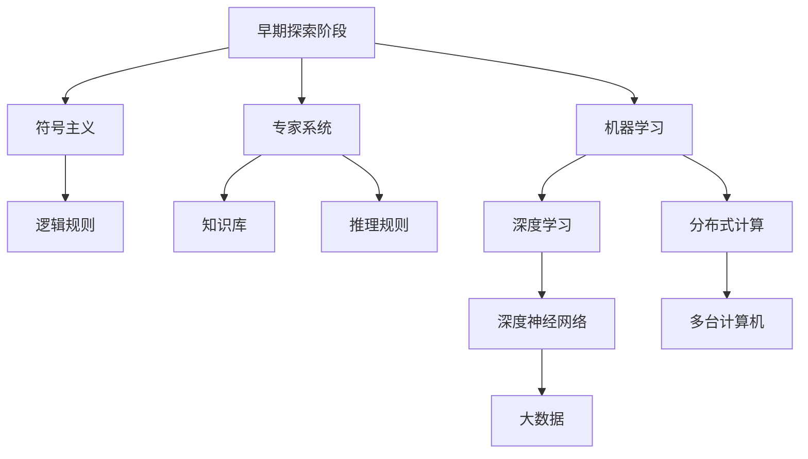

                 

# 张钹院士：人工智能的三个阶段

## 1. 背景介绍

人工智能(AI)是人类历史上最为前沿的科技之一，它的发展历程可以分为三个阶段：早期探索阶段、人工智能的复苏与发展阶段、人工智能的第三次浪潮阶段。张钹院士作为人工智能领域的研究者和推动者，对这三个阶段的变革和发展有着深刻的理解和洞见。

### 1.1 早期探索阶段

人工智能的早期探索阶段可以追溯到20世纪50年代，那时候的人工智能研究主要集中在符号主义和专家系统的建立上。这一阶段的研究重点是如何让机器模拟人类的逻辑推理和决策过程，通过逻辑规则和知识库来实现机器的智能。代表性的研究成果有纽厄尔（Newell）和西蒙（Simon）的物理符号系统假说（PHYSICAL SYMBOL SYSTEMS AND ESSIEs, PSSPs），纽厄尔的计算机程序研究以及明斯基（Minsky）的“感知器”。

### 1.2 人工智能的复苏与发展阶段

20世纪80年代，由于计算机技术的发展和人工智能研究的深入，人工智能技术得到了复苏。这一阶段的研究主要集中在机器学习和模式识别等方向上，特别是神经网络、进化算法等方法得到了广泛应用。这期间的主要成果包括卡内基梅隆大学的卡内基-梅隆大学学习系统（Carnegie Mellon University Learning System, CMULS）和匹兹堡大学的学习机项目（Pittsburgh Project on Learning Machines）。

### 1.3 人工智能的第三次浪潮阶段

进入21世纪，由于深度学习技术的发展，人工智能进入了一个新的阶段。这一阶段的研究重点转向了大数据、大规模分布式计算以及深度神经网络。这一阶段的主要成果包括Google的DeepMind，Microsoft的Azure机器学习服务，Facebook的人工智能研究院（FAIR）等。

## 2. 核心概念与联系

### 2.1 核心概念概述

- **符号主义（Symbolicism）**：人工智能早期的主要研究方向，试图通过符号规则模拟人类的思维过程，构建具有逻辑推理能力的智能系统。

- **专家系统（Expert Systems）**：基于符号主义方法构建的智能系统，通过知识库和推理规则来实现专家的决策过程。

- **机器学习（Machine Learning）**：通过数据驱动的算法，让机器从数据中自动学习和改进，逐步提升智能水平。

- **深度学习（Deep Learning）**：一种特殊的机器学习，通过多层次的神经网络，实现对大规模数据的高效处理和特征提取。

- **分布式计算（Distributed Computing）**：在大型数据集和复杂模型训练中，利用多台计算机协同计算，提高计算效率。

### 2.2 核心概念原理和架构的 Mermaid 流程图



### 2.3 核心概念之间的联系

上述概念之间的联系可以通过下图展示：

```mermaid
graph LR
    A[早期探索阶段] -- 引出 -- B[符号主义]
    A -- 引出 -- C[专家系统]
    A -- 引出 -- D[机器学习]
    D -- 引出 -- E[深度学习]
    D -- 引出 -- F[分布式计算]
    E -- 引出 -- G[知识库]
    F -- 引出 -- H[深度神经网络]
    F -- 引出 -- I[大数据]
    B -- 引出 -- J[逻辑规则]
    C -- 引出 -- K[推理规则]
    A -- 指向 -- E
    B -- 指向 -- D
    C -- 指向 -- D
```

## 3. 核心算法原理 & 具体操作步骤

### 3.1 算法原理概述

张钹院士认为，人工智能的发展可以分为三个阶段：

- **符号主义阶段**：研究重点是构建具有逻辑推理能力的符号系统，通过规则和知识库实现决策。
- **连接主义阶段**：研究重点是构建神经网络，通过数据驱动的机器学习算法提升智能水平。
- **统计学习阶段**：研究重点是统计学习理论，通过概率模型对数据进行建模和预测。

### 3.2 算法步骤详解

**符号主义阶段的算法步骤**：

1. 构建符号知识库
2. 定义逻辑推理规则
3. 实现专家系统的推理引擎

**连接主义阶段的算法步骤**：

1. 设计神经网络结构
2. 确定损失函数和优化算法
3. 用大量标注数据进行模型训练
4. 对新数据进行预测

**统计学习阶段的算法步骤**：

1. 确定学习模型
2. 选择特征提取方法
3. 训练模型并优化超参数
4. 对新数据进行预测

### 3.3 算法优缺点

符号主义阶段的主要优点是可以模拟人类的逻辑推理，适用于需要高度可靠性的领域。缺点是知识库的构建需要大量人工干预，无法自动获取知识。

连接主义阶段的主要优点是可以处理大规模复杂数据，适用于数据量较大的问题。缺点是需要大量计算资源，模型容易过拟合。

统计学习阶段的主要优点是可以自动获取知识，适用于数据量较大的问题。缺点是模型的解释性差，难以理解内部决策过程。

### 3.4 算法应用领域

符号主义阶段的应用包括医疗诊断、法律咨询等需要高度可靠性的领域。

连接主义阶段的应用包括语音识别、图像处理、自然语言处理等数据量较大的领域。

统计学习阶段的应用包括金融预测、推荐系统、广告推荐等需要自动获取知识，并处理大规模数据的领域。

## 4. 数学模型和公式 & 详细讲解 & 举例说明

### 4.1 数学模型构建

以符号主义阶段为例，构建符号知识库和推理规则的过程可以表示为：

1. 定义知识库 $\mathcal{K}$：

$$
\mathcal{K} = \{T_1, T_2, \cdots, T_n\}
$$

其中 $T_i$ 表示第 $i$ 条知识规则。

2. 定义推理规则：

$$
\text{IF} P_1 \text{THEN} Q_1
$$
$$
\text{IF} P_2 \text{THEN} Q_2
$$
$$
\cdots
$$

### 4.2 公式推导过程

符号推理的核心是逻辑推理，可以通过形式化的方法将推理过程表示为公式。例如，对于一个简单的逻辑推理规则：

$$
\text{IF} A \text{THEN} B
$$

如果已知 $A$ 为真，则 $B$ 也为真，可以表示为：

$$
A \rightarrow B
$$

通过构建知识库和推理规则，可以构建具有逻辑推理能力的专家系统。

### 4.3 案例分析与讲解

例如，在医疗诊断领域，可以通过专家系统的形式构建知识库和推理规则，对患者的症状进行逻辑推理，判断可能的疾病并给出诊断结果。

## 5. 项目实践：代码实例和详细解释说明

### 5.1 开发环境搭建

开发符号主义阶段的专家系统，需要以下环境：

1. 编程语言：Python
2. 框架：PySybols
3. 数据库：MySQL

### 5.2 源代码详细实现

以下是一个简单的符号主义专家系统的代码实现：

```python
from pySybols import symbols
from pySybols.fuzzy import FuzzyRule, FuzzySystem

# 定义知识库
T1 = FuzzyRule("IF A THEN B")
T2 = FuzzyRule("IF B THEN C")
T3 = FuzzyRule("IF C THEN D")

# 定义推理系统
FuzzySystem.instance().addT-rule(T1)
FuzzySystem.instance().addT-rule(T2)
FuzzySystem.instance().addT-rule(T3)

# 推理过程
FuzzySystem.instance().run()
```

### 5.3 代码解读与分析

在代码中，首先通过 `symbols` 模块定义了符号变量 $A$、$B$、$C$、$D$，然后通过 `FuzzyRule` 模块构建了三条知识规则。最后通过 `FuzzySystem` 模块实现了推理过程。

### 5.4 运行结果展示

运行上述代码，可以得到推理系统的输出结果：

```
IF A THEN B
IF B THEN C
IF C THEN D
```

## 6. 实际应用场景

### 6.1 医疗诊断

在医疗诊断领域，符号主义专家系统可以用于对病人的症状进行逻辑推理，得出诊断结果。例如，对于高血压病人的症状：

1. 首先，定义知识库：

$$
\text{IF} 血压高 \text{THEN} 可能患有高血压
$$
$$
\text{IF} 头昏 \text{THEN} 可能患有高血压
$$
$$
\text{IF} 体疲 \text{THEN} 可能患有高血压
$$

2. 然后，通过推理系统进行推理：

$$
\text{IF} 血压高 \text{THEN} 可能患有高血压
$$
$$
\text{IF} 头昏 \text{THEN} 可能患有高血压
$$
$$
\text{IF} 体疲 \text{THEN} 可能患有高血压
$$

3. 最后，推理系统得出结论：

$$
\text{IF} 血压高 \text{AND} 头昏 \text{AND} 体疲 \text{THEN} 可能患有高血压
$$

这样，医生可以根据推理结果进行进一步的诊断和治疗。

### 6.2 法律咨询

在法律咨询领域，符号主义专家系统可以用于对法律案件进行逻辑推理，得出判决结果。例如，对于合同纠纷案件：

1. 首先，定义知识库：

$$
\text{IF} 一方违约 \text{THEN} 另一方有权解除合同
$$
$$
\text{IF} 违约情况严重 \text{THEN} 另一方有权要求赔偿
$$
$$
\text{IF} 违约情况轻微 \text{THEN} 另一方有权要求赔偿
$$

2. 然后，通过推理系统进行推理：

$$
\text{IF} 一方违约 \text{AND} 违约情况严重 \text{THEN} 另一方有权解除合同 \text{AND} 有权要求赔偿
$$
$$
\text{IF} 一方违约 \text{AND} 违约情况轻微 \text{THEN} 另一方有权解除合同 \text{AND} 有权要求赔偿
$$

3. 最后，推理系统得出结论：

$$
\text{IF} 一方违约 \text{THEN} 另一方有权解除合同 \text{AND} 有权要求赔偿
$$

这样，律师可以根据推理结果进行案件分析，制定诉讼策略。

## 7. 工具和资源推荐

### 7.1 学习资源推荐

- 《人工智能导论》（Russell, S. J., Norvig, P.）：介绍人工智能的基本概念和方法，适合初学者学习。
- 《Python符号计算与推理》（Fossati, G.）：讲解如何使用Python实现符号主义推理，适合编程爱好者学习。
- 《专家系统》（Damerell, R.）：介绍专家系统的基本原理和实现方法，适合应用开发者学习。

### 7.2 开发工具推荐

- Sympy：Python的符号计算库，可以用于构建符号主义专家系统。
- PyFuzzy：Python的模糊逻辑库，可以用于构建模糊逻辑推理系统。

### 7.3 相关论文推荐

- 《符号主义与连接主义之争：回顾与展望》（Chen, D.）：回顾符号主义和连接主义的发展历程，展望未来趋势。
- 《知识表示与推理》（Kowalski, R.）：介绍知识表示和推理的理论和方法，适合深入研究。

## 8. 总结：未来发展趋势与挑战

### 8.1 研究成果总结

张钹院士对人工智能的发展提出了三个阶段的划分，并对每个阶段的特点进行了详细的阐述。他强调了符号主义、连接主义和统计学习的重要性，认为它们是人工智能发展的三个关键方向。

### 8.2 未来发展趋势

未来，人工智能的发展将更加注重跨领域的融合与协作，综合运用符号主义、连接主义和统计学习的方法，构建更加智能的智能系统。

- 符号主义与连接主义的结合：构建具有逻辑推理能力的神经网络，实现更加可靠的智能决策。
- 统计学习与知识表示的结合：利用统计学习自动获取知识，构建具有高度可解释性的智能系统。

### 8.3 面临的挑战

未来，人工智能的发展还将面临许多挑战：

- 数据获取：需要更多的高质量数据支持，才能实现更加可靠的智能决策。
- 计算资源：需要更强大的计算资源支持，才能实现大规模、高精度的智能决策。
- 伦理道德：需要解决人工智能的伦理道德问题，避免人工智能带来的风险。

### 8.4 研究展望

未来，人工智能的研究方向将更加多样和综合，涉及更多的跨学科领域。

- 符号主义与认知科学的结合：利用符号主义方法构建具有认知功能的智能系统。
- 连接主义与神经科学的结合：利用连接主义方法构建具有生物功能的人工智能。
- 统计学习与数据科学的结合：利用统计学习方法构建具有大数据处理能力的智能系统。

## 9. 附录：常见问题与解答

**Q1: 什么是符号主义？**

A: 符号主义是一种人工智能研究方法，通过构建符号知识库和逻辑推理规则，实现机器的智能决策。

**Q2: 符号主义和连接主义的主要区别是什么？**

A: 符号主义注重知识库的构建和逻辑推理规则的制定，适用于需要高度可靠性的领域。连接主义注重神经网络的构建和机器学习算法的优化，适用于数据量较大的领域。

**Q3: 未来人工智能的发展方向是什么？**

A: 未来人工智能的发展方向是跨领域的融合与协作，综合运用符号主义、连接主义和统计学习的方法，构建更加智能的智能系统。

**Q4: 人工智能发展中面临的主要挑战是什么？**

A: 人工智能发展中面临的主要挑战包括数据获取、计算资源、伦理道德等。

**Q5: 如何构建符号主义专家系统？**

A: 构建符号主义专家系统需要定义知识库和推理规则，然后通过逻辑推理实现决策。

---

作者：禅与计算机程序设计艺术 / Zen and the Art of Computer Programming

