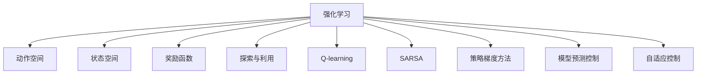

                 

## 1. 背景介绍

随着人工智能技术的迅猛发展，强化学习(Reinforcement Learning, RL)已成为实现复杂自主系统智能决策的核心方法。这一方法被广泛应用于游戏策略、自然语言处理、推荐系统、自动驾驶等领域，近年来也开始被广泛运用于机器人控制，极大地提升了机器人系统的智能化水平。

### 1.1 问题由来

在机器人控制领域，传统的基于规则和感知反馈的控制方法已经无法满足日益复杂和多变的环境需求。与此同时，深度学习技术的兴起，为机器人自主决策提供了新的思路。强化学习以其在无标签数据上的高效学习和泛化能力，逐步成为机器人系统智能化决策的主要手段。

### 1.2 问题核心关键点

强化学习在机器人控制中的应用主要关注以下几个关键点：

- 如何构建合理的奖励函数，使得机器人能够对不同行为进行有效的奖惩，从而选择最优策略。
- 如何在环境动态变化的情况下，使机器人能够快速学习并适应新的行为模式。
- 如何平衡探索和利用，确保机器人在高效的探索过程中，不会浪费过多资源。
- 如何保证系统稳定性和安全性，避免机器人行为对环境和人员造成威胁。
- 如何提高学习效率，在有限的资源和时间条件下，训练出高质量的决策模型。

### 1.3 问题研究意义

强化学习在机器人控制中的应用，能够显著提升机器人的自主决策和环境适应能力。具体而言：

1. 降低开发和运营成本。基于强化学习构建的机器人控制系统，能够自动进行优化和学习，减少人工干预的需求，从而大幅降低开发和运营成本。
2. 提升系统性能。通过强化学习，机器人能够动态地调整行为策略，适应复杂多变的环境条件，提高执行效率和效果。
3. 增强系统鲁棒性。强化学习能够在不断试错中优化策略，提高系统面对异常情况和噪声干扰的鲁棒性。
4. 实现自动化学习。强化学习无需大量人工干预，机器人系统能够通过与环境的交互，自主学习并改进决策模型，逐步具备更强的自主性。
5. 推动工业应用。强化学习为机器人系统的智能化提供了技术基础，推动机器人技术在工业制造、服务机器人、农业自动化等多个领域的应用和落地。

## 2. 核心概念与联系

### 2.1 核心概念概述

为更好地理解强化学习在机器人控制中的应用，本节将介绍几个密切相关的核心概念：

- 强化学习(Reinforcement Learning, RL)：通过与环境互动，智能体学习最优策略的一种学习范式。强化学习模型由环境、智能体、状态、动作和奖励组成。
- 动作空间(Action Space)：智能体可执行的所有动作的集合。
- 状态空间(State Space)：智能体在环境中的所有可能状态集合。
- 奖励函数(Reward Function)：用于评估智能体行为的表现，指导智能体选择最优策略。
- 探索与利用(Exploration vs. Exploitation)：在决策时平衡探索新策略和利用已知策略，避免陷入局部最优。
- Q-learning和SARSA：强化学习中的经典算法，分别基于动作-状态-奖励-动作(state-action-reward-action, SARSA)的迭代优化和动作-状态-奖励-状态(state-action-reward-state, Q-learning)的策略评估。
- 策略梯度方法(Strategy Gradient Methods)：通过梯度上升的方式直接优化策略函数，如策略梯度(PSO)算法。
- 模型预测控制(Model Predictive Control, MPC)：通过预测未来多个时间步的动作效果，优化当前动作决策。
- 自适应控制(Adaptive Control)：在运行过程中动态调整控制参数，适应环境变化。

这些核心概念之间的逻辑关系可以通过以下Mermaid流程图来展示：



这个流程图展示了几大核心概念以及它们之间的联系：

1. 强化学习通过与环境的互动，优化智能体的行为策略。
2. 动作空间和状态空间定义了智能体可执行的动作和所处的环境状态。
3. 奖励函数用于评估行为的表现，指导智能体选择最优策略。
4. 探索与利用平衡了智能体在决策时对新策略的探索和对已知策略的利用。
5. Q-learning和SARSA是常用的优化和评估算法，通过迭代更新策略，实现智能体的学习。
6. 策略梯度方法直接优化策略函数，提高了学习的效率和效果。
7. 模型预测控制和自适应控制，进一步优化了决策过程，提升了系统稳定性和适应性。

这些概念共同构成了强化学习在机器人控制中的应用框架，使其能够在复杂的动态环境中实现高效、自主的决策。

## 3. 核心算法原理 & 具体操作步骤

### 3.1 算法原理概述

强化学习在机器人控制中的应用，本质上是利用强化学习模型，通过与环境的交互，学习最优决策策略的过程。其核心思想是通过不断试错，逐步调整策略，以达到系统最优控制效果。

在机器人控制中，一般将机器人的动作空间作为优化对象，设计适当的奖励函数，指导机器人进行最优策略的学习。强化学习模型通常包括智能体、状态和环境三部分。在每个时间步，智能体根据当前状态选择动作，并根据环境响应获取奖励。模型通过最大化累计奖励，指导智能体选择最优策略。

形式化地，假设机器人系统在环境中的状态为 $s_t$，当前执行的动作为 $a_t$，环境响应后的下一状态为 $s_{t+1}$，奖励为 $r_{t+1}$。强化学习的目标是最大化预期长期累计奖励：

$$
\max_{\pi} \mathbb{E}[\sum_{t=0}^{\infty} \gamma^t r_{t+1}]
$$

其中 $\gamma$ 为折扣因子，通常取0.99。

### 3.2 算法步骤详解

基于强化学习的机器人控制系统通常包括以下几个关键步骤：

**Step 1: 环境建模**

- 定义机器人系统与环境的交互界面，确定状态空间、动作空间、奖励函数。
- 设计环境模拟器，实现对真实环境的虚拟模拟，以便在实验室中安全地测试和训练机器人。

**Step 2: 策略表示**

- 设计合适的策略表示方法，如Q-learning、SARSA、策略梯度等。
- 选择合适的动作表示方法，如连续动作、离散动作、混合动作等。

**Step 3: 初始化**

- 初始化模型参数，如Q值、策略函数、动作选择策略等。
- 设定训练参数，如学习率、探索率、训练轮数等。

**Step 4: 迭代训练**

- 在每个时间步，机器人根据当前状态和策略选择动作。
- 根据环境响应，机器人更新状态和获取奖励。
- 使用强化学习算法更新模型参数，以提升策略效果。
- 不断迭代训练，直至模型收敛或达到预设的训练轮数。

**Step 5: 模型评估**

- 在训练结束后，使用测试集评估模型性能，对比训练前后的效果。
- 分析模型在特定任务上的表现，发现存在的问题和改进空间。

**Step 6: 系统部署**

- 将训练好的模型集成到实际机器人系统中。
- 在实际应用场景中进行性能测试，优化模型参数和策略。
- 持续收集新数据，定期更新模型，确保系统长期稳定运行。

以上是基于强化学习的机器人控制系统的一般流程。在实际应用中，还需要针对具体任务的特点，对各个环节进行优化设计，如改进奖励函数、调整探索率、引入模型预测控制等，以进一步提升系统性能。

### 3.3 算法优缺点

强化学习在机器人控制中的应用，具有以下优点：

1. 自适应性强。机器人系统能够通过不断试错，自动适应复杂多变的环境条件，无需人工干预。
2. 鲁棒性好。强化学习能够在不断试错中优化策略，提升系统面对异常情况和噪声干扰的鲁棒性。
3. 无需标注数据。强化学习不需要标注数据，减少了数据收集和标注的复杂性和成本。
4. 可以处理高维动作空间。强化学习能够处理连续和高维动作空间，适应复杂机器人控制需求。
5. 提供实时优化。强化学习能够在运行过程中动态调整策略，实时优化系统性能。

同时，该方法也存在一定的局限性：

1. 训练时间长。强化学习通常需要大量时间进行训练，特别是在高维动作空间和复杂环境下。
2. 依赖探索率。探索率的选择会影响学习效率和效果，过高会导致探索过多，过低则陷入局部最优。
3. 学习过程不稳定。在复杂环境下，强化学习模型可能存在不稳定的问题，导致训练失败。
4. 可解释性不足。强化学习模型的决策过程难以解释，缺乏透明性和可解释性。
5. 安全性问题。强化学习模型可能存在攻击漏洞，被恶意攻击者利用，造成系统安全问题。

尽管存在这些局限性，但强化学习在机器人控制中的应用前景广阔，随着研究的不断深入，相关问题也在逐步得到解决。

### 3.4 算法应用领域

强化学习在机器人控制中的应用领域非常广泛，涵盖工业自动化、服务机器人、农业自动化等多个行业。以下是一些具体应用场景：

- 工业制造：使用强化学习对机器人进行路径规划、物料搬运、焊接等操作。通过优化动作策略，提升生产效率和精度。
- 服务机器人：利用强化学习对服务机器人进行自主导航、物品抓取、语音交互等任务。通过学习用户行为，提供个性化服务。
- 农业自动化：使用强化学习对农业机器人进行田间导航、播种、收割等操作。通过优化行为策略，提高农业生产效率和精准度。
- 医疗康复：应用强化学习对康复机器人进行动作引导、行为训练等。通过学习病人的动作反馈，调整训练策略，提升康复效果。
- 安全监控：在公共安全、安防等领域，使用强化学习对监控机器人进行路径规划、目标跟踪等任务。通过学习环境反馈，提升监控效果。

随着强化学习技术的不断成熟，相信其在机器人控制中的应用前景将更加广阔。

## 4. 数学模型和公式 & 详细讲解 & 举例说明

### 4.1 数学模型构建

本节将使用数学语言对强化学习在机器人控制中的应用进行更加严格的刻画。

假设机器人系统在环境中的状态为 $s_t$，当前执行的动作为 $a_t$，环境响应后的下一状态为 $s_{t+1}$，奖励为 $r_{t+1}$。强化学习的目标是最大化预期长期累计奖励，即：

$$
\max_{\pi} \mathbb{E}[\sum_{t=0}^{\infty} \gamma^t r_{t+1}]
$$

其中 $\gamma$ 为折扣因子，通常取0.99。

定义 $Q(s_t,a_t)$ 为状态动作对 $(s_t,a_t)$ 的累计奖励期望值。则上述问题可以转化为优化 $Q(s,a)$ 的问题。

定义策略函数 $\pi(a|s)$，表示在状态 $s$ 下，选择动作 $a$ 的概率。策略函数可以通过强化学习算法进行优化。

定义动作选择策略 $\epsilon-\text{greedy}$ 策略，表示在状态 $s$ 下，以概率 $\epsilon$ 随机选择动作，以概率 $1-\epsilon$ 选择 $Q(s,a)$ 最大化的动作。

### 4.2 公式推导过程

以下我们以Q-learning算法为例，推导其具体实现过程。

Q-learning算法通过迭代更新状态动作对的奖励值 $Q(s,a)$，逐步逼近最优策略。其更新公式为：

$$
Q(s_t,a_t) \leftarrow Q(s_t,a_t) + \alpha [r_{t+1} + \gamma \max_a Q(s_{t+1},a) - Q(s_t,a_t)]
$$

其中 $\alpha$ 为学习率，一般取0.01-0.1。

在实际应用中，可以使用样本来近似计算 $Q(s_{t+1},a)$，从而进一步简化计算过程。

### 4.3 案例分析与讲解

为了更直观地理解Q-learning算法在机器人控制中的应用，让我们以一个简单的机器人路径规划任务为例。假设机器人需要在迷宫中寻找出口，其状态表示为当前位置，动作表示为向上、下、左、右移动。

在迷宫中，定义奖励函数如下：

- 当机器人到达出口时，奖励 $r=10$。
- 当机器人碰到墙壁时，奖励 $r=-1$。
- 其他情况奖励 $r=0$。

设 $\epsilon=0.1$，即以10%的概率随机选择动作，90%的概率选择最大化当前 $Q(s,a)$ 的动作。在每个时间步，机器人在当前状态 $s$ 下选择动作 $a$，并根据环境响应更新状态和奖励。

设初始状态为起点 $(0,0)$，目标状态为出口 $(5,5)$。通过不断迭代Q-learning算法，逐步逼近最优策略，最终实现从起点到出口的路径规划。

## 5. 项目实践：代码实例和详细解释说明

### 5.1 开发环境搭建

在进行强化学习实践前，我们需要准备好开发环境。以下是使用Python进行Gym库开发的环境配置流程：

1. 安装Anaconda：从官网下载并安装Anaconda，用于创建独立的Python环境。

2. 创建并激活虚拟环境：
```bash
conda create -n rl-env python=3.8 
conda activate rl-env
```

3. 安装Gym：从官网下载并安装Gym库，用于构建和测试强化学习环境。

4. 安装相关依赖：
```bash
pip install gym gym-suite gym-envs
```

完成上述步骤后，即可在`rl-env`环境中开始强化学习实践。

### 5.2 源代码详细实现

这里我们以一个简单的迷宫路径规划任务为例，使用Q-learning算法进行代码实现。

首先，定义环境和奖励函数：

```python
import gym
import numpy as np

class SimpleMaze(gym.Env):
    def __init__(self, maze, goal=(0, 0)):
        self.maze = maze
        self.goal = goal
        
    def step(self, action):
        x, y = self.state
        if action == 0: # move up
            x -= 1
        elif action == 1: # move down
            x += 1
        elif action == 2: # move left
            y -= 1
        elif action == 3: # move right
            y += 1
        
        self.state = (x, y)
        
        # reward
        if self.state == self.goal:
            reward = 10
        elif self.state in [(0, 0), (1, 0), (2, 0), (3, 0), (0, 1), (1, 1), (2, 1), (3, 1)]:
            reward = -1
        else:
            reward = 0
        
        done = self.state == self.goal
        
        return np.array([reward], dtype=np.float32), done, None, None
        
    def reset(self):
        self.state = (0, 0)
        return np.array([0], dtype=np.float32)
        
    def render(self, mode='human'):
        maze = np.array(self.maze)
        for x, y in self.state:
            maze[x, y] = 2
        for x, y in [(0, 0), (1, 0), (2, 0), (3, 0), (0, 1), (1, 1), (2, 1), (3, 1)]:
            maze[x, y] = 1
        
        print(maze)
```

然后，定义强化学习算法：

```python
import numpy as np

class QLearning:
    def __init__(self, env, learning_rate=0.1, discount_factor=0.99, exploration_rate=1.0, num_episodes=1000):
        self.env = env
        self.learning_rate = learning_rate
        self.discount_factor = discount_factor
        self.exploration_rate = exploration_rate
        self.num_episodes = num_episodes
        self.state_size = len(env.observation_space.np_space[0])
        self.action_size = len(env.action_space.np_space[0])
        self.q_table = np.zeros((self.state_size, self.action_size))
        
    def choose_action(self, state):
        if np.random.uniform() < self.exploration_rate:
            action = np.random.randint(0, self.action_size)
        else:
            action = self.q_table[state].argmax()
        return action
        
    def train(self):
        for episode in range(self.num_episodes):
            state = self.env.reset()
            done = False
            total_reward = 0
            
            while not done:
                action = self.choose_action(state)
                next_state, reward, done, _ = self.env.step(action)
                q_new = self.q_table[state, action] + self.learning_rate * (reward + self.discount_factor * self.q_table[next_state].argmax() - self.q_table[state, action])
                self.q_table[state, action] = q_new
                
                if done:
                    print(f'Episode {episode+1}, total reward: {total_reward:.2f}')
                else:
                    state = next_state
                    total_reward += reward
```

接着，启动训练流程：

```python
if __name__ == '__main__':
    env = SimpleMaze(maze=[[0, 0, 0, 0, 0, 0, 0, 0],
                          [0, 0, 0, 0, 0, 0, 0, 0],
                          [0, 0, 0, 0, 0, 0, 0, 0],
                          [0, 0, 0, 1, 0, 0, 0, 0],
                          [0, 0, 0, 0, 0, 0, 0, 0],
                          [0, 0, 0, 0, 0, 0, 0, 0],
                          [0, 0, 0, 0, 0, 0, 0, 0],
                          [0, 0, 0, 0, 0, 0, 0, 0]])
    
    q_learning = QLearning(env)
    q_learning.train()
```

以上就是使用Gym库进行Q-learning算法在迷宫路径规划任务中的代码实现。可以看到，代码实现了Q-learning算法的核心逻辑，包括动作选择、状态更新、奖励计算和Q值更新等步骤。

### 5.3 代码解读与分析

让我们再详细解读一下关键代码的实现细节：

**SimpleMaze类**：
- `__init__`方法：初始化迷宫、目标位置等关键组件。
- `step`方法：根据动作更新状态和计算奖励，返回下一个状态和奖励。
- `reset`方法：重置当前状态为起点。
- `render`方法：输出迷宫的可视化信息。

**QLearning类**：
- `__init__`方法：初始化算法参数和Q值表。
- `choose_action`方法：根据探索率选择动作。
- `train`方法：执行Q-learning算法的训练过程，迭代更新Q值表。

**训练流程**：
- 初始化环境并创建Q-learning对象。
- 在每个 episode 中，使用 `reset` 方法获取起始状态。
- 在 episode 中不断进行迭代，直到 `done` 为 True。
- 在每个 time step 中，根据当前状态和探索率选择动作。
- 更新状态和奖励，计算新的Q值。
- 更新Q值表，并输出 episode 的累计奖励。

可以看到，Gym库为强化学习提供了便捷的环境模拟和数据处理功能，使得代码实现更加高效和简洁。开发者可以在Gym上构建各类复杂的强化学习任务，如机器人控制、游戏策略、路径规划等，快速迭代和优化算法。

## 6. 实际应用场景

### 6.1 工业制造

在工业制造领域，强化学习被广泛用于机器人路径规划、物料搬运、质量检测等任务。通过优化机器人动作策略，可以提升生产效率和精度，降低人工干预和运营成本。

在路径规划任务中，机器人需要根据给定任务，在复杂多变的生产环境中自主规划最优路径。使用强化学习算法，机器人可以不断试错，逐步学习到最优路径策略。通过引入模型预测控制和自适应控制技术，进一步提高路径规划的稳定性和准确性。

在物料搬运任务中，机器人需要从仓库中自动取出物料，并运送到指定位置。使用强化学习算法，机器人可以学习最优搬运策略，提升物料搬运的效率和准确性。通过引入视觉感知和传感器数据，进一步优化机器人动作决策。

在质量检测任务中，机器人需要在生产线上自动检测产品质量，识别出次品并进行分类。使用强化学习算法，机器人可以学习最优检测策略，提升质量检测的准确性和稳定性。通过引入机器学习算法和传感器数据，进一步提高质量检测的效率和精度。

### 6.2 服务机器人

在服务机器人领域，强化学习被广泛用于自主导航、物品抓取、语音交互等任务。通过优化机器人动作策略，可以提升用户体验和服务质量。

在自主导航任务中，服务机器人需要根据用户指令，在复杂多变的环境中自主导航。使用强化学习算法，机器人可以不断试错，逐步学习到最优导航策略。通过引入视觉感知和传感器数据，进一步优化机器人动作决策。

在物品抓取任务中，服务机器人需要在用户指定位置抓取物品。使用强化学习算法，机器人可以学习最优抓取策略，提升抓取效率和准确性。通过引入视觉感知和传感器数据，进一步优化机器人动作决策。

在语音交互任务中，服务机器人需要根据用户语音指令，执行相应操作。使用强化学习算法，机器人可以学习最优语音识别和回复策略，提升用户交互体验。通过引入自然语言处理技术，进一步优化语音交互效果。

### 6.3 农业自动化

在农业自动化领域，强化学习被广泛用于田间导航、播种、收割等任务。通过优化机器人动作策略，可以提升农业生产效率和精准度。

在田间导航任务中，农业机器人需要在田间自主导航，找到指定位置并进行播种或收割。使用强化学习算法，机器人可以学习最优导航策略，提升导航效率和准确性。通过引入传感器数据和机器视觉技术，进一步优化机器人动作决策。

在播种任务中，农业机器人需要在田间自动播种。使用强化学习算法，机器人可以学习最优播种策略，提升播种效率和精准度。通过引入传感器数据和机器视觉技术，进一步优化机器人动作决策。

在收割任务中，农业机器人需要在田间自动收割。使用强化学习算法，机器人可以学习最优收割策略，提升收割效率和精准度。通过引入传感器数据和机器视觉技术，进一步优化机器人动作决策。

### 6.4 未来应用展望

随着强化学习技术的不断成熟，其在机器人控制中的应用前景将更加广阔。以下是几个未来发展的方向：

1. 多模态融合。将视觉、听觉、触觉等多种传感器数据融合到强化学习模型中，提升机器人对环境的感知能力。
2. 自适应学习。通过在线学习算法，机器人能够动态调整学习策略，适应复杂多变的环境条件。
3. 分布式控制。将多机器人系统进行分布式控制，优化资源分配和任务协调。
4. 边缘计算。将计算任务转移到边缘设备，提升机器人系统的实时性和响应速度。
5. 异构融合。将机器人系统与其他智能设备进行异构融合，提升系统整体性能和协作能力。

未来，随着强化学习技术的不断发展，相信机器人控制系统将更加智能化、自主化，为工业制造、服务机器人、农业自动化等多个领域带来新的变革和突破。

## 7. 工具和资源推荐

### 7.1 学习资源推荐

为了帮助开发者系统掌握强化学习在机器人控制中的应用，这里推荐一些优质的学习资源：

1. 《强化学习》系列书籍：由Reinforcement Learning领域的权威学者撰写，深入浅出地介绍了强化学习的基本概念和经典算法。
2. 《Deep Reinforcement Learning》课程：由Google DeepMind开设的在线课程，涵盖强化学习的基本原理和应用案例。
3. Gym库官方文档：Gym库的官方文档，提供了丰富的环境模拟和算法实现样例，适合入门和进阶学习。
4. OpenAI Gym环境库：提供了各种复杂的强化学习环境，如机器人控制、游戏策略、路径规划等，适合进行深入研究和算法优化。
5. Reinforcement Learning A-Z课程：由Udemy提供的全面系统课程，从入门到进阶，涵盖强化学习的基本概念和前沿技术。

通过对这些资源的学习实践，相信你一定能够快速掌握强化学习在机器人控制中的应用，并用于解决实际的机器人控制问题。

### 7.2 开发工具推荐

高效的开发离不开优秀的工具支持。以下是几款用于强化学习在机器人控制中开发的常用工具：

1. Gym库：提供了丰富的环境模拟和算法实现样例，适合进行深入研究和算法优化。
2. TensorFlow和PyTorch：两大深度学习框架，支持强化学习模型的实现和优化。
3. OpenAI Gym环境库：提供了各种复杂的强化学习环境，如机器人控制、游戏策略、路径规划等，适合进行深入研究和算法优化。
4. Jupyter Notebook：可视化编程环境，适合进行算法实验和结果分析。
5. TensorBoard：深度学习框架TensorFlow的可视化工具，可以实时监测模型训练状态，并提供丰富的图表呈现方式，是调试模型的得力助手。

合理利用这些工具，可以显著提升强化学习在机器人控制中的应用开发效率，加快创新迭代的步伐。

### 7.3 相关论文推荐

强化学习在机器人控制中的应用源于学界的持续研究。以下是几篇奠基性的相关论文，推荐阅读：

1. Reinforcement Learning: An Introduction by Richard S. Sutton and Andrew G. Barto：经典入门教材，全面介绍了强化学习的基本概念和算法。
2. Playing Atari with Deep Reinforcement Learning by Volodymyr Mnih et al.：展示了深度强化学习在复杂游戏中的应用，引发了对该领域的研究热潮。
3. DeepMind's AlphaGo: Mastering the Game of Go with Monte Carlo Tree Search by David Silver et al.：展示了深度强化学习在围棋中的应用，标志着该技术的重要突破。
4. Model-based Control of a High Speed Robot Arm with Deep Reinforcement Learning by Ilja Kurakin et al.：展示了强化学习在工业机器人控制中的应用，提升了机器人系统的自主性和效率。
5. Deep Reinforcement Learning for Robotic Manipulation: Walking, Falling and Finishing by Joern Heinrich et al.：展示了强化学习在机器人操纵中的应用，提升了机器人系统的灵活性和精准度。

这些论文代表了大语言模型微调技术的发展脉络。通过学习这些前沿成果，可以帮助研究者把握学科前进方向，激发更多的创新灵感。

## 8. 总结：未来发展趋势与挑战

### 8.1 总结

本文对强化学习在机器人控制中的应用进行了全面系统的介绍。首先阐述了强化学习的背景和重要性，明确了强化学习在机器人控制中的应用潜力。其次，从原理到实践，详细讲解了强化学习算法的核心步骤和关键参数，给出了强化学习任务开发的完整代码实例。同时，本文还广泛探讨了强化学习在工业制造、服务机器人、农业自动化等多个行业领域的应用前景，展示了强化学习范式的广泛适用性。此外，本文精选了强化学习技术的各类学习资源，力求为读者提供全方位的技术指引。

通过本文的系统梳理，可以看到，强化学习在机器人控制中的应用前景广阔，极大地提升了机器人系统的智能化水平，提高了生产效率和用户体验。未来，随着技术的发展和应用的推广，强化学习将带来更多的创新突破，推动机器人技术在各行业的落地和应用。

### 8.2 未来发展趋势

展望未来，强化学习在机器人控制中的应用将呈现以下几个发展趋势：

1. 自适应性更强。未来的机器人控制系统将更加自主化，能够实时动态地调整策略，适应复杂多变的环境条件。
2. 学习效率更高。未来将引入更多的在线学习算法和混合学习方法，提升机器人的学习效率和效果。
3. 应用场景更广。强化学习将应用于更多领域的机器人控制，如医疗、教育、安全等领域，带来更广泛的实际应用。
4. 人机协同更深入。未来的机器人系统将更加智能化，能够更好地与人类协同工作，提升生产和服务效率。
5. 多模态融合更深入。未来的机器人系统将融合视觉、听觉、触觉等多种传感器数据，提升对环境的感知能力。
6. 安全性和可靠性更高。未来的机器人系统将更加注重安全性、可靠性和鲁棒性，避免对环境和人员造成威胁。

这些趋势凸显了强化学习在机器人控制中的广阔前景。未来的研究将更加关注如何提高系统的自主性和智能性，增强机器人的实时性和响应速度，确保系统稳定性和安全性，实现更广泛的应用场景。

### 8.3 面临的挑战

尽管强化学习在机器人控制中的应用前景广阔，但在迈向更加智能化、普适化应用的过程中，仍面临诸多挑战：

1. 数据采集成本高。强化学习需要大量的训练数据，特别是高维动作空间和复杂环境下的数据，采集成本较高。如何降低数据采集成本，提高数据利用效率，将是重要的研究方向。
2. 学习过程不稳定。强化学习算法在不同环境和任务上的表现不稳定，容易陷入局部最优。如何提高算法的鲁棒性和稳定性，保证模型在不同环境下的泛化能力，将是一大挑战。
3. 计算资源消耗大。强化学习算法通常需要大量计算资源进行训练，特别是在高维动作空间和复杂环境下。如何优化算法，减少计算资源消耗，提升训练效率，将是重要的研究方向。
4. 系统安全性问题。强化学习模型可能存在攻击漏洞，被恶意攻击者利用，造成系统安全问题。如何提高系统的安全性，确保模型行为的透明性和可解释性，将是一大挑战。
5. 人机交互问题。未来的机器人系统需要更好地与人类协同工作，如何设计友好的交互界面，增强人机协同能力，将是一大挑战。

尽管存在这些挑战，但随着研究的不懈努力，相关问题正在逐步得到解决。相信未来强化学习将能够更好地应用于机器人控制，推动机器人技术在各领域的落地和应用。

### 8.4 研究展望

面对强化学习在机器人控制中所面临的挑战，未来的研究需要在以下几个方面寻求新的突破：

1. 多模态融合技术。将视觉、听觉、触觉等多种传感器数据融合到强化学习模型中，提升机器人对环境的感知能力。
2. 自适应学习算法。开发更加自适应、高效的在线学习算法，提升机器人的学习效率和效果。
3. 分布式控制算法。将多机器人系统进行分布式控制，优化资源分配和任务协调。
4. 安全性和鲁棒性增强。在算法设计和系统部署中，增强系统的安全性、鲁棒性和稳定性，避免系统攻击和安全漏洞。
5. 人机交互界面设计。设计友好的交互界面，增强人机协同能力，提升用户体验。

这些研究方向的探索，必将引领强化学习在机器人控制中的应用迈向更高的台阶，为机器人系统的智能化和自动化提供更强大的技术支持。只有勇于创新、敢于突破，才能真正实现强化学习在机器人控制中的应用价值。

## 9. 附录：常见问题与解答

**Q1：强化学习在机器人控制中的应用是否适用于所有类型的机器人？**

A: 强化学习在机器人控制中的应用，通常适用于具备可控动作空间和可测状态空间的机器人系统。对于一些无法精确建模和控制的系统，如软体机器人、液态机器人等，强化学习的效果可能不如其他控制方法。

**Q2：如何选择合适的动作空间？**

A: 选择合适的动作空间需要根据机器人系统的具体需求和控制能力。通常有以下几种动作空间：
1. 连续动作空间：适用于对精度要求较高的任务，如精密操作。
2. 离散动作空间：适用于对效率要求较高的任务，如物品抓取。
3. 混合动作空间：将连续和离散动作空间相结合，适用于复杂任务。

**Q3：强化学习在机器人控制中是否需要大量标注数据？**

A: 强化学习通常不需要大量标注数据，可以依赖于环境反馈和奖励函数进行训练。但在某些特定任务中，如目标检测、路径规划等，需要一定的标注数据进行预训练，以提高模型的初始化效果。

**Q4：强化学习在机器人控制中是否会存在安全性问题？**

A: 强化学习在机器人控制中可能会存在安全性问题，如模型攻击、异常行为等。为了提高系统的安全性，需要在算法设计和系统部署中加强安全性和鲁棒性设计。

**Q5：强化学习在机器人控制中的计算资源消耗大吗？**

A: 强化学习在机器人控制中的计算资源消耗较大，特别是在高维动作空间和复杂环境下。为了降低计算资源消耗，可以采用分布式计算、模型压缩、混合学习等方法进行优化。

这些问题的回答，希望能为你提供清晰的指导和解答，助你在强化学习在机器人控制中的应用中更好地解决问题。

