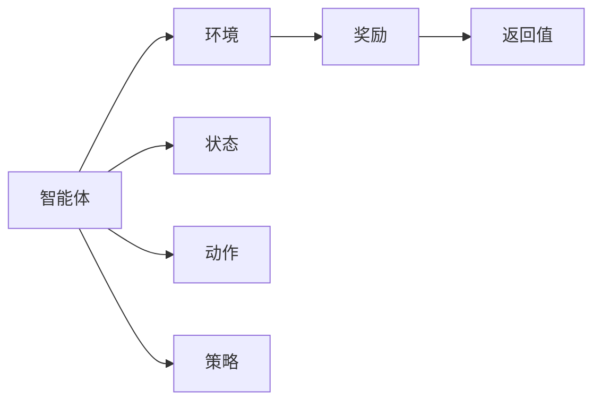

                 

# 强化学习：奖励函数的选择与优化

## 1. 背景介绍

强化学习（Reinforcement Learning, RL）是机器学习的一个分支，旨在通过智能体（agent）与环境（environment）的交互，使智能体在一定策略指导下，通过试错逐步优化决策过程，最终达成某个长期目标。强化学习的核心在于通过模型参数的调整，在智能体与环境交互过程中最大化累计回报（cumulative reward）。在强化学习中，智能体的学习过程可以看作是通过奖励信号不断调整策略，从而优化动作执行结果的过程。因此，奖励函数（Reward Function）的设计和优化对强化学习算法的效果有着重要影响。

## 2. 核心概念与联系

### 2.1 核心概念概述

在强化学习中，奖励函数是智能体通过执行动作（action）所得到的反馈信号，用于衡量智能体当前动作的好坏程度。奖励函数的目标是设计合理的奖励机制，使得智能体在每次动作执行后，能够尽可能地朝着长期目标迈进。

- **动作（Action）**：智能体可以执行的一系列可能的行动。
- **状态（State）**：智能体与环境交互时的当前状态，可以是高维向量或其他可表示形式。
- **策略（Policy）**：智能体选择动作的规则，可以用策略函数（如概率分布）来表示。
- **奖励（Reward）**：智能体执行动作后，从环境中获得的一个即时反馈，用于评估动作的好坏。
- **回报（Return）**：智能体在一定策略下，从某个起始状态出发，执行一系列动作所获得的累积奖励。

### 2.2 核心概念原理和架构的 Mermaid 流程图



在这个流程图中，智能体（A）通过策略函数（E）选择动作（D），并根据环境（B）的反馈（F）进行状态更新（C）和回报计算（G）。

## 3. 核心算法原理 & 具体操作步骤

### 3.1 算法原理概述

强化学习的核心是智能体在一定策略下，通过与环境的交互，最大化预期回报。智能体通过策略函数（如概率分布）选择动作，在每次与环境交互后，根据当前状态和动作获取环境反馈（即奖励函数），并根据奖励信号更新策略参数，以逐步优化动作选择，最终达到长期目标。

强化学习的算法一般分为以下步骤：

1. 初始化智能体和环境。
2. 选择动作并执行。
3. 观察环境状态并获取奖励。
4. 更新策略参数。
5. 重复执行直到达到终止条件或达到最大迭代次数。

### 3.2 算法步骤详解

#### 3.2.1 状态表示

状态是智能体与环境交互时所处的情况，通常用高维向量表示。状态表示的好坏直接影响智能体的学习效率。状态表示应尽可能充分反映环境信息，同时应尽可能地减少维度，以避免维度灾难。

#### 3.2.2 动作空间设计

动作空间是智能体可能采取的所有行动的集合。动作空间的设计应根据具体问题进行调整。例如，在控制飞行器的场景中，动作空间可以是飞行器的位置、速度和姿态角等；在交易场景中，动作空间可以是买卖股票的决定等。

#### 3.2.3 奖励函数设计

奖励函数是强化学习的核心，其设计直接影响智能体的学习效果。一个好的奖励函数应该满足以下条件：

- **稀疏性（Sparsity）**：奖励应该具有一定稀疏性，使得智能体在执行动作后能够获得明确的目标反馈，避免动作执行过程过于频繁，降低学习效率。
- **延迟性（Delayed）**：奖励应该具有一定的延迟性，以平衡即时反馈和长期目标，使得智能体能够在长期范围内做出最优决策。
- **公平性（Fairness）**：奖励应该公平地评估所有可能的动作，避免奖励过于偏向某些动作，导致智能体学习过程失衡。
- **可解释性（Interpretability）**：奖励函数的设计应尽可能简单明了，便于理解和调试。

#### 3.2.4 策略更新方法

在强化学习中，策略更新方法有多种，常见的包括基于价值函数的策略更新（如Q-learning）和基于策略函数的策略更新（如Policy Gradient）。这些方法在处理不同类型问题时具有不同的优势。

- **Q-learning**：通过估计状态-动作对（S-A）的价值函数（Q值），更新策略参数。适合于小规模问题。
- **Policy Gradient**：直接优化策略函数，使得策略最大化累积回报。适合于大规模问题，但收敛速度较慢。

### 3.3 算法优缺点

#### 3.3.1 优点

- **适应性强**：强化学习能够适应多种复杂问题，包括但不限于游戏、机器人控制、自动驾驶等。
- **可解释性**：强化学习通过奖励函数的设计，提供了直观的目标导向，使得智能体的行为和决策过程具有较高的可解释性。
- **自动优化**：强化学习通过不断与环境的交互，自动优化策略参数，无需人工干预。

#### 3.3.2 缺点

- **优化困难**：奖励函数的设计和策略更新需要大量实验和调试，存在较大的优化难度。
- **样本效率低**：强化学习通常需要大量样本来收敛，且样本采集成本较高。
- **过度优化**：奖励函数的设计不当可能导致智能体过度优化某些特定动作，导致学习过程不稳定。

### 3.4 算法应用领域

强化学习在多个领域得到了广泛应用，以下是一些典型的应用场景：

- **游戏AI**：通过强化学习训练AI玩家，使得其在各种游戏中能够自我优化并取得优异成绩。例如AlphaGo就是通过强化学习训练而成。
- **机器人控制**：通过强化学习训练机器人进行自动导航、物体抓取、语音识别等任务。
- **自动驾驶**：通过强化学习训练自动驾驶车辆，实现智能避障、路径规划等功能。
- **金融交易**：通过强化学习训练交易策略，实现自动下单和风险管理。
- **推荐系统**：通过强化学习训练推荐模型，实现个性化推荐。
- **自然语言处理**：通过强化学习训练语言模型，实现文本生成、翻译等任务。

## 4. 数学模型和公式 & 详细讲解 & 举例说明

### 4.1 数学模型构建

在强化学习中，数学模型通常包含以下几个关键组成部分：

- **状态空间（State Space）**：用$\mathcal{S}$表示，智能体与环境交互时的当前状态。
- **动作空间（Action Space）**：用$\mathcal{A}$表示，智能体可以执行的动作集合。
- **策略函数（Policy Function）**：用$\pi$表示，智能体选择动作的策略函数，可以是概率分布或其他可表示形式。
- **奖励函数（Reward Function）**：用$R$表示，智能体在执行动作后获取的奖励信号。

### 4.2 公式推导过程

强化学习的核心是最大化预期回报（Expected Return）。预期回报可以表示为：

$$
J(\pi) = \mathbb{E}_{\pi}\left[\sum_{t=1}^{T} \gamma^{t-1}R_t\right]
$$

其中，$J(\pi)$表示在策略$\pi$下的预期回报，$R_t$表示在第$t$步的奖励，$\gamma$表示折扣因子，$T$表示最大的迭代次数。

强化学习的目标是通过策略函数的优化，使得$J(\pi)$最大化。常见的优化方法包括基于值函数的优化（如Q-learning）和基于策略函数的优化（如Policy Gradient）。

#### 4.2.1 Q-learning

Q-learning是通过估计状态-动作对（S-A）的价值函数$Q(s, a)$来更新策略参数。Q值表示在状态$s$下执行动作$a$后的预期回报。

$$
Q_{t+1}(s_t, a_t) = Q_{t}(s_t, a_t) + \alpha [R_{t+1} + \gamma \max_{a'} Q_{t}(s_{t+1}, a')] - Q_{t}(s_t, a_t)
$$

其中，$R_{t+1}$表示在第$t+1$步的奖励，$\alpha$表示学习率。

#### 4.2.2 Policy Gradient

Policy Gradient是通过直接优化策略函数$\pi(a|s)$来最大化预期回报。策略梯度表示为：

$$
\nabla_\theta J(\pi_\theta) = \mathbb{E}_{\pi_\theta}[\frac{\partial \log \pi_\theta(a|s)}{\partial \theta} Q_{t}(s, a)]
$$

其中，$\theta$表示策略函数的参数，$Q_{t}(s, a)$表示在状态$s$下执行动作$a$后的价值函数。

### 4.3 案例分析与讲解

#### 4.3.1 基于Q-learning的自动驾驶车控制

在自动驾驶车控制问题中，智能体（即自动驾驶车）需要学习如何在复杂的城市环境中行驶。状态空间可以用车辆的位置、速度、角度等表示，动作空间包括加速度、刹车、转向等。奖励函数可以设计为当智能体成功避开障碍物时给予高奖励，否则给予低奖励或负奖励。

通过Q-learning算法，智能体可以逐步学习到在不同状态下，选择不同的动作，以最大化累积奖励。在实际应用中，可以通过模拟环境（如CARLA）进行训练，逐步优化自动驾驶车的控制策略。

#### 4.3.2 基于Policy Gradient的股票交易策略

在股票交易策略问题中，智能体（即股票交易模型）需要学习如何在不同市场环境下进行买卖决策。状态空间可以包括股票价格、市场情绪等，动作空间包括买入、卖出等。奖励函数可以设计为在短期内获得高收益时给予高奖励，否则给予低奖励或负奖励。

通过Policy Gradient算法，智能体可以逐步学习到在不同市场环境下，选择不同的买卖策略，以最大化累积收益。在实际应用中，可以通过历史交易数据进行训练，逐步优化交易策略。

## 5. 项目实践：代码实例和详细解释说明

### 5.1 开发环境搭建

在进行强化学习实践前，我们需要准备好开发环境。以下是使用Python进行Reinforcement Learning开发的环境配置流程：

1. 安装Anaconda：从官网下载并安装Anaconda，用于创建独立的Python环境。

2. 创建并激活虚拟环境：
```bash
conda create -n reinforcement-env python=3.8 
conda activate reinforcement-env
```

3. 安装Reinforcement Learning库：
```bash
conda install gym numpy pandas scikit-learn matplotlib jupyter notebook ipython
```

完成上述步骤后，即可在`reinforcement-env`环境中开始Reinforcement Learning的实践。

### 5.2 源代码详细实现

这里以一个简单的“吃豆人”（Pong）游戏为例，使用Reinforcement Learning进行训练。

首先，我们需要安装 Gym 环境：

```bash
pip install gym
```

然后，我们可以编写以下代码，实现使用Q-learning算法训练“吃豆人”：

```python
import gym
import numpy as np
from scipy.optimize import minimize

env = gym.make("Pong-v0")

# 定义动作空间和状态空间
action_space = env.action_space
state_size = env.observation_space.shape[0]

# 定义奖励函数
def reward(state, action):
    if state[0] > 0.8:
        return 1
    elif state[0] < -0.8:
        return -1
    else:
        return 0

# 定义Q值函数
def q_values(s, a):
    return 0

# 定义Q-learning算法
def q_learning(env, num_episodes, alpha, gamma):
    q_values = np.zeros((state_size, action_space.n))
    for episode in range(num_episodes):
        state = env.reset()
        done = False
        while not done:
            a = np.argmax(q_values[state])
            next_state, r, done, _ = env.step(a)
            q_values[state, a] += alpha * (r + gamma * np.max(q_values[next_state]) - q_values[state, a])
            state = next_state
    return q_values

# 训练模型
alpha = 0.1
gamma = 0.9
q_values = q_learning(env, 1000, alpha, gamma)

# 评估模型
state = env.reset()
done = False
while not done:
    a = np.argmax(q_values[state])
    next_state, r, done, _ = env.step(a)
    print(f"Episode {episode+1}, Reward: {r}")
    state = next_state
```

在这个代码中，我们使用 Gym 环境来模拟“吃豆人”游戏，定义了奖励函数、Q值函数和 Q-learning 算法。通过训练模型，并在测试集中评估模型性能，我们可以逐步优化模型的决策策略。

### 5.3 代码解读与分析

在这个代码中，我们使用了 Gym 环境来模拟“吃豆人”游戏，并定义了奖励函数和 Q 值函数。在 Q-learning 算法中，我们通过不断更新 Q 值，使得智能体在执行动作后能够最大化累积奖励。

值得注意的是，在实际应用中，由于“吃豆人”游戏的状态空间较大，我们通常需要使用一些方法来简化状态空间，例如状态抽象、状态划分等。此外，在处理高维状态空间时，我们还可以使用一些方法来减少计算量，例如状态向量化、状态压缩等。

## 6. 实际应用场景

### 6.1 游戏AI

在游戏AI领域，强化学习被广泛应用于训练智能体进行游戏竞技。例如，AlphaGo通过强化学习训练，在围棋比赛中取得了人类难以匹敌的战绩。在“吃豆人”等游戏中，强化学习也被广泛应用，训练智能体在复杂环境下进行自主决策。

### 6.2 机器人控制

在机器人控制领域，强化学习被用于训练机器人进行自主导航、物体抓取等任务。通过强化学习，机器人能够在不断试错中优化控制策略，逐步提高执行效率和准确性。

### 6.3 自动驾驶

在自动驾驶领域，强化学习被用于训练自动驾驶车进行路径规划、避障等任务。通过强化学习，自动驾驶车能够在复杂的城市环境中，自主决策并实现安全行驶。

### 6.4 未来应用展望

随着强化学习技术的不断发展，其在更多领域的应用前景广阔。未来，强化学习将在智能制造、金融交易、医疗健康等领域发挥重要作用，带来全新的生产方式、交易策略和医疗诊断方法。

## 7. 工具和资源推荐

### 7.1 学习资源推荐

为了帮助开发者系统掌握强化学习算法，这里推荐一些优质的学习资源：

1. 《Reinforcement Learning: An Introduction》书籍：由Richard S. Sutton和Andrew G. Barto合著，是强化学习领域的经典教材，全面介绍了强化学习的理论和实践。

2. 《Deep Reinforcement Learning with PyTorch》书籍：由Seth K. Magleby合著，详细介绍了如何使用PyTorch实现强化学习算法，适合实践学习。

3. Coursera上的《Reinforcement Learning》课程：由David Silver等教授主讲，是强化学习领域的权威课程，涵盖了强化学习的理论和实践。

4. Udacity上的《Reinforcement Learning Engineer》纳米学位课程：由Google和OpenAI联合推出，提供了从零开始学习强化学习的全套课程。

5. arXiv上的最新论文和预印本：包括Reinforcement Learning领域的最新研究成果和进展，适合跟踪前沿研究动态。

通过对这些资源的学习实践，相信你一定能够快速掌握强化学习算法的精髓，并用于解决实际的NLP问题。

### 7.2 开发工具推荐

在Reinforcement Learning的开发中，使用Python可以大大简化开发流程，同时还可以使用以下工具提高开发效率：

1. PyTorch：基于Python的开源深度学习框架，支持动态计算图，适合Reinforcement Learning算法的研究和实现。

2. TensorFlow：由Google主导开发的开源深度学习框架，生产部署方便，适合大规模工程应用。

3. Gym：OpenAI开发的Reinforcement Learning环境库，提供了多种游戏环境和任务，方便进行实验和测试。

4. Matplotlib：Python中的数据可视化库，可以绘制各种图表，方便分析和调试。

5. Jupyter Notebook：开源的交互式笔记本，支持代码块的逐行执行，方便调试和测试。

合理利用这些工具，可以显著提升Reinforcement Learning的开发效率，加快创新迭代的步伐。

### 7.3 相关论文推荐

强化学习在多个领域得到了广泛应用，以下是几篇奠基性的相关论文，推荐阅读：

1. Q-learning（Watkins，1992）：提出了Q-learning算法，奠定了强化学习的基础。

2. Deep Q-learning（Mnih等，2015）：使用深度神经网络进行状态表示和动作选择，大幅提升了Q-learning的性能。

3. Policy Gradient（Sutton等，1998）：提出了基于策略函数的强化学习算法，适合大规模问题。

4. AlphaGo（Silver等，2016）：通过深度强化学习训练AI玩家，使得其在围棋比赛中取得了人类难以匹敌的战绩。

5. Softmax Policy Gradient（Baxter和Lagoudarides，1995）：通过引入Softmax函数，提升了策略函数的优化效果。

6. Trust Region Policy Optimization（Schulman等，2017）：提出Trust Region Policy Optimization算法，进一步提升了策略函数优化的效果。

这些论文代表了大强化学习算法的发展脉络。通过学习这些前沿成果，可以帮助研究者把握学科前进方向，激发更多的创新灵感。

## 8. 总结：未来发展趋势与挑战

### 8.1 研究成果总结

强化学习在机器学习领域已经取得了巨大的成功，其核心思想是智能体在一定策略下，通过与环境的交互，逐步优化决策过程，以最大化预期回报。强化学习的核心在于奖励函数的设计和策略更新。通过不断优化奖励函数和策略函数，强化学习算法能够在复杂环境中找到最优决策。

### 8.2 未来发展趋势

展望未来，强化学习将呈现以下几个发展趋势：

1. 自动化设计：随着自动化机器学习（AutoML）技术的发展，强化学习也将向自动化设计方向发展，使得奖励函数和策略函数的设计更加高效和便捷。

2. 多智能体学习：多智能体学习（Multi-Agent Learning）将进一步发展，智能体之间的合作和竞争将带来新的研究方向和应用场景。

3. 混合强化学习：混合强化学习（Hybrid Reinforcement Learning）将融合不同类型的方法，如进化算法、优化算法等，以应对更加复杂的问题。

4. 异步强化学习：异步强化学习（Asynchronous Reinforcement Learning）将提升算法效率，使得大规模问题的训练更加高效。

5. 自适应学习：自适应强化学习（Adaptive Reinforcement Learning）将根据环境变化自动调整策略，提升算法鲁棒性和适应性。

6. 迁移强化学习：迁移强化学习（Transfer Reinforcement Learning）将通过迁移学习方法，在不同环境之间进行策略迁移，以提高学习效率和效果。

这些趋势将推动强化学习技术的进一步发展，带来更加强大和灵活的智能系统。

### 8.3 面临的挑战

尽管强化学习已经取得了一定的成就，但在应用中仍面临诸多挑战：

1. 奖励函数设计困难：奖励函数的设计需要充分考虑问题特点和环境特性，难以设计出合理的奖励函数。

2. 优化问题复杂：强化学习本质上是一个优化问题，其复杂度随着问题规模的增加而呈指数级增长。

3. 样本效率低：强化学习通常需要大量样本来收敛，且样本采集成本较高。

4. 稳定性问题：强化学习算法容易陷入局部最优解，导致学习过程不稳定。

5. 模型复杂度高：当前强化学习算法需要较高的计算资源，模型复杂度高，难以在大规模问题上应用。

6. 鲁棒性不足：强化学习模型对环境变化和噪声敏感，鲁棒性不足。

这些挑战需要研究者持续探索和优化，以提高强化学习算法的性能和稳定性。

### 8.4 研究展望

未来，强化学习将与其他人工智能技术进行更深入的融合，如知识表示、因果推理、强化学习等，多路径协同发力，共同推动自然语言理解和智能交互系统的进步。通过引入更多先验知识、因果分析和博弈论工具，强化学习将进一步提升模型的鲁棒性和稳定性。

## 9. 附录：常见问题与解答

**Q1：强化学习中的奖励函数设计有何重要性？**

A: 奖励函数是强化学习的核心，其设计直接影响智能体的学习效果。一个好的奖励函数应该满足稀疏性、延迟性、公平性和可解释性。奖励函数的设计需要充分考虑问题特点和环境特性，确保智能体能够在不同状态下做出最优决策。

**Q2：Q-learning和Policy Gradient有何区别？**

A: Q-learning是通过估计状态-动作对（S-A）的价值函数（Q值）来更新策略参数。适合于小规模问题。Policy Gradient是通过直接优化策略函数来最大化预期回报。适合于大规模问题，但收敛速度较慢。

**Q3：如何提高强化学习算法的效率？**

A: 提高强化学习算法的效率可以从以下几个方面入手：
1. 使用异步训练：异步训练可以提升算法效率，使得大规模问题的训练更加高效。
2. 使用自适应学习：自适应学习可以根据环境变化自动调整策略，提升算法鲁棒性和适应性。
3. 使用混合算法：混合算法将不同类型的方法进行组合，以应对更加复杂的问题。

**Q4：强化学习在实际应用中需要注意哪些问题？**

A: 在实际应用中，强化学习需要注意以下几个问题：
1. 奖励函数设计：奖励函数的设计需要充分考虑问题特点和环境特性，确保智能体能够在不同状态下做出最优决策。
2. 样本采集：强化学习通常需要大量样本来收敛，且样本采集成本较高。
3. 稳定性问题：强化学习算法容易陷入局部最优解，导致学习过程不稳定。
4. 模型复杂度：当前强化学习算法需要较高的计算资源，模型复杂度高，难以在大规模问题上应用。
5. 鲁棒性问题：强化学习模型对环境变化和噪声敏感，鲁棒性不足。

**Q5：如何在强化学习中设计合理的奖励函数？**

A: 设计合理的奖励函数需要考虑以下几个方面：
1. 稀疏性：奖励应该具有一定稀疏性，使得智能体在执行动作后能够获得明确的目标反馈，避免动作执行过程过于频繁，降低学习效率。
2. 延迟性：奖励应该具有一定的延迟性，以平衡即时反馈和长期目标，使得智能体能够在长期范围内做出最优决策。
3. 公平性：奖励应该公平地评估所有可能的动作，避免奖励过于偏向某些动作，导致智能体学习过程失衡。
4. 可解释性：奖励函数的设计应尽可能简单明了，便于理解和调试。

通过对这些问题的理解和解决，我们可以更好地设计强化学习算法，提升算法的性能和稳定性。

---

作者：禅与计算机程序设计艺术 / Zen and the Art of Computer Programming

