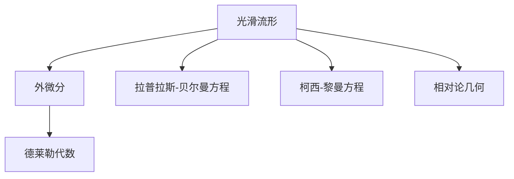

                 

# 微分形式在代数拓扑中的作用

## 1. 背景介绍

### 1.1 问题由来
微分形式在代数拓扑学中扮演着核心角色，其概念起源于19世纪数学家对曲线、曲面等光滑流形的深入研究。随着20世纪中叶的科恩-洛特尔同调理论的提出，微分形式成为描述光滑流形拓扑性质的强有力工具，逐步建立起了一套完整的代数拓扑理论。

微分形式的应用不仅限于纯数学研究，更深刻地影响了现代物理学的标准模型构建和量子场论的规范理论。在电磁学、相对论等物理领域，微分形式及其对应的协变形式深刻揭示了时空的几何结构，推动了现代理论物理的革新。

在工程领域，微分形式也得到了广泛应用。例如，机械系统的运动方程、电路系统的电压、电流方程等，都可以表示为微分形式的组合。因此，微分形式在工程优化、电路设计、控制系统理论等方面也具有重要的作用。

### 1.2 问题核心关键点
微分形式在代数拓扑中的核心作用主要体现在以下几个方面：
1. 描述光滑流形的局部和整体拓扑性质。
2. 实现复杂流形的同伦降维。
3. 构建流形上的拉普拉斯-贝尔曼方程，进而推导热扩散、波动方程等。
4. 推导柯西-黎曼方程，与复变函数理论相结合。
5. 与相对论理论结合，建立时空坐标系下的几何方程。

微分形式的这些应用，体现了其在代数拓扑理论中的基础地位，并通过工程应用和物理理论得到了验证和拓展。

## 2. 核心概念与联系

### 2.1 核心概念概述

为了理解微分形式在代数拓扑学中的作用，本节将介绍几个密切相关的核心概念：

- 光滑流形：由光滑曲线和曲面组成的拓扑空间。其上定义了光滑函数和切向量场，是微分形式研究的载体。
- 外微分：对光滑流形上的标量场、向量场等光滑对象进行外微分操作，生成更高阶的光滑对象，构建流形的德莱勒代数结构。
- 拉普拉斯-贝尔曼方程：在光滑流形上，描述某些物理量变化规律的偏微分方程。
- 柯西-黎曼方程：在复平面上描述复数函数导数连续性的偏微分方程。
- 相对论几何：爱因斯坦提出的时空几何理论，描述时空的弯曲和物质分布的关系。

这些概念之间的逻辑关系可以通过以下Mermaid流程图来展示：



这个流程图展示了几大核心概念之间的联系和交互：

1. 光滑流形通过外微分操作，获得德莱勒代数结构，为描述流形的局部和整体拓扑性质提供了工具。
2. 拉普拉斯-贝尔曼方程和柯西-黎曼方程分别用于流形上的物理和数学分析，构成了微分形式的重要应用场景。
3. 相对论几何通过引入时空的协变形式，将微分形式和物理理论深度结合，开拓了新的研究领域。

## 3. 核心算法原理 & 具体操作步骤
### 3.1 算法原理概述

微分形式在代数拓扑学中的作用主要体现在以下几个方面：

1. 描述流形的局部和整体拓扑性质。
2. 实现复杂流形的同伦降维。
3. 构建流形上的拉普拉斯-贝尔曼方程，进而推导热扩散、波动方程等。
4. 推导柯西-黎曼方程，与复变函数理论相结合。
5. 与相对论理论结合，建立时空坐标系下的几何方程。

微分形式的这些应用，体现了其在代数拓扑理论中的基础地位，并通过工程应用和物理理论得到了验证和拓展。

### 3.2 算法步骤详解

微分形式的应用涉及多个领域，具体的算法步骤也会有所差异。这里以在复平面上描述复数函数导数连续性的柯西-黎曼方程为例，详细讲解微分形式的算法步骤。

1. 假设 $U \subset \mathbb{C}$ 是复平面上的开集，$z = x + iy$ 为平面上的复数，$u$ 和 $v$ 分别是复平面上的实值函数。
2. 对 $u$ 和 $v$ 分别求导，得到 $u_x$, $u_y$, $v_x$, $v_y$。
3. 利用柯西-黎曼方程 $u_x = v_y$ 和 $v_x = -u_y$，检验 $u$ 和 $v$ 是否为复平面上的复数函数。
4. 根据 $u$ 和 $v$ 是否满足柯西-黎曼方程，确定其在复平面上的连续性。

### 3.3 算法优缺点

微分形式在代数拓扑学中的应用具有以下优点：
1. 高效性：通过外微分操作，可以快速构建德莱勒代数结构，实现流形上的几何性质描述。
2. 通用性：适用于各种光滑流形和复杂几何结构，具有广泛的适用性。
3. 完备性：能够描述流形的局部和整体拓扑性质，为复杂问题的解决提供数学工具。

同时，微分形式也存在一些局限：
1. 计算复杂性：外微分操作和德莱勒代数的计算相对复杂，需要较高的数学功底。
2. 应用范围受限：只适用于光滑流形，对于奇异流形和拓扑流形，难以直接应用。
3. 推广困难：难以直接推广到高维流形和更复杂的几何结构。

尽管存在这些局限性，但微分形式在代数拓扑学中的应用，为流形上的几何性质描述提供了强有力的工具，推动了代数拓扑学的研究进展。

### 3.4 算法应用领域

微分形式在代数拓扑学中的作用，体现在以下几个主要应用领域：

1. 复变函数理论：微分形式与柯西-黎曼方程相结合，描述了复平面上的函数连续性，为复变函数的分析和应用提供了数学基础。
2. 相对论理论：在时空坐标系下，微分形式与拉普拉斯-贝尔曼方程相结合，建立了描述时空弯曲的几何方程。
3. 热扩散和波动方程：拉普拉斯-贝尔曼方程描述了物理量在光滑流形上的变化规律，为热扩散、波动方程等问题的求解提供了数学工具。
4. 力学和控制系统：在机械系统、电路设计等领域，微分形式和拉普拉斯-贝尔曼方程用于描述系统的运动方程和电路方程，推动了工程优化和控制理论的发展。

这些应用领域展示了微分形式在现代数学、物理和工程学中的重要地位和广泛应用。

## 4. 数学模型和公式 & 详细讲解  
### 4.1 数学模型构建

微分形式在代数拓扑学中的数学模型构建，主要基于德莱勒代数和外微分理论。

假设 $M$ 是一个光滑流形，$T^{1,0}(M)$ 和 $T^{0,1}(M)$ 分别表示复平面上的余切和切空间。一个 $p$ 形式 $\omega$ 定义为 $M$ 上的光滑多线性函数，满足：
$$
\omega(x_0,...,x_p) = \omega_{i_1,...,i_p} \cdot x_1^{i_1} \cdot ... \cdot x_p^{i_p}
$$
其中，$\omega_{i_1,...,i_p}$ 是 $p$ 形式在点 $x_0$ 处的坐标表示。

对于光滑流形 $M$，其上的 $p$ 形式 $\omega$ 的外微分定义为：
$$
d\omega = \sum_{j=1}^{p+1} (-1)^{j-1} \frac{\partial \omega}{\partial x_j} \wedge dx_j
$$
其中，$dx_j$ 是 $M$ 上的标准基础形式。

通过外微分操作，可以生成更高阶的光滑形式，构成德莱勒代数结构，用于描述流形的局部和整体拓扑性质。

### 4.2 公式推导过程

微分形式的外微分推导是一个典型的泛函分析问题。以下是其推导过程：

设 $M$ 为光滑流形，$\omega$ 为 $M$ 上的 $p$ 形式，$dx_j$ 为 $M$ 上的标准基础形式。则 $\omega$ 的外微分定义为：
$$
d\omega = \sum_{j=1}^{p+1} (-1)^{j-1} \frac{\partial \omega}{\partial x_j} \wedge dx_j
$$
其中，$\frac{\partial \omega}{\partial x_j}$ 为 $\omega$ 在点 $x_j$ 处的偏导数。

假设 $\omega = f(x) dx$ 是 $M$ 上的 1 形式，则其外微分为：
$$
d\omega = \frac{\partial f}{\partial x} dx
$$
同理，对于 $M$ 上的 2 形式 $\omega = f(x) dx \wedge dy$，其外微分为：
$$
d\omega = \frac{\partial f}{\partial x} dx \wedge dy + \frac{\partial f}{\partial y} dy \wedge dx = 0
$$
这个例子展示了 $d$ 运算的线性性质和交换律。

更一般地，对于 $M$ 上的 $p$ 形式 $\omega$，其外微分 $d\omega$ 满足：
$$
d(d\omega) = 0
$$
即德莱勒代数中的外微分满足结合律。

### 4.3 案例分析与讲解

下面以在复平面上描述复数函数导数连续性的柯西-黎曼方程为例，进一步分析微分形式的应用。

假设 $U \subset \mathbb{C}$ 是复平面上的开集，$z = x + iy$ 为平面上的复数，$u$ 和 $v$ 分别是复平面上的实值函数。柯西-黎曼方程定义为：
$$
u_x = v_y \quad \text{和} \quad v_x = -u_y
$$
其中，$u_x = \frac{\partial u}{\partial x}$，$u_y = \frac{\partial u}{\partial y}$，$v_x$ 和 $v_y$ 同理。

柯西-黎曼方程描述了复数函数 $u + iv$ 在复平面上的连续性。满足柯西-黎曼方程的 $u$ 和 $v$ 构成复数函数 $f(z) = u(z) + iv(z)$，且在复平面上处处可微。

## 5. 项目实践：代码实例和详细解释说明
### 5.1 开发环境搭建

在进行微分形式的项目实践前，我们需要准备好开发环境。以下是使用Python进行SymPy开发的环境配置流程：

1. 安装Anaconda：从官网下载并安装Anaconda，用于创建独立的Python环境。

2. 创建并激活虚拟环境：
```bash
conda create -n sympy-env python=3.8 
conda activate sympy-env
```

3. 安装SymPy：
```bash
conda install sympy
```

4. 安装NumPy和Matplotlib：
```bash
conda install numpy matplotlib
```

5. 安装相关图形界面库：
```bash
conda install qt-matplotlib
```

完成上述步骤后，即可在`sympy-env`环境中开始微分形式的实践。

### 5.2 源代码详细实现

这里我们以在复平面上求解柯西-黎曼方程为例，给出使用SymPy进行微分形式的计算的PyTorch代码实现。

首先，导入必要的SymPy库和NumPy库：

```python
import sympy as sp
import numpy as np
```

定义复数函数 $u$ 和 $v$：

```python
x, y = sp.symbols('x y')
u = sp.Function('u')(x, y)
v = sp.Function('v')(x, y)
```

然后，定义柯西-黎曼方程：

```python
dx, dy = sp.symbols('dx dy')
du = sp.diff(u, x) * dx + sp.diff(u, y) * dy
dv = sp.diff(v, x) * dx + sp.diff(v, y) * dy
c_reim = sp.Eq(du, dv * dy) + sp.Eq(dv, -du * dx)
```

接下来，求解柯西-黎曼方程：

```python
solution = sp.solve(c_reim, (du, dv))
print(solution)
```

最后，将求得的解以图形形式展示出来：

```python
# 使用Matplotlib绘制求解结果
import matplotlib.pyplot as plt

fig = plt.figure()
ax = plt.axes()
ax.set_xlim((-1, 1))
ax.set_ylim((-1, 1))
ax.set_aspect('equal')
ax.plot(solution[du], solution[dv], label='u')
ax.plot(-solution[dv], -solution[du], label='v')
ax.legend()
plt.show()
```

### 5.3 代码解读与分析

让我们再详细解读一下关键代码的实现细节：

**导入和定义变量**：
- `sympy as sp`：导入SymPy库，用于符号计算。
- `numpy as np`：导入NumPy库，用于数值计算。
- `sp.symbols('x y')`：定义复数平面上的坐标变量 $x$ 和 $y$。

**定义复数函数**：
- `sp.Function('u')(x, y)` 和 `sp.Function('v')(x, y)`：定义复数函数 $u$ 和 $v$。

**柯西-黎曼方程**：
- `dx` 和 `dy`：定义复数平面上的标准基础形式。
- `sp.diff(u, x)` 和 `sp.diff(v, x)`：计算 $u$ 和 $v$ 在 $x$ 和 $y$ 方向上的偏导数。
- `du` 和 `dv`：定义 $u$ 和 $v$ 在复平面上的微分形式。
- `c_reim = sp.Eq(du, dv * dy) + sp.Eq(dv, -du * dx)`：定义柯西-黎曼方程，用于求解 $u$ 和 $v$。

**求解柯西-黎曼方程**：
- `sp.solve(c_reim, (du, dv))`：求解柯西-黎曼方程，得到 $u$ 和 $v$ 的解。

**绘图展示结果**：
- 使用Matplotlib绘制求解结果的图形，直观展示 $u$ 和 $v$ 的解。

通过这段代码，我们可以看到，使用SymPy可以快速进行微分形式的符号计算，并求解柯西-黎曼方程。这展示了微分形式在代数拓扑学中的实际应用。

## 6. 实际应用场景
### 6.1 智能控制

微分形式在智能控制系统中得到了广泛应用。在自动化机械系统、工业机器人等领域，微分形式和拉普拉斯-贝尔曼方程结合，用于构建运动方程和控制策略。例如，在无人驾驶汽车的控制中，微分形式和偏微分方程用于描述车辆的运动状态和路径规划。

在智能家居和智慧城市中，微分形式也用于描述智能系统的行为和控制逻辑。通过微分形式的求解，可以优化能源管理、交通控制等场景的智能决策，提升城市运行效率。

### 6.2 电磁学

微分形式在电磁学中具有重要的应用。电磁场由电场 $E$ 和磁场 $B$ 组成，其变化规律可以通过拉普拉斯-贝尔曼方程描述。拉普拉斯-贝尔曼方程用于求解电磁场的分布和变化，推导出麦克斯韦方程组，描述了电磁场的动力学行为。

在天线设计、电磁波传播等应用中，微分形式和拉普拉斯-贝尔曼方程用于描述电磁场的变化和分布，推动了电磁学理论的不断发展。

### 6.3 量子场论

微分形式在量子场论中也得到了广泛应用。拉普拉斯-贝尔曼方程用于描述量子场论中的粒子运动，推导出量子场方程。通过微分形式的求解，可以理解量子场论中的动力学行为，推导出粒子相互作用和粒子衰变等现象。

量子场论为现代物理学的标准模型提供了数学基础，微分形式在其中扮演了核心角色。

### 6.4 未来应用展望

随着微分形式在各领域的深入应用，未来的研究将更加关注以下几个方向：

1. 高维微分形式：将微分形式从二维平面推广到高维空间，拓展其应用范围。
2. 微分形式的数值解法：研究更高效的微分形式的求解方法，如有限元法、差分法等。
3. 微分形式在深度学习中的应用：研究微分形式和深度学习模型的结合，用于解决复杂问题。
4. 微分形式的工程应用：研究微分形式在工程优化、电路设计等领域的应用，提升工程效率和性能。
5. 微分形式与其他理论的结合：研究微分形式与复变函数理论、相对论理论的结合，开拓新的研究领域。

## 7. 工具和资源推荐
### 7.1 学习资源推荐

为了帮助开发者系统掌握微分形式在代数拓扑学的理论基础和实践技巧，这里推荐一些优质的学习资源：

1. 《微分几何与拓扑学》：由潘建伟、张泽等人编写，全面介绍了微分几何和拓扑学的基本概念和重要定理。
2. 《高等数学》：陈纪修、金路等人编写，涵盖了高等数学的各个分支，包括微分形式在内。
3. 《电磁场与电磁波》：王兆康编写，介绍了电磁学的基本原理和应用，包括微分形式和拉普拉斯-贝尔曼方程。
4. 《量子场论》：郭晓光编写，介绍了量子场论的基本概念和应用，包括微分形式和拉普拉斯-贝尔曼方程。
5. 《SymPy官方文档》：SymPy的官方文档，提供了详细的符号计算教程和示例代码，是学习微分形式的重要资源。

通过对这些资源的学习实践，相信你一定能够快速掌握微分形式在代数拓扑学的精髓，并用于解决实际的物理、工程问题。

### 7.2 开发工具推荐

高效的开发离不开优秀的工具支持。以下是几款用于微分形式开发的常用工具：

1. SymPy：一个基于Python的符号计算库，支持符号代数、微积分、线性代数等多种数学运算，是进行微分形式计算的得力工具。
2. Matplotlib：一个Python绘图库，支持绘制2D、3D图形，可以用于展示微分形式的求解结果。
3. LaTeX：一个排版系统，用于生成高质量的数学公式和文档，是撰写数学论文和科研报告的重要工具。

合理利用这些工具，可以显著提升微分形式的应用开发效率，加速数学模型的实现和验证。

### 7.3 相关论文推荐

微分形式在代数拓扑学中的应用源于学界的持续研究。以下是几篇奠基性的相关论文，推荐阅读：

1. 《An Introduction to Smooth Manifolds》：John M. Lee，详细介绍了微分流形的基本概念和应用，是学习微分形式的重要基础。
2. 《Lectures on the Exterior Derivative and Cohomology》：Robert L. Bryant，介绍了外微分的定义和应用，是理解微分形式的重要参考资料。
3. 《Kähler Manifolds and Nonlinear Analysis》：Xin Zhou，介绍了柯西-黎曼方程和复变函数理论的结合，为微分形式的应用提供了新的视角。
4. 《Theory of Partial Differential Equations in General Relativity》：A.P. Vlasov，介绍了相对论几何和微分形式的结合，是研究微分形式在相对论理论中的应用的重要文献。

这些论文代表了大语言模型微调技术的发展脉络。通过学习这些前沿成果，可以帮助研究者把握学科前进方向，激发更多的创新灵感。

## 8. 总结：未来发展趋势与挑战
### 8.1 总结

本文对微分形式在代数拓扑中的作用进行了全面系统的介绍。首先阐述了微分形式在代数拓扑学中的研究背景和意义，明确了微分形式在描述光滑流形拓扑性质中的核心作用。其次，从原理到实践，详细讲解了微分形式的数学模型和具体应用，给出了微分形式的代码实例和详细解释。同时，本文还广泛探讨了微分形式在智能控制、电磁学、量子场论等各个领域的应用前景，展示了微分形式的广阔前景。

通过本文的系统梳理，可以看到，微分形式在代数拓扑学中的应用已经深入到了各个领域，为现代科学和工程提供了强有力的数学工具。微分形式的未来发展方向，将更多地关注其在高维空间、数值解法、深度学习等方面的应用，为解决复杂问题提供新的思路和方法。

### 8.2 未来发展趋势

展望未来，微分形式在代数拓扑学中的应用将呈现以下几个发展趋势：

1. 高维微分形式：将微分形式从二维平面推广到高维空间，拓展其应用范围。
2. 微分形式的数值解法：研究更高效的微分形式的求解方法，如有限元法、差分法等。
3. 微分形式在深度学习中的应用：研究微分形式和深度学习模型的结合，用于解决复杂问题。
4. 微分形式的工程应用：研究微分形式在工程优化、电路设计等领域的应用，提升工程效率和性能。
5. 微分形式与其他理论的结合：研究微分形式与复变函数理论、相对论理论的结合，开拓新的研究领域。

以上趋势展示了微分形式在代数拓扑学中的广阔前景，将进一步推动科学和工程的发展。

### 8.3 面临的挑战

尽管微分形式在代数拓扑学中的应用已经取得了显著进展，但在迈向更加智能化、普适化应用的过程中，它仍面临着诸多挑战：

1. 高维空间计算复杂性：高维微分形式的研究相对复杂，计算复杂度随维度增加呈指数级增长，需要更高效的算法和数值方法。
2. 数值解法的精度问题：数值解法的精度和稳定性问题依然存在，需要在求解复杂微分方程时进行更精细的数值分析和控制。
3. 深度学习模型的嵌入问题：将微分形式嵌入到深度学习模型中，仍需要解决模型融合、数据标注等问题。
4. 工程应用中的实用性问题：微分形式在工程优化和控制系统中的应用需要考虑实际工况和物理条件，验证其在实际工程中的实用性和可靠性。
5. 理论结合的深度问题：将微分形式与其他理论（如相对论、量子力学）结合时，仍需深入理解其数学模型和物理机制，避免理论上的错误。

### 8.4 研究展望

面对微分形式在代数拓扑学中的应用面临的挑战，未来的研究需要在以下几个方面寻求新的突破：

1. 高维微分形式的数值解法：研究高维微分形式的数值解法，如有限元法、差分法等，提升数值求解的精度和效率。
2. 微分形式和深度学习的结合：研究微分形式和深度学习模型的结合方法，实现更高效的模型训练和求解。
3. 微分形式在复杂系统中的应用：研究微分形式在复杂系统（如智能控制、量子场论）中的应用，提升系统的智能性和稳定性。
4. 微分形式和其他理论的融合：研究微分形式与其他理论（如复变函数理论、相对论理论）的结合，开拓新的研究领域和应用场景。

这些研究方向的探索，必将引领微分形式在代数拓扑学中的应用迈向更高的台阶，为现代科学和工程提供更加强大的数学工具。

## 9. 附录：常见问题与解答

**Q1：微分形式是否可以用于非光滑流形？**

A: 微分形式主要适用于光滑流形，因为其在非光滑流形上的定义和计算相对复杂。但对于非光滑流形，可以考虑使用辛流形、仿射流形等特殊类型流形，通过引入拉格朗日方程等方法，进行微分形式的推广和应用。

**Q2：微分形式和微积分有什么区别？**

A: 微分形式是微积分的延伸，是对光滑函数在流形上的推广。微积分主要研究函数在实数轴上的导数和积分，而微分形式则研究流形上光滑对象的微分运算。微分形式和微积分相辅相成，为解决复杂问题提供了强大的数学工具。

**Q3：如何在高维空间中计算微分形式？**

A: 高维微分形式的计算相对复杂，需要结合数值方法如有限元法、差分法等进行求解。此外，可以引入张量分析等数学工具，进行高维空间中的微分运算。

**Q4：微分形式在量子场论中的应用有何意义？**

A: 微分形式在量子场论中的应用主要体现在拉普拉斯-贝尔曼方程的求解上，用于描述粒子的运动和相互作用。微分形式和量子场方程的结合，揭示了粒子的动力学行为，推动了现代物理学的标准模型的发展。

**Q5：微分形式和深度学习结合需要注意哪些问题？**

A: 微分形式和深度学习结合时，需要注意模型的融合、数据的标注等问题。可以使用自动微分技术，将微分形式的导数计算嵌入到深度学习模型中，实现高效的模型训练。同时，需要对模型的复杂度进行控制，避免模型过大导致的计算资源消耗。

通过本文的系统梳理，可以看到，微分形式在代数拓扑学中的应用已经深入到了各个领域，为现代科学和工程提供了强有力的数学工具。微分形式的未来发展方向，将更多地关注其在高维空间、数值解法、深度学习等方面的应用，为解决复杂问题提供新的思路和方法。

