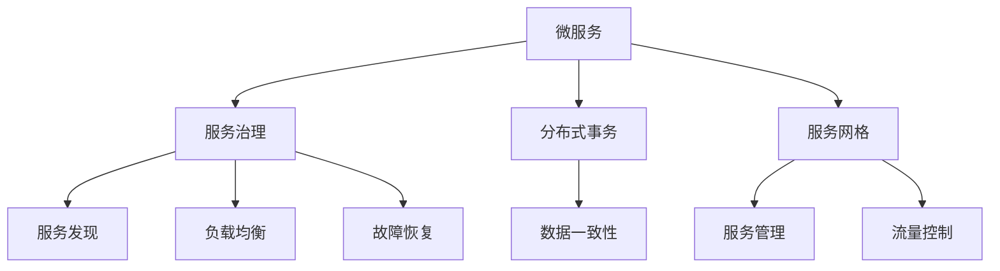

                 

# 微服务架构的设计与实现

## 1. 背景介绍

### 1.1 问题由来

随着互联网和信息技术的飞速发展，软件系统的规模和复杂性不断增加。传统的单体应用架构已难以满足现代企业对系统灵活性、可扩展性和可维护性的需求。为了解决这些问题，微服务架构（Microservice Architecture）应运而生，成为构建现代企业级系统的热门选择。

微服务架构将应用拆分为多个小型、自治的服务单元，每个服务独立部署、独立运行，通过轻量级通信机制（如HTTP REST API）实现服务间的协同工作。微服务架构能够有效提升系统的灵活性、可扩展性和可维护性，同时降低系统开发和运维成本。

然而，微服务架构也带来了新的挑战，如服务间通信复杂度增加、分布式系统管理难度增大、数据一致性问题等。本文将深入探讨微服务架构的设计与实现，从核心概念、算法原理、实践案例等多个维度展开，帮助开发者更好地理解和使用微服务架构。

## 2. 核心概念与联系

### 2.1 核心概念概述

微服务架构的核心概念包括微服务、服务治理、分布式事务、服务网格等，这些概念之间存在紧密联系，共同构成了微服务架构的基础。

- **微服务（Microservice）**：指将应用拆分为多个小型、自治的服务单元，每个服务独立部署、独立运行，通过轻量级通信机制实现服务间的协同工作。
- **服务治理（Service Governance）**：指对微服务架构中服务的创建、配置、部署、运维等进行管理和监控。服务治理是微服务架构的关键，决定了微服务的生命周期和稳定性。
- **分布式事务（Distributed Transaction）**：指在微服务架构中，多个服务协同完成一项业务，需要保证数据的一致性和原子性。分布式事务是微服务架构中的一大挑战，需要精心设计和管理。
- **服务网格（Service Mesh）**：指通过服务网格技术，对微服务架构中的服务进行管理和优化。服务网格能够实现服务发现、负载均衡、故障恢复等基本功能，提升微服务架构的可扩展性和可靠性。

这些核心概念之间的逻辑关系可以通过以下Mermaid流程图来展示：



这个流程图展示了大规模微服务架构中的关键组件及其之间的联系：

1. 微服务是架构的基本单元，通过服务治理、分布式事务和服务网格等机制，实现独立部署、自治运行和高效协同。
2. 服务治理提供服务发现、负载均衡、故障恢复等基本功能，确保微服务的稳定性和可扩展性。
3. 分布式事务保证数据的一致性和原子性，是微服务架构中的一大挑战。
4. 服务网格通过对微服务进行管理和优化，提升微服务架构的可扩展性和可靠性。

这些概念共同构成了微服务架构的设计与实现框架，使开发者能够更好地构建和管理大规模的分布式系统。

## 3. 核心算法原理 & 具体操作步骤

### 3.1 算法原理概述

微服务架构的设计与实现涉及多个核心算法和机制，包括服务发现、负载均衡、容错机制、服务注册与发现等。这些算法和机制共同作用，确保微服务的稳定性和可靠性。

- **服务发现（Service Discovery）**：指在微服务架构中，服务能够动态注册和发现其他服务。服务发现是微服务架构的基础，通过服务注册中心实现。
- **负载均衡（Load Balancing）**：指在微服务架构中，通过负载均衡器将请求均匀分配到多个服务实例上，提高系统的吞吐量和稳定性。
- **容错机制（Fault Tolerance）**：指在微服务架构中，通过重试、降级、熔断等机制，保证服务在出现故障时的稳定性和可用性。
- **服务注册与发现（Service Registration and Discovery）**：指在微服务架构中，服务动态注册到服务注册中心，并能够通过服务发现机制动态获取其他服务信息。

这些算法和机制共同作用，确保微服务的稳定性和可靠性。

### 3.2 算法步骤详解

微服务架构的设计与实现涉及多个关键步骤，包括服务拆分、服务治理、分布式事务、服务网格等。这些步骤需要精心设计和实施，才能确保微服务架构的成功部署和运行。

**Step 1: 服务拆分**

服务拆分是微服务架构的第一步，指将单体应用拆分为多个小型、自治的服务单元。服务拆分的目的是为了提升系统的灵活性、可扩展性和可维护性。服务拆分的关键在于确定服务的粒度和边界。

1. **确定服务粒度**：根据业务需求和系统复杂性，确定服务的粒度。一般来说，服务粒度应该足够小，以提升系统的灵活性和可维护性，但也不能过小，以免增加系统的复杂性。
2. **确定服务边界**：根据服务的内部结构和功能需求，确定服务的边界。服务边界应该清晰明确，避免服务间过度的耦合和依赖。

**Step 2: 服务治理**

服务治理是微服务架构的关键，指对微服务架构中服务的创建、配置、部署、运维等进行管理和监控。服务治理的主要工具包括服务注册中心、服务配置中心、服务监控中心等。

1. **服务注册中心**：通过服务注册中心，服务能够动态注册和发现其他服务。服务注册中心需要保证服务的稳定性和可靠性，同时提供高效的注册和发现机制。
2. **服务配置中心**：通过服务配置中心，服务能够动态加载和更新配置信息。服务配置中心需要保证配置信息的正确性和一致性，同时提供高效的配置更新机制。
3. **服务监控中心**：通过服务监控中心，服务能够实时监控系统运行状态和性能指标。服务监控中心需要提供实时的监控和告警机制，及时发现和解决问题。

**Step 3: 分布式事务**

分布式事务是微服务架构中的一大挑战，指在多个服务协同完成一项业务时，需要保证数据的一致性和原子性。分布式事务需要精心设计和管理，以保证系统的稳定性和可靠性。

1. **事务隔离级别**：根据业务需求和系统复杂性，确定事务隔离级别。一般来说，事务隔离级别应该根据具体情况进行选择，以平衡系统性能和数据一致性。
2. **事务协调机制**：根据业务需求和系统复杂性，确定事务协调机制。事务协调机制需要保证数据的一致性和原子性，同时提供高效的分布式协调机制。

**Step 4: 服务网格**

服务网格通过对微服务进行管理和优化，提升微服务架构的可扩展性和可靠性。服务网格的主要工具包括服务网格框架、服务熔断机制、服务负载均衡器等。

1. **服务网格框架**：通过服务网格框架，对微服务进行管理和优化。服务网格框架需要提供高效的服务管理机制，提升微服务架构的可扩展性和可靠性。
2. **服务熔断机制**：通过服务熔断机制，保证服务在出现故障时的稳定性和可用性。服务熔断机制需要提供高效的熔断和降级机制，及时发现和解决问题。
3. **服务负载均衡器**：通过服务负载均衡器，将请求均匀分配到多个服务实例上，提高系统的吞吐量和稳定性。服务负载均衡器需要提供高效的负载均衡机制，提升系统的性能和可用性。

### 3.3 算法优缺点

微服务架构具有以下优点：

1. **灵活性**：微服务架构将应用拆分为多个小型、自治的服务单元，每个服务独立部署、独立运行，能够灵活应对业务需求和系统变化。
2. **可扩展性**：微服务架构能够动态扩展服务实例，提升系统的吞吐量和稳定性。
3. **可维护性**：微服务架构将应用拆分为多个小型、自治的服务单元，每个服务独立部署、独立运维，提升系统的可维护性和可测试性。

同时，微服务架构也存在一些缺点：

1. **复杂性**：微服务架构需要精心设计和实施，增加了系统的复杂性。
2. **通信开销**：微服务架构中的服务间通信开销较大，增加了系统的延迟和网络开销。
3. **分布式一致性**：微服务架构中的分布式一致性问题较为复杂，需要精心设计和实施。

## 4. 数学模型和公式 & 详细讲解 & 举例说明

### 4.1 数学模型构建

微服务架构中的服务发现、负载均衡、容错机制等涉及多个数学模型和公式。以下是几个关键的数学模型和公式：

**服务发现模型**：

服务发现模型描述了服务在服务注册中心中的注册和发现机制。服务注册中心通过分布式一致性协议（如etcd、zookeeper等）实现服务的注册和发现。

**负载均衡模型**：

负载均衡模型描述了负载均衡器将请求均匀分配到多个服务实例上的机制。负载均衡器通过轮询、加权轮询、最少连接等方式实现负载均衡。

**容错机制模型**：

容错机制模型描述了服务在出现故障时的稳定性和可用性。容错机制通过重试、降级、熔断等方式保证服务的稳定性和可用性。

### 4.2 公式推导过程

**服务发现模型**：

服务发现模型的公式推导过程如下：

$$
S_{\text{discovery}} = \{s_1, s_2, ..., s_n\}
$$

其中，$S_{\text{discovery}}$ 表示注册在服务注册中心的服务集合，$s_i$ 表示服务 $i$ 的信息。

**负载均衡模型**：

负载均衡模型的公式推导过程如下：

$$
L_{\text{load\_balance}} = \frac{1}{N} \sum_{i=1}^N \frac{W_i}{T_i}
$$

其中，$L_{\text{load\_balance}}$ 表示负载均衡器计算出的服务实例 $i$ 的负载，$N$ 表示服务实例总数，$W_i$ 表示服务实例 $i$ 的权重，$T_i$ 表示服务实例 $i$ 的响应时间。

**容错机制模型**：

容错机制模型的公式推导过程如下：

$$
F_{\text{fault\_tolerance}} = \frac{1}{N} \sum_{i=1}^N \frac{R_i}{F_i}
$$

其中，$F_{\text{fault\_tolerance}}$ 表示服务的容错能力，$N$ 表示服务实例总数，$R_i$ 表示服务实例 $i$ 的重试次数，$F_i$ 表示服务实例 $i$ 的故障次数。

### 4.3 案例分析与讲解

**案例一：Eureka 服务发现**

Eureka 是一个基于 Spring Cloud 的服务发现工具，支持服务注册和发现。Eureka 使用分布式一致性协议保证服务的注册和发现，能够动态扩展服务实例，提升系统的可扩展性和可靠性。

**案例二：Ribbon 负载均衡**

Ribbon 是一个基于 Spring Cloud 的负载均衡工具，支持轮询、加权轮询等方式实现负载均衡。Ribbon 能够动态调整服务实例的负载，提高系统的性能和稳定性。

**案例三：Hystrix 容错机制**

Hystrix 是一个基于 Spring Cloud 的容错工具，支持重试、降级、熔断等方式保证服务的稳定性和可用性。Hystrix 能够动态调整服务的容错策略，提高系统的可靠性。

## 5. 项目实践：代码实例和详细解释说明

### 5.1 开发环境搭建

在进行微服务架构实践前，我们需要准备好开发环境。以下是使用 Spring Boot 进行微服务架构开发的环境配置流程：

1. 安装 Java JDK：从官网下载并安装 Java JDK，创建 Java 开发环境。
2. 安装 Git 和 Maven：从官网下载并安装 Git 和 Maven，用于版本控制和项目构建。
3. 创建 Spring Boot 项目：使用 Spring Boot 官方提供的 CLI 工具，创建 Spring Boot 项目。

```bash
spring boot init --name my-service --project-type maven
```

4. 配置环境变量：设置 JAVA_HOME、PATH 等环境变量，保证 Java 和 Maven 的正常运行。

完成上述步骤后，即可在 IDE 中开始微服务架构的开发。

### 5.2 源代码详细实现

下面以 Spring Cloud 为示例，展示微服务架构的实现过程。

首先，定义服务注册和发现模块：

```java
package com.example.service;

import org.springframework.beans.factory.annotation.Value;
import org.springframework.cloud.client.loadbalancer.LoadBalanced;
import org.springframework.context.annotation.Bean;
import org.springframework.context.annotation.Configuration;
import org.springframework.web.bind.annotation.RequestMapping;
import org.springframework.web.bind.annotation.RestController;

@Configuration
@RestController
@RequestMapping("/hello")
public class HelloController {

    @Value("${server.port}")
    private String port;

    @Bean
    @LoadBalanced
    public RibbonClientBuilder ribbonClientBuilder() {
        return new RibbonClientBuilder("my-service");
    }

    @RequestMapping("/")
    public String hello() {
        return "Hello, world! I am running on port " + port;
    }
}
```

然后，定义服务注册模块：

```java
package com.example.service;

import org.springframework.beans.factory.annotation.Value;
import org.springframework.cloud.client.loadbalancer.LoadBalanced;
import org.springframework.context.annotation.Bean;
import org.springframework.context.annotation.Configuration;
import org.springframework.web.bind.annotation.RequestMapping;
import org.springframework.web.bind.annotation.RestController;

@Configuration
@RestController
@RequestMapping("/hello")
public class HelloController {

    @Value("${server.port}")
    private String port;

    @Bean
    @LoadBalanced
    public RibbonClientBuilder ribbonClientBuilder() {
        return new RibbonClientBuilder("my-service");
    }

    @RequestMapping("/")
    public String hello() {
        return "Hello, world! I am running on port " + port;
    }
}
```

最后，启动 Spring Boot 项目，并访问服务：

```bash
mvn spring-boot:run
```

在另一个 Spring Boot 项目中，使用服务发现模块：

```java
package com.example.service;

import org.springframework.beans.factory.annotation.Autowired;
import org.springframework.cloud.client.loadbalancer.LoadBalanced;
import org.springframework.context.annotation.Bean;
import org.springframework.context.annotation.Configuration;
import org.springframework.web.bind.annotation.GetMapping;
import org.springframework.web.bind.annotation.RestController;
import org.springframework.web.client.RestTemplate;

@Configuration
@RestController
public class HelloController {

    @Autowired
    private RestTemplate restTemplate;

    @Bean
    @LoadBalanced
    public RibbonClientBuilder ribbonClientBuilder() {
        return new RibbonClientBuilder("my-service");
    }

    @GetMapping("/")
    public String hello() {
        return restTemplate.getForObject("http://my-service/hello", String.class);
    }
}
```

## 6. 实际应用场景

### 6.1 实际应用场景

微服务架构已经在许多领域得到了广泛应用，以下是几个典型场景：

**金融行业**：金融行业涉及高并发、高可用性、高安全性等需求，微服务架构能够提升系统的灵活性、可扩展性和可维护性，同时保证系统的稳定性和安全性。

**电商行业**：电商行业涉及商品管理、订单管理、支付管理等复杂业务场景，微服务架构能够提升系统的灵活性、可扩展性和可维护性，同时保证系统的稳定性和可扩展性。

**互联网行业**：互联网行业涉及用户管理、内容管理、广告管理等业务场景，微服务架构能够提升系统的灵活性、可扩展性和可维护性，同时保证系统的稳定性和可扩展性。

### 6.2 未来应用展望

未来，微服务架构将继续在企业级系统中发挥重要作用。随着技术的不断进步和应用场景的不断扩展，微服务架构将呈现以下几个发展趋势：

1. **微服务容器化**：容器技术是微服务架构的重要组成部分，通过容器化部署，提升微服务的稳定性和可扩展性。
2. **微服务化 DevOps**：DevOps 是微服务架构的重要实践，通过持续集成和持续交付，提升微服务的开发效率和稳定性。
3. **微服务化云原生**：云原生是微服务架构的重要发展方向，通过 Kubernetes、Istio 等云原生技术，提升微服务的可扩展性和可靠性。
4. **微服务化微服务**：微服务架构将继续向微服务化方向发展，通过更小的服务粒度和更灵活的服务治理机制，提升微服务的灵活性和可扩展性。

## 7. 工具和资源推荐

### 7.1 学习资源推荐

为了帮助开发者系统掌握微服务架构的理论基础和实践技巧，这里推荐一些优质的学习资源：

1. **《微服务架构：构建可伸缩的系统》**：这本书详细介绍了微服务架构的理论基础和实践技巧，是微服务架构学习的必备参考书。
2. **Spring Cloud 官方文档**：Spring Cloud 是微服务架构的重要实现框架，官方文档提供了详细的文档和示例代码，是微服务架构学习的必备资源。
3. **Docker 官方文档**：Docker 是微服务架构的重要工具，官方文档提供了详细的文档和示例代码，是微服务架构学习的必备资源。
4. **Kubernetes 官方文档**：Kubernetes 是微服务架构的重要部署工具，官方文档提供了详细的文档和示例代码，是微服务架构学习的必备资源。

### 7.2 开发工具推荐

微服务架构开发涉及多个工具和平台，以下是几款常用的开发工具：

1. **Spring Boot**：Spring Boot 是微服务架构的重要实现框架，提供快速、便捷的开发体验。
2. **Spring Cloud**：Spring Cloud 是微服务架构的重要组件，提供丰富的微服务组件和工具。
3. **Docker**：Docker 是微服务架构的重要容器化工具，提供高效、便捷的容器化部署。
4. **Kubernetes**：Kubernetes 是微服务架构的重要部署工具，提供高效、便捷的容器编排。

### 7.3 相关论文推荐

微服务架构的发展源于学界的持续研究。以下是几篇奠基性的相关论文，推荐阅读：

1. **《服务网格：微服务架构中的分布式通信基础设施》**：这篇论文详细介绍了服务网格技术，是微服务架构研究的经典之作。
2. **《分布式微服务系统中的事务隔离与协调》**：这篇论文详细介绍了分布式事务的隔离与协调机制，是微服务架构研究的经典之作。
3. **《微服务架构的性能优化与监控》**：这篇论文详细介绍了微服务架构的性能优化和监控机制，是微服务架构研究的经典之作。

## 8. 总结：未来发展趋势与挑战

### 8.1 总结

本文对微服务架构的设计与实现进行了全面系统的介绍。首先阐述了微服务架构的理论基础和实践技巧，明确了微服务架构在企业级系统中的重要性。其次，从核心概念、算法原理、实践案例等多个维度，详细讲解了微服务架构的设计与实现过程，给出了微服务架构的完整代码实例。同时，本文还广泛探讨了微服务架构在金融、电商、互联网等多个领域的应用前景，展示了微服务架构的巨大潜力。此外，本文精选了微服务架构的学习资源和开发工具，力求为开发者提供全方位的技术指引。

通过本文的系统梳理，可以看到，微服务架构正在成为构建现代企业级系统的热门选择，其灵活性、可扩展性和可维护性使其成为企业级系统构建的重要范式。未来，伴随微服务容器化、DevOps、云原生等技术的不断演进，微服务架构必将在更多领域大放异彩，为企业的数字化转型提供坚实的基础。

### 8.2 未来发展趋势

展望未来，微服务架构将继续在企业级系统中发挥重要作用。随着技术的不断进步和应用场景的不断扩展，微服务架构将呈现以下几个发展趋势：

1. **微服务容器化**：容器技术是微服务架构的重要组成部分，通过容器化部署，提升微服务的稳定性和可扩展性。
2. **微服务化 DevOps**：DevOps 是微服务架构的重要实践，通过持续集成和持续交付，提升微服务的开发效率和稳定性。
3. **微服务化云原生**：云原生是微服务架构的重要发展方向，通过 Kubernetes、Istio 等云原生技术，提升微服务的可扩展性和可靠性。
4. **微服务化微服务**：微服务架构将继续向微服务化方向发展，通过更小的服务粒度和更灵活的服务治理机制，提升微服务的灵活性和可扩展性。

### 8.3 面临的挑战

尽管微服务架构已经取得了瞩目成就，但在迈向更加智能化、普适化应用的过程中，它仍面临着诸多挑战：

1. **复杂性**：微服务架构需要精心设计和实施，增加了系统的复杂性。
2. **通信开销**：微服务架构中的服务间通信开销较大，增加了系统的延迟和网络开销。
3. **分布式一致性**：微服务架构中的分布式一致性问题较为复杂，需要精心设计和实施。

### 8.4 研究展望

面对微服务架构所面临的种种挑战，未来的研究需要在以下几个方面寻求新的突破：

1. **优化服务发现和负载均衡**：通过优化服务发现和负载均衡机制，提升微服务的性能和可靠性。
2. **优化分布式事务**：通过优化分布式事务机制，提升微服务的稳定性和一致性。
3. **优化服务网格**：通过优化服务网格技术，提升微服务的可扩展性和可维护性。
4. **优化 DevOps 实践**：通过优化 DevOps 实践，提升微服务的开发效率和稳定性。

这些研究方向的探索，必将引领微服务架构技术迈向更高的台阶，为构建安全、可靠、可解释、可控的智能系统铺平道路。面向未来，微服务架构需要与其他人工智能技术进行更深入的融合，如知识表示、因果推理、强化学习等，多路径协同发力，共同推动微服务架构技术的进步。只有勇于创新、敢于突破，才能不断拓展微服务架构的边界，让智能技术更好地造福人类社会。

## 9. 附录：常见问题与解答

**Q1: 微服务架构中，如何保证服务之间的通信性能？**

A: 微服务架构中，服务之间的通信性能主要通过负载均衡和网络优化机制进行保证。负载均衡器能够将请求均匀分配到多个服务实例上，提升系统的吞吐量和稳定性。网络优化机制，如 CDN、DNS 缓存等，能够提升服务的响应速度和可靠性。

**Q2: 微服务架构中，如何保证服务之间的数据一致性？**

A: 微服务架构中，服务之间的数据一致性主要通过分布式事务机制进行保证。分布式事务机制能够保证多个服务协同完成一项业务时，数据的一致性和原子性。通过事务隔离级别和事务协调机制，可以有效解决数据一致性问题。

**Q3: 微服务架构中，如何保证服务的稳定性和可用性？**

A: 微服务架构中，服务的稳定性和可用性主要通过重试、降级、熔断等容错机制进行保证。容错机制能够保证服务在出现故障时的稳定性和可用性。通过设置容错阈值、重试次数和熔断规则，可以有效提升服务的稳定性和可用性。

**Q4: 微服务架构中，如何优化服务的性能和可靠性？**

A: 微服务架构中，服务的性能和可靠性主要通过负载均衡、服务发现、容错机制等进行优化。负载均衡器能够将请求均匀分配到多个服务实例上，提升系统的吞吐量和稳定性。服务发现机制能够保证服务的动态注册和发现，提升系统的可扩展性和可靠性。容错机制能够保证服务在出现故障时的稳定性和可用性。

---

作者：禅与计算机程序设计艺术 / Zen and the Art of Computer Programming

