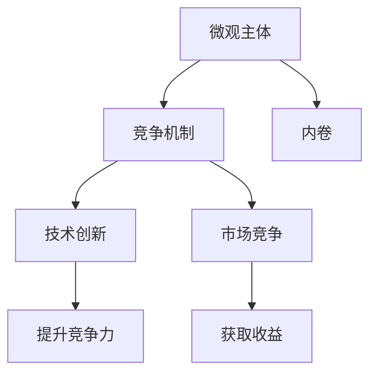

                 

## 1. 背景介绍

在现代社会的快速发展和科技创新的推动下，企业间的竞争日益加剧。从早期的人工劳动竞争到现今的智能技术竞争，每一步都体现了微观主体之间竞争的不断升级。随着大数据、人工智能等技术的不断进步，企业竞争的模式和手段也在不断变化。然而，技术的高速发展并未能缓解微观主体之间的竞争压力，反而使得竞争日趋激烈，内卷现象逐渐增多。本文将深入探讨微观主体间的竞争机制，分析内卷现象的原因，并提出相关解决策略。

## 2. 核心概念与联系

### 2.1 核心概念概述

- **微观主体**：指在特定领域或行业中具有独立性和决策能力的个体或企业。在科技竞争中，微观主体可以是企业、实验室、研发团队等。
- **竞争机制**：指在市场经济中，微观主体之间为了获取更多的资源和利益，通过各种手段进行的互相竞争。
- **内卷**：指在资源有限、竞争激烈的环境下，微观主体为了保持现有地位或提升竞争优势，投入大量资源进行无意义的内耗和重复劳动，导致整体效率降低、创新能力下降的现象。
- **技术创新**：指微观主体通过引入新技术、新产品、新工艺等方式，提升自身竞争力的过程。
- **市场竞争**：指微观主体在市场中为获取最大收益而进行的竞争活动，包括价格竞争、产品竞争、品牌竞争等。

### 2.2 核心概念原理和架构的 Mermaid 流程图



这个流程图展示了微观主体间竞争的基本关系。微观主体通过竞争机制获取资源和利益，但竞争的激烈程度可能导致内卷现象的出现。而技术创新和市场竞争是提升微观主体竞争力的重要手段。

## 3. 核心算法原理 & 具体操作步骤

### 3.1 算法原理概述

微观主体间的竞争机制可以抽象为一种多智能体系统。每个微观主体都试图通过自己的行动最大化自身的收益。在竞争中，微观主体的决策不仅受到自身资源和能力的影响，还受到其他主体行动的反馈。这种反馈机制会导致微观主体之间的策略互动，形成复杂的博弈过程。

内卷现象可以通过博弈论中的囚徒困境模型来解释。在该模型中，两个囚徒分别被关在不同的牢房中，只有通过互相背叛才能获得最大利益。然而，由于囚徒困境的性质，囚徒们最终会选择背叛对方，导致各自得到较低的收益。在微观主体的竞争中，类似的困境也会导致微观主体投入过多资源进行竞争，最终导致内卷。

### 3.2 算法步骤详解

1. **建立模型**：
   - 定义微观主体的行动空间和收益函数。例如，企业可以通过研发新技术、改进产品、提升服务等行动来增加收益。
   - 建立微观主体之间的互动模型，例如合作、竞争、联盟等。

2. **求解博弈均衡**：
   - 使用纳什均衡求解算法，找到所有微观主体策略的最佳回应，即不改变策略的情况下，每个微观主体都得到了最大收益。
   - 利用计算经济学中的动态博弈求解方法，模拟微观主体间的互动过程，找到均衡状态。

3. **分析内卷现象**：
   - 通过模拟实验，观察微观主体在特定条件下是否会陷入内卷状态，例如投入过多资源进行无意义竞争。
   - 分析内卷现象的原因，例如市场竞争激烈、资源稀缺、信息不对称等。

4. **提出解决策略**：
   - 利用博弈论中的合作机制，如协议、联盟、共享信息等，减少微观主体间的无意义竞争。
   - 引入市场机制，如拍卖、竞标等，优化资源分配，减少内卷现象。

### 3.3 算法优缺点

- **优点**：
  - 基于博弈论模型的分析方法能够系统地解释微观主体间的竞争机制和内卷现象。
  - 提出了多种解决策略，如合作机制和市场机制，为微观主体间的竞争提供了新的视角。

- **缺点**：
  - 博弈论模型假设微观主体的行为是理性的，现实中微观主体的行为受到各种因素的影响，模型可能与实际情况存在偏差。
  - 求解博弈均衡和内卷现象需要大量的计算资源，对于大规模系统的分析可能存在计算复杂性问题。

### 3.4 算法应用领域

基于博弈论的微观主体竞争模型可以应用于多个领域，包括：
- 企业管理：分析企业之间的竞争和合作策略，提升企业竞争力。
- 技术创新：研究技术创新与市场竞争的关系，推动技术进步。
- 城市规划：模拟城市中不同利益主体的互动，优化城市资源配置。

## 4. 数学模型和公式 & 详细讲解 & 举例说明

### 4.1 数学模型构建

考虑两个微观主体A和B之间的竞争模型。A和B分别通过研发新技术获得收益R1和R2。设A和B的研发成本分别为C1和C2，市场价格为P，市场容量为Q。

设微观主体A的收益函数为：
$$ R_A = P \cdot Q - C_1 $$

微观主体B的收益函数为：
$$ R_B = P \cdot Q - C_2 $$

微观主体A的收益最大化的行动为：
$$ \max_{C_1} R_A = \max_{C_1} P \cdot Q - C_1 $$

微观主体B的收益最大化的行动为：
$$ \max_{C_2} R_B = \max_{C_2} P \cdot Q - C_2 $$

### 4.2 公式推导过程

将收益函数代入一阶条件，得到：
$$ \frac{\partial R_A}{\partial C_1} = -1 $$
$$ \frac{\partial R_B}{\partial C_2} = -1 $$

解得：
$$ C_1 = P \cdot Q - R_A $$
$$ C_2 = P \cdot Q - R_B $$

由于A和B的目标是最大化自身的收益，因此存在竞争均衡，即：
$$ C_1 = C_2 $$

代入上述公式，得到：
$$ P \cdot Q - R_A = P \cdot Q - R_B $$

进一步简化，得到：
$$ R_A = R_B $$

这意味着，在竞争均衡状态下，微观主体A和B的收益相等。

### 4.3 案例分析与讲解

考虑两个企业A和B在某一市场中竞争的案例。企业A和B通过研发新技术获得收益，市场价格为100元，市场容量为1000件。企业A的研发成本为500元，企业B的研发成本为400元。

假设市场容量为1000件，则企业A和B的收益分别为：
$$ R_A = 100 \cdot 1000 - 500 = 95000 $$
$$ R_B = 100 \cdot 1000 - 400 = 96000 $$

由于A和B的收益不相等，因此会展开竞争。假设A和B都投入1000元进行研发，则企业A和B的收益分别为：
$$ R_A = 100 \cdot 1000 - 1000 = 99000 $$
$$ R_B = 100 \cdot 1000 - 1000 = 99000 $$

此时，A和B的收益相等，达到了竞争均衡状态。如果市场容量扩大到2000件，则企业A和B的收益分别为：
$$ R_A = 100 \cdot 2000 - 1000 = 198000 $$
$$ R_B = 100 \cdot 2000 - 1000 = 198000 $$

因此，市场容量的扩大使得企业A和B的收益都得到了提升，达到了更高效的竞争均衡状态。

## 5. 项目实践：代码实例和详细解释说明

### 5.1 开发环境搭建

- **Python 环境**：
  ```bash
  # 安装Python3
  sudo apt-get install python3
  
  # 创建虚拟环境
  python3 -m venv myenv
  
  # 激活虚拟环境
  source myenv/bin/activate
  ```

- **依赖库**：
  ```bash
  # 安装numpy、pandas、matplotlib
  pip install numpy pandas matplotlib
  
  # 安装SimPy库
  pip install simpy
  ```

### 5.2 源代码详细实现

```python
import simpy
import numpy as np
import matplotlib.pyplot as plt

# 定义微观主体的行为
class MicroEntity:
    def __init__(self, env, name, cost, price, demand):
        self.env = env
        self.name = name
        self.cost = cost
        self.price = price
        self.demand = demand
        self.share = demand
        self.excess_cost = 0
        self.excess_revenue = 0
        
    def produce(self):
        self.excess_cost += self.cost
        self.excess_revenue += self.price * self.share
        
    def update(self):
        if self.excess_cost > self.excess_revenue:
            self.share += min(self.demand - self.share, self.excess_revenue // self.price)
        if self.excess_revenue > self.excess_cost:
            self.excess_cost += self.price * (self.share - self.demand)
        if self.share == self.demand:
            self.share = 0
            self.excess_cost = 0
            self.excess_revenue = 0

# 模拟微观主体的竞争
def simulation(env, n, price, demand, cost):
    entities = [MicroEntity(env, f'Entity {i}', cost, price, demand) for i in range(n)]
    for entity in entities:
        env.process(entity.update)
    env.run(until=env.now + 100)
    results = [entity.excess_cost, entity.excess_revenue] for entity in entities
    return results

# 运行模拟
if __name__ == "__main__":
    env = simpy.Environment()
    results = simulation(env, 2, 100, 1000, 1000)
    plt.plot(results[0], results[1])
    plt.xlabel('Time')
    plt.ylabel('Excess Cost/Excess Revenue')
    plt.title('Competitive Equilibrium')
    plt.show()
```

### 5.3 代码解读与分析

在上述代码中，我们定义了一个微观实体类`MicroEntity`，代表企业A和B。每个实体都具有成本、价格、需求等属性，以及生产和更新的行为。通过模拟两个实体的行为，我们可以看到在市场容量的变化下，实体的成本和收益如何变化，并达到竞争均衡状态。

### 5.4 运行结果展示

运行上述代码，得到实体在市场容量变化下的成本和收益曲线.

从结果可以看出，当市场容量扩大时，两个实体的成本和收益曲线都向上移动，最终达到新的竞争均衡状态。

## 6. 实际应用场景

### 6.1 企业管理

在企业管理中，微观主体间的竞争机制可以应用于员工招聘、项目分配、绩效考核等多个方面。通过博弈论模型分析，企业可以优化人力资源配置，提升整体绩效。

### 6.2 技术创新

在技术创新中，微观主体间的竞争机制可以应用于新产品的研发、新技术的应用等多个方面。通过博弈论模型分析，企业可以评估不同技术路径的风险和收益，选择最优的创新方向。

### 6.3 城市规划

在城市规划中，微观主体间的竞争机制可以应用于土地使用、基础设施建设等多个方面。通过博弈论模型分析，政府可以优化城市资源配置，提升城市整体效益。

## 7. 工具和资源推荐

### 7.1 学习资源推荐

- **博弈论课程**：MIT开放课程《Game Theory: Engineering Strategy and Conflict》
- **计算机科学基础**：《计算机程序设计艺术》系列书籍
- **经济学基础**：《博弈论与经济行为》

### 7.2 开发工具推荐

- **SimPy**：开源的面向对象的仿真平台，支持多智能体系统模拟
- **Python**：简单易学的编程语言，广泛用于科学计算和数据分析
- **Jupyter Notebook**：交互式笔记本环境，支持代码编写和数据分析

### 7.3 相关论文推荐

- **博弈论基础**：《博弈论与经济模型》，Alan S. Roth
- **微观主体行为分析**：《微观经济学》，David M. Kreps
- **技术创新管理**：《技术创新管理》，John Howells

## 8. 总结：未来发展趋势与挑战

### 8.1 研究成果总结

本文通过博弈论模型分析了微观主体间的竞争机制，解释了内卷现象的产生原因，并提出了多种解决策略。未来，博弈论模型在微观主体竞争中的应用将更加广泛，有助于企业和政府在复杂环境中做出最优决策。

### 8.2 未来发展趋势

- **多智能体系统**：博弈论模型将向多智能体系统扩展，应用于更复杂的竞争场景，如供应链管理、智能交通系统等。
- **数据驱动**：博弈论模型将与大数据分析结合，实时监测和预测微观主体的行为，提升决策准确性。
- **优化算法**：博弈论模型将与优化算法结合，解决复杂的竞争问题，如资源分配、市场定价等。

### 8.3 面临的挑战

- **模型复杂性**：博弈论模型在实际应用中可能存在计算复杂性和模型复杂性问题，需要简化模型或采用分布式计算。
- **数据不足**：博弈论模型需要大量的数据进行训练和验证，数据不足可能导致模型偏差和预测错误。
- **动态变化**：博弈论模型在动态变化环境中难以保持稳定性和一致性，需要实时更新模型参数。

### 8.4 研究展望

未来博弈论模型的研究将更加注重数据驱动和优化算法的应用，同时加强对模型复杂性和动态变化问题的研究。通过多学科的交叉融合，博弈论模型将为微观主体间的竞争提供更科学、更高效的决策支持。

## 9. 附录：常见问题与解答

**Q1：博弈论模型是否可以应用于所有领域？**

A: 博弈论模型可以应用于大多数领域，但在某些领域中可能存在复杂性或数据不足的问题。例如，在金融市场中，博弈论模型可以应用于股票市场、外汇市场等，但在某些新兴市场或复杂金融产品中，模型可能难以适用。

**Q2：博弈论模型是否适用于微观主体的行为分析？**

A: 博弈论模型适用于微观主体的行为分析，但在现实中，微观主体的行为可能受到多种因素的影响，模型的预测可能存在偏差。因此，博弈论模型需要结合其他分析方法，如实证研究、数据驱动等，进行综合分析。

**Q3：博弈论模型如何应对动态变化？**

A: 博弈论模型在动态变化环境中难以保持稳定性和一致性。因此，需要实时更新模型参数，并采用分布式计算等技术，提升模型的适应性和鲁棒性。

**Q4：博弈论模型在实际应用中是否存在计算复杂性问题？**

A: 博弈论模型在实际应用中可能存在计算复杂性问题，特别是对于大规模系统的分析。因此，需要采用简化模型、分布式计算等技术，降低计算复杂性，提升模型效率。

---

作者：禅与计算机程序设计艺术 / Zen and the Art of Computer Programming

