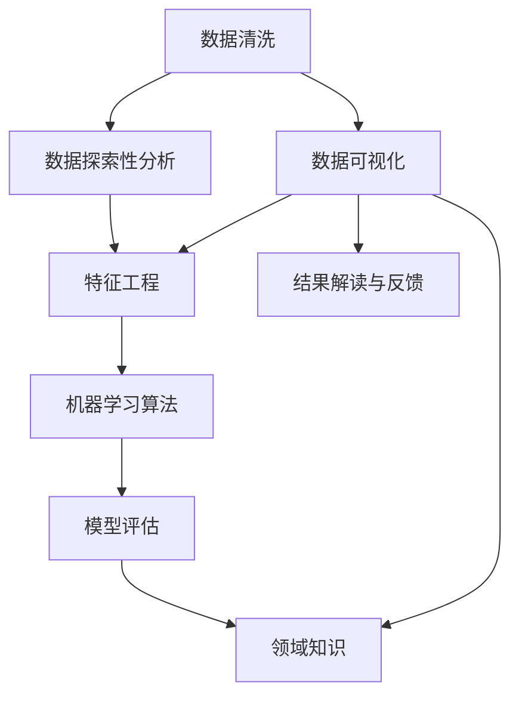

                 

## 1. 背景介绍

在信息爆炸的时代，我们每天接触到海量的数据和信息。如何从这些数据中挖掘出有价值的信息，找到事物本质的规律，是每个IT从业者都必须面对的挑战。本文将探讨总结和挖掘事物本质的核心能力，帮助读者掌握科学的方法，提升分析和解决问题的能力。

## 2. 核心概念与联系

### 2.1 核心概念概述

为更好地理解总结和挖掘事物本质的能力，本节将介绍几个密切相关的核心概念：

- **数据清洗(Data Cleaning)**：去除数据中的噪音和异常值，确保数据质量，为后续分析奠定基础。
- **数据探索性分析(Exploratory Data Analysis, EDA)**：通过统计图表和可视化方法，发现数据中的模式和异常，为深入分析提供线索。
- **特征工程(Feature Engineering)**：根据分析目标，选择、构造、转换数据特征，提高模型的预测能力。
- **机器学习算法(Machine Learning Algorithm)**：通过训练数据集，构建模型，预测新数据，实现自动化的数据挖掘和分析。
- **模型评估(Model Evaluation)**：通过测试集或交叉验证，评估模型的性能和泛化能力，选择最优模型。
- **领域知识(Domain Knowledge)**：结合领域专家的知识，对数据分析和结果进行解释和优化，提升分析的准确性和实用性。

这些核心概念之间的逻辑关系可以通过以下Mermaid流程图来展示：



这个流程图展示了一系列数据分析的核心步骤：

1. 对原始数据进行清洗，去除噪音和异常值。
2. 通过数据探索性分析，发现数据中的模式和异常。
3. 根据分析目标，进行特征工程，构造和转换特征。
4. 选择合适的机器学习算法，训练模型。
5. 通过模型评估，选择最优模型。
6. 结合领域知识，解读结果，并进行反馈优化。
7. 可视化结果，进一步进行探索性分析和特征工程。

## 3. 核心算法原理 & 具体操作步骤

### 3.1 算法原理概述

总结和挖掘事物本质的过程，本质上是利用数据驱动的方法，从大量数据中提取规律，形成有意义的见解。这个过程通常涉及数据清洗、探索性分析、特征工程和模型训练等多个步骤。

### 3.2 算法步骤详解

基于数据驱动的分析方法，总结和挖掘事物本质的过程通常包括以下几个关键步骤：

**Step 1: 数据收集与预处理**
- 收集与分析目标相关的数据，包括数据源的选择、数据采集方式等。
- 对数据进行初步清洗，去除噪音和异常值，确保数据质量。

**Step 2: 数据探索性分析**
- 使用统计图表和可视化方法，对数据进行初步分析，发现数据中的模式和异常。
- 通过数据可视化，理解数据的分布、相关性和趋势。

**Step 3: 特征工程**
- 根据分析目标，选择、构造和转换数据特征，提升模型的预测能力。
- 使用特征选择算法，如LASSO、PCA等，筛选重要特征。
- 使用特征变换算法，如标准化、归一化等，提高数据的一致性和可解释性。

**Step 4: 模型训练与评估**
- 选择合适的机器学习算法，如回归、分类、聚类等，训练模型。
- 使用训练集训练模型，评估模型的性能和泛化能力。
- 通过交叉验证、网格搜索等方法，选择最优模型。

**Step 5: 结果解读与反馈**
- 结合领域知识，解读模型结果，形成有意义的见解。
- 通过A/B测试、用户反馈等方法，验证结果的实际效果。
- 根据反馈，调整模型和算法，进一步优化分析结果。

### 3.3 算法优缺点

总结和挖掘事物本质的过程，通常具有以下优点：
1. 数据驱动，结果客观。通过数据分析得到的结论，更具有可信度和科学性。
2. 自动化程度高。机器学习算法可以自动处理大量数据，减少人工干预，提高效率。
3. 可解释性强。结合领域知识，模型结果具有更好的可解释性，便于理解和应用。

同时，该过程也存在一些局限性：
1. 数据质量依赖。数据清洗和特征工程的准确性，直接决定了分析结果的可靠性。
2. 算法依赖。选择合适的算法和模型，需要一定的专业知识和经验。
3. 结果复杂性。数据分析结果往往复杂，需要结合领域知识进行解读。
4. 过拟合风险。模型过度拟合训练数据，可能失去泛化能力。

尽管存在这些局限性，但整体而言，数据驱动的分析方法，已经成为了总结和挖掘事物本质的主要手段。

### 3.4 算法应用领域

总结和挖掘事物本质的过程，广泛应用于各种数据分析和挖掘任务，例如：

- 市场分析：通过消费者行为数据，分析市场需求和趋势，预测未来销售。
- 风险评估：利用金融数据，评估信用风险和投资风险，辅助决策。
- 客户画像：通过社交媒体数据，构建客户画像，精准营销。
- 产品推荐：通过用户行为数据，推荐个性化产品，提升用户满意度。
- 运营优化：通过运营数据，优化供应链管理、库存控制等运营环节。
- 健康预测：利用健康数据，预测疾病风险，制定预防措施。

除了上述这些经典应用外，数据分析技术还在更多领域得到应用，为各行各业带来新的发展机遇。

## 4. 数学模型和公式 & 详细讲解 & 举例说明

### 4.1 数学模型构建

本节将使用数学语言对总结和挖掘事物本质的核心过程进行更加严格的刻画。

设原始数据集为 $D=\{(x_i,y_i)\}_{i=1}^N$，其中 $x_i$ 为特征向量，$y_i$ 为标签。数据清洗后的数据集为 $D_c=\{(x_i',y_i')\}_{i=1}^N$，其中 $x_i'$ 为清洗后的特征向量，$y_i'$ 为修正后的标签。

### 4.2 公式推导过程

首先，我们定义数据清洗和探索性分析的过程：

1. 数据清洗
   - 去除缺失值和异常值：$x_i'=x_i$，$y_i'=y_i$ 如果 $y_i$ 为缺失值或异常值，否则 $y_i'=y_i$。
   - 去除重复值：$x_i'=x_i$，$y_i'=y_i$ 如果 $(x_i,y_i)$ 为重复值，否则 $y_i'=y_i$。

2. 数据探索性分析
   - 描述性统计：计算均值、方差、标准差等基本统计量。
   - 可视化：使用散点图、直方图、箱线图等可视化工具，分析数据分布和异常。
   - 相关性分析：计算皮尔逊相关系数、斯皮尔曼等级相关系数等，评估特征间的相关性。

### 4.3 案例分析与讲解

以下以市场分析为例，详细讲解数据分析的实现过程。

假设某电商公司想要分析当前市场需求和趋势，计划收集过去一年的销售数据，包括用户ID、商品ID、购买时间、购买数量、购买金额等特征。通过对数据的清洗和探索性分析，发现以下问题：

- 部分用户的购买数据缺失。
- 部分商品的销售数量异常偏高。
- 购买时间和购买金额间存在明显的正相关性。

针对这些问题，可以采取以下措施：

1. 对于缺失的购买数据，可以采用均值、中位数等方法进行填补。
2. 对于销售数量异常的商品，可以进一步分析原因，如季节性销售、促销活动等，并进行修正。
3. 对于购买时间和购买金额的关系，可以使用回归分析，预测未来的销售额。

具体实现过程如下：

**Step 1: 数据清洗**
- 使用Pandas库进行数据清洗，去除缺失值和异常值。

```python
import pandas as pd

data = pd.read_csv('sales_data.csv')
data_cleaned = data.dropna().drop_duplicates()
```

**Step 2: 数据探索性分析**
- 使用Matplotlib和Seaborn库进行数据可视化。

```python
import matplotlib.pyplot as plt
import seaborn as sns

sns.histplot(data_cleaned['purchase_amount'], bins=20, kde=True)
plt.show()
```

**Step 3: 特征工程**
- 使用PCA进行特征降维，筛选重要特征。

```python
from sklearn.decomposition import PCA
import numpy as np

X = data_cleaned.drop(['user_id', 'product_id'], axis=1).values
y = data_cleaned['purchase_amount'].values

pca = PCA(n_components=2)
X_reduced = pca.fit_transform(X)
```

**Step 4: 模型训练与评估**
- 使用随机森林回归模型进行训练和评估。

```python
from sklearn.ensemble import RandomForestRegressor
from sklearn.model_selection import train_test_split
from sklearn.metrics import mean_squared_error

X_train, X_test, y_train, y_test = train_test_split(X_reduced, y, test_size=0.2, random_state=42)

model = RandomForestRegressor(n_estimators=100, random_state=42)
model.fit(X_train, y_train)
y_pred = model.predict(X_test)
mse = mean_squared_error(y_test, y_pred)

print('Mean Squared Error:', mse)
```

**Step 5: 结果解读与反馈**
- 根据模型结果，预测未来销售额，并进行反馈优化。

```python
from sklearn.metrics import mean_squared_error

mse = mean_squared_error(y_test, y_pred)
print('Mean Squared Error:', mse)
```

## 5. 项目实践：代码实例和详细解释说明

### 5.1 开发环境搭建

在进行数据分析实践前，我们需要准备好开发环境。以下是使用Python进行Pandas、NumPy、Scikit-learn等库开发的环境配置流程：

1. 安装Anaconda：从官网下载并安装Anaconda，用于创建独立的Python环境。

2. 创建并激活虚拟环境：
```bash
conda create -n pydata-env python=3.8 
conda activate pydata-env
```

3. 安装Pandas、NumPy、Scikit-learn等工具包：
```bash
conda install pandas numpy scikit-learn
```

4. 安装Matplotlib、Seaborn等可视化库：
```bash
conda install matplotlib seaborn
```

5. 安装机器学习库：
```bash
conda install scikit-learn
```

完成上述步骤后，即可在`pydata-env`环境中开始数据分析实践。

### 5.2 源代码详细实现

下面我们以电商销售数据分析为例，给出使用Pandas、NumPy、Scikit-learn库进行数据分析的PyTorch代码实现。

首先，定义数据处理函数：

```python
import pandas as pd

def load_data(file_path):
    data = pd.read_csv(file_path)
    return data
```

然后，定义数据清洗函数：

```python
def clean_data(data):
    # 去除缺失值
    data = data.dropna()
    # 去除重复值
    data = data.drop_duplicates()
    return data
```

接着，定义数据探索性分析函数：

```python
import matplotlib.pyplot as plt
import seaborn as sns

def exploratory_analysis(data):
    # 描述性统计
    print(data.describe())
    # 可视化
    sns.histplot(data['purchase_amount'], bins=20, kde=True)
    plt.show()
```

最后，定义特征工程函数：

```python
from sklearn.decomposition import PCA
import numpy as np

def feature_engineering(data):
    X = data.drop(['user_id', 'product_id'], axis=1).values
    y = data['purchase_amount'].values

    pca = PCA(n_components=2)
    X_reduced = pca.fit_transform(X)
    return X_reduced, y
```

启动数据分析流程，并在可视化结果中进行解读：

```python
data = load_data('sales_data.csv')
data_cleaned = clean_data(data)
exploratory_analysis(data_cleaned)
X_reduced, y = feature_engineering(data_cleaned)
```

以上就是使用Pandas、NumPy、Scikit-learn库进行数据分析的完整代码实现。可以看到，借助这些工具，数据分析的实现变得简洁高效。

### 5.3 代码解读与分析

让我们再详细解读一下关键代码的实现细节：

**load_data函数**：
- 使用Pandas库读取原始数据，返回数据集。

**clean_data函数**：
- 对数据集进行初步清洗，去除缺失值和重复值，确保数据质量。

**exploratory_analysis函数**：
- 使用Matplotlib和Seaborn库进行数据可视化，展示数据的分布和相关性。

**feature_engineering函数**：
- 使用PCA进行特征降维，筛选重要特征，降低模型复杂度。

这些函数相互配合，形成了一个完整的市场分析流程，可以从原始数据中提取有价值的信息，形成对市场需求的预测。

## 6. 实际应用场景

### 6.1 市场分析

基于数据驱动的分析方法，市场分析可以帮助企业了解市场需求和趋势，优化产品定位和营销策略。

在技术实现上，可以收集历史销售数据、用户反馈、市场调研等数据，进行数据清洗和探索性分析，筛选重要特征，建立预测模型，预测未来市场趋势。具体步骤如下：

1. 收集数据：通过销售记录、问卷调查、社交媒体等渠道收集市场数据。
2. 数据清洗：去除缺失值、异常值和重复值，确保数据质量。
3. 探索性分析：通过统计图表和可视化方法，发现数据中的模式和异常。
4. 特征工程：根据分析目标，选择、构造和转换数据特征，提高模型的预测能力。
5. 模型训练与评估：选择合适的机器学习算法，训练模型，评估模型的性能和泛化能力。
6. 结果解读与反馈：结合领域知识，解读模型结果，形成有意义的见解，进行反馈优化。

**案例：电商平台销售预测**

假设某电商平台想要预测下季度销售额，可以采取以下措施：

1. 收集历史销售数据、用户行为数据等，作为原始数据集。
2. 对数据进行清洗和探索性分析，发现以下问题：部分用户的购买数据缺失，部分商品的销售数量异常偏高。
3. 对数据进行特征工程，使用PCA降维，筛选重要特征，如购买金额、购买数量、购买时间等。
4. 使用随机森林回归模型进行训练和评估，预测未来销售额。
5. 结合领域知识，解读模型结果，发现商品A在下季度销售额可能增长，需调整采购计划。

通过以上步骤，电商平台可以更好地把握市场需求，优化产品定位和营销策略，提升销售业绩。

### 6.2 风险评估

风险评估是金融领域的重要应用，通过数据分析，评估信用风险和投资风险，辅助决策。

在技术实现上，可以收集金融数据、交易记录等数据，进行数据清洗和探索性分析，构建风险评估模型，评估客户的信用风险和投资风险。具体步骤如下：

1. 收集数据：通过银行贷款记录、信用卡消费记录、财务报表等渠道收集金融数据。
2. 数据清洗：去除缺失值、异常值和重复值，确保数据质量。
3. 探索性分析：通过统计图表和可视化方法，发现数据中的模式和异常。
4. 特征工程：根据分析目标，选择、构造和转换数据特征，提高模型的预测能力。
5. 模型训练与评估：选择合适的机器学习算法，训练模型，评估模型的性能和泛化能力。
6. 结果解读与反馈：结合领域知识，解读模型结果，形成有意义的见解，进行反馈优化。

**案例：信用评分模型**

假设某银行想要建立信用评分模型，可以采取以下措施：

1. 收集客户的贷款记录、信用卡消费记录等数据，作为原始数据集。
2. 对数据进行清洗和探索性分析，发现以下问题：部分客户的消费记录缺失，部分客户的信用评分异常偏高。
3. 对数据进行特征工程，使用PCA降维，筛选重要特征，如消费金额、信用评分、还款记录等。
4. 使用逻辑回归模型进行训练和评估，预测客户的违约风险。
5. 结合领域知识，解读模型结果，发现客户B的违约风险较高，需进一步调查。

通过以上步骤，银行可以更好地评估客户的信用风险，制定合理的贷款策略，降低坏账率。

### 6.3 客户画像

客户画像是客户关系管理的重要手段，通过数据分析，构建客户的全面画像，进行精准营销。

在技术实现上，可以收集用户的购买记录、浏览记录、社交媒体数据等数据，进行数据清洗和探索性分析，构建客户画像模型，生成客户的全面画像。具体步骤如下：

1. 收集数据：通过电商平台、社交媒体等渠道收集用户数据。
2. 数据清洗：去除缺失值、异常值和重复值，确保数据质量。
3. 探索性分析：通过统计图表和可视化方法，发现数据中的模式和异常。
4. 特征工程：根据分析目标，选择、构造和转换数据特征，提高模型的预测能力。
5. 模型训练与评估：选择合适的机器学习算法，训练模型，评估模型的性能和泛化能力。
6. 结果解读与反馈：结合领域知识，解读模型结果，形成有意义的见解，进行反馈优化。

**案例：客户购买行为分析**

假设某电商平台想要构建客户画像，可以采取以下措施：

1. 收集用户的购买记录、浏览记录等数据，作为原始数据集。
2. 对数据进行清洗和探索性分析，发现以下问题：部分用户的购买记录缺失，部分用户的购买记录异常偏高。
3. 对数据进行特征工程，使用PCA降维，筛选重要特征，如购买频率、购买金额、购买时间等。
4. 使用聚类算法进行训练和评估，生成客户的购买行为簇。
5. 结合领域知识，解读模型结果，发现客户C的购买行为与新用户相似，需进行针对性营销。

通过以上步骤，电商平台可以更好地了解客户行为，制定针对性的营销策略，提升用户满意度。

## 7. 工具和资源推荐

### 7.1 学习资源推荐

为了帮助开发者系统掌握数据驱动的分析方法，这里推荐一些优质的学习资源：

1. 《Python数据科学手册》：一本全面介绍Python数据分析和可视化的书籍，涵盖Pandas、NumPy、Scikit-learn等常用工具。

2. 《机器学习实战》：讲解机器学习算法和模型的经典书籍，适合初学者入门。

3. 《数据挖掘导论》：系统介绍数据挖掘技术的教材，包括数据清洗、特征工程、模型训练等环节。

4. 《Kaggle数据科学课程》：Kaggle平台提供的免费课程，通过实际案例教学，快速提升数据科学技能。

5. 《数据驱动的分析》：介绍数据驱动分析方法的系统性教材，涵盖数据清洗、探索性分析、特征工程等多个环节。

通过对这些资源的学习实践，相信你一定能够快速掌握数据驱动的分析方法，并用于解决实际的业务问题。

### 7.2 开发工具推荐

高效的开发离不开优秀的工具支持。以下是几款用于数据驱动分析开发的常用工具：

1. Jupyter Notebook：强大的交互式开发环境，支持Python、R等语言，适合快速原型开发和数据探索。

2. Pandas：Python数据分析库，支持数据清洗、探索性分析、特征工程等环节，适合高效的数据处理。

3. NumPy：Python科学计算库，支持高效的数值计算和矩阵运算，适合数据转换和处理。

4. Scikit-learn：Python机器学习库，支持多种机器学习算法，适合模型训练和评估。

5. Matplotlib：Python可视化库，支持多种图表绘制，适合数据可视化。

6. Seaborn：基于Matplotlib的高级可视化库，支持复杂图表绘制，适合数据探索性分析。

合理利用这些工具，可以显著提升数据驱动分析的开发效率，加快创新迭代的步伐。

### 7.3 相关论文推荐

数据驱动的分析方法源于学界的持续研究。以下是几篇奠基性的相关论文，推荐阅读：

1. KDD Cup 2012：介绍数据挖掘任务及其应用，包含多种数据分析方法和技术。

2. KDD Cup 2013：介绍文本数据挖掘任务及其应用，涵盖文本清洗、特征提取、模型训练等多个环节。

3. KDD Cup 2014：介绍图像数据挖掘任务及其应用，涵盖图像清洗、特征提取、模型训练等多个环节。

4. KDD Cup 2015：介绍视频数据挖掘任务及其应用，涵盖视频清洗、特征提取、模型训练等多个环节。

5. KDD Cup 2016：介绍多模态数据挖掘任务及其应用，涵盖多模态数据融合、特征工程、模型训练等多个环节。

这些论文代表了大数据分析技术的发展脉络。通过学习这些前沿成果，可以帮助研究者把握学科前进方向，激发更多的创新灵感。

## 8. 总结：未来发展趋势与挑战

### 8.1 研究成果总结

本文对数据驱动的分析方法进行了全面系统的介绍。首先阐述了数据分析的核心能力，明确了数据清洗、探索性分析、特征工程、模型训练、结果解读与反馈等关键步骤，以及各步骤之间的逻辑关系。其次，通过实际案例，展示了数据驱动的分析方法在市场分析、风险评估、客户画像等多个领域的应用效果。

通过本文的系统梳理，可以看到，数据驱动的分析方法已经成为现代数据分析的重要手段，极大地提升了数据分析的效率和效果。未来，伴随数据规模的不断增长和技术手段的不断进步，数据分析技术必将在更多的领域得到应用，带来新的变革性影响。

### 8.2 未来发展趋势

展望未来，数据驱动的分析方法将呈现以下几个发展趋势：

1. 数据规模持续增大。随着数据采集技术的不断进步，大数据量的数据驱动分析将更加普遍，从而带来更多的应用场景。

2. 自动化程度提升。更多的机器学习和深度学习算法将被引入到数据驱动的分析中，提高自动化程度，降低人工干预。

3. 多模态数据分析发展。随着数据采集设备的增多，多模态数据的分析将成为热点，未来的数据分析将更加全面和深入。

4. 数据可视化优化。数据可视化工具将不断优化，使得分析结果更加直观，便于理解和应用。

5. 数据治理机制完善。建立数据治理机制，保证数据质量和隐私安全，是数据驱动分析的重要保障。

6. 结果可解释性加强。通过模型可解释性技术，提高数据分析结果的可解释性，提升用户信任度。

这些趋势凸显了数据驱动分析方法的广阔前景。这些方向的探索发展，必将进一步提升数据分析的效率和效果，为各行各业带来新的发展机遇。

### 8.3 面临的挑战

尽管数据驱动的分析方法已经取得了显著成就，但在迈向更加智能化、普适化应用的过程中，仍面临诸多挑战：

1. 数据质量问题。数据清洗和特征工程的准确性，直接决定了分析结果的可靠性。如何高效、准确地进行数据清洗和特征工程，是当前面临的挑战之一。

2. 模型复杂度。随着数据规模的增大和分析任务的复杂化，模型的训练和优化变得更加困难，需要更强大的计算资源和算法支持。

3. 结果复杂性。数据分析结果往往复杂，需要结合领域知识进行解读。如何简化模型，提高分析结果的可解释性，是当前面临的挑战之一。

4. 数据安全问题。数据驱动的分析方法涉及大量的敏感数据，如何保障数据安全和隐私保护，是当前面临的挑战之一。

5. 模型可解释性。数据驱动的分析方法通常采用黑盒模型，难以解释模型的决策过程，如何提升模型的可解释性，是当前面临的挑战之一。

尽管存在这些挑战，但整体而言，数据驱动的分析方法已经成为了现代数据分析的重要手段，极大地提升了数据分析的效率和效果。未来，伴随技术手段的不断进步和数据治理机制的完善，数据分析技术必将在更多的领域得到应用，带来新的变革性影响。

### 8.4 研究展望

面对数据驱动分析所面临的挑战，未来的研究需要在以下几个方面寻求新的突破：

1. 自动化数据清洗和特征工程：开发自动化的数据清洗和特征工程工具，提高效率和准确性。

2. 模型可解释性技术：研究模型可解释性技术，提高数据分析结果的可解释性，提升用户信任度。

3. 多模态数据融合技术：研究多模态数据融合技术，提高数据分析的全面性和深入性。

4. 数据治理机制：建立数据治理机制，保证数据质量和隐私安全，是数据驱动分析的重要保障。

5. 数据驱动的AI算法：研究数据驱动的AI算法，提高数据分析的自动化程度和效果。

这些研究方向将引领数据驱动分析技术迈向更高的台阶，为构建安全、可靠、可解释、可控的智能系统铺平道路。面向未来，数据驱动分析技术还需要与其他人工智能技术进行更深入的融合，如知识表示、因果推理、强化学习等，多路径协同发力，共同推动数据驱动分析技术的进步。只有勇于创新、敢于突破，才能不断拓展数据分析的边界，让智能技术更好地造福人类社会。

## 9. 附录：常见问题与解答

**Q1：数据分析中数据清洗的目的是什么？**

A: 数据清洗的目的是去除数据中的噪音和异常值，确保数据质量，为后续分析奠定基础。

**Q2：数据探索性分析中常用的统计图表和可视化方法有哪些？**

A: 数据探索性分析中常用的统计图表和可视化方法包括：

- 描述性统计：均值、方差、标准差等基本统计量。
- 直方图：展示数据的分布情况。
- 箱线图：展示数据的分布情况，识别异常值。
- 散点图：展示两个变量之间的关系。
- 热力图：展示多个变量之间的关系。

**Q3：特征工程在数据分析中的作用是什么？**

A: 特征工程在数据分析中的作用是选择、构造和转换数据特征，提高模型的预测能力。通过特征工程，可以将原始数据转换为更有意义的特征，提高模型的准确性和泛化能力。

**Q4：模型训练与评估中常用的机器学习算法有哪些？**

A: 模型训练与评估中常用的机器学习算法包括：

- 回归算法：用于预测连续型数值，如线性回归、岭回归等。
- 分类算法：用于分类问题，如逻辑回归、支持向量机等。
- 聚类算法：用于无监督学习，如K-means、层次聚类等。

**Q5：结果解读与反馈中常用的指标有哪些？**

A: 结果解读与反馈中常用的指标包括：

- 精度：分类任务中，模型正确分类的样本数占总样本数的比例。
- 召回率：分类任务中，模型正确分类的正样本数占所有正样本数的比例。
- F1分数：精度和召回率的调和平均数，综合评估模型的性能。
- R方系数：回归任务中，模型预测值与真实值之间的拟合程度。

通过这些指标，可以评估模型在各个环节的性能，并进行优化。

---

作者：禅与计算机程序设计艺术 / Zen and the Art of Computer Programming

