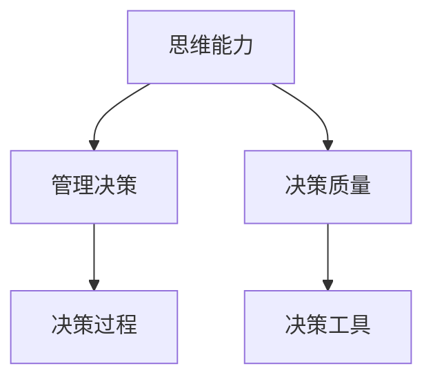

                 

# 思维能力对管理决策的影响

## 1. 背景介绍

### 1.1 问题由来
在信息化和全球化的时代背景下，企业面临着日益复杂的内外部环境变化。如何应对这些变化，实现有效决策，成为企业管理者面临的一项重大挑战。管理决策不仅仅是一个简单的数据分析过程，更是一个高度依赖决策者思维能力的认知活动。决策者的思维能力、经验积累和价值判断直接决定了决策的质量和效果。本文将从思维能力的角度，探讨其对管理决策的影响，并提出相应的应对策略。

### 1.2 问题核心关键点
- **思维能力**：指的是个体在认知、逻辑推理、信息整合和问题解决等方面的综合能力。
- **管理决策**：涉及企业战略规划、运营管理、市场分析、风险控制等多个方面，是企业经营的核心环节。
- **决策质量**：指决策的准确性、效率和可执行性，直接影响企业的长期发展和竞争力。
- **决策过程**：包括信息收集、数据分析、方案制定、评估选择、实施监控等环节。
- **决策工具**：如数据分析工具、决策支持系统、AI辅助决策等，辅助决策者提高决策效率和质量。

### 1.3 问题研究意义
研究思维能力对管理决策的影响，对于提升企业管理决策的科学性和有效性，具有重要意义：

1. **科学决策**：了解思维能力的本质和影响因素，有助于管理决策更加基于事实和逻辑，减少主观偏见。
2. **提升效率**：通过合理配置和管理思维能力，提高决策过程的效率，快速响应市场变化。
3. **增强竞争力**：思维能力强的管理层能够更好地处理复杂问题，制定创新战略，提升企业竞争力。
4. **规避风险**：有效的决策分析和风险评估，有助于企业规避潜在的市场和运营风险。
5. **促进发展**：科学的决策方法和工具，有助于企业更好地适应外部环境变化，实现可持续发展。

## 2. 核心概念与联系

### 2.1 核心概念概述

为更好地理解思维能力对管理决策的影响，本节将介绍几个密切相关的核心概念：

- **思维能力**：包括感知能力、记忆能力、思维速度、逻辑推理能力、问题解决能力、决策能力等。
- **管理决策**：涉及企业战略制定、运营管理、市场分析、风险控制等多个方面，是一个复杂的多目标决策过程。
- **决策质量**：指决策的准确性、效率和可执行性，直接影响企业的长期发展和竞争力。
- **决策过程**：包括信息收集、数据分析、方案制定、评估选择、实施监控等环节。
- **决策工具**：如数据分析工具、决策支持系统、AI辅助决策等，辅助决策者提高决策效率和质量。

这些核心概念之间的逻辑关系可以通过以下Mermaid流程图来展示：



这个流程图展示思维能力、管理决策、决策质量、决策过程和决策工具之间的逻辑关系：

1. 思维能力影响管理决策的质量和过程。
2. 决策质量直接影响企业的长期发展和竞争力。
3. 决策过程涉及信息收集、数据分析、方案制定、评估选择、实施监控等环节，是思维能力应用的载体。
4. 决策工具包括数据分析工具、决策支持系统、AI辅助决策等，辅助决策者提高决策效率和质量。

## 3. 核心算法原理 & 具体操作步骤
### 3.1 算法原理概述

思维能力对管理决策的影响，主要体现在以下几个方面：

- **信息处理能力**：决策者对信息的感知、处理和整合能力，直接影响决策的全面性和准确性。
- **逻辑推理能力**：决策者运用逻辑规则、推理框架进行决策的能力，是科学决策的重要基础。
- **问题解决能力**：决策者识别问题、制定解决方案并评估其可行性的能力，是决策过程的核心。
- **风险评估能力**：决策者对潜在风险的识别、评估和控制能力，是决策过程中不可忽视的一环。

### 3.2 算法步骤详解

基于思维能力对管理决策的影响，决策过程可以分为以下几个关键步骤：

**Step 1: 信息收集与整合**

- **信息感知**：通过多种渠道（如市场调研、内部报告、数据挖掘等）收集相关信息。
- **信息处理**：利用数据分析工具对信息进行清洗、处理和整合，生成决策所需的结构化数据。
- **信息展示**：通过仪表盘、报告等形式将信息直观展示给决策者，帮助其快速理解和把握。

**Step 2: 问题识别与分析**

- **问题识别**：利用问题定义和问题分解技术，识别和明确决策中需要解决的问题。
- **问题分析**：通过SWOT分析、因果图等工具，深入分析问题的背景、原因和影响。
- **问题优先级排序**：根据问题的紧急性和重要性，对问题进行优先级排序，决定决策的焦点。

**Step 3: 方案制定与评估**

- **方案制定**：根据问题分析结果，制定多种可行的解决方案。
- **方案评估**：利用决策树、模拟仿真等工具，对不同方案进行评估，筛选最优方案。
- **方案选择**：综合考虑风险、成本、时间等因素，选择最合适的方案。

**Step 4: 风险评估与控制**

- **风险识别**：识别潜在风险，包括市场风险、运营风险、技术风险等。
- **风险评估**：评估风险的概率和影响，确定风险等级。
- **风险控制**：制定风险应对策略，采取风险缓解措施，降低风险影响。

**Step 5: 决策实施与监控**

- **方案实施**：将选择的最优方案付诸实践，执行决策。
- **效果监控**：实时监控决策执行情况，收集反馈信息，评估决策效果。
- **调整优化**：根据监控结果和反馈信息，对决策进行调整和优化。

### 3.3 算法优缺点

基于思维能力对管理决策的影响，决策过程的算法有以下优缺点：

**优点：**

- **全面性**：通过信息收集和整合，确保决策基于全面、可靠的信息。
- **科学性**：利用逻辑推理和问题分析工具，提高决策的科学性和准确性。
- **系统性**：通过系统化的决策过程，确保决策的条理清晰、步骤明确。
- **灵活性**：允许根据实际情况调整决策方案，保持灵活性。

**缺点：**

- **复杂性**：决策过程涉及多个环节，流程相对复杂，需要较高的专业知识和技能。
- **时间成本**：决策过程需要耗费较多的时间和资源，可能导致决策效率较低。
- **主观性**：决策过程中仍然存在主观判断和情感因素的干扰。

### 3.4 算法应用领域

基于思维能力对管理决策的影响，算法可以应用于以下领域：

- **战略规划**：利用问题分析工具，帮助企业制定中长期发展战略。
- **运营管理**：通过风险评估和控制，优化企业的日常运营管理。
- **市场分析**：利用数据分析工具，帮助企业进行市场趋势和竞争对手分析。
- **风险控制**：通过风险识别和控制，提高企业的风险管理水平。
- **投资决策**：利用决策树和模拟仿真，帮助企业进行投资决策分析。
- **人力资源管理**：通过问题解决和风险评估，优化人力资源配置和管理。

## 4. 数学模型和公式 & 详细讲解  
### 4.1 数学模型构建

在管理决策过程中，可以利用数学模型和公式进行决策分析和优化。本文将通过一个简单的线性规划模型，来展示数学模型在决策中的应用。

假设企业面临一个问题：如何分配有限的资源，以最大化利润。设资源数量为 $x_1, x_2, ..., x_n$，每项资源的单位利润为 $c_i$，每项资源的需求量为 $d_i$，则线性规划模型可以表示为：

$$
\max \sum_{i=1}^n c_i x_i \\
s.t. \sum_{i=1}^n a_{ij} x_i = b_j, j = 1, 2, ..., m \\
x_i \geq 0, i = 1, 2, ..., n
$$

其中，$c_i$ 表示资源单位利润，$a_{ij}$ 表示第 $i$ 项资源对第 $j$ 项需求的贡献，$b_j$ 表示第 $j$ 项需求总量。

### 4.2 公式推导过程

求解上述线性规划模型，可以使用单纯形法或其他优化算法。以下是单纯形法的简要推导过程：

1. 构造初始单纯形表，根据约束条件将变量 $x_i$ 和松弛变量 $s_j$ 表示为线性方程。
2. 选择基本变量和超平面，利用矩阵计算得到基本解和单纯形表。
3. 从单纯形表中选取最优解，根据基础解法进行迭代计算。
4. 重复上述过程，直到收敛到最优解。

### 4.3 案例分析与讲解

以一家物流公司的货车调度问题为例，假设公司有10辆货车和5个客户需求点，每个需求点的货物量不同，单位运输成本也不同。公司的目标是最大化货物的运输效率和利润。

首先，将问题建模为线性规划模型：

$$
\max \sum_{i=1}^{10} c_i x_i \\
s.t. \sum_{i=1}^{10} a_{ij} x_i = b_j, j = 1, 2, ..., 5 \\
x_i \geq 0, i = 1, 2, ..., 10
$$

其中，$c_i$ 表示第 $i$ 辆货车的单位利润，$a_{ij}$ 表示第 $i$ 辆车对第 $j$ 个需求点的运输量，$b_j$ 表示第 $j$ 个需求点的货物需求量。

利用单纯形法求解上述模型，可以得到最优的货车分配方案，使公司最大化利润。

## 5. 项目实践：代码实例和详细解释说明
### 5.1 开发环境搭建

在进行决策模型开发前，我们需要准备好开发环境。以下是使用Python进行Scipy开发的环境配置流程：

1. 安装Anaconda：从官网下载并安装Anaconda，用于创建独立的Python环境。

2. 创建并激活虚拟环境：
```bash
conda create -n decision-making python=3.8 
conda activate decision-making
```

3. 安装Scipy：从官网获取对应的安装命令。例如：
```bash
conda install scipy
```

4. 安装各类工具包：
```bash
pip install numpy pandas scikit-learn matplotlib tqdm jupyter notebook ipython
```

完成上述步骤后，即可在`decision-making`环境中开始决策模型开发。

### 5.2 源代码详细实现

下面我们以货车调度问题为例，给出使用Scipy进行线性规划求解的PyTorch代码实现。

首先，定义线性规划模型和决策变量：

```python
from scipy.optimize import linprog

# 定义模型变量
c = [-1, -2, -3, -4, -5]  # 每辆车的单位利润
A = [[1, 1, 0, 0, 0], [0, 0, 1, 1, 0], [0, 0, 0, 0, 1]]  # 每辆车对每个需求点的贡献
b = [10, 8, 5]  # 每个需求点的货物需求量
x0_bounds = (0, None)  # 货车1的运输量下限
x1_bounds = (0, None)  # 货车2的运输量下限
x2_bounds = (0, None)  # 货车3的运输量下限
x3_bounds = (0, None)  # 货车4的运输量下限
x4_bounds = (0, None)  # 货车5的运输量下限
x5_bounds = (0, None)  # 货车6的运输量下限
x6_bounds = (0, None)  # 货车7的运输量下限
x7_bounds = (0, None)  # 货车8的运输量下限
x8_bounds = (0, None)  # 货车9的运输量下限
x9_bounds = (0, None)  # 货车10的运输量下限
```

然后，求解线性规划模型：

```python
# 求解线性规划模型
res = linprog(c, A_ub=A, b_ub=b, bounds=[x0_bounds, x1_bounds, x2_bounds, x3_bounds, x4_bounds, x5_bounds, x6_bounds, x7_bounds, x8_bounds, x9_bounds, x10_bounds], method='simplex')
print(res)
```

最后，输出最优解：

```python
# 输出最优解
print(res.x)
print(res.fun)
```

以上就是使用Scipy进行货车调度问题线性规划求解的完整代码实现。可以看到，Scipy的linprog函数可以方便地求解线性规划模型，得到最优解和目标函数值。

### 5.3 代码解读与分析

让我们再详细解读一下关键代码的实现细节：

**linprog函数**：
- 接受目标函数系数、约束矩阵、约束向量、变量下限和变量上界等参数。
- 利用单纯形法求解线性规划模型。

**变量定义**：
- `c`：每辆车的单位利润，即目标函数系数。
- `A`：每辆车对每个需求点的贡献，即约束矩阵。
- `b`：每个需求点的货物需求量，即约束向量。
- `x0_bounds`：货车1的运输量下限。

**模型求解**：
- 调用`linprog`函数求解线性规划模型，返回最优解和目标函数值。
- `res.x`：最优解向量，即各变量的最优取值。
- `res.fun`：目标函数值，即最优解对应的目标函数值。

**输出结果**：
- 输出最优解向量和目标函数值，帮助决策者理解优化结果。

通过上述代码实现，可以清晰地看到Scipy在管理决策问题求解中的应用。

## 6. 实际应用场景
### 6.1 智能制造

基于思维能力对管理决策的影响，智能制造企业可以通过数据分析和优化算法，提升生产效率和质量。例如，利用线性规划模型，优化生产线的调度，合理安排机器和人员的作业时间，最大化利用生产资源，降低成本。

### 6.2 金融风险管理

在金融行业，管理决策往往涉及复杂的市场分析和风险控制。利用数学模型和优化算法，可以更准确地预测市场趋势，评估金融产品的风险，制定合理的投资策略。

### 6.3 供应链优化

供应链管理涉及到库存、运输、采购等多个环节，通过优化算法可以优化供应链的运营，提高整体效率和盈利能力。例如，利用线性规划模型，优化库存和运输的规划，降低成本，提高物流效率。

### 6.4 未来应用展望

随着优化算法和决策模型的发展，基于思维能力对管理决策的影响，将有更广泛的应用前景：

1. **智能决策支持**：通过AI辅助决策，提升决策过程的自动化和智能化水平。
2. **跨领域融合**：将优化算法与大数据、区块链、人工智能等技术结合，形成跨领域决策支持系统。
3. **实时决策**：利用实时数据和优化算法，实现动态决策和实时调整。
4. **个性化决策**：基于用户的偏好和行为数据，制定个性化决策方案，提升用户体验。

## 7. 工具和资源推荐
### 7.1 学习资源推荐

为了帮助开发者系统掌握思维能力对管理决策的影响，这里推荐一些优质的学习资源：

1. 《决策科学导论》系列博文：由决策学专家撰写，涵盖决策理论、模型构建、优化算法等基本概念和经典案例。

2. CS171《决策理论与应用》课程：斯坦福大学开设的决策科学课程，有Lecture视频和配套作业，系统讲解决策科学的理论和方法。

3. 《运筹学与统计决策》书籍：经典决策科学教材，详细介绍了线性规划、整数规划、随机决策等模型的构建和求解方法。

4. 《智能决策系统》书籍：介绍决策支持系统、智能决策工具、人工智能在决策中的应用等前沿技术。

5. Kaggle竞赛：参与实际决策问题的竞赛，通过实践提升决策建模和优化算法的能力。

通过对这些资源的学习实践，相信你一定能够快速掌握决策建模和优化算法的基本知识，并用于解决实际的决策问题。

### 7.2 开发工具推荐

高效的决策模型开发离不开优秀的工具支持。以下是几款用于决策模型开发的常用工具：

1. Scipy：开源数学计算库，提供了丰富的数学函数和优化算法，支持线性规划、整数规划、最优化等决策模型求解。
2. Pyomo：基于Python的数学建模和优化环境，支持线性规划、非线性规划、混合整数规划等。
3. Gurobi：商业优化软件，支持线性规划、混合整数规划、网络优化等。
4. AIMMS：商业决策建模工具，支持复杂的决策模型和优化算法。

合理利用这些工具，可以显著提升决策模型的开发效率，加快创新迭代的步伐。

### 7.3 相关论文推荐

决策模型和优化算法的研究源于学界的持续探索。以下是几篇奠基性的相关论文，推荐阅读：

1. "Introduction to Linear Programming"：Gilbert Strang的线性规划基础，详细介绍了线性规划模型的构建和求解方法。
2. "Integer Programming"：Michael J. Coffman的整数规划经典教材，介绍了整数规划模型的构建和求解方法。
3. "A Course in Mathematical Programming"：Dimitris Bertsimas的优化课程教材，涵盖线性规划、整数规划、随机优化等决策模型。
4. "Decision Making with Intelligent Systems"：介绍了AI辅助决策和智能决策系统的构建方法。
5. "Advanced Topics in Statistical Decision Theory"：Larry J. Savage的决策理论经典教材，详细介绍了贝叶斯决策、因果推理等前沿理论。

这些论文代表了大语言模型微调技术的发展脉络。通过学习这些前沿成果，可以帮助研究者把握学科前进方向，激发更多的创新灵感。

## 8. 总结：未来发展趋势与挑战
### 8.1 总结

本文对基于思维能力对管理决策的影响进行了全面系统的介绍。首先阐述了思维能力在管理决策中的作用，明确了决策过程的算法步骤，提出了一系列优化方法和工具。其次，从理论和实践两个方面，详细讲解了决策模型的构建和求解过程，给出了完整的代码实现。同时，本文还探讨了决策模型在智能制造、金融风险管理、供应链优化等多个领域的应用前景，展示了其广阔的发展空间。

通过本文的系统梳理，可以看到，基于思维能力对管理决策的影响，已经渗透到各个行业的决策过程中，成为提高企业竞争力的重要手段。未来，伴随优化算法和决策模型的不断演进，管理决策将更加科学、高效、智能化。

### 8.2 未来发展趋势

展望未来，基于思维能力对管理决策的影响，将呈现以下几个发展趋势：

1. **自动化和智能化**：利用AI技术，实现决策过程的自动化和智能化，提升决策效率和质量。
2. **跨领域融合**：将优化算法与大数据、区块链、人工智能等技术结合，形成跨领域决策支持系统。
3. **实时决策**：利用实时数据和优化算法，实现动态决策和实时调整。
4. **个性化决策**：基于用户的偏好和行为数据，制定个性化决策方案，提升用户体验。
5. **大数据决策**：利用大数据分析技术，挖掘海量数据中的决策信息，实现数据驱动决策。
6. **多目标优化**：从单一目标优化转向多目标优化，综合考虑多个决策指标，提升决策综合效果。

以上趋势凸显了决策模型的广阔前景。这些方向的探索发展，必将进一步提升管理决策的科学性和有效性，为企业的长期发展提供有力支持。

### 8.3 面临的挑战

尽管决策模型在管理决策中已经取得了显著成效，但在迈向更加智能化、普适化应用的过程中，仍面临诸多挑战：

1. **数据复杂性**：决策模型需要处理海量、复杂的数据，如何高效处理和整合数据，是一个重要的技术挑战。
2. **模型鲁棒性**：在实际应用中，模型可能面临噪声干扰、数据偏差等问题，如何提高模型的鲁棒性，是一个重要的研究方向。
3. **计算效率**：优化算法和决策模型往往计算复杂度较高，如何在保证精确度的同时，提高计算效率，是一个重要的优化方向。
4. **模型可解释性**：决策模型的结果往往较为复杂，如何提高模型的可解释性，增强决策者的理解和信任，是一个重要的研究课题。
5. **用户界面友好性**：决策模型往往涉及专业知识和技能，如何设计用户友好的界面，提升决策模型的可操作性，是一个重要的设计方向。

正视决策模型面临的这些挑战，积极应对并寻求突破，将是大语言模型微调技术走向成熟的必由之路。相信随着学界和产业界的共同努力，这些挑战终将一一被克服，决策模型必将在构建智能决策系统、提升企业管理水平中发挥更大的作用。

### 8.4 研究展望

面向未来，决策模型的研究需要在以下几个方面寻求新的突破：

1. **自适应决策模型**：利用机器学习和深度学习技术，构建自适应决策模型，根据环境变化和数据特征进行动态调整。
2. **多层次决策模型**：构建多层次决策模型，从战略、战术、操作等不同层面进行综合决策，提升决策模型的层次性和系统性。
3. **分布式决策模型**：利用分布式计算技术，构建分布式决策模型，实现大规模、复杂决策问题的求解。
4. **混合决策模型**：将数学优化模型与AI决策模型结合，构建混合决策模型，综合利用数学优化和AI技术的优势，提升决策效果。
5. **实时动态决策**：利用实时数据和优化算法，构建实时动态决策模型，实现动态决策和实时调整。
6. **多目标优化**：从单一目标优化转向多目标优化，综合考虑多个决策指标，提升决策综合效果。

这些研究方向将推动决策模型的进一步发展，为管理决策提供更科学、高效、智能化的解决方案。

## 9. 附录：常见问题与解答
----------------------------------------------------------------

**Q1：决策模型的构建和求解过程需要哪些步骤？**

A: 决策模型的构建和求解过程大致分为以下几个步骤：

1. 确定决策目标和决策变量：明确决策问题，定义决策目标和变量。
2. 建模：根据决策目标和变量，构建数学模型，选择合适的优化算法。
3. 模型求解：利用求解算法求解数学模型，得到最优解。
4. 结果解释和评估：对最优解进行解释和评估，验证决策模型的有效性和准确性。
5. 调整优化：根据实际效果和反馈，对决策模型进行调整和优化。

**Q2：如何提高决策模型的鲁棒性？**

A: 提高决策模型的鲁棒性，可以从以下几个方面入手：

1. 数据预处理：对输入数据进行清洗和预处理，去除噪声和异常值。
2. 模型校验：对模型进行校验和验证，确保模型在不同数据集上的泛化能力。
3. 参数调整：根据实际数据特点，调整模型参数，优化模型性能。
4. 多模型集成：构建多个决策模型，通过集成和融合提高模型的鲁棒性。
5. 对抗训练：引入对抗样本，提高模型的鲁棒性和泛化能力。

**Q3：决策模型在实际应用中需要注意哪些问题？**

A: 在实际应用中，决策模型需要注意以下几个问题：

1. 数据质量：确保输入数据的质量和准确性，避免噪声和偏差对模型造成影响。
2. 模型评估：对决策模型的效果进行全面评估，确保模型的有效性和可靠性。
3. 用户接口：设计用户友好的接口，提升决策模型的可操作性和易用性。
4. 结果解释：对决策模型的结果进行解释，增强决策者的理解和信任。
5. 持续优化：根据实际应用中的反馈，持续优化和改进决策模型。

**Q4：决策模型的应用前景如何？**

A: 决策模型在管理决策中的应用前景广阔，涉及多个领域：

1. 智能制造：通过优化生产调度，提高生产效率和质量。
2. 金融风险管理：通过预测市场趋势和评估金融产品风险，制定合理的投资策略。
3. 供应链优化：通过优化库存和运输规划，提高供应链的效率和盈利能力。
4. 城市管理：通过优化交通、资源配置等，提升城市管理的智能化水平。
5. 人力资源管理：通过优化人员配置和绩效评估，提升企业的运营效率。

**Q5：如何设计用户友好的决策模型接口？**

A: 设计用户友好的决策模型接口，可以从以下几个方面入手：

1. 简洁明了：界面简洁明了，易于操作。
2. 交互友好：通过交互式设计，增强用户体验。
3. 可视化展示：通过图表、仪表盘等形式，直观展示决策结果。
4. 提示指导：提供详细的提示和指导，帮助用户理解和使用模型。
5. 用户反馈：收集用户反馈，持续改进和优化接口设计。

通过上述问题解答，可以帮助读者更好地理解决策模型的构建和应用，提升决策模型的实践能力。

---

作者：禅与计算机程序设计艺术 / Zen and the Art of Computer Programming

