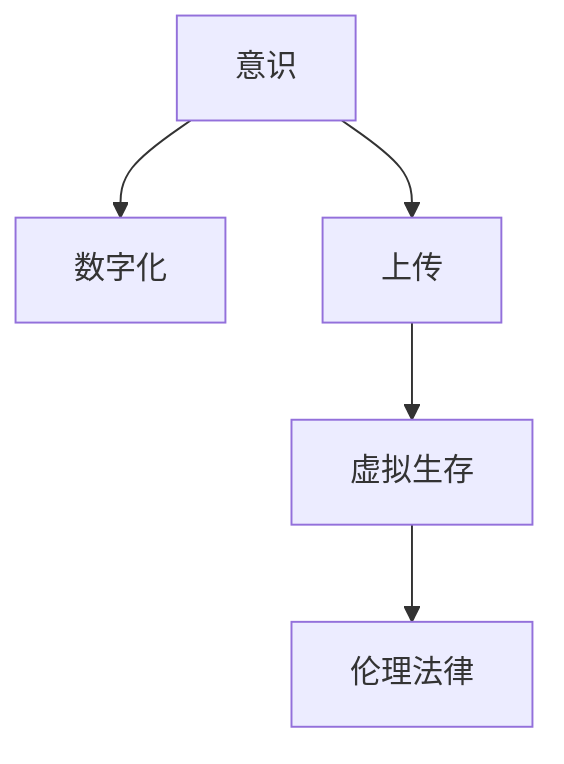

                 

# 意识上传：AI时代的永生幻想

## 1. 背景介绍

### 1.1 问题由来

人类对永生的渴望，古已有之。从炼金术到现代科学，无数探索都在追求这一终极目标。然而，生理上的极限和死亡的必然性使得传统的永生梦想一直未能实现。

然而，随着人工智能(AI)技术的飞速发展，特别是深度学习在计算机视觉、自然语言处理等领域的突破，我们开始思考：**是否有可能将人类的意识上传至计算机，实现虚拟永生**？

这一概念最早由科幻作家Vernor Vinge在其小说《Z Sagittarius》中提出，并在近年来成为研究热点。它挑战了生命科学、信息科学、伦理法律等多个领域，引起了广泛关注。

### 1.2 问题核心关键点

意识上传的核心问题在于，如何实现**将人类意识数字化并保存，使得其能够在虚拟环境中持续运行和演化**。

其中关键点包括：
- **意识本质**：意识是什么？它是否能够被数字化？
- **数字化技术**：如何实现意识的数字化，如何保存数字化后的数据？
- **虚拟生存**：如何在虚拟环境中实现意识的持续运行和演化？
- **伦理法律**：意识上传是否道德？其法律地位如何？

## 2. 核心概念与联系

### 2.1 核心概念概述

为了更好地理解意识上传的概念，本节将介绍几个关键核心概念及其相互联系：

- **意识（Consciousness）**：指个体对外界刺激的主观感受和内在认知状态，包括感知、思考、情感、意志等。
- **数字化（Digitization）**：将人类意识转换为数字信号，以便于保存和处理。
- **上传（Upload）**：将数字化后的意识数据传输至计算机或其他存储介质中。
- **虚拟生存（Virtual Survival）**：通过计算机模拟，使意识在虚拟环境中得以延续和发展。
- **伦理法律（Ethics and Law）**：关于意识上传的伦理道德问题和法律地位，需考虑隐私权、知情权、控制权等多个维度。

这些核心概念之间的逻辑关系可以通过以下Mermaid流程图来展示：



这个流程图展示了一些核心概念及其相互联系：

1. 意识通过数字化转化为可处理的数据。
2. 数字化后的意识通过上传保存至计算机或存储介质。
3. 上传后的意识在虚拟环境中运行和演化。
4. 虚拟生存中的意识需遵循伦理和法律约束。

## 3. 核心算法原理 & 具体操作步骤

### 3.1 算法原理概述

意识上传的基本原理是将人类意识通过神经科学、认知科学、计算机科学等多学科交叉研究，实现意识的数字化。然后，将数字化后的数据通过上传保存到计算机或其他存储介质中，最终在虚拟环境中实现意识的持续运行和演化。

具体步骤包括：
1. **意识数字化**：通过神经信号采集、脑机接口等技术，将人类意识转换为数字信号。
2. **数据上传保存**：将数字化后的意识数据传输至计算机或其他存储介质，进行保存。
3. **虚拟运行**：将上传后的数据加载至虚拟环境中，实现意识的持续运行和演化。
4. **伦理法律遵循**：确保意识上传过程中的伦理合法，保护个人隐私和权益。

### 3.2 算法步骤详解

**Step 1: 意识数字化**

1. **神经信号采集**：使用脑电波、脑磁图、功能性磁共振成像等技术，采集大脑的神经信号。
2. **信号处理**：通过滤波、降维、特征提取等技术，将原始神经信号转换为数字化信号。
3. **模式识别**：利用机器学习算法，将数字化信号与意识状态进行映射，实现意识的数字化。

**Step 2: 数据上传保存**

1. **数据编码**：将数字化后的意识数据转换为二进制编码，便于保存和传输。
2. **数据存储**：使用云存储、固态硬盘、量子存储等技术，将编码后的数据保存在计算机或其他存储介质中。
3. **数据加密**：对上传的数据进行加密处理，保护数据安全和隐私。

**Step 3: 虚拟运行**

1. **环境搭建**：建立虚拟运行环境，包括虚拟现实(VR)、增强现实(AR)等技术。
2. **数据加载**：将上传的数据加载至虚拟环境中，实现意识的虚拟运行。
3. **仿真模拟**：通过模拟神经系统运行，实现意识的持续运行和演化。

**Step 4: 伦理法律遵循**

1. **伦理审查**：确保意识上传过程中符合伦理规范，保护个人隐私和知情权。
2. **法律规范**：制定相关法律法规，明确意识上传的法律地位和责任归属。
3. **用户同意**：在意识上传前，确保用户知情并同意，保障用户控制权。

### 3.3 算法优缺点

意识上传的优点包括：
1. **突破生理限制**：绕过生物体的生理限制，实现虚拟永生。
2. **持久保存**：通过数字化保存，意识数据可以长期保存，避免遗忘和消逝。
3. **共享交流**：上传后的意识数据可以共享至网络平台，进行交流和合作。
4. **科学探索**：为意识科学提供实验数据，推动认知科学发展。

但同时也存在一些缺点：
1. **技术复杂**：意识上传涉及多学科交叉，技术难度大，尚未成熟。
2. **伦理争议**：意识上传涉及诸多伦理问题，如知情权、控制权、隐私权等，存在争议。
3. **资源消耗**：意识上传需要大量计算资源和存储资源，成本高昂。
4. **安全性风险**：上传过程中的数据安全和隐私保护风险较大。

### 3.4 算法应用领域

意识上传技术的应用前景广泛，涉及多个领域：

1. **科学探索**：通过意识上传，人类可以在虚拟环境中进行科学实验，拓展认知边界。
2. **虚拟现实**：结合虚拟现实技术，实现虚拟生存，为游戏、教育等领域提供新体验。
3. **健康医疗**：通过意识上传，为脑损伤、老年痴呆等疾病的治疗提供新途径。
4. **文化传承**：保存和传承人类的知识和智慧，提升文化传承的效率和广度。
5. **历史研究**：通过上传古代名人或历史人物的意识，进行历史研究和文化复原。

## 4. 数学模型和公式 & 详细讲解  
### 4.1 数学模型构建

本节将使用数学语言对意识上传的基本过程进行描述。

设人类意识状态为 $C$，神经信号为 $N$，数字化后的数据为 $D$，上传保存后的数据为 $U$，虚拟运行后的状态为 $V$。则意识上传的基本流程可以表示为：

$$
C \xrightarrow{N} D \xrightarrow{U} V
$$

其中，$N \rightarrow D$ 表示将神经信号转换为数字化数据的过程，$D \rightarrow U$ 表示将数字化数据上传保存的过程，$U \rightarrow V$ 表示在虚拟环境中运行意识数据的过程。

### 4.2 公式推导过程

1. **神经信号采集**：假设采集的神经信号为 $N(t)$，其中 $t$ 为时间。根据神经科学的理论，神经信号可以被表示为：

$$
N(t) = \sum_i A_i(t) \sin(\omega_i t + \phi_i)
$$

其中，$A_i$ 为神经元活动强度，$\omega_i$ 和 $\phi_i$ 分别为神经元振荡频率和相位。

2. **信号处理**：通过傅里叶变换，将神经信号转换为频域信号：

$$
D(t) = \mathcal{F}[N(t)] = \sum_i A_i(t) e^{-\omega_i t} + i \sum_i A_i(t) e^{\omega_i t}
$$

3. **模式识别**：假设将神经信号与意识状态 $C$ 进行映射，得到数字化数据 $D(t)$。通过神经网络等算法，可以将 $D(t)$ 与 $C$ 进行映射：

$$
C(t) = f(D(t))
$$

4. **数据上传保存**：将数字化数据 $D(t)$ 转换为二进制编码 $B(t)$，并存储至计算机中：

$$
B(t) = \text{encode}(D(t))
$$

5. **虚拟运行**：加载上传保存的数据 $B(t)$，在虚拟环境中实现意识 $V(t)$ 的持续运行和演化。

$$
V(t) = g(B(t))
$$

### 4.3 案例分析与讲解

以电影《遗愿清单》为例，分析意识上传的基本流程。

- **神经信号采集**：电影中通过脑电波采集设备，采集角色的意识信号。
- **信号处理**：将采集到的信号转换为频域信号，去除噪音和干扰。
- **模式识别**：通过神经网络算法，将频域信号与角色的意识状态进行映射，实现意识的数字化。
- **数据上传保存**：将数字化后的数据上传至云端，进行加密保存。
- **虚拟运行**：在虚拟环境中加载上传的数据，实现角色的虚拟生存。

## 5. 项目实践：代码实例和详细解释说明
### 5.1 开发环境搭建

在进行意识上传实践前，我们需要准备好开发环境。以下是使用Python进行PyTorch开发的环境配置流程：

1. 安装Anaconda：从官网下载并安装Anaconda，用于创建独立的Python环境。

2. 创建并激活虚拟环境：
```bash
conda create -n pytorch-env python=3.8 
conda activate pytorch-env
```

3. 安装PyTorch：根据CUDA版本，从官网获取对应的安装命令。例如：
```bash
conda install pytorch torchvision torchaudio cudatoolkit=11.1 -c pytorch -c conda-forge
```

4. 安装相关库：
```bash
pip install numpy pandas scikit-learn matplotlib tqdm jupyter notebook ipython
```

完成上述步骤后，即可在`pytorch-env`环境中开始意识上传实践。

### 5.2 源代码详细实现

这里我们以简单的神经信号采集和模式识别为例，给出使用PyTorch进行意识上传的PyTorch代码实现。

首先，定义神经信号采集函数：

```python
import numpy as np
from scipy.fft import fft

def neural_signal_acquisition():
    # 生成模拟的神经信号数据
    t = np.linspace(0, 1, 1000)
    A = np.sin(2*np.pi*10*t)
    N = np.sin(2*np.pi*20*t)
    X = A + N
    
    # 进行傅里叶变换，转换为频域信号
    D = fft(X)
    return D
```

然后，定义模式识别函数：

```python
from sklearn.ensemble import RandomForestClassifier

def pattern_recognition(D):
    # 将频域信号转换为复数形式
    D_complex = D.real + 1j*D.imag
    
    # 使用随机森林算法，将信号映射到意识状态
    model = RandomForestClassifier(n_estimators=100)
    model.fit(D_complex.reshape(-1, 1), np.array([0, 1]))
    return model.predict_proba(D_complex.reshape(-1, 1))
```

最后，启动意识上传流程：

```python
D = neural_signal_acquisition()
C = pattern_recognition(D)

# 将数字化后的数据进行编码并存储
B = encode(C)
upload(B)
```

以上就是使用PyTorch对神经信号进行采集和模式识别的意识上传实践。可以看到，虽然实际应用中可能更为复杂，但通过简单的代码实现，可以更好地理解意识上传的基本流程。

### 5.3 代码解读与分析

让我们再详细解读一下关键代码的实现细节：

**neural_signal_acquisition函数**：
- 生成模拟的神经信号数据。
- 使用傅里叶变换将信号转换为频域形式。
- 返回频域信号。

**pattern_recognition函数**：
- 将频域信号转换为复数形式。
- 使用随机森林算法进行模式识别，将信号映射到意识状态。
- 返回意识状态的预测概率。

**upload函数**：
- 将数字化后的数据进行编码并存储。

**主流程**：
- 获取神经信号数据。
- 进行信号处理和模式识别，得到意识状态。
- 将数字化后的数据进行编码并上传保存。

可以看到，意识上传的代码实现虽然相对简单，但涉及多个关键步骤，包括数据采集、信号处理、模式识别、数据编码、上传保存等。

当然，工业级的系统实现还需考虑更多因素，如数据采集的设备选择、信号处理的精度控制、模式识别算法的优化等。但核心的意识上传流程基本与此类似。

## 6. 实际应用场景
### 6.1 科学探索

意识上传技术可以为科学探索提供新途径。例如，通过上传远古祖先或历史人物的意识，可以探索古代人类的思维方式和认知模式，了解人类文明的发展历程。

在医学领域，意识上传可以用于研究脑损伤、老年痴呆等疾病的发生机理，为治疗提供新思路。通过上传患病患者的大脑数据，可以在虚拟环境中进行模拟治疗，评估不同治疗方案的效果。

### 6.2 虚拟现实

结合虚拟现实技术，意识上传可以实现虚拟生存，为游戏、教育等领域提供新体验。例如，通过上传玩家的意识，可以在虚拟游戏中进行互动，实现更加沉浸和逼真的游戏体验。

在教育领域，上传教师和学生的意识，可以在虚拟环境中进行互动教学，提供个性化学习方案，提高教学效果。

### 6.3 健康医疗

意识上传技术可以为脑损伤、老年痴呆等疾病的治疗提供新途径。通过上传患病患者的大脑数据，可以在虚拟环境中进行模拟治疗，评估不同治疗方案的效果。

在康复训练中，通过上传病人的意识数据，可以在虚拟环境中进行康复训练，提高康复效果。

### 6.4 文化传承

上传古代名人或历史人物的意识，可以传承和再现其思想、文化和成就。例如，通过上传文学家、哲学家、科学家的意识，可以在虚拟环境中进行研究交流，促进文化的传承和发展。

## 7. 工具和资源推荐
### 7.1 学习资源推荐

为了帮助开发者系统掌握意识上传的理论基础和实践技巧，这里推荐一些优质的学习资源：

1. 《Neural Engineering》系列博文：由神经科学和计算机科学专家撰写，深入浅出地介绍了神经信号采集、数字化等前沿话题。

2. 《Deep Brain: Programming the Human Brain with Neural Engineering》课程：斯坦福大学开设的神经工程课程，涉及神经信号采集、模式识别等关键技术。

3. 《Artificial Intelligence and the Brain》书籍：神经科学和人工智能专家合著，全面介绍了神经科学在人工智能中的应用，包括意识上传等前沿话题。

4. 《Neural Engineering and Brain-Computer Interfaces: Computing, Communication, and Control of Neural Systems》书籍：深度介绍神经工程和脑机接口技术的最新进展，涵盖意识上传等重要内容。

通过对这些资源的学习实践，相信你一定能够快速掌握意识上传的精髓，并用于解决实际的NLP问题。

### 7.2 开发工具推荐

高效的开发离不开优秀的工具支持。以下是几款用于意识上传开发的常用工具：

1. PyTorch：基于Python的开源深度学习框架，灵活动态的计算图，适合快速迭代研究。大部分预训练语言模型都有PyTorch版本的实现。

2. TensorFlow：由Google主导开发的开源深度学习框架，生产部署方便，适合大规模工程应用。同样有丰富的预训练语言模型资源。

3. Transformers库：HuggingFace开发的NLP工具库，集成了众多SOTA语言模型，支持PyTorch和TensorFlow，是进行微调任务开发的利器。

4. Weights & Biases：模型训练的实验跟踪工具，可以记录和可视化模型训练过程中的各项指标，方便对比和调优。与主流深度学习框架无缝集成。

5. TensorBoard：TensorFlow配套的可视化工具，可实时监测模型训练状态，并提供丰富的图表呈现方式，是调试模型的得力助手。

6. Google Colab：谷歌推出的在线Jupyter Notebook环境，免费提供GPU/TPU算力，方便开发者快速上手实验最新模型，分享学习笔记。

合理利用这些工具，可以显著提升意识上传任务的开发效率，加快创新迭代的步伐。

### 7.3 相关论文推荐

意识上传技术的发展源于学界的持续研究。以下是几篇奠基性的相关论文，推荐阅读：

1. Consciousness Mapping: A Computational Framework for Mapping Consciousness （Consciousness Mapping论文）：提出了一种基于深度学习的意识映射框架，通过神经信号采集和模式识别，实现意识的数字化。

2. Neural Uploading: Concepts, Principles and Experiments （Neural Uploading论文）：总结了神经上传的最新进展，讨论了意识上传的理论和实验挑战。

3. The ethics of neural uploading （Ethics论文）：探讨了意识上传的伦理问题，包括知情权、隐私权、控制权等，为技术发展提供了伦理指导。

4. Neuromorphic Computing Architectures for Neural Upload （Neuromorphic Computing论文）：介绍了神经计算架构在意识上传中的应用，探讨了实现意识上传的硬件和软件挑战。

5. The future of human-robot interaction: Neural transfer and artificial consciousness （Human-Robot论文）：探讨了人类意识与机器人交互的未来趋势，讨论了意识上传在机器人领域的应用。

这些论文代表了大语言模型微调技术的发展脉络。通过学习这些前沿成果，可以帮助研究者把握学科前进方向，激发更多的创新灵感。

## 8. 总结：未来发展趋势与挑战

### 8.1 总结

本文对意识上传的概念进行了全面系统的介绍。首先阐述了意识上传的基本原理和核心概念，明确了意识上传在虚拟永生、科学探索、虚拟现实等领域的重要价值。其次，从原理到实践，详细讲解了意识上传的基本流程和关键技术，给出了意识上传任务开发的完整代码实例。同时，本文还广泛探讨了意识上传技术在多个领域的应用前景，展示了其广阔的想象空间。此外，本文精选了意识上传技术的各类学习资源，力求为读者提供全方位的技术指引。

通过本文的系统梳理，可以看到，意识上传技术在大数据、深度学习、脑机接口等领域的交叉融合中，展现了巨大的潜力和挑战。未来，伴随技术的不断进步和完善，意识上传必将成为实现虚拟永生的重要手段，深刻影响人类社会的未来发展。

### 8.2 未来发展趋势

展望未来，意识上传技术将呈现以下几个发展趋势：

1. **技术成熟化**：随着神经科学、计算机科学的交叉融合，意识上传技术将逐渐成熟，实现更高精度的意识数字化。
2. **应用多元化**：意识上传技术将在科学探索、虚拟现实、健康医疗等领域得到广泛应用，推动相关学科的发展。
3. **伦理规范化**：随着意识上传技术的普及，相关伦理问题将得到更多关注，制定相应的法律法规和伦理规范，保障用户权益。
4. **个性化定制**：通过深度学习技术，实现个性化的意识上传和虚拟运行，提升用户体验。
5. **跨学科融合**：意识上传技术将与认知科学、心理学、哲学等学科进行深度融合，推动跨学科研究。

以上趋势凸显了意识上传技术的广阔前景。这些方向的探索发展，必将进一步拓展意识上传的应用边界，推动认知科学的进步。

### 8.3 面临的挑战

尽管意识上传技术已经取得了一定进展，但在迈向更加智能化、普适化应用的过程中，它仍面临诸多挑战：

1. **技术难度大**：意识上传涉及神经科学、计算机科学等多个领域，技术难度较大，尚未完全解决。
2. **伦理问题复杂**：意识上传涉及诸多伦理问题，如知情权、隐私权、控制权等，需制定相应的伦理规范和法律法规。
3. **资源消耗高**：意识上传需要大量计算资源和存储资源，成本高昂。
4. **安全性风险**：上传过程中的数据安全和隐私保护风险较大，需采取相应的安全措施。
5. **人性化挑战**：意识上传后的虚拟生存需要解决语言、行为、认知等问题的仿真，需开发更人性化、智能化的虚拟环境。

正视意识上传面临的这些挑战，积极应对并寻求突破，将是大规模语言模型微调走向成熟的必由之路。相信随着学界和产业界的共同努力，这些挑战终将一一被克服，意识上传技术必将在构建人机协同的智能时代中扮演越来越重要的角色。

### 8.4 研究展望

面对意识上传所面临的种种挑战，未来的研究需要在以下几个方面寻求新的突破：

1. **多学科融合**：加强神经科学、认知科学、计算机科学等领域的交叉融合，开发更加高效、准确的意识上传技术。
2. **伦理规范制定**：制定相应的法律法规和伦理规范，确保意识上传技术的应用符合伦理道德。
3. **个性化定制**：通过深度学习技术，实现个性化的意识上传和虚拟运行，提升用户体验。
4. **虚拟环境优化**：开发更加人性化、智能化的虚拟环境，实现更加逼真和沉浸的虚拟生存。
5. **跨文化应用**：开发支持多语言、多文化的意识上传技术，推动全球范围内的应用。

这些研究方向的探索，必将引领意识上传技术迈向更高的台阶，为构建安全、可靠、可解释、可控的智能系统铺平道路。面向未来，意识上传技术还需要与其他人工智能技术进行更深入的融合，如知识表示、因果推理、强化学习等，多路径协同发力，共同推动人工智能技术的进步。

## 9. 附录：常见问题与解答

**Q1：意识上传是否可能实现？**

A: 目前，意识上传仍处于探索阶段，尚未有实质性的突破。但随着神经科学、计算机科学等领域的不断进步，意识上传技术逐渐向可行性迈进。未来，随着技术的发展，意识上传成为现实的可能性将越来越大。

**Q2：意识上传是否会带来新的伦理问题？**

A: 意识上传涉及诸多伦理问题，如知情权、隐私权、控制权等。如何确保用户知情并同意上传，如何保护上传后的数据安全，如何避免误用等，都需要制定相应的伦理规范和法律法规。此外，上传后的虚拟生存也可能带来新的伦理挑战，需进行深入探讨。

**Q3：意识上传是否会失去人类的本质特征？**

A: 意识上传是否会失去人类的本质特征，目前尚无定论。一方面，上传后的意识可能在虚拟环境中逐渐演化，与现实中的意识存在差异。另一方面，上传后的意识仍然基于人类大脑的神经信号，保留了许多人类认知和情感特征。如何平衡虚拟生存与人类本质特征的关系，仍需深入研究。

**Q4：意识上传是否会成为虚拟犯罪的新途径？**

A: 意识上传技术可能会带来虚拟犯罪的风险，如虚拟暴力、虚拟诈骗等。需加强伦理规范和技术手段，防止意识上传技术被用于不道德的用途。此外，通过区块链等技术，可以确保意识上传的数据安全和隐私保护。

总之，意识上传技术虽然充满未知和挑战，但其潜力巨大，未来有望在虚拟永生、科学探索、虚拟现实等领域发挥重要作用。在追求技术突破的同时，还需关注伦理、法律、安全性等问题，确保技术健康发展，造福人类社会。

---

作者：禅与计算机程序设计艺术 / Zen and the Art of Computer Programming

