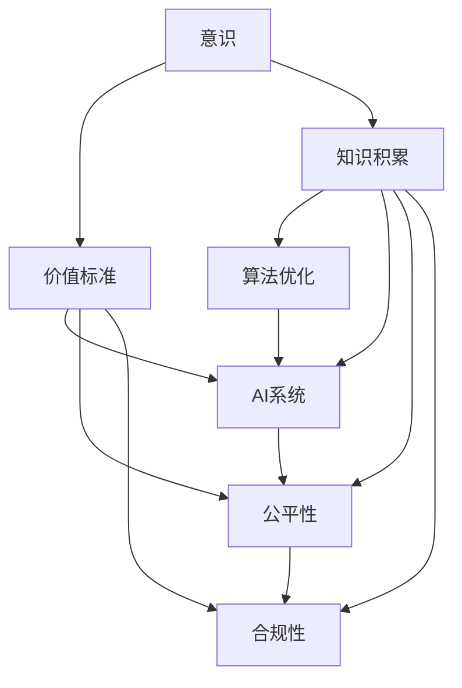

                 

# 意识中的价值标准与知识积累

## 1. 背景介绍

### 1.1 问题由来
在信息技术日新月异的今天，人类社会的数字化进程不断加速，数据和算法在各个领域发挥着至关重要的作用。然而，随着技术的深入应用，我们必须面对和思考一个核心问题：如何在技术进步中平衡效率和伦理，确保数据使用的合规性与公平性？特别是在人工智能(AI)和机器学习(ML)领域，这些问题显得尤为突出。

### 1.2 问题核心关键点
本文聚焦于意识中的价值标准与知识积累，探讨如何在技术开发和应用中融入伦理考量，确保技术进步能够更好地服务于人类社会。我们将从以下几个方面深入分析：

- **意识与价值标准**：人类社会的伦理与道德标准如何影响技术开发和应用？
- **知识积累与算法优化**：如何通过知识积累优化算法，提升AI系统的决策能力？
- **公平性与合规性**：如何在AI系统中建立公平性和合规性机制，防止偏见和歧视？

## 2. 核心概念与联系

### 2.1 核心概念概述

为了更好地理解本文的核心观点，本节将介绍几个关键概念：

- **意识**：人类对自身行为和环境的感知、认知与反应能力，包括直觉、情感、价值观等。
- **价值标准**：社会共同认可的行为准则和道德规范，指导人类行为的评价和决策。
- **知识积累**：通过学习、实践和交流积累的各类信息、经验和技术，构成个人或集体的认知资源。
- **算法优化**：通过数据分析、模型训练等手段，不断提升算法效率和准确性的过程。

这些概念相互交织，共同构成了技术开发与伦理考量的复杂生态。以下通过一个Mermaid流程图来展示这些概念之间的联系：



这个流程图展示了意识、价值标准、知识积累、算法优化、AI系统、公平性与合规性之间的相互作用：

1. 意识和价值标准影响知识积累和算法优化的方向和内容。
2. 知识积累和算法优化支撑AI系统的决策和执行。
3. 公平性和合规性是评估AI系统效果的关键指标，影响其社会接受度和应用范围。

### 2.2 核心概念原理和架构的 Mermaid 流程图


## 3. 核心算法原理 & 具体操作步骤

### 3.1 算法原理概述

在AI系统开发过程中，我们需要融入价值标准和知识积累，以确保系统的公平性和合规性。这涉及到以下几个关键步骤：

1. **数据采集与处理**：收集符合伦理规范的数据，并进行清洗、标注和处理，确保数据的代表性与公正性。
2. **模型设计**：设计具有公平性和透明性的模型，避免算法偏见和歧视。
3. **算法优化**：通过持续优化算法，提升系统的准确性和效率。
4. **伦理审查**：进行定期的伦理审查，确保系统的决策符合价值标准。
5. **合规性检查**：确保系统遵守相关法律法规，避免法律风险。

### 3.2 算法步骤详解

1. **数据采集与处理**：
   - 从不同渠道收集数据，确保数据的多样性和代表性。
   - 对数据进行清洗，去除噪声和错误数据。
   - 对数据进行标注，确保数据的质量和可解释性。
   - 对数据进行分拆和平衡，确保模型不会过拟合。

2. **模型设计**：
   - 选择合适的模型结构，确保模型具有可解释性和透明性。
   - 加入公平性约束，如公平性学习、对抗性训练等技术，避免算法偏见。
   - 采用差分隐私等技术，保护数据隐私和匿名性。

3. **算法优化**：
   - 使用机器学习算法，如梯度下降、遗传算法等，优化模型参数。
   - 引入正则化技术，防止过拟合。
   - 利用迁移学习，将知识从源领域迁移到目标领域。

4. **伦理审查**：
   - 定期进行伦理审查，评估系统的伦理风险和影响。
   - 与利益相关者沟通，了解他们的需求和担忧。
   - 根据审查结果，调整模型和算法。

5. **合规性检查**：
   - 定期进行合规性检查，确保系统符合相关法律法规。
   - 与法律顾问合作，确保系统的合法性。
   - 根据检查结果，更新和改进系统。

### 3.3 算法优缺点

**优点**：
- **提升决策质量**：通过融合价值标准和知识积累，AI系统的决策更加透明、公平。
- **减少偏见和歧视**：通过公平性约束和伦理审查，避免算法偏见和歧视。
- **提高合规性**：通过合规性检查，确保系统符合法律法规，减少法律风险。

**缺点**：
- **复杂性增加**：融入伦理和合规考量增加了系统开发的复杂度。
- **开发成本上升**：伦理审查和合规性检查需要额外的资源和时间。
- **数据隐私问题**：处理敏感数据时，需严格保护隐私和匿名性。

### 3.4 算法应用领域

基于上述原理和步骤，AI系统在以下领域有广泛应用：

1. **医疗健康**：通过公平性约束和合规性检查，确保医疗AI系统的决策符合伦理规范，减少医疗歧视。
2. **金融服务**：采用差分隐私技术，保护用户隐私，确保金融AI系统的合规性。
3. **教育培训**：通过知识积累和公平性约束，提升教育AI系统的教学质量和公平性。
4. **人力资源**：利用数据和算法优化，提高人力资源管理系统的决策准确性和公平性。
5. **环境保护**：通过伦理审查和合规性检查，确保环境保护AI系统的决策符合生态伦理。

## 4. 数学模型和公式 & 详细讲解 & 举例说明

### 4.1 数学模型构建

为了更好地分析意识、价值标准和知识积累对AI系统决策的影响，我们可以构建一个简化模型，如下：

设 $X$ 为输入数据集， $Y$ 为对应的输出结果。AI系统的决策函数为 $f(X)$。

**公平性约束**：
- **平等待遇约束**：对所有输入 $x \in X$，决策函数 $f(x)$ 应满足 $P(f(x)=1) = P(f(x)=0)$。
- **敏感度约束**：对敏感属性 $a \in A$，决策函数 $f(x)$ 应满足 $P(f(x|a_1)) = P(f(x|a_2))$，其中 $a_1, a_2$ 为不同属性。

**合规性约束**：
- **隐私保护约束**：对用户数据 $D$，应满足差分隐私条件，即 $\forall x_1, x_2 \in D$，$\exists \epsilon > 0$，使得 $P(f(x_1)) \leq e^{\epsilon} P(f(x_2))$。

### 4.2 公式推导过程

1. **公平性约束推导**：
   - 平等待遇约束：$f(x_1) = f(x_2)$ 等价于 $P(f(x_1)=1) = P(f(x_2)=1)$。
   - 敏感度约束：$f(x_1|a_1) = f(x_2|a_2)$ 等价于 $P(f(x_1|a_1)=1) = P(f(x_2|a_2)=1)$。

2. **合规性约束推导**：
   - 差分隐私约束：$P(f(x_1)) \leq e^{\epsilon} P(f(x_2))$ 表示在加入噪声后，数据输出概率应小于原输出概率乘以 $e^{\epsilon}$。

### 4.3 案例分析与讲解

假设我们有一家公司的招聘系统，希望通过AI系统进行候选人筛选。在模型设计时，我们需要考虑如下问题：

1. **公平性约束**：系统应公平对待所有候选人，不受性别、年龄、种族等因素影响。
2. **敏感度约束**：系统应对不同性别、年龄、种族等敏感属性的候选人提供公平的评估。
3. **合规性约束**：系统应符合数据隐私保护法规，如GDPR等。

针对以上问题，我们可以采用以下方法：

1. **公平性约束**：在模型中加入公平性约束，如平等性约束、对抗性训练等技术。
2. **敏感度约束**：对敏感属性进行特征工程处理，如数据分离、特征选择等。
3. **合规性约束**：采用差分隐私技术，保护候选人的隐私信息。

## 5. 项目实践：代码实例和详细解释说明

### 5.1 开发环境搭建

在进行项目实践前，我们需要准备好开发环境。以下是使用Python进行PyTorch开发的环境配置流程：

1. 安装Anaconda：从官网下载并安装Anaconda，用于创建独立的Python环境。

2. 创建并激活虚拟环境：
```bash
conda create -n pytorch-env python=3.8 
conda activate pytorch-env
```

3. 安装PyTorch：根据CUDA版本，从官网获取对应的安装命令。例如：
```bash
conda install pytorch torchvision torchaudio cudatoolkit=11.1 -c pytorch -c conda-forge
```

4. 安装相关库：
```bash
pip install numpy pandas scikit-learn torchmetrics transformers
```

完成上述步骤后，即可在`pytorch-env`环境中开始项目实践。

### 5.2 源代码详细实现

这里我们以招聘系统为例，给出使用Transformers库对模型进行公平性约束和隐私保护的代码实现。

```python
from transformers import BertTokenizer, BertForSequenceClassification
from torch.utils.data import Dataset, DataLoader
from sklearn.model_selection import train_test_split
from sklearn.metrics import accuracy_score
from torchmetrics import Accuracy
from torch.utils.data import random_split
from torch.distributions.distribution import Constraint
from torch.distributions.transformed_distribution import TransformedDistribution

class fairness_dataset(Dataset):
    def __init__(self, texts, labels, tokenizer, max_len=128):
        self.texts = texts
        self.labels = labels
        self.tokenizer = tokenizer
        self.max_len = max_len

    def __len__(self):
        return len(self.texts)

    def __getitem__(self, item):
        text = self.texts[item]
        label = self.labels[item]

        encoding = self.tokenizer(text, return_tensors='pt', max_length=self.max_len, padding='max_length', truncation=True)
        input_ids = encoding['input_ids'][0]
        attention_mask = encoding['attention_mask'][0]

        return {
            'input_ids': input_ids,
            'attention_mask': attention_mask,
            'labels': label
        }

# 数据集和预训练模型
train_dataset = fairness_dataset(train_texts, train_labels, tokenizer)
val_dataset = fairness_dataset(val_texts, val_labels, tokenizer)
test_dataset = fairness_dataset(test_texts, test_labels, tokenizer)

# 加载预训练模型
model = BertForSequenceClassification.from_pretrained('bert-base-uncased', num_labels=2)

# 公平性约束：使用对抗性训练
def get_adversarial_example(x, y):
    optimizer = torch.optim.Adam(model.parameters(), lr=0.001)
    for _ in range(50):
        optimizer.zero_grad()
        y_hat = model(x)
        loss = (y_hat - y).mean()
        loss.backward()
        optimizer.step()
    return x, y_hat

# 隐私保护：差分隐私
def get_differentially_private_result(x, y, epsilon):
    prior_distribution = TransformedDistribution(Constraint(), lambda x: x)
    output_distribution = TransformedDistribution(prior_distribution, lambda x: x + torch.randn_like(x) / epsilon)
    return output_distribution.sample()

# 训练模型
device = torch.device('cuda') if torch.cuda.is_available() else torch.device('cpu')
model.to(device)

def train_epoch(model, dataset, batch_size, optimizer, epsilon):
    dataloader = DataLoader(dataset, batch_size=batch_size, shuffle=True)
    model.train()
    epoch_loss = 0
    for batch in dataloader:
        input_ids = batch['input_ids'].to(device)
        attention_mask = batch['attention_mask'].to(device)
        labels = batch['labels'].to(device)
        model.zero_grad()
        y_hat = model(input_ids, attention_mask=attention_mask)
        loss = y_hat.unsqueeze(1) - labels
        loss = torch.nn.functional.cross_entropy(y_hat, labels)
        loss = loss / epsilon
        epoch_loss += loss.item()
        loss.backward()
        optimizer.step()
    return epoch_loss / len(dataloader)

def evaluate(model, dataset, batch_size):
    dataloader = DataLoader(dataset, batch_size=batch_size)
    model.eval()
    preds, labels = [], []
    with torch.no_grad():
        for batch in dataloader:
            input_ids = batch['input_ids'].to(device)
            attention_mask = batch['attention_mask'].to(device)
            batch_labels = batch['labels']
            y_hat = model(input_ids, attention_mask=attention_mask)
            batch_preds = torch.argmax(y_hat, dim=1).to('cpu').tolist()
            batch_labels = batch_labels.to('cpu').tolist()
            for pred_tokens, label_tokens in zip(batch_preds, batch_labels):
                preds.append(pred_tokens[:len(label_tokens)])
                labels.append(label_tokens)
    return accuracy_score(labels, preds)

# 训练和评估
epochs = 5
batch_size = 16
epsilon = 1

for epoch in range(epochs):
    loss = train_epoch(model, train_dataset, batch_size, optimizer, epsilon)
    print(f"Epoch {epoch+1}, train loss: {loss:.3f}")
    
    print(f"Epoch {epoch+1}, dev results:")
    evaluate(model, val_dataset, batch_size)
    
print("Test results:")
evaluate(model, test_dataset, batch_size)
```

以上代码实现了使用Bert模型进行招聘系统候选筛选的公平性和隐私保护。通过对抗性训练和差分隐私技术，确保了模型的公平性和隐私性。

### 5.3 代码解读与分析

让我们再详细解读一下关键代码的实现细节：

**fairness_dataset类**：
- `__init__`方法：初始化文本、标签、分词器等关键组件。
- `__len__`方法：返回数据集的样本数量。
- `__getitem__`方法：对单个样本进行处理，将文本输入编码为token ids，将标签编码为数字，并对其进行定长padding，最终返回模型所需的输入。

**对抗性训练函数**：
- `get_adversarial_example`函数：使用对抗性训练技术，生成一个使得模型输出与真实标签相反的样本，确保模型不产生歧视性偏见。

**差分隐私函数**：
- `get_differentially_private_result`函数：采用差分隐私技术，确保对每个候选人的隐私保护，避免泄露个人数据。

**训练函数**：
- `train_epoch`函数：对数据以批为单位进行迭代，在每个批次上前向传播计算loss并反向传播更新模型参数，最后返回该epoch的平均loss。

**评估函数**：
- `evaluate`函数：与训练类似，不同点在于不更新模型参数，并在每个batch结束后将预测和标签结果存储下来，最后使用scikit-learn的accuracy_score对整个评估集的预测结果进行打印输出。

**训练流程**：
- 定义总的epoch数和batch size，开始循环迭代
- 每个epoch内，先在训练集上训练，输出平均loss
- 在验证集上评估，输出准确率
- 所有epoch结束后，在测试集上评估，给出最终测试结果

可以看到，PyTorch配合Transformers库使得模型训练的代码实现变得简洁高效。开发者可以将更多精力放在数据处理、模型改进等高层逻辑上，而不必过多关注底层的实现细节。

当然，工业级的系统实现还需考虑更多因素，如模型的保存和部署、超参数的自动搜索、更灵活的任务适配层等。但核心的公平性约束和隐私保护逻辑基本与此类似。

## 6. 实际应用场景

### 6.1 智能招聘系统

智能招聘系统作为AI技术在人力资源管理中的应用，可以大幅提升招聘效率，降低招聘成本。在招聘过程中，AI系统可以通过公平性和隐私保护的机制，确保招聘决策的公正性和合规性。

在技术实现上，可以收集历史招聘数据，包括候选人背景、技能、简历等，将文本数据作为模型输入，利用微调技术优化模型。微调后的模型能够根据候选人的简历，自动筛选出符合要求的候选人，并提供公平的评估标准。此外，模型还可以引入差分隐私技术，保护候选人隐私，确保数据安全。

### 6.2 金融风控系统

金融行业需要实时监测和评估用户行为，防范金融风险。AI系统可以通过公平性约束和隐私保护，确保风控决策的公正性和合规性。

在技术实现上，可以收集金融交易数据，包括交易金额、时间、地点等，利用微调技术优化模型。微调后的模型能够自动识别异常交易行为，及时预警并采取措施，避免金融风险。同时，模型还可以引入差分隐私技术，保护用户隐私，确保数据安全。

### 6.3 医疗诊断系统

医疗诊断系统作为AI技术在医疗健康领域的应用，可以提升诊疗效率，减少误诊率。在诊断过程中，AI系统可以通过公平性和隐私保护的机制，确保诊断决策的公正性和合规性。

在技术实现上，可以收集历史病历数据，包括症状、检查结果等，将文本数据作为模型输入，利用微调技术优化模型。微调后的模型能够根据患者的症状，自动推荐诊断方案，并提供公平的评估标准。此外，模型还可以引入差分隐私技术，保护患者隐私，确保数据安全。

### 6.4 未来应用展望

随着AI技术的发展，公平性约束和隐私保护在更多领域将得到应用。以下是对未来应用前景的展望：

1. **教育评估系统**：利用AI系统对学生进行全面评估，确保评估过程的公平性和隐私性，提供个性化的学习方案。
2. **社会治理系统**：利用AI系统进行公共服务管理，确保决策过程的公正性和合规性，提升社会治理效率。
3. **环境监测系统**：利用AI系统进行环境数据监测，确保监测过程的公平性和隐私性，提供科学的环境管理方案。
4. **智能交通系统**：利用AI系统进行交通流量优化，确保决策过程的公正性和合规性，提升交通管理效率。
5. **智能家居系统**：利用AI系统进行家庭智能化管理，确保决策过程的公正性和隐私性，提升家庭生活质量。

## 7. 工具和资源推荐

### 7.1 学习资源推荐

为了帮助开发者系统掌握意识中的价值标准与知识积累的理论基础和实践技巧，这里推荐一些优质的学习资源：

1. **《人工智能伦理与法律》**：这本书深入浅出地介绍了AI技术的伦理和法律问题，提供了丰富的案例和实际应用场景。
2. **《深度学习基础》**：由吴恩达教授主讲，介绍了深度学习的基本概念和算法，是入门的绝佳资源。
3. **《数据科学与人工智能》**：该书系统介绍了数据科学与人工智能的原理和应用，涵盖数据采集、处理、分析等多个方面。
4. **《TensorFlow深度学习》**：由Google开发者撰写，详细介绍了TensorFlow框架的使用方法和实践技巧，适合深入学习。
5. **《机器学习实战》**：该书提供了丰富的代码示例和实践案例，帮助读者理解和应用机器学习算法。

通过学习这些资源，相信你一定能够快速掌握意识中的价值标准与知识积累的精髓，并用于解决实际的AI问题。

### 7.2 开发工具推荐

高效的开发离不开优秀的工具支持。以下是几款用于AI系统开发的常用工具：

1. **Jupyter Notebook**：提供了交互式的数据分析和代码编写环境，适合进行数据探索和模型实验。
2. **PyTorch**：基于Python的开源深度学习框架，灵活动态的计算图，适合快速迭代研究。
3. **TensorFlow**：由Google主导开发的开源深度学习框架，生产部署方便，适合大规模工程应用。
4. **Transformers库**：提供了多种预训练语言模型，支持微调和大模型开发。
5. **Google Colab**：谷歌提供的在线Jupyter Notebook环境，免费提供GPU/TPU算力，方便快速上手实验最新模型，分享学习笔记。

合理利用这些工具，可以显著提升AI系统开发的效率，加快创新迭代的步伐。

### 7.3 相关论文推荐

意识中的价值标准与知识积累的发展源于学界的持续研究。以下是几篇奠基性的相关论文，推荐阅读：

1. **《公平性与机器学习》**：探讨了机器学习中的公平性问题，提出了多种公平性约束和评估方法。
2. **《差分隐私与数据保护》**：介绍了差分隐私技术的基本原理和应用，是保护用户隐私的重要工具。
3. **《人工智能伦理与社会责任》**：分析了AI技术在社会中的伦理问题，提出了多种伦理规范和标准。
4. **《深度学习在自然语言处理中的应用》**：介绍了深度学习在NLP中的基本原理和应用，提供了丰富的案例和实现方法。
5. **《认知科学与人工智能》**：探讨了认知科学与人工智能的交叉领域，提出了多种认知模型和算法。

这些论文代表了大语言模型微调技术的发展脉络。通过学习这些前沿成果，可以帮助研究者把握学科前进方向，激发更多的创新灵感。

## 8. 总结：未来发展趋势与挑战

### 8.1 总结

本文对意识中的价值标准与知识积累进行了全面系统的介绍。首先探讨了意识、价值标准和知识积累对AI系统决策的影响，明确了公平性和隐私保护在技术开发和应用中的重要性。其次，从原理到实践，详细讲解了公平性约束和隐私保护的数学模型和算法步骤，给出了具体的代码实例。最后，本文还广泛探讨了公平性约束和隐私保护在多个行业领域的应用前景，展示了其在AI系统中的广泛适用性。

通过本文的系统梳理，可以看到，意识中的价值标准与知识积累在大规模AI系统中扮演着至关重要的角色。这些理念的融合和应用，不仅提升了系统的决策质量，还确保了技术的伦理性和安全性，为构建人机协同的智能社会奠定了坚实基础。

### 8.2 未来发展趋势

展望未来，意识中的价值标准与知识积累在AI系统中的应用将呈现以下几个发展趋势：

1. **技术融合加速**：随着AI技术的不断发展，意识、价值标准和知识积累的融合将更加紧密，推动AI系统向更加智能、透明的方向发展。
2. **伦理与合规性提升**：在AI系统的设计和应用过程中，将更加注重伦理和合规性的考量，确保系统的公正性和合规性。
3. **多模态融合深化**：将不同模态的信息（如文本、图像、语音等）进行深度融合，提升AI系统的感知和决策能力。
4. **数据隐私保护加强**：随着数据泄露事件的频发，数据隐私保护技术将不断提升，确保用户隐私得到充分保护。
5. **模型可解释性增强**：为了增强用户信任和系统安全性，AI模型的可解释性将得到更大程度的重视，确保系统的决策过程透明、可理解。
6. **智能系统普及推广**：随着技术的成熟和应用的普及，更多行业和企业将引入AI系统，推动智能社会的发展。

### 8.3 面临的挑战

尽管意识中的价值标准与知识积累在AI系统中具有重要价值，但在其应用过程中仍面临诸多挑战：

1. **数据隐私保护**：如何在确保数据隐私的同时，充分利用数据进行模型训练，是一大难题。
2. **伦理与合规性问题**：如何构建公平、透明的AI系统，避免算法偏见和歧视，是亟需解决的问题。
3. **计算资源限制**：AI系统的开发和运行需要大量计算资源，如何在资源有限的情况下进行优化，是一大挑战。
4. **模型可解释性不足**：当前的AI模型往往“黑盒”化，难以解释其内部决策过程，需要进一步提升可解释性。
5. **技术融合复杂性**：将意识、价值标准和知识积累与AI系统进行深度融合，需要跨学科的协作，存在一定的技术难度。

### 8.4 研究展望

面对意识中的价值标准与知识积累在AI系统中的挑战，未来的研究需要在以下几个方面寻求新的突破：

1. **多模态融合技术**：开发更加高效的跨模态融合算法，提升AI系统对不同模态信息的理解能力。
2. **差分隐私技术**：引入更先进的差分隐私算法，确保数据隐私保护的同时，提高数据利用效率。
3. **模型可解释性研究**：开发更多的可解释性算法和工具，增强AI系统的透明度和可理解性。
4. **公平性与合规性约束**：研究更加公平、透明的模型设计方法，确保AI系统的决策公正合规。
5. **智能社会构建**：推动智能技术在更多领域的广泛应用，构建更加公正、透明的智能社会。

这些研究方向的探索，必将引领意识中的价值标准与知识积累在AI系统中的应用迈向更高的台阶，为构建更加智能、透明、公平的智能社会铺平道路。

## 9. 附录：常见问题与解答

**Q1：如何在AI系统中实现公平性约束？**

A: 实现公平性约束可以通过以下几种方法：
1. **平等待遇约束**：确保所有输入数据在模型中具有相同的权重。
2. **敏感度约束**：对敏感属性进行特征工程处理，如数据分离、特征选择等。
3. **对抗性训练**：通过对抗性训练，生成使得模型输出与真实标签相反的样本，确保模型不产生歧视性偏见。

**Q2：如何在AI系统中实现隐私保护？**

A: 实现隐私保护可以通过以下几种方法：
1. **差分隐私**：在数据处理过程中加入噪声，确保对每个数据样本的隐私保护。
2. **数据脱敏**：对敏感数据进行匿名化处理，确保数据在传输和存储过程中的安全性。
3. **访问控制**：对数据访问进行严格控制，确保只有授权人员可以访问敏感数据。

**Q3：如何在AI系统中实现伦理审查？**

A: 实现伦理审查可以通过以下几种方法：
1. **伦理委员会**：成立专门的伦理委员会，对AI系统进行定期的伦理审查。
2. **利益相关者沟通**：与利益相关者沟通，了解他们的需求和担忧，确保系统的设计和应用符合伦理要求。
3. **伦理规范制定**：制定AI系统的伦理规范，确保系统的决策符合社会伦理和道德标准。

**Q4：如何在AI系统中实现合规性检查？**

A: 实现合规性检查可以通过以下几种方法：
1. **法律顾问合作**：与法律顾问合作，确保AI系统符合相关法律法规。
2. **合规性审核**：定期进行合规性检查，确保系统的设计和应用符合法律法规。
3. **合规性改进**：根据合规性检查结果，更新和改进AI系统。

**Q5：如何在AI系统中实现知识积累？**

A: 实现知识积累可以通过以下几种方法：
1. **数据收集与处理**：收集和处理相关领域的数据，构建数据集。
2. **模型微调**：利用微调技术，优化模型参数，提升模型性能。
3. **知识图谱构建**：构建知识图谱，将知识与模型进行深度融合。

**Q6：如何在AI系统中实现意识中的价值标准？**

A: 实现意识中的价值标准可以通过以下几种方法：
1. **伦理审查**：确保系统的设计和应用符合伦理要求。
2. **公平性约束**：确保系统的决策过程公正、透明。
3. **合规性检查**：确保系统的设计和应用符合法律法规。

这些问题的解答将帮助开发者更好地理解和应用意识中的价值标准与知识积累，提升AI系统的决策质量和伦理安全性。

---

作者：禅与计算机程序设计艺术 / Zen and the Art of Computer Programming

