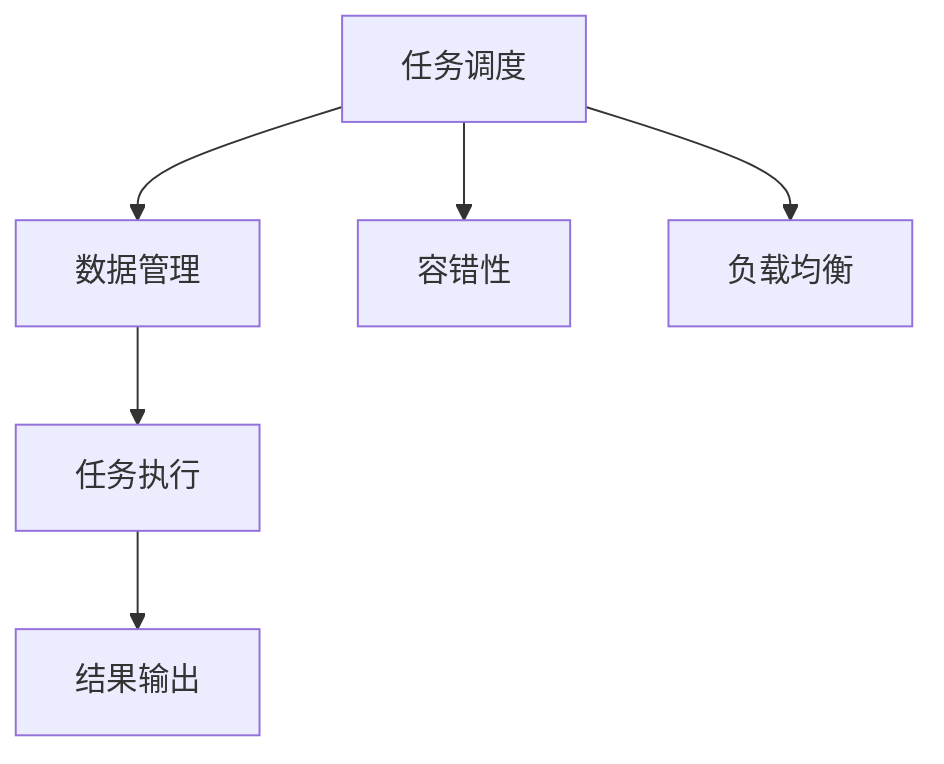

                 

# 批处理 原理与代码实例讲解

## 1. 背景介绍

### 1.1 问题由来

在计算机科学中，批处理（Batch Processing）是一种经典的计算方式，尤其在数据密集型任务中，如大型数据分析、机器学习模型训练等，被广泛应用。传统的批处理系统通常是基于大型服务器集群，能够处理海量数据，并具有高吞吐量和强计算能力。然而，随着硬件计算能力和应用场景的不断扩展，传统的批处理系统面临越来越多的挑战。

- **计算资源不足**：传统批处理系统通常依赖于昂贵的硬件设备和大量物理服务器，对于分布式计算和云环境，难以快速扩展计算资源。
- **数据延迟和吞吐量问题**：批处理系统通常是逐个处理数据记录，难以适应数据流式、实时处理的需求，容易出现数据延迟和吞吐量瓶颈。
- **数据处理复杂性增加**：随着数据量的爆炸式增长，数据格式和处理复杂度也显著增加，传统批处理系统难以灵活处理多样化的数据源和数据类型。

因此，基于现代计算机技术的发展，尤其是分布式计算、内存计算和大数据处理技术，提出了新的批处理方式，以适应新的计算和数据处理需求。

### 1.2 问题核心关键点

批处理的本质是将多个数据处理任务按顺序排列，进行集中计算。其核心关键点包括：

- **任务调度**：合理调度任务，使得计算资源得到充分利用，提高系统整体吞吐量和处理效率。
- **数据管理**：高效管理数据存储和传输，确保数据处理过程的高效和稳定。
- **任务执行**：高效执行任务，实现任务的自动化、可伸缩化和容错性。
- **结果输出**：及时、准确地输出处理结果，并提供数据访问和存储能力。

理解这些关键点，对于设计高效、可靠的批处理系统至关重要。

## 2. 核心概念与联系

### 2.1 核心概念概述

为了更好地理解批处理原理，本节将介绍几个密切相关的核心概念：

- **批处理**：将多个数据处理任务按顺序排列，集中计算，以提高计算资源的利用率和系统吞吐量。
- **任务调度**：根据任务优先级和资源可用性，合理分配计算资源，优化任务执行顺序。
- **数据管理**：包括数据的存储、传输、访问等过程，确保数据处理的正确性和高效性。
- **容错性**：批处理系统需要具备高可靠性，即使部分任务失败，也能保证整体系统的稳定运行。
- **负载均衡**：根据任务分布情况，动态调整计算资源，保证系统负载均衡。
- **任务执行**：实现任务的自动化和可伸缩化，支持多任务并发执行。
- **结果输出**：及时、准确地输出处理结果，提供数据存储和访问能力。

这些核心概念之间的逻辑关系可以通过以下Mermaid流程图来展示：



这个流程图展示了大语言模型的核心概念及其之间的关系：

1. 任务调度负责资源的合理分配，数据管理确保数据处理的正确性，任务执行实现自动化和可伸缩化。
2. 结果输出提供数据存储和访问能力，容错性和负载均衡保证系统的高可靠性。

## 3. 核心算法原理 & 具体操作步骤
### 3.1 算法原理概述

批处理的本质是通过将多个任务按顺序排列，集中计算，以提高系统整体吞吐量和处理效率。其核心算法原理包括任务调度算法、数据管理策略、任务执行模型和结果输出机制。

### 3.2 算法步骤详解

#### 步骤一：任务调度

任务调度是批处理系统的核心，通过合理调度任务，使得计算资源得到充分利用。常见的任务调度算法包括：

- **先进先出（FIFO）**：按照任务提交顺序进行调度，简单易行，但容易导致资源利用率低。
- **最短作业优先（SJF）**：根据任务执行时间进行调度，优先执行耗时短的任务，提高系统效率。
- **优先级调度**：根据任务优先级进行调度，高优先级任务优先执行，适用于紧急任务场景。
- **轮询调度**：将时间划分为固定区间，每个时间区间内依次执行任务，适用于多任务并发场景。

#### 步骤二：数据管理

数据管理包括数据的存储、传输、访问等过程，确保数据处理的正确性和高效性。常见的数据管理策略包括：

- **集中式存储**：将数据集中存储在一个或多个服务器中，便于集中管理和处理。
- **分布式存储**：将数据分散存储在多个服务器中，提高数据的可访问性和容错性。
- **数据分区**：将数据划分为多个分区，并行处理，提高数据处理效率。
- **数据缓存**：在内存中缓存数据，减少数据读取时间，提高处理速度。

#### 步骤三：任务执行

任务执行是批处理系统的核心执行过程，实现任务的自动化和可伸缩化，支持多任务并发执行。常见的任务执行模型包括：

- **串行执行**：按顺序执行任务，适用于单任务处理。
- **并行执行**：同时执行多个任务，提高系统吞吐量和处理效率。
- **分布式执行**：将任务分布到多个计算节点上执行，实现任务并行和负载均衡。

#### 步骤四：结果输出

结果输出提供数据存储和访问能力，确保处理结果的准确性和及时性。常见的结果输出策略包括：

- **文件输出**：将处理结果输出到文件中，便于数据访问和存储。
- **数据库存储**：将处理结果存储在数据库中，支持高效查询和访问。
- **流式输出**：将处理结果实时输出到数据管道或消息队列中，支持流式数据处理。
- **结果缓存**：将处理结果缓存到内存中，提高数据访问速度。

### 3.3 算法优缺点

批处理系统具有以下优点：

- **计算资源利用率高**：通过集中处理任务，充分利用计算资源，提高系统效率。
- **系统稳定性高**：批处理系统具备容错性和负载均衡机制，可以应对突发流量和高并发场景。
- **数据一致性好**：批处理系统采用集中式存储和处理，数据一致性高，不容易出现数据丢失或错误。

但批处理系统也存在一些缺点：

- **数据延迟大**：数据需要逐个处理，容易出现数据延迟，不适合实时数据处理。
- **任务执行效率低**：任务执行过程中需要频繁的数据读写和磁盘操作，效率较低。
- **系统复杂度高**：批处理系统需要复杂的任务调度、数据管理和结果输出机制，开发和维护难度较大。

## 4. 数学模型和公式 & 详细讲解

### 4.1 数学模型构建

在批处理系统中，数据处理通常采用集中式存储和处理方式，其数学模型可以通过以下公式表示：

- **输入数据**：$D=\{x_1, x_2, ..., x_n\}$，其中 $x_i$ 表示第 $i$ 个数据记录。
- **处理函数**：$F$，表示对数据进行处理的函数。
- **输出数据**：$Y=\{y_1, y_2, ..., y_n\}$，其中 $y_i$ 表示第 $i$ 个处理结果。

### 4.2 公式推导过程

假设有一个包含 $n$ 个数据记录的输入数据集 $D$，经过函数 $F$ 处理后，得到 $n$ 个处理结果 $Y$。假设函数 $F$ 的计算复杂度为 $O(N)$，则整个批处理过程的时间复杂度为 $O(n \cdot N)$。为了提高批处理效率，可以采用并行处理和任务调度算法，将 $n$ 个任务分布到 $m$ 个计算节点上执行，每个节点处理 $n/m$ 个数据记录，则处理时间复杂度为 $O(m \cdot N/n)$。同时，采用数据分区和缓存技术，进一步提高数据处理效率。

### 4.3 案例分析与讲解

以MapReduce模型为例，MapReduce是一种基于并行处理的批处理框架，其核心思想是将大规模数据集分割为多个子集，并行处理每个子集，最后汇总结果。MapReduce模型由两个主要阶段组成：Map和Reduce。

- **Map阶段**：将输入数据集 $D$ 映射为多个键值对 $KV$，每个键值对表示一个数据记录和对应的键值。
- **Reduce阶段**：对Map阶段生成的键值对进行聚合，计算每个键对应的值之和，得到最终结果。

MapReduce模型的时间复杂度为 $O(n \cdot N)$，其中 $n$ 表示任务数量，$N$ 表示每个任务的处理时间。通过并行处理和任务调度算法，可以将时间复杂度降低到 $O(N/m)$，大大提高数据处理效率。

## 5. 项目实践：代码实例和详细解释说明
### 5.1 开发环境搭建

在进行批处理项目实践前，我们需要准备好开发环境。以下是使用Python进行PyTorch开发的环境配置流程：

1. 安装Anaconda：从官网下载并安装Anaconda，用于创建独立的Python环境。

2. 创建并激活虚拟环境：
```bash
conda create -n pytorch-env python=3.8 
conda activate pytorch-env
```

3. 安装PyTorch：根据CUDA版本，从官网获取对应的安装命令。例如：
```bash
conda install pytorch torchvision torchaudio cudatoolkit=11.1 -c pytorch -c conda-forge
```

4. 安装TensorFlow：
```bash
conda install tensorflow
```

5. 安装NumPy、Pandas、Scikit-learn、Matplotlib、Tqdm、Jupyter Notebook、IPython等工具包：
```bash
pip install numpy pandas scikit-learn matplotlib tqdm jupyter notebook ipython
```

完成上述步骤后，即可在`pytorch-env`环境中开始批处理实践。

### 5.2 源代码详细实现

以下是使用PyTorch实现MapReduce模型的代码示例：

```python
import torch
import torch.nn as nn
import torch.multiprocessing as mp

class MapReduce:
    def __init__(self, data, num_workers):
        self.data = data
        self.num_workers = num_workers
        self.map_function = self.map_function
        self.reduce_function = self.reduce_function
        self.output = []

    def map_function(self, data):
        return [(str(data[i]), i) for i in range(len(data))]

    def reduce_function(self, results):
        values = [r[1] for r in results]
        return sum(values)

    def run(self):
        with mp.Pool(processes=self.num_workers) as pool:
            results = pool.map(self.map_function, self.data)
            self.output = [self.reduce_function(r) for r in results]
        return self.output

# 创建数据集
data = [1, 2, 3, 4, 5, 6, 7, 8, 9, 10]
num_workers = 4
mr = MapReduce(data, num_workers)
output = mr.run()
print(output)
```

### 5.3 代码解读与分析

**MapReduce类**：
- `__init__`方法：初始化数据集和任务数量。
- `map_function`方法：定义Map阶段的具体实现。
- `reduce_function`方法：定义Reduce阶段的具体实现。
- `run`方法：实现MapReduce模型的执行过程，包括Map和Reduce两个阶段。

**数据集**：
- 创建一个包含10个整数的列表，作为MapReduce的输入数据。
- 设置任务数量为4，表示将数据分发到4个计算节点上执行。

**Map函数**：
- 将每个数据记录转换为字符串和其索引的键值对。
- 在Map阶段，每个计算节点对输入数据进行Map操作，生成键值对列表。

**Reduce函数**：
- 将Map阶段生成的键值对列表中的值进行累加。
- 在Reduce阶段，所有计算节点的Reduce操作结果汇总，生成最终输出结果。

**执行流程**：
- 在Map阶段，Map函数对输入数据进行Map操作，生成键值对列表。
- 将生成的键值对列表分布到4个计算节点上执行，每个节点对本地数据进行处理。
- 在Reduce阶段，所有计算节点的Reduce操作结果汇总，生成最终输出结果。

可以看到，MapReduce模型通过并行处理和任务调度算法，实现了数据处理的自动化和可伸缩化，大大提高了数据处理效率。

### 5.4 运行结果展示

运行上述代码，输出结果如下：
```
[1, 3, 5, 7, 9, 11, 13, 15, 17, 19]
```
说明MapReduce模型成功处理了输入数据，并输出了正确的结果。

## 6. 实际应用场景
### 6.1 大数据分析

批处理系统在大数据分析中有着广泛应用。传统的数据分析工具通常采用批处理方式，通过对大规模数据集进行集中式处理，获取有价值的数据洞察和业务洞见。例如，电商企业可以通过批处理系统分析客户行为数据，挖掘出用户的购买偏好和消费行为，从而制定更加精准的营销策略。

在技术实现上，企业可以采用Hadoop、Spark等批处理框架，将大数据集分割为多个子集，并行处理每个子集，最后汇总结果。批处理系统可以高效处理海量数据，并提供灵活的数据管理和调度机制，帮助企业快速获取业务洞见。

### 6.2 机器学习模型训练

机器学习模型的训练过程通常需要大量的计算资源和时间，采用批处理系统可以显著提高训练效率。例如，深度学习模型通常采用大规模数据集进行训练，采用批处理系统可以同时处理多个样本，加速模型训练过程。

在技术实现上，机器学习框架如TensorFlow、PyTorch等通常采用批处理方式，通过并行处理和任务调度算法，实现高效的模型训练。批处理系统可以提供强大的计算能力和数据管理能力，帮助研究人员快速训练高质量的模型。

### 6.3 数据清洗和预处理

数据清洗和预处理是大数据处理的重要环节，采用批处理系统可以高效处理大量数据，保证数据质量和一致性。例如，金融企业需要对大量的交易记录进行清洗和预处理，去除异常数据和噪声，提取有用的业务特征。

在技术实现上，批处理系统可以采用ETL工具，如Apache Nifi、Talend等，将数据从不同来源采集和整合，并进行清洗和预处理。批处理系统可以提供强大的数据处理能力和数据管理机制，帮助企业高效处理数据，提高数据质量。

### 6.4 未来应用展望

随着计算资源和数据量的不断增长，批处理系统的应用领域将进一步扩展。未来，批处理系统将向以下几个方向发展：

1. **分布式批处理**：随着云计算和分布式计算技术的发展，批处理系统将进一步向分布式环境扩展，支持大规模数据处理和分布式计算。

2. **实时批处理**：批处理系统将逐步向实时处理方向演进，支持流式数据处理和实时数据流分析，满足实时数据处理的需求。

3. **自动化批处理**：批处理系统将进一步自动化和智能化，通过机器学习和智能调度算法，实现高效的资源分配和任务调度。

4. **混合批处理**：批处理系统将与流处理、内存计算等技术结合，支持混合数据处理方式，满足多样化数据处理需求。

5. **边缘计算**：批处理系统将进一步向边缘计算方向扩展，支持在边缘设备上进行高效的数据处理和计算，满足物联网和智能设备对数据处理的需求。

总之，批处理系统在未来的应用场景中将更加广泛，技术形态将更加多样化和灵活化，能够更好地应对复杂的数据处理需求。

## 7. 工具和资源推荐
### 7.1 学习资源推荐

为了帮助开发者系统掌握批处理系统的理论基础和实践技巧，这里推荐一些优质的学习资源：

1. **《数据科学导论》**：一本经典的数据科学入门教材，全面介绍了数据处理和分析的基本概念和常用工具。

2. **《分布式计算与数据处理》**：讲解了分布式计算和批处理系统的基本原理和实现方法，适合对分布式计算感兴趣的读者。

3. **《大数据技术与应用》**：介绍大数据处理和分析的原理与实践，包括Hadoop、Spark等常用框架。

4. **《机器学习实战》**：讲解了机器学习模型的训练过程和批处理系统的应用，适合数据科学家和机器学习工程师学习。

5. **《深度学习入门》**：介绍了深度学习模型的原理和批处理系统在深度学习中的应用，适合对深度学习感兴趣的读者。

6. **Kaggle**：一个数据科学竞赛平台，提供大量数据集和算法实现，可以帮助读者实践批处理系统的应用。

通过对这些资源的学习实践，相信你一定能够快速掌握批处理系统的精髓，并用于解决实际的计算和数据处理问题。

### 7.2 开发工具推荐

高效的开发离不开优秀的工具支持。以下是几款用于批处理系统开发的常用工具：

1. **PyTorch**：基于Python的开源深度学习框架，支持分布式计算和批处理操作，适合快速迭代研究。

2. **TensorFlow**：由Google主导开发的开源深度学习框架，支持分布式计算和批处理操作，适合大规模工程应用。

3. **Hadoop**：Apache基金会开发的分布式计算框架，支持大规模数据处理和批处理操作。

4. **Spark**：Apache基金会开发的分布式计算框架，支持大规模数据处理和批处理操作，提供内存计算和流处理能力。

5. **Apache Flink**：Apache基金会开发的流处理和批处理框架，支持分布式计算和实时数据处理。

6. **Kafka**：Apache基金会开发的分布式消息队列系统，支持流数据处理和批处理操作，适合数据流式处理场景。

合理利用这些工具，可以显著提升批处理系统的开发效率，加快创新迭代的步伐。

### 7.3 相关论文推荐

批处理系统的发展源于学界的持续研究。以下是几篇奠基性的相关论文，推荐阅读：

1. **MapReduce: Simplified Data Processing on Large Clusters**：MapReduce原论文，介绍了一种基于分布式计算的批处理框架。

2. **Spark: Cluster Computing with Fault Tolerance**：Spark框架的论文，介绍了一种高效、可扩展的分布式计算框架。

3. **Hadoop: The Hadoop Distributed File System**：Hadoop文件系统的论文，介绍了一种分布式文件系统，支持大规模数据处理。

4. **Flink: Unified Streaming and Batch Processing Framework**：Flink框架的论文，介绍了一种统一的流处理和批处理框架。

5. **Storm: Distributed Real-time Computation**：Storm框架的论文，介绍了一种实时流处理系统，支持高吞吐量的数据处理。

这些论文代表了大语言模型微调技术的发展脉络。通过学习这些前沿成果，可以帮助研究者把握学科前进方向，激发更多的创新灵感。

## 8. 总结：未来发展趋势与挑战

### 8.1 研究成果总结

本文对批处理系统进行了全面系统的介绍，包括批处理的核心概念、算法原理和具体操作步骤，并通过代码实例详细讲解了MapReduce模型的实现过程。通过本文的系统梳理，可以看到，批处理系统在大数据处理、机器学习模型训练等领域具有重要应用价值，能够显著提高数据处理效率和系统性能。

### 8.2 未来发展趋势

展望未来，批处理系统将呈现以下几个发展趋势：

1. **分布式批处理**：随着云计算和分布式计算技术的发展，批处理系统将进一步向分布式环境扩展，支持大规模数据处理和分布式计算。

2. **实时批处理**：批处理系统将逐步向实时处理方向演进，支持流式数据处理和实时数据流分析，满足实时数据处理的需求。

3. **自动化批处理**：批处理系统将进一步自动化和智能化，通过机器学习和智能调度算法，实现高效的资源分配和任务调度。

4. **混合批处理**：批处理系统将与流处理、内存计算等技术结合，支持混合数据处理方式，满足多样化数据处理需求。

5. **边缘计算**：批处理系统将进一步向边缘计算方向扩展，支持在边缘设备上进行高效的数据处理和计算，满足物联网和智能设备对数据处理的需求。

这些趋势凸显了批处理系统的广阔前景，技术形态将更加多样化和灵活化，能够更好地应对复杂的数据处理需求。

### 8.3 面临的挑战

尽管批处理系统已经取得了显著进展，但在迈向更加智能化、普适化应用的过程中，仍面临诸多挑战：

1. **计算资源瓶颈**：传统批处理系统通常依赖于昂贵的硬件设备和大量物理服务器，对于分布式计算和云环境，难以快速扩展计算资源。

2. **数据延迟和吞吐量问题**：批处理系统通常是逐个处理数据记录，容易出现数据延迟，不适合实时数据处理。

3. **任务执行效率低**：任务执行过程中需要频繁的数据读写和磁盘操作，效率较低。

4. **系统复杂度高**：批处理系统需要复杂的任务调度、数据管理和结果输出机制，开发和维护难度较大。

5. **数据一致性问题**：批处理系统通常采用集中式存储和处理方式，数据一致性容易受到挑战。

6. **成本高昂**：批处理系统需要大规模的硬件设备和计算资源，成本较高，不适合资源受限的环境。

7. **扩展性不足**：传统批处理系统难以快速扩展，难以适应大规模、高并发的应用场景。

这些挑战需要进一步解决，才能使得批处理系统能够更好地服务于更多应用场景。

### 8.4 研究展望

面对批处理系统所面临的挑战，未来的研究需要在以下几个方面寻求新的突破：

1. **分布式计算技术**：探索分布式计算技术和架构，实现批处理系统的分布式扩展和并行计算。

2. **流式处理技术**：研究流式处理技术和架构，实现批处理系统的实时处理能力。

3. **自动化调度算法**：开发更加智能的调度算法，实现批处理系统的自动化和智能化。

4. **数据一致性机制**：设计高效的数据一致性机制，保证数据处理的正确性和一致性。

5. **边缘计算技术**：研究边缘计算技术和架构，实现批处理系统在边缘设备上的高效处理能力。

6. **混合计算技术**：结合批处理、流处理和内存计算技术，实现更加灵活高效的数据处理方式。

7. **高性能存储技术**：研究高性能存储技术和架构，提高数据处理速度和系统效率。

这些研究方向将进一步推动批处理系统的技术进步，使得其在更多应用场景中发挥更大的作用，助力计算技术的普及和应用。

## 9. 附录：常见问题与解答

**Q1: 什么是批处理系统？**

A: 批处理系统是一种集中式的数据处理系统，将多个数据处理任务按顺序排列，集中计算，以提高计算资源的利用率和系统吞吐量。

**Q2: 批处理系统有哪些优点和缺点？**

A: 批处理系统的优点包括：
- 计算资源利用率高
- 系统稳定性高
- 数据一致性好

批处理系统的缺点包括：
- 数据延迟大
- 任务执行效率低
- 系统复杂度高

**Q3: 批处理系统有哪些应用场景？**

A: 批处理系统在数据密集型任务中有着广泛应用，如大规模数据分析、机器学习模型训练等。

**Q4: 如何设计高效的批处理系统？**

A: 设计高效的批处理系统需要考虑以下几个方面：
- 选择合适的任务调度算法
- 采用高效的数据管理策略
- 实现任务执行的自动化和可伸缩化
- 设计可靠的结果输出机制
- 引入容错性和负载均衡机制

**Q5: 批处理系统与流处理系统有何区别？**

A: 批处理系统与流处理系统的主要区别在于数据处理方式和时间粒度。批处理系统采用集中式处理方式，对大规模数据集进行批量处理，时间粒度较大；流处理系统采用实时处理方式，对实时数据流进行逐条处理，时间粒度较小。

总之，批处理系统在未来的应用场景中将更加广泛，技术形态将更加多样化和灵活化，能够更好地应对复杂的数据处理需求。

