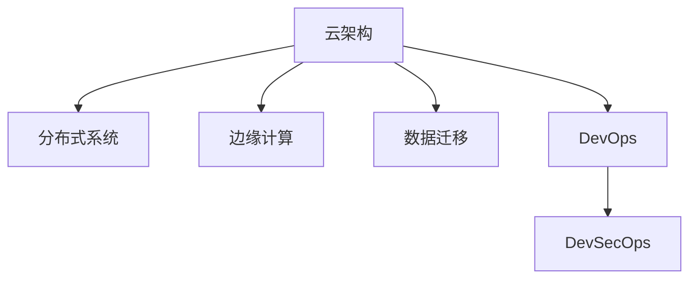

                 

# 技术分享：从线下到线上的转变

> 关键词：云架构,分布式系统,边缘计算,数据迁移,微服务,DevOps,DevSecOps

## 1. 背景介绍

### 1.1 问题由来

随着互联网技术的发展，越来越多的业务从线下转移到线上。这种转变不仅提升了企业的运营效率，也带来了新的挑战。企业必须面对如何设计高效、可靠、安全的云架构，如何在分布式系统中实现无缝的数据迁移，以及如何在边缘计算环境中优化业务流程等问题。

### 1.2 问题核心关键点

当前，云计算和分布式系统正在深刻改变着企业的运营模式。然而，这种转变也带来了新的技术挑战，包括但不限于：

- 如何高效利用云资源，构建稳定、可扩展的云架构？
- 如何在分布式系统中实现数据的无缝迁移和跨区域访问？
- 如何利用边缘计算优化业务流程，提升用户体验？
- 如何整合DevOps和DevSecOps，提升软件的持续交付能力？

这些关键问题亟需系统性的解决方案，以便在保证系统可靠性的同时，提升业务效率和用户体验。

### 1.3 问题研究意义

研究从线下到线上的转变技术，对于提升企业的数字化转型速度，增强企业的市场竞争力，具有重要意义：

1. **提升运营效率**：通过线上化，企业可以大幅降低运营成本，提升业务响应速度，缩短决策周期。
2. **增强用户体验**：线上化带来更加便捷、高效的用户体验，如实时在线客服、个性化推荐等，提升用户满意度和忠诚度。
3. **实现全球运营**：云架构使企业能够跨越地理和时区的限制，实现全球化和本地化服务的无缝集成。
4. **应对不确定性**：线上化能够更好地应对市场变化和不确定性，为企业提供更大的灵活性和应对空间。
5. **驱动技术创新**：线上化推动了云计算、分布式系统、边缘计算等前沿技术的发展，为企业的数字化转型提供了技术保障。

本文将从云架构、数据迁移、边缘计算、DevOps和DevSecOps等多个角度，系统性地探讨如何实现从线下到线上的转变，为企业的数字化转型提供技术指导。

## 2. 核心概念与联系

### 2.1 核心概念概述

为更好地理解从线下到线上的转变技术，本节将介绍几个密切相关的核心概念：

- **云架构(Cloud Architecture)**：指利用云平台资源，构建的可扩展、高可用、高弹性的应用系统。包括云计算、分布式系统、微服务等关键技术。
- **分布式系统(Distributed System)**：由多个独立节点组成的系统，通过网络协议实现协同工作，提升系统性能和可用性。
- **边缘计算(Edge Computing)**：指将计算和数据处理靠近用户端进行，以减少延迟，提升响应速度和数据隐私性。
- **数据迁移(Data Migration)**：指将数据从一个系统迁移到另一个系统，包括数据迁移策略、工具和最佳实践。
- **DevOps(Development Operations)**：一种软件开发和运维的实践模式，旨在提升软件交付速度和质量，通过持续集成、持续部署等手段实现。
- **DevSecOps(DevSecOps)**：DevOps与信息安全的深度融合，旨在提升软件的开发、运维和安全的协同效率。

这些核心概念之间的逻辑关系可以通过以下Mermaid流程图来展示：



这个流程图展示了一系列核心概念及其之间的关系：

1. 云架构是构建分布式系统和边缘计算的基础。
2. 分布式系统是云架构的重要组成部分，通过协同工作提升系统性能和可用性。
3. 边缘计算利用分布式系统，将计算和数据处理靠近用户端，提升用户体验。
4. DevOps和DevSecOps是云架构应用的最佳实践，通过持续交付和信息安全保障，提升软件质量。

这些概念共同构成了从线下到线上的转变技术框架，使得企业能够高效、可靠地实现数字化转型。

## 3. 核心算法原理 & 具体操作步骤

### 3.1 算法原理概述

从线下到线上的转变，本质上是一个多层次、多维度、多技术融合的复杂过程。它涉及云架构的设计、分布式系统的构建、边缘计算的优化、数据迁移的实现以及DevOps和DevSecOps的整合。以下将从这些关键点出发，系统性地探讨其原理和操作步骤。

### 3.2 算法步骤详解

#### 3.2.1 云架构设计

云架构设计是实现从线下到线上的关键。以下是云架构设计的主要步骤：

1. **选择合适的云服务**：根据企业需求，选择合适的云服务提供商（如AWS、Azure、Google Cloud等），确保其具有高可用性、高扩展性和高安全性。
2. **设计系统架构**：根据业务需求，设计系统的层次结构，包括应用层、数据层、服务层等。
3. **选择技术栈**：根据需求选择合适的技术栈，如容器化技术（如Docker、Kubernetes）、微服务架构（如Spring Boot、Dubbo）、数据库（如MySQL、MongoDB）等。
4. **实现负载均衡**：通过负载均衡技术（如Nginx、HAProxy），实现服务的高可用性和扩展性。
5. **实现自动伸缩**：通过自动伸缩技术（如AWS Auto Scaling、Azure Scale Sets），实现资源的动态调整和优化。
6. **实现安全防护**：通过身份认证、访问控制、网络隔离等安全措施，保障系统的安全性和隐私性。

#### 3.2.2 分布式系统构建

分布式系统是云架构的核心。以下是分布式系统构建的主要步骤：

1. **选择合适的分布式协议**：根据需求选择合适的分布式协议，如P2P、中心化、分层等。
2. **设计分布式架构**：根据业务需求，设计系统的分布式架构，包括节点选择、通信协议、数据同步等。
3. **实现高可用性**：通过多副本、故障转移、数据一致性等技术，实现分布式系统的容错性和高可用性。
4. **实现负载均衡**：通过负载均衡技术，实现分布式系统的高效资源利用和负载均衡。
5. **实现性能优化**：通过缓存、数据分片、异步处理等技术，优化分布式系统的性能。
6. **实现监控与调优**：通过监控工具（如Prometheus、Grafana），实时监控系统性能，及时调优。

#### 3.2.3 边缘计算优化

边缘计算是提升用户体验的重要手段。以下是边缘计算优化主要步骤：

1. **选择合适的边缘设备**：根据需求选择合适的边缘设备，如IoT设备、边缘服务器等。
2. **设计边缘计算架构**：根据业务需求，设计边缘计算架构，包括数据采集、数据处理、边缘节点等。
3. **实现数据缓存**：通过缓存技术，将数据存储在边缘设备上，减少延迟，提升响应速度。
4. **实现数据同步**：通过数据同步技术，保持边缘计算与中心系统的数据一致性。
5. **实现安全防护**：通过边缘安全技术，保障数据在边缘计算环境中的安全性和隐私性。
6. **实现性能优化**：通过资源优化、负载均衡、异步处理等技术，优化边缘计算的性能。

#### 3.2.4 数据迁移实现

数据迁移是实现线上化的重要步骤。以下是数据迁移实现的主要步骤：

1. **制定数据迁移策略**：根据需求制定数据迁移策略，包括数据迁移的范围、方式、时间等。
2. **数据备份与恢复**：对数据进行备份，确保在迁移过程中能够快速恢复。
3. **数据转换与映射**：对数据进行转换和映射，确保数据在不同系统之间的兼容性。
4. **数据传输与同步**：通过数据传输技术（如ETL、RDBMS），实现数据的传输和同步。
5. **数据验证与测试**：对迁移后的数据进行验证和测试，确保数据准确性和完整性。
6. **实现持续集成与部署**：通过CI/CD工具（如Jenkins、GitLab CI），实现数据的持续集成与部署。

#### 3.2.5 DevOps与DevSecOps整合

DevOps和DevSecOps是云架构的最佳实践。以下是DevOps与DevSecOps整合的主要步骤：

1. **制定持续交付策略**：根据需求制定持续交付策略，包括自动化测试、持续集成、持续部署等。
2. **实现自动化测试**：通过自动化测试工具（如Selenium、JUnit），实现代码的自动化测试。
3. **实现持续集成**：通过CI工具（如Jenkins、GitLab CI），实现代码的持续集成与构建。
4. **实现持续部署**：通过CD工具（如Jenkins、GitLab CI），实现代码的持续部署与发布。
5. **实现安全防护**：通过安全工具（如SonarQube、Fortify），保障代码的安全性。
6. **实现监控与调优**：通过监控工具（如Prometheus、Grafana），实时监控系统性能，及时调优。

### 3.3 算法优缺点

云架构、分布式系统、边缘计算、数据迁移以及DevOps和DevSecOps的整合，各有其优缺点。以下是它们的优缺点分析：

**云架构的优点**：
- **可扩展性**：通过云平台资源，系统能够实现大规模扩展，支持海量用户。
- **高可用性**：云平台具有高可用性保障，能够实现多副本和故障转移。
- **灵活性**：云平台能够灵活调整资源配置，支持弹性伸缩。
- **成本效益**：云平台按需计费，能够降低企业的IT成本。

**云架构的缺点**：
- **复杂性**：云架构涉及复杂的技术栈和架构设计，需要高水平的技术能力和经验。
- **安全性**：云平台的安全性需要严格管理，防止数据泄露和攻击。
- **性能损失**：云平台的网络延迟和数据传输可能带来性能损失。

**分布式系统的优点**：
- **高可用性**：分布式系统能够实现多副本和故障转移，提升系统的容错性和可靠性。
- **高扩展性**：分布式系统能够实现动态资源调整和扩展，支持海量用户。
- **高性能**：分布式系统能够通过数据分片、负载均衡等技术提升系统性能。

**分布式系统的缺点**：
- **复杂性**：分布式系统涉及复杂的架构设计和实现，需要高水平的技术能力和经验。
- **一致性**：分布式系统需要解决数据一致性问题，可能带来额外的复杂性。
- **通信开销**：分布式系统需要频繁的网络通信，可能带来性能损失。

**边缘计算的优点**：
- **低延迟**：边缘计算能够将计算和数据处理靠近用户端，减少延迟，提升响应速度。
- **高可靠性**：边缘计算能够实现本地数据处理，提高数据隐私性和安全性。
- **灵活性**：边缘计算能够根据业务需求灵活调整资源配置，支持动态调整。

**边缘计算的缺点**：
- **资源限制**：边缘设备资源有限，可能无法处理大规模数据和复杂计算。
- **复杂性**：边缘计算涉及复杂的架构设计和实现，需要高水平的技术能力和经验。
- **成本较高**：边缘设备的部署和维护成本较高。

**数据迁移的优点**：
- **快速上线**：数据迁移能够快速将线下数据转移到线上系统，支持快速上线和部署。
- **兼容性**：数据迁移能够保证数据在不同系统之间的兼容性，减少迁移成本。
- **灵活性**：数据迁移能够根据业务需求灵活调整数据策略，支持多系统集成。

**数据迁移的缺点**：
- **复杂性**：数据迁移涉及复杂的技术栈和架构设计，需要高水平的技术能力和经验。
- **性能损失**：数据迁移可能带来性能损失，需要优化和测试。
- **安全性**：数据迁移需要严格管理，防止数据泄露和攻击。

**DevOps的优点**：
- **高效交付**：DevOps能够实现持续集成和持续部署，提升软件交付速度和质量。
- **自动化测试**：DevOps能够实现自动化测试，减少测试成本和周期。
- **快速反馈**：DevOps能够实现快速反馈，及时发现和修复问题。

**DevOps的缺点**：
- **复杂性**：DevOps涉及复杂的自动化流程和工具，需要高水平的技术能力和经验。
- **安全性**：DevOps需要严格管理，防止自动化流程中的安全漏洞。
- **成本较高**：DevOps工具和流程的实施成本较高。

**DevSecOps的优点**：
- **安全性保障**：DevSecOps能够实现安全防护和威胁检测，保障软件的安全性。
- **高效协同**：DevSecOps能够实现开发、测试和安全的协同，提升整体效率。
- **持续改进**：DevSecOps能够实现持续改进和优化，提升软件质量和安全水平。

**DevSecOps的缺点**：
- **复杂性**：DevSecOps涉及复杂的自动化流程和安全管理，需要高水平的技术能力和经验。
- **资源投入**：DevSecOps需要投入大量资源，包括工具、流程和安全策略。
- **学习曲线**：DevSecOps需要学习新的安全工具和流程，带来较高的学习曲线。

### 3.4 算法应用领域

从线下到线上的转变技术在多个领域都有广泛应用，以下是几个典型应用场景：

- **电子商务**：通过云架构和分布式系统，实现电商平台的稳定、高效、可扩展。
- **金融服务**：通过边缘计算和DevSecOps，提升金融服务的响应速度和安全防护水平。
- **医疗健康**：通过云架构和数据迁移，实现远程医疗和健康数据的线上化。
- **智能制造**：通过云架构和DevOps，实现智能制造的数字化转型和高效生产。
- **教育培训**：通过云架构和数据迁移，实现线上教育和培训的灵活性和扩展性。

## 4. 数学模型和公式 & 详细讲解 & 举例说明

### 4.1 数学模型构建

本节将使用数学语言对从线下到线上的转变技术进行更加严格的刻画。

假设企业原有的线下系统为 $S_{offline}$，通过云架构、分布式系统、边缘计算、数据迁移、DevOps和DevSecOps等技术，实现线上化系统 $S_{online}$。以下是线上化过程的数学模型构建：

1. **云架构设计模型**：设 $S_{arch}$ 为云架构的设计模型，包括选择合适的云服务、设计系统架构、选择技术栈等。
2. **分布式系统构建模型**：设 $S_{dist}$ 为分布式系统的构建模型，包括选择合适的分布式协议、设计分布式架构等。
3. **边缘计算优化模型**：设 $S_{edge}$ 为边缘计算的优化模型，包括选择合适的边缘设备、设计边缘计算架构等。
4. **数据迁移实现模型**：设 $S_{mig}$ 为数据迁移的实现模型，包括制定数据迁移策略、实现数据传输与同步等。
5. **DevOps与DevSecOps整合模型**：设 $S_{dev}$ 为DevOps与DevSecOps的整合模型，包括制定持续交付策略、实现自动化测试等。

整体线上化过程的数学模型为：

$$
S_{online} = S_{arch} + S_{dist} + S_{edge} + S_{mig} + S_{dev}
$$

### 4.2 公式推导过程

以下我们将通过一个具体的例子，推导一个企业从线下到线上转变的数学模型。

假设一个电子商务企业，原有的线下系统为 $S_{offline}$。其业务流程包括订单管理、库存管理、支付结算等。通过云架构、分布式系统、边缘计算、数据迁移、DevOps和DevSecOps等技术，实现线上化系统 $S_{online}$。

1. **云架构设计**：选择合适的云服务，如AWS，设计系统架构，包括应用层、数据层、服务层等。
2. **分布式系统构建**：选择合适的分布式协议，如中心化协议，设计分布式架构，包括节点选择、通信协议、数据同步等。
3. **边缘计算优化**：选择合适的边缘设备，如IoT设备，设计边缘计算架构，包括数据缓存、数据同步等。
4. **数据迁移实现**：制定数据迁移策略，实现数据备份与恢复、数据转换与映射等。
5. **DevOps与DevSecOps整合**：制定持续交付策略，实现自动化测试、持续集成、持续部署等。

整体线上化过程的数学模型为：

$$
S_{online} = \begin{cases}
S_{arch} & \text{if } S_{arch} = AWS \\
S_{dist} & \text{if } S_{dist} = 中心化协议 \\
S_{edge} & \text{if } S_{edge} = IoT设备 \\
S_{mig} & \text{if } S_{mig} = 数据迁移策略 \\
S_{dev} & \text{if } S_{dev} = 持续交付策略 \\
\end{cases}
$$

### 4.3 案例分析与讲解

假设一家金融企业，原有的线下系统为 $S_{offline}$。其业务流程包括客户管理、交易结算、风险控制等。通过云架构、分布式系统、边缘计算、数据迁移、DevOps和DevSecOps等技术，实现线上化系统 $S_{online}$。

1. **云架构设计**：选择合适的云服务，如Azure，设计系统架构，包括应用层、数据层、服务层等。
2. **分布式系统构建**：选择合适的分布式协议，如P2P协议，设计分布式架构，包括节点选择、通信协议、数据同步等。
3. **边缘计算优化**：选择合适的边缘设备，如边缘服务器，设计边缘计算架构，包括数据缓存、数据同步等。
4. **数据迁移实现**：制定数据迁移策略，实现数据备份与恢复、数据转换与映射等。
5. **DevOps与DevSecOps整合**：制定持续交付策略，实现自动化测试、持续集成、持续部署等。

整体线上化过程的数学模型为：

$$
S_{online} = \begin{cases}
S_{arch} & \text{if } S_{arch} = Azure \\
S_{dist} & \text{if } S_{dist} = P2P协议 \\
S_{edge} & \text{if } S_{edge} = 边缘服务器 \\
S_{mig} & \text{if } S_{mig} = 数据迁移策略 \\
S_{dev} & \text{if } S_{dev} = 持续交付策略 \\
\end{cases}
$$

通过以上案例分析，可以看出，从线下到线上的转变技术在不同的业务场景中有着不同的实施路径和具体方法。

## 5. 项目实践：代码实例和详细解释说明

### 5.1 开发环境搭建

在进行线上化实践前，我们需要准备好开发环境。以下是使用Python进行Kubernetes开发的环境配置流程：

1. 安装Kubernetes：从官网下载并安装Kubernetes，用于部署和管理微服务。
2. 创建并激活虚拟环境：
```bash
conda create -n kube-env python=3.8 
conda activate kube-env
```

3. 安装Kubernetes相关工具：
```bash
pip install kubernetes kubernetes-client kubernetes-simpleclient
```

完成上述步骤后，即可在`kube-env`环境中开始Kubernetes微服务开发。

### 5.2 源代码详细实现

这里我们以电商平台的订单管理微服务为例，给出使用Kubernetes进行线上化微服务开发的PyTorch代码实现。

首先，定义订单管理微服务的数据模型：

```python
class Order:
    def __init__(self, id, customer_id, product_id, amount):
        self.id = id
        self.customer_id = customer_id
        self.product_id = product_id
        self.amount = amount
```

然后，定义订单管理微服务的API接口：

```python
from flask import Flask, request

app = Flask(__name__)

@app.route('/orders', methods=['POST'])
def create_order():
    data = request.json
    order = Order(id=data['id'], customer_id=data['customer_id'], product_id=data['product_id'], amount=data['amount'])
    return {'id': order.id, 'customer_id': order.customer_id, 'product_id': order.product_id, 'amount': order.amount}, 201
```

接着，定义订单管理微服务的Kubernetes部署配置：

```yaml
apiVersion: apps/v1
kind: Deployment
metadata:
  name: order-service
  labels:
    app: order-service
spec:
  replicas: 3
  selector:
    matchLabels:
      app: order-service
  template:
    metadata:
      labels:
        app: order-service
    spec:
      containers:
      - name: order-service
        image: order-service:latest
        ports:
        - containerPort: 8080
```

最后，通过Kubernetes集群管理工具（如Minikube、kubectl），启动订单管理微服务的容器化部署：

```bash
kubectl apply -f deployment.yaml
```

以上就是一个简单的Kubernetes微服务开发实例。通过Kubernetes，我们实现了订单管理微服务的容器化部署，支持了高可用性和弹性伸缩。

### 5.3 代码解读与分析

让我们再详细解读一下关键代码的实现细节：

**数据模型Order**：
- `__init__`方法：初始化订单的基本信息，包括订单ID、客户ID、产品ID和订单金额。

**API接口create_order**：
- 定义了创建一个订单的API接口，接受JSON格式的订单数据。
- 将订单数据转化为Order对象，返回JSON格式的订单信息。

**Kubernetes部署配置**：
- 定义了Kubernetes Deployment的配置文件，包括容器镜像、副本数、标签等。
- 通过kubectl命令，启动Deployment，将订单服务部署到Kubernetes集群中。

可以看出，通过Kubernetes，我们将订单管理微服务成功部署到云架构中，实现了其高可用性和弹性伸缩。

当然，实际的微服务开发还需要考虑更多因素，如服务间通信、数据一致性、安全防护等。但核心的微服务部署流程基本与此类似。

## 6. 实际应用场景

### 6.1 智能客服系统

智能客服系统是企业数字化转型的重要应用之一。通过云架构和微服务技术，可以实现智能客服系统的快速构建和扩展。

在技术实现上，可以收集历史客服对话记录，将其存储在云端，构建分布式系统，实现智能客服的系统架构。通过DevOps和DevSecOps的整合，实现快速交付和持续改进，提升客服系统的响应速度和用户体验。

### 6.2 金融舆情监测

金融舆情监测是金融行业的重要应用。通过云架构和边缘计算技术，可以实现金融舆情监测系统的线上化。

在技术实现上，可以收集金融领域相关的新闻、报道、评论等文本数据，利用云平台和分布式系统，构建金融舆情监测的系统架构。通过边缘计算技术，实现数据本地处理，提升数据隐私性和响应速度。通过DevOps和DevSecOps的整合，实现持续交付和安全性保障，提升舆情监测系统的稳定性和可靠性。

### 6.3 个性化推荐系统

个性化推荐系统是电商行业的重要应用。通过云架构和微服务技术，可以实现个性化推荐系统的线上化。

在技术实现上，可以收集用户的浏览、点击、评论、分享等行为数据，利用云平台和分布式系统，构建个性化推荐系统的系统架构。通过DevOps和DevSecOps的整合，实现快速交付和持续改进，提升推荐系统的响应速度和推荐质量。

### 6.4 未来应用展望

随着云架构、分布式系统、边缘计算、数据迁移以及DevOps和DevSecOps的不断发展，线上化技术将在更多领域得到应用，为传统行业带来变革性影响。

在智慧医疗领域，通过云架构和边缘计算技术，可以实现智慧医疗的线上化，提升医疗服务的智能化水平，辅助医生诊疗，加速新药开发进程。

在智能教育领域，通过云架构和微服务技术，可以实现智能教育的线上化，因材施教，促进教育公平，提高教学质量。

在智慧城市治理中，通过云架构和微服务技术，可以实现智慧城市治理的线上化，提高城市管理的自动化和智能化水平，构建更安全、高效的未来城市。

此外，在企业生产、社会治理、文娱传媒等众多领域，线上化技术也将不断涌现，为经济社会发展注入新的动力。相信随着技术的日益成熟，线上化技术将成为企业数字化转型的重要手段，推动人工智能技术更好地造福人类社会。

## 7. 工具和资源推荐

### 7.1 学习资源推荐

为了帮助开发者系统掌握线上化技术的理论基础和实践技巧，这里推荐一些优质的学习资源：

1. 《云架构设计与实践》系列博文：由云架构专家撰写，深入浅出地介绍了云架构的设计原理和实践方法。

2. 《分布式系统理论与实践》课程：由著名大学开设的分布式系统课程，涵盖分布式系统理论、算法和实践，是了解分布式系统的必备资源。

3. 《边缘计算原理与应用》书籍：介绍边缘计算的基本原理和应用场景，是理解边缘计算的必备参考资料。

4. 《数据迁移与一致性》书籍：全面讲解数据迁移的基本方法和一致性问题，是数据迁移实践的重要指导。

5. 《DevOps实践指南》书籍：介绍DevOps的实践方法和工具，是构建持续交付系统的必备资源。

6. 《DevSecOps工程实践》书籍：介绍DevSecOps的实践方法和工具，是构建安全可控的交付系统的必备资源。

通过对这些资源的学习实践，相信你一定能够快速掌握线上化技术的精髓，并用于解决实际的NLP问题。

### 7.2 开发工具推荐

高效的开发离不开优秀的工具支持。以下是几款用于线上化开发的常用工具：

1. Kubernetes：开源的容器编排平台，支持高可用性、弹性伸缩和动态调优，是微服务部署的首选。
2. Docker：开源的容器化平台，支持应用的可移植性和一致性，是微服务架构的重要组件。
3. Flask：轻量级的Web框架，支持快速开发RESTful API，是微服务API开发的好帮手。
4. Terraform：开源的基础设施即代码工具，支持自动化部署和配置，是微服务架构部署的利器。
5. GitLab CI/CD：开源的持续集成和持续交付平台，支持CI/CD流水线自动化，是DevOps实践的重要工具。
6. Prometheus和Grafana：开源的监控和可视化工具，支持实时监控和性能调优，是微服务架构运维的好帮手。

合理利用这些工具，可以显著提升线上化开发的效率，加快创新迭代的步伐。

### 7.3 相关论文推荐

线上化技术的发展源于学界的持续研究。以下是几篇奠基性的相关论文，推荐阅读：

1. "Cloud Computing: Concepts, Technology, and Architecture"（云计算：概念、技术和架构）：由云计算领域的权威学者撰写，全面介绍云架构的基本概念和核心技术。

2. "Distributed Systems: Concepts and Design"（分布式系统：概念与设计）：由著名大学开设的分布式系统课程，涵盖分布式系统的理论、算法和实践。

3. "Edge Computing: Concepts, Methodologies, and Applications"（边缘计算：概念、方法和应用）：由边缘计算领域的权威学者撰写，全面介绍边缘计算的基本原理和应用场景。

4. "Data Migration: Principles and Practices"（数据迁移：原理与实践）：全面讲解数据迁移的基本方法和一致性问题，是数据迁移实践的重要指导。

5. "DevOps: The Future of Software Development"（DevOps：软件开发的未来）：介绍DevOps的实践方法和工具，是构建持续交付系统的必备资源。

6. "DevSecOps: Bringing Security to Continuous Delivery"（DevSecOps：持续交付的安全性）：介绍DevSecOps的实践方法和工具，是构建安全可控的交付系统的必备资源。

这些论文代表了大语言模型微调技术的发展脉络。通过学习这些前沿成果，可以帮助研究者把握学科前进方向，激发更多的创新灵感。

## 8. 总结：未来发展趋势与挑战

### 8.1 总结

本文对从线下到线上的转变技术进行了全面系统的介绍。首先阐述了线上化转变的背景和意义，明确了云架构、分布式系统、边缘计算、数据迁移以及DevOps和DevSecOps在实现线上化过程中的关键作用。其次，从原理到实践，详细讲解了线上化转变的数学模型和操作步骤，给出了线上化任务开发的完整代码实例。同时，本文还广泛探讨了线上化技术在智能客服、金融舆情、个性化推荐等多个行业领域的应用前景，展示了线上化技术的巨大潜力。此外，本文精选了线上化技术的各类学习资源，力求为读者提供全方位的技术指引。

通过本文的系统梳理，可以看到，从线下到线上的转变技术正在成为数字化转型的重要范式，极大地提升了企业的运营效率和市场竞争力。未来，伴随云架构、分布式系统、边缘计算、数据迁移以及DevOps和DevSecOps的不断发展，线上化技术必将在更广阔的应用领域大放异彩，深刻影响人类的生产生活方式。

### 8.2 未来发展趋势

展望未来，线上化技术将呈现以下几个发展趋势：

1. **云架构的普及化**：随着云计算技术的普及，云架构将在更多行业得到应用，提升企业的运营效率和市场竞争力。
2. **分布式系统的标准化**：分布式系统将形成更多标准化的解决方案，提升系统的易用性和可维护性。
3. **边缘计算的商业化**：边缘计算将在更多场景中得到应用，提升数据隐私性和用户体验。
4. **数据迁移的自动化**：数据迁移将实现自动化，提升迁移效率和可靠性。
5. **DevOps的普及化**：DevOps将在更多企业中得到应用，提升软件的交付速度和质量。
6. **DevSecOps的安全化**：DevSecOps将进一步整合安全防护，提升软件的安全性和可靠性。

以上趋势凸显了线上化技术的广阔前景。这些方向的探索发展，必将进一步提升企业的数字化转型速度，增强企业的市场竞争力。

### 8.3 面临的挑战

尽管线上化技术已经取得了显著进展，但在迈向更加智能化、普适化应用的过程中，它仍面临诸多挑战：

1. **成本瓶颈**：云架构和分布式系统的部署和维护成本较高，需要合理的成本管理策略。
2. **安全挑战**：线上化系统需要严格的安全管理，防止数据泄露和攻击。
3. **性能损失**：线上化系统的网络延迟和数据传输可能带来性能损失，需要优化和测试。
4. **复杂性提升**：线上化系统涉及复杂的技术栈和架构设计，需要高水平的技术能力和经验。
5. **学习曲线陡峭**：线上化技术的学习曲线较陡峭，需要持续学习和实践。

### 8.4 研究展望

面对线上化技术面临的种种挑战，未来的研究需要在以下几个方面寻求新的突破：

1. **成本优化**：通过成本效益分析和自动化管理，降低云架构和分布式系统的部署和维护成本。
2. **安全防护**：通过强化安全策略和技术，提升线上化系统的安全性。
3. **性能优化**：通过网络优化、缓存技术等手段，提升线上化系统的性能。
4. **简化架构**：通过模块化和组件化设计，降低线上化系统的复杂性。
5. **知识共享**：通过开源社区和标准化协议，降低线上化技术的学习曲线。

这些研究方向的探索，必将引领线上化技术迈向更高的台阶，为数字化转型带来更多的可能性和创新性。

## 9. 附录：常见问题与解答

**Q1：如何选择合适的云服务提供商？**

A: 选择云服务提供商时，需要考虑以下几个方面：
- 可用性和可靠性：选择具有高可用性和高可靠性的云服务提供商，确保系统的稳定性和可靠性。
- 扩展性和性能：选择具有高扩展性和高性能的云服务提供商，支持系统的快速扩展和高效运行。
- 成本和资源：选择具有合理成本和丰富资源的云服务提供商，降低企业的IT成本和运营负担。
- 安全性和隐私：选择具有高安全性和隐私保护能力的云服务提供商，保障数据和系统的安全性。

**Q2：如何实现分布式系统的数据同步？**

A: 实现分布式系统的数据同步，可以采用以下几种方式：
- 版本控制：通过版本控制技术，记录数据的变化历史，实现数据的版本管理。
- 数据一致性协议：通过数据一致性协议（如Paxos、Raft），确保数据在不同节点之间的同步和一致性。
- 同步框架：通过同步框架（如RabbitMQ、Kafka），实现数据的异步和同步处理。
- 数据同步工具：通过数据同步工具（如Galera、MySQL Cluster），实现数据的自动同步和复制。

**Q3：如何优化边缘计算的环境？**

A: 优化边缘计算的环境，可以采用以下几种方式：
- 设备选择：选择合适的边缘设备，确保设备具有足够的计算和存储能力。
- 数据缓存：通过缓存技术，将数据存储在边缘设备上，减少延迟，提升响应速度。
- 数据同步：通过数据同步技术，保持边缘计算与中心系统的数据一致性。
- 安全防护：通过边缘安全技术，保障数据在边缘计算环境中的安全性和隐私性。
- 性能优化：通过资源优化、负载均衡、异步处理等技术，优化边缘计算的性能。

**Q4：如何实现DevOps与DevSecOps的整合？**

A: 实现DevOps与DevSecOps的整合，可以采用以下几种方式：
- 自动化测试：通过自动化测试工具，实现代码的自动化测试。
- 持续集成：通过CI工具，实现代码的持续集成与构建。
- 持续部署：通过CD工具，实现代码的持续部署与发布。
- 安全防护：通过安全工具，保障代码的安全性。
- 监控与调优：通过监控工具，实时监控系统性能，及时调优。

**Q5：如何保证线上化系统的可靠性？**

A: 保证线上化系统的可靠性，可以采用以下几种方式：
- 高可用性保障：通过多副本和故障转移技术，提升系统的容错性和高可用性。
- 数据一致性：通过数据一致性协议，确保数据在不同节点之间的同步和一致性。
- 监控与告警：通过监控工具，实时监控系统性能，设置异常告警阈值，及时发现和修复问题。
- 自动化运维：通过自动化运维工具，实现系统的自动化部署、升级和故障修复。

通过以上常见问题的解答，相信你能够更好地理解和应用线上化技术，构建稳定、高效、安全的云架构和微服务系统。

---

作者：禅与计算机程序设计艺术 / Zen and the Art of Computer Programming

