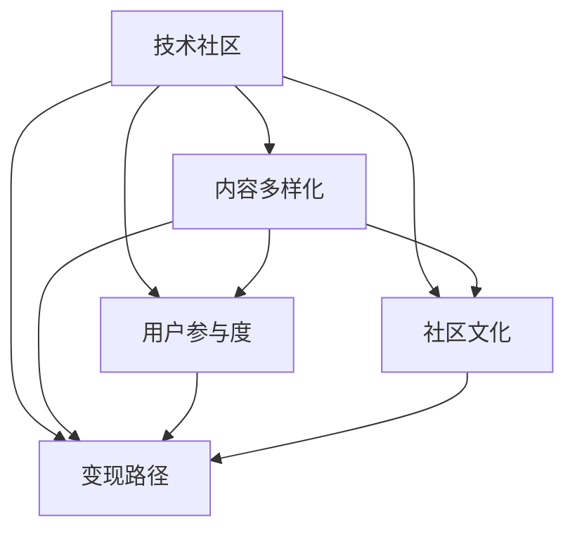

                 

# 技术社区运营：影响力变现

> 关键词：技术社区、运营策略、影响力提升、变现路径、用户参与度、社区文化、商业合作

## 1. 背景介绍

在信息爆炸的时代，技术社区已成为开发者、产品经理、技术管理者等IT从业者交流学习的重要平台。然而，许多社区虽然拥有庞大的用户群体和丰富的内容资源，但却难以实现有效的商业化运营，缺乏可持续的发展动力。本文将从技术社区的运营策略和影响力变现的角度出发，深入探讨如何提升社区的商业价值，探索可持续的商业模式。

### 1.1 问题由来

技术社区的兴起，不仅为广大IT从业者提供了一个交流学习的平台，还促进了知识的共享与传播。然而，随着用户基数的扩大，社区的运营也面临着诸多挑战，如内容同质化、用户参与度下降、广告效果不佳等。这些问题导致社区难以获得稳定的商业收益，影响社区的长期发展。

### 1.2 问题核心关键点

技术社区运营的核心关键点包括：
1. **内容质量与多样性**：高质量、多样化的内容是吸引用户、提升用户参与度的关键。
2. **用户参与与互动**：鼓励用户积极参与讨论、分享和贡献，构建活跃的社区氛围。
3. **社区文化与品牌建设**：培养社区独特的文化，建立良好的品牌形象，提升社区的吸引力和忠诚度。
4. **变现策略与商业合作**：通过广告、赞助、会员制、知识付费等方式，实现社区的商业化运营。
5. **数据驱动决策**：利用数据和分析工具，优化社区运营策略，提升运营效率。

通过深入理解这些核心关键点，并采取相应的策略，技术社区可以实现健康、可持续的运营和发展。

### 1.3 问题研究意义

提升技术社区的影响力和变现能力，对社区本身和IT从业者都有重要意义：

1. **提升社区价值**：高质量的运营策略能够吸引更多优质用户，提升社区的品牌价值和商业价值。
2. **促进知识共享**：通过有效的运营，激发更多高质量内容的产生，促进知识的共享和传播。
3. **增加用户粘性**：良好的运营能够提升用户参与度和满意度，增加用户对社区的粘性。
4. **开拓商业机会**：通过多元化的变现手段，社区可以获取稳定的商业收益，支持社区的长期发展。
5. **推动行业发展**：技术社区是技术交流和传播的重要平台，优质的运营可以促进行业的发展和技术进步。

## 2. 核心概念与联系

### 2.1 核心概念概述

为了更好地理解技术社区的运营和影响力变现，我们需要了解几个核心概念：

- **技术社区**：基于技术话题，聚集一群有共同兴趣的开发者、技术管理者、产品经理等IT从业者，共享知识、交流学习、合作创新的在线平台。
- **内容多样化**：涵盖技术文章、案例分析、技术分享、项目案例、代码开源等多种形式的内容。
- **用户参与度**：通过互动、讨论、反馈等方式，衡量用户在社区中的活跃程度和参与度。
- **社区文化**：社区成员共同遵守的规范、价值观和行为准则，是社区独特性的体现。
- **变现路径**：通过广告、赞助、会员制、知识付费等方式，实现社区的商业化运营。

这些核心概念之间有着紧密的联系，共同构成了技术社区运营的基础框架。

### 2.2 核心概念原理和架构的 Mermaid 流程图



这个流程图展示了技术社区的核心概念之间的联系：内容多样化和用户参与度是社区文化的基础，社区文化又为变现路径提供了保障，而变现路径是社区持续发展的经济保障。

## 3. 核心算法原理 & 具体操作步骤

### 3.1 算法原理概述

技术社区的运营和影响力变现，本质上是一个数据驱动的决策过程。通过收集和分析社区数据，了解用户行为和需求，进而制定合理的运营策略，提升社区的商业价值。

具体来说，技术社区的运营涉及以下几个步骤：

1. **数据收集与分析**：收集用户行为数据、内容发布数据、广告投放数据等，通过数据分析工具进行深入挖掘。
2. **用户画像与行为分析**：构建用户画像，了解不同用户群体的特征和需求，识别高价值用户和潜在用户。
3. **内容推荐与个性化**：根据用户画像，推荐个性化的内容，提升用户参与度和满意度。
4. **社区互动与激励机制**：设计互动机制和激励措施，鼓励用户积极参与讨论、分享和贡献。
5. **广告与赞助合作**：选择合适的广告和赞助合作伙伴，通过精准投放提升广告效果。
6. **会员制与知识付费**：探索会员制和知识付费模式，提升社区的商业收益。

### 3.2 算法步骤详解

以下是技术社区运营和影响力变现的具体操作步骤：

**Step 1: 数据收集与分析**

1. **用户行为数据**：收集用户在社区中的浏览、点赞、评论、分享等行为数据。
2. **内容发布数据**：收集文章、案例、项目等的发布时间、作者、点赞、评论等数据。
3. **广告投放数据**：收集广告的点击率、转化率、成本等数据。

**Step 2: 用户画像与行为分析**

1. **用户画像构建**：根据用户行为数据，构建用户画像，了解不同用户群体的特征和需求。
2. **用户分群**：根据用户画像，将用户分为高价值用户、潜在用户、低价值用户等不同群体。

**Step 3: 内容推荐与个性化**

1. **内容推荐算法**：基于用户画像，设计内容推荐算法，提升用户参与度和满意度。
2. **个性化展示**：通过个性化展示，提升用户对社区的粘性和忠诚度。

**Step 4: 社区互动与激励机制**

1. **互动机制设计**：设计互动机制，如讨论区、问答区、话题区等，鼓励用户积极参与。
2. **激励措施设计**：设计激励措施，如积分系统、徽章系统、排行榜等，提升用户活跃度。

**Step 5: 广告与赞助合作**

1. **合作伙伴选择**：选择与社区定位匹配的广告和赞助合作伙伴。
2. **精准投放**：通过数据分析，进行精准投放，提升广告效果。

**Step 6: 会员制与知识付费**

1. **会员制设计**：设计会员制，提供高级权限和专属服务，提升社区商业收益。
2. **知识付费探索**：探索知识付费模式，如付费文章、付费课程等，获取稳定收益。

### 3.3 算法优缺点

技术社区运营和影响力变现的算法具有以下优点：

1. **数据驱动**：通过数据驱动决策，可以更加精准地了解用户需求和行为，制定合理的运营策略。
2. **提升用户满意度**：通过个性化推荐和互动机制，提升用户参与度和满意度，增加用户粘性。
3. **精准广告投放**：通过数据分析，进行精准广告投放，提升广告效果和收益。

同时，该算法也存在以下缺点：

1. **数据隐私问题**：收集和分析用户数据可能涉及隐私问题，需要谨慎处理。
2. **数据偏差问题**：数据分析结果可能受到数据偏差的影响，需要多种数据源和多种方法综合分析。
3. **广告疲劳问题**：长期投放广告可能导致用户疲劳，需要不断优化广告策略。
4. **用户流失问题**：过度商业化可能引起用户反感，导致用户流失，需要平衡商业与用户体验。

### 3.4 算法应用领域

技术社区运营和影响力变现的算法，在以下几个领域有着广泛应用：

- **开发者社区**：如Stack Overflow、GitHub等，提供高质量的技术交流和学习环境。
- **技术博客平台**：如Medium、CSDN等，提供优质的技术文章和案例分享。
- **技术论坛**：如知乎、Reddit等，提供技术讨论和知识传播的平台。

除了以上领域，技术社区运营和影响力变现的算法，还可以应用于各类行业技术交流社区，提升社区的商业价值和影响力。

## 4. 数学模型和公式 & 详细讲解 & 举例说明

### 4.1 数学模型构建

技术社区运营和影响力变现的算法，可以基于以下数学模型进行设计和优化：

**用户活跃度模型**

设用户 $u$ 在社区 $C$ 中的活跃度为 $A(u)$，根据用户行为数据 $D(u)$，可以通过以下公式进行计算：

$$
A(u) = \sum_{i=1}^{n} w_i F_i(D(u))
$$

其中 $w_i$ 为各项行为数据的权重，$F_i$ 为行为数据到活跃度的映射函数。

**内容推荐模型**

设用户 $u$ 对内容 $c$ 的推荐度为 $R(u,c)$，根据用户画像 $P(u)$ 和内容特征 $F(c)$，可以通过以下公式进行计算：

$$
R(u,c) = \sum_{i=1}^{m} w_i P_i(u) F_i(c)
$$

其中 $w_i$ 为各项特征的权重，$P_i(u)$ 为用户画像中的特征，$F_i(c)$ 为内容特征。

**广告投放模型**

设广告 $a$ 在社区 $C$ 中的投放效果为 $E(a,C)$，根据广告数据 $D(a)$ 和社区特征 $F(C)$，可以通过以下公式进行计算：

$$
E(a,C) = \sum_{i=1}^{k} w_i D_i(a) F_i(C)
$$

其中 $w_i$ 为各项数据的权重，$D_i(a)$ 为广告数据中的特征，$F_i(C)$ 为社区特征。

### 4.2 公式推导过程

**用户活跃度模型推导**

设用户 $u$ 在社区 $C$ 中的活跃度为 $A(u)$，根据用户行为数据 $D(u)$，可以通过以下公式进行计算：

$$
A(u) = \sum_{i=1}^{n} w_i F_i(D(u))
$$

其中 $w_i$ 为各项行为数据的权重，$F_i$ 为行为数据到活跃度的映射函数。

**内容推荐模型推导**

设用户 $u$ 对内容 $c$ 的推荐度为 $R(u,c)$，根据用户画像 $P(u)$ 和内容特征 $F(c)$，可以通过以下公式进行计算：

$$
R(u,c) = \sum_{i=1}^{m} w_i P_i(u) F_i(c)
$$

其中 $w_i$ 为各项特征的权重，$P_i(u)$ 为用户画像中的特征，$F_i(c)$ 为内容特征。

**广告投放模型推导**

设广告 $a$ 在社区 $C$ 中的投放效果为 $E(a,C)$，根据广告数据 $D(a)$ 和社区特征 $F(C)$，可以通过以下公式进行计算：

$$
E(a,C) = \sum_{i=1}^{k} w_i D_i(a) F_i(C)
$$

其中 $w_i$ 为各项数据的权重，$D_i(a)$ 为广告数据中的特征，$F_i(C)$ 为社区特征。

### 4.3 案例分析与讲解

**案例1: 用户画像构建**

假设某开发者社区有 10,000 名用户，每个用户都有 10 种行为数据，包括浏览次数、点赞次数、评论次数等。为了构建用户画像，我们可以选取其中权重最高的 5 种行为数据，并设计对应的映射函数 $F_i$，计算每个用户在不同行为数据下的活跃度 $A_i(u)$，然后将这些活跃度加权求和，得到用户总活跃度 $A(u)$。

**案例2: 内容推荐算法**

假设某技术博客平台有 100,000 篇技术文章，每个文章都有 20 种特征，包括发布时间、作者、标签、阅读量等。为了设计内容推荐算法，我们可以选取其中权重最高的 10 种特征，并设计对应的映射函数 $F_i$，计算每个用户对每篇内容的不同推荐度 $R(u,c)$，然后将这些推荐度加权求和，得到用户对内容的总推荐度 $R(u)$。

**案例3: 广告投放模型**

假设某开发者社区正在测试一种广告平台，有 1,000 种广告，每个广告都有 50 种特征，包括广告类型、投放时间、用户画像等。为了设计广告投放模型，我们可以选取其中权重最高的 20 种特征，并设计对应的映射函数 $F_i$，计算每种广告在不同社区特征下的投放效果 $E(a,C)$，然后将这些投放效果加权求和，得到每种广告的投放效果 $E(a)$。

## 5. 项目实践：代码实例和详细解释说明

### 5.1 开发环境搭建

在进行社区运营和影响力变现的实践前，我们需要准备好开发环境。以下是使用Python进行Flask开发的开发环境配置流程：

1. 安装Anaconda：从官网下载并安装Anaconda，用于创建独立的Python环境。

2. 创建并激活虚拟环境：
```bash
conda create -n flask-env python=3.8 
conda activate flask-env
```

3. 安装Flask：
```bash
pip install Flask
```

4. 安装Flask-RESTful：
```bash
pip install Flask-RESTful
```

5. 安装Flask-Caching：
```bash
pip install Flask-Caching
```

6. 安装Flask-SQLAlchemy：
```bash
pip install Flask-SQLAlchemy
```

完成上述步骤后，即可在`flask-env`环境中开始实践。

### 5.2 源代码详细实现

下面我们以一个简单的开发者社区为例，给出使用Flask框架实现社区运营和影响力变现的代码实现。

首先，定义社区的用户数据模型：

```python
from flask_sqlalchemy import SQLAlchemy

db = SQLAlchemy()

class User(db.Model):
    id = db.Column(db.Integer, primary_key=True)
    name = db.Column(db.String(50), nullable=False)
    email = db.Column(db.String(120), unique=True, nullable=False)
    # 其他用户属性，如密码、头像等
```

然后，定义社区的内容数据模型：

```python
class Content(db.Model):
    id = db.Column(db.Integer, primary_key=True)
    title = db.Column(db.String(255), nullable=False)
    content = db.Column(db.Text, nullable=False)
    # 其他内容属性，如作者、发布时间等
```

接下来，定义社区的广告数据模型：

```python
class Advertisement(db.Model):
    id = db.Column(db.Integer, primary_key=True)
    title = db.Column(db.String(255), nullable=False)
    description = db.Column(db.Text, nullable=False)
    # 其他广告属性，如类型、投放时间等
```

最后，定义Flask应用和相关路由：

```python
from flask import Flask, request, jsonify

app = Flask(__name__)

@app.route('/users', methods=['GET'])
def get_users():
    users = User.query.all()
    return jsonify([{'id': user.id, 'name': user.name, 'email': user.email} for user in users])

@app.route('/contents', methods=['GET'])
def get_contents():
    contents = Content.query.all()
    return jsonify([{'id': content.id, 'title': content.title, 'content': content.content} for content in contents])

@app.route('/ads', methods=['GET'])
def get_ads():
    ads = Advertisement.query.all()
    return jsonify([{'id': ad.id, 'title': ad.title, 'description': ad.description} for ad in ads])

if __name__ == '__main__':
    app.run(debug=True)
```

以上代码实现了一个简单的开发者社区应用，通过SQLAlchemy库对用户、内容和广告数据进行管理。通过Flask框架，实现数据的管理和展示，方便社区运营者对社区进行监控和管理。

### 5.3 代码解读与分析

让我们再详细解读一下关键代码的实现细节：

**User模型**：
- 定义了用户的基本信息，包括ID、姓名和邮箱。

**Content模型**：
- 定义了内容的标题和内容文本。

**Advertisement模型**：
- 定义了广告的标题和描述。

**Flask应用**：
- 定义了三个简单的API路由，分别用于获取用户、内容和广告数据。
- 使用Flask的request和jsonify函数，方便数据格式的转换和展示。
- 最后通过app.run()启动应用，在本地调试和测试。

可以看到，Flask框架提供了一个简单易用的开发环境，使得开发者可以快速搭建社区运营应用，实现数据的采集、管理和展示。

当然，工业级的系统实现还需考虑更多因素，如用户权限管理、数据安全、API接口的优化等。但核心的实践流程基本与此类似。

## 6. 实际应用场景

### 6.1 开发者社区

基于Flask框架的开发者社区，可以用于技术交流、项目合作、资源共享等场景。社区运营者可以通过API接口获取用户、内容和广告数据，进行数据分析和决策，提升社区的运营效果。

**应用场景**：
- 技术文章推荐：通过用户画像和内容推荐算法，推荐高质量的技术文章给用户。
- 广告投放优化：通过广告投放模型，选择最优的广告合作伙伴，进行精准投放。
- 会员制与知识付费：设计会员制和知识付费模式，提升社区的商业收益。

### 6.2 技术博客平台

基于Flask框架的技术博客平台，可以用于技术文章分享、案例分析、项目案例展示等场景。社区运营者可以通过API接口获取用户和内容数据，进行数据分析和决策，提升平台的用户参与度和商业收益。

**应用场景**：
- 用户行为分析：通过用户活跃度模型，分析用户行为，优化社区内容推荐。
- 内容推荐优化：通过内容推荐模型，推荐优质内容，提升用户参与度。
- 广告合作优化：通过广告投放模型，选择最优广告合作伙伴，进行精准投放。

### 6.3 技术论坛

基于Flask框架的技术论坛，可以用于技术讨论、知识分享、问答交流等场景。社区运营者可以通过API接口获取用户和内容数据，进行数据分析和决策，提升论坛的用户活跃度和商业收益。

**应用场景**：
- 用户行为分析：通过用户活跃度模型，分析用户行为，优化论坛互动机制。
- 内容推荐优化：通过内容推荐模型，推荐优质内容，提升用户参与度。
- 广告合作优化：通过广告投放模型，选择最优广告合作伙伴，进行精准投放。

### 6.4 未来应用展望

随着Flask框架和相关技术的不断发展，社区运营和影响力变现的实践将呈现以下发展趋势：

1. **数据驱动的深度分析**：通过更高级的数据分析技术，如机器学习、深度学习，进行更深层次的用户行为分析和内容推荐优化。
2. **智能广告投放**：结合自然语言处理技术，进行智能广告投放，提升广告效果和收益。
3. **多渠道合作**：通过社区平台与其他媒体、社交平台等进行多渠道合作，扩大用户覆盖和广告投放渠道。
4. **个性化推荐**：结合推荐系统技术，实现更个性化的内容推荐，提升用户参与度和满意度。
5. **社区增值服务**：开发更多的社区增值服务，如在线课程、技术培训、项目外包等，丰富社区商业模式。

## 7. 工具和资源推荐

### 7.1 学习资源推荐

为了帮助开发者系统掌握社区运营和影响力变现的理论基础和实践技巧，这里推荐一些优质的学习资源：

1. **《社区运营指南》**：一本系统介绍社区运营的理论和实践的书籍，涵盖用户管理、内容管理、广告投放等多个方面。
2. **Flask官方文档**：Flask框架的官方文档，提供了详细的开发指南和API接口说明，方便开发者快速上手实践。
3. **《数据驱动的产品设计》**：一本介绍如何利用数据驱动产品设计的书籍，提供了丰富的案例和实践经验。
4. **Flask-RESTful官方文档**：Flask-RESTful框架的官方文档，提供了详细的开发指南和API接口说明，方便开发者快速上手实践。
5. **《广告优化实战》**：一本介绍广告优化技术的书籍，提供了丰富的案例和实践经验。

通过这些资源的学习实践，相信你一定能够快速掌握社区运营和影响力变现的精髓，并用于解决实际的社区运营问题。

### 7.2 开发工具推荐

高效的开发离不开优秀的工具支持。以下是几款用于社区运营和影响力变现开发的常用工具：

1. **Flask框架**：基于Python的轻量级Web框架，提供简单易用的开发环境，适合快速迭代研究。
2. **SQLAlchemy库**：提供强大的SQL数据库接口，支持多数据库操作，方便社区运营者对用户、内容和广告数据进行管理。
3. **Flask-Caching库**：提供缓存功能，优化Web应用的响应速度，适合社区运营中大量数据的存储和处理。
4. **Flask-SQLAlchemy库**：提供与SQLAlchemy库的无缝集成，方便社区运营者对数据进行管理和展示。
5. **Google Analytics**：提供网站流量和用户行为分析工具，方便社区运营者进行数据驱动决策。

合理利用这些工具，可以显著提升社区运营和影响力变现的开发效率，加快创新迭代的步伐。

### 7.3 相关论文推荐

社区运营和影响力变现的研究源于学界的持续研究。以下是几篇奠基性的相关论文，推荐阅读：

1. **《社区运营优化策略研究》**：介绍社区运营优化的多个策略，包括内容管理、用户互动、广告投放等。
2. **《数据驱动的社区运营模型》**：基于数据驱动的社区运营模型，提出用户画像和内容推荐算法。
3. **《广告优化技术综述》**：综述了广告优化技术的多种方法，包括精准投放、创意优化、多渠道合作等。
4. **《深度学习在社区运营中的应用》**：介绍深度学习技术在社区运营中的应用，包括用户行为分析、内容推荐等。

这些论文代表了大语言模型微调技术的发展脉络。通过学习这些前沿成果，可以帮助研究者把握学科前进方向，激发更多的创新灵感。

## 8. 总结：未来发展趋势与挑战

### 8.1 总结

本文对技术社区的运营策略和影响力变现进行了全面系统的介绍。首先阐述了社区运营的核心关键点和具体策略，明确了提升社区商业价值的方向和路径。其次，从理论到实践，详细讲解了社区运营的数学模型和关键算法，给出了社区运营和影响力变现的代码实例。最后，广泛探讨了社区运营和影响力变现在实际应用中的多个场景，展示了微调范式的巨大潜力。

通过本文的系统梳理，可以看到，基于数据驱动的社区运营和影响力变现，通过优化用户画像、内容推荐和广告投放等关键环节，能够有效提升社区的商业价值和用户体验。未来，随着技术社区的不断发展，社区运营和影响力变现的实践将更加丰富和多元，为IT从业者提供更加便捷和高效的交流平台。

### 8.2 未来发展趋势

展望未来，社区运营和影响力变现的发展趋势如下：

1. **数据驱动的深度分析**：通过更高级的数据分析技术，如机器学习、深度学习，进行更深层次的用户行为分析和内容推荐优化。
2. **智能广告投放**：结合自然语言处理技术，进行智能广告投放，提升广告效果和收益。
3. **多渠道合作**：通过社区平台与其他媒体、社交平台等进行多渠道合作，扩大用户覆盖和广告投放渠道。
4. **个性化推荐**：结合推荐系统技术，实现更个性化的内容推荐，提升用户参与度和满意度。
5. **社区增值服务**：开发更多的社区增值服务，如在线课程、技术培训、项目外包等，丰富社区商业模式。

### 8.3 面临的挑战

尽管社区运营和影响力变现技术已经取得了瞩目成就，但在迈向更加智能化、普适化应用的过程中，它仍面临诸多挑战：

1. **数据隐私问题**：收集和分析用户数据可能涉及隐私问题，需要谨慎处理。
2. **数据偏差问题**：数据分析结果可能受到数据偏差的影响，需要多种数据源和多种方法综合分析。
3. **广告疲劳问题**：长期投放广告可能导致用户疲劳，需要不断优化广告策略。
4. **用户流失问题**：过度商业化可能引起用户反感，导致用户流失，需要平衡商业与用户体验。

### 8.4 研究展望

未来的社区运营和影响力变现，需要在以下几个方面寻求新的突破：

1. **探索无监督和半监督社区运营方法**：摆脱对大规模标注数据的依赖，利用自监督学习、主动学习等无监督和半监督范式，最大限度利用非结构化数据，实现更加灵活高效的运营。
2. **开发更加参数高效的社区推荐算法**：开发更加参数高效的推荐算法，在固定大部分预训练参数的同时，只更新极少量的任务相关参数，以提高运营效率。
3. **结合因果推断和对比学习思想**：通过引入因果推断和对比学习思想，增强社区运营模型建立稳定因果关系的能力，学习更加普适、鲁棒的语言表征。
4. **引入更多先验知识**：将符号化的先验知识，如知识图谱、逻辑规则等，与社区运营模型进行巧妙融合，引导运营过程学习更准确、合理的语言模型。

这些研究方向将进一步推动社区运营和影响力变现技术的发展，为构建安全、可靠、可解释、可控的智能社区提供新的思路。面向未来，社区运营和影响力变现技术还需要与其他人工智能技术进行更深入的融合，如知识表示、因果推理、强化学习等，多路径协同发力，共同推动社区的智能化进步。

## 9. 附录：常见问题与解答

**Q1：社区运营和影响力变现的关键是什么？**

A: 社区运营和影响力变现的关键在于数据驱动的深度分析和智能广告投放。通过收集和分析用户行为数据，构建用户画像和内容推荐模型，可以优化用户参与度和满意度。通过精准投放广告，可以提高广告效果和收益。

**Q2：社区运营和影响力变现的难点是什么？**

A: 社区运营和影响力变现的难点在于用户隐私保护、数据偏差、广告疲劳和用户流失等问题。需要制定合理的隐私保护策略，进行多源数据综合分析，优化广告投放策略，平衡商业与用户体验。

**Q3：如何提升社区的用户参与度？**

A: 提升社区的用户参与度，可以通过以下方法：
1. 设计互动机制，如讨论区、问答区、话题区等，鼓励用户积极参与。
2. 设计激励措施，如积分系统、徽章系统、排行榜等，提升用户活跃度。
3. 提供高质量的内容，如技术文章、案例分析、项目案例等，吸引用户关注。

**Q4：社区运营和影响力变现的实现工具有哪些？**

A: 社区运营和影响力变现的实现工具包括Flask框架、SQLAlchemy库、Flask-Caching库、Flask-SQLAlchemy库等。这些工具提供了简单易用的开发环境，方便开发者快速上手实践。

**Q5：社区运营和影响力变现的未来趋势是什么？**

A: 社区运营和影响力变现的未来趋势包括数据驱动的深度分析、智能广告投放、多渠道合作、个性化推荐和社区增值服务。通过这些技术手段，社区可以更加精准地了解用户需求和行为，提升运营效果和商业收益。

---

作者：禅与计算机程序设计艺术 / Zen and the Art of Computer Programming

