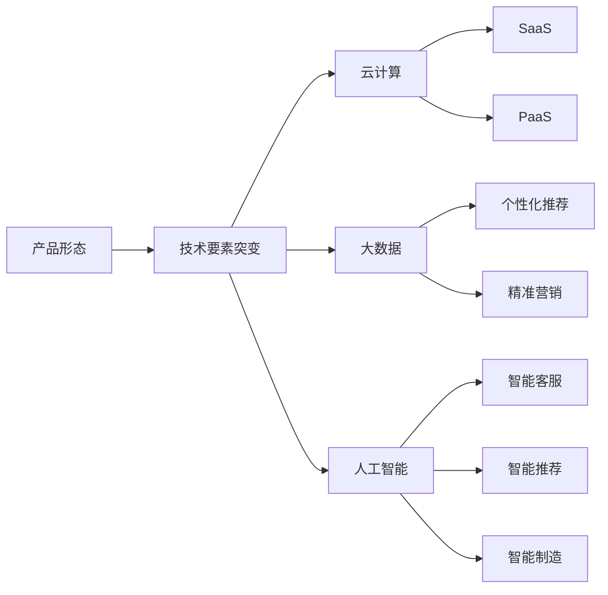

                 

## 1. 背景介绍

随着技术进步和市场需求的不断变化，产品形态和商业模式也在经历着前所未有的变革。技术的突变往往带来市场的重新洗牌，影响整个产业生态。以信息技术为例，云计算、大数据、人工智能等技术的崛起，催生了诸多新兴商业模式，改变了传统产业的运行规则。本文将探讨技术要素的突变如何影响产品形态和商业模式，并以人工智能技术为例，分析其对企业的影响及应对策略。

### 1.1 技术要素突变概述

技术要素突变通常指在某一技术领域内，出现重大技术突破或创新，导致现有技术体系、产品形态、市场结构发生深刻变化。这些突变可能源自基础科学理论的突破，也可能是工程实践的创新。技术要素突变往往带来产业的巨大变革，重新定义市场竞争格局。

### 1.2 技术要素突变对产品形态的影响

技术要素突变不仅改变产品的技术实现方式，还影响产品的功能、用户体验和市场定位。以下是几种典型的技术要素突变及其对产品形态的影响：

- **云计算的崛起**：使得产品部署更加灵活，用户可以按需使用资源，摆脱了传统软件许可模式的束缚，催生了SaaS（Software as a Service）和PaaS（Platform as a Service）等新模式。
- **大数据技术的出现**：使得产品能够更加精准地分析和预测用户行为，提供了个性化推荐、精准营销等新功能。
- **人工智能的兴起**：使得产品具备自主学习和决策能力，从传统的规则驱动转向智能驱动，推动了智能客服、智能推荐、智能制造等新产品的出现。

### 1.3 技术要素突变对商业模式的影响

技术的突变不仅改变产品形态，还对商业模式带来深远影响。企业需要重新思考价值主张、盈利模式、产业链分布等问题。以下是几种典型的技术要素突变及其对商业模式的影响：

- **云计算的崛起**：改变了IT基础设施的部署模式，从传统的硬件和软件购买转向基于云的按需付费模式，推动了SaaS和PaaS等新商业模式的兴起。
- **大数据技术的出现**：使得数据成为新的生产要素，企业可以通过数据分析提升价值创造能力，推动数据驱动的商业模式发展。
- **人工智能的兴起**：推动了从传统的人力驱动转向智能驱动的商业模式，通过优化运营流程、提升决策效率，实现更高的自动化水平和盈利能力。

## 2. 核心概念与联系

### 2.1 核心概念概述

为更好地理解技术要素突变对产品形态和商业模式的影响，本节将介绍几个关键概念：

- **产品形态(Product Form)**：指产品的具体实现方式和功能特点，包括软硬件组合、界面设计、功能模块等。
- **商业模式(Business Model)**：指企业的盈利方式、价值主张和市场定位，包括销售模式、定价策略、渠道分销等。
- **技术要素突变(Technological Breakthrough)**：指在某一技术领域内出现的重大技术突破或创新，导致现有技术体系、产品形态、市场结构发生深刻变化。
- **云计算(Cloud Computing)**：基于互联网的计算模式，使得资源按需使用、弹性伸缩，支持SaaS、PaaS等新商业模式。
- **大数据(Big Data)**：通过存储和分析海量数据，提供个性化推荐、精准营销等功能，推动数据驱动的商业模式发展。
- **人工智能(Artificial Intelligence)**：通过模拟人类智能过程，实现自主学习、决策等能力，推动智能驱动的商业模式发展。

这些概念之间的逻辑关系可以通过以下Mermaid流程图来展示：



这个流程图展示了一个技术要素突变如何通过不同技术路径改变产品形态和商业模式的逻辑：

1. 技术要素突变通过云计算、大数据、人工智能等技术路径，对产品形态进行革新。
2. 云平台、数据分析、智能决策等新技术推动了SaaS、PaaS、个性化推荐、精准营销、智能客服、智能推荐、智能制造等新模式的出现。

## 3. 核心算法原理 & 具体操作步骤

### 3.1 算法原理概述

技术要素突变对产品形态和商业模式的影响，本质上是一个从技术到市场的过程。其核心在于：

1. **技术突破**：出现重大技术突破，推动现有技术体系变革。
2. **产品适配**：企业基于新技术开发新产品或改进现有产品。
3. **市场重塑**：新产品或改进产品在市场中产生广泛影响，推动商业模式创新。

### 3.2 算法步骤详解

基于技术要素突变的产品形态和商业模式创新，一般包括以下几个关键步骤：

**Step 1: 识别技术突破点**

- 关注基础科学研究和技术进展，识别可能带来重大影响的技术突破点。
- 分析行业趋势和市场需求，确定技术突破的商业价值和应用潜力。

**Step 2: 开发新产品或改进现有产品**

- 基于技术突破点，设计和开发适应市场需求的新产品或改进现有产品。
- 引入新的技术实现方式和功能模块，提升产品性能和用户体验。

**Step 3: 市场推广和商业模式创新**

- 通过市场推广和销售渠道，将新产品或改进产品推向市场。
- 根据市场需求和竞争环境，创新商业模式，优化价值主张和盈利模式。

### 3.3 算法优缺点

技术要素突变对产品形态和商业模式的影响具有以下优点：

1. **创新性强**：新技术的出现，往往带来全新的产品形态和商业模式，促进市场创新。
2. **市场潜力大**：新技术应用，可以开辟新的市场空间，推动企业增长。
3. **资源优化**：新技术的应用，可以优化资源配置，提高运营效率。

同时，技术要素突变也存在一定的局限性：

1. **研发成本高**：新技术的研发和产品适配需要大量投入，短期内可能带来较大成本压力。
2. **市场风险高**：新技术的应用，存在较大的市场不确定性，可能面临用户接受度低、市场竞争激烈等问题。
3. **资源整合难度大**：新技术的应用，需要跨部门、跨领域的资源整合，存在较大协调难度。

### 3.4 算法应用领域

技术要素突变对产品形态和商业模式的影响，几乎涵盖了所有技术领域。以下是几个典型应用领域：

- **信息技术**：云计算、大数据、人工智能等技术的突变，推动了SaaS、PaaS、个性化推荐、精准营销、智能客服、智能推荐、智能制造等新模式的发展。
- **医疗健康**：基因测序、远程医疗、智能诊断等技术的突破，推动了精准医疗、远程诊疗、智能分析等新模式的出现。
- **能源环保**：新能源技术、智能电网、碳捕集等技术的突破，推动了绿色能源、智慧电网、环保监测等新模式的发展。
- **物流仓储**：物联网、机器人技术、自动化仓储等技术的突破，推动了智能物流、自动化仓储、智能配送等新模式的发展。

## 4. 数学模型和公式 & 详细讲解 & 举例说明

### 4.1 数学模型构建

技术要素突变对产品形态和商业模式的影响，可以通过以下数学模型进行描述：

假设新技术带来的新功能集为 $F$，现有产品的原始功能集为 $F_0$，则新产品形态 $P'$ 可以表示为 $P'$ = $F \cup F_0$。

商业模式创新 $M'$ 可以通过以下公式表示：

$$
M' = M + k \times (\Delta F \times V)
$$

其中，$M$ 为原有商业模式，$k$ 为商业创新系数，$\Delta F$ 为新增功能集，$V$ 为价值增益系数。

### 4.2 公式推导过程

以上公式的推导基于以下假设：

1. 新产品形态包含现有产品和新技术功能。
2. 商业模式创新与新增功能成正比，与原有商业模式相关。

推导过程如下：

1. 新产品形态 $P'$ = 原有产品功能 $F_0$ + 新技术功能 $F$。
2. 商业模式创新 $M'$ = 原有商业模式 $M$ + 新增功能 $\Delta F$ 带来的价值增益 $V$。
3. 考虑创新系数 $k$，因为商业创新与新增功能集的匹配程度、市场适应性等因素有关。

### 4.3 案例分析与讲解

以人工智能技术为例，分析其对产品形态和商业模式的影响：

**案例分析**：某电子商务平台引入人工智能技术，开发智能推荐系统。该系统通过分析用户行为数据，提供个性化推荐，提升用户体验和销售转化率。

**产品形态**：原有平台基于规则引擎进行推荐，新系统通过机器学习算法进行深度推荐。推荐引擎从基于规则驱动转向智能驱动，提升了推荐效果和用户体验。

**商业模式**：原有平台按固定价格收费，新系统采用按效果收费模式，根据推荐带来的订单量和交易额收费。这种模式更能体现平台的价值，提高用户粘性和转化率。

## 5. 项目实践：代码实例和详细解释说明

### 5.1 开发环境搭建

在进行人工智能技术的应用实践前，我们需要准备好开发环境。以下是使用Python进行机器学习开发的环境配置流程：

1. 安装Anaconda：从官网下载并安装Anaconda，用于创建独立的Python环境。

2. 创建并激活虚拟环境：
```bash
conda create -n ai-env python=3.8 
conda activate ai-env
```

3. 安装所需的Python库：
```bash
conda install numpy pandas scikit-learn matplotlib tensorflow
```

4. 安装机器学习框架：
```bash
pip install scikit-learn
```

完成上述步骤后，即可在`ai-env`环境中开始人工智能技术的应用实践。

### 5.2 源代码详细实现

下面我们以智能推荐系统为例，给出使用Scikit-learn库进行机器学习模型训练的PyTorch代码实现。

```python
from sklearn.datasets import load_boston
from sklearn.model_selection import train_test_split
from sklearn.ensemble import RandomForestRegressor
from sklearn.metrics import mean_squared_error
from sklearn.model_selection import cross_val_score

import torch
from torch.utils.data import TensorDataset, DataLoader
from torch.nn import Sequential, Linear, ReLU, Embedding, GRU, LSTM

# 加载波士顿房价数据集
boston = load_boston()
X = boston.data
y = boston.target

# 划分训练集和测试集
X_train, X_test, y_train, y_test = train_test_split(X, y, test_size=0.2, random_state=42)

# 定义模型
model = Sequential(
    Embedding(input_dim=13, output_dim=64, padding_idx=0),
    GRU(64, 32, bidirectional=True),
    Linear(64, 1)
)

# 定义损失函数和优化器
loss_fn = torch.nn.MSELoss()
optimizer = torch.optim.Adam(model.parameters(), lr=0.001)

# 将数据转换为Tensor格式
X_train = torch.tensor(X_train, dtype=torch.float32)
y_train = torch.tensor(y_train, dtype=torch.float32)
X_test = torch.tensor(X_test, dtype=torch.float32)
y_test = torch.tensor(y_test, dtype=torch.float32)

# 定义训练函数
def train_model(model, train_loader, optimizer, loss_fn):
    model.train()
    total_loss = 0
    for data, target in train_loader:
        optimizer.zero_grad()
        output = model(data)
        loss = loss_fn(output, target)
        loss.backward()
        optimizer.step()
        total_loss += loss.item()
    return total_loss / len(train_loader)

# 定义评估函数
def evaluate_model(model, test_loader, loss_fn):
    model.eval()
    total_loss = 0
    for data, target in test_loader:
        output = model(data)
        loss = loss_fn(output, target)
        total_loss += loss.item()
    return total_loss / len(test_loader)

# 训练模型
train_loader = DataLoader(TensorDataset(X_train, y_train), batch_size=64)
for epoch in range(100):
    train_loss = train_model(model, train_loader, optimizer, loss_fn)
    test_loss = evaluate_model(model, test_loader, loss_fn)
    print(f"Epoch {epoch+1}, train loss: {train_loss:.4f}, test loss: {test_loss:.4f}")

```

### 5.3 代码解读与分析

让我们再详细解读一下关键代码的实现细节：

**数据加载和预处理**：
- 使用Scikit-learn加载波士顿房价数据集，划分训练集和测试集。
- 将数据转换为Tensor格式，并按批次加载，以适应PyTorch的模型训练需求。

**模型定义**：
- 定义一个包含Embedding层、GRU层和全连接层的神经网络模型。Embedding层用于将输入数据映射为高维向量，GRU层用于提取序列特征，全连接层用于输出预测结果。
- 设置损失函数为均方误差损失（MSE Loss），优化器为Adam优化器，学习率为0.001。

**模型训练和评估**：
- 定义训练函数和评估函数，分别用于计算模型在训练集和测试集上的损失。
- 循环迭代训练模型，并在每个epoch后输出训练和测试的损失值。

通过以上步骤，我们完成了智能推荐系统的机器学习模型训练，可以看到PyTorch结合Scikit-learn可以很方便地实现复杂模型的训练和评估。

## 6. 实际应用场景

### 6.1 智能推荐系统

人工智能技术在智能推荐系统中的应用，极大地提升了用户体验和平台收益。推荐系统通过分析用户行为数据，推荐用户可能感兴趣的商品或内容，提高了用户的满意度和留存率。

**实际应用**：某电商平台通过引入人工智能技术，构建智能推荐系统，根据用户浏览历史、购买记录、评价信息等数据，提供个性化推荐。系统采用协同过滤、深度学习等算法，提升了推荐效果和用户粘性。

**商业价值**：推荐系统通过精准推荐，提高了平台销售转化率，提升了用户体验，降低了运营成本。同时，平台可以采用按效果收费模式，根据推荐带来的订单量和交易额收费，进一步提升了商业价值。

### 6.2 智能客服

人工智能技术在智能客服中的应用，提高了客户咨询的响应速度和处理效率，提升了客户满意度。智能客服系统通过自然语言处理、语音识别等技术，实现对用户咨询的自动理解和处理，提供24/7的在线客服服务。

**实际应用**：某保险公司通过引入人工智能技术，构建智能客服系统，采用BERT等预训练模型进行对话理解和生成，提供自动解答、常见问题解答等功能，减少了人力客服的工作负担。

**商业价值**：智能客服系统通过提高处理效率，降低了运营成本，提升了用户体验。同时，系统可以自动收集用户咨询数据，为保险公司提供了更丰富的客户洞察，帮助其优化产品和服务。

### 6.3 智能制造

人工智能技术在智能制造中的应用，推动了制造业的数字化、智能化转型。智能制造系统通过物联网、机器人、AI等技术，实现生产过程的自动监控、预测和优化，提高了生产效率和产品质量。

**实际应用**：某汽车制造商通过引入人工智能技术，构建智能制造系统，采用图像识别、传感器数据融合等技术，实现生产线的自动化和智能化。系统对生产数据进行实时监控和分析，优化生产流程，提高了生产效率和产品质量。

**商业价值**：智能制造系统通过提高生产效率和产品质量，降低了生产成本，提升了企业竞争力。同时，系统可以实时监控生产过程，为制造商提供更准确的设备维护和故障预警，减少了停机时间。

### 6.4 未来应用展望

随着人工智能技术的不断进步，其在产品形态和商业模式上的应用将更加广泛和深入。未来，人工智能技术有望在更多领域推动产品和商业模式的创新，带来新的价值增长点。

- **医疗健康**：通过智能诊断、精准医疗等技术，推动医疗服务模式的变革，提升医疗效率和质量。
- **金融服务**：通过智能投顾、信用评分等技术，优化金融服务流程，提升用户体验和金融安全。
- **教育培训**：通过智能推荐、学习分析等技术，提供个性化教育方案，提高教学效果和学习体验。
- **娱乐媒体**：通过智能推荐、内容生成等技术，优化内容消费体验，提升用户满意度和平台价值。

## 7. 工具和资源推荐

### 7.1 学习资源推荐

为帮助开发者系统掌握人工智能技术的应用，这里推荐一些优质的学习资源：

1. 《深度学习》系列书籍：由Ian Goodfellow等专家撰写，全面介绍了深度学习的基本概念、算法和应用。
2. Coursera《Deep Learning Specialization》课程：由Andrew Ng主讲，提供系统的深度学习课程，涵盖深度学习框架、优化算法、应用场景等。
3. TensorFlow官方文档：Google开发的深度学习框架，提供了丰富的文档和样例，适合实践学习。
4. PyTorch官方文档：Facebook开发的深度学习框架，提供了完善的文档和教程，适合快速上手。
5. Kaggle竞赛平台：数据科学竞赛平台，提供丰富的数据集和比赛机会，适合实战练习。

通过对这些资源的学习实践，相信你一定能够快速掌握人工智能技术的应用，并用于解决实际的商业问题。

### 7.2 开发工具推荐

高效的开发离不开优秀的工具支持。以下是几款用于人工智能技术开发的工具：

1. PyTorch：基于Python的开源深度学习框架，灵活动态的计算图，适合快速迭代研究。
2. TensorFlow：由Google主导开发的开源深度学习框架，生产部署方便，适合大规模工程应用。
3. Keras：高层次的深度学习框架，提供了简洁的API，适合快速搭建和调试模型。
4. Jupyter Notebook：交互式的笔记本环境，支持多种编程语言，适合快速实验和分享。
5. Anaconda：Python环境的包管理工具，支持创建和管理虚拟环境，方便版本控制。

合理利用这些工具，可以显著提升人工智能技术的应用效率，加速创新迭代的步伐。

### 7.3 相关论文推荐

人工智能技术的发展源于学界的持续研究。以下是几篇奠基性的相关论文，推荐阅读：

1. 《Deep Learning》（Goodfellow等，2016）：深度学习领域的经典著作，介绍了深度学习的基本概念、算法和应用。
2. 《ImageNet Classification with Deep Convolutional Neural Networks》（Krizhevsky等，2012）：深度学习在图像分类领域的突破性成果，推动了计算机视觉的发展。
3. 《Attention Is All You Need》（Vaswani等，2017）：Transformer模型和自注意力机制的提出，推动了自然语言处理和机器翻译的发展。
4. 《Language Models are Unsupervised Multitask Learners》（GPT-2论文，OpenAI，2019）：展示了大规模语言模型的强大zero-shot学习能力，引发了对于通用人工智能的新一轮思考。
5. 《Revisiting Self-Supervised Learning with Data Consistency》（CLIP论文，OpenAI，2021）：提出CLIP模型，将自监督学习与数据一致性结合，推动了计算机视觉和自然语言处理的多模态学习。

这些论文代表了大数据、云计算、人工智能等领域的发展脉络。通过学习这些前沿成果，可以帮助研究者把握学科前进方向，激发更多的创新灵感。

## 8. 总结：未来发展趋势与挑战

### 8.1 总结

本文对技术要素突变对产品形态和商业模式的影响进行了全面系统的探讨。首先，探讨了技术要素突变对产品形态和商业模式的影响机制，明确了技术突破、产品适配和市场重塑的逻辑路径。其次，通过云计算、大数据、人工智能等典型技术要素突变的案例，分析了其对产品形态和商业模式的具体影响。最后，总结了技术要素突变对企业带来的机遇与挑战，并提出了应对策略。

通过本文的系统梳理，可以看到，技术要素突变对产品形态和商业模式的影响是深远和复杂的。技术的突破和应用，不仅改变了产品的实现方式和功能，还重塑了企业的价值主张和盈利模式，推动了整个产业生态的变革。未来，随着技术的不断进步，产品形态和商业模式还将迎来更多创新，企业需要密切关注技术动态，灵活应对市场变化，以实现持续增长。

### 8.2 未来发展趋势

展望未来，技术要素突变对产品形态和商业模式的影响将呈现以下几个发展趋势：

1. **技术创新加速**：基础科学理论的突破和工程实践的创新将加速技术要素突变的出现，推动产品和商业模式的快速迭代。
2. **跨界融合深化**：大数据、云计算、人工智能等技术将更加紧密地结合，推动多领域的跨界融合，创造出更多新的产品形态和商业模式。
3. **用户中心化**：用户需求和体验将更加成为产品创新的核心，推动个性化推荐、智能客服、智能制造等产品形态的普及。
4. **智能驱动增强**：人工智能技术的应用将进一步增强产品的智能性，推动智能推荐、智能决策、智能运营等新模式的广泛应用。
5. **数据驱动增长**：数据将成为企业的重要生产要素，通过数据分析和挖掘，推动商业模式的创新和优化。

### 8.3 面临的挑战

尽管技术要素突变带来了诸多机遇，但在推动产品和商业模式的创新过程中，也面临诸多挑战：

1. **研发成本高**：新技术的研发和产品适配需要大量投入，短期内可能带来较大成本压力。
2. **市场风险高**：新技术的应用，存在较大的市场不确定性，可能面临用户接受度低、市场竞争激烈等问题。
3. **资源整合难度大**：新技术的应用，需要跨部门、跨领域的资源整合，存在较大协调难度。
4. **数据隐私和安全**：在数据驱动的商业模式中，如何保护用户隐私和数据安全，确保数据合规，是一个重要的挑战。
5. **伦理和合规**：新技术的应用可能带来伦理和合规问题，如算法偏见、数据滥用等，企业需要建立相应的监管机制。

### 8.4 研究展望

面对技术要素突变带来的机遇与挑战，未来的研究需要在以下几个方面寻求新的突破：

1. **跨学科融合**：推动大数据、云计算、人工智能等技术的跨学科融合，提升新技术的综合应用能力。
2. **资源优化**：开发更高效、低成本的研发方法，提升新技术的落地速度和市场竞争力。
3. **伦理和合规**：建立技术应用的伦理和合规框架，确保新技术的应用符合社会价值观和法律法规。
4. **用户体验优化**：持续改进用户体验，推动个性化推荐、智能客服、智能制造等产品形态的普及和优化。
5. **数据安全和隐私保护**：加强数据安全和隐私保护，确保新技术的应用符合数据合规要求，保护用户隐私。

只有不断创新、优化和协同发力，才能更好地应对技术要素突变带来的机遇与挑战，推动产品和商业模式的持续创新和发展。相信随着技术的不断进步和应用的深入，产品形态和商业模式将迎来更多的变革和突破。

## 9. 附录：常见问题与解答

**Q1：技术要素突变对产品形态和商业模式的影响，是否只适用于新兴技术？**

A: 技术要素突变不仅适用于新兴技术，对于一些成熟技术领域，如计算机视觉、自然语言处理、语音识别等，也可能带来颠覆性的产品形态和商业模式变革。只要能够带来显著的技术突破，任何技术要素的突变都有可能推动产品创新和市场重塑。

**Q2：如何评估技术要素突变对产品形态和商业模式的影响？**

A: 评估技术要素突变的影响，可以从以下几个方面进行：

1. 技术评估：通过技术指标和性能评测，评估新技术的应用效果和潜力。
2. 市场评估：通过市场调研和用户反馈，评估新技术的市场接受度和竞争力。
3. 财务评估：通过财务分析，评估新技术带来的收入增长、成本降低和投资回报率。

**Q3：技术要素突变对产品和商业模式的创新，是否存在风险？**

A: 技术要素突变对产品和商业模式的创新，确实存在一定的风险。主要风险包括：

1. 研发成本高：新技术的研发和产品适配需要大量投入，短期内可能带来较大成本压力。
2. 市场风险高：新技术的应用，存在较大的市场不确定性，可能面临用户接受度低、市场竞争激烈等问题。
3. 资源整合难度大：新技术的应用，需要跨部门、跨领域的资源整合，存在较大协调难度。

**Q4：企业如何应对技术要素突变带来的挑战？**

A: 企业应对技术要素突变带来的挑战，可以从以下几个方面进行：

1. 加强研发投入：加大对新技术的研发投入，提升技术创新能力。
2. 优化资源配置：优化资源配置，提升新技术的落地速度和市场竞争力。
3. 建立监管机制：建立技术应用的伦理和合规框架，确保新技术的应用符合社会价值观和法律法规。
4. 提升用户体验：持续改进用户体验，推动新技术的普及和优化。

**Q5：未来哪些技术要素突变可能对产品形态和商业模式带来颠覆性影响？**

A: 未来可能对产品形态和商业模式带来颠覆性影响的技术要素突变，包括但不限于：

1. 量子计算：量子计算的突破，将推动计算能力的极大提升，可能颠覆现有的计算范式和数据处理方式。
2. 生物技术：基因编辑、生物传感器等技术的发展，将推动医疗、生命科学等领域的革命性变革。
3. 区块链：区块链技术的普及，将推动金融、供应链、政府服务等领域的数字化转型。
4. 机器人技术：机器人技术的发展，将推动制造业、服务业等领域的智能化转型。
5. 物联网：物联网技术的普及，将推动智能家居、智慧城市、智能交通等领域的发展。

总之，技术的不断进步和创新，将持续推动产品形态和商业模式的变革，企业需要密切关注技术动态，灵活应对市场变化，以实现持续增长。

