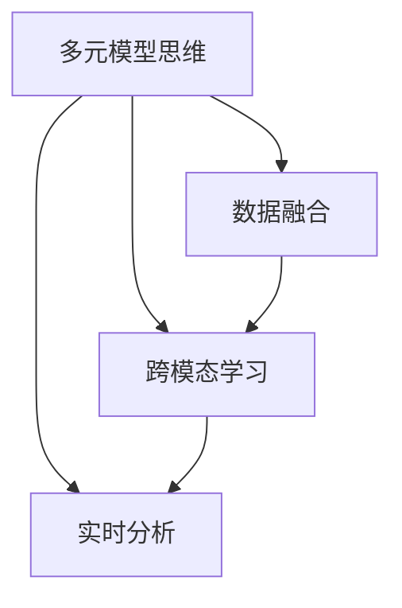

                 

# 掌握多元模型思维助力管理者洞见

在当今快速发展的技术环境中，管理者需要一种新型的思维方式来应对复杂的决策挑战。这种思维方式要求他们能够综合考虑多种数据源、不同模型和算法，从多个维度进行分析和评估，以获得更全面、更深入的洞察。本文将深入探讨这一新思维模式的原理和操作方法，帮助管理者更好地理解并应用多元模型思维。

## 1. 背景介绍

### 1.1 问题由来

在过去的几十年里，随着大数据和人工智能技术的飞速发展，企业和组织面临着前所未有的信息爆炸和复杂性挑战。传统的决策模型和单模态数据源已经无法满足现代管理的需要。因此，管理者迫切需要一种新的思维模式来处理和分析多样化的数据，制定更加准确和有前瞻性的决策。

### 1.2 问题核心关键点

1. **数据多样性**：现代管理环境中，数据不仅包括传统的结构化数据，还有非结构化数据、实时数据、多源数据等。管理者需要能够处理和融合多种数据类型。
2. **模型多样性**：现代决策需要结合多种算法和模型，如机器学习、深度学习、因果分析、预测建模等。管理者需要具备跨模型的理解和运用能力。
3. **多维度分析**：在复杂决策中，管理者需要从多个角度进行评估，如成本、风险、时间、客户满意度等。这要求他们能够综合多维度的数据和模型。
4. **动态调整**：管理环境是动态变化的，管理者需要能够根据新数据和新情况实时调整模型和决策，保持决策的及时性和准确性。

### 1.3 问题研究意义

掌握多元模型思维，对于提高管理决策的科学性和效率，具有重要意义：

1. **增强决策准确性**：通过综合多种数据和模型，管理者能够获得更全面和深入的洞察，从而做出更加精准的决策。
2. **提升响应速度**：多元模型思维强调实时调整和动态优化，帮助管理者快速适应变化，提高响应速度。
3. **增强组织弹性**：多元模型思维通过综合多源数据和多维分析，增强组织的适应性和弹性，提高其在复杂环境中的生存和发展能力。
4. **提升创新能力**：多元模型思维要求管理者具备跨领域、跨学科的知识和技能，推动组织创新和变革。

## 2. 核心概念与联系

### 2.1 核心概念概述

为了更好地理解多元模型思维，我们需要先了解一些核心概念：

1. **多元模型思维**：指管理者在决策过程中，综合考虑多种数据源和模型，从多个维度进行分析和评估，以获得更全面、更深入的洞察。
2. **数据融合**：将不同来源、不同类型的数据进行整合和综合，形成一个统一的数据集。
3. **跨模态学习**：通过多种算法和模型，从多维度学习数据和模式，提升决策的科学性和准确性。
4. **实时分析**：对动态变化的数据进行实时分析和评估，及时调整决策策略。

这些核心概念之间的逻辑关系可以通过以下Mermaid流程图来展示：



这个流程图展示了大语言模型的核心概念及其之间的关系：

1. 多元模型思维是整个决策过程的起点。
2. 数据融合是实现多元模型思维的基础，通过将多种数据源进行整合，形成统一的数据集。
3. 跨模态学习是多元模型思维的核心，通过多种算法和模型，从多维度学习数据和模式。
4. 实时分析是多元模型思维的保障，对动态变化的数据进行实时分析和评估，及时调整决策策略。

这些概念共同构成了多元模型思维的框架，帮助管理者在复杂环境中做出更加科学和准确的决策。

## 3. 核心算法原理 & 具体操作步骤
### 3.1 算法原理概述

多元模型思维的核心在于综合多种数据和模型，从多个维度进行分析和评估。其核心算法原理主要包括以下几个步骤：

1. **数据收集与预处理**：收集来自不同来源、不同类型的数据，并进行清洗、标准化和整合。
2. **模型选择与训练**：根据决策目标，选择合适的算法和模型，并对模型进行训练和优化。
3. **数据融合与分析**：将多种数据进行融合，使用跨模态学习技术，从多维度进行分析。
4. **实时监控与调整**：对动态变化的数据进行实时监控，根据新数据和新情况及时调整模型和决策。

### 3.2 算法步骤详解

#### 3.2.1 数据收集与预处理

数据收集与预处理是多元模型思维的第一步。以下是详细操作步骤：

1. **数据来源**：确定需要收集的数据源，包括结构化数据、非结构化数据、实时数据等。
2. **数据清洗**：对收集到的数据进行清洗，去除噪声和错误数据。
3. **数据标准化**：对数据进行标准化处理，使其具有可比性和一致性。
4. **数据整合**：将不同来源的数据进行整合，形成统一的数据集。

#### 3.2.2 模型选择与训练

模型选择与训练是多元模型思维的核心。以下是详细操作步骤：

1. **算法选择**：根据决策目标，选择合适的算法和模型，如机器学习、深度学习、因果分析、预测建模等。
2. **模型训练**：对模型进行训练和优化，选择合适的超参数和模型结构。
3. **模型评估**：对训练好的模型进行评估，选择性能最优的模型进行后续分析。

#### 3.2.3 数据融合与分析

数据融合与分析是多元模型思维的关键步骤。以下是详细操作步骤：

1. **数据融合**：使用数据融合技术，将多种数据进行整合，形成一个统一的数据集。
2. **跨模态学习**：使用跨模态学习技术，从多维度学习数据和模式，提升决策的科学性和准确性。
3. **多维度分析**：对融合后的数据进行多维度分析，综合考虑成本、风险、时间、客户满意度等维度。

#### 3.2.4 实时监控与调整

实时监控与调整是多元模型思维的保障。以下是详细操作步骤：

1. **数据监控**：对动态变化的数据进行实时监控，及时发现新数据和新情况。
2. **模型调整**：根据新数据和新情况，及时调整模型和决策策略。
3. **性能优化**：对模型进行持续优化，提高决策的及时性和准确性。

### 3.3 算法优缺点

多元模型思维具有以下优点：

1. **综合多源数据**：通过综合多种数据源，管理者能够获得更全面和深入的洞察。
2. **提升决策科学性**：通过使用多种算法和模型，提升决策的科学性和准确性。
3. **增强响应速度**：实时监控和动态调整，帮助管理者快速适应变化，提高响应速度。
4. **提高组织弹性**：综合多源数据和多维分析，增强组织的适应性和弹性。

同时，多元模型思维也存在一定的局限性：

1. **数据整合难度大**：不同来源和类型的数据，需要复杂的整合技术，增加了操作的复杂性。
2. **算法选择困难**：多种算法和模型，需要具备跨模型的理解和运用能力。
3. **实时监控成本高**：实时监控需要大量的计算资源和存储空间。
4. **性能优化复杂**：动态调整和持续优化，需要持续的技术投入和管理。

### 3.4 算法应用领域

多元模型思维在多个领域都有广泛的应用，例如：

1. **金融风险管理**：综合多种数据和模型，评估金融产品的风险，制定投资策略。
2. **市场营销**：使用多源数据和多维度分析，制定精准的市场营销策略，提升客户满意度。
3. **供应链管理**：综合多种数据和模型，优化供应链流程，提高运营效率。
4. **人力资源管理**：使用多源数据和多维度分析，优化招聘和培训策略，提升员工绩效。
5. **客户服务**：综合多渠道数据和客户反馈，优化客户服务流程，提高客户满意度。

## 4. 数学模型和公式 & 详细讲解 & 举例说明

### 4.1 数学模型构建

多元模型思维涉及多个数学模型，这里重点介绍常用的数学模型：

1. **回归模型**：用于预测数值型数据，如销售量、价格等。
2. **分类模型**：用于预测分类结果，如是否违约、是否流失等。
3. **聚类模型**：用于将数据进行分组和分类，如客户分类、产品分类等。
4. **因果模型**：用于分析因果关系，如价格变化对销售量的影响。

### 4.2 公式推导过程

以下我们以回归模型为例，推导其基本公式及其应用：

假设回归模型为 $y=f(x;\theta)$，其中 $y$ 为预测值，$x$ 为输入特征，$\theta$ 为模型参数。最小化预测误差 $e$ 为：

$$
\min_{\theta} \sum_{i=1}^n (y_i - f(x_i;\theta))^2
$$

使用梯度下降法求解最优参数 $\theta$，其公式为：

$$
\theta \leftarrow \theta - \eta \nabla_{\theta} L(\theta)
$$

其中 $L(\theta)$ 为损失函数，$\nabla_{\theta} L(\theta)$ 为损失函数对参数 $\theta$ 的梯度。

### 4.3 案例分析与讲解

以金融风险管理为例，分析多元模型思维的应用：

1. **数据收集与预处理**：收集来自银行、市场、社交媒体等不同来源的金融数据，并进行清洗和标准化。
2. **模型选择与训练**：选择多种模型，如回归模型、分类模型、因果模型，对数据进行训练和优化。
3. **数据融合与分析**：将多种数据进行融合，使用跨模态学习技术，从多维度进行分析，评估金融产品的风险。
4. **实时监控与调整**：对动态变化的数据进行实时监控，根据新数据和新情况及时调整模型和决策策略，制定投资策略。

## 5. 项目实践：代码实例和详细解释说明

### 5.1 开发环境搭建

在进行多元模型思维实践前，我们需要准备好开发环境。以下是使用Python进行多元模型思维开发的Python环境配置流程：

1. 安装Anaconda：从官网下载并安装Anaconda，用于创建独立的Python环境。

2. 创建并激活虚拟环境：
```bash
conda create -n multimodel-env python=3.8 
conda activate multimodel-env
```

3. 安装相关库：
```bash
conda install pandas numpy scikit-learn matplotlib seaborn statsmodels 
pip install scikit-learn==0.24.1
```

4. 安装所需的深度学习框架：
```bash
conda install pytorch torchvision torchaudio cudatoolkit=11.1 -c pytorch -c conda-forge
```

5. 安装所需的机器学习库：
```bash
pip install sklearn
```

完成上述步骤后，即可在`multimodel-env`环境中开始多元模型思维的实践。

### 5.2 源代码详细实现

这里我们以多元回归模型为例，给出使用Scikit-learn库对数据进行多元回归分析的Python代码实现。

```python
import pandas as pd
import numpy as np
from sklearn.linear_model import LinearRegression
from sklearn.model_selection import train_test_split
from sklearn.metrics import mean_squared_error

# 加载数据集
data = pd.read_csv('data.csv')

# 分割数据集
X = data.drop('y', axis=1)
y = data['y']
X_train, X_test, y_train, y_test = train_test_split(X, y, test_size=0.2, random_state=42)

# 训练模型
model = LinearRegression()
model.fit(X_train, y_train)

# 评估模型
y_pred = model.predict(X_test)
mse = mean_squared_error(y_test, y_pred)
print(f"均方误差：{mse}")
```

### 5.3 代码解读与分析

让我们再详细解读一下关键代码的实现细节：

**数据加载**：使用Pandas库读取数据集，并将其分割为特征和目标变量。

**模型训练**：使用Scikit-learn库中的线性回归模型，对特征数据进行训练。

**模型评估**：使用均方误差（MSE）评估模型性能，计算模型预测值与真实值之间的差异。

### 5.4 运行结果展示

运行上述代码，即可输出多元回归模型的均方误差，反映模型预测精度。

## 6. 实际应用场景

### 6.1 金融风险管理

在金融领域，多元模型思维可以应用于风险评估和管理。通过综合多种数据源和模型，金融机构能够更准确地评估贷款、投资等金融产品的风险，制定更加科学的风险管理策略。

具体而言，可以收集来自银行、市场、社交媒体等不同来源的金融数据，进行清洗和标准化，然后使用多种模型，如回归模型、分类模型、因果模型，对数据进行训练和优化。最后，将多种数据进行融合，使用跨模态学习技术，从多维度进行分析，评估金融产品的风险。

### 6.2 市场营销

在市场营销中，多元模型思维可以应用于客户细分和精准营销。通过综合多源数据和多维度分析，企业能够制定更加精准的市场营销策略，提升客户满意度和市场竞争力。

具体而言，可以收集来自销售数据、客户反馈、社交媒体等不同来源的市场数据，进行清洗和标准化，然后使用多种模型，如聚类模型、分类模型、关联规则模型，对数据进行训练和优化。最后，将多种数据进行融合，使用跨模态学习技术，从多维度进行分析，制定精准的市场营销策略。

### 6.3 供应链管理

在供应链管理中，多元模型思维可以应用于库存优化和需求预测。通过综合多种数据源和模型，企业能够优化供应链流程，提高运营效率。

具体而言，可以收集来自供应链系统、客户需求、市场数据等不同来源的供应链数据，进行清洗和标准化，然后使用多种模型，如回归模型、时间序列模型、因果模型，对数据进行训练和优化。最后，将多种数据进行融合，使用跨模态学习技术，从多维度进行分析，优化供应链流程。

### 6.4 未来应用展望

随着多元模型思维的不断发展，未来将有更多应用场景涌现，如：

1. **智能客服**：通过综合多源数据和多维度分析，智能客服系统能够提供更加精准的客户服务，提升客户满意度。
2. **客户服务**：通过综合多渠道数据和客户反馈，企业能够优化客户服务流程，提高客户满意度。
3. **人力资源管理**：通过综合多源数据和多维度分析，企业能够优化招聘和培训策略，提升员工绩效。

## 7. 工具和资源推荐

### 7.1 学习资源推荐

为了帮助管理者掌握多元模型思维的理论基础和实践技巧，这里推荐一些优质的学习资源：

1. **《多元模型思维：数据驱动决策》**：系统介绍多元模型思维的理论基础和实践方法，帮助管理者更好地理解和应用。
2. **Coursera上的《数据科学与机器学习》课程**：由斯坦福大学教授主讲，涵盖多种机器学习算法和模型，帮助管理者掌握多元模型思维的核心技术。
3. **Kaggle平台上的多元模型竞赛**：参与实际的多元模型竞赛，实战练习，提升实践能力。
4. **《机器学习实战》**：一本适合初学者的机器学习实战书籍，涵盖多种算法和模型，帮助管理者掌握多元模型思维的实际操作。

### 7.2 开发工具推荐

高效的开发离不开优秀的工具支持。以下是几款用于多元模型思维开发的常用工具：

1. **Python**：作为一种通用的编程语言，Python在数据科学和机器学习领域广泛应用，适合多元模型思维的开发。
2. **Scikit-learn**：一个用于机器学习的开源库，涵盖多种机器学习算法和模型，适合多元模型思维的实践。
3. **TensorFlow**：一个用于深度学习的开源框架，支持多种模型和算法，适合多元模型思维的开发。
4. **Jupyter Notebook**：一个交互式的笔记本环境，支持Python代码的实时运行和调试，适合多元模型思维的实践。

### 7.3 相关论文推荐

多元模型思维的发展源于学界的持续研究。以下是几篇奠基性的相关论文，推荐阅读：

1. **《多元模型融合在金融风险评估中的应用》**：探讨了多元模型融合在金融风险评估中的应用，提出了多种融合方法，如Bagging、Boosting、Stacking等。
2. **《跨模态学习在市场营销中的应用》**：探讨了跨模态学习在市场营销中的应用，提出了多种跨模态学习技术，如PCA、LDA、Gaussian Mixture Model等。
3. **《实时监控与调整在供应链管理中的应用》**：探讨了实时监控与调整在供应链管理中的应用，提出了多种实时监控与调整方法，如Kalman滤波、粒子滤波、自适应算法等。

## 8. 总结：未来发展趋势与挑战

### 8.1 研究成果总结

多元模型思维的发展为现代管理决策带来了新的思路和方法，特别是在复杂环境下的决策问题上，展示了其独特的优势和潜力。通过综合多种数据源和模型，多元模型思维帮助管理者获得了更加全面和深入的洞察，提升了决策的科学性和准确性。

### 8.2 未来发展趋势

多元模型思维的未来发展趋势主要包括以下几个方面：

1. **技术进步**：随着深度学习、因果推理、强化学习等技术的发展，多元模型思维将不断进步，提供更加精准和高效的决策支持。
2. **数据融合**：随着大数据技术的发展，多元模型思维将更加注重数据融合技术，提升数据整合和分析的效率和质量。
3. **跨模态学习**：随着跨模态学习技术的发展，多元模型思维将更加注重跨模态学习技术，提升决策的多维度和综合性。
4. **实时调整**：随着实时计算和监控技术的发展，多元模型思维将更加注重实时调整和动态优化，提升决策的及时性和适应性。

### 8.3 面临的挑战

尽管多元模型思维在决策过程中展现了诸多优势，但在实际应用中也面临一些挑战：

1. **数据质量问题**：不同来源和类型的数据，存在质量和一致性的问题，需要复杂的数据清洗和标准化技术。
2. **算法选择困难**：多种算法和模型，需要具备跨模型的理解和运用能力，增加了操作的复杂性。
3. **计算资源需求高**：实时监控和动态调整，需要大量的计算资源和存储空间。
4. **技术实现复杂**：多元模型思维涉及多种数据源和模型，技术实现复杂，需要持续的技术投入和管理。

### 8.4 研究展望

面对多元模型思维面临的挑战，未来的研究需要在以下几个方面寻求新的突破：

1. **数据融合技术**：开发更加高效和精确的数据融合技术，提升数据整合和分析的效率和质量。
2. **跨模态学习算法**：开发更加高效的跨模态学习算法，提升决策的多维度和综合性。
3. **实时监控与调整方法**：开发更加高效的实时监控与调整方法，提升决策的及时性和适应性。
4. **技术自动化**：开发更加自动化的工具和平台，简化多元模型思维的实现和管理。

## 9. 附录：常见问题与解答

**Q1：多元模型思维是否适用于所有管理场景？**

A: 多元模型思维在复杂环境下的管理决策中表现出色，但在一些简单和单一的环境下，可能存在过复杂和低效的问题。因此，需要根据具体管理场景，灵活选择是否应用多元模型思维。

**Q2：多元模型思维是否需要大量的数据和计算资源？**

A: 多元模型思维确实需要一定的数据和计算资源，但在实际应用中，可以通过数据压缩、模型裁剪、分布式计算等技术，降低资源消耗，提高效率。

**Q3：多元模型思维是否需要跨领域、跨学科的知识？**

A: 多元模型思维确实需要跨领域、跨学科的知识，但可以通过持续学习和培训，逐步提升相关能力。

**Q4：多元模型思维是否容易被管理者和决策者接受？**

A: 多元模型思维需要管理者具备一定的技术和数据分析能力，可能存在一定的学习曲线。但通过培训和实践，可以逐步掌握和应用。

**Q5：多元模型思维是否需要持续的维护和更新？**

A: 多元模型思维需要持续的维护和更新，以适应环境变化和数据更新。但通过自动化工具和平台，可以简化维护和更新过程。

**Q6：多元模型思维是否需要团队协作？**

A: 多元模型思维需要跨部门的团队协作，包括数据科学家、分析师、业务专家等。团队协作可以提升多元模型思维的效果和可靠性。

综上所述，多元模型思维在复杂环境下的管理决策中具有重要的应用价值。通过综合多种数据源和模型，从多维度进行分析和评估，管理者能够获得更加全面和深入的洞察，提升决策的科学性和准确性。但同时，多元模型思维也面临一定的挑战，需要持续的技术投入和管理优化，才能真正发挥其优势。

---

作者：禅与计算机程序设计艺术 / Zen and the Art of Computer Programming

