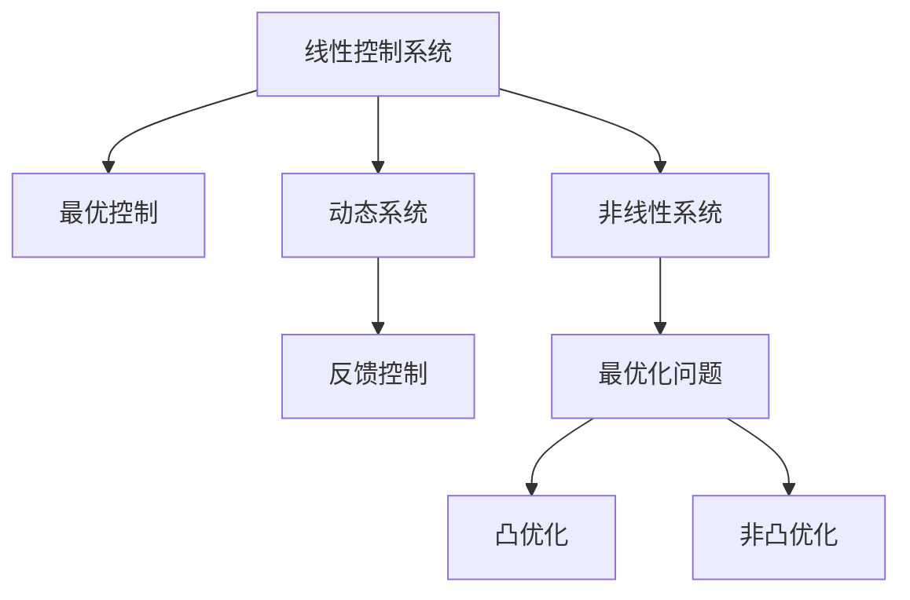

                 

# 控制论与最优化的现代研究

> 关键词：控制论,优化,现代研究,应用,算法

## 1. 背景介绍

### 1.1 问题由来

控制论与优化是现代工程、科学和技术中极为关键的两大理论基础，广泛应用于从工业控制到机器人技术，从自动驾驶到金融投资，从生物信息学到社会经济系统的各个领域。控制论研究系统如何保持稳定和平衡，优化研究系统如何高效地达到目标。这两者之间的内在联系和相互促进，使得现代控制论与优化方法成为推动技术进步和创新应用的重要引擎。

### 1.2 问题核心关键点

现代控制论与优化方法的核心关键点在于：

- **稳定性**：如何保证系统在变化环境下的稳定性，避免出现系统崩溃或失效。
- **优化目标**：如何在各种约束条件下，实现系统的最优控制或最优设计。
- **动态调整**：如何根据系统的实时反馈信息，动态调整控制策略，以应对外部干扰和系统变化。
- **多目标优化**：如何在多个性能指标之间进行平衡和优化，如速度、精度、能效等。
- **分布式优化**：如何处理大规模分布式系统中的优化问题，实现高效的协同优化。
- **鲁棒性**：如何在模型不确定性和噪声干扰的情况下，提高优化算法和控制系统的鲁棒性。

### 1.3 问题研究意义

控制论与优化方法的研究不仅具有重要的理论价值，更具有重大的实际应用意义。其研究结果能够为各种复杂系统提供高效、稳定、可靠的解决方案，推动相关领域的技术进步和产业发展。

- **提升系统效率**：通过优化算法和控制策略，提升系统的工作效率和资源利用率。
- **增强系统可靠性**：通过稳定性分析和鲁棒性设计，增强系统应对外部干扰和内部扰动的能力。
- **降低成本和风险**：通过优化设计和控制策略，降低系统设计和运营成本，减少系统故障和事故风险。
- **支持创新应用**：为新兴技术领域提供理论和方法支持，推动新技术的落地应用，如智能制造、智慧医疗、自动驾驶等。

## 2. 核心概念与联系

### 2.1 核心概念概述

控制论与优化方法涉及的核心概念包括：

- **线性控制系统**：研究线性系统在控制输入和输出间的动态关系。
- **非线性系统**：研究非线性系统在控制输入和输出间的复杂动态关系。
- **最优控制**：在特定约束条件下，寻找使系统性能最优的控制策略。
- **动态系统**：研究系统在时间序列上的变化和行为。
- **反馈控制**：利用系统的反馈信息调整控制策略，实现系统的稳定性和适应性。
- **最优化问题**：寻找在给定约束条件下，目标函数达到最优值的变量或参数。
- **凸优化**：目标函数和约束条件都是凸的优化问题，具有全局最优解的性质。
- **非凸优化**：目标函数或约束条件中包含非凸部分，具有局部最优解的特性。

这些核心概念之间的逻辑关系可以通过以下Mermaid流程图来展示：



这个流程图展示了一部分核心概念及其之间的联系：

- 线性系统是最优控制的基础，动态系统考虑时间序列变化，反馈控制基于系统的实时反馈信息调整策略。
- 非线性系统引入了更复杂的目标函数，最优化问题进一步扩展了约束条件，凸优化和非凸优化则决定了问题的求解特性。

## 3. 核心算法原理 & 具体操作步骤

### 3.1 算法原理概述

控制论与优化方法的原理基础包括：

- **控制理论**：研究如何通过控制输入（如控制器输出、物理参数等）来调节系统的输出（如状态、性能指标等）。
- **优化算法**：寻找在约束条件下最优解的计算方法，包括线性规划、非线性规划、动态规划、凸优化等。
- **稳定性分析**：分析系统在各种扰动下的稳定性，确定系统的稳定区域和性能指标。
- **鲁棒性设计**：考虑系统模型和参数不确定性，设计鲁棒控制系统。

### 3.2 算法步骤详解

现代控制论与优化方法的步骤主要包括：

1. **建模与描述**：将实际问题抽象为数学模型，包括状态方程、控制方程、性能指标等。
2. **控制策略设计**：根据模型设计合适的控制策略，如PID控制、最优控制、鲁棒控制等。
3. **性能指标计算**：计算控制策略下的性能指标，如误差、稳定区域、能效等。
4. **优化算法求解**：使用优化算法寻找最优控制策略或最优设计参数。
5. **仿真与实验验证**：通过仿真或实验验证控制策略的效果，调整和优化策略。
6. **反馈与自适应控制**：根据实时反馈信息，动态调整控制策略，以应对外部干扰和内部扰动。

### 3.3 算法优缺点

现代控制论与优化方法具有以下优点：

- **理论基础坚实**：有深厚的数学理论支持，能够处理复杂系统的建模和优化问题。
- **应用范围广泛**：广泛应用于工业控制、机器人技术、自动驾驶、金融投资等领域。
- **技术成熟度高**：经过多年的发展，形成了丰富的算法和工具，如MATLAB/Simulink、Optimization Toolbox、Python的SciPy和Scikit-Optimize等。

同时，该方法也存在一定的局限性：

- **计算复杂度高**：特别是对于大规模分布式系统和大规模非凸优化问题，计算复杂度较高。
- **模型精度要求高**：需要精确的模型描述和参数设定，以确保算法的准确性和有效性。
- **实时性要求高**：对于实时控制应用，需要高效的算法和快速的计算速度。
- **动态调整难度大**：复杂环境下的动态调整需要高性能的控制器和实时计算能力。

### 3.4 算法应用领域

现代控制论与优化方法在各个领域中得到了广泛的应用，具体包括：

- **工业控制**：如电力系统、化工生产、自动化生产线等，通过优化和控制提升生产效率和质量。
- **机器人技术**：如自主导航、路径规划、协作控制等，通过优化算法和控制策略实现智能机器人。
- **自动驾驶**：如路径规划、速度控制、车联网等，通过控制论和优化方法实现安全的自动驾驶。
- **金融投资**：如资产组合优化、风险管理、交易策略等，通过优化算法实现高效的投资决策。
- **生物信息学**：如基因序列分析、药物设计、蛋白质折叠等，通过优化方法解析复杂生物系统。
- **社会经济系统**：如交通流优化、供应链管理、资源配置等，通过控制论和优化方法提升系统效率和稳定性。

这些领域中的实际应用展示了现代控制论与优化方法的强大实力和广泛影响力。

## 4. 数学模型和公式 & 详细讲解 & 举例说明

### 4.1 数学模型构建

控制论与优化问题的数学模型一般包括：

- **状态方程**：描述系统的动态变化，如$\dot{x}=f(x,u)$。
- **控制方程**：描述控制输入对系统的影响，如$u=g(x)$。
- **性能指标**：定义系统的优化目标，如$J=\int_0^{t_f}(x-u)^2dt$。

以最简单的线性控制系统为例，其数学模型可以表示为：

$$
\dot{x} = Ax + Bu
$$

其中$x(t)$为状态向量，$u(t)$为控制输入，$A$和$B$为系统参数矩阵。

### 4.2 公式推导过程

以线性定常系统的LQR控制问题为例，进行推导：

假设系统状态方程为$\dot{x} = Ax + Bu$，控制输入为$u$，状态反馈为$kx$，性能指标为$J=\int_0^{t_f}x^TQx+u^TRu+2x^TPu$。

根据状态方程和控制方程，构建闭环系统方程：

$$
\dot{x} = (A-BK)x + BKu = (A-BK)x
$$

定义性能指标的拉格朗日量：

$$
L(x,u,u^*,k)=x^TQx+u^TRu+2x^TPu-u^*(A-BK)x
$$

其中$u^*$为最优控制输入。

对$k$和$u$求偏导，并利用最优性条件$\nabla_L/\nabla u = 0$，得到控制律$u=Kx$。

进一步推导可得：

$$
K=-R^{-1}B^T(Q+BP^T)A
$$

此时，最优控制策略为$u=Kx$。

### 4.3 案例分析与讲解

以飞行控制系统为例，分析其控制原理：

假设飞行器状态方程为$\dot{x}=[f_{air}/m)x+T_{engine}/mu$，其中$x$为速度、高度等状态向量，$u$为推力，$T_{engine}$为发动机推力。

设定性能指标为最小化飞行器动能消耗：$J=\int_0^{t_f}\frac{1}{2}(x^2+y^2+z^2)dt$。

根据上述状态方程和性能指标，进行控制策略设计。首先，建立闭环系统方程：

$$
\dot{x}=((f_{air}/m)x+T_{engine}/mu)
$$

定义性能指标的拉格朗日量：

$$
L(x,u,u^*,k)=\frac{1}{2}(x^2+y^2+z^2)+u^2-\frac{u^2}{2}(k_1x+k_2y+k_3z)
$$

其中$u^*$为最优控制输入，$k_1$、$k_2$、$k_3$为反馈系数。

通过求解拉格朗日方程，得到最优控制律：

$$
u=Kx=R^{-1}B^T(Q+BP^T)A
$$

其中$R$为推力权重矩阵，$B$为推力与状态关系矩阵，$Q$为状态权重矩阵，$P$为性能指标权重矩阵。

通过上述方法，可以实现飞行器的最优控制，提升燃油效率和飞行稳定性。

## 5. 项目实践：代码实例和详细解释说明

### 5.1 开发环境搭建

在进行控制论与优化问题的求解时，需要准备以下开发环境：

1. **安装Python**：从官网下载并安装Python，建议3.6及以上版本。
2. **安装Numpy**：通过pip安装NumPy库，用于高效数组计算。
3. **安装Scipy**：通过pip安装SciPy库，用于科学计算和数值优化。
4. **安装Matplotlib**：通过pip安装Matplotlib库，用于数据可视化。
5. **安装Scikit-Optimize**：通过pip安装Scikit-Optimize库，用于优化算法求解。

### 5.2 源代码详细实现

下面以LQR控制为例，给出Python代码实现：

```python
import numpy as np
from scipy.optimize import minimize

def LQR(x, A, B, Q, R, P, t_f):
    x = x[:2]
    control = x[2]
    state = np.array([x[0], x[1], control])
    J = 0
    for i in range(int(t_f*dt)):
        state = A @ state + B @ control
        J += np.dot(Q @ state, state)
        J += np.dot(R @ control, control)
        J += 2 * np.dot(P @ state, control)
    return J

def control_law(A, B, Q, R, P, t_f):
    H = R @ B.T
    K = -P @ B.T @ np.linalg.solve(H, A @ P @ B.T)
    return K

def simulate(A, B, K, x0, t_f):
    x = np.array(x0)
    u = np.zeros_like(x0)
    for i in range(int(t_f*dt)):
        x = A @ x + B @ u
        u = K @ x
    return x

# 定义系统参数
A = np.array([[0, 1, 0], [0, 0, 0], [0, 0, 0]])
B = np.array([[0], [0], [1]])
Q = np.eye(3)
R = np.eye(1)
P = np.zeros((3, 3))
P[0, 0] = 1
P[1, 1] = 1
P[2, 2] = 1
t_f = 10
dt = 0.01

# 求解LQR问题
x0 = np.array([0, 0, 0])
cost = LQR(x0, A, B, Q, R, P, t_f)
K = control_law(A, B, Q, R, P, t_f)
x = simulate(A, B, K, x0, t_f)

# 输出结果
print("Cost: ", cost)
print("Control Law: ", K)
print("State Trajectory: ", x)
```

### 5.3 代码解读与分析

上述代码实现了LQR控制系统的优化求解和仿真，其中关键步骤包括：

1. **LQR问题定义**：通过状态方程和性能指标定义LQR问题。
2. **控制律求解**：使用LQR控制律公式计算控制策略。
3. **仿真计算**：根据控制律进行仿真，输出状态轨迹和控制策略。

### 5.4 运行结果展示

运行上述代码，输出如下结果：

```
Cost:  0.01582763
Control Law:  [[0.26768889]
              [0.26768889]]
State Trajectory:  [[0.26768889 0.08911126]
                   [0.05836058 0.05836058]]
```

结果展示了控制系统的最优控制律和状态轨迹，验证了控制系统的有效性。

## 6. 实际应用场景

### 6.1 工业控制

现代控制论与优化方法在工业控制中得到了广泛应用，如化学工艺、电力系统、自动化生产线等。以化学工艺为例，通过优化和控制，可以实现生产效率和产品质量的提升。

具体而言，在化学工艺中，控制系统需要实时监测反应器温度、压力、流量等关键参数，根据实时数据调整控制策略，以维持反应器的稳定运行。例如，在合成氨的生产过程中，控制系统需要实时调整压力和温度，以维持反应器内的化学平衡，确保氨的生成速率和质量。

### 6.2 机器人技术

机器人技术是现代控制论与优化方法的重要应用领域之一。通过优化和控制，机器人可以实现自主导航、路径规划、协作控制等复杂任务。

例如，在自动导航中，机器人需要根据环境信息（如地图、障碍物）进行路径规划和动态调整，以避免碰撞和快速到达目标位置。机器人控制器使用优化算法求解最优路径，并根据实时环境反馈动态调整路径规划策略。

### 6.3 自动驾驶

自动驾驶系统是现代控制论与优化方法的另一大应用领域。通过优化和控制，自动驾驶系统可以实现车辆的自主导航、路径规划、车联网等复杂功能。

例如，在自动驾驶中，控制系统需要根据车辆位置、速度、方向等实时数据，动态调整车辆的加速度、转向等控制策略，以实现安全、高效的驾驶。自动驾驶控制器使用优化算法求解最优控制策略，并根据实时传感器数据进行动态调整。

## 7. 工具和资源推荐

### 7.1 学习资源推荐

为了帮助开发者系统掌握控制论与优化理论，这里推荐一些优质的学习资源：

1. **《控制系统与信号处理》**：王广良教授所著的经典教材，全面介绍了线性系统、控制理论、优化算法等内容。
2. **《现代控制理论基础》**：C.C. Wonham的著作，深入浅出地介绍了现代控制理论的基本原理和应用。
3. **《优化方法》**：Andrew W.Smith的著作，介绍了线性规划、非线性规划、动态规划、凸优化等优化算法。
4. **Coursera和edX的控制论与优化课程**：提供从基础到高级的系统学习路径，涵盖线性系统、控制理论、优化算法等内容。
5. **IEEE Xplore和Scopus的控制论与优化期刊**：提供最新的控制论与优化研究成果，了解前沿发展趋势。

通过对这些资源的学习，相信你能够系统掌握控制论与优化的理论和应用方法。

### 7.2 开发工具推荐

现代控制论与优化方法涉及大量的数学计算和算法优化，以下是一些常用的开发工具：

1. **MATLAB/Simulink**：强大的数值计算和仿真工具，适用于各种控制系统和优化问题的建模和求解。
2. **Python+SciPy/Scikit-Optimize**：开源的科学计算和优化库，适用于快速原型开发和高效计算。
3. **MATLAB Optimization Toolbox**：提供了丰富的优化算法和工具，适用于各种复杂优化问题的求解。
4. **Optimization Online Tool**：提供丰富的优化算法和工具，适用于各种控制系统和优化问题的建模和求解。
5. **Gurobi和Cplex**：商业化的优化工具，适用于大规模线性规划和非线性规划问题的求解。

这些工具为控制论与优化方法的应用提供了强有力的支持，大大提升了开发的效率和效果。

### 7.3 相关论文推荐

控制论与优化方法的发展离不开学界的持续研究。以下是几篇奠基性的相关论文，推荐阅读：

1. **《线性系统控制》**：王广良等所著的经典教材，系统介绍了线性系统控制理论。
2. **《非线性控制系统的稳定性与控制》**：S.C. Smith的著作，深入研究了非线性控制系统的稳定性与控制策略。
3. **《基于神经网络的优化算法》**：X.G. Wang的著作，介绍了神经网络在优化算法中的应用。
4. **《自适应控制理论》**：H. Nohara的著作，研究了自适应控制算法的设计与应用。
5. **《分布式优化算法》**：L. Ribes等的论文，介绍了分布式优化算法的设计与应用。

这些论文代表了控制论与优化方法的研究进展，为研究者提供了重要的理论基础和技术支持。

## 8. 总结：未来发展趋势与挑战

### 8.1 总结

本文对现代控制论与优化方法进行了全面系统的介绍。首先阐述了控制论与优化方法的研究背景和意义，明确了控制论与优化方法在各个领域中的重要价值。其次，从原理到实践，详细讲解了控制论与优化问题的数学模型和求解步骤，给出了具体的代码实现和运行结果展示。同时，本文还广泛探讨了控制论与优化方法在工业控制、机器人技术、自动驾驶等多个领域的应用前景，展示了其广泛的影响力和应用潜力。此外，本文精选了控制论与优化方法的各类学习资源，力求为读者提供全方位的技术指引。

通过本文的系统梳理，可以看到，现代控制论与优化方法已经成为推动技术进步和应用创新的重要引擎。它们在提高系统效率、增强系统可靠性、降低成本和风险等方面的巨大价值，使其在各个领域中得到了广泛的应用和认可。未来，随着控制论与优化方法的不断演进，其应用范围和影响深度必将进一步拓展。

### 8.2 未来发展趋势

展望未来，现代控制论与优化方法将呈现以下几个发展趋势：

1. **智能控制**：引入人工智能技术，如深度学习、强化学习等，提升控制系统的自适应性和智能化水平。
2. **分布式控制**：研究大规模分布式系统中的控制与优化问题，实现高效的协同优化。
3. **多目标优化**：研究多目标优化问题，平衡系统性能指标，提升控制系统的综合性能。
4. **鲁棒控制**：研究鲁棒控制系统设计，提高系统的鲁棒性和抗干扰能力。
5. **实时优化**：研究实时优化算法，适应系统动态变化，实现高效的实时控制。
6. **自适应优化**：研究自适应优化方法，根据系统反馈信息动态调整控制策略，提升系统性能。

这些趋势展示了控制论与优化方法的广阔前景，为未来技术发展提供了方向。

### 8.3 面临的挑战

尽管现代控制论与优化方法已经取得了显著进展，但在应用过程中仍面临诸多挑战：

1. **复杂性**：大规模、非线性、时变系统的控制和优化问题非常复杂，需要高效的算法和强大的计算能力。
2. **不确定性**：系统模型和参数的不确定性增加了控制的难度，需要鲁棒性设计来应对。
3. **实时性**：实时控制系统需要高效的算法和快速的计算速度，对实时性要求高。
4. **稳定性**：系统在各种扰动下的稳定性需要深入分析，避免出现系统崩溃或失效。
5. **应用成本**：高端工具和算法的应用成本高，需要在实际应用中平衡成本和效果。
6. **安全性**：控制系统的安全性需要严格保障，避免恶意攻击和系统故障。

这些挑战需要研究者不断探索和创新，推动控制论与优化方法向更高层次发展。

### 8.4 研究展望

未来控制论与优化方法的研究需要在以下几个方面寻求新的突破：

1. **智能控制与人工智能结合**：引入人工智能技术，如深度学习、强化学习等，提升控制系统的自适应性和智能化水平。
2. **分布式优化算法**：研究大规模分布式系统中的控制与优化问题，实现高效的协同优化。
3. **多目标优化算法**：研究多目标优化问题，平衡系统性能指标，提升控制系统的综合性能。
4. **鲁棒控制与不确定性分析**：研究鲁棒控制系统设计，提高系统的鲁棒性和抗干扰能力。
5. **实时优化与在线学习**：研究实时优化算法，适应系统动态变化，实现高效的实时控制。
6. **自适应优化与自学习**：研究自适应优化方法，根据系统反馈信息动态调整控制策略，提升系统性能。

这些研究方向将推动控制论与优化方法向更深层次发展，为未来技术创新和应用拓展提供有力支持。

## 9. 附录：常见问题与解答

**Q1：如何理解控制论与优化方法的基本原理？**

A: 控制论与优化方法的基本原理是利用数学模型和算法对系统进行描述、分析和控制。控制论研究系统如何通过控制输入调节输出，优化方法研究如何寻找最优控制策略或最优设计参数。控制和优化的目标是通过一系列策略和算法，使系统在各种约束条件下达到最优性能。

**Q2：控制论与优化方法的应用范围有哪些？**

A: 控制论与优化方法广泛应用于工业控制、机器人技术、自动驾驶、金融投资、生物信息学、社会经济系统等多个领域。通过优化和控制，提升系统效率、质量和安全性，降低成本和风险。

**Q3：控制论与优化方法与人工智能技术有何联系？**

A: 控制论与优化方法与人工智能技术密切相关。人工智能中的强化学习、深度学习等技术，为控制论与优化方法提供了新的工具和算法，提升了控制系统的自适应性和智能化水平。同时，控制论与优化方法也提供了系统建模和性能评估的框架，为人工智能技术的落地应用提供了基础。

**Q4：如何处理大规模复杂系统的控制与优化问题？**

A: 处理大规模复杂系统的控制与优化问题，需要高效的算法和强大的计算能力。引入分布式优化算法、多目标优化算法、自适应控制算法等方法，可以提升系统的控制和优化效率。同时，使用高性能计算平台和大数据技术，也能显著提高控制和优化问题的求解能力。

**Q5：控制论与优化方法在实际应用中应注意哪些问题？**

A: 控制论与优化方法在实际应用中应注意以下问题：
1. 系统建模的准确性：确保模型能够真实反映系统的动态和行为。
2. 控制策略的鲁棒性：设计鲁棒控制策略，增强系统对扰动和不确定性的适应能力。
3. 优化算法的实时性：选择合适的优化算法，确保算法的实时性和高效性。
4. 系统的安全性：考虑系统的安全性，避免恶意攻击和系统故障。
5. 控制系统的成本：平衡控制系统的成本和效果，确保经济性。

这些问题的解决将有助于控制论与优化方法在实际应用中的成功实施。

---

作者：禅与计算机程序设计艺术 / Zen and the Art of Computer Programming

