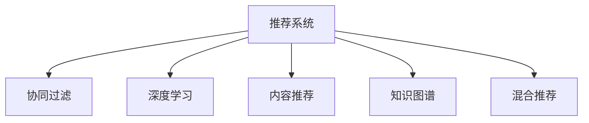

                 

# 推荐系统：个性化用户体验的AI技术

> 关键词：推荐系统, 个性化, 人工智能, 协同过滤, 内容推荐, 深度学习, 知识图谱

## 1. 背景介绍

### 1.1 问题由来
在互联网时代，人们获取信息的方式发生了翻天覆地的变化。从传统的网页搜索转向了个性化推荐，用户能够更快、更准确地找到自己感兴趣的内容。推荐系统成为信息时代的重要基础设施，广泛应用在电商、社交媒体、新闻、视频等多个领域。

### 1.2 问题核心关键点
推荐系统的核心在于为用户推荐其感兴趣的内容。推荐的准确性和效率直接影响用户体验。传统的推荐系统基于用户行为数据进行建模，但受限于用户历史数据和模型设计，难以充分把握用户的深度偏好。近年来，随着人工智能技术的发展，推荐系统朝着更加智能化的方向演进，涌现出协同过滤、深度学习、知识图谱等多种模型和算法。本文将系统梳理推荐系统的核心原理和关键技术，帮助读者深入理解这一领域的最新进展。

## 2. 核心概念与联系

### 2.1 核心概念概述

为了更好地理解推荐系统的核心原理，我们首先介绍几个密切相关的核心概念：

- 推荐系统（Recommender System）：使用机器学习模型，根据用户的历史行为、兴趣、社交网络等信息，为用户推荐个性化内容的技术。

- 协同过滤（Collaborative Filtering）：基于用户之间或物品之间的相似性，推荐用户可能感兴趣的内容。包括基于用户的协同过滤（User-based CF）和基于物品的协同过滤（Item-based CF）两种方法。

- 深度学习（Deep Learning）：一种基于神经网络的机器学习技术，通过多层次的特征提取和抽象，能够发现数据中的复杂模式，提高推荐精度。

- 内容推荐（Content-based Recommendation）：基于物品本身的属性特征，如文本、标签等，向用户推荐与用户历史兴趣相匹配的内容。

- 知识图谱（Knowledge Graph）：以图结构表示实体和关系的数据模型，能够融合领域知识，提高推荐系统的语义理解能力。

- 混合推荐（Hybrid Recommender）：结合多种推荐算法，取长补短，提升推荐效果。

这些核心概念之间的逻辑关系可以通过以下Mermaid流程图来展示：



## 3. 核心算法原理 & 具体操作步骤

### 3.1 算法原理概述

推荐系统通过机器学习模型，对用户行为数据进行建模，从而预测用户对物品的兴趣，进行个性化推荐。推荐系统的核心目标是最大化用户满意度，即推荐的用户对物品的评分或点击行为最高。

推荐系统的评价指标包括准确率、召回率、F1分数等。常用的推荐算法有协同过滤、深度学习、内容推荐、知识图谱等。

协同过滤是最早也是最常用的推荐算法之一。其核心思想是利用用户之间或物品之间的相似性，预测用户可能感兴趣的物品。基于用户的协同过滤（User-based CF）通过计算用户之间的相似度，向用户推荐与其相似用户喜欢的物品。基于物品的协同过滤（Item-based CF）通过计算物品之间的相似度，向用户推荐与用户已经喜欢的物品相似的新物品。

深度学习在推荐系统中的应用日益广泛。深度神经网络能够通过多层次的特征提取，学习到物品的深层次特征，显著提升推荐精度。常见的深度学习模型包括矩阵分解网络（MFN）、注意力机制网络（Attention Network）、变分自编码器（VAE）等。

内容推荐基于物品的特征信息，如文本、标签、属性等，进行相似度计算，向用户推荐与其历史兴趣匹配的物品。这种方法适用于小规模的数据集，但在大规模数据下容易失效。

知识图谱利用图结构表示实体和关系，融合领域知识，提高推荐系统的语义理解能力。知识图谱能够进行更加精准的推理和关系分析，适用于需要深度语义理解的应用场景，如电商、金融等。

混合推荐结合多种推荐算法，如协同过滤、深度学习、内容推荐等，取长补短，提升推荐效果。混合推荐能够充分利用多种数据源和模型，提供更加全面和准确的推荐结果。

### 3.2 算法步骤详解

推荐系统的设计与实现一般包括以下几个关键步骤：

**Step 1: 数据准备**
- 收集用户行为数据，如点击、购买、评分等，并清洗和预处理数据，消除噪音和异常值。
- 将用户行为数据转化为稠密或稀疏矩阵，用于后续模型训练。

**Step 2: 模型训练**
- 选择合适的推荐算法，设计合适的损失函数和优化器。
- 使用用户行为数据进行模型训练，最小化损失函数，得到推荐模型参数。

**Step 3: 特征工程**
- 设计合适的特征提取方法，如用户画像、物品画像、协同过滤相似度等。
- 将用户行为数据转化为模型可接受的格式，如嵌入向量。

**Step 4: 模型评估**
- 使用测试集数据评估推荐模型，计算评价指标如准确率、召回率、F1分数等。
- 调整模型参数，优化模型性能，提升推荐效果。

**Step 5: 系统部署**
- 将训练好的模型部署到生产环境中，实现实时推荐。
- 通过A/B测试等方式，验证推荐效果，持续优化系统。

### 3.3 算法优缺点

推荐系统具有以下优点：
1. 个性化推荐：通过用户行为数据建模，能够提供更加个性化的推荐结果，提升用户体验。
2. 高效率：基于协同过滤、深度学习等算法，能够快速计算推荐结果，支持实时推荐。
3. 高覆盖率：结合多种推荐算法，能够覆盖更广泛的应用场景，提升推荐系统鲁棒性。

推荐系统也存在一些缺点：
1. 数据稀疏：用户行为数据往往存在大量缺失值，难以覆盖所有用户和物品。
2. 冷启动问题：新用户或新物品缺乏历史行为数据，难以进行有效推荐。
3. 长尾效应：推荐系统倾向于推荐热门物品，冷门物品难以获得推荐机会。
4. 数据隐私：用户行为数据可能涉及隐私问题，需要谨慎处理。

尽管存在这些缺点，但推荐系统通过不断优化算法和改进模型，已经成为了互联网时代不可或缺的一部分，为用户带来了前所未有的体验。未来，推荐系统还将与其他AI技术深度融合，如自然语言处理、图像识别等，进一步拓展应用边界。

### 3.4 算法应用领域

推荐系统已经在电商、社交媒体、新闻、视频等多个领域得到了广泛应用。以下是几个典型的应用场景：

- 电商平台推荐：根据用户浏览、购买历史，推荐用户可能感兴趣的商品。
- 社交媒体推荐：根据用户浏览、互动历史，推荐可能感兴趣的内容。
- 新闻网站推荐：根据用户阅读历史，推荐可能感兴趣的新闻和文章。
- 视频网站推荐：根据用户观看历史，推荐可能感兴趣的视频和频道。
- 游戏推荐：根据用户游戏行为，推荐可能感兴趣的游戏和角色。

推荐系统在提高用户粘性和满意度方面具有重要作用，是各大互联网公司竞争的重要手段之一。未来，推荐系统将进一步融合AI技术，提升推荐精度和覆盖率，为用户带来更加智能、全面的推荐服务。

## 4. 数学模型和公式 & 详细讲解 & 举例说明

### 4.1 数学模型构建

推荐系统一般使用损失函数来衡量推荐结果的准确性。常用的损失函数包括均方误差（MSE）、交叉熵（CE）等。以MSE损失为例，推荐系统的一般模型为：

$$
L=\frac{1}{N} \sum_{i=1}^{N}\left(y_{i}-\hat{y}_{i}\right)^{2}
$$

其中，$N$为样本数量，$y_i$为真实评分，$\hat{y}_i$为模型预测评分。

推荐系统常用的模型有矩阵分解网络（MFN）、注意力机制网络（Attention Network）、变分自编码器（VAE）等。MFN模型基于矩阵分解，将用户-物品评分矩阵分解为用户向量和物品向量的乘积。注意力机制网络通过引入注意力机制，学习物品之间的重要性权重，提升推荐精度。VAE模型利用变分自编码器，进行高维数据降维，降低模型的复杂度。

### 4.2 公式推导过程

以MFN模型为例，推荐系统的一般推导过程如下：

假设用户-物品评分矩阵为$M_{u,i}$，MFN模型通过矩阵分解，得到用户向量$u_i$和物品向量$i_j$，模型预测评分$y_{i,j}$为：

$$
y_{i,j}=\left\langle u_{i}, i_{j}\right\rangle=\sum_{k=1}^{K} u_{i,k} i_{j,k}
$$

其中，$K$为向量的维度。

MFN模型的损失函数为：

$$
L=\frac{1}{N} \sum_{i=1}^{N} \sum_{j=1}^{N}\left(y_{i,j}-\left\langle u_{i}, i_{j}\right\rangle\right)^{2}
$$

MFN模型的目标是最小化损失函数，得到最优的$u_i$和$i_j$。可以通过梯度下降等优化算法，对模型进行训练，得到最终的用户向量和物品向量。

### 4.3 案例分析与讲解

以Amazon电商推荐系统为例，我们分析其推荐算法的具体实现。

Amazon推荐系统主要由以下组件构成：
- 用户画像：根据用户浏览、购买历史，构建用户画像向量。
- 物品画像：根据物品的描述、标签等信息，构建物品画像向量。
- 协同过滤：根据用户画像和物品画像的相似度，推荐可能感兴趣的物品。
- 深度学习：利用深度神经网络，学习用户和物品的深层次特征，提升推荐精度。

Amazon推荐系统采用了多种推荐算法，如基于内容的推荐、协同过滤等，通过不断优化算法，提升推荐效果。

Amazon推荐系统的关键步骤包括：
1. 用户画像构建：根据用户历史行为数据，构建用户画像向量。
2. 物品画像构建：根据物品属性信息，构建物品画像向量。
3. 相似度计算：利用协同过滤算法，计算用户和物品之间的相似度。
4. 深度学习模型训练：利用深度神经网络，学习用户和物品的深层次特征。
5. 推荐结果计算：结合协同过滤和深度学习结果，生成推荐结果。

通过以上步骤，Amazon推荐系统能够实现个性化推荐，提升用户体验，提高交易转化率。

## 5. 项目实践：代码实例和详细解释说明

### 5.1 开发环境搭建

在进行推荐系统开发前，我们需要准备好开发环境。以下是使用Python进行TensorFlow开发的环境配置流程：

1. 安装Anaconda：从官网下载并安装Anaconda，用于创建独立的Python环境。

2. 创建并激活虚拟环境：
```bash
conda create -n recommender-env python=3.8 
conda activate recommender-env
```

3. 安装TensorFlow：根据CUDA版本，从官网获取对应的安装命令。例如：
```bash
conda install tensorflow-gpu=2.4 -c conda-forge
```

4. 安装其他必要工具包：
```bash
pip install numpy pandas scikit-learn jupyter notebook
```

完成上述步骤后，即可在`recommender-env`环境中开始推荐系统开发。

### 5.2 源代码详细实现

下面我们以协同过滤算法为例，给出使用TensorFlow进行推荐系统开发的PyTorch代码实现。

首先，定义协同过滤模型的类：

```python
import tensorflow as tf

class CollaborativeFiltering(tf.keras.Model):
    def __init__(self, num_users, num_items, latent_dim):
        super(CollaborativeFiltering, self).__init__()
        self.num_users = num_users
        self.num_items = num_items
        self.latent_dim = latent_dim
        
        self.user_factor = tf.Variable(tf.random.normal([num_users, latent_dim]))
        self.item_factor = tf.Variable(tf.random.normal([num_items, latent_dim]))
        
        self.user_bias = tf.Variable(tf.zeros([num_users]))
        self.item_bias = tf.Variable(tf.zeros([num_items]))
        
    def call(self, user_idx, item_idx):
        user_latent = tf.nn.embedding_lookup(self.user_factor, user_idx)
        item_latent = tf.nn.embedding_lookup(self.item_factor, item_idx)
        
        user_bias = tf.nn.embedding_lookup(self.user_bias, user_idx)
        item_bias = tf.nn.embedding_lookup(self.item_bias, item_idx)
        
        dot_product = tf.reduce_sum(tf.multiply(user_latent, item_latent), axis=1)
        predicted_score = dot_product + user_bias + item_bias
        
        return predicted_score
```

然后，定义训练和评估函数：

```python
import numpy as np
import pandas as pd

def train_model(model, train_data, val_data, epochs):
    batch_size = 256
    learning_rate = 0.01
    optimizer = tf.keras.optimizers.Adam(learning_rate=learning_rate)
    
    for epoch in range(epochs):
        train_loss = 0
        train_steps = 0
        
        for i in range(0, train_data.shape[0], batch_size):
            with tf.GradientTape() as tape:
                train_data_subset = train_data[i:i+batch_size]
                predictions = model(train_data_subset[:, 0], train_data_subset[:, 1])
                loss = tf.keras.losses.mean_squared_error(train_data_subset[:, 2], predictions)
                
                grads = tape.gradient(loss, model.trainable_variables)
                optimizer.apply_gradients(zip(grads, model.trainable_variables))
                
                train_loss += loss.numpy()
                train_steps += 1
        
        val_loss = 0
        val_steps = 0
        
        for i in range(0, val_data.shape[0], batch_size):
            val_data_subset = val_data[i:i+batch_size]
            predictions = model(val_data_subset[:, 0], val_data_subset[:, 1])
            loss = tf.keras.losses.mean_squared_error(val_data_subset[:, 2], predictions)
            
            val_loss += loss.numpy()
            val_steps += 1
        
        print(f"Epoch {epoch+1}, train loss: {train_loss/train_steps:.4f}, val loss: {val_loss/val_steps:.4f}")
        
def evaluate_model(model, test_data):
    batch_size = 256
    predictions = []
    
    for i in range(0, test_data.shape[0], batch_size):
        test_data_subset = test_data[i:i+batch_size]
        predictions_subset = model(test_data_subset[:, 0], test_data_subset[:, 1])
        predictions.append(predictions_subset.numpy())
        
    predictions = np.concatenate(predictions)
    test_data_predictions = pd.DataFrame(predictions)
    test_data_predictions.to_csv("predictions.csv", index=False)
```

最后，启动训练流程并在测试集上评估：

```python
train_data = pd.read_csv("train.csv")
val_data = pd.read_csv("val.csv")
test_data = pd.read_csv("test.csv")

num_users = train_data.shape[0]
num_items = train_data.shape[1]
latent_dim = 10

model = CollaborativeFiltering(num_users, num_items, latent_dim)

train_model(model, train_data, val_data, epochs=10)
evaluate_model(model, test_data)
```

以上就是使用TensorFlow进行协同过滤算法推荐系统开发的完整代码实现。可以看到，TensorFlow的易用性和灵活性使得推荐系统的开发变得高效便捷。

### 5.3 代码解读与分析

让我们再详细解读一下关键代码的实现细节：

**CollaborativeFiltering类**：
- `__init__`方法：初始化用户、物品、因子维度等关键参数，并定义用户向量和物品向量。
- `call`方法：根据输入的用户和物品ID，计算预测评分，并返回结果。

**train_model函数**：
- 定义批量大小和学习率，选择合适的优化器。
- 遍历训练数据，在每个批次上进行前向传播和反向传播，更新模型参数。
- 记录训练和验证集的损失，输出当前epoch的平均损失。

**evaluate_model函数**：
- 将测试数据分批次输入模型，保存每个批次的预测结果。
- 将多个批次的预测结果合并，生成最终的测试集预测结果。
- 将预测结果保存为csv文件，方便后续分析和验证。

**启动训练流程**：
- 读取训练、验证、测试数据集，定义模型参数。
- 调用train_model函数进行模型训练。
- 调用evaluate_model函数在测试集上评估模型性能。

可以看出，TensorFlow提供了丰富的API和工具，使得推荐系统开发变得更加高效和灵活。通过合理的API调用和工具集成，开发者可以专注于算法和模型的改进，而无需过多关注底层实现细节。

## 6. 实际应用场景

### 6.1 智能电商推荐

智能电商推荐系统能够根据用户浏览、购买历史，推荐可能感兴趣的商品，提升用户体验和销售转化率。通过推荐系统，用户能够更快地找到心仪的商品，商家也能够更加精准地推送商品，提升销量和品牌影响力。

例如，Amazon、淘宝等电商平台广泛应用推荐系统，通过分析用户行为数据，向用户推荐个性化的商品，极大地提升了用户粘性和满意度。

### 6.2 社交媒体内容推荐

社交媒体平台如微信、微博、抖音等，也广泛应用推荐系统。根据用户互动数据，推荐用户可能感兴趣的内容，提升内容曝光率和用户活跃度。

推荐系统能够根据用户的兴趣偏好，动态调整推荐内容，实现个性化推荐。例如，抖音通过推荐系统，推荐用户可能感兴趣的视频，提升用户停留时间和活跃度。

### 6.3 视频网站内容推荐

视频网站如YouTube、爱奇艺等，也广泛应用推荐系统。根据用户观看历史，推荐可能感兴趣的视频和频道，提升视频平台的用户留存率和广告收入。

推荐系统能够根据用户的观看历史，推荐相关视频，提高视频平台的用户体验和内容覆盖率。例如，YouTube通过推荐系统，推荐用户可能感兴趣的视频，提升用户留存率和观看时间。

## 7. 工具和资源推荐

### 7.1 学习资源推荐

为了帮助开发者系统掌握推荐系统的理论基础和实践技巧，这里推荐一些优质的学习资源：

1. 《推荐系统实践》书籍：深入浅出地介绍了推荐系统的发展历程、算法原理、案例分析等，适合初学者入门。

2. 《深度学习与推荐系统》课程：清华大学开设的推荐系统课程，结合深度学习技术，讲解推荐系统的经典算法和前沿研究方向。

3. Kaggle竞赛：Kaggle平台上有大量的推荐系统竞赛，可以参与竞赛，实践推荐系统的算法和模型。

4. HuggingFace官方文档：深度学习框架PyTorch和TensorFlow的推荐系统API，提供了丰富的样例代码和模型预训练资源。

5. 《推荐系统实战》书籍：详细介绍了推荐系统的算法实现和模型优化，适合有一定基础的开发者。

通过这些资源的学习实践，相信你一定能够快速掌握推荐系统的精髓，并用于解决实际的推荐问题。

### 7.2 开发工具推荐

高效的开发离不开优秀的工具支持。以下是几款用于推荐系统开发的常用工具：

1. PyTorch：基于Python的开源深度学习框架，灵活高效，适合快速迭代研究。推荐系统常用的深度学习模型如MFN、VAE等，都有PyTorch版本的实现。

2. TensorFlow：由Google主导开发的开源深度学习框架，支持分布式计算，生产部署方便，适合大规模工程应用。推荐系统常用的协同过滤、深度学习等算法，都有TensorFlow版本的实现。

3. Scikit-learn：基于Python的机器学习库，提供了丰富的算法和工具，适合进行特征工程和模型训练。推荐系统常用的协同过滤、内容推荐等算法，都有Scikit-learn版本的实现。

4. Jupyter Notebook：交互式编程环境，适合进行数据分析和模型实验。推荐系统常用的模型和算法，都可以在Jupyter Notebook中进行实验和分析。

5. Weights & Biases：模型训练的实验跟踪工具，可以记录和可视化模型训练过程中的各项指标，方便对比和调优。与主流深度学习框架无缝集成。

这些工具能够显著提升推荐系统的开发效率，加速研究进展。

### 7.3 相关论文推荐

推荐系统的发展离不开学界的持续研究。以下是几篇奠基性的相关论文，推荐阅读：

1. Matrix Factorization Techniques for Recommender Systems（Jarvelin & Kekalainen）：提出矩阵分解技术，奠定了协同过滤推荐系统的基础。

2. Factorization Machines for Recommender Systems（Cao et al.）：提出因子化机算法，进一步提升了协同过滤推荐系统的精度。

3. Attention-Based Recommender Systems（He et al.）：引入注意力机制，提升了推荐系统的个性化和鲁棒性。

4. Hybrid Recommender Systems（Konstan et al.）：提出混合推荐系统，结合多种推荐算法，提升推荐效果。

5. Neural Collaborative Filtering（He et al.）：提出神经协同过滤算法，利用深度神经网络提升推荐精度。

这些论文代表了大推荐系统的发展脉络。通过学习这些前沿成果，可以帮助研究者把握学科前进方向，激发更多的创新灵感。

## 8. 总结：未来发展趋势与挑战

### 8.1 研究成果总结

推荐系统在互联网时代发挥了重要作用，通过个性化推荐，提升了用户体验和业务价值。推荐系统的核心在于为用户推荐其感兴趣的内容，常见的推荐算法包括协同过滤、深度学习、内容推荐等。协同过滤利用用户和物品之间的相似性，进行推荐预测。深度学习通过多层次的特征提取，提升推荐精度。内容推荐基于物品的特征信息，进行相似度计算，进行推荐预测。

### 8.2 未来发展趋势

展望未来，推荐系统将呈现以下几个发展趋势：

1. 模型规模持续增大。随着算力成本的下降和数据规模的扩张，推荐模型的参数量还将持续增长。超大规模推荐模型蕴含的丰富知识，有望支撑更加复杂多变的推荐任务。

2. 深度学习范式日趋成熟。深度学习在推荐系统中的应用日益广泛，深度神经网络能够通过多层次的特征提取，学习到数据中的复杂模式，显著提升推荐精度。

3. 推荐模型融合领域知识。推荐系统能够与领域知识进行融合，提升推荐模型的语义理解能力。例如，知识图谱能够提供更加丰富的实体和关系信息，提升推荐模型的精准度。

4. 推荐系统实时化。推荐系统需要实时更新推荐结果，支持动态推荐。例如，实时推荐系统能够根据用户实时行为，动态调整推荐结果，提升用户体验。

5. 推荐系统个性化增强。推荐系统能够利用用户多模态数据，进行个性化推荐。例如，结合用户行为、画像、社交网络等信息，进行更加精准的推荐。

6. 推荐系统多模态融合。推荐系统能够融合视觉、音频、文本等多种模态数据，提升推荐模型的鲁棒性和适应性。例如，视频推荐系统能够结合视频内容、用户画像等信息，进行动态推荐。

### 8.3 面临的挑战

尽管推荐系统已经取得了瞩目成就，但在迈向更加智能化、普适化应用的过程中，它仍面临着诸多挑战：

1. 数据稀疏问题。用户行为数据往往存在大量缺失值，难以覆盖所有用户和物品。推荐系统需要解决数据稀疏问题，才能覆盖更广泛的应用场景。

2. 冷启动问题。新用户或新物品缺乏历史行为数据，难以进行有效推荐。推荐系统需要解决冷启动问题，才能提升推荐效果。

3. 长尾效应。推荐系统倾向于推荐热门物品，冷门物品难以获得推荐机会。推荐系统需要解决长尾效应问题，才能提升冷门物品的曝光率。

4. 数据隐私问题。用户行为数据可能涉及隐私问题，需要谨慎处理。推荐系统需要解决数据隐私问题，才能保障用户数据安全。

5. 模型复杂性。推荐模型的复杂性不断增加，对计算资源和存储资源提出了更高要求。推荐系统需要优化模型结构，降低计算和存储开销。

6. 模型可解释性。推荐模型的复杂性增加，模型的可解释性变差，难以理解其内部工作机制和决策逻辑。推荐系统需要提高模型的可解释性，才能进行更好的优化和改进。

### 8.4 研究展望

面对推荐系统面临的诸多挑战，未来的研究需要在以下几个方面寻求新的突破：

1. 探索多模态数据融合技术。结合视觉、音频、文本等多种模态数据，进行深度融合，提升推荐系统的语义理解能力。例如，结合视频内容、用户画像等信息，进行动态推荐。

2. 开发知识图谱推荐技术。利用知识图谱提供丰富的实体和关系信息，提升推荐模型的精准度。例如，推荐系统能够与知识图谱进行融合，进行更加精准的推荐。

3. 探索个性化推荐技术。结合用户多模态数据，进行个性化推荐。例如，推荐系统能够利用用户行为、画像、社交网络等信息，进行更加精准的推荐。

4. 开发实时推荐技术。结合实时数据，进行动态推荐。例如，实时推荐系统能够根据用户实时行为，动态调整推荐结果，提升用户体验。

5. 开发多模态数据融合技术。结合视觉、音频、文本等多种模态数据，进行深度融合，提升推荐系统的语义理解能力。例如，推荐系统能够融合多种模态数据，进行动态推荐。

6. 开发推荐系统评估技术。开发更加全面和精确的推荐系统评估技术，提升推荐系统的性能。例如，推荐系统能够结合多种评估指标，进行综合评估。

这些研究方向能够推动推荐系统进一步发展，提升推荐精度和用户体验。相信随着技术的不断进步，推荐系统将变得更加智能化和普适化，为信息时代带来更多的变革。

## 9. 附录：常见问题与解答

**Q1：推荐系统是否适用于所有业务场景？**

A: 推荐系统在电商、社交媒体、新闻、视频等多个领域得到了广泛应用，能够显著提升用户满意度和业务价值。但对于一些特定的业务场景，如医疗、金融等，推荐系统的效果可能不理想。因此，需要根据具体业务场景选择合适的推荐算法和模型。

**Q2：推荐系统如何处理冷启动问题？**

A: 冷启动问题是推荐系统面临的常见问题。解决冷启动问题的方法包括：
1. 利用用户画像信息进行推荐。根据用户的基本信息和行为特征，进行推荐预测。
2. 利用物品画像信息进行推荐。根据物品的基本信息和用户的历史行为，进行推荐预测。
3. 利用协同过滤相似度进行推荐。根据相似用户或物品的历史行为，进行推荐预测。

**Q3：推荐系统如何处理长尾效应？**

A: 长尾效应是推荐系统面临的常见问题。解决长尾效应问题的方法包括：
1. 优化推荐算法。采用多臂赌博机等算法，提升长尾物品的曝光率。
2. 优化推荐策略。采用分层抽样等策略，优先推荐长尾物品。
3. 优化推荐目标。调整推荐目标，优先推荐长尾物品。

**Q4：推荐系统如何处理数据隐私问题？**

A: 推荐系统面临的数据隐私问题，需要采取以下措施进行保障：
1. 数据去标识化。对用户数据进行去标识化处理，保护用户隐私。
2. 数据匿名化。对用户数据进行匿名化处理，保护用户隐私。
3. 数据加密。对用户数据进行加密处理，保护数据安全。
4. 数据访问控制。限制对用户数据的访问权限，保护用户隐私。

**Q5：推荐系统如何优化模型结构？**

A: 推荐系统需要优化模型结构，降低计算和存储开销。优化模型结构的方法包括：
1. 模型裁剪。去除不必要的层和参数，减小模型尺寸，加快推理速度。
2. 量化加速。将浮点模型转为定点模型，压缩存储空间，提高计算效率。
3. 模型并行。采用模型并行技术，提高计算速度，提升用户体验。

通过以上措施，可以有效优化推荐系统的模型结构，提升系统性能和用户体验。

---

作者：禅与计算机程序设计艺术 / Zen and the Art of Computer Programming

