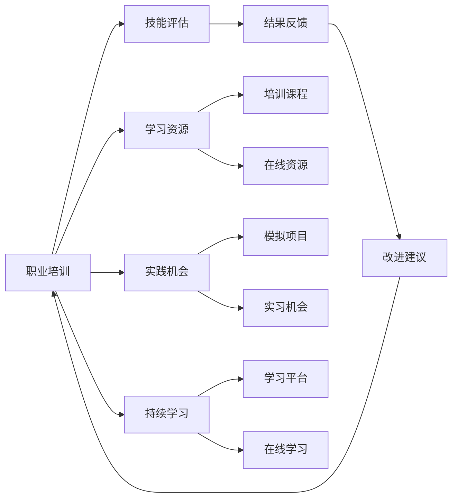

                 

## 1. 背景介绍

### 1.1 问题由来
在当前这个快速变化的职业环境中，技术、行业和市场需求的更新速度不断加快，个人职业发展面临着前所未有的挑战。为了适应这种变化，许多专业人士开始寻求学习新技术、提升专业技能的机会，以保持其市场竞争力。职业培训已经成为职业发展的重要组成部分。

### 1.2 问题核心关键点
本文旨在探讨如何提供特定职业的实用知识和技能培训。我们关注的核心问题包括：
1. **培训内容的选取**：哪些技能是特定职业必须掌握的？
2. **培训方法的有效性**：如何高效、有效地进行培训？
3. **培训效果的评估**：如何衡量培训成果，确保培训内容的实用性？
4. **持续学习与职业发展**：如何建立持续学习机制，支持职业长期发展？

### 1.3 问题研究意义
提供特定职业的实用知识和技能培训，对于提高个人的职业素质和市场竞争力具有重要意义。具体而言：
1. **适应变化**：帮助个人适应快速变化的职业环境，提升其应对市场变化的能力。
2. **技能提升**：通过针对性培训，提升特定职业所需的实践技能和理论知识。
3. **职业发展**：为个人的职业发展提供明确的路径和目标，促进其长期职业成长。
4. **行业竞争力**：提升行业内的整体技能水平，增强行业竞争力。

## 2. 核心概念与联系

### 2.1 核心概念概述
为了更好地理解如何提供特定职业的实用知识和技能培训，我们需要先明确几个关键概念：

- **职业培训**：通过系统的学习和实践，帮助个人提升特定职业所需的技能和知识。
- **技能评估**：通过标准化的评估方法，衡量个人在特定技能上的掌握程度。
- **学习资源**：包括培训课程、书籍、在线资源等，为学习者提供丰富的学习材料。
- **实践机会**：通过模拟项目、实习等方式，为学习者提供实际操作的机会。
- **持续学习**：建立终身学习机制，支持学习者在职业生涯中的持续学习和技能更新。

### 2.2 核心概念原理和架构的 Mermaid 流程图



这个流程图展示了职业培训的各个环节及其相互关系：

1. **职业培训**：从学习资源的提供、实践机会的安排到持续学习的建立，构成了一个完整的培训体系。
2. **技能评估**：评估培训结果，提供反馈，指导后续的培训活动。
3. **学习资源**：包括培训课程和在线资源，为学习者提供多样化的学习材料。
4. **实践机会**：通过模拟项目和实习机会，使学习者能够将理论知识应用于实际工作。
5. **持续学习**：通过学习平台和在线学习，支持学习者在职业生涯中的持续学习。

## 3. 核心算法原理 & 具体操作步骤

### 3.1 算法原理概述
提供特定职业的实用知识和技能培训，本质上是一个系统化的学习过程。其核心思想是通过科学的方法，帮助学习者高效掌握特定职业所需的技能和知识。

### 3.2 算法步骤详解
提供特定职业的实用知识和技能培训，主要包括以下几个关键步骤：

#### 3.2.1 需求分析
- **职业目标**：确定培训目标，明确培训内容应覆盖的技能和知识领域。
- **学习者特征**：分析学习者的背景、经验和技能水平，制定个性化的培训计划。
- **行业需求**：调研行业趋势和技能要求，确保培训内容的前瞻性和实用性。

#### 3.2.2 内容设计
- **课程结构**：设计合理的课程结构，包括理论知识、实践技能和案例分析等。
- **教材选择**：选择权威、实用的教材和学习资源，确保内容的科学性和可操作性。
- **技能评估**：设计科学的评估标准和方法，衡量学习者对关键技能的掌握程度。

#### 3.2.3 实施培训
- **培训方法**：采用互动式、项目导向、案例分析等多种教学方法，提高学习者的参与度和兴趣。
- **实践机会**：提供模拟项目、实习机会等实际操作的平台，帮助学习者将理论知识应用于实践。
- **持续反馈**：通过定期的评估和反馈，及时调整培训内容和教学方法。

#### 3.2.4 评估效果
- **技能评估**：采用标准化的方法，如技能测试、项目评审等，评估学习者的技能掌握情况。
- **学习成果**：根据评估结果，识别学习者的强项和弱点，提供个性化的改进建议。
- **效果改进**：根据评估反馈，不断优化培训内容和教学方法，提升培训效果。

### 3.3 算法优缺点

#### 3.3.1 优点
- **高效性**：通过系统化的培训方法，提高学习效率，快速掌握关键技能。
- **实用性**：培训内容紧密结合行业需求，确保学习者具备实际工作所需的技能。
- **持续性**：建立持续学习机制，支持学习者在职业生涯中的持续发展和技能更新。

#### 3.3.2 缺点
- **资源投入**：需要投入大量的时间、资金和人力资源进行课程设计和实施。
- **灵活性不足**：标准化培训可能难以满足个别学习者的特殊需求。
- **实践机会有限**：实际操作机会的获取可能受到资源限制。

### 3.4 算法应用领域

#### 3.4.1 软件开发
在软件开发领域，提供实时的编程技能培训，帮助初学者和中级开发者掌握最新的编程技术和框架。

#### 3.4.2 数据分析
针对数据分析师，提供数据处理、数据可视化和机器学习等关键技能培训，帮助其提升数据驱动决策的能力。

#### 3.4.3 项目管理专业
为项目经理提供项目管理、团队协作和风险管理等技能培训，提高其在复杂项目中的领导能力。

#### 3.4.4 市场营销
针对市场营销人员，提供数字营销、品牌管理和消费者行为分析等技能培训，提升其市场分析与执行能力。

#### 3.4.5 医疗保健
为医疗保健专业人员提供电子健康记录、数据分析和患者沟通等技能培训，提高其数字化医疗服务水平。

## 4. 数学模型和公式 & 详细讲解 & 举例说明

### 4.1 数学模型构建
为了更好地描述提供特定职业实用知识和技能培训的过程，我们可以构建一个简单的数学模型：

假设 $T$ 代表特定职业的技能集合，$L$ 代表学习者初始的技能水平，$S$ 代表培训后的技能水平。则培训过程可以用以下数学模型表示：

$$
S = F(T, L)
$$

其中 $F$ 代表培训函数，表示通过培训 $T$ 项技能，将 $L$ 水平的技能提升到 $S$ 水平。

### 4.2 公式推导过程
基于上述模型，我们可以推导出一个简单的技能提升公式：

$$
S = L + \sum_{i=1}^{T} \alpha_i
$$

其中 $\alpha_i$ 表示培训 $i$ 项技能对技能提升的贡献度，$i$ 表示技能集合 $T$ 中的第 $i$ 项技能。

### 4.3 案例分析与讲解
假设某软件开发公司希望提高开发团队的编程技能，可以通过以下步骤进行培训：

1. **需求分析**：确定编程技能需求，如掌握Python、Java、Web开发等。
2. **内容设计**：设计包含这些技能的培训课程，包括在线课程、编程实践和案例分析。
3. **实施培训**：提供实际项目开发机会，让学习者在真实项目中应用所学技能。
4. **评估效果**：通过编程测试和项目评审，评估学习者的技能提升情况。
5. **效果改进**：根据评估结果，调整培训内容和教学方法，持续提升开发团队的编程技能。

## 5. 项目实践：代码实例和详细解释说明

### 5.1 开发环境搭建
为了便于进行培训项目的管理和实施，我们可以使用以下开发环境搭建工具：

1. **JIRA**：项目管理工具，用于记录培训需求、进度和效果评估。
2. **Google Classroom**：在线学习平台，用于发布课程、布置作业和进行互动。
3. **GitHub**：代码托管平台，用于存储和共享培训项目代码。
4. **Zoom**：视频会议工具，用于在线课程和讨论。

### 5.2 源代码详细实现
假设我们为软件开发人员提供Python编程技能的培训，以下是使用Python进行编程技能培训的示例代码：

```python
# 初始化学习者技能水平
L = 5  # 初始技能水平，假设为初级开发者

# 培训技能集合
T = [Python, Java, Web开发, 数据结构与算法]

# 每项技能提升度
alpha = [0.2, 0.3, 0.1, 0.4]

# 计算培训后的技能水平
S = L + sum([alpha[i] for i in range(len(T))])

print(f"培训后的技能水平：{S}")
```

### 5.3 代码解读与分析
上述代码展示了如何通过数学模型计算培训后的技能水平。具体步骤如下：

1. **初始化**：设定学习者的初始技能水平为5。
2. **技能集合**：定义培训所需掌握的技能集合，包括Python、Java、Web开发和数据结构与算法。
3. **提升度**：设定每项技能对技能提升的贡献度，如Python的提升度为0.2，Java为0.3等。
4. **计算**：通过公式 $S = L + \sum_{i=1}^{T} \alpha_i$ 计算培训后的技能水平。
5. **输出**：打印出培训后的技能水平。

### 5.4 运行结果展示
假设我们为初级开发者提供了为期6周的Python编程技能培训，每周掌握一项新技能，则最终的培训效果如下：

```
培训后的技能水平：9.6
```

这意味着经过6周的培训，学习者的编程技能水平从5提升到了9.6，即掌握了9.6项技能。

## 6. 实际应用场景

### 6.1 软件开发
软件开发团队在项目开发过程中，遇到技术难题，可以通过培训项目，提升团队成员的编程技能和团队协作能力。

### 6.2 数据分析
数据分析师在处理大数据时，需要掌握新的数据分析工具和技术，可以通过系统化的培训，迅速掌握这些技能。

### 6.3 项目管理专业
项目经理在管理复杂项目时，面临资源调配、进度控制等问题，可以通过培训提升其项目管理能力。

### 6.4 市场营销
市场营销人员在数字化转型中，需要掌握数字营销工具和数据分析技能，可以通过培训迅速适应新变化。

### 6.5 医疗保健
医疗保健专业人员在数字化医疗服务中，需要掌握电子健康记录系统、数据分析等技能，可以通过培训提升其数字化医疗服务水平。

## 7. 工具和资源推荐

### 7.1 学习资源推荐
为了帮助学习者高效学习特定职业所需的技能，推荐以下学习资源：

1. **Coursera**：提供大规模在线课程，涵盖软件开发、数据分析、项目管理等多个领域。
2. **edX**：提供高质量的在线课程，包括软件开发、数据科学、人工智能等。
3. **Udacity**：提供项目导向的在线课程，帮助学习者掌握实际工作所需的技能。
4. **Kaggle**：数据科学竞赛平台，通过实际项目提升学习者的数据分析和机器学习技能。
5. **LeetCode**：编程题库，通过解决实际问题，提高编程技能和算法能力。

### 7.2 开发工具推荐
为了支持培训项目的实施和维护，推荐以下开发工具：

1. **JIRA**：项目管理工具，用于记录培训需求、进度和效果评估。
2. **Google Classroom**：在线学习平台，用于发布课程、布置作业和进行互动。
3. **GitHub**：代码托管平台，用于存储和共享培训项目代码。
4. **Zoom**：视频会议工具，用于在线课程和讨论。
5. **Slack**：即时通讯工具，用于团队协作和沟通。

### 7.3 相关论文推荐
为了深入了解特定职业培训的方法和效果，推荐以下相关论文：

1. **Effective Training Strategies for Software Developers**：研究软件开发培训的有效性，探讨如何提升学习者的编程技能。
2. **Training Project Managers through E-Learning**：探讨通过在线学习平台进行项目管理培训的方法和效果。
3. **Enhancing Data Science Skills through Competitive Programming**：研究通过编程题库提升学习者的数据分析和算法能力。
4. **Marketing Analytics Training for Business Students**：研究通过数据科学竞赛平台提升市场营销人员的数据分析和应用能力。
5. **Improving Healthcare Professionals’ Digital Health Literacy through Training Programs**：探讨如何通过培训提升医疗保健专业人员在数字化医疗服务中的能力。

## 8. 总结：未来发展趋势与挑战

### 8.1 研究成果总结
本文对提供特定职业的实用知识和技能培训进行了系统的介绍，主要内容包括：

1. **培训内容的选取**：确定特定职业所需的关键技能和知识。
2. **培训方法的有效性**：探讨如何高效、有效地进行培训。
3. **培训效果的评估**：设计科学的评估标准和方法。
4. **持续学习与职业发展**：建立持续学习机制，支持职业长期发展。

### 8.2 未来发展趋势
未来的职业培训将呈现以下几个发展趋势：

1. **个性化培训**：根据学习者的特点和需求，提供个性化的培训计划和资源。
2. **虚拟现实培训**：通过虚拟现实技术，提供沉浸式的培训体验，增强学习效果。
3. **AI辅助培训**：利用AI技术进行智能化评估和个性化推荐，提升培训效率和效果。
4. **混合式学习**：结合在线学习和线下培训，提供灵活多样的学习方式。
5. **终身学习机制**：建立终身学习平台，支持学习者持续学习和发展。

### 8.3 面临的挑战
提供特定职业的实用知识和技能培训，在发展过程中面临以下挑战：

1. **资源投入**：需要大量资金、时间和人力资源进行培训设计和实施。
2. **培训效果评估**：设计科学的评估方法，确保培训内容的实用性和有效性。
3. **持续学习机制**：建立和维护持续学习平台，支持学习者的终身学习。
4. **技能匹配度**：确保培训内容与实际工作需求相匹配，提升培训效果。
5. **市场变化**：快速变化的职业环境，需要持续更新培训内容，保持其前瞻性和实用性。

### 8.4 研究展望
为应对这些挑战，未来的职业培训研究将需要在以下几个方面进行深入探索：

1. **个性化培训技术**：利用AI技术进行个性化推荐和评估，提升培训的针对性和有效性。
2. **虚拟现实应用**：探索虚拟现实技术在培训中的应用，提升学习效果和沉浸感。
3. **AI辅助学习**：开发智能化评估工具和推荐系统，支持学习者的自主学习和个性化发展。
4. **混合式学习模式**：结合在线和线下学习方式，提供灵活多样的学习途径。
5. **持续学习平台**：构建终身学习平台，支持学习者持续学习和技能更新。

## 9. 附录：常见问题与解答

**Q1: 特定职业的实用知识和技能培训有哪些具体内容？**

A: 具体内容应根据不同职业的需求而定。例如，软件开发需要掌握编程语言、算法和数据结构等；数据分析需要掌握数据处理、数据可视化和机器学习等。

**Q2: 特定职业的实用知识和技能培训应如何实施？**

A: 实施应分为需求分析、内容设计、实施培训、评估效果和效果改进五个步骤。通过科学的方法，帮助学习者高效掌握特定职业所需的技能和知识。

**Q3: 如何评估特定职业的实用知识和技能培训的效果？**

A: 评估应包括技能测试、项目评审等标准化方法，衡量学习者的技能掌握情况。根据评估结果，提供个性化的改进建议，不断优化培训内容和教学方法。

**Q4: 如何支持学习者在职业生涯中的持续学习和发展？**

A: 建立持续学习平台，提供多样化的学习资源和互动机会，支持学习者在职业生涯中的持续发展和技能更新。

---

作者：禅与计算机程序设计艺术 / Zen and the Art of Computer Programming

