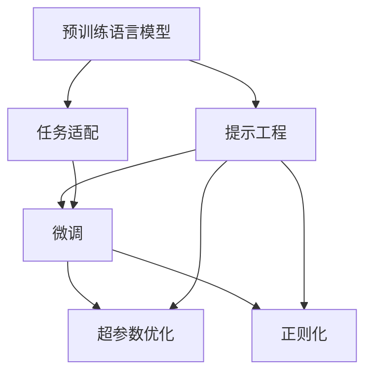

                 

# 提示工程在AI开发中的重要性

## 1. 背景介绍

在人工智能(AI)开发领域，尤其是自然语言处理(NLP)领域，提示工程(Prompt Engineering)作为一项关键技术，其重要性日益凸显。提示工程涉及通过设计合适的文本提示（Prompt），引导AI模型进行预测、分类、生成等任务。随着深度学习技术的进步，大型预训练语言模型（如BERT、GPT-3等）在各类NLP任务中表现出色，然而这些模型往往在特定应用场景中表现欠佳。提示工程便是在这种情况下，通过精心设计的提示，使得模型能够更好地适应特定任务需求，从而提升AI系统的性能和泛化能力。

### 1.1 提示工程的起源与发展

提示工程的概念最早可追溯至人类与AI系统的交互过程中。在早期的AI研究中，研究者们使用固定脚本或模板来指导AI模型进行特定任务。随着深度学习模型的发展，研究者们发现，通过精心设计的提示，能够显著提升AI模型的任务完成能力。特别是在预训练语言模型（如BERT、GPT-3等）出现后，提示工程更是成为了提升模型性能的有效手段。如今，提示工程已成为NLP领域不可或缺的一部分，广泛应用于各类AI系统中，如对话系统、文本生成、问答系统等。

## 2. 核心概念与联系

### 2.1 核心概念概述

为理解提示工程的重要性，我们首先需要介绍几个关键概念：

- **提示（Prompt）**：用于引导AI模型进行任务处理的文本输入。提示可以是自然语言形式，也可以是结构化数据形式。
- **预训练语言模型（PLMs）**：如BERT、GPT系列等，通过在大量无标签文本上预训练，学习到通用的语言表示。
- **任务适配（Task-tuning）**：通过特定任务的少量标注数据，对预训练模型进行微调，使其能够更好地适应任务需求。
- **超参数优化**：通过调整学习率、批量大小等超参数，优化模型性能。
- **正则化技术**：如L2正则、Dropout等，防止模型过拟合。

这些概念之间通过提示工程连接起来，共同构成了一个完整的AI开发流程。

### 2.2 核心概念之间的联系

提示工程连接了预训练语言模型和特定任务之间的桥梁。通过精心设计的提示，可以引导模型更好地理解任务需求，从而在微调过程中更加高效地学习任务相关的知识。正则化技术可以进一步提升模型的鲁棒性和泛化能力，而超参数优化则可以帮助我们找到最优的模型配置，提升模型性能。以下是一个简单的Mermaid流程图，展示了提示工程在AI开发中的位置及其与其他核心概念的联系：



## 3. 核心算法原理 & 具体操作步骤

### 3.1 算法原理概述

提示工程的核心理念是通过设计合适的提示，使得模型能够更好地理解任务。形式化地说，假设我们有预训练语言模型 $M$，需要在新任务 $T$ 上进行微调，我们希望模型能够输出与任务相关的输出 $y$。在提示工程中，我们设计一个提示 $p$，将其与输入 $x$ 结合起来，作为模型的输入 $(x, p)$。模型的输出 $y$ 为 $M(x, p)$。

### 3.2 算法步骤详解

提示工程通常包括以下几个关键步骤：

**Step 1: 设计提示**  
提示设计是提示工程的关键步骤。设计好的提示需要包含足够的任务信息，同时要避免信息冗余或歧义，以确保模型能够准确理解任务。例如，对于文本生成任务，提示可以包含生成内容的类型、风格等。

**Step 2: 选择合适的预训练模型**  
选择适合任务的预训练模型是提示工程的基础。不同的预训练模型在特定任务上的表现可能不同，需要根据任务需求选择合适的模型。

**Step 3: 训练提示模型**  
训练提示模型的过程通常涉及将提示与标注数据结合起来，进行有监督学习。在训练过程中，需要不断调整提示设计，直到模型能够准确完成任务。

**Step 4: 微调模型**  
在提示模型的基础上，可以使用微调技术进一步提升模型性能。微调通常涉及将提示和模型结合起来，进行任务特定的训练。

**Step 5: 评估与优化**  
在模型训练完成后，需要对模型性能进行评估，并根据评估结果进行优化。这可能涉及到进一步调整提示设计或微调超参数等。

### 3.3 算法优缺点

提示工程的优势在于其灵活性和高效性。通过精心设计的提示，可以显著提升模型性能，特别是在数据稀缺或任务复杂的情况下。然而，提示工程也存在一些缺点：

- **提示设计复杂**：提示设计需要具备一定的领域知识和创造力，对于非专业开发者来说，可能需要较长时间的学习和实践。
- **模型依赖性强**：提示工程的效果依赖于预训练模型的质量和性能，模型的选择不当可能导致提示设计失败。
- **过拟合风险**：提示设计不当可能导致模型过拟合，泛化能力下降。
- **资源消耗大**：提示工程涉及到大量的文本生成和模型训练，需要较大的计算资源和时间。

### 3.4 算法应用领域

提示工程在NLP领域有着广泛的应用，以下是几个典型的应用场景：

- **文本生成**：通过设计合适的提示，引导模型生成不同类型的文本，如新闻报道、技术文档、文学作品等。
- **问答系统**：提示设计可以帮助问答系统理解用户查询，并给出准确的回答。
- **机器翻译**：提示可以指导模型进行语言翻译，提升翻译的准确性和流畅性。
- **情感分析**：提示可以帮助情感分析模型理解文本情感，进行情感分类。
- **推荐系统**：提示可以指导推荐系统理解用户偏好，推荐更符合用户需求的物品。

## 4. 数学模型和公式 & 详细讲解

### 4.1 数学模型构建

在提示工程中，我们通常使用预训练语言模型作为基础，在提示 $p$ 的指导下，对模型进行训练。我们定义提示模型 $M_{\theta}(x, p)$，其中 $\theta$ 为模型参数。假设我们有一组训练数据 $(x_i, y_i)$，目标是最小化损失函数 $\mathcal{L}$：

$$
\mathcal{L} = \frac{1}{N} \sum_{i=1}^N \ell(M_{\theta}(x_i, p), y_i)
$$

其中 $\ell$ 为损失函数，如交叉熵损失。

### 4.2 公式推导过程

以文本分类任务为例，我们假设有一个提示 $p$，引导模型对输入 $x$ 进行分类。模型的输出为 $\hat{y} = M_{\theta}(x, p)$，我们希望其与真实标签 $y$ 尽可能接近。此时，我们使用交叉熵损失函数 $\ell$：

$$
\ell(\hat{y}, y) = -(y\log \hat{y} + (1-y)\log (1-\hat{y}))
$$

模型在提示 $p$ 下的损失函数可以表示为：

$$
\mathcal{L} = \frac{1}{N} \sum_{i=1}^N \ell(M_{\theta}(x_i, p), y_i)
$$

通过对 $\theta$ 进行优化，使得 $\mathcal{L}$ 最小化。具体优化过程如下：

1. 前向传播：计算 $M_{\theta}(x, p)$。
2. 计算损失：计算 $\ell(M_{\theta}(x_i, p), y_i)$。
3. 反向传播：计算 $\frac{\partial \mathcal{L}}{\partial \theta}$。
4. 更新参数：使用梯度下降等优化算法，更新 $\theta$。

### 4.3 案例分析与讲解

以GPT-3为例，我们设计一个提示 $p$，引导模型进行文本生成任务：

```text
Write a story about a summer day in the mountains.
```

该提示指示模型生成关于夏季山区的故事。在训练过程中，我们将提示与标注数据结合，进行有监督学习。通过不断调整提示设计，直到模型能够生成符合要求的文本。

## 5. 项目实践：代码实例和详细解释说明

### 5.1 开发环境搭建

在进行提示工程实践前，我们需要准备好开发环境。以下是使用Python进行PyTorch开发的环境配置流程：

1. 安装Anaconda：从官网下载并安装Anaconda，用于创建独立的Python环境。

2. 创建并激活虚拟环境：
```bash
conda create -n pytorch-env python=3.8 
conda activate pytorch-env
```

3. 安装PyTorch：根据CUDA版本，从官网获取对应的安装命令。例如：
```bash
conda install pytorch torchvision torchaudio cudatoolkit=11.1 -c pytorch -c conda-forge
```

4. 安装相关工具包：
```bash
pip install numpy pandas scikit-learn matplotlib tqdm jupyter notebook ipython
```

完成上述步骤后，即可在`pytorch-env`环境中开始提示工程实践。

### 5.2 源代码详细实现

这里以GPT-3为例，展示使用PyTorch进行提示工程的代码实现：

```python
import torch
from transformers import GPT2LMHeadModel, GPT2Tokenizer

# 初始化模型和tokenizer
model = GPT2LMHeadModel.from_pretrained('gpt2')
tokenizer = GPT2Tokenizer.from_pretrained('gpt2')

# 定义提示
prompt = "Write a story about a summer day in the mountains."

# 生成文本
input_ids = tokenizer(prompt, return_tensors='pt').input_ids.to('cuda')
output = model.generate(input_ids, max_length=128, temperature=0.9)
generated_text = tokenizer.decode(output[0], skip_special_tokens=True)

print(generated_text)
```

在上述代码中，我们首先加载了GPT-2模型和对应的tokenizer，定义了一个关于夏季山区的提示。接着，将提示转换为模型所需的input_ids格式，并在模型上进行生成。最后，将生成的文本解码输出。

### 5.3 代码解读与分析

让我们再详细解读一下关键代码的实现细节：

**GPT2LMHeadModel和GPT2Tokenizer**：
- `GPT2LMHeadModel`类：GPT-2模型的核心类，负责生成文本。
- `GPT2Tokenizer`类：用于将文本转换为模型所需的input_ids格式。

**生成文本**：
- `tokenizer(prompt, return_tensors='pt').input_ids.to('cuda')`：将提示转换为input_ids格式，并移动到GPU上进行计算。
- `model.generate(input_ids, max_length=128, temperature=0.9)`：使用模型进行生成，`max_length`参数控制生成文本的长度，`temperature`参数控制生成文本的多样性。
- `tokenizer.decode(output[0], skip_special_tokens=True)`：将生成的output_ids解码为文本，`skip_special_tokens=True`参数跳过特殊标记。

**输出结果**：
- `generated_text`：生成的文本，符合提示要求，展示了提示工程的效果。

## 6. 实际应用场景

### 6.1 智能客服系统

在智能客服系统中，提示工程可以用于设计响应提示，帮助机器人更好地理解用户查询，并给出准确的回答。例如，当用户询问关于产品的退货政策时，系统可以设计一个提示，引导机器人理解退货流程和政策细节，从而给出准确的回答。

### 6.2 金融舆情监测

在金融舆情监测中，提示工程可以用于生成针对特定话题的文本摘要或新闻标题。例如，针对金融市场的波动，系统可以设计一个提示，引导模型生成关于市场波动的摘要或新闻标题，帮助分析师快速获取关键信息。

### 6.3 个性化推荐系统

在个性化推荐系统中，提示工程可以用于生成推荐理由，帮助用户理解推荐物品的合理性。例如，当推荐系统推荐某本书籍时，可以设计一个提示，引导模型生成关于书籍的推荐理由，帮助用户理解推荐逻辑。

### 6.4 未来应用展望

随着深度学习技术的进步，提示工程的应用场景将越来越广泛。未来，提示工程将在以下几个领域发挥更大的作用：

- **多模态信息融合**：提示工程可以用于设计多模态信息融合的模型，结合文本、图像、视频等多种信息，提升模型的性能。
- **知识图谱整合**：提示工程可以用于设计知识图谱整合的模型，结合外部知识库，提升模型的知识表达能力。
- **跨领域迁移学习**：提示工程可以用于设计跨领域迁移学习的模型，提升模型在不同领域间的适应能力。
- **自监督学习**：提示工程可以用于设计自监督学习的模型，提升模型的泛化能力和鲁棒性。

## 7. 工具和资源推荐

### 7.1 学习资源推荐

为了帮助开发者系统掌握提示工程的理论基础和实践技巧，这里推荐一些优质的学习资源：

1. 《Prompt Engineering in AI》系列博文：由AI研究者撰写，深入浅出地介绍了提示工程的概念、原理和实践方法。

2. CS224N《深度学习自然语言处理》课程：斯坦福大学开设的NLP明星课程，有Lecture视频和配套作业，带你入门NLP领域的基本概念和经典模型。

3. 《Prompt-based Learning for Natural Language Processing》书籍：介绍了多种提示设计和生成方法，适用于提示工程的研究和实践。

4. HuggingFace官方文档：提供了丰富的预训练模型和提示工程样例代码，是上手实践的必备资料。

5. CLUE开源项目：提供了大量提示工程应用的示例代码，助力提示工程技术的发展。

通过对这些资源的学习实践，相信你一定能够快速掌握提示工程的技巧，并用于解决实际的AI问题。

### 7.2 开发工具推荐

高效的开发离不开优秀的工具支持。以下是几款用于提示工程开发的常用工具：

1. PyTorch：基于Python的开源深度学习框架，灵活动态的计算图，适合快速迭代研究。大部分预训练语言模型都有PyTorch版本的实现。

2. TensorFlow：由Google主导开发的开源深度学习框架，生产部署方便，适合大规模工程应用。同样有丰富的预训练语言模型资源。

3. Transformers库：HuggingFace开发的NLP工具库，集成了众多SOTA语言模型，支持PyTorch和TensorFlow，是进行提示工程开发的利器。

4. Weights & Biases：模型训练的实验跟踪工具，可以记录和可视化模型训练过程中的各项指标，方便对比和调优。与主流深度学习框架无缝集成。

5. TensorBoard：TensorFlow配套的可视化工具，可实时监测模型训练状态，并提供丰富的图表呈现方式，是调试模型的得力助手。

6. Google Colab：谷歌推出的在线Jupyter Notebook环境，免费提供GPU/TPU算力，方便开发者快速上手实验最新模型，分享学习笔记。

合理利用这些工具，可以显著提升提示工程任务的开发效率，加快创新迭代的步伐。

### 7.3 相关论文推荐

提示工程作为一项重要的AI技术，其研究进展也得到了学界的广泛关注。以下是几篇奠基性的相关论文，推荐阅读：

1. Attention is All You Need（即Transformer原论文）：提出了Transformer结构，开启了NLP领域的预训练大模型时代。

2. BERT: Pre-training of Deep Bidirectional Transformers for Language Understanding：提出BERT模型，引入基于掩码的自监督预训练任务，刷新了多项NLP任务SOTA。

3. Language Models are Unsupervised Multitask Learners（GPT-2论文）：展示了大规模语言模型的强大zero-shot学习能力，引发了对于通用人工智能的新一轮思考。

4. Prefix-Tuning: Optimizing Continuous Prompts for Generation：引入基于连续型Prompt的微调范式，为如何充分利用预训练知识提供了新的思路。

5. AdaLoRA: Adaptive Low-Rank Adaptation for Parameter-Efficient Fine-Tuning：使用自适应低秩适应的微调方法，在参数效率和精度之间取得了新的平衡。

这些论文代表了大语言模型微调技术的发展脉络。通过学习这些前沿成果，可以帮助研究者把握学科前进方向，激发更多的创新灵感。

## 8. 总结：未来发展趋势与挑战

### 8.1 总结

本文对提示工程在AI开发中的重要性进行了全面系统的介绍。首先阐述了提示工程的起源与发展，明确了提示工程在AI开发中的关键作用。其次，从原理到实践，详细讲解了提示工程的数学原理和关键步骤，给出了提示任务开发的完整代码实例。同时，本文还广泛探讨了提示工程在智能客服、金融舆情、个性化推荐等多个行业领域的应用前景，展示了提示工程范式的巨大潜力。此外，本文精选了提示工程技术的各类学习资源，力求为读者提供全方位的技术指引。

通过本文的系统梳理，可以看到，提示工程作为一项关键技术，在AI开发中发挥着重要作用。提示工程使得模型能够更好地理解任务需求，从而在微调过程中更加高效地学习任务相关的知识。未来，伴随深度学习技术的不断进步，提示工程的应用将更加广泛，为AI系统的性能提升和泛化能力提升带来新的突破。

### 8.2 未来发展趋势

展望未来，提示工程的发展将呈现以下几个趋势：

1. **多模态融合**：提示工程将更好地融合多模态信息，结合文本、图像、视频等多种信息，提升模型的性能。
2. **知识图谱整合**：提示工程将更好地整合外部知识库，提升模型的知识表达能力。
3. **跨领域迁移**：提示工程将更好地实现跨领域迁移学习，提升模型在不同领域间的适应能力。
4. **自监督学习**：提示工程将更好地实现自监督学习，提升模型的泛化能力和鲁棒性。
5. **动态提示生成**：提示工程将更好地实现动态提示生成，提升模型的灵活性和适应性。

### 8.3 面临的挑战

尽管提示工程已经取得了显著进展，但在迈向更加智能化、普适化应用的过程中，仍面临一些挑战：

1. **提示设计复杂**：提示设计需要具备一定的领域知识和创造力，对于非专业开发者来说，可能需要较长时间的学习和实践。
2. **模型依赖性强**：提示工程的效果依赖于预训练模型的质量和性能，模型的选择不当可能导致提示设计失败。
3. **过拟合风险**：提示设计不当可能导致模型过拟合，泛化能力下降。
4. **资源消耗大**：提示工程涉及到大量的文本生成和模型训练，需要较大的计算资源和时间。

### 8.4 研究展望

未来的研究需要在以下几个方面寻求新的突破：

1. **优化提示设计**：通过更智能的算法和模型，优化提示设计过程，减少设计师的工作量。
2. **提高模型鲁棒性**：通过更多的正则化和对抗训练技术，提升模型的鲁棒性和泛化能力。
3. **提升提示效果**：通过更高效的模型架构和优化技术，提升提示的效果和灵活性。
4. **增强可解释性**：通过更合理的提示设计和输出解释方法，提升模型的可解释性。
5. **应用扩展**：将提示工程应用于更多领域，如医疗、法律等，提升这些领域的技术水平。

这些研究方向将引领提示工程技术的不断进步，为构建更加智能、灵活、安全的AI系统提供支持。

## 9. 附录：常见问题与解答

**Q1：提示工程在提示设计过程中需要注意哪些问题？**

A: 提示设计是提示工程的核心环节，需要注意以下问题：
1. **任务相关性**：提示应包含足够的任务信息，帮助模型理解任务。
2. **简洁性**：提示应简洁明了，避免信息冗余和歧义。
3. **可解释性**：提示应具有良好的可解释性，方便模型理解和调试。
4. **多样性**：提示应具有多样性，避免过拟合。
5. **可扩展性**：提示应具有良好的可扩展性，方便后续优化。

**Q2：提示工程是否适用于所有AI任务？**

A: 提示工程适用于大多数AI任务，特别是在数据稀缺或任务复杂的情况下，提示工程可以帮助提升模型性能。然而，对于某些特殊任务，如医学、法律等，提示工程可能需要结合领域知识进行设计。

**Q3：提示工程在实际应用中如何优化？**

A: 提示工程的优化可以从以下几个方面入手：
1. **提示设计**：通过更智能的算法和模型，优化提示设计过程，减少设计师的工作量。
2. **超参数调优**：通过超参数调优，优化提示工程的效果。
3. **正则化和对抗训练**：通过正则化和对抗训练技术，提升模型的鲁棒性和泛化能力。
4. **动态提示生成**：通过动态提示生成技术，提升模型的灵活性和适应性。

**Q4：提示工程在多模态融合中有何优势？**

A: 提示工程在多模态融合中具有以下优势：
1. **信息整合能力**：提示工程可以整合文本、图像、视频等多种信息，提升模型的信息整合能力。
2. **任务理解能力**：提示工程可以帮助模型更好地理解多模态数据的含义，提升任务完成能力。
3. **适应性**：提示工程可以适应不同的多模态数据格式和结构，提升模型的适应性。

**Q5：提示工程在知识图谱整合中有何应用？**

A: 提示工程在知识图谱整合中有以下应用：
1. **知识抽取**：提示工程可以帮助模型从文本中抽取知识图谱中的实体和关系。
2. **知识推理**：提示工程可以帮助模型进行知识推理，提升知识表达能力。
3. **知识生成**：提示工程可以帮助模型生成知识图谱中的缺失信息，提升知识图谱的完整性。

---

作者：禅与计算机程序设计艺术 / Zen and the Art of Computer Programming

