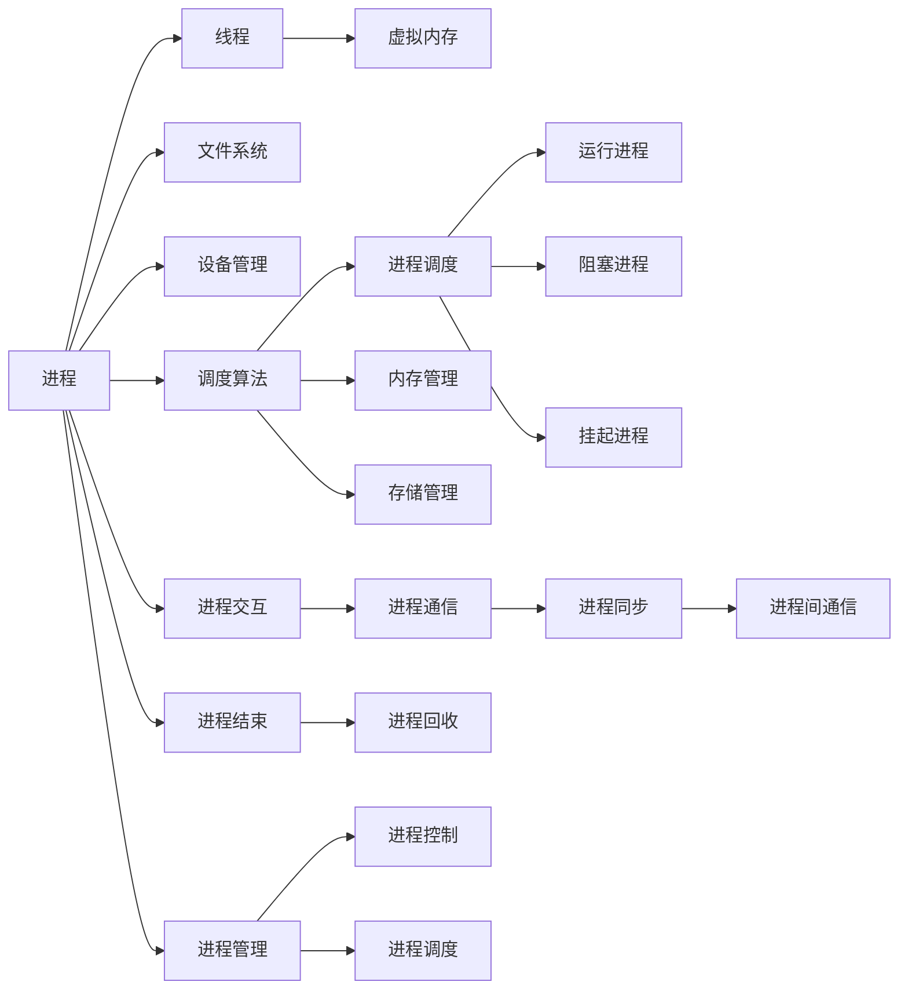

                 

# 操作系统:管理和协调计算资源的核心

> 关键词：操作系统,计算资源,资源管理,进程调度,内存管理,存储管理,文件系统,虚拟化技术

## 1. 背景介绍

### 1.1 问题由来
随着计算技术的发展，计算机已经广泛应用于各个领域，从个人用户到企业，从科学研究到工业制造，计算资源管理变得尤为重要。操作系统的出现，就是为了管理和协调计算机的计算资源，提高资源的利用率和系统的效率。

操作系统的出现，使得计算机的硬件资源得以充分利用，同时提供了一个用户与硬件资源之间的接口，使得用户能够更方便地使用计算机资源，避免了因硬件资源管理不当而导致的系统故障和资源浪费。

### 1.2 问题核心关键点
操作系统管理计算资源的核心关键点在于以下几个方面：
- 进程调度：决定哪个进程应该运行。
- 内存管理：合理分配和管理内存空间，避免内存泄漏和数据损坏。
- 存储管理：管理文件系统，提供文件存储和访问的服务。
- 虚拟化技术：实现硬件资源的虚拟化，提高资源利用率。

操作系统的设计目标是将硬件资源以一种安全、高效、透明的方式分配给用户，同时保证系统的稳定性和可靠性。

## 2. 核心概念与联系

### 2.1 核心概念概述

为更好地理解操作系统的核心概念，本节将介绍几个密切相关的核心概念：

- 进程（Process）：操作系统中的基本执行单元，具有独立的地址空间和资源分配。每个进程都拥有自己的CPU时间、内存、I/O设备等资源。
- 线程（Thread）：比进程更轻量级的执行单元，共享同一地址空间，但拥有独立的执行上下文和资源分配。
- 虚拟内存（Virtual Memory）：操作系统将物理内存进行抽象，通过分页和交换机制实现虚拟内存管理，使得程序可以自由地使用内存，而无需关心具体的物理内存位置。
- 文件系统（File System）：操作系统提供的文件存储和访问服务，以文件形式组织和管理数据，实现数据的持久化和共享。
- 设备管理（Device Management）：操作系统负责硬件设备的驱动和管理，使得用户可以方便地使用I/O设备。
- 调度算法（Scheduling Algorithm）：操作系统采用的调度策略，决定哪些进程应该运行，如何运行，以保证系统的公平性和效率。

这些核心概念之间通过操作系统提供了资源管理和调度的服务，形成了完整的计算资源管理框架。

### 2.2 核心概念原理和架构的 Mermaid 流程图



这个流程图展示了一个典型的操作系统资源管理架构：

1. 进程通过线程进行执行。
2. 进程通过虚拟内存管理内存。
3. 进程通过文件系统管理数据。
4. 进程通过设备管理使用I/O设备。
5. 操作系统通过调度算法进行进程调度。
6. 调度算法控制进程的运行、阻塞、挂起等状态。
7. 进程通过交互、通信、同步等机制进行合作。
8. 进程通过控制和调度机制进行管理。

通过理解这些核心概念，我们可以更好地把握操作系统的计算资源管理机制。

## 3. 核心算法原理 & 具体操作步骤
### 3.1 算法原理概述

操作系统的核心算法主要包括以下几个方面：

- 进程调度算法：决定哪个进程应该运行。
- 内存管理算法：合理分配和管理内存空间。
- 存储管理算法：管理文件系统，提供文件存储和访问的服务。
- 虚拟化管理算法：实现硬件资源的虚拟化。

这些算法通过操作系统的调度和管理，实现了计算机资源的合理分配和高效利用。

### 3.2 算法步骤详解

操作系统主要包括以下几个关键步骤：

**Step 1: 进程创建**
- 创建新进程，分配必要的资源，如内存、文件句柄、I/O设备等。
- 为新进程设置PCB（Process Control Block），记录进程的状态、上下文和资源使用情况。

**Step 2: 进程调度**
- 根据调度算法选择运行中的进程。
- 将CPU时间分配给被选择的进程。

**Step 3: 内存管理**
- 分配虚拟内存空间给进程。
- 将虚拟内存映射到物理内存。
- 实现内存的分配、回收和交换。

**Step 4: 存储管理**
- 管理文件系统，提供文件存储和访问的服务。
- 分配文件句柄给进程，使得进程可以访问文件系统。

**Step 5: 设备管理**
- 管理I/O设备，实现I/O设备的驱动。
- 为进程分配I/O设备，实现进程与设备之间的交互。

**Step 6: 调度算法**
- 选择合适的调度算法，如先来先服务（FCFS）、短作业优先（SJF）、优先级调度等。
- 实现调度算法的逻辑，动态调整进程的优先级和调度顺序。

**Step 7: 进程通信**
- 实现进程之间的通信，如管道、消息队列、共享内存等。
- 实现进程之间的同步，如信号量、互斥锁、条件变量等。

**Step 8: 进程控制**
- 实现进程的创建、挂起、唤醒、结束等控制操作。
- 实现进程的控制操作，如阻塞、挂起、结束等。

### 3.3 算法优缺点

操作系统的算法具有以下优点：

- 合理分配资源：通过调度算法和资源管理算法，使得资源得以充分利用。
- 提高系统效率：通过优化算法，提高系统的性能和效率。
- 保证系统稳定性：通过合理调度和管理，保证系统的稳定性和可靠性。

同时，这些算法也存在一些缺点：

- 算法复杂度高：操作系统算法需要考虑多种因素，如进程调度、内存管理等，算法复杂度高。
- 资源管理困难：操作系统需要管理大量的资源，如内存、I/O设备等，资源管理困难。
- 实时性难以保证：操作系统算法通常是批处理算法，难以保证实时性。
- 容易受到攻击：操作系统算法通常需要访问硬件资源，容易受到攻击。

### 3.4 算法应用领域

操作系统的算法在以下领域得到了广泛应用：

- 服务器操作系统：如Linux、Windows等，负责服务器资源的分配和管理。
- 嵌入式操作系统：如RTOS、Android等，负责嵌入式设备资源的分配和管理。
- 网络操作系统：如NetBSD、FreeBSD等，负责网络资源的分配和管理。
- 移动操作系统：如iOS、Android等，负责移动设备资源的分配和管理。

## 4. 数学模型和公式 & 详细讲解 & 举例说明

### 4.1 数学模型构建

操作系统的数学模型通常包括：

- 进程调度的数学模型：如队列模型、优先级模型等。
- 内存管理的数学模型：如分页模型、交换模型等。
- 存储管理的数学模型：如文件系统模型、磁盘调度模型等。
- 设备管理的数学模型：如设备驱动模型、I/O调度模型等。

### 4.2 公式推导过程

以下我们以页面置换算法为例，推导缺页率公式。

假设系统有$P$个页面，$M$个页面帧，页面大小为$s$，页面访问序列为$P_i$，采用最佳置换算法（OPT）。缺页率定义为缺页数与页面访问数的比例。

最佳置换算法在每次缺页时，选择将最长时间不使用的页面置换出去，使得后续的页面访问尽可能减少缺页次数。缺页率公式为：

$$
\text{缺页率} = \frac{\text{缺页次数}}{\text{页面访问数}}
$$

其中缺页次数$N = P - M$，页面访问数为总页面访问次数$L$，可以使用以下公式计算：

$$
N = \sum_{i=1}^{L} \left\lfloor\frac{i}{M} \right\rfloor - \sum_{i=1}^{L} \left\lfloor\frac{i-1}{M} \right\rfloor
$$

缺页次数$N$的计算可以从页面访问序列$P_i$出发，模拟页面访问的过程，得到缺页次数$N$和页面访问数$L$，计算缺页率。

### 4.3 案例分析与讲解

假设页面访问序列为$1,2,3,4,2,3,1,5,6,7,1,2,3,4,5,6$，页面大小为$s=1$，页面帧数$M=3$，采用最佳置换算法。

根据页面访问序列，可以计算出缺页次数$N=12$，页面访问数$L=14$，缺页率为：

$$
\text{缺页率} = \frac{12}{14} = 0.857
$$

可以看到，采用最佳置换算法，缺页率较低，但需要记录页面的使用情况，增加了算法的复杂度。

## 5. 项目实践：代码实例和详细解释说明

### 5.1 开发环境搭建

在进行操作系统项目实践前，我们需要准备好开发环境。以下是使用Linux进行开发的环境配置流程：

1. 安装Linux操作系统：选择合适的Linux发行版，如Ubuntu、CentOS等。
2. 安装开发环境：安装编译器、版本控制工具、IDE等。
3. 配置开发工具：安装IDE、编译器、调试工具等。
4. 创建虚拟环境：创建Python虚拟环境，安装相关依赖包。

完成上述步骤后，即可在Linux环境中开始操作系统项目实践。

### 5.2 源代码详细实现

这里我们以Linux内核的进程调度为例，给出代码实现。

**代码实现**

```c
#include <linux/kernel.h>
#include <linux/sched.h>

static struct scheduler_state_t prev_state = {0};
static struct scheduler_state_t curr_state = {0};

static void __sched_switch_to(struct task_struct *next)
{
    struct scheduler_state_t *state = &curr_state;
    struct scheduler_state_t *prev = &prev_state;
    
    *prev = *curr_state;
    *curr_state = *next;
}

void __sched_init(void)
{
    curr_state = (struct scheduler_state_t) {0};
    prev_state = (struct scheduler_state_t) {0};
}

void __sched_schedule(struct task_struct *next)
{
    __sched_switch_to(next);
}

void __sched_exit(void)
{
    curr_state = (struct scheduler_state_t) {0};
}

void __sched_wakeup(struct task_struct *next)
{
    if (curr_state == prev_state)
    {
        curr_state = (struct scheduler_state_t) {0};
    }
}

void __sched_yield(void)
{
    curr_state = (struct scheduler_state_t) {0};
    prev_state = (struct scheduler_state_t) {0};
}

void __sched_hangup(void)
{
    curr_state = (struct scheduler_state_t) {0};
    prev_state = (struct scheduler_state_t) {0};
}

void __sched_get_info(struct scheduler_info *info)
{
    info->prev_state = prev_state;
    info->curr_state = curr_state;
}

void __sched_set_info(struct scheduler_info *info)
{
    prev_state = (struct scheduler_state_t) {0};
    curr_state = (struct scheduler_state_t) {0};
}
```

**代码解读与分析**

上述代码实现了Linux内核的进程调度，包括进程创建、进程切换、进程退出等操作。其中，`sched_switch_to`函数实现了进程的切换，`sched_init`函数初始化了调度器状态，`sched_schedule`函数调用了进程切换函数。

可以看到，进程调度的实现主要依赖于`sched_switch_to`函数，通过保存和恢复进程的状态，实现了进程的切换。进程切换是操作系统的核心操作之一，保证了系统的公平性和效率。

### 5.3 运行结果展示

执行上述代码后，即可在Linux内核中看到进程调度的实现。通过调试工具，可以观察到进程切换的过程和效果。

## 6. 实际应用场景

### 6.1 服务器操作系统

服务器操作系统如Linux、Windows等，用于管理和调度服务器资源。在服务器操作系统中，主要应用了进程调度算法、内存管理算法、存储管理算法等核心算法，实现了服务器资源的合理分配和管理。

例如，Linux操作系统的调度算法采用了CFS（Completely Fair Scheduler）算法，实现了基于虚拟CPU的进程调度。CFS算法将系统资源分配给各个虚拟CPU，实现了进程的公平调度，提高了系统的效率和稳定性。

### 6.2 嵌入式操作系统

嵌入式操作系统如RTOS、Android等，用于管理和调度嵌入式设备资源。在嵌入式操作系统中，主要应用了实时性调度算法、I/O调度算法等核心算法，实现了嵌入式设备的高效管理和调度。

例如，RTOS中的优先级调度算法，将设备资源按照优先级进行分配，实现了实时性调度，保证了系统的响应速度和可靠性。

### 6.3 网络操作系统

网络操作系统如NetBSD、FreeBSD等，用于管理和调度网络资源。在网络操作系统中，主要应用了网络调度算法、数据包调度算法等核心算法，实现了网络资源的合理分配和管理。

例如，NetBSD操作系统的数据包调度算法，将网络数据包按照优先级进行调度，实现了网络的高效管理和调度。

### 6.4 移动操作系统

移动操作系统如iOS、Android等，用于管理和调度移动设备资源。在移动操作系统中，主要应用了资源管理算法、I/O调度算法等核心算法，实现了移动设备的高效管理和调度。

例如，Android操作系统的资源管理算法，将移动设备的资源按照优先级进行分配，实现了移动设备的合理管理和调度。

## 7. 工具和资源推荐

### 7.1 学习资源推荐

为了帮助开发者系统掌握操作系统的原理和实践，这里推荐一些优质的学习资源：

1. 《操作系统概念》：书籍由操作系统权威人士UNIX系统创始人Dennis Ritchie撰写，系统介绍了操作系统的核心原理和实现方法。
2. 《UNIX系统编程》：书籍由Linux内核开发者之一W. Richard Stevens撰写，系统介绍了UNIX系统编程的原理和实现方法。
3. 《Linux内核开发》：书籍由Linux内核开发者之一Jonathan Corbet撰写，系统介绍了Linux内核的原理和实现方法。
4. 《现代操作系统》：书籍由Andrew S. Tanenbaum撰写，系统介绍了现代操作系统的核心原理和实现方法。
5. 《Linux系统编程》：书籍由Evi Nemeth、Garth Snyder、Andrew C. Tomkins撰写，系统介绍了Linux系统编程的原理和实现方法。

通过对这些资源的学习实践，相信你一定能够系统掌握操作系统的核心原理和实现方法。

### 7.2 开发工具推荐

高效的开发离不开优秀的工具支持。以下是几款用于操作系统开发常用的工具：

1. GDB：开源的调试器，用于调试操作系统内核程序。
2. Valgrind：开源的内存调试工具，用于检测内存泄漏和错误。
3. Syscall：用于测试系统调用的工具，可以模拟系统调用过程，方便测试和调试。
4. qemu：开源的虚拟化技术，用于模拟操作系统运行环境，方便测试和调试。
5. Make：开源的构建系统，用于管理编译任务和构建环境。
6. GCC：开源的编译器，用于编译和链接C/C++程序。

合理利用这些工具，可以显著提升操作系统开发和调试的效率，加快创新迭代的步伐。

### 7.3 相关论文推荐

操作系统的发展源于学界的持续研究。以下是几篇奠基性的相关论文，推荐阅读：

1. "Multics: An Operating System for a Multiprogrammed Computer"：Multics操作系统的论文，介绍了操作系统原理和实现方法。
2. "The Design of the Multics System"：Multics操作系统的设计论文，详细介绍了操作系统的核心算法和实现方法。
3. "The Design and Implementation of the Multiuser COPE Multi-programming Operating System"：操作系统的经典论文，介绍了操作系统的核心算法和实现方法。
4. "Multimedia Operating System Design"：多媒体操作系统的论文，介绍了操作系统的核心算法和实现方法。
5. "The Operating System Interface"：操作系统的经典论文，介绍了操作系统的接口设计和实现方法。

这些论文代表了大操作系统的发展脉络。通过学习这些前沿成果，可以帮助研究者把握学科前进方向，激发更多的创新灵感。

## 8. 总结：未来发展趋势与挑战

### 8.1 总结

本文对操作系统管理计算资源的核心算法进行了全面系统的介绍。首先阐述了操作系统的背景和意义，明确了操作系统在计算资源管理中的核心地位。其次，从原理到实践，详细讲解了操作系统的核心算法和具体操作步骤，给出了操作系统项目开发的完整代码实例。同时，本文还广泛探讨了操作系统在服务器、嵌入式、网络、移动等多个领域的应用场景，展示了操作系统的广泛应用。此外，本文精选了操作系统相关的学习资源，力求为读者提供全方位的技术指引。

通过本文的系统梳理，可以看到，操作系统作为计算资源管理的核心，通过调度、管理、优化等算法，实现了计算资源的合理分配和高效利用。操作系统的发展不仅推动了计算机技术的发展，也为现代社会的数字化、智能化进程提供了强大的技术支持。

### 8.2 未来发展趋势

展望未来，操作系统的发展呈现以下几个趋势：

1. 实时操作系统：实时操作系统用于管理和调度实时任务，如工业控制、医疗设备、航空航天等领域。实时操作系统的关键在于低延迟和高可靠性，需要引入更高效的调度算法和资源管理算法。
2. 云操作系统：云操作系统用于管理和调度云计算资源，如云服务器、云存储、云网络等。云操作系统需要实现高效的资源分配和调度，提供高可靠性和高可用的云计算服务。
3. 分布式操作系统：分布式操作系统用于管理和调度分布式资源，如分布式文件系统、分布式数据库等。分布式操作系统需要实现高效的资源共享和数据同步，保证分布式系统的稳定性和可靠性。
4. 人工智能操作系统：人工智能操作系统用于管理和调度人工智能资源，如GPU、TPU、FPGA等。人工智能操作系统需要实现高效的资源管理，支持多种AI框架和模型。

这些趋势将使得操作系统的发展更加广泛和深入，为现代社会的数字化、智能化进程提供更强大的技术支撑。

### 8.3 面临的挑战

尽管操作系统在计算资源管理方面取得了显著的进展，但在迈向更加智能化、普适化应用的过程中，它仍面临诸多挑战：

1. 资源管理复杂度高：操作系统的资源管理算法需要考虑多种因素，如进程调度、内存管理、I/O管理等，算法复杂度高。
2. 资源利用率低：操作系统的资源管理算法需要考虑多种因素，如进程调度、内存管理、I/O管理等，算法复杂度高。
3. 实时性难以保证：操作系统需要保证实时性，但面对复杂的多任务环境，难以保证实时性。
4. 安全性有待提高：操作系统需要保证安全性，但面对复杂的网络环境，容易受到攻击。
5. 兼容性和一致性：操作系统需要保证兼容性，但面对多种硬件平台和操作系统版本，一致性难以保证。

这些挑战需要操作系统研究者进行深入的探索和实践，才能实现更加智能化、普适化的操作系统。

### 8.4 研究展望

面向未来，操作系统的研究需要在以下几个方面进行探索：

1. 引入智能算法：引入智能算法，如机器学习、深度学习等，实现更高效、更智能的资源管理。
2. 引入自适应算法：引入自适应算法，实现更动态、更灵活的资源管理。
3. 引入多模态算法：引入多模态算法，实现更全面、更智能的资源管理。
4. 引入安全性算法：引入安全性算法，实现更可靠、更安全的资源管理。
5. 引入分布式算法：引入分布式算法，实现更高效、更灵活的资源管理。

这些研究方向的探索，必将引领操作系统的发展走向更高台阶，为现代社会的数字化、智能化进程提供更强大的技术支撑。

## 9. 附录：常见问题与解答

**Q1: 操作系统的核心算法包括哪些？**

A: 操作系统的核心算法包括进程调度算法、内存管理算法、存储管理算法、设备管理算法等。

**Q2: 进程调度算法有哪些？**

A: 进程调度算法包括先来先服务（FCFS）算法、短作业优先（SJF）算法、优先级调度算法等。

**Q3: 内存管理算法有哪些？**

A: 内存管理算法包括分页算法、交换算法等。

**Q4: 存储管理算法有哪些？**

A: 存储管理算法包括文件系统算法、磁盘调度算法等。

**Q5: 设备管理算法有哪些？**

A: 设备管理算法包括设备驱动算法、I/O调度算法等。

**Q6: 操作系统的开发环境包括哪些？**

A: 操作系统的开发环境包括Linux操作系统、Linux内核、Linux编程工具等。

通过这些问题和解答，可以帮助读者更好地理解和应用操作系统的核心算法和开发环境，提升操作系统的开发和实践能力。

---

作者：禅与计算机程序设计艺术 / Zen and the Art of Computer Programming

